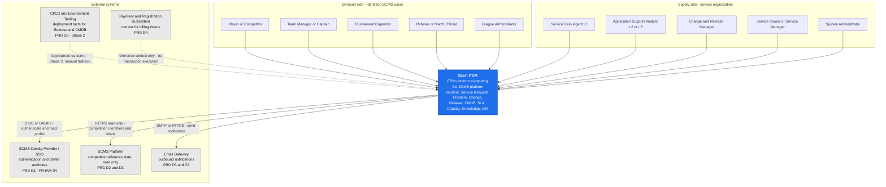
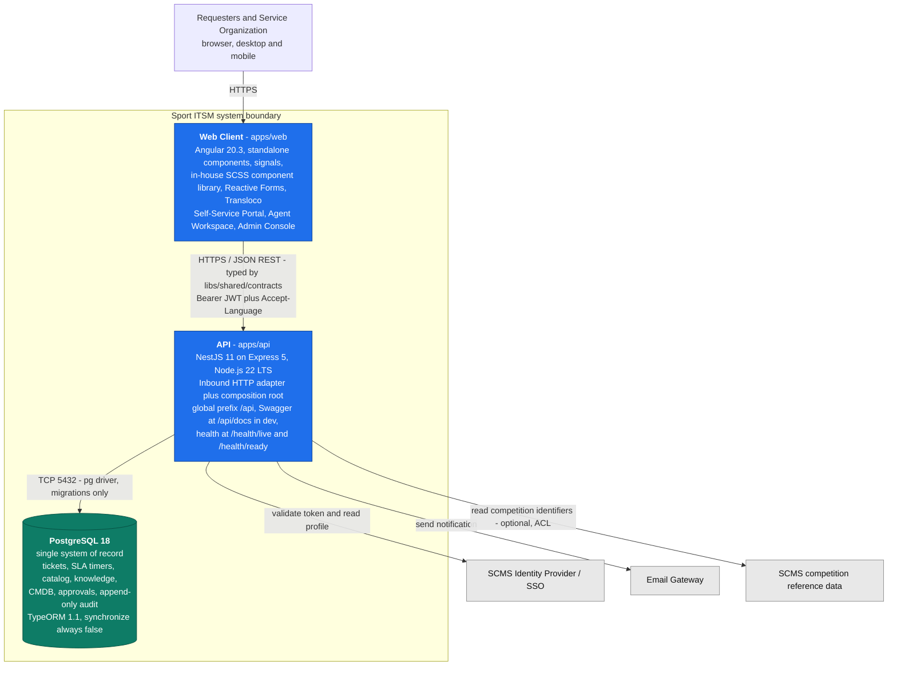
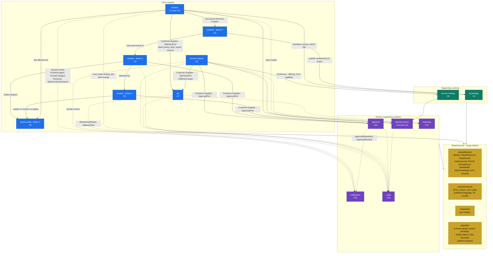
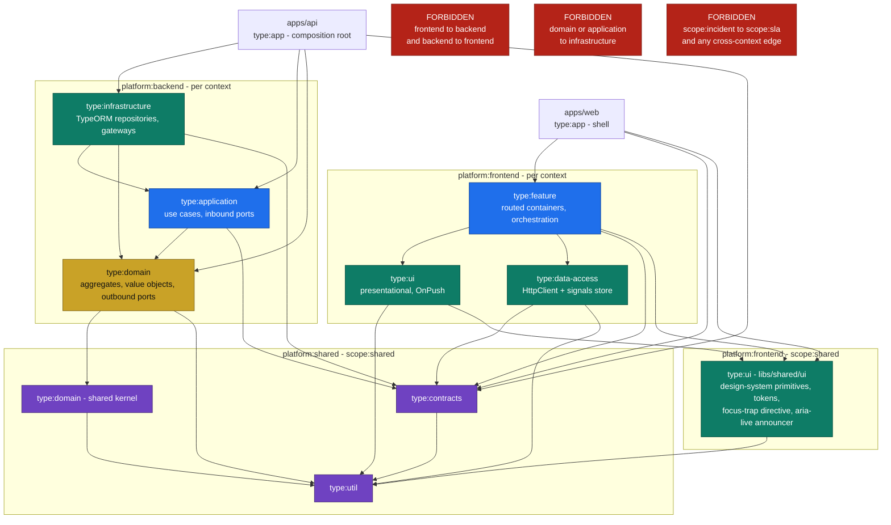
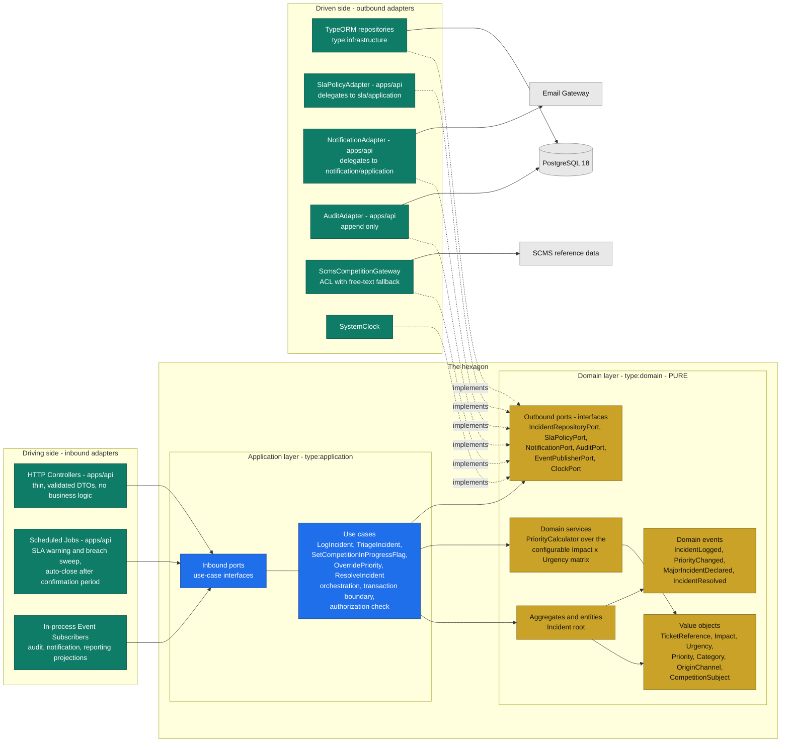
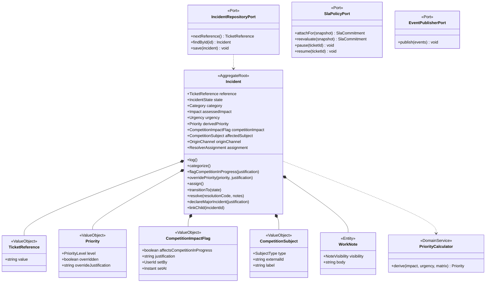
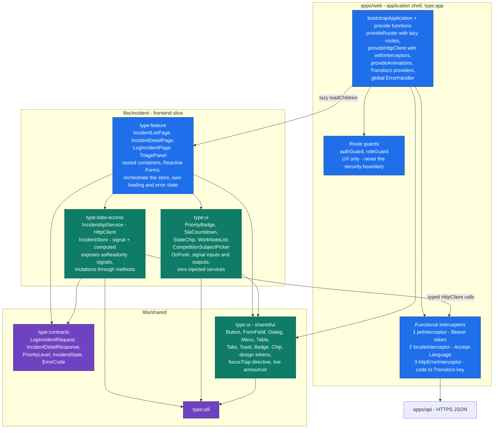
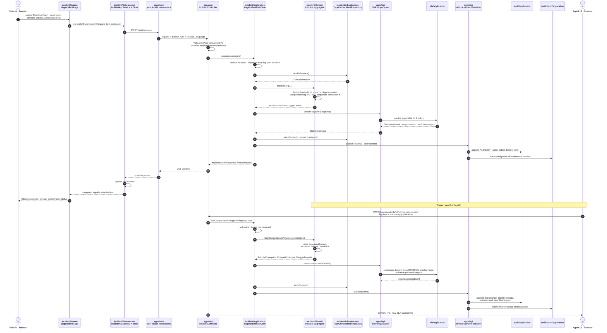

# Sport ITSM — Architecture Document

| Field | Value |
|---|---|
| Product | **Sport IT Service Management ("Sport ITSM")** |
| Supported service | **Sports Competition Management System (SCMS)** |
| Document type | Software Architecture Document — structural, technology-bearing |
| Owner | Software Architect, Sport ITSM |
| Status | **Target architecture — design intent, not as-built** |
| Authoritative inputs | `CLAUDE.md` (stack, layout, tags), `docs/PRD.md` (behavior, phasing), `readme.md` §0.3/§1.1/§1.2 (ubiquitous language) |
| Governing standards | `sport-itsm-architecture` (structure), `sport-itsm-backend`, `sport-itsm-frontend`, `sport-itsm-engineering-principles` |
| Language standard | Technical English, standard DDD / ITSM terminology |

> ## Reading notice — this document describes a target, not an implementation
>
> **This document is still ahead of the code.** The Nx workspace exists, `apps/api` + `apps/web` + both E2E suites are scaffolded (`T-C10-01` … `T-C10-06`), and `libs/` now holds exactly one library — `libs/shared/util` (`T-C10-07`), the pure-helper corner of the shared kernel. Everything else is still absent: no `shared/contracts`, no `shared/domain`, no `shared/ui`, no bounded-context library, no domain model, no adapter. Every context, port, adapter and **every dependency edge** below is therefore **prescriptive design intent** that scaffolding must still produce, not documentation of code that has been written — the two applications remain composition roots wired to nothing, and the graph still has zero edges. See §12.3 for the check-by-check status. Statements are written in the present tense for readability; read them as "shall be" wherever §12.3 does not say otherwise.
>
> **Behavioral authority is the PRD.** Where `readme.md` §1.2 still mentions *live windows*, *event-aware SLA policies*, *deployment freeze windows*, *change calendars around competition windows* or a *public/spectator surface*, those concepts are **superseded and out of scope** (PRD §3.3, §11 K5, FR-CHG-07 retired). This architecture therefore contains **no competition-calendar model, no time-based SLA modulation, no freeze-window engine and no anonymous surface**. Competition impact is a single agent-set boolean with mandatory justification that raises assessed Impact inside the configurable **Impact x Urgency** matrix (FR-INC-05, FR-SLA-04).
>
> **No business rules are invented here.** Every capability, lifecycle and constraint referenced traces to a PRD functional requirement ID. Structure is owned by this document; behavior is owned by `docs/product/PRD.md`.

---

## Table of Contents

1. [Architectural Drivers and Principles](#1-architectural-drivers-and-principles)
2. [Level 1 — System Context](#2-level-1--system-context-c4-l1)
3. [Level 2 — Containers](#3-level-2--containers-c4-l2)
4. [Bounded Context Map](#4-bounded-context-map-ddd-strategic)
5. [Nx Monorepo Structure, Tags and Boundaries](#5-nx-monorepo-structure-tags-and-boundaries)
6. [Backend — Hexagonal Architecture](#6-backend--hexagonal-architecture)
7. [Frontend — Angular Architecture](#7-frontend--angular-architecture)
8. [End-to-End Flow Across Both Platforms](#8-end-to-end-flow-across-both-platforms)
9. [Cross-Cutting Architecture](#9-cross-cutting-architecture)
10. [Key Structural Decisions](#10-key-structural-decisions)
11. [Out of Scope for the MVP](#11-out-of-scope-for-the-mvp)
12. [Verification and Governance](#12-verification-and-governance)

---

## 1. Architectural Drivers and Principles

### 1.1 Drivers taken from the PRD

| Driver | PRD source | Architectural consequence |
|---|---|---|
| 24x7 availability of intake; Sport ITSM is itself a critical service | NFR-AVL-01/02 | Health probes and stateless API instances; intake path must not depend on optional subsystems |
| Intake must survive degradation of knowledge, reporting and notifications | NFR-AVL-03 | Notification, knowledge and reporting are **separate contexts behind ports**; their failure cannot fail the ticket transaction |
| Immutable, reconstructable history; no role may mutate it | FR-AUD-01/03, NFR-AUD-02 | An append-only `audit` context fed by domain events; no update or delete adapter is provided at all |
| Everything configurable without a release | NFR-CFG-01, FR-WFL-01 | Taxonomy, Impact x Urgency matrix, SLA policies, workflows, approvals and notification templates are **data**, not code |
| SLA timers accurate across restarts | NFR-AVL-05 | Timer state persisted in PostgreSQL; elapsed time derived from stored timestamps, never from in-memory counters |
| Server-side authorization on every operation | NFR-SEC-02 | Authorization is enforced in the backend application layer; the Angular client never holds a security decision |
| Full localizability, English and Spanish at launch | NFR-I18N-01/02 | Transloco on the client, `nestjs-i18n` on the API driven by `Accept-Language` propagated by a locale interceptor |
| Academic/portfolio delivery capacity | K8 | One deployable API and one deployable web client — a modular monolith, not microservices |

### 1.2 Non-negotiable structural principles

1. **One system, two platforms.** Frontend and backend are governed as a single architecture and integrate **only** through `libs/shared/contracts`. Neither may depend on the other.
2. **Dependencies point inward.** `type:domain` and `type:application` contain no framework, ORM, HTTP or I/O import. Adapters depend on the core; the core never depends on adapters.
3. **Contexts are isolated.** A `scope:<context>` project may depend only on itself and `scope:shared`. Cross-context interaction happens through ports resolved at the composition root, or through domain events.
4. **Boundaries are mechanical.** Every rule above is encoded as Nx tags plus `@nx/enforce-module-boundaries`. An illegal dependency means the design is wrong; the rule is never relaxed.
5. **Modular monolith, context-ready for extraction.** A single NestJS process hosts all contexts, but no context may be coupled in a way that would prevent extracting it later.

---

## 2. Level 1 — System Context (C4 L1)

Sport ITSM serves **identified SCMS users and the service organization only**. There is no anonymous or public surface, no spectator persona and no public Knowledge Base (FR-IAM-01, FR-KNW-03, PRD §3.3).



**Boundary notes**

- **SCMS is not a data master for Sport ITSM.** Sport ITSM consumes competition **identifiers and labels** only, so a ticket can name its affected subject accurately. It does not import, maintain or reason over a competition calendar (PRD D2, §3.3). Free-text capture of the affected competition instance is the accepted MVP fallback (R10), which means the SCMS integration is **optional at runtime** and sits behind an anti-corruption port.
- **Payment execution stays outside.** Sport ITSM records and supports payment-related Incidents and Requests; it never executes transactions (PRD §3.3).
- **CI/CD integration is phase 2** and has a manual fallback (D6), so it is a port with a human-operated adapter first.

---

## 3. Level 2 — Containers (C4 L2)

Three deployable/runtime containers plus the identity dependency. Deliberately no message broker, no cache tier and no separate reporting store in the MVP — PostgreSQL 18 is the single system of record (constraint K8).



### 3.1 Container responsibilities

| Container | Responsibility | Explicitly NOT responsible for |
|---|---|---|
| **`apps/web` — Angular client** | Render the Self-Service Portal, Agent Workspace and Admin Console; capture input with Reactive Forms; hold view state in signals; attach JWT and `Accept-Language`; present loading, error and empty states; WCAG 2.1 AA. | Any authorization decision, any priority derivation, any SLA computation, any lifecycle rule. The UI **reflects** server decisions; it never makes them (NFR-SEC-02). |
| **`apps/api` — NestJS API** | Terminate HTTP; validate DTOs; authenticate and authorize; **compose** the hexagon by binding ports to adapters; execute use cases transactionally; emit and dispatch domain events; expose health and OpenAPI. | Business logic in controllers. Controllers are thin inbound adapters only. |
| **PostgreSQL 18** | Durable state for every context, including SLA timer timestamps and the append-only audit trail. Schema evolves **only** through TypeORM migrations. | Business logic. No triggers or stored procedures carrying domain rules; the domain lives in TypeScript. |

### 3.2 Protocols and cross-cutting HTTP contract

| Concern | Decision |
|---|---|
| Transport | HTTPS, JSON, REST. Route prefix `/api`; health endpoints **not** prefixed. |
| Typing | Request and response shapes are declared once in `libs/shared/contracts` and imported by both platforms — the only permitted FE/BE coupling. |
| AuthN | `Authorization: Bearer <JWT>` issued after Passport JWT verification; `bcrypt` for local credentials until SSO federation lands (FR-IAM-04 is **Should**, phase 2+). The token is the whole of the MVP's session state: **no server-side session record exists**, a scope decision owned by DATA-MODEL §6.4 / M11 that `FR-IAM-06` may reverse. This row has been cited as the authority for "stateless JWT"; it is not — it fixes the credential format only. "Stateless" elsewhere in this document (ADR-004) means horizontally scalable API *instances*, which says nothing about where session state may live. |
| i18n | Client sets `Accept-Language`; `nestjs-i18n` localizes API error messages and email templates (NFR-I18N-01/02/04). |
| Errors | Domain errors are mapped by a NestJS exception filter to a stable, contract-declared error-code envelope; the client maps codes to Transloco keys. Error codes are part of the contract, error **text** is not. |
| Time | All instants persisted and computed in UTC; the client renders in the user's locale and time zone (NFR-I18N-03). |

---

## 4. Bounded Context Map (DDD strategic)

### 4.1 Contexts

Ten baseline capability contexts from the architecture standard, plus a shared kernel, plus four **generic supporting contexts** that materialize the PRD's cross-cutting capabilities (C15 Approval, C16 Notification, C17 Reporting, C18 Audit). Introducing supporting contexts extends the baseline list and therefore **requires an ADR** — see [ADR-001](#adr-001--four-generic-supporting-contexts-for-cross-cutting-capabilities).

| Context | Type | PRD capability | Aggregate roots (target) | Phase |
|---|---|---|---|---|
| `incident` | Core | C1, C13 | `Incident` (root), `MajorIncident` declaration on the Incident root | 1 |
| `service-request` | Core | C2 | `ServiceRequest` (root) with `FulfillmentTask` entities | 1 |
| `sla` | Core | C7 | `SlaPolicy`, `SlaInstance` (timer state), `SupportSchedule` (owns its wall-clock `OpeningWindow` and `HolidayDate` values, DATA-MODEL §20.5) | 1 |
| `service-catalog` | Supporting | C8 | `Service`, `ServiceOffering` | 1 |
| `knowledge` | Supporting | C9 | `KnowledgeArticle` | 1 |
| `identity-access` | Generic | C10, C14 | `User`, `Role`, `ResolverGroup` | 0 / 1 |
| `approval` | Generic | C15 | `ApprovalRequest` with immutable `ApprovalDecision` | 1 |
| `notification` | Generic | C16 | `NotificationDispatch` | 1 |
| `audit` | Generic | C18 | `AuditEntry` (append-only, no root mutation) | 0 |
| `reporting` | Generic | C17 | read models only, no aggregate | 1 |
| `problem` | Core | C3 | `Problem`, `KnownError` | 2 |
| `change` | Core | C4 | `Change` | 2 |
| `release` | Core | C5 | `Release` | 2 |
| `asset-config` | Core | C6 | `ConfigurationItem` with typed `CiRelationship` | 2 |
| `shared` | Shared kernel | — | no aggregates; primitives only | 0 |

Two PRD cross-cutting capabilities deliberately get **no context of their own**:

- **C11 Omnichannel Intake** is an *adapter concern*, not a domain. Portal and agent-logged intake are the same inbound HTTP adapter over the same use case; email-to-ticket (phase 3) becomes an additional inbound adapter. Only `originChannel` (FR-OMN-02) enters the domain, as a value object.
- **C12 Workflow and Automation** is realized as **configurable data interpreted by each context's domain**: a state-model and transition-rule primitive lives in `shared/domain`, and each context owns its own configured lifecycle (FR-INC-06, FR-SRQ-05, FR-CHG-04, FR-REL-03, FR-PRB-03). A central workflow engine context is explicitly rejected — it would become a god context every other context depends on, violating isolation.

### 4.2 Context map with integration patterns



**Legend.** Solid arrows are **synchronous** collaborations expressed as an outbound port owned by the upstream consumer. Dashed arrows are **asynchronous** collaborations carried by **domain events** published in-process. In both cases the arrow is a *conceptual* dependency: at the Nx level neither context imports the other (see §5.4).

**Shared-kernel temporal primitives.** `DateTimeRange` is a **half-open interval of UTC instants** — `[startsAt, endsAt)`, lower bound mandatory, upper bound **optional** (absent means open-ended), empty ranges rejected. It earns its place in the kernel because three contexts repeat the same temporal-validity shape — each with a **strict** `to > from` check in the schema: `identity-access` (competition-scope grants), `approval` (approver delegation) and `sla` (policy-version effective range). Those three clear the "used by three or more contexts" bar of the §12.2 checklist (item 6) on their own. Instant pairs whose schema check is deliberately **non-strict** — `iam_user_role` (`granted_at` / `revoked_at`) and `sla_pause_period` (`paused_at` / `resumed_at`), where `FixedClock` can legitimately place both instants on the same tick — are **not** `DateTimeRange`: they stay as two columns on their own aggregate rather than force the kernel to admit the empty range (DATA-MODEL §2). It is **not** a wall-clock type. A naive local time or date interpreted in some *other* calendar and zone — the `sla` support-schedule opening windows and holidays (DATA-MODEL §3.3, §20.5) — is not a `DateTimeRange`, cannot be expressed as one without inventing a date, and is never promoted into `shared/domain`: it is vocabulary of the support-schedule aggregate and stays in `sla`. The kernel holds UTC instants only, and `ClockPort` (ADR-009) remains the only source of "now".

### 4.3 Integration patterns applied

| Relationship | Pattern | Rationale |
|---|---|---|
| `incident` / `service-request` → `sla` | **Customer-Supplier** | The ticket contexts drive SLA requirements: attach a policy at creation, re-evaluate on priority change (FR-SLA-02, FR-SLA-04), pause and resume on pending states (FR-INC-08, FR-SLA-08). `sla` is a conscious upstream supplier that publishes a stable port. |
| `service-request` → `service-catalog` | **Conformist** | A Service Request exists only for a published offering (FR-SRQ-01). `service-request` conforms to the catalog's model of offering, form definition and eligibility rules rather than translating it. |
| `service-request` / `change` / `release` → `approval` | **Customer-Supplier via Open Host Service** | One generic approval engine serves three consumers with configurable stages and resolvable approvers (FR-APR-01/02). It exposes a single published port. |
| Everything → `audit` | **Published Language over domain events** | Audit consumes a normalized `AuditEntry` shape (actor, timestamp, record reference, action, previous value, new value — FR-AUD-02). Contexts never call audit; they publish events and audit subscribes. This is what makes FR-AUD-03 immutability structurally true: **no context is given a handle to mutate audit.** |
| Everything → `notification` | **Published Language over domain events** | Guarantees NFR-AVL-03: a failing notification adapter cannot fail a ticket transaction, because dispatch happens after commit. |
| Everything → `reporting` | **Open Host / read models** | Reporting reads its own denormalized projections; it never joins into another context's tables at will. Guarantees reproducibility (FR-RPT-07). |
| Sport ITSM → SCMS reference data | **Anticorruption Layer** | Each consuming context declares its **own** `CompetitionSubjectLookupPort` in its own domain — `incident`, `service-request` and `identity-access` each do — and a single SCMS gateway adapter plus a free-text fallback adapter (R10) implements them, wired at the composition root (ADR-003), exactly as `SlaPolicyPort` is (§6.2). The port is **not** in `shared/domain` and `CompetitionSubject` is **not** a kernel primitive; see the note below. SCMS vocabulary never leaks into the ticket model. |
| Sport ITSM → SSO | **Anticorruption Layer** | An `IdentityProviderPort` in `identity-access` isolates the platform from the SCMS identity model (A2, FR-IAM-04). |

**Why `CompetitionSubject` is not a shared-kernel primitive.** The `(subject type, opaque external id, free-text label)` shape recurs in three contexts — the affected subject of a ticket in `incident` and `service-request`, the target of a visibility grant in `identity-access` — so by headcount alone it appears to clear the "three or more contexts" bar of §12.2 (item 6). It does not, because **a shared shape is not a shared meaning**: these are different concepts that happen to look alike, and the data model already refuses to unify them. Each schema declares its *own* `competition_subject_enum` with its own value set — `iam`'s three values (`tournament`, `league`, `group_division`) are narrower than `incident`'s twelve **by design**, and `reporting` mirrors the values rather than importing them precisely so that a projection takes no type dependency on another context (DATA-MODEL §20.1, §20.3, §20.10). A kernel `CompetitionSubject` would have to carry the union of those sets and hand every context a vocabulary it deliberately does not speak: coupling by coincidence, and the god-kernel the shared-library guardrails exist to prevent. Promoting the *port* has the same defect applied to an **external** system's vocabulary — which is the one thing an anticorruption layer exists to keep per-consumer. `CompetitionSubject` therefore stays a value object of each consuming context's own domain, as §6.2 already draws it for `incident`; what the contexts share is the *pattern*, not the type.

---

## 5. Nx Monorepo Structure, Tags and Boundaries

### 5.1 Target project tree (MVP shape, phase 1)

Phase 2 contexts are shown for completeness and **are not scaffolded in phase 1** — generate only libs a context actually uses.

```text
apps/
  api/                    platform:backend  scope:shared  type:app     NestJS composition root + inbound HTTP adapter
  api-e2e/                platform:backend  scope:shared  type:e2e     Cypress + Cucumber API acceptance tests
  web/                    platform:frontend scope:shared  type:app     Angular shell: routing, providers, interceptors
  web-e2e/                platform:frontend scope:shared  type:e2e     Cypress + Cucumber UI acceptance tests

libs/
  shared/
    contracts/            platform:shared   scope:shared  type:contracts    DTOs, enums, error codes - FE + BE
    domain/               platform:shared   scope:shared  type:domain       shared kernel primitives
    ui/                   platform:frontend scope:shared  type:ui           in-house design system - primitives, tokens, a11y
    util/                 platform:shared   scope:shared  type:util          pure helpers

  incident/
    domain/               platform:backend  scope:incident type:domain          Incident aggregate + ports
    application/          platform:backend  scope:incident type:application     use cases
    infrastructure/       platform:backend  scope:incident type:infrastructure  TypeORM repos, gateways
    feature/              platform:frontend scope:incident type:feature         routed feature libs
    ui/                   platform:frontend scope:incident type:ui              presentational components
    data-access/          platform:frontend scope:incident type:data-access     HttpClient + signals store

  service-request/        same six libs                              scope:service-request
  sla/                    domain, application, infrastructure        scope:sla            (no UI of its own; surfaced inside ticket views)
  service-catalog/        six libs                                   scope:service-catalog
  knowledge/              six libs                                   scope:knowledge
  identity-access/        domain, application, infrastructure,
                          feature, data-access                       scope:identity-access
  approval/               domain, application, infrastructure,
                          feature, ui, data-access                   scope:approval
  notification/           domain, application, infrastructure,
                          data-access                                scope:notification
  audit/                  domain, application, infrastructure, ui    scope:audit
  reporting/              domain, application, infrastructure,
                          feature, ui, data-access                   scope:reporting

  problem/  change/  release/  asset-config/                         phase 2 - not scaffolded in phase 1
```

### 5.2 Tag scheme

Every project carries **exactly three tags**, no exceptions.

| Axis | Allowed values |
|---|---|
| `platform:` | `platform:backend`, `platform:frontend`, `platform:shared` |
| `scope:` | `scope:<context>` for each context in §4.1, or `scope:shared` |
| `type:` | `type:domain`, `type:application`, `type:infrastructure`, `type:feature`, `type:ui`, `type:data-access`, `type:contracts`, `type:util`, plus `type:app` and `type:e2e` for applications — see [ADR-002](#adr-002--typeapp-and-typee2e-added-to-the-type-axis) |

> **`scope:shared` does not imply `platform:shared`.** `platform:shared` is reserved for framework-free code that both platforms can import — `shared/contracts`, `shared/domain`, `shared/util`. `libs/shared/ui`, the in-house design system, is Angular code with a shared scope and is therefore tagged **`platform:frontend`, `scope:shared`, `type:ui`** (see [ADR-010](#adr-010--libssharedui-is-the-in-house-design-system-tagged-platformfrontend--scopeshared)). Read the platform tag per project, never per folder.

### 5.3 Type constraint matrix (enforced by `@nx/enforce-module-boundaries`)

The baseline matrix from the architecture standard, extended with the two application types.

| From \ May depend on | domain | application | infrastructure | feature | ui | data-access | contracts | util | app |
|---|---|---|---|---|---|---|---|---|---|
| **type:domain** | yes | no | no | no | no | no | no | yes | no |
| **type:application** | yes | yes | no | no | no | no | yes | yes | no |
| **type:infrastructure** | yes | yes | yes | no | no | no | yes | yes | no |
| **type:feature** | no | no | no | yes | yes | yes | yes | yes | no |
| **type:ui** | no | no | no | no | yes | no | no | yes | no |
| **type:data-access** | no | no | no | no | no | yes | yes | yes | no |
| **type:contracts** | no | no | no | no | no | no | yes | yes | no |
| **type:util** | no | no | no | no | no | no | no | yes | no |
| **type:app** | yes | yes | yes | yes | yes | yes | yes | yes | no |
| **type:e2e** | no | no | no | no | no | no | yes | yes | no |

Plus the two orthogonal rules:

- **scope rule** — a `scope:<context>` project may depend only on the same `scope:<context>` and on `scope:shared`. `scope:shared` may depend only on `scope:shared`.
- **platform rule** — `platform:frontend` and `platform:backend` may **never** depend on each other; both may depend on `platform:shared`.

`type:app` is the only type allowed to reach across contexts, and it does so **because it is the composition root** (§5.4). Its scope tag is `scope:shared`, so the scope rule does not block it.

`libs/shared/ui` is the only library that combines `scope:shared` with `platform:frontend`, and it needs **no exception** to the matrix above. Every `platform:frontend` project may depend on it — a context's `type:feature`, a context's own `type:ui` and the `apps/web` shell — because the `type:` rows already allow `feature → ui`, `ui → ui` and `app → ui`, and the scope rule allows `scope:<context> → scope:shared`. It may itself depend only on `scope:shared` `type:util`: its own `type:ui` row forbids `contracts`, `data-access`, `feature`, `application` and `infrastructure`, so its component inputs are primitives and locally declared unions, never contract enums. And no backend project can reach it, because the platform rule forbids `platform:backend → platform:frontend`.

### 5.4 Allowed dependency graph



**How cross-context collaboration stays legal.** `scope:incident` must not import `scope:sla` — yet an Incident needs an SLA policy attached at creation (FR-SLA-02). The resolution is strict Dependency Inversion at the module level:

1. `libs/incident/domain` declares the **outbound port** it needs, in its own ubiquitous language, e.g. `SlaPolicyPort` with `attachPolicyFor(ticketSnapshot): SlaCommitment`.
2. `libs/incident/application` depends on that port only.
3. `apps/api` — the composition root, tagged `scope:shared`, `type:app` — provides an **adapter class** implementing `SlaPolicyPort` by delegating to `libs/sla/application`. Only the app sees both contexts.
4. The Nx graph therefore shows `apps/api → incident/*` and `apps/api → sla/*`, and **never** `incident → sla`.

The same technique carries `approval`, `notification`, `audit` and the SCMS anti-corruption layer. This is the single most important structural rule in this document.

### 5.5 Scaffolding commands

Structure is materialized only with Nx generators, always with explicit tags. Every invocation below is **executable as written**: copy it whole, do not trim it to the tags. Run it once with `--dry-run --no-interactive` first — the dry run lists every file it would create *and* every workspace file it would update, which is the cheapest way to catch a wrong name or an unintended `nx.json` edit.

Three properties of the Nx 21.6 generators make any shorter form unsafe, and all three were paid for once already:

1. **The project name is a flag, never a positional.** In `@nx/js:lib` the first positional argument is bound to `directory`, not to `name`. Passing the project name positionally *and* `--directory=` makes the generator drop the positional **silently** and name the project after the last directory segment — `libs/shared/util` yields a project called `util`, so `pnpm nx test shared-util` then fails against a project that does not exist, and `jest.config.ts` carries `displayName: 'util'`. `@nx/angular:lib` is stricter and fails outright with `Schema does not support positional arguments`, so the Angular commands do not run at all. Always pass `--name=`.
2. **The generator defaults are not this architecture's defaults.** `@nx/js:lib` defaults to `--bundler=tsc`, which gives the library its own `package.json` — activating the `banTransitiveDependencies` rule that is latent today only because the root manifest is the only one — and a `build` target that CI then executes in `pnpm nx run-many -t lint test build`. A library that publishes nothing must be generated with `--bundler=none`. `@nx/angular:lib` defaults to `--style=css` and `--changeDetection=Default`, both of which contradict §3 of `CLAUDE.md` (SCSS design tokens; `OnPush` on every component).
3. **The defaults are themselves mutable.** `@nx/angular:library` writes a `generators['@nx/angular:library']` block into **`nx.json`** on first use (`linter`, `unitTestRunner`, `strict`), so a later invocation that omits a flag inherits whatever the first one happened to choose. Pinning every flag that matters keeps each command reproducible in isolation and turns that `nx.json` diff into a no-op to review rather than a decision to reconstruct.

**Fixed flag set — TypeScript libraries** (`type:domain`, `type:application`, `type:infrastructure`, `type:contracts`, `type:util`):

| Flag | Value | Why it is not optional |
|---|---|---|
| `--name` | the Nx project name | See (1) above. |
| `--directory` | `libs/<context>/<layer>` | Folder structure *is* the architecture (§5.1). |
| `--tags` | the three axes | §5.2; a project without all three is rejected by the matrix (probe `p4`). |
| `--importPath` | `@sport-itsm/<project>` | The single alias convention every barrel import uses. |
| `--bundler` | `none` | No own `package.json`, no `build` target. See (2). |
| `--unitTestRunner` | `jest` | Jest 29 is the pinned runner (`CLAUDE.md` §2). |
| `--linter` | `eslint` | Boundary enforcement runs inside `nx lint`. |
| `--testEnvironment` | `node` | These libraries never touch a DOM. |
| `--useProjectJson` | `true` | Every existing project is configured through `project.json`; mixing in `package.json`-based configuration makes "where are this project's tags?" ambiguous. |

**Fixed flag set — Angular libraries** (`type:feature`, `type:ui`, `type:data-access`): `--name`, `--directory`, `--tags`, `--importPath`, `--unitTestRunner=jest` and `--linter=eslint` carry the same meaning, plus `--style=scss` (design tokens, never CSS), `--changeDetection=OnPush`, `--standalone --skipModule` (no `NgModule` ever) and `--prefix=` — the selector prefix, which `apps/web/eslint.config.mjs` requires each library to declare for itself. The convention is `ui` for the design system and the **context slug** for a context's own libraries. `@nx/angular:lib` has no `--bundler`/`--useProjectJson`: it is non-buildable and `project.json`-configured by default.

```bash
# Shared kernel
pnpm nx g @nx/js:lib --name=shared-contracts --directory=libs/shared/contracts \
  --tags=platform:shared,scope:shared,type:contracts \
  --importPath=@sport-itsm/shared-contracts \
  --bundler=none --unitTestRunner=jest --linter=eslint \
  --testEnvironment=node --useProjectJson=true
pnpm nx g @nx/js:lib --name=shared-domain --directory=libs/shared/domain \
  --tags=platform:shared,scope:shared,type:domain \
  --importPath=@sport-itsm/shared-domain \
  --bundler=none --unitTestRunner=jest --linter=eslint \
  --testEnvironment=node --useProjectJson=true
pnpm nx g @nx/js:lib --name=shared-util --directory=libs/shared/util \
  --tags=platform:shared,scope:shared,type:util \
  --importPath=@sport-itsm/shared-util \
  --bundler=none --unitTestRunner=jest --linter=eslint \
  --testEnvironment=node --useProjectJson=true

# Shared UI - the in-house design system; Angular code, therefore platform:frontend
pnpm nx g @nx/angular:lib --name=shared-ui --directory=libs/shared/ui \
  --tags=platform:frontend,scope:shared,type:ui \
  --importPath=@sport-itsm/shared-ui --prefix=ui \
  --style=scss --changeDetection=OnPush --standalone --skipModule \
  --unitTestRunner=jest --linter=eslint

# Backend hexagon for one context
pnpm nx g @nx/js:lib --name=incident-domain --directory=libs/incident/domain \
  --tags=platform:backend,scope:incident,type:domain \
  --importPath=@sport-itsm/incident-domain \
  --bundler=none --unitTestRunner=jest --linter=eslint \
  --testEnvironment=node --useProjectJson=true
pnpm nx g @nx/js:lib --name=incident-application --directory=libs/incident/application \
  --tags=platform:backend,scope:incident,type:application \
  --importPath=@sport-itsm/incident-application \
  --bundler=none --unitTestRunner=jest --linter=eslint \
  --testEnvironment=node --useProjectJson=true
pnpm nx g @nx/js:lib --name=incident-infrastructure --directory=libs/incident/infrastructure \
  --tags=platform:backend,scope:incident,type:infrastructure \
  --importPath=@sport-itsm/incident-infrastructure \
  --bundler=none --unitTestRunner=jest --linter=eslint \
  --testEnvironment=node --useProjectJson=true

# Frontend slice for the same context
pnpm nx g @nx/angular:lib --name=incident-feature --directory=libs/incident/feature \
  --tags=platform:frontend,scope:incident,type:feature \
  --importPath=@sport-itsm/incident-feature --prefix=incident \
  --style=scss --changeDetection=OnPush --standalone --skipModule \
  --unitTestRunner=jest --linter=eslint
pnpm nx g @nx/angular:lib --name=incident-ui --directory=libs/incident/ui \
  --tags=platform:frontend,scope:incident,type:ui \
  --importPath=@sport-itsm/incident-ui --prefix=incident \
  --style=scss --changeDetection=OnPush --standalone --skipModule \
  --unitTestRunner=jest --linter=eslint
pnpm nx g @nx/angular:lib --name=incident-data-access --directory=libs/incident/data-access \
  --tags=platform:frontend,scope:incident,type:data-access \
  --importPath=@sport-itsm/incident-data-access --prefix=incident \
  --style=scss --changeDetection=OnPush --standalone --skipModule \
  --unitTestRunner=jest --linter=eslint
```

**Two steps the generator cannot do, required before the library is considered scaffolded.**

1. **Purity is also a compiler setting.** In every `type:domain`, `type:application`, `type:contracts` and `type:util` library, change the generated `"types": ["node"]` in `tsconfig.lib.json` to `"types": []`. The dependency rule (§3) forbids I/O in those layers, but `@types/node` makes `process`, `Buffer`, `fs` and `setTimeout` *compile* there, so without this the ban rests on code review alone; emptying `types` hands it to `tsc`. `type:infrastructure` libraries and the two applications keep `["node"]` — they are the layers whose job is I/O — and `tsconfig.spec.json` is untouched, so specs keep their Jest and Node types. Angular libraries are generated without a `types` entry and need no edit. `libs/shared/util` is the first library to carry this setting. Be honest about its current reach: with `--bundler=none` a library has no `build` target, and Jest compiles specs through `tsconfig.spec.json`, so **no workspace target reads `tsconfig.lib.json` today** — the setting bites in the editor and in review, and becomes a CI gate only once the workspace grows a `typecheck` target (§12.3). Apply it anyway: retrofitting purity across a dozen libraries is far more expensive than setting it at generation time.
2. **Remove the sample unit.** The generator writes a placeholder `src/lib/<name>.ts` + `.spec.ts` and exports it from the barrel. Delete both and export the library's real public API from `src/index.ts`; the barrel is a library's only legal import surface, so whatever is not exported there does not exist to the rest of the workspace.

Then verify: `pnpm nx show project <name>` for the three tags, and `pnpm nx lint <name>` — which is what runs the boundary matrix.

---

## 6. Backend — Hexagonal Architecture

### 6.1 Layers, ports and adapters



**The dependency rule, stated operationally.** Arrows into the hexagon are calls; the dotted arrows from adapters to ports are `implements`. No arrow ever leaves the domain toward an adapter. Concretely:

- `libs/incident/domain` has **zero** runtime dependencies beyond `libs/shared/domain` and `libs/shared/util`. No `@nestjs/*`, no `typeorm`, no `express`, no `Date.now()` (time arrives through `ClockPort`, which is what makes SLA logic testable and NFR-AVL-05 verifiable).
- `libs/incident/application` may import `libs/shared/contracts` — contracts are types only — but still no framework.
- Persistence entities in `libs/incident/infrastructure` are **separate classes** from domain aggregates, with an explicit mapper. The ORM never dictates the domain model.

### 6.2 The `incident` context in tactical detail

Only structure is shown; the behavior each element enforces is owned by the PRD requirement cited.



| Element | Enforces | PRD |
|---|---|---|
| `TicketReference` generated by the repository port, immutable | unique, human-readable, never reused | FR-INC-02, NFR-DAT-01 |
| `PriorityCalculator` domain service over an injected, configurable matrix | Priority is **derived**, never chosen by a requester | FR-INC-04, R8 |
| `CompetitionImpactFlag` requires justification and actor, and is settable only through an agent-authorized use case | agent-only, justified, audited; raises assessed Impact which re-derives Priority | FR-INC-05 |
| `Priority.overridden` + mandatory justification | authorized override is explicit and auditable | FR-INC-04 |
| `Incident.transitionTo` validates against the configured state model | configurable allowed transitions | FR-INC-06, FR-WFL-01 |
| `resolve()` refuses without resolution code and notes | no resolution without a code | FR-INC-07 |
| `WorkNote.visibility` as a first-class value object | internal notes can never leak to requesters | FR-INC-11, NFR-SEC-04 |
| Every mutating method returns domain events | audit trail completeness by construction | FR-AUD-01 |

### 6.3 Backend composition root

`apps/api` is the only place where wiring happens. Per context, a NestJS module binds each port token to a concrete adapter:

- Ports are declared as TypeScript `interface` + a matching `Symbol` injection token exported from the domain lib.
- The context's NestJS module provides `{ provide: INCIDENT_REPOSITORY, useClass: TypeOrmIncidentRepository }` and equivalents.
- **Cross-context adapters live here**, not in either context's infrastructure lib (§5.4).
- Global providers: `ValidationPipe` with `whitelist`, `forbidNonWhitelisted` and `transform`; `nestjs-pino` logger; `nestjs-i18n`; exception filter mapping domain errors to contract error codes; `@nestjs/terminus` health at `/health/live` and `/health/ready` without the `/api` prefix; Swagger at `/api/docs` in development only.
- Persistence: TypeORM `synchronize: false` in every environment; migrations auto-run only when `NODE_ENV=development`, and through a controlled deploy step elsewhere.

---

## 7. Frontend — Angular Architecture

### 7.1 Library slicing and data flow



### 7.2 Frontend rules that follow from the architecture

| Rule | Consequence |
|---|---|
| **`data-access` is the only outbound edge.** | Nothing but a `data-access` lib may inject `HttpClient`. Feature and UI libs never touch the network. The boundary matrix enforces it: `type:ui` cannot depend on `type:data-access` at all. |
| **`ui` libs are pure functions of their inputs.** | Signal `input()` / `output()`, `ChangeDetectionStrategy.OnPush`, no injected service, no store. They can depend only on other `type:ui` and `type:util`. |
| **The design system is shared; domain vocabulary is not.** | `libs/shared/ui` (`platform:frontend`, `scope:shared`, `type:ui`) holds the domain-agnostic primitives every context reuses — button, form field, dialog/overlay, menu, table, tabs, toast, badge, chip — plus the SCSS design-token layer and the a11y primitives. A component that names an ITSM concept (`PriorityBadge`, `SlaCountdown`, `StateChip`, `WorkNoteList`, `CompetitionSubjectPicker`) belongs to its context's own `type:ui` lib, which composes the shared primitives — never the reverse (ADR-010). |
| **`feature` libs orchestrate.** | They read `computed()` selectors from the store, drive Reactive Forms, and render explicit **loading / error / empty** states. No `type:feature` lib may reach into another context's `data-access`. |
| **Cross-context UI composition happens in `apps/web`.** | An agent workspace page that shows Incident data next to SLA countdown and Approval status is assembled by the shell, or by a feature lib consuming only contracts — never by cross-context deep imports. |
| **State lives in signals.** | Injectable store services expose `signal(...).asReadonly()` and `computed()`. RxJS appears only for genuine streams, bridged with `toSignal()`. No NgRx. |
| **Contracts are the single typing authority.** | `IncidentApiService` methods are typed exclusively with `libs/shared/contracts`. A backend contract change breaks the frontend build at compile time — that is the intended coupling. |
| **The client holds no security decision.** | `roleGuard` hides routes for usability; every authorization decision is re-taken server-side (NFR-SEC-02). Internal work notes are filtered by the **API**, never by an `@if` in a template (NFR-SEC-04). |
| **No hardcoded strings.** | Transloco keys everywhere; the locale interceptor propagates the same locale to the API so server messages match the UI. |
| **Accessibility is structural.** | There is no third-party component library and therefore no CDK a11y helper: the hand-written focus-trap/restore directive and the `aria-live` announcer service live in `libs/shared/ui`, next to the in-house components, so WCAG 2.1 AA behavior is reused rather than reimplemented per screen (NFR-USE-03). |

### 7.3 Surfaces

| Surface | Personas | Libraries involved |
|---|---|---|
| **Self-Service Portal** | Player, Team Manager, Organizer, Referee, League Admin | `knowledge/feature` (search first, deflection), `incident/feature` (submit, track, confirm or reject resolution), `service-catalog/feature` + `service-request/feature`, `approval/feature` for approvers |
| **Agent Workspace** | Agent L1, Analyst L2/L3 | `incident/feature` (prioritized work list FR-QUE-02, triage, competition-impact flag with justification, work notes), `service-request/feature`, `knowledge/feature`, `sla` surfaced through `incident/ui` SLA countdown |
| **Management surface** | Service Owner, Group Manager | `reporting/feature` operational and management dashboards (FR-RPT-01/02/05) |
| **Admin Console** | System Administrator | `service-catalog/feature`, `identity-access/feature`, plus configuration screens for taxonomy, Impact x Urgency matrix, SLA policies, workflows and notification templates (NFR-CFG-01) |

---

## 8. End-to-End Flow Across Both Platforms

The MVP acceptance scenario (PRD §14.3): a Referee logs an Incident from the portal; an Agent triages it, flags competition impact with justification, the matrix yields P1, and the SLA targets are recalculated from the original creation time.



**Traceability of this flow:** FR-INC-01 (capture), FR-INC-02 (reference), FR-INC-04 (matrix-derived Priority), FR-INC-05 (agent-only justified flag), FR-SLA-02 (policy attached at creation), FR-SLA-04 (recalculation from original creation time, previous targets preserved), FR-NOT-01 (acknowledgment), FR-AUD-01/02 (immutable entries with previous and new values).

**Three structural facts visible in the diagram:**

1. The **requester can never set a priority-bearing field** — the flag has its own endpoint, its own use case and its own authorization check (FR-INC-01, R8).
2. **`incident` never imports `sla`.** The `SlaPolicyAdapter` in `apps/api` is the only object that knows both.
3. **Audit and notification happen after commit, off the event bus.** A failing email gateway cannot roll back a logged Incident (NFR-AVL-03), and no context is ever handed a mutable reference to audit data (FR-AUD-03).

---

## 9. Cross-Cutting Architecture

| Concern | Structural placement |
|---|---|
| **Authentication** | Passport JWT strategy + guards in `apps/api`; `IdentityProviderPort` in `identity-access/domain` with a local-credential adapter now and an SSO adapter later (FR-IAM-04). |
| **Authorization** | Enforced in `type:application` use cases, expressed in domain terms (`actor may triage`, `requester may view own ticket`), not as controller decorators alone. Ownership and competition-scoped visibility rules (FR-IAM-03, FR-KNW-09) are domain predicates, testable without HTTP. |
| **Audit trail** | Append-only `audit` context fed exclusively by domain events. No update or delete method exists on `AuditRepositoryPort` — immutability by absence of capability, not by convention (FR-AUD-03). |
| **Configuration as data** | Taxonomy, Impact x Urgency matrix, SLA policies, state models, approval chains and notification templates are persisted aggregates owned by their contexts and edited through the Admin Console. In-flight records keep the configuration version they were created under (NFR-CFG-02). |
| **Domain events** | `DomainEvent` base type in `shared/domain`; `EventPublisherPort` in each context's domain; a single in-process dispatcher in `apps/api`. No broker in the MVP; the port makes an out-of-process broker a later adapter swap, not a redesign. |
| **Time** | `ClockPort` in `shared/domain`. Domain and application layers never call `new Date()`. This is what makes SLA pause/resume and business-hours schedules unit-testable and NFR-AVL-05 provable. |
| **i18n** | Transloco (client) + `nestjs-i18n` (API) joined by the `Accept-Language` header. Reference data carries stable identifiers with translatable labels (NFR-I18N-05). |
| **Observability** | `nestjs-pino` structured logs with request correlation; `@nestjs/terminus` liveness and readiness probes (NFR-CFG-03). |
| **Testing** | Domain and application: Jest unit tests with no infrastructure at all — the purity rule is what makes this possible. Infrastructure: integration tests against PostgreSQL. Acceptance: Cypress 15 + Cucumber in `apps/api-e2e` and `apps/web-e2e`, with Gherkin scenarios traced to PRD acceptance criteria. Coverage floor 80% on changed libs. |

---

## 10. Key Structural Decisions

Each decision below should be promoted to a file under `docs/adr/` when scaffolding starts.

### ADR-001 — Four generic supporting contexts for cross-cutting capabilities

**Context.** The PRD defines cross-cutting capabilities C15 Approval, C16 Notification, C17 Reporting and C18 Audit that no single baseline context owns. Placing them in `shared` would create a god shared kernel; duplicating them per context would violate DRY and make FR-AUD-03 unenforceable.
**Decision.** Introduce `approval`, `notification`, `audit` and `reporting` as **generic supporting bounded contexts** with the same tag scheme and boundary rules as capability contexts. C11 Omnichannel Intake and C12 Workflow get **no** context: intake is an adapter concern, workflow is configurable data interpreted by each context's own state model.
**Consequences.** Four extra contexts to scaffold; the baseline context list in the architecture skill is extended and must be updated. In exchange, audit immutability and notification isolation become structural properties rather than review-time discipline. A central workflow engine is explicitly rejected as a god-context risk.

### ADR-002 — `type:app` and `type:e2e` added to the type axis

**Context.** The tag scheme's `type:` axis covers libraries only, but `apps/api`, `apps/web` and the two E2E projects must also carry three tags, and `apps/api` legitimately needs to depend on multiple contexts to act as the composition root.
**Decision.** Add `type:app` (may depend on any type within its platform plus shared; tagged `scope:shared`) and `type:e2e` (may depend only on contracts and util). No library type may depend on `type:app`.
**Consequences.** The composition root gains a legal, explicit privilege instead of an ad-hoc exception. The privilege is narrow: only two projects carry `type:app`, and the ban on libraries depending on apps prevents the escape hatch from spreading.

### ADR-003 — Cross-context collaboration through ports resolved at the composition root

**Context.** The scope rule forbids `scope:incident` from importing `scope:sla`, yet Incident needs SLA, Approval, Notification and Audit collaboration.
**Decision.** The consuming context declares an outbound port in **its own** domain language; the composition root provides an adapter that delegates to the supplying context's application layer. Asynchronous collaborations use domain events dispatched in-process. No context-to-context import ever exists in the Nx graph.
**Consequences.** Contexts remain independently testable and extractable. The cost is one adapter class per collaboration in `apps/api`, and a composition root that grows with the number of collaborations — an acceptable, visible and reviewable concentration of coupling.

### ADR-004 — Modular monolith, not microservices

**Context.** Fifteen bounded contexts could suggest a distributed topology. Delivery capacity is academic/portfolio scale (K8) and the MVP must be demonstrable end to end (PRD §14.3).
**Decision.** One NestJS process, one PostgreSQL database, one Angular client. Contexts are enforced logically by Nx boundaries, not physically by network hops.
**Consequences.** Single-transaction consistency across the ticket-plus-SLA write path; no distributed-transaction complexity; drastically lower operational cost. The boundary discipline is what preserves the option to extract a context later. Scaling is horizontal on stateless API instances, which is why migrations must not auto-run at startup outside development.

### ADR-005 — Separate persistence entities from domain aggregates

**Context.** TypeORM entity decorators in the domain would violate the purity rule and let schema shape dictate the model.
**Decision.** `type:domain` holds framework-free aggregates; `type:infrastructure` holds TypeORM entities plus explicit mappers.
**Consequences.** Mapping code to write and maintain. In exchange the domain is testable with zero infrastructure, `synchronize: false` plus migrations-only stays safe, and the ORM can be replaced without touching business logic.

### ADR-006 — No competition calendar, no live windows, no freeze windows

**Context.** `readme.md` §1.2 describes event-aware SLA policies, change calendars around competition windows and live-window prioritization. The approved PRD removes all of it (§3.3, K5, FR-CHG-07 retired).
**Decision.** No calendar model, no time-based SLA modulation, no deployment-prohibition engine is designed or built. Competition impact is a single agent-set boolean with mandatory justification on the ticket, raising assessed Impact inside the configurable Impact x Urgency matrix.
**Consequences.** Substantially simpler SLA and Change models, and no dependency on SCMS calendar data — which also removes the schedule-integration risk. Prioritization quality now rests on agent judgment, mitigated by mandatory justification, full audit and the flag-usage-share KPI (A1, R8).

### ADR-007 — Contracts are the only FE/BE coupling

**Context.** Frontend and backend evolve together and must not drift.
**Decision.** `libs/shared/contracts` holds types only — DTO shapes, enums and error codes. No logic, no framework, no validation decorators. Both platforms import it; neither imports the other.
**Consequences.** A breaking API change fails the frontend build immediately, which is the intended safety property. Backend `class-validator` decorators live on API-side DTO classes that structurally implement the contract types, keeping validation out of the shared lib.

### ADR-008 — Audit and notification are event-driven and post-commit

**Context.** NFR-AVL-03 requires intake to survive degraded optional subsystems; FR-AUD-01 requires complete history.
**Decision.** Mutating domain operations return domain events; the use case commits the aggregate, then publishes. Audit, notification and reporting projections are subscribers.
**Consequences.** A notification outage cannot block a ticket. The trade-off is that the audit write is not in the ticket transaction; the mitigation is an in-process, same-database dispatcher with retry, and audit completeness assertions in acceptance tests.

### ADR-009 — Time is a port

**Context.** SLA timers must be accurate across restarts and time-zone correct (NFR-AVL-05, NFR-I18N-03).
**Decision.** `ClockPort` in `shared/domain`; no `new Date()` in domain or application code. Timer state is derived from persisted UTC timestamps, never from in-memory counters or scheduled-job liveness.
**Consequences.** SLA behavior becomes deterministically testable, and a process restart cannot lose or double-count elapsed time.

### ADR-010 — `libs/shared/ui` is the in-house design system, tagged `platform:frontend` + `scope:shared`

**Context.** With no third-party component library, every visual primitive — button, form field, dialog/overlay, menu, table, tabs, toast, badge, chip — plus the theming tokens and the WCAG 2.1 AA behaviors (focus trap/restore, `aria-live` announcements) must be hand-built. Duplicating them in each context's `type:ui` lib would violate DRY and make NFR-USE-03 unverifiable; placing them in `shared/domain` or `shared/util` would put Angular inside framework-free libraries. The shared kernel baseline (`contracts`, `domain`, `util`) is `platform:shared`, which an Angular library cannot be.
**Decision.** Add `libs/shared/ui` to the shared kernel as a fourth shared library, tagged **`platform:frontend`, `scope:shared`, `type:ui`**. It holds domain-agnostic presentational components, the SCSS design-token layer and the a11y primitives (focus-trap/restore directive, `aria-live` announcer). It is state in, events out: no injected service, no store, no `HttpClient`, no I/O, and no dependency beyond `scope:shared` `type:util` — not even `type:contracts`, per its `type:ui` row (§5.3). Domain-aware presentational components stay in each context's own `type:ui` lib. `platform:shared` remains reserved for framework-free code both platforms import.
**Consequences.** The `scope:shared` group is no longer uniformly `platform:shared`, so the platform tag must be read per project — which is precisely why this is recorded rather than assumed. In exchange the design system is written once, no boundary exception is needed (`feature → ui`, `ui → ui`, `app → ui` and the scope rule already permit every legal edge, while the platform rule keeps the backend out), and accessibility behavior is reused instead of reimplemented per screen.

---

### ADR-011 — The E2E harness drives Cypress directly; `@nx/cypress` is not adopted

**Context.** §2 of `CLAUDE.md` pins **Nx 21.6** and **Cypress 15** simultaneously, and `apps/api-e2e` / `apps/web-e2e` (ADR-002, `type:e2e`) must run Cypress with `@badeball/cypress-cucumber-preprocessor` so that `.feature` files are the spec entry point. Those two pins are not compatible through Nx's own Cypress plugin. `@nx/cypress@21.6.11` declares `peerDependencies: { cypress: '>= 3 < 15' }`, and so does `@nx/cypress@22`; only `@nx/cypress@23` widens it to `>= 13 < 16`, which would require Nx 23. Inspection of the published package shows the incompatibility is not merely declarative: `src/utils/versions.js` **throws** `"You're currently using an unsupported Cypress version … Supported versions are v13 and v14"` for any major above 14, and that function is called by the generators (`configuration.js`, `init.js`, `component-configuration.js`) — precisely the ones that would scaffold the two projects. The executor (`src/executors/cypress/cypress.impl.js`) is unaffected: it reads only `getInstalledCypressMajorVersion()` and every branch it gates on is a lower bound (`>= 4`, `< 8`, `< 10`, `>= 10`), with no ceiling anywhere. So adopting the plugin would mean a package whose scaffolding surface fails outright and whose runtime surface is a thin wrapper over `cypress run`, held together by a deliberately violated peer range.

**Decision.** Do **not** add `@nx/cypress` to the workspace. Both `type:e2e` projects declare their `e2e` target with the built-in **`nx:run-commands`** executor invoking `cypress run`, and own their `cypress.config.ts` directly. Cypress is pinned at **15.20** (`CLAUDE.md` §2; exact patch in `package.json`), and the Cucumber chain is `@badeball/cypress-cucumber-preprocessor` + `@bahmutov/cypress-esbuild-preprocessor` + a direct `esbuild` dev dependency held at the same version `@angular/build` already resolves, so the workspace carries one copy of the native binary rather than a second. Neither Nx nor Cypress is bumped: the pins of §2 stand, and the plugin that cannot host them is simply not used.

**Consequences.** The two harnesses gain one responsibility Nx would otherwise have covered: sequencing the application under test, expressed as an explicit `dependsOn` on the corresponding `build` (API) or `serve` (web) target rather than inherited from `devServerTarget`. In exchange the workspace stays on its pinned Nx and its pinned Cypress with **no violated peer range and no unusable generator**, and the `e2e` targets become readable shell invocations that any Cypress documentation applies to unchanged. This is not an unprecedented shape: `apps/api` already declares its `build` with `nx:run-commands` over `webpack-cli` instead of the `@nx/webpack` executor, so "drive the tool directly when the Nx wrapper adds no value" is the established pattern here rather than an exception carved for testing. The decision is cheap to revisit: adopting `@nx/cypress` later is a target-definition change in two `project.json` files, and it becomes available without any of this friction whenever Nx 23 is adopted — at which point this ADR should be re-read, not silently overridden.

---

### ADR-012 — The database identifier safety net is `uuidv7()`, and the schema therefore requires PostgreSQL 18

**Context.** `DATA-MODEL.md` §3.1 fixes primary keys as **UUID v7 issued by the repository port** (`nextIdentity()`), never by the database, so that an aggregate is fully constructed and valid in pure domain code before any I/O (ADR-005, §6.2); v7 rather than v4 because time-ordered keys preserve B-tree insert locality on the append-heavy tables (`audit_entry`, `sla_event`, `ntf_dispatch`). Alongside that rule the column dictionary declared a database-level `DEFAULT gen_random_uuid()` — **v4** — described as a safety net for migrations and fixtures only. That mismatch was not a judgement: PostgreSQL 16 had no in-core v7 generator, so v4 was the only core option. The server pin has since moved to **PostgreSQL 18**, which ships **`uuidv7()` in core** (no extension), making the fallback's version a real choice for the first time. Nothing is built — no `data-source.ts`, no migration, no database — so the choice is free today and a multi-schema data migration later, because primary keys are referenced across contexts as soft references with no foreign key (`DATA-MODEL.md` §4).

**Decision.** The database-level safety-net default becomes **`DEFAULT uuidv7()`** on every `uuid` primary key. The repository port remains the **only** legitimate generator of identity in normal operation; the default is still a safety net for fixtures, seed data and hand-written migration steps, and is now consistent with the rule it backs up, so no sanctioned write path can silently produce a v4 key among v7 keys. Two options were rejected: keeping `gen_random_uuid()` (a fallback that degrades the property it exists to protect, failing silently because UUIDs are opaque), and dropping the default entirely (which does not remove the need for an id in a fixture — it relocates the choice into whatever expression each author types). As a direct consequence, **PostgreSQL ≥ 18 becomes a requirement of the schema, not merely the pinned version**. The full argument and the rejected alternatives are recorded in `DATA-MODEL.md` §3.1.1; this ADR exists because the version floor is a stack-level constraint that outlives that document.

**Consequences.** The server major pinned in `CLAUDE.md` §2 can no longer be lowered without a schema change: the first migration would fail with `function uuidv7() does not exist`. That is a loud, immediate, CI-visible failure against an unsupported version, which is strictly preferable to the silent index-locality regression it replaces — and the schema was already PostgreSQL-specific (native enum types, range partitioning, `jsonb`, schema-per-context `GRANT`/`REVOKE`), so the portability actually surrendered is a PostgreSQL major backslide the pin already excludes. No `CREATE EXTENSION` is introduced: `uuidv7()` is core, exactly as `gen_random_uuid()` has been since PostgreSQL 13. This is **not** a `ClockPort` violation (ADR-009) — the timestamp embedded in a surrogate identifier carries no business meaning and is never read as a business fact; `created_at` remains the sole authority for "when" and is still set by the application through `ClockPort`, never by a default or a trigger. The decision is cheap to revisit while no migration exists and expensive afterwards, which is why it is being taken now rather than deferred to the first table-creating migration.

---

### ADR-013 — Stage-only deployment on Render, from prebuilt `ghcr.io` images, configured in the dashboard

**Context.** `readme.md` §2.4 ("Infraestructura y despliegue") has been an unanswered template question since the repository was created, and it is the single architectural gap every infrastructure artifact currently points at: `docker/docker-compose.stage.yml` opens by stating that no platform has been chosen and that the choice "belongs to `sport-itsm-architect`, not to a pipeline change", and the `ci-cd` skill repeats the same block in three places. The consequence is that the containerization work is complete but terminates nowhere: `docker/backend/Dockerfile` and `docker/frontend/Dockerfile` produce runnable production images, and nothing consumes them. The system to place is small and already fixed by driver **K8** (academic/portfolio delivery capacity) and **ADR-004** (modular monolith): two deployables — the NestJS API and the nginx-served Angular bundle — plus one PostgreSQL 18 system of record. The open questions were therefore only *where* they run, *how* the artifact reaches the platform, and *which environments exist*.

**Decision.** The target platform is **Render**, and the only deployed environment is **stage**. **There is no production environment**, and none is planned for this delivery. Both applications are deployed as **prebuilt container images**: the pipeline builds them, Render pulls and runs them. Concretely:

| Aspect | Decision |
|---|---|
| Platform | **Render**, one Render service per deployable |
| Environments deployed | **stage only** — no production, no per-branch preview environments |
| Artifact | **Prebuilt OCI images**, not a platform-side source build. `apps/api` from `docker/backend/Dockerfile`, `apps/web` from `docker/frontend/Dockerfile` (nginx serving the built Angular bundle) |
| Registry | **GitHub Container Registry (`ghcr.io`)**, private. Render authenticates with a username plus a personal access token scoped `read:packages`, held as a Render registry credential |
| Pipeline | **GitHub Actions** — builds the two images from `docker/docker-compose.stage.yml`, pushes them to `ghcr.io`, then **triggers the deploy explicitly** |
| Deploy trigger | Each Render service's **deploy hook URL** (GET or POST, optional `imgURL` query parameter to pin a tag or digest), called by the pipeline as a distinct step |
| Database | **Render managed PostgreSQL**, reached over Render's private network. Created by hand; its connection variables are set on the API service |
| Migrations | Render's **pre-deploy command**, run before the new version starts serving |
| Infrastructure as code | **None in this repository.** No `render.yaml` blueprint. Services, environment variables and secrets are created and maintained by hand in the Render dashboard |

`docker/docker-compose.stage.yml` survives this decision but changes purpose: it is no longer a description of how the stage environment runs — Render is — it is the **image build definition** the pipeline drives. Its platform-neutral shape is preserved for exactly that reason.

The decisive platform fact, and the reason the deploy hook is written into the decision rather than left to the pipeline author: an image-backed Render service **does not redeploy when a new image is pushed to its tag**. Pushing to `ghcr.io` deploys nothing. Without the hook call the pipeline goes green while Render keeps serving the previous image — a silent, green-build failure, which is the worst failure mode a delivery pipeline can have.

**Consequences.**

1. **The stage environment is not reproducible from this repository.** Every Render service definition, every environment variable and every secret lives only in the dashboard; the repository holds no deployment configuration to diff, review or restore from. If the Render account is lost, the environment is rebuilt from memory and from prose. This is an accepted trade for a portfolio-scale delivery — it is recorded here so that it is a *known* property of the system rather than something discovered during an incident. `readme.md` §2.4 is therefore the authoritative human-readable description of the stage topology, and `.env.example` remains the only in-repository record of which variables the API expects. Adopting a `render.yaml` blueprint later is additive and reverses this consequence without touching either application.
2. **Calling the deploy hook is a mandatory pipeline step, not an optimization.** A workflow that builds and pushes without calling it is incorrect even though it succeeds. `ci-cd-expert` must treat "image pushed" and "version deployed" as two separate, separately-verified facts, and should pass the pushed tag or digest through `imgURL` so a deploy names the artifact it deploys.
3. **Migrations belong to the pre-deploy command.** This satisfies `CLAUDE.md` §3 and the boot-path constraint carried by `T-C10-16`/`T-C10-17` literally: `docker/backend/docker-entrypoint.sh` stays migration-free, `synchronize` stays `false`, and schema evolution is a controlled deploy step that can fail the deploy *before* the new version serves traffic. It also raises a packaging question that is now `ci-cd-expert`'s to answer: the production API image contains only `dist/apps/api` plus the dependencies its generated `package.json` declares, so the TypeORM CLI and the compiled data source must be reachable from inside the running image for `migration:run` to be a legal pre-deploy command. That is an implementation constraint of this decision, not a reopening of it.
4. **No production environment means several PRD non-functional requirements cannot be demonstrated in this delivery** — anything that presupposes production operation (availability targets, backup and restore drills, capacity under real load). They remain valid requirements of the product; they are simply out of evidence range here, and no architectural mechanism should be built on the assumption that a production environment exists to receive it.
5. **The dependency on Render is shallow and deliberately so.** Both applications are plain OCI images built from Dockerfiles that contain nothing platform-specific, and the API reads its configuration from environment variables through the validated `@nestjs/config` schema. Migrating to any other container host is a pipeline and dashboard exercise; no application code, no library boundary and no schema is involved.
6. **Secrets never enter the repository.** The `ghcr.io` pull credential lives in Render; the push credential and the deploy hook URLs live in GitHub Actions secrets. A deploy hook URL is itself a secret — anyone holding it can trigger a deploy.
7. **This decision closes `readme.md` §2.4 and the "no platform chosen" note in `docker/docker-compose.stage.yml` and in the `ci-cd` skill.** Those notes are now stale and are `ci-cd-expert`'s to retire; they are reported, not edited, here.

---
## 11. Out of Scope for the MVP

### 11.1 Contexts not scaffolded in phase 1

`problem`, `change`, `release` and `asset-config` are **phase 2** (PRD §14.4) and must not be generated in phase 1. They appear in the context map so that phase-1 designs do not foreclose them — specifically, the `incident` aggregate reserves link semantics for Problem, Change, Release and Configuration Item (FR-INC-10) as opaque identifiers, so adding those contexts later requires no change to the Incident model.

### 11.2 Capabilities excluded from the MVP

Per PRD §14.3, out of the MVP: Problem, Change, Release and CMDB management; email-to-ticket intake; skill-based assignment; approval delegation; deflection measurement; CSAT automation beyond basic capture.

### 11.3 Architectural mechanisms deliberately not built

| Not built | Reason | Replacement, and how it stays reversible |
|---|---|---|
| Message broker / queue | Single process, single database (ADR-004) | In-process `EventPublisherPort` dispatcher — a broker becomes a new adapter, not a redesign |
| CQRS with a separate read store | Premature for MVP volumes | `reporting` reads projections from the same database behind its own ports |
| Event sourcing | Not required; the audit trail already satisfies reconstructability (NFR-AUD-01) | State-stored aggregates plus an append-only audit log |
| Competition calendar service, live-window engine, freeze-window engine | Out of scope (ADR-006, PRD §3.3) | Agent-set competition-impact flag only |
| Public / anonymous surface, spectator persona, public Knowledge Base | Out of scope (FR-IAM-01, FR-KNW-03, PRD §3.3) | Every route is behind authentication; article visibility is an entitlement filter applied server-side |
| Multi-tenancy | Single-tenant MVP (K7) | No tenant discriminator in the MVP schema; introducing one later is a migration plus a repository-level filter, confined to `type:infrastructure` |
| NgRx or any external state library | Signals suffice (frontend standard) | Injectable signal stores in `type:data-access` |
| Server-side rendering | Authenticated internal application; no SEO driver | Client-side Angular with lazy routes |

---

## 12. Verification and Governance

### 12.1 How these rules are checked

| Check | Command | Enforces |
|---|---|---|
| Module boundaries and lint | `pnpm nx lint <project>` | §5.3 type matrix, scope rule, platform rule |
| Boundaries actually bite | `pnpm verify:boundaries` | That the matrix rejects a violation, not merely that legal code passes (10 probes, `tools/boundary-probes/`) |
| Layer purity at compile time | editor `tsc` today; a `typecheck` target when one exists (see §12.3) | `"types": []` in the `tsconfig.lib.json` of every `type:domain`, `type:application`, `type:contracts` and `type:util` library — `process`, `Buffer` and `fs` must not even typecheck there (§5.5) |
| Dependency graph inspection | `pnpm nx graph` | Absence of context-to-context edges; §5.4 |
| Changed-only gate | `pnpm nx affected -t lint test build` | CI enforcement on every change |
| Unit tests without infrastructure | `pnpm nx test <context>-domain` | Domain purity — a domain test that needs a database proves a violation |
| Acceptance | `pnpm nx e2e api-e2e` / `pnpm nx e2e web-e2e` | PRD acceptance criteria as Gherkin |

### 12.2 Architectural review checklist for any new library

1. Does it carry all three tags, generated by an Nx generator?
2. Is its `type:` the narrowest that fits?
3. If `type:domain` or `type:application`: does it import any framework, ORM, HTTP client or `new Date()`? If yes, reject.
4. Does it introduce a `scope:<context>` → `scope:<other-context>` edge? If yes, invert it into a port resolved at the composition root (ADR-003).
5. Does it add logic to `shared/contracts`? If yes, reject (ADR-007).
6. Does it grow `shared/domain` beyond primitives genuinely used by three or more contexts? If yes, push it down into the owning context.
7. Is it a presentational component library? Domain-agnostic primitives belong in `libs/shared/ui` (`platform:frontend`, `scope:shared`, `type:ui`, ADR-010); anything that names an ITSM concept belongs in its context's own `type:ui` lib.
8. Does it warrant an ADR — new context, tag-scheme change, new cross-context integration, new external dependency?

### 12.3 Current verification status

The Nx workspace, the pinned toolchain, the lint/format layer and the enforced boundary matrix exist (`T-C10-01` … `T-C10-03`), **all four applications are scaffolded** — `apps/api` (NestJS 11, `T-C10-04`), `apps/web` (Angular 20 standalone shell, `T-C10-05`) and both acceptance harnesses, `apps/api-e2e` and `apps/web-e2e` (Cypress 15 + Cucumber, driven directly per ADR-011, `T-C10-06`) — and **the first library exists**: `libs/shared/util` (`platform:shared`, `scope:shared`, `type:util`, `T-C10-07`). `pnpm nx show projects` reports exactly `api`, `api-e2e`, `web`, `web-e2e` and `shared-util`.

What does **not** exist yet: the rest of the shared kernel (`shared/contracts`, `shared/domain`, `shared/ui`), every bounded-context library, and every domain model. The two composition roots are wired to nothing: no use case, no TypeORM entity, no migration, no endpoint beyond bootstrap — and nothing imports `shared-util` yet. The acceptance harnesses exist and run, but carry only their smoke scenarios: the epic's acceptance scenarios belong to the tickets that own the behavior.

What that means for each check:

- **Module boundaries.** Configured and *proven to bite*. Because a green lint over legal code would not demonstrate that an illegal import is caught, the rule is verified by `pnpm verify:boundaries` (`tools/boundary-probes/`), which scaffolds throwaway projects carrying one deliberate violation each — type matrix (`domain → infrastructure`), scope rule, platform rule, the two-tag case, the ban on depending on a `type:app`, the `type:e2e` restriction, and the most restrictive row of all, `type:util → type:contracts` — asserts every one is rejected, checks that three legal control edges are *not* rejected, and removes the scaffolding. **10 probes, exit 0.** Re-run it after any change to the tag vocabulary, the type matrix or `depConstraints`.
- **Dependency graph inspection.** Operational, and still **uninformative**: `pnpm nx graph` reports five projects — two `type:app` composition roots, two `type:e2e` suites and one `type:util` library — with **zero edges**, because nothing imports `shared-util` yet. Each E2E suite reaches its application through an Nx *task* dependency (`dependsOn`), deliberately not through an implicit dependency, so no `e2e → app` edge is asserted that the type matrix would forbid. Note what actually promotes this to a real check: **not** the first `libs/` ticket, which only adds a node, but the first ticket that *consumes* a library and so draws the first edge.
- **Changed-only gate and lint over real code.** Live. `pnpm nx run-many -t lint test build` now runs real tasks for all five projects and passes, and `pnpm nx affected` has projects to select. The Angular rule set is confirmed active on `apps/web/**` and absent on `apps/api/**` (`pnpm eslint --print-config`).
- **Layer purity at compile time.** Configured, **not yet gated**. `libs/shared/util/tsconfig.lib.json` carries `"types": []` as §5.5 requires, but a `--bundler=none` library has no `build` target and Jest compiles through `tsconfig.spec.json`, so no target in the workspace currently typechecks a library's `tsconfig.lib.json`. The setting therefore holds in the editor and in review, not in CI. Closing that gap — adding a `typecheck` target for library projects — is a known follow-up, worth doing before the first context hexagon makes the blind spot expensive.
- **Unit tests.** Configured (Jest 29) and **no longer empty**: `pnpm nx test shared-util` runs 3 suites / 19 tests over the shared-kernel helpers (`T-C10-07`). The two applications are still at `passWithNoTests` — for them a green result proves the runner works, not that anything is tested. The first suite over a domain model arrives with the first context library.
- **Acceptance.** Executable: `pnpm nx e2e api-e2e` and `pnpm nx e2e web-e2e` run Cypress 15 with `.feature` files as the spec entry point, each target starting the application under test itself — the API from its own build with `NODE_ENV`/`PORT` supplied by the target (never from a gitignored `.env`), the shell from `web:serve` as a continuous task. Both suites hold **one smoke scenario**, which proves the chain runs end to end and nothing about product behavior.

The next scaffolding tasks complete `libs/shared/*` — `contracts`, `domain`, `ui` — and then build the `incident` hexagon, in every case with the exact commands and post-generation steps of §5.5.
