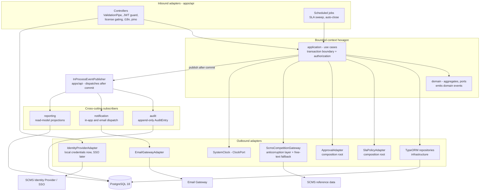

# Sport ITSM - Main Components

> Companion to [`ARCHITECTURE.md`](ARCHITECTURE.md) and section **2.2. Descripción de componentes principales** of [`../readme.md`](../readme.md). Container and layering diagrams live in readme section 2.1; the full C4 context, context map, tactical model, sequences and ADRs live in `ARCHITECTURE.md`.

The system is composed of two deployables — the Angular **Web Client** and the NestJS **API** — plus one PostgreSQL system of record. Everything else is an Nx library: each bounded context contributes a **backend hexagon** (`domain` / `application` / `infrastructure`) and, where it has a UI, a **frontend slice** (`feature` / `ui` / `data-access`). The components below are described by responsibility and technology; their allowed dependencies are the ones already shown in readme section 2.1.

## 1. Web Client — `apps/web`

The client is an **Angular 20.3** application: standalone components only, signals for state, `OnPush` everywhere, Reactive Forms, an in-house component library built with plain HTML templates and SCSS design tokens — no third-party component library — and Transloco for i18n. It is a **pure presentation layer**: it holds no authorization decision, derives no Priority and computes no SLA target — it renders what the API decided (NFR-SEC-02).

| Component | Responsibility | Technology |
| --- | --- | --- |
| **Application shell** (`apps/web`) | Bootstrap via `bootstrapApplication` + `provide*` functions, lazy routing, global error handler, theming, cross-context page composition | Angular 20.3, `provideRouter`, `provideHttpClient`, centralized SCSS design tokens as the theming layer |
| **Self-Service Portal** | Requester surface: knowledge search first, log an Incident, request a published catalog offering, track own tickets and SLA status, comment, confirm or reject a resolution, submit CSAT | `knowledge/feature`, `incident/feature`, `service-catalog/feature`, `service-request/feature`, `approval/feature` |
| **Agent Workspace** | Supply-side surface: prioritized work list, triage, categorization, the competition-in-progress flag with mandatory justification, work notes, assignment, resolution | `incident/feature`, `service-request/feature`, `knowledge/feature`, SLA countdown rendered by `incident/ui` |
| **Admin Console** | Configuration-as-data surface: taxonomy, Impact × Urgency matrix, SLA policies, catalog offerings, workflows, notification templates, roles and resolver groups | `service-catalog/feature`, `identity-access/feature` + configuration feature libs |
| **Management dashboards** | Operational and management KPI views (FCR, MTTA, MTTR, SLA compliance, backlog) | `reporting/feature` + `reporting/ui` |
| **`type:feature` libs** | Routed containers: orchestrate the store, drive Reactive Forms, own explicit loading / error / empty states | Angular standalone components, signals, Reactive Forms |
| **`type:ui` libs** | Presentational building blocks with zero injected services (`PriorityBadge`, `SlaCountdown`, `StateChip`, `WorkNoteList`, `CompetitionSubjectPicker`) | Angular `input()` / `output()`, `OnPush`, hand-written HTML + scoped SCSS, native semantics plus ARIA, keyboard handling, focus trap/restore and `aria-live` regions for WCAG 2.1 AA |
| **`libs/shared/ui`** | The in-house **design system**: domain-agnostic presentational primitives every context reuses (button, form field, dialog/overlay, menu, table, tabs, toast, badge, chip), the SCSS design-token layer and the hand-written a11y primitives (focus-trap/restore directive, `aria-live` announcer). State in, events out: no injected service, no store, no I/O. Tagged `platform:frontend scope:shared type:ui` (ADR-010) | Angular `input()` / `output()`, `OnPush`, hand-written HTML + component-scoped SCSS over the shared design tokens; no third-party component library |
| **`type:data-access` libs** | The **only** outbound edge of the client: typed API services plus injectable signal stores exposing `asReadonly()` / `computed()` | `HttpClient` typed exclusively by `libs/shared/contracts`, Angular signals (no NgRx) |
| **Functional interceptors** | `jwtInterceptor` (Bearer token), `localeInterceptor` (`Accept-Language`), `httpErrorInterceptor` (contract error code → Transloco key) | Angular functional interceptors (`withInterceptors`), Transloco |
| **Route guards** | `authGuard` / `roleGuard` — usability only; never the security boundary | Angular functional guards |

## 2. API — `apps/api`

`apps/api` is simultaneously the **inbound HTTP adapter** and the **composition root**: it is the only project allowed to see more than one bounded context, because it is where ports are bound to adapters (ADR-002, ADR-003).

| Component | Responsibility | Technology |
| --- | --- | --- |
| **Controllers** | Thin inbound adapter: route, validate, delegate to a use case, map the result to a contract response. No business logic. | NestJS 11 on Express 5, `@nestjs/swagger` decorators |
| **Global `ValidationPipe`** | Reject unvalidated or unexpected payloads (`whitelist`, `forbidNonWhitelisted`, `transform`) | `class-validator` + `class-transformer` |
| **Auth guards & strategy** | Verify the JWT, resolve the actor and their roles for the use-case authorization check | Passport JWT (`passport-jwt`, `@nestjs/jwt`), `bcrypt` for local credentials |
| **License gating** | `@LicenseFeature()` decorator restricting access to gated capabilities | Custom NestJS decorator + guard |
| **Exception filter** | Map domain errors to a stable, contract-declared error-code envelope (codes are contract, text is not) | NestJS exception filter + `nestjs-i18n` |
| **i18n** | Localize API messages and email templates from `Accept-Language` | `nestjs-i18n` 10 |
| **Logging** | Structured logs with request correlation; no `console.log` | `nestjs-pino` |
| **Health probes** | `/health/live`, `/health/ready` — unprefixed, so Sport ITSM outages are detectable independently of user reports (NFR-CFG-03) | `@nestjs/terminus` |
| **API documentation** | OpenAPI at `/api/docs`, **development only** | `@nestjs/swagger` |
| **Composition root modules** | Bind each port token to its adapter (`{ provide: INCIDENT_REPOSITORY, useClass: TypeOrmIncidentRepository }`), and host the **cross-context adapters** (`SlaPolicyAdapter`, `ApprovalAdapter`, `NotificationAdapter`, `AuditAdapter`) | NestJS DI, `Symbol` injection tokens declared beside each port |
| **Scheduled jobs** | Second inbound adapter: SLA warning/breach sweep and auto-close after the confirmation period | NestJS scheduling over the same application use cases |

## 3. Bounded-context libraries

Each context owns its hexagon. Phase 1 scaffolds the MVP contexts; `problem`, `change`, `release` and `asset-config` are **phase 2** (PRD §14.4) and are deliberately not generated yet.

| Context | Phase | Core responsibility | Key model elements |
| --- | --- | --- | --- |
| `incident` | 1 | Incident and Major Incident lifecycle, Impact × Urgency prioritization, agent-set competition-impact flag, work notes, escalation | `Incident` (root), `TicketReference`, `Priority`, `CompetitionImpactFlag`, `CompetitionSubject`, `PriorityCalculator` |
| `service-request` | 1 | Fulfillment of entitled catalog offerings, approval routing, fulfillment tasks | `ServiceRequest` (root) with `FulfillmentTask` entities |
| `sla` | 1 | SLA policy resolution, timer state, pause/resume, warnings, breaches, recalculation on Priority change | `SlaPolicy`, `SlaInstance`; no UI of its own — surfaced inside ticket views |
| `service-catalog` | 1 | Services and Service Offerings, request forms, eligibility rules, publication lifecycle | `Service`, `ServiceOffering` |
| `knowledge` | 1 | Knowledge Articles, authoring lifecycle, audience visibility, full-text search | `KnowledgeArticle` |
| `identity-access` | 0/1 | Authentication, RBAC, least privilege, resolver groups and queues | `User`, `Role`, `ResolverGroup`, `IdentityProviderPort` |
| `approval` | 1 | Configurable approval stages, resolvable approvers, immutable decisions | `ApprovalRequest`, `ApprovalDecision` |
| `notification` | 1 | Event-driven dispatch to requesters, agents, approvers and Major Incident stakeholders | `NotificationDispatch` + templates |
| `audit` | 0 | Append-only activity history; no update or delete capability exists at all | `AuditEntry` |
| `reporting` | 1 | Denormalized read models for operational and management dashboards | read models only, no aggregate |
| `problem`, `change`, `release`, `asset-config` | 2 | RCA/KEDB, change authorization and scheduling, release & deployment, CMDB impact analysis | `Problem`/`KnownError`, `Change`, `Release`, `ConfigurationItem`/`CiRelationship` |

Inside every context the three backend libraries have fixed roles, and the technology allowed in each is what the boundary rules enforce:

| Library | Responsibility | Technology allowed |
| --- | --- | --- |
| `<context>/domain` | Aggregates, entities, value objects, domain services, domain events and **outbound port interfaces** | **Pure TypeScript 5.9 only** — no NestJS, no TypeORM, no HTTP, not even `new Date()` (time arrives through `ClockPort`) |
| `<context>/application` | Use cases: orchestration, transaction boundary and the authorization check expressed in domain terms | TypeScript + `libs/shared/contracts` (types only); still no framework |
| `<context>/infrastructure` | Outbound adapters: TypeORM repositories, persistence entities, explicit mappers, external gateways | TypeORM 1.1, `pg`, NestJS DI |

## 4. Shared libraries

| Library | Responsibility | Technology |
| --- | --- | --- |
| `libs/shared/contracts` | The **single typed API surface** shared by both platforms: request/response DTO shapes, enums and error codes. Types only — no logic, no framework, no validation decorators (ADR-007) | TypeScript 5.9 |
| `libs/shared/domain` | Shared kernel primitives used by three or more contexts: `Identity`, `TicketReference`, `ImpactLevel`, `UrgencyLevel`, `Priority`, `DomainEvent`, `StateModel`, `ClockPort` | Pure TypeScript |
| `libs/shared/ui` | The in-house design system reused by every context: presentational primitives, the SCSS design-token layer and the accessibility primitives (focus-trap/restore directive, `aria-live` announcer). Angular code with a shared scope, so it is tagged `platform:frontend scope:shared type:ui`, not `platform:shared` (ADR-010) | Angular 20.3 standalone components, `OnPush`, component-scoped SCSS |
| `libs/shared/util` | Pure, dependency-free helpers | Pure TypeScript |

## 5. Persistence

**PostgreSQL 18** is the single system of record for every context: tickets, SLA timer timestamps, catalog, knowledge, approvals and the append-only audit trail. Access goes exclusively through **TypeORM 1.1** repositories in `type:infrastructure`, where persistence entities are **separate classes** from domain aggregates with an explicit mapper (ADR-005). `synchronize` is always `false`; the schema evolves only through **migrations** (`pnpm typeorm migration:generate|run|revert -d apps/api/src/data-source.ts`), auto-run only in development. No business rule lives in a trigger or stored procedure. All instants are stored in UTC so SLA timers survive restarts and remain time-zone correct.

## 6. Cross-cutting components

| Component | Responsibility | Technology / placement |
| --- | --- | --- |
| **Domain-event dispatcher** | Single in-process publisher; use cases commit the aggregate first and publish afterwards, so a failing subscriber can never roll back ticket intake (NFR-AVL-03) | `EventPublisherPort` in each context's domain, `InProcessEventPublisher` in `apps/api`; no broker in the MVP |
| **Audit component** | Records an immutable entry for every state transition, field change, assignment, comment, approval, notification and rule execution. Immutability is structural: `AuditRepositoryPort` exposes no update or delete method | `audit` context, TypeORM append-only table |
| **Notification component** | Templated, localizable in-app and email notifications to requesters, agents, approvers and Major Incident stakeholders; every dispatch is recorded against its source record | `notification` context + email gateway adapter, `nestjs-i18n` templates |
| **SLA timer engine** | Attaches a policy at creation, recalculates targets from the original creation time on Priority change, pauses/resumes on configured pending states, raises warnings and breach records, triggers escalation | `sla` context; timer state persisted as UTC timestamps in PostgreSQL, swept by a scheduled job — never in-memory counters |
| **Configuration as data** | Taxonomy, Impact × Urgency matrix, SLA policies, state models, approval chains and notification templates are persisted aggregates edited from the Admin Console, not code | Owning contexts + Admin Console |
| **Observability** | Structured request-correlated logs and liveness/readiness probes | `nestjs-pino`, `@nestjs/terminus` |

## 7. External integrations

Every integration is a **port with an adapter**, so none of them is a hard runtime prerequisite for logging a ticket.

| Integration | Purpose | Component |
| --- | --- | --- |
| **SCMS competition reference data** | Read-only lookup of competition identifiers and labels so a ticket can name its affected subject. Sport ITSM consumes no competition calendar and derives no time-based policy from it | `CompetitionSubjectLookupPort` + `ScmsCompetitionGateway` **anticorruption layer**, with a free-text fallback adapter (PRD R10) |
| **SCMS Identity Provider / SSO** | Authentication and profile/entitlement attributes | `IdentityProviderPort` in `identity-access/domain`; local-credential adapter first, SSO adapter later (FR-IAM-04) |
| **Email gateway** | Outbound notification delivery | Adapter behind the `notification` context's outbound port (SMTP/HTTPS) |

> **Status:** as in the readme, these components describe the **target architecture**. Two of them now exist as scaffolding: the **API** (`apps/api`, NestJS 11) and the **Web Client** (`apps/web`, Angular 20 shell), both linting and building green. Neither holds any of the responsibilities described above yet. `libs/` now exists, but holds exactly one library — `libs/shared/util` (`T-C10-07`), pure helpers, `lint` and `test` green with 19 tests — and **nothing imports it**: the dependency graph has one library node and zero edges, so no component in this document consumes another. Still absent: every bounded-context library, the PostgreSQL database and every external gateway — none has been scaffolded or verified.
