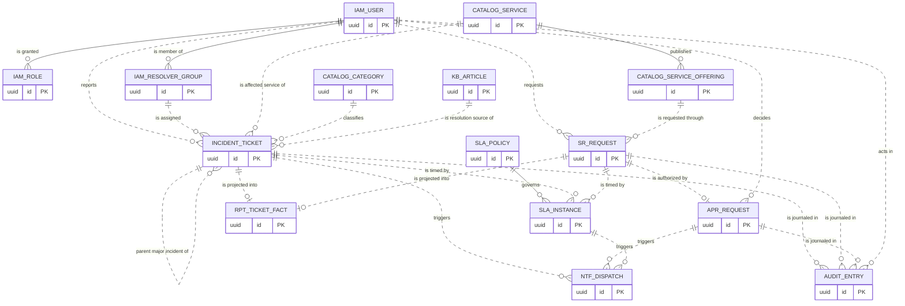
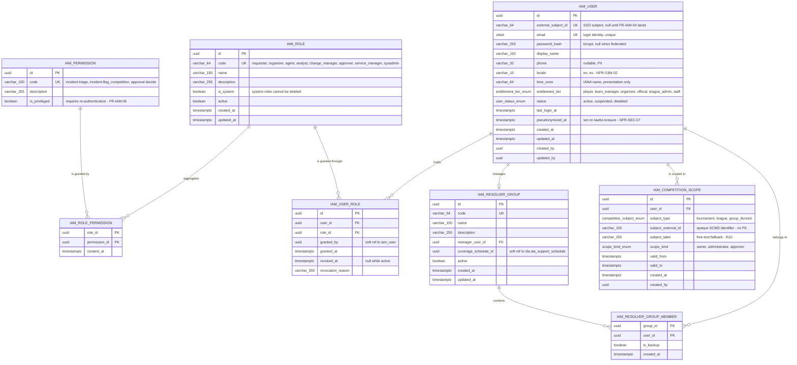
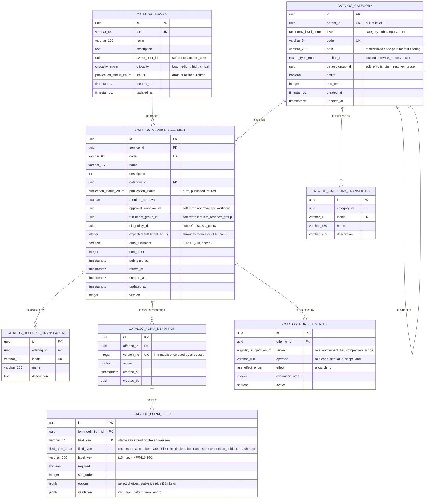
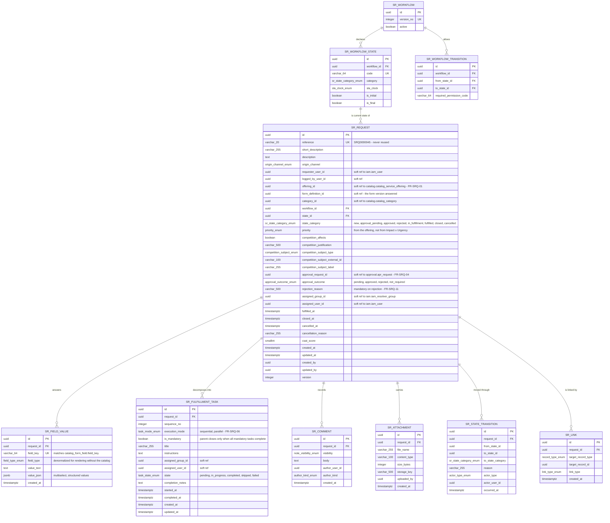
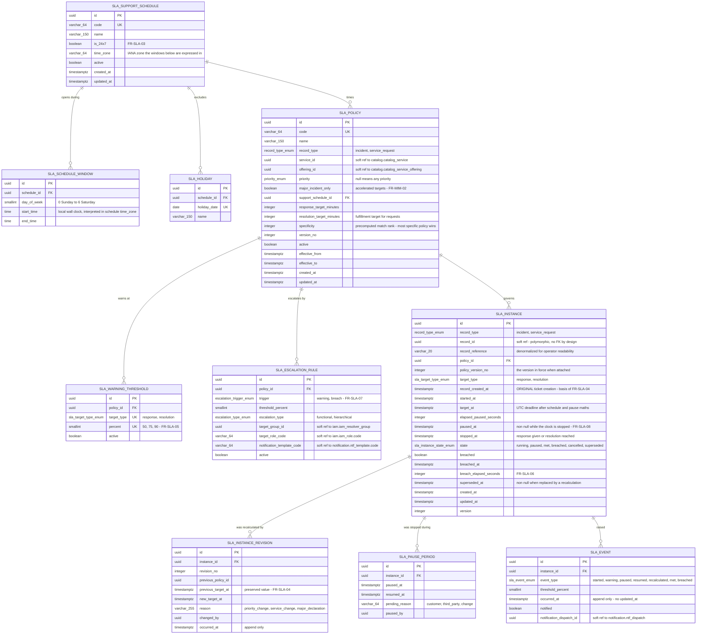
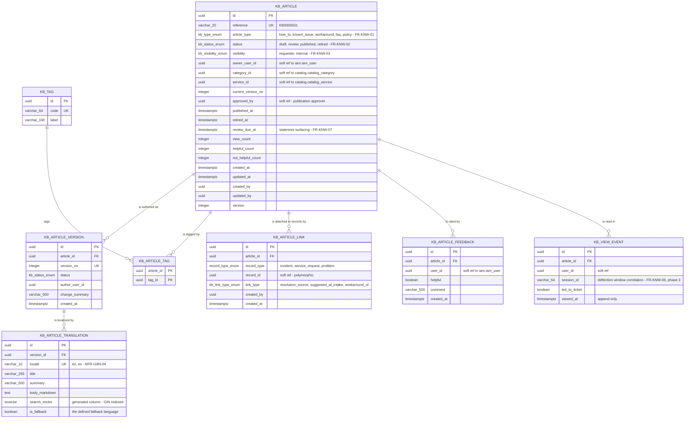
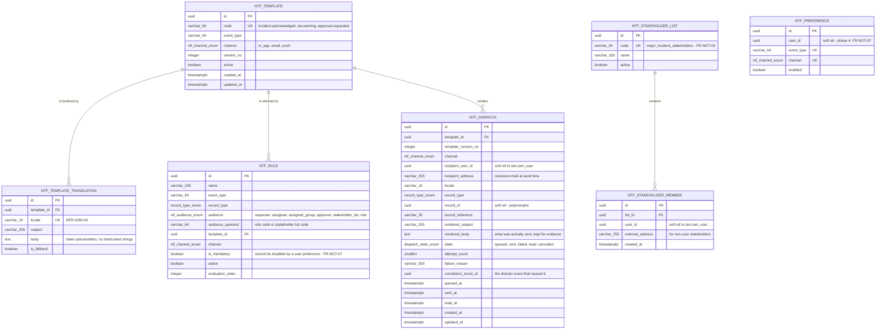
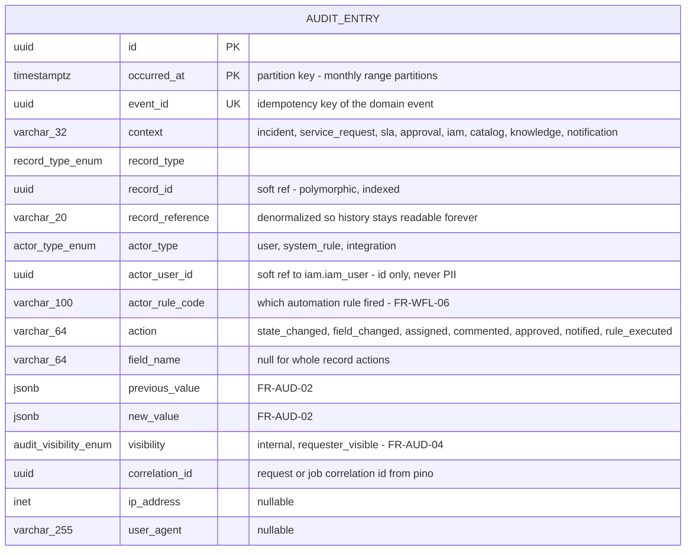
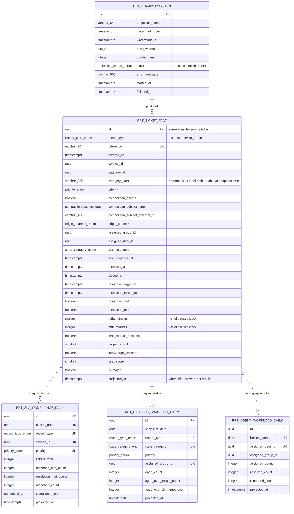

# Sport ITSM — Data Model

> Companion to [`ARCHITECTURE.md`](ARCHITECTURE.md) (bounded contexts §4, tactical model §6.2, **ADR-005**), [`COMPONENTS.md`](COMPONENTS.md) (§5 Persistence), [`PROJECT-STRUCTURE.md`](PROJECT-STRUCTURE.md) (where entities, mappers and migrations live) and section **3. Modelo de Datos** of [`../readme.md`](../readme.md). Behavior — what each field *means* to the business — is owned by [`PRD.md`](PRD.md); every table below traces to a functional requirement ID.

> ## Reading notice — target model, nothing is built yet
>
> **`apps/api` exists as a NestJS scaffold, but nothing below it does: no `libs/`, no TypeORM entity, no data source, no migration file and no database.**

---

## Table of Contents

1. [Scope of this model](#1-scope-of-this-model)
2. [Persistence entities are not domain aggregates (ADR-005)](#2-persistence-entities-are-not-domain-aggregates-adr-005)
3. [Schema conventions](#3-schema-conventions)
4. [Referential integrity policy — hard FK vs soft reference](#4-referential-integrity-policy--hard-fk-vs-soft-reference)
5. [Overview — context-level model](#5-overview--context-level-model)
6. [`identity-access` schema `iam`](#6-identity-access--schema-iam)
7. [`service-catalog` schema `catalog`](#7-service-catalog--schema-catalog)
8. [`incident` schema `incident`](#8-incident--schema-incident)
9. [`service-request` schema `service_request`](#9-service-request--schema-service_request)
10. [`sla` schema `sla`](#10-sla--schema-sla)
11. [`knowledge` schema `knowledge`](#11-knowledge--schema-knowledge)
12. [`approval` schema `approval`](#12-approval--schema-approval)
13. [`notification` schema `notification`](#13-notification--schema-notification)
14. [`audit` schema `audit`](#14-audit--schema-audit)
15. [`reporting` read models schema `reporting`](#15-reporting-read-models--schema-reporting)
16. [Indexes and the NFRs they serve](#16-indexes-and-the-nfrs-they-serve)
17. [Phase 2 — outline only, not modelled](#17-phase-2--outline-only-not-modelled)
18. [Modelling decisions taken in the absence of a PRD statement](#18-modelling-decisions-taken-in-the-absence-of-a-prd-statement)
19. [Verification status](#19-verification-status)
20. [Entity dictionary — attribute-level reference](#20-entity-dictionary--attribute-level-reference)

---

## 1. Scope of this model

This document models the **phase-0 and phase-1 contexts that actually persist state** (PRD §14.2, §14.3):

| Context | PostgreSQL schema | Phase | Persists |
|---|---|---|---|
| `identity-access` | `iam` | 0 | Users, roles, permissions, resolver groups, competition-scoped visibility grants |
| `audit` | `audit` | 0 | Append-only activity history for every record type |
| `service-catalog` | `catalog` | 1 | Services, Service Offerings, request forms, eligibility rules, categorization taxonomy |
| `incident` | `incident` | 1 | Incident tickets, work notes, links, escalations, priority matrix, lifecycle configuration |
| `service-request` | `service_request` | 1 | Service Requests, form answers, fulfillment tasks |
| `sla` | `sla` | 1 | SLA policies, support schedules, timer instances, warnings, breaches, escalation rules |
| `knowledge` | `knowledge` | 1 | Knowledge Articles, versions, translations, feedback, ticket links |
| `approval` | `approval` | 1 | Approval workflows, requests, tasks, immutable decisions |
| `notification` | `notification` | 1 | Templates, rules, dispatch records, stakeholder lists |
| `reporting` | `reporting` | 1 | Denormalized read models only — no aggregate, no system of record |

`problem`, `change`, `release` and `asset-config` are **phase 2** (PRD §14.4) and are deliberately **not modelled** here — see §17. The phase-1 schema is nonetheless forward-compatible with them: `incident.incident_link` already carries `problem`, `change`, `release` and `configuration_item` as target record types (FR-INC-10) using opaque identifiers, so introducing those contexts is additive.

Two things this model deliberately does **not** contain, per ADR-006 and PRD §3.3:

- **No competition calendar, no live window, no freeze window.** There is no `competition`, no `event_window` and no `deployment_freeze` table. Competition impact is three columns on the ticket plus a justification.
- **No tenant discriminator.** Single-tenant MVP (constraint K7). Adding one later is a migration plus a repository-level filter confined to `type:infrastructure`.

---

## 2. Persistence entities are not domain aggregates (ADR-005)

**This document describes the relational schema, not the domain model.** The two are separate on purpose:

| | Domain model | Persistence model (this document) |
|---|---|---|
| Lives in | `libs/<context>/domain` — `type:domain` | `libs/<context>/infrastructure/**/persistence/entities` — `type:infrastructure` |
| File suffix | `*.aggregate.ts`, `*.vo.ts`, `*.event.ts` | `*.entity.ts` (the suffix is reserved for ORM artifacts) |
| Shape | `Incident` aggregate root with `Priority`, `CompetitionImpactFlag`, `CompetitionSubject` value objects and behavior | `incident_ticket` row with flat, nullable, indexable columns |
| Knows about | Nothing — pure TypeScript, not even `new Date()` | TypeORM 1.1, `pg`, PostgreSQL types |
| Joined by | — | An explicit `*.mapper.ts`, hand-written, tested |

Consequences that shape every table below:

1. **A table is not an aggregate.** `incident_ticket` plus `incident_work_note`, `incident_attachment`, `incident_assignment_history`, `incident_state_transition` and `incident_link` together persist **one** `Incident` aggregate. The repository loads and saves them as a unit inside a single transaction; nothing outside the `incident` context ever writes them.
2. **Value objects are stored inline as columns, not as tables.** A value object has no identity and no independent lifecycle, so giving it a row and a surrogate key would be a modelling lie. The inlined value objects are:

| Value object | Stored as | Table |
|---|---|---|
| `TicketReference` | `reference varchar(20)` + unique index | `incident_ticket`, `sr_request` |
| `Priority` | `priority`, `priority_overridden`, `priority_override_justification`, `priority_matrix_id` | `incident_ticket` |
| `CompetitionImpactFlag` | `competition_affects`, `competition_justification`, `competition_flag_set_by`, `competition_flag_set_at` | `incident_ticket`, `sr_request` |
| `CompetitionSubject` | `competition_subject_type`, `competition_subject_external_id`, `competition_subject_label` | `incident_ticket`, `sr_request` |
| `OriginChannel` | `origin_channel` (PG enum) | `incident_ticket`, `sr_request` |
| `ResolverAssignment` | `assigned_group_id`, `assigned_user_id`, `assigned_at` (history in `incident_assignment_history`) | `incident_ticket`, `sr_request` |
| `SlaCommitment` | `target_at`, `response_target_at` on `sla_instance` | `sla_instance` |
| `NoteVisibility` | `visibility` (PG enum) | `incident_work_note`, `sr_comment` |
| `DateTimeRange` (temporal validity, UTC instants) | `valid_from` / `valid_to`; open-ended while `valid_to IS NULL` | `iam_competition_scope`, `apr_delegation` |
| `DateTimeRange` (version effective range) | `effective_from` / `effective_to` | `sla_policy` |
| `OpeningWindow` (`sla`-local wall clock — **not** a kernel VO) | `day_of_week` + `start_time` / `end_time` | `sla_schedule_window` |

The last row is where this list deliberately stops at a context boundary. `sla_schedule_window` stores a weekly opening window as a **wall-clock** pair interpreted in the parent schedule's `time_zone` (§3.3), keyed by `(schedule_id, day_of_week, start_time)` — a time of day per day of week, not an interval of instants, and therefore **not** the shared kernel's `DateTimeRange` (ARCHITECTURE §4.2). `OpeningWindow`, and the `HolidayDate` behind `sla_holiday.holiday_date`, are value objects of the **`sla` domain**: one context speaks them, so item 6 of the §12.2 architectural checklist keeps them out of `shared/domain`. Two further pairs *are* intervals of instants and are still **not** `DateTimeRange`: `sla_pause_period` (`paused_at` / `resumed_at`) and `iam_user_role` (`granted_at` / `revoked_at`). Both carry a deliberately **non-strict** check — `ck_sla_pause_order` and `ck_iam_user_role_revocation` tolerate `to = from`, which `FixedClock`-driven tests can legitimately produce — while `DateTimeRange` rejects the empty range, so each stays as two columns on its own aggregate. **The dividing line is the strictness of the check, not the column names:** the `DateTimeRange` rows above are exactly the pairs whose check reads `to IS NULL OR to > from` (`ck_iam_competition_scope_validity`, `ck_apr_delegation_period`, `ck_sla_policy_effective_range`).

3. **The ORM never dictates the domain.** No table below exists because TypeORM makes it convenient; where the relational shape and the aggregate shape diverge (for example `incident_state_transition`, which is a projection of the aggregate's lifecycle, not a domain entity), the mapper absorbs the difference.

---

## 3. Schema conventions

### 3.1 Primary keys

| Rule | Decision |
|---|---|
| Type | `uuid` on every table. No serial/bigint surrogate keys, no natural keys as PK. |
| Generation | **UUID v7** (time-ordered), generated by the **repository port**, not by the database — `nextIdentity()` alongside the existing `nextReference()` on `IncidentRepositoryPort` (ARCHITECTURE §6.2). The aggregate is fully constructed and valid in pure domain code before any I/O happens. |
| Database default | `DEFAULT uuidv7()` (PostgreSQL 18 core function; no extension) is declared as a **safety net for migrations and fixtures only** — the application always supplies the value. The safety net is **v7 as well**, so a row written outside the port cannot silently break the ordering property below. See §3.1.1 for the argument and the rejected alternatives. |
| Why v7 and not v4 | Time-ordered UUIDs keep B-tree index locality on high-insert tables (`audit_entry`, `sla_event`, `ntf_dispatch`), which v4 destroys. |
| Composite keys | Only on pure join tables (`iam_role_permission`, `iam_resolver_group_member`), where the pair *is* the identity. |
| Business keys | Never the PK. `reference`, `code` and `email` are **unique constraints** on a `uuid`-keyed table, so they can be corrected or re-scoped without cascading a key change. |

#### 3.1.1 Why the safety-net default is `uuidv7()` and not `gen_random_uuid()`

Recorded so the question is **closed**, not merely unanswered.

PostgreSQL 18 ships **`uuidv7()` in core** — no extension, the same availability class as `gen_random_uuid()`, which has been core since PostgreSQL 13. The option simply did not exist on PostgreSQL 16, which is the only reason the original safety net was v4. When the server pin moved to 18 the choice became available and had to be made deliberately.

**The default is not decoration; it is the one write path that can violate the rule above.** Every row created through the repository port carries a v7 key by construction. The default is reached only by the writers this document already sanctions — fixtures, seed data, and the hand-written migration steps §19 requires for partitions, `GRANT`/`REVOKE` and constraints TypeORM does not generate. Those are precisely the *bulk-insert* paths where scattered keys hurt most: a backfill into `audit_entry` — append-only, monthly range-partitioned, the highest-insert table in the model (§14.3) — is the worst possible place to write a large batch of randomly-ordered keys, and it is also the most likely place for someone to write raw SQL.

**The failure mode is silent and disproportionately expensive to undo.** A v4 value among v7 values violates no constraint, fails no test and is invisible on inspection: UUIDs are opaque and nobody reads the version nibble. It surfaces only as index bloat and lost insert locality, long after the fact. Correcting it then is not a `DEFAULT` change — primary keys are referenced across contexts as **soft references with no foreign key** (§4), so rewriting one is a hand-written, multi-schema data migration rather than a cascade. Today the change costs a single token in a document with no migration, no entity and no database behind it (§19); after the first table-creating migration ships it costs a data migration. That asymmetry decides the question on its own.

**Alternatives considered and rejected.**

| Option | Rejected because |
|---|---|
| **Keep `gen_random_uuid()`** | It leaves a fallback that contradicts the very rule it exists to back up. "The default is never exercised" is true of the request path and false of fixtures and data migrations — which is exactly what the default was declared for in the row above. A safety net that degrades the property it protects is not a safety net. |
| **Drop the default entirely** (`NOT NULL`, no default) | The purist reading: the database is not a second identity source, so an absent id should fail loudly. Rejected because fixtures and hand-written migrations are legitimate writers here, and removing the default does not remove the need for an id — it relocates the choice into whatever expression each author types, which in practice is `gen_random_uuid()` from muscle memory, now ungoverned. A correct default is a stronger guardrail than no default. |
| **Generate v7 in the database and drop `nextIdentity()`** | Would put identity generation back behind I/O and break the rule that an aggregate is fully constructed and valid in pure domain code before any write (ADR-005, ARCHITECTURE §6.2). Not on the table. |

**Consequences.**

- The schema acquires a hard **PostgreSQL ≥ 18** floor. The server major is already pinned there (CLAUDE.md §2, ARCHITECTURE §3, COMPONENTS §5), but this converts a version *preference* into a version *requirement*, so it is recorded as **ADR-012** in ARCHITECTURE §10 rather than left implicit here. The failure mode is loud and immediate — `function uuidv7() does not exist`, on the first migration, in CI — which is the opposite of the silent v4 trap being removed.
- **No extension is introduced by this change.** `uuidv7()` is a core function, so the "no `CREATE EXTENSION` for identifier generation" property of the base migration chain is preserved exactly as it was.
- **This is not a `ClockPort` violation (ADR-009).** `uuidv7()` derives its embedded timestamp from the server clock, but the value is a *surrogate identifier*: its time component carries no business meaning and is never read as a business fact. `created_at` remains the sole authority for "when", and it is still set by the application through `ClockPort` — never by a database default and never by a trigger (§3.3).
- The identifier continues to expose an approximate creation instant to anyone holding it. That property follows from choosing v7 at all, not from this change, and `created_at` is returned alongside the id in the same payloads.

### 3.2 Reference numbers

`incident_ticket.reference` and `sr_request.reference` are human-readable, unique and **never reused** (FR-INC-02, NFR-DAT-01): `INC0000123`, `SRQ0000045`. Each record type owns a dedicated PostgreSQL `SEQUENCE` (`incident.incident_reference_seq`, `service_request.sr_reference_seq`) read by the repository adapter via `nextval`; sequences do not roll back with a failed transaction, which is exactly the desired "never reused" semantic (gaps are acceptable, reuse is not).

### 3.3 Timestamps and auditing columns

Every table carries:

| Column | Type | Rule |
|---|---|---|
| `created_at` | `timestamptz` | `NOT NULL`, set by the application through `ClockPort` (ADR-009), never `now()` in a trigger |
| `updated_at` | `timestamptz` | `NOT NULL`, refreshed on every write. **Absent** on append-only tables (`audit_entry`, `sla_event`, `apr_decision`, `incident_state_transition`) — the absence of the column is the immutability statement |
| `created_by` | `uuid` | Actor identity, soft reference to `iam.iam_user` |
| `updated_by` | `uuid` | Nullable, soft reference to `iam.iam_user` |
| `version` | `integer` | TypeORM `@VersionColumn` for optimistic locking on aggregate roots only (`incident_ticket`, `sr_request`, `apr_request`, `sla_instance`, `kb_article`) — concurrent triage by two agents must not silently overwrite |

**All instants are `timestamptz` stored in UTC** (ARCHITECTURE §3.2, NFR-I18N-03). The Angular client renders in the user's locale and time zone; the database and the domain only ever see UTC. `date` and `time` are used **only** in `sla_holiday` and `sla_schedule_window`, which are intentionally wall-clock values interpreted in the support schedule's own `time_zone` column — that is the one place where a naive local time is the correct model. Because they are not instants, those columns do **not** map to the shared kernel's `DateTimeRange` value object (§2, ARCHITECTURE §4.2) — they map to `sla`-owned value objects, and no wall-clock type is ever promoted into `shared/domain`.

`created_by` / `updated_by` are **denormalized convenience columns**, not the audit trail. The audit trail is `audit.audit_entry` (§14) and it is the only authority for "who changed what" (FR-AUD-01/02).

### 3.4 Naming

| Element | Convention |
|---|---|
| Schema | One PostgreSQL schema per bounded context, named after the context (`incident`, `service_request`, `sla`, `catalog`, `knowledge`, `iam`, `approval`, `notification`, `audit`, `reporting`) |
| Table | `snake_case`, singular, prefixed with the context's short form (`incident_ticket`, `sr_fulfillment_task`, `kb_article`) so that a table name is unambiguous in logs and in `EXPLAIN` output even without its schema |
| Column | `snake_case`; foreign keys end in `_id`; booleans read as assertions (`is_major`, `competition_affects`, `requires_approval`); instants end in `_at`; durations carry their unit (`response_target_minutes`, `elapsed_paused_seconds`) |
| Constraint | `pk_<table>`, `fk_<table>_<column>`, `uq_<table>_<columns>`, `ix_<table>_<columns>`, `ck_<table>_<rule>` |
| Enum type | `<schema>.<name>_enum` (`incident.origin_channel_enum`) |
| Migration | `apps/api/src/migrations/<timestamp>-<PascalCaseName>.ts` (readme §2.3.3) |

The schema-per-context split is not cosmetic: it makes the boundary rule visible in the database, lets `GRANT`/`REVOKE` be scoped per context (used to enforce audit immutability, §14) and makes a future context extraction a schema dump rather than a table-by-table archaeology.

### 3.5 Enums vs lookup tables

The rule is **who is allowed to change the value set**:

| Mechanism | Used when | Examples |
|---|---|---|
| **Native PostgreSQL enum type** | The value set is **closed** and can only change with a code change, because the domain branches on it. Adding a value is a migration *and* a domain change, which is the desired friction. | `origin_channel_enum` (portal, agent_logged, email, in_app, phone), `note_visibility_enum` (public, internal), `impact_enum` / `urgency_enum` (1–5), `priority_enum` (P1–P4), `link_type_enum`, `sla_target_type_enum`, `sla_instance_state_enum`, `approval_decision_enum`, `dispatch_state_enum`, `actor_type_enum`, `record_type_enum` |
| **Lookup table** (`id uuid PK`, `code` UK, `active`, `sort_order`, + `*_translation` child) | The value set is **administratively configurable without a release** (NFR-CFG-01) and/or must be **translatable without changing its stable identifier** (NFR-I18N-05) | `catalog_category`, `incident_resolution_code`, `iam_role`, `iam_permission`, `incident_workflow_state`, `ntf_template`, `sla_support_schedule` |

Two consequences stated honestly:

- **PostgreSQL enum values can be added but not removed or reordered** without a rewrite migration. That is accepted for the closed sets above and is precisely why anything an administrator may retire is a lookup table instead.
- **Historical reporting semantics are protected** (NFR-DAT-03) because records store the lookup **id**, never the label. Renaming "Scoring & Results" changes one row in `catalog_category_translation` and zero historical facts.

Workflow state is the interesting case: `incident_ticket.state_id` references `incident_workflow_state` (a lookup), **not** an enum, because FR-WFL-01 requires the lifecycle to be configurable without code. The ticket also stores `state_category` (a native enum: `open`, `pending`, `resolved`, `closed`, `cancelled`) as a denormalized, non-configurable classification, so that queries and reporting never depend on customer configuration.

### 3.6 Deletes, retention and erasure

| Question | Answer |
|---|---|
| Soft delete (`deleted_at`)? | **No.** Not on any table. A `deleted_at` column would create two truths about whether a record exists and is incompatible with an append-only audit trail (K4, FR-AUD-03). |
| How is something "removed" then? | Through **lifecycle state**: `catalog_service_offering.publication_status = 'retired'`, `kb_article.status = 'retired'`, `iam_user.status = 'disabled'`, `iam_user_role.revoked_at IS NOT NULL`, `catalog_category.active = false`. Retired reference data stays joinable by historical records forever. |
| Hard deletes? | Only for **unsent** rows with no historical meaning: `ntf_dispatch` rows in state `queued` that are cancelled, and expired `iam_refresh_token`-class ephemera (not modelled — the MVP is stateless JWT). Never on tickets, approvals, SLA instances or audit. |
| Retention (NFR-DAT-02) | A scheduled archival job moves records older than the configured retention out of the operational tables; `audit_entry` is **range-partitioned by month** so retention is a `DETACH PARTITION`, not a mass `DELETE`. |
| GDPR erasure (NFR-SEC-07, K9) | **Pseudonymization, never deletion.** An erasure request rewrites the PII columns of `iam_user` (`email`, `display_name`, `phone`) to tombstone values and sets `pseudonymized_at`. Every other table references the user by `uuid` only, so the audit trail stays structurally intact and reconstructable while the personal data is gone. Free-text columns that may contain PII (`description`, `body`) are handled by a redaction append entry, never by an in-place edit of history. |

### 3.7 Schema evolution

**Migrations only.** `synchronize` is `false` in every environment, without exception (CLAUDE.md, COMPONENTS.md §5). The schema changes exclusively through TypeORM migrations generated against `apps/api/src/data-source.ts`, reviewed as code, and applied through the documented commands; migrations auto-run only when `NODE_ENV=development` and go through a controlled deploy step everywhere else, because the API scales horizontally and concurrent startup migrations are a corruption hazard (ADR-004).

No business rule ever lives in a trigger, a stored procedure or a check that encodes a policy decision. `CHECK` constraints are used only for **structural invariants that must hold regardless of application version** (a resolved ticket has a resolution code; an SLA target is positive; a competition subject has either an identifier or a label). Everything else lives in TypeScript, in the domain layer, where it is testable without a database.

---

## 4. Referential integrity policy — hard FK vs soft reference

This is the single most consequential decision in the model, so it is stated explicitly.

| Kind | Rule | Enforced by |
|---|---|---|
| **Hard FK** — a real `FOREIGN KEY` constraint | Used **only between tables in the same schema**, i.e. inside one bounded context, and almost always inside one aggregate | PostgreSQL, `ON DELETE RESTRICT` by default; `ON DELETE CASCADE` only from an aggregate root to a part it exclusively owns (`incident_ticket → incident_work_note`) |
| **Soft reference** — a plain `uuid` column, indexed, no constraint | Used for **every reference that crosses a bounded context**, and for every polymorphic reference | The application layer, at the port boundary, before the write; plus a nightly integrity-check job that reports orphans |

### 4.1 Why cross-context references are not foreign keys

1. **It is the database expression of ADR-003.** `scope:incident` may not import `scope:sla`. If `incident_ticket.sla_instance_id` carried a real FK into `sla.sla_instance`, the two contexts would be coupled in the one place the architecture works hardest to keep them decoupled, and the "extract a context later" property of ADR-004 would be a fiction.
2. **Most of them are polymorphic and therefore cannot be FK-constrained at all.** `sla_instance`, `apr_request`, `ntf_dispatch`, `audit_entry` and `kb_article_link` all point at *a record of some type* via `(record_type, record_id)`. A relational FK cannot express that. Emulating it with one nullable FK column per target type would add a column for every context that ever exists — the classic modelling trap this design refuses.
3. **The reference target may not exist in this database at all.** `competition_subject_external_id` points into SCMS, which is a separate system consumed read-only behind an anti-corruption layer, with free-text fallback (PRD D2, R10). A FK there is impossible by definition.

### 4.2 What this costs, honestly

Referential integrity across contexts is **not** guaranteed by PostgreSQL. A defect in a use case can leave an `sla_instance` pointing at a ticket id that was never committed. Mitigations, in order of effectiveness:

- Nothing is ever hard-deleted (§3.6), so the dominant cause of dangling references — a `DELETE` — does not occur.
- Every cross-context write happens inside the same use case and the same database transaction as the aggregate write, so both commit or neither does.
- A scheduled integrity job (`reporting` context) reports orphaned soft references as an operational metric.
- Acceptance tests assert audit and SLA completeness for the MVP flows (ARCHITECTURE §9).

### 4.3 Reading the diagrams

| Notation | Meaning |
|---|---|
| `A ||--o{ B` **solid** line | Real `FOREIGN KEY` constraint, same schema, same bounded context |
| `A ||..o{ B` **dashed** line | Logical/soft reference: a `uuid` column with an index and **no** database constraint, crossing a context boundary or polymorphic |
| `PK` / `FK` / `UK` | Primary key / foreign key column / participates in a unique constraint |

---

## 5. Overview — context-level model

Aggregate-root tables only, to show how the contexts relate. Solid = real FK (always inside a context); dashed = soft cross-context reference.



Note what the diagram makes visible: **every arrow leaving a ticket context is dashed.** The only solid edges are inside a single context. That is the module-boundary rule of ARCHITECTURE §5.3 rendered in the database.

---

## 6. `identity-access` — schema `iam`

Phase 0 (PRD §14.2). Owns authentication material, the RBAC model, resolver groups and the competition-scoped visibility grants that make FR-IAM-03 and FR-KNW-09 enforceable server-side.



### 6.1 `iam_user`

| Attribute | Type | Null | Unique | Description |
|---|---|---|---|---|
| `id` | `uuid` | no | PK | UUID v7 issued by the repository port |
| `external_subject_id` | `varchar(64)` | yes | yes (partial, where not null) | SSO/OIDC subject once FR-IAM-04 is delivered; null in the MVP local-credential mode |
| `email` | `citext` | no | yes | Login identity and notification address; case-insensitive by column type |
| `password_hash` | `varchar(255)` | yes | no | bcrypt hash. Null when the account is federated. **Never** returned by any query the API layer can reach (excluded at the mapper) |
| `display_name` | `varchar(150)` | no | no | Name shown on tickets and audit entries |
| `phone` | `varchar(32)` | yes | no | Optional contact for phone-logged intake; PII, subject to pseudonymization |
| `locale` | `varchar(10)` | no | no | Drives `Accept-Language` defaults and notification language (NFR-I18N-02/04) |
| `time_zone` | `varchar(64)` | no | no | IANA zone, **presentation only** — SLA maths never uses it (NFR-I18N-03) |
| `entitlement_tier` | enum | no | no | Drives catalog eligibility (FR-SRQ-02, FR-CAT-04) |
| `status` | enum | no | no | `active` / `suspended` / `disabled`; no row is ever deleted |
| `last_login_at` | `timestamptz` | yes | no | Adoption metric input (PRD §9.3) |
| `pseudonymized_at` | `timestamptz` | yes | no | Non-null means PII columns hold tombstones (NFR-SEC-07) |

**Constraints and indexes.** `uq_iam_user_email`; `uq_iam_user_external_subject` partial `WHERE external_subject_id IS NOT NULL`; `ck_iam_user_credential` — `password_hash IS NOT NULL OR external_subject_id IS NOT NULL` (an account must be authenticable somehow); `ix_iam_user_status` partial `WHERE status = 'active'`.

### 6.2 `iam_user_role`

Role grants are **temporal rows, not a deleted association** (FR-IAM-05, FR-AUD-05): revocation sets `revoked_at`, so "who could do what on 3 May" remains answerable.

**Constraints.** `uq_iam_user_role_active` — unique `(user_id, role_id)` **partial** `WHERE revoked_at IS NULL`; `ix_iam_user_role_active` on `(user_id)` `WHERE revoked_at IS NULL` (read on every authorization check).

### 6.3 `iam_competition_scope`

The table that makes "an Organizer sees tickets affecting **their** competitions" a server-side predicate rather than a UI filter. It holds **opaque SCMS identifiers with a free-text label fallback** — the same rule as the ticket's competition subject (§8.3). There is no FK, no import and no calendar.

Grants are **append-only and temporal**, like role grants (§6.2): a grant is retired by setting `valid_to` and superseded by inserting a new row, never updated in place and never deleted, so "who could see what on 3 May" stays answerable. **At most one grant per user, subject and `scope_kind` may be live at any instant** — enforced by the partial unique `uq_iam_competition_scope_active` (§20.1). Without it, revoking one of two duplicate rows would leave the visibility intact and the revocation silently ineffective; declared *without* its `WHERE`, it would instead make retire-and-reissue impossible.

### 6.4 What is deliberately absent

No `iam_session` and no `iam_refresh_token` table **in the MVP as currently scoped**. The reason is **scope**, not a claim that server-side session state is unnecessary in general — an earlier wording of this section rested the case on "stateless JWT (ARCHITECTURE §3.2)", which §3.2 does not actually say (see §18 M11).

`FR-IAM-06` — terminate sessions after a configurable inactivity period, and re-authenticate for privileged administrative actions — is priority **Should** and is assigned to **no phase**: PRD §14.2 scopes Phase 0 Identity & Access to `FR-IAM-01/02/03/05`, and the §14.3 MVP table does not list it either. **No requirement in the PRD asks for explicit sign-out, for token revocation, or for a token to stop being accepted before its natural expiry** — `FR-IAM-01` requires authentication, not termination. Nothing in Phase 0 or Phase 1 therefore reads a session record, and the bearer JWT is the whole of the MVP's session state.

**What would overturn this, stated so it need not be re-derived.** `FR-IAM-06` does not say *how* a session terminates, and the two readings differ in cost. Under the weaker reading a client-side idle timer that discards the token satisfies the stated intent — an unattended workstation stops showing the queue — and the timeout stays a token-lifetime concern. Under the stronger reading the server must refuse a token whose session has ended, which is **not implementable without a stored record consulted on every request**. Choosing between them is a **Product Owner decision about security posture**, not a schema decision. If the stronger reading is chosen, or if any requirement for explicit sign-out or token revocation is added to the PRD, this section is wrong and `iam.iam_session` must be declared here **before** it is built.

Introducing refresh-token rotation later is an additive migration confined to this schema.

---

## 7. `service-catalog` — schema `catalog`

Owns Services, Service Offerings, the dynamic request forms, the eligibility rules — and the **categorization taxonomy** shared by both ticket types.

> **Placement decision (not specified by the PRD).** FR-INC-03 requires a Category → Subcategory → Item taxonomy for Incidents, and FR-SRQ/FR-CAT need categories for browsing offerings; the PRD does not say who owns it. It is placed in `service-catalog` because that is the context whose job is *service reference data*, and because duplicating it in both ticket contexts would break NFR-DAT-03 (one rename, two histories). Ticket contexts reference `category_id` as a **soft** reference. See §18.



### 7.1 `catalog_service_offering`

| Attribute | Type | Null | Unique | Description |
|---|---|---|---|---|
| `id` | `uuid` | no | PK | |
| `service_id` | `uuid` | no | no | **Hard FK** to `catalog_service` — same context |
| `code` | `varchar(64)` | no | yes | Stable identifier used by seeds, tests and the six MVP offerings (FR-SRQ-09) |
| `category_id` | `uuid` | yes | no | Hard FK to `catalog_category` — same context |
| `publication_status` | enum | no | no | Only `published` offerings are requestable (FR-CAT-03) |
| `requires_approval` | `boolean` | no | no | Drives FR-SRQ-04 routing |
| `approval_workflow_id` | `uuid` | yes | no | **Soft** ref into `approval` |
| `fulfillment_group_id` | `uuid` | yes | no | **Soft** ref into `iam` |
| `sla_policy_id` | `uuid` | yes | no | **Soft** ref into `sla`; the fulfillment target (FR-SRQ-07) |
| `expected_fulfillment_hours` | `integer` | yes | no | Displayed to the requester (FR-CAT-06) |
| `auto_fulfillment` | `boolean` | no | no | Phase-3 automated fulfillment (FR-SRQ-10); `false` in the MVP |
| `version` | `integer` | no | no | Optimistic lock |

**Constraints.** `ck_offering_approval` — `requires_approval = false OR approval_workflow_id IS NOT NULL`; `ck_offering_published` — `publication_status <> 'published' OR published_at IS NOT NULL`; `ix_offering_published` on `(publication_status, category_id, sort_order)` for catalog browsing.

**Form versioning.** `catalog_form_definition.version_no` is immutable once a `sr_request` has been submitted against it, and the request stores `form_definition_id`. That is how NFR-CFG-02 holds: editing an offering's form creates a **new** version; in-flight requests keep rendering and validating against the one they were created under.

---

## 8. `incident` — schema `incident`

The core context (C1 + C13). `incident_ticket` is the persistence side of the `Incident` aggregate root; work notes, attachments, assignment history, state transitions and links are parts of the same aggregate and carry **hard FKs with `ON DELETE CASCADE`** — the only cascade in the model, and legitimate because those rows have no meaning without their ticket.

```mermaid
erDiagram
    INCIDENT_TICKET {
        uuid id PK
        varchar_20 reference UK "INC0000123 - never reused, FR-INC-02"
        varchar_255 short_description
        text description
        origin_channel_enum origin_channel "portal, agent_logged, email, in_app, phone - FR-OMN-02"
        uuid reporter_user_id "soft ref to iam.iam_user"
        uuid logged_by_user_id "soft ref - agent who logged it on behalf"
        uuid service_id "soft ref to catalog.catalog_service"
        uuid category_id "soft ref to catalog.catalog_category - required to leave New"
        uuid workflow_id FK
        uuid state_id FK "configurable lifecycle - FR-WFL-01"
        state_category_enum state_category "open, pending, resolved, closed, cancelled"
        pending_reason_enum pending_reason "customer, third_party, change - FR-INC-06"
        uuid priority_matrix_id FK "configuration version in force - NFR-CFG-02"
        impact_enum base_impact "agent assessed, before competition uplift"
        impact_enum assessed_impact "after competition uplift - FR-INC-05"
        urgency_enum urgency
        priority_enum priority "P1 to P4 - derived, never requester chosen"
        boolean priority_overridden "FR-INC-04"
        varchar_500 priority_override_justification "mandatory when overridden"
        boolean competition_affects "agent only, never automatic - FR-INC-05"
        varchar_500 competition_justification "mandatory when flag is true"
        uuid competition_flag_set_by "soft ref to iam.iam_user"
        timestamptz competition_flag_set_at
        competition_subject_enum competition_subject_type "tournament, league, fixture, standings, registration, roster, team, player_account, schedule, result"
        varchar_100 competition_subject_external_id "opaque SCMS id - no FK by design"
        varchar_255 competition_subject_label "free-text fallback - R10"
        uuid assigned_group_id "soft ref to iam.iam_resolver_group"
        uuid assigned_user_id "soft ref to iam.iam_user"
        timestamptz assigned_at
        boolean is_major "FR-MIM-01"
        uuid major_declared_by
        timestamptz major_declared_at
        varchar_500 major_justification
        uuid parent_incident_id FK "child of a Major Incident - FR-MIM-03"
        uuid resolution_code_id FK
        text resolution_notes "mandatory to resolve - FR-INC-07"
        uuid resolution_article_id "soft ref to knowledge.kb_article - FR-KNW-05"
        timestamptz first_response_at "MTTA input"
        timestamptz resolved_at
        timestamptz closed_at
        timestamptz confirmation_due_at "auto-close deadline - FR-INC-09"
        boolean first_contact_resolution "FR-INC-18"
        smallint reopen_count
        smallint csat_score "1 to 5, nullable"
        varchar_500 csat_comment
        timestamptz created_at
        timestamptz updated_at
        uuid created_by
        uuid updated_by
        integer version "optimistic lock"
    }
    INCIDENT_WORK_NOTE {
        uuid id PK
        uuid incident_id FK
        note_visibility_enum visibility "public, internal - NFR-SEC-04"
        text body
        uuid author_user_id "soft ref to iam.iam_user"
        author_kind_enum author_kind "user, system_rule"
        timestamptz created_at
    }
    INCIDENT_ATTACHMENT {
        uuid id PK
        uuid incident_id FK
        varchar_255 file_name
        varchar_100 content_type
        integer size_bytes
        varchar_500 storage_key "object storage key, not the blob"
        note_visibility_enum visibility
        uuid uploaded_by
        timestamptz created_at
    }
    INCIDENT_ASSIGNMENT_HISTORY {
        uuid id PK
        uuid incident_id FK
        uuid from_group_id
        uuid from_user_id
        uuid to_group_id
        uuid to_user_id
        varchar_255 reason
        uuid assigned_by
        timestamptz assigned_at
    }
    INCIDENT_STATE_TRANSITION {
        uuid id PK
        uuid incident_id FK
        uuid from_state_id
        uuid to_state_id
        state_category_enum to_state_category
        varchar_255 reason
        actor_type_enum actor_type "user, system_rule"
        uuid actor_user_id
        varchar_100 actor_rule_code
        timestamptz occurred_at "append only - no updated_at"
    }
    INCIDENT_LINK {
        uuid id PK
        uuid incident_id FK
        record_type_enum target_record_type "incident, service_request, problem, change, release, configuration_item"
        uuid target_record_id "opaque - phase 2 contexts included"
        link_type_enum link_type "duplicate_of, related_to, caused_by, child_of, resolved_by"
        uuid created_by
        timestamptz created_at
    }
    INCIDENT_ESCALATION {
        uuid id PK
        uuid incident_id FK
        escalation_type_enum escalation_type "functional, hierarchical - FR-INC-13"
        escalation_trigger_enum trigger "manual, sla_warning, sla_breach"
        uuid from_group_id
        uuid to_group_id
        uuid to_user_id
        varchar_255 reason
        uuid triggered_by
        timestamptz triggered_at
    }
    INCIDENT_MAJOR_COMMUNICATION {
        uuid id PK
        uuid incident_id FK
        varchar_64 audience_code "stakeholder list code - FR-NOT-04"
        varchar_255 subject
        text body
        uuid sent_by
        timestamptz sent_at
    }
    INCIDENT_RESOLUTION_CODE {
        uuid id PK
        varchar_64 code UK
        boolean requires_article
        boolean active
        integer sort_order
    }
    INCIDENT_RESOLUTION_CODE_TRANSLATION {
        uuid id PK
        uuid resolution_code_id FK
        varchar_10 locale UK
        varchar_150 name
    }
    INCIDENT_WORKFLOW {
        uuid id PK
        integer version_no UK
        boolean active
        timestamptz effective_from
    }
    INCIDENT_WORKFLOW_STATE {
        uuid id PK
        uuid workflow_id FK
        varchar_64 code UK
        state_category_enum category
        sla_clock_enum sla_clock "running, paused - FR-INC-08"
        boolean is_initial
        boolean is_final
        integer sort_order
    }
    INCIDENT_WORKFLOW_TRANSITION {
        uuid id PK
        uuid workflow_id FK
        uuid from_state_id FK
        uuid to_state_id FK
        varchar_64 required_permission_code
        jsonb guard "declarative preconditions"
    }
    INCIDENT_PRIORITY_MATRIX {
        uuid id PK
        integer version_no UK
        smallint competition_impact_step "how much the flag raises Impact - FR-INC-05"
        boolean active
        timestamptz effective_from
    }
    INCIDENT_PRIORITY_MATRIX_CELL {
        uuid id PK
        uuid matrix_id FK
        impact_enum impact UK
        urgency_enum urgency UK
        priority_enum priority
    }
    INCIDENT_ROUTING_RULE {
        uuid id PK
        varchar_150 name
        uuid category_id "soft ref to catalog.catalog_category"
        competition_subject_enum competition_subject_type
        origin_channel_enum origin_channel
        uuid target_group_id "soft ref to iam.iam_resolver_group"
        integer evaluation_order
        boolean active
    }
    INCIDENT_BUSINESS_RULE {
        uuid id PK
        varchar_150 name
        rule_event_enum event "on_create, on_update, on_state_change, scheduled"
        jsonb condition
        jsonb actions "set_field, assign, notify, escalate, create_task"
        integer evaluation_order
        boolean active
        integer version_no
    }

    INCIDENT_TICKET ||--o{ INCIDENT_WORK_NOTE : "records"
    INCIDENT_TICKET ||--o{ INCIDENT_ATTACHMENT : "carries"
    INCIDENT_TICKET ||--o{ INCIDENT_ASSIGNMENT_HISTORY : "was routed through"
    INCIDENT_TICKET ||--o{ INCIDENT_STATE_TRANSITION : "moved through"
    INCIDENT_TICKET ||--o{ INCIDENT_LINK : "is linked by"
    INCIDENT_TICKET ||--o{ INCIDENT_ESCALATION : "was escalated by"
    INCIDENT_TICKET ||--o{ INCIDENT_MAJOR_COMMUNICATION : "communicates through"
    INCIDENT_TICKET ||--o| INCIDENT_TICKET : "is parent major incident of"
    INCIDENT_RESOLUTION_CODE ||--o{ INCIDENT_TICKET : "closes"
    INCIDENT_RESOLUTION_CODE ||--o{ INCIDENT_RESOLUTION_CODE_TRANSLATION : "is localized by"
    INCIDENT_WORKFLOW ||--o{ INCIDENT_WORKFLOW_STATE : "declares"
    INCIDENT_WORKFLOW ||--o{ INCIDENT_WORKFLOW_TRANSITION : "allows"
    INCIDENT_WORKFLOW_STATE ||--o{ INCIDENT_TICKET : "is current state of"
    INCIDENT_WORKFLOW ||--o{ INCIDENT_TICKET : "governs"
    INCIDENT_PRIORITY_MATRIX ||--o{ INCIDENT_PRIORITY_MATRIX_CELL : "is composed of"
    INCIDENT_PRIORITY_MATRIX ||--o{ INCIDENT_TICKET : "derived priority of"
```



### 8.1 `incident_ticket`

| Attribute | Type | Null | Unique | Description |
|---|---|---|---|---|
| `id` | `uuid` | no | PK | UUID v7 from the repository port |
| `reference` | `varchar(20)` | no | yes | `INC` + zero-padded sequence value; immutable, never reused (FR-INC-02, NFR-DAT-01) |
| `short_description` | `varchar(255)` | no | no | Work-list title |
| `description` | `text` | no | no | Full report; may contain requester free text about competition context (FR-INC-01) |
| `origin_channel` | enum | no | no | `portal` and `agent_logged` in the MVP; `email` / `in_app` phase 3 (FR-OMN-01/02) |
| `reporter_user_id` | `uuid` | no | no | **Soft** ref to `iam.iam_user`; anonymous intake is impossible (FR-OMN-04) |
| `logged_by_user_id` | `uuid` | yes | no | Agent who logged on the reporter's behalf (phone/chat) |
| `service_id` | `uuid` | yes | no | **Soft** ref to `catalog.catalog_service`; drives SLA policy resolution |
| `category_id` | `uuid` | yes | no | **Soft** ref to `catalog.catalog_category` (leaf `item` level); required before leaving `New` (FR-INC-03) |
| `workflow_id` / `state_id` | `uuid` | no | no | Hard FKs to the configured lifecycle in force for this ticket (FR-WFL-01, NFR-CFG-02) |
| `state_category` | enum | no | no | Denormalized, non-configurable classification so queries and KPIs never depend on customer configuration |
| `pending_reason` | enum | yes | no | `customer` / `third_party` / `change`; combined with the state's `sla_clock` it drives pause semantics (FR-INC-08) |
| `priority_matrix_id` | `uuid` | no | no | The matrix **version** that produced the priority — in-flight tickets keep it (NFR-CFG-02) |
| `base_impact` | enum | no | no | Agent's impact assessment **before** the competition uplift |
| `assessed_impact` | enum | no | no | `base_impact` raised by `competition_impact_step` when the flag is set (FR-INC-05) |
| `urgency` | enum | no | no | Agent-assessed urgency |
| `priority` | enum | no | no | **Derived** from `(assessed_impact, urgency)` through the matrix; never chosen by a requester (FR-INC-04, R8) |
| `priority_overridden` | `boolean` | no | no | Authorized override marker |
| `priority_override_justification` | `varchar(500)` | yes | no | Mandatory when `priority_overridden` (CHECK) |
| `competition_affects` | `boolean` | no | no | Agent-only flag; the whole of ADR-006 reduces to this column |
| `competition_justification` | `varchar(500)` | yes | no | Mandatory when the flag is true (CHECK) |
| `competition_flag_set_by` / `_at` | `uuid` / `timestamptz` | yes | no | Who set it and when; every change is also an `audit_entry` |
| `competition_subject_type` | enum | yes | no | The **affected subject** — a competition entity is never a ticket (PRD §3.3) |
| `competition_subject_external_id` | `varchar(100)` | yes | no | Opaque SCMS identifier. **No FK into SCMS, ever** — SCMS is a separate system behind an ACL |
| `competition_subject_label` | `varchar(255)` | yes | no | Free-text fallback when the lookup is unavailable (R10) |
| `assigned_group_id` / `assigned_user_id` | `uuid` | yes | no | **Soft** refs into `iam`; full history in `incident_assignment_history` (FR-INC-12) |
| `is_major` + `major_*` | mixed | — | no | Major Incident declaration with declarer, time and justification (FR-MIM-01) |
| `parent_incident_id` | `uuid` | yes | no | Hard FK, self-referencing: child of a Major Incident (FR-MIM-03) |
| `resolution_code_id` | `uuid` | yes | no | Hard FK to the lookup; mandatory to resolve (FR-INC-07) |
| `resolution_notes` | `text` | yes | no | Mandatory to resolve (CHECK) |
| `resolution_article_id` | `uuid` | yes | no | **Soft** ref to `knowledge.kb_article`; feeds knowledge-assisted-resolution KPI (FR-KNW-05) |
| `first_response_at` | `timestamptz` | yes | no | MTTA input |
| `resolved_at` / `closed_at` | `timestamptz` | yes | no | MTTR inputs |
| `confirmation_due_at` | `timestamptz` | yes | no | Auto-close deadline computed at resolution (FR-INC-09) |
| `first_contact_resolution` | `boolean` | no | no | FCR marker set at resolution (FR-INC-18) |
| `reopen_count` | `smallint` | no | no | Reopen Rate input (PRD §9.1) |
| `csat_score` / `csat_comment` | `smallint` / `varchar(500)` | yes | no | Basic capture only in the MVP |
| `version` | `integer` | no | no | Optimistic lock — concurrent triage must not silently overwrite |

**Check constraints (structural invariants only).**

| Constraint | Rule |
|---|---|
| `ck_incident_resolution` | `state_category NOT IN ('resolved','closed') OR (resolution_code_id IS NOT NULL AND resolution_notes IS NOT NULL)` |
| `ck_incident_competition_flag` | `competition_affects = false OR (competition_justification IS NOT NULL AND competition_flag_set_by IS NOT NULL AND competition_flag_set_at IS NOT NULL)` |
| `ck_incident_priority_override` | `priority_overridden = false OR priority_override_justification IS NOT NULL` |
| `ck_incident_subject` | `competition_subject_type IS NULL OR competition_subject_external_id IS NOT NULL OR competition_subject_label IS NOT NULL` |
| `ck_incident_major` | `is_major = false OR (major_declared_by IS NOT NULL AND major_declared_at IS NOT NULL AND major_justification IS NOT NULL)` |
| `ck_incident_csat` | `csat_score IS NULL OR csat_score BETWEEN 1 AND 5` |

These are structural safety nets. The **rules** are enforced in the domain layer; the constraints exist so that a defect cannot persist a record that contradicts the model, and so a DBA reading the schema can see the invariants.

### 8.2 Why the competition subject has no foreign key

Three columns, no constraint, and that is the deliberate design:

- SCMS is an **external system** consumed read-only through an anti-corruption layer (ARCHITECTURE §2, PRD D2). Its identifiers live in a different database; a FK is physically impossible.
- The MVP accepts **free text** for the affected competition instance (R10). A ticket must be loggable when the SCMS lookup is down — NFR-AVL-03 says intake never fails because an optional subsystem is unavailable.
- Sport ITSM must never become a partial replica of the competition model. Storing `(type, external_id, label)` and nothing else is what keeps "a competition entity is the affected subject, never a ticket" (PRD §3.1) structurally true.

`ix_incident_subject` on `(competition_subject_type, competition_subject_external_id)` supports NFR-AUD-04: "list every Incident that affected this competition in a period".

### 8.3 `incident_work_note` and the visibility boundary

`visibility` is a native enum with exactly two values. NFR-SEC-04 — internal notes never reach a requester through any channel — is enforced in the **application layer** query, not in an Angular `@if`. The column exists so that filter is expressible as a `WHERE`, and `ix_incident_note_public` (partial, `WHERE visibility = 'public'`) makes the requester-facing timeline cheap.

### 8.4 Configuration-as-data tables

`incident_workflow*`, `incident_priority_matrix*`, `incident_routing_rule` and `incident_business_rule` are the persistence of NFR-CFG-01 and FR-WFL-01/02/03. Two properties matter:

1. **They are versioned, never edited in place.** Publishing a new matrix inserts a new `incident_priority_matrix` row with a new `version_no`; existing tickets keep pointing at the old one (NFR-CFG-02).
2. **`jsonb` is used only for the rule DSL** (`condition`, `actions`, `guard`, `validation`, `options`). Everything a query filters on is a real column. `jsonb` here is a payload the domain interprets, not a way of avoiding modelling.

---

## 9. `service-request` — schema `service_request`

Structurally a sibling of `incident`: same reference/state/competition-subject shape, different lifecycle (FR-SRQ-05), plus form answers and fulfillment tasks. It carries its own workflow tables (mirroring §8, abbreviated in the diagram) because each context owns its lifecycle — a shared workflow engine was explicitly rejected as a god context (ARCHITECTURE §4.1).



### 9.1 `sr_request`

| Attribute | Type | Null | Unique | Description |
|---|---|---|---|---|
| `reference` | `varchar(20)` | no | yes | `SRQ` + sequence; conversion between record types (FR-INC-14, phase 3) preserves the original reference |
| `offering_id` | `uuid` | no | no | **Soft** ref to `catalog.catalog_service_offering`. A Request exists only for a published offering (FR-SRQ-01, K6) |
| `form_definition_id` | `uuid` | no | no | **Soft** ref; pins the form version answered, so later catalog edits cannot invalidate an in-flight request (NFR-CFG-02) |
| `state_category` | enum | no | no | `new → approval_pending → approved / rejected → in_fulfillment → fulfilled → closed`, plus `cancelled` (FR-SRQ-05) |
| `approval_request_id` | `uuid` | yes | no | **Soft** ref to `approval.apr_request`; fulfillment cannot start before a decision exists (FR-SRQ-04) |
| `rejection_reason` | `varchar(500)` | yes | no | Mandatory when rejected (FR-SRQ-11, CHECK) |
| `competition_*` | mixed | yes | no | Same three-column subject pattern as the Incident, same no-FK rule |

**Constraints.** `ck_sr_rejection` — `state_category <> 'rejected' OR rejection_reason IS NOT NULL`; `ck_sr_fulfillment_gate` — `state_category NOT IN ('in_fulfillment','fulfilled') OR approval_outcome IN ('approved','not_required')`; `ck_sr_cancel` — cancellation requires `cancelled_at` (FR-SRQ-08).

### 9.2 `sr_fulfillment_task`

| Attribute | Type | Null | Unique | Description |
|---|---|---|---|---|
| `request_id` | `uuid` | no | no | **Hard FK**, `ON DELETE CASCADE` — a task has no life outside its request |
| `sequence_no` | `integer` | no | with request | Ordering for sequential tasks |
| `execution_mode` | enum | no | no | `sequential` or `parallel` (FR-SRQ-06) |
| `is_mandatory` | `boolean` | no | no | The parent may close only when every mandatory task is `completed` or `skipped` |
| `state` | enum | no | no | `pending`, `in_progress`, `completed`, `skipped`, `failed` |

**Constraints.** `uq_sr_task_sequence` on `(request_id, sequence_no)`; `ix_sr_task_open` on `(assigned_group_id, state)` partial `WHERE state IN ('pending','in_progress')` for the fulfiller work list.

### 9.3 Form answers: rows, not a blob

`sr_field_value` stores one row per answered field rather than a single `jsonb` document on the request. The reason is reporting and search: FR-RPT-05 requires filtering, and support needs to answer "every organizer-access request for competition X". A `jsonb` document would make that a functional-index exercise on data whose shape changes per offering. `value_json` is retained only for genuinely multi-valued answers.

---

## 10. `sla` — schema `sla`

The most timing-sensitive schema in the system: NFR-AVL-05 (timers survive restarts), NFR-PRF-04 (warning within one minute of the threshold) and FR-SLA-04 (recalculation from the **original** creation time, preserving previous targets) all land here.



### 10.1 `sla_policy`

| Attribute | Type | Null | Unique | Description |
|---|---|---|---|---|
| `record_type` | enum | no | in UK | `incident` or `service_request` — Incident and fulfillment targets are distinct policies (FR-SRQ-07) |
| `service_id` / `offering_id` | `uuid` | yes | in UK | **Soft** refs; `NULL` means "any", which is how a default policy is expressed |
| `priority` | enum | yes | in UK | `NULL` means "any priority" |
| `specificity` | `integer` | no | no | Precomputed rank (offering > service > default, priority-specific > any) so that "attach exactly one applicable policy" (FR-SLA-02) is a deterministic `ORDER BY specificity DESC LIMIT 1`, not an implicit rule |
| `response_target_minutes` / `resolution_target_minutes` | `integer` | no | no | Minutes of **schedule time**, not wall time |
| `effective_from` / `effective_to` | `timestamptz` | — | no | Policies are versioned, never edited in place |

**Constraints.** `uq_sla_policy_scope` — `UNIQUE NULLS NOT DISTINCT (record_type, service_id, offering_id, priority, major_incident_only, version_no)`. The `NULLS NOT DISTINCT` is **load-bearing, not a detail of the full dictionary** (§20.5): `service_id`, `offering_id` and `priority` use `NULL` to mean "any" — a real value here, not an unknown — so under PostgreSQL's default the constraint would permit unlimited duplicate *default* policies and enforce nothing where resolution is most ambiguous (FR-SLA-01/02). Also `ck_sla_targets_positive` — both targets `> 0`; `ck_sla_target_order` — `response_target_minutes <= resolution_target_minutes`.

### 10.2 `sla_instance`

| Attribute | Type | Null | Unique | Description |
|---|---|---|---|---|
| `record_type` + `record_id` | enum + `uuid` | no | in UK | Polymorphic **soft** reference to the ticket. No FK: `sla` must not depend on `incident` (ADR-003) |
| `record_created_at` | `timestamptz` | no | no | The **original** ticket creation instant. FR-SLA-04 recalculates from here, not from the moment the priority changed — this column is why that is possible after a restart |
| `started_at` / `target_at` | `timestamptz` | no | no | UTC. `target_at` already accounts for the support schedule and holidays |
| `paused_at` | `timestamptz` | yes | no | Non-null exactly while the clock is stopped (FR-INC-08, FR-SLA-08) |
| `elapsed_paused_seconds` | `integer` | no | no | Accumulated pause, so remaining time is derivable from stored timestamps alone — never from an in-memory counter (NFR-AVL-05, ADR-009) |
| `state` | enum | no | no | `running`, `paused`, `met`, `breached`, `cancelled`, `superseded` |
| `breached` / `breached_at` / `breach_elapsed_seconds` | mixed | — | no | Written once. **No update path exists** on the repository port, which is how FR-SLA-06 ("no retroactive silent modification") is structural rather than procedural |
| `superseded_at` | `timestamptz` | yes | no | A recalculation supersedes rather than mutates, so the previous commitment stays readable |

**Constraints and indexes.**

- `uq_sla_instance_active` — unique `(record_type, record_id, target_type)` **partial** `WHERE superseded_at IS NULL` — exactly one live commitment per target per ticket (FR-SLA-02).
- `ix_sla_sweep` on `(target_at)` **partial** `WHERE state = 'running'` — this is the index the scheduled sweep job scans every minute; it keeps NFR-PRF-04 achievable regardless of total ticket volume.
- `ix_sla_instance_record` on `(record_type, record_id)` — the ticket view reads remaining time (FR-SLA-10).

### 10.3 Why breaches and revisions are separate append-only tables

`sla_instance_revision` and `sla_event` have `occurred_at` and **no `updated_at`**. Together with `audit_entry` they satisfy NFR-AUD-03 (breach records tamper-evident) and FR-SLA-04 (previous target values preserved). The revision row is the *business* record of a recalculation; the audit entry is the *cross-cutting* journal of it. Both exist deliberately: reporting reads revisions, compliance reads audit.

---

## 11. `knowledge` — schema `knowledge`

Article identity is stable; content is versioned and translated. Full-text search (FR-KNW-04) is native PostgreSQL — no external search engine in the MVP (ARCHITECTURE §11.3, constraint K8).



### 11.1 `kb_article`

| Attribute | Type | Null | Unique | Description |
|---|---|---|---|---|
| `reference` | `varchar(20)` | no | yes | Stable citable identifier (`KB0000031`) |
| `article_type` | enum | no | no | FR-KNW-01 |
| `status` | enum | no | no | `draft → review → published → retired`; publication requires an approver (FR-KNW-02) |
| `visibility` | enum | no | no | `requester` or `internal`. **There is no `public` value** — no article is reachable without authentication (FR-KNW-03, FR-IAM-01) |
| `current_version_no` | `integer` | no | no | Points at the version served to readers |
| `review_due_at` | `timestamptz` | yes | no | Drives the stale-article review queue (FR-KNW-07) |
| `helpful_count` / `not_helpful_count` | `integer` | no | no | Denormalized counters maintained from `kb_article_feedback` |

**Constraints.** `ck_kb_published` — `status <> 'published' OR (published_at IS NOT NULL AND approved_by IS NOT NULL)`; `uq_kb_feedback` on `(article_id, user_id)` — one rating per reader.

### 11.2 Full-text search

`kb_article_translation.search_vector` is a **generated stored column**:

`to_tsvector(<locale regconfig>, coalesce(title,'') || ' ' || coalesce(summary,'') || ' ' || coalesce(body_markdown,''))`

with `ix_kb_search` as a **GIN** index on it, plus a `pg_trgm` GIN index on `title` for typo-tolerant intake suggestions (FR-INC-16). Search always runs against the current version of `published` articles and is **filtered server-side by the reader's visibility entitlement** — the filter is a `WHERE` clause in the repository, never a client-side omission (NFR-SEC-02). Language configuration is selected per row from `locale`, which is why translations are rows rather than columns.

---

## 12. `approval` — schema `approval`

One generic engine serving Service Requests now and Changes/Releases in phase 2 (FR-APR-01/02). The decision row is the most tightly locked table in the model after `audit_entry`.

```mermaid
erDiagram
    APR_WORKFLOW {
        uuid id PK
        varchar_64 code UK
        varchar_150 name
        record_type_enum record_type "service_request, change, release"
        integer version_no
        boolean active
        timestamptz created_at
        timestamptz updated_at
    }
    APR_STAGE {
        uuid id PK
        uuid workflow_id FK
        integer sequence_no UK
        varchar_150 name
        stage_mode_enum mode "sequential, parallel - FR-APR-01"
        quorum_type_enum quorum_type "all, any, majority - FR-APR-06 phase 4"
        smallint quorum_value
        integer due_in_hours "reminder and escalation basis - FR-APR-05"
    }
    APR_APPROVER_RULE {
        uuid id PK
        uuid stage_id FK
        approver_resolver_enum resolver_type "role, group, named_user, competition_owner - FR-APR-02"
        varchar_100 operand "role code, group id, user id, scope kind"
        integer evaluation_order
    }
    APR_REQUEST {
        uuid id PK
        uuid workflow_id FK
        integer workflow_version_no "the version in force when raised"
        record_type_enum record_type
        uuid record_id "soft ref - polymorphic, no FK by design"
        varchar_20 record_reference "denormalized for readability"
        uuid requested_by "soft ref to iam.iam_user"
        timestamptz requested_at
        apr_state_enum state "pending, approved, rejected, cancelled, expired"
        integer current_stage_seq
        timestamptz decided_at
        timestamptz created_at
        timestamptz updated_at
        integer version
    }
    APR_TASK {
        uuid id PK
        uuid request_id FK
        uuid stage_id FK
        uuid approver_user_id "soft ref to iam.iam_user - resolved at creation"
        uuid delegate_user_id "soft ref - FR-APR-04, phase 2"
        apr_task_state_enum state "pending, approved, rejected, delegated, expired"
        timestamptz due_at
        timestamptz reminded_at
        timestamptz created_at
        timestamptz updated_at
    }
    APR_DECISION {
        uuid id PK
        uuid task_id FK UK "one decision per task, forever"
        uuid request_id FK
        approval_decision_enum decision "approved, rejected"
        varchar_1000 comment "mandatory on rejection - FR-APR-03"
        uuid decided_by "soft ref - the actual decider"
        uuid on_behalf_of "soft ref - original approver when delegated"
        timestamptz decided_at "append only - no updated_at, no delete grant"
    }
    APR_DELEGATION {
        uuid id PK
        uuid delegator_user_id "soft ref"
        uuid delegate_user_id "soft ref"
        timestamptz valid_from
        timestamptz valid_to
        varchar_255 reason
        timestamptz created_at
    }

    APR_WORKFLOW ||--o{ APR_STAGE : "is composed of"
    APR_STAGE ||--o{ APR_APPROVER_RULE : "resolves approvers by"
    APR_WORKFLOW ||--o{ APR_REQUEST : "governs"
    APR_REQUEST ||--o{ APR_TASK : "assigns"
    APR_STAGE ||--o{ APR_TASK : "produces"
    APR_TASK ||--|| APR_DECISION : "is closed by"
    APR_REQUEST ||--o{ APR_DECISION : "aggregates"
```

### 12.1 `apr_decision` — immutability by construction

| Attribute | Type | Null | Unique | Description |
|---|---|---|---|---|
| `task_id` | `uuid` | no | **yes** | One decision per approval task. The unique constraint is what makes "a decision cannot be re-taken" a database fact (FR-APR-07) |
| `decision` | enum | no | no | `approved` / `rejected` only |
| `comment` | `varchar(1000)` | yes | no | Mandatory on rejection (`ck_apr_decision_comment`) |
| `decided_by` | `uuid` | no | no | The actor who actually decided |
| `on_behalf_of` | `uuid` | yes | no | The original approver when the decision came from a delegate (FR-APR-04) |
| `decided_at` | `timestamptz` | no | no | Append-only; there is no `updated_at` |

Immutability is enforced on **three** levels, not one: the table has no `updated_at`; the `ApprovalRepositoryPort` exposes no update or delete method for decisions (capability absence, the same technique as `audit`); and the application database role is granted `INSERT, SELECT` only on `approval.apr_decision`. A defect cannot silently rewrite an authorization record.

### 12.2 Fulfillment gate

`sr_request.approval_outcome` is a denormalized projection of `apr_request.state`, updated by the composition-root adapter after the approval context commits. The **gate** — no fulfillment before a recorded decision (FR-SRQ-04) — is a domain rule in `service-request`, backed by `ck_sr_fulfillment_gate` (§9.1) as a structural net.

---

## 13. `notification` — schema `notification`

Every dispatch is recorded against its source record (FR-NOT-08), and dispatch happens **after commit** off the domain-event bus (ADR-008), so a failing gateway can never roll back a ticket (NFR-AVL-03).



### 13.1 `ntf_dispatch`

| Attribute | Type | Null | Unique | Description |
|---|---|---|---|---|
| `record_type` + `record_id` | enum + `uuid` | no | no | **Soft** polymorphic ref to the source record — every notification is recorded against it (FR-NOT-08) |
| `rendered_subject` / `rendered_body` | text | no | no | The exact content sent. Kept because "the requester was told X at time T" is evidence, and re-rendering from a later template version would falsify it |
| `state` | enum | no | no | `queued → sent / failed`, plus `read` for in-app and `cancelled` |
| `attempt_count` / `failure_reason` | mixed | — | no | Retry bookkeeping for the in-process dispatcher |
| `correlation_event_id` | `uuid` | yes | no | The domain event that produced the dispatch — makes the event → notification → audit chain traceable end to end |

**Indexes.** `ix_ntf_outbox` on `(queued_at)` partial `WHERE state = 'queued'` — the send loop; `ix_ntf_inbox` on `(recipient_user_id, state, queued_at DESC)` partial `WHERE channel = 'in_app'` — the in-app notification bell; `ix_ntf_record` on `(record_type, record_id)` — the ticket's communication history.

**Never stored here.** Credentials, tokens or secrets in any form (NFR-SEC-05), and never the body of an internal work note to a requester recipient — the audience resolution happens before rendering.

---

## 14. `audit` — schema `audit`

One table. It is the most important one in the system for compliance (FR-AUD-01→06, NFR-AUD-01/02/03, constraint K4), and its design is deliberately boring: a single, wide, append-only, partitioned journal.



### 14.1 `audit_entry`

| Attribute | Type | Null | Unique | Description |
|---|---|---|---|---|
| `id` | `uuid` | no | PK part | UUID v7 — time-ordered, so inserts stay at the right edge of the index |
| `occurred_at` | `timestamptz` | no | PK part | The instant of the action, from `ClockPort`. Also the **range partition key** |
| `event_id` | `uuid` | no | yes | The domain event identifier. Unique, so a retried dispatch cannot double-write history — idempotency, not deduplication after the fact |
| `context` | `varchar(32)` | no | no | Which bounded context produced the entry |
| `record_type` + `record_id` | enum + `uuid` | no | no | **Soft** polymorphic ref. No FK is possible, and none is wanted: audit must outlive any record and must not depend on any context |
| `record_reference` | `varchar(20)` | yes | no | Denormalized `INC…` / `SRQ…`, so a 2-year-old entry is readable without a join |
| `actor_type` | enum | no | no | `user`, `system_rule` or `integration` — FR-AUD-02 requires the actor even when it is a rule |
| `actor_user_id` | `uuid` | yes | no | Identifier only. **No name, no email** — that is what makes GDPR pseudonymization (§3.6) possible without destroying history (NFR-SEC-07) |
| `actor_rule_code` | `varchar(100)` | yes | no | Which automation rule fired, with what effect (FR-WFL-06) |
| `action` | `varchar(64)` | no | no | Stable action code |
| `field_name` / `previous_value` / `new_value` | mixed | yes | no | `jsonb` so any field type is representable with one column pair (FR-AUD-02) |
| `visibility` | enum | no | no | Separates requester-visible history from internal entries in the same journal (FR-AUD-04, NFR-SEC-04) |
| `correlation_id` | `uuid` | yes | no | Ties the entry to the `nestjs-pino` request log |

### 14.2 What is absent, and why that is the point

**No `updated_at`. No `deleted_at`. No update or delete method on `AuditRepositoryPort`. No `UPDATE`/`DELETE` grant** for the application role on `audit.audit_entry`:

```sql
GRANT INSERT, SELECT ON audit.audit_entry TO sport_itsm_app;
REVOKE UPDATE, DELETE, TRUNCATE ON audit.audit_entry FROM sport_itsm_app;
```

FR-AUD-03 says no role — including System Administrator — may edit or delete history. That is not a policy anyone can forget to apply: the capability does not exist at the port, and the privilege does not exist at the database. Corrections are made by inserting a new entry, never by mutating one (NFR-AUD-02).

### 14.3 Partitioning, retention and indexes

- `PARTITION BY RANGE (occurred_at)`, one partition per month, created ahead of time by a migration-generated maintenance routine. Retention (NFR-DAT-02, FR-AUD-06) is `DETACH PARTITION` + archive, not a mass `DELETE` that would bloat the table and violate the spirit of append-only.
- `ix_audit_record` on `(record_type, record_id, occurred_at DESC)` — the "activity history of this ticket" query, the single most frequent read.
- `ix_audit_actor` on `(actor_user_id, occurred_at DESC)` — "what did this user do".
- `ix_audit_context_action` on `(context, action, occurred_at DESC)` — configuration-change review (FR-AUD-05) and compliance extracts.

Administrative configuration changes (catalog, SLA policy, workflow, role assignment — FR-AUD-05) are **the same table** with `record_type = 'configuration'`. One journal, one query path, one immutability guarantee.

---

## 15. `reporting` read models — schema `reporting`

`reporting` owns **projections only**. It is never a system of record, and it never joins into another context's tables at will (ARCHITECTURE §4.3): projections are written from domain events and, for aggregates, refreshed by a scheduled job. That is what makes FR-RPT-07 (same filters, same period, same numbers) achievable.



### 15.1 `rpt_ticket_fact`

| Attribute | Type | Null | Unique | Description |
|---|---|---|---|---|
| `id` | `uuid` | no | PK | **The same id as the source ticket** — the projection is a 1:1 mirror, so a rebuild is an idempotent upsert |
| `category_path` | `varchar(255)` | yes | no | Denormalized at projection time so that renaming a category later cannot retroactively change a historical report (NFR-DAT-03) |
| `mtta_minutes` / `mttr_minutes` | `integer` | yes | no | Computed **net of clock-stopping pending states** (PRD §9.1 definition), from `sla_instance` and `sla_pause_period` |
| `response_met` / `resolution_met` | `boolean` | yes | no | SLA Compliance Rate inputs |
| `knowledge_assisted` | `boolean` | no | no | True when a `kb_article_link` of type `resolution_source` exists (FR-KNW-05) |
| `projected_at` | `timestamptz` | no | no | Rebuild watermark |

The union of both ticket types in a single fact table is deliberate: every management KPI in FR-RPT-02 is asked across "tickets", and a union view over two tables would be re-derived on every query.

### 15.2 Reproducibility

`rpt_projection_run` records the watermark, row count, duration and outcome of every projection pass. A reported figure is therefore attributable to a specific projection run — which is the operational meaning of FR-RPT-07. Dashboards read `reporting` only; they never query `incident` or `sla` directly, so a heavy report cannot degrade ticket intake (NFR-PRF-02, NFR-AVL-03).

---

## 16. Indexes and the NFRs they serve

| Index | Table | Definition | Serves |
|---|---|---|---|
| `uq_incident_reference` | `incident_ticket` | unique `(reference)` | FR-INC-02, NFR-DAT-01 |
| `ix_incident_worklist` | `incident_ticket` | `(priority, created_at)` **partial** `WHERE state_category IN ('open','pending')` | **NFR-PRF-02** — agent work list under 2 s at match-day volume (FR-QUE-02) |
| `ix_incident_group_queue` | `incident_ticket` | `(assigned_group_id, state_category, priority)` partial on open states | FR-QUE-02/03 queue depth and self-assignment |
| `ix_incident_mine` | `incident_ticket` | `(assigned_user_id, state_category, priority)` partial on open states | "My work list" |
| `ix_incident_reporter` | `incident_ticket` | `(reporter_user_id, created_at DESC)` | FR-IAM-03 — a requester sees only their own tickets |
| `ix_incident_subject` | `incident_ticket` | `(competition_subject_type, competition_subject_external_id)` | **NFR-AUD-04** — every Incident affecting a competition in a period |
| `ix_incident_competition_flag` | `incident_ticket` | `(created_at DESC)` **partial** `WHERE competition_affects` | PRD §9.2 domain KPIs on the flagged subset |
| `ix_incident_confirmation` | `incident_ticket` | `(confirmation_due_at)` partial `WHERE state_category = 'resolved'` | FR-INC-09 auto-close sweep |
| `ix_incident_note_public` | `incident_work_note` | `(incident_id, created_at)` partial `WHERE visibility = 'public'` | NFR-SEC-04 requester timeline |
| `ix_sla_sweep` | `sla_instance` | `(target_at)` **partial** `WHERE state = 'running'` | **NFR-PRF-04** — warning/breach raised within one minute, independent of total volume |
| `uq_sla_instance_active` | `sla_instance` | unique `(record_type, record_id, target_type)` partial `WHERE superseded_at IS NULL` | FR-SLA-02 — exactly one live commitment |
| `ix_sla_instance_record` | `sla_instance` | `(record_type, record_id)` | FR-SLA-10 remaining time on the ticket view |
| `ix_kb_search` | `kb_article_translation` | **GIN** on `search_vector` | **FR-KNW-04** full-text search |
| `ix_kb_title_trgm` | `kb_article_translation` | GIN `gin_trgm_ops` on `title` | FR-INC-16 intake suggestions, typo tolerance |
| `ix_apr_task_pending` | `apr_task` | `(approver_user_id, due_at)` partial `WHERE state = 'pending'` | FR-APR-05 approver inbox and reminders |
| `ix_ntf_outbox` | `ntf_dispatch` | `(queued_at)` partial `WHERE state = 'queued'` | ADR-008 post-commit dispatch loop |
| `ix_ntf_inbox` | `ntf_dispatch` | `(recipient_user_id, state, queued_at DESC)` partial `WHERE channel = 'in_app'` | FR-NOT-06 in-app notifications |
| `ix_audit_record` | `audit_entry` | `(record_type, record_id, occurred_at DESC)` | FR-AUD-04 activity history |
| `ix_audit_actor` | `audit_entry` | `(actor_user_id, occurred_at DESC)` | FR-AUD-05 administrative review |
| `ix_iam_user_role_active` | `iam_user_role` | `(user_id)` partial `WHERE revoked_at IS NULL` | Read on **every** authorization check (NFR-SEC-02) |
| `uq_iam_competition_scope_active` | `iam_competition_scope` | unique `(user_id, subject_type, scope_kind, COALESCE(subject_external_id, subject_label))` **partial** `WHERE valid_to IS NULL` | FR-IAM-03, NFR-SEC-02 — at most one live grant per user, subject and justification, so a revocation cannot leave a live twin behind |
| `ix_offering_published` | `catalog_service_offering` | `(publication_status, category_id, sort_order)` | FR-CAT-03/05 catalog browsing |

Two deliberate omissions: **no index is created speculatively**, and `EXPLAIN (ANALYZE, BUFFERS)` evidence for each of the above is a scaffolding task, not a claim this document is entitled to make.

---

## 17. Phase 2 — outline only, not modelled

`problem`, `change`, `release` and `asset-config` are phase 2 (PRD §14.4) and are **not scaffolded, not migrated and not modelled** here. The PRD specifies their behavior (FR-PRB, FR-CHG, FR-REL, FR-CMD) but the schema is left to the phase-2 design so that it is shaped by real phase-1 experience rather than speculation. The intended table families, for orientation only:

| Context | Expected tables (indicative, non-binding) |
|---|---|
| `problem` | `prb_problem`, `prb_rca` (symptom, investigation, root cause, corrective/preventive action), `prb_known_error`, `prb_link` |
| `change` | `chg_change`, `chg_risk_assessment`, `chg_affected_ci`, `chg_schedule_entry`, `chg_pir` (post-implementation review), `chg_standard_template` |
| `release` | `rel_release`, `rel_change_link`, `rel_deployment` (per environment, who/when/outcome), `rel_rollback`, `rel_verification` |
| `asset-config` | `cmdb_ci`, `cmdb_ci_relationship` (typed and directed), `cmdb_ci_version_history` |

**What phase 1 already guarantees for them.** `incident.incident_link` and `service_request.sr_link` carry `problem`, `change`, `release` and `configuration_item` in `record_type_enum` today, holding opaque `uuid`s with no FK. `approval.apr_workflow.record_type` already accepts `change` and `release`. Adding the phase-2 schemas is therefore **additive**: new schemas, new tables, and enum values that already exist. No phase-1 table is restructured.

---

## 18. Modelling decisions taken in the absence of a PRD statement

Recorded honestly, because a reader should know which parts are traceable and which are the architect's judgment. Each of these is a candidate ADR when scaffolding starts.

| # | Decision | Why | Reversibility |
|---|---|---|---|
| M1 | **One PostgreSQL schema per bounded context** | Makes the boundary visible in the database, enables per-context `GRANT`/`REVOKE` (used for audit and approval immutability), and turns a future context extraction into a schema dump | High — a rename migration |
| M2 | **UUID v7 generated by the repository port, not the database** | Aggregates must be fully constructed in pure domain code before I/O (ADR-005, §6.2); v7 keeps index locality on append-heavy tables. The database safety-net default is v7 as well, so the fallback cannot break that property (§3.1.1, ADR-012) | Medium — changing the generator is a code change, existing keys stay valid |
| M3 | **The categorization taxonomy lives in `service-catalog`** | The PRD requires it (FR-INC-03, FR-CAT-01) but assigns no owner. `service-catalog` is the service-reference-data context; duplicating it per ticket context would break NFR-DAT-03 | Medium — moving it later is a schema move plus soft-reference updates |
| M4 | **`base_impact` and `assessed_impact` are two columns** | FR-INC-05 says the flag *raises* assessed Impact by a configurable amount. Storing only the result would make the agent's original assessment unrecoverable and the calibration KPI (R8) unmeasurable | High — additive |
| M5 | **`incident_state_transition` exists even though `audit_entry` records the same facts** | Reporting needs per-state durations (MTTA/MTTR net of pauses) as a first-class, indexable in-context read; querying `jsonb` in a partitioned cross-context journal for every KPI is the wrong access path | High — droppable if reporting proves it unnecessary |
| M6 | **SLA recalculation supersedes rather than mutates (`superseded_at` + `sla_instance_revision`)** | FR-SLA-04 requires previous target values preserved; an in-place `UPDATE` would destroy them | High — additive |
| M7 | **`sla_policy.specificity` is a stored precomputed rank** | FR-SLA-02 requires *exactly one* applicable policy; an implicit resolution order encoded only in code is untestable at the data level and unexplainable to a Service Manager | High |
| M8 | **Form answers are rows (`sr_field_value`), not a `jsonb` document** | FR-RPT-05 filtering and operational search across offering-specific fields | Medium |
| M9 | **`audit_entry` is range-partitioned monthly** | NFR-DAT-02 retention must not be a mass `DELETE` against an append-only table | Medium — repartitioning is an offline migration |
| M10 | **A single `rpt_ticket_fact` for both Incidents and Service Requests** | Every management KPI in FR-RPT-02 is asked across "tickets"; a union view would be re-derived on every query | High — projections are rebuildable by definition |
| M11 | **No `iam_session` / refresh-token table** | **Scope, not statelessness.** `FR-IAM-06` is a **Should** assigned to no phase (PRD §14.2 scopes Phase 0 to `FR-IAM-01/02/03/05`) and no PRD requirement asks for sign-out or token revocation, so nothing in Phase 0 or Phase 1 reads a session record (§6.4). **Correction to this row's former rationale:** ARCHITECTURE §3.2 does not claim statelessness — it specifies a bearer JWT and nothing about session storage; the word "stateless" in that document (ADR-004) means horizontally scalable API *instances*, which a PostgreSQL-backed session table would not contradict, since the state would be in the shared database and not in an instance | High **for the MVP as scoped** — additive and confined to `iam`. The confidence is in the *scope*, not in the design: a Product Owner ruling that `FR-IAM-06` means server-side termination reverses it (§6.4) |
| M12 | **Attachments store an object-storage key, not the bytes** | Keeping binaries out of PostgreSQL protects backup/restore times and the SLA sweep's working set. The storage adapter itself is not designed here | Medium — the column is a key either way |
| M13 | **`csat_score` on the ticket instead of a `csat_survey` table** | The MVP explicitly limits CSAT to *basic capture* (PRD §14.3); a survey aggregate would be speculative | High — extractable later |

---

## 19. Verification status

**Nothing in this document has been executed.** There is no workspace, no `data-source.ts`, no migration, no database. The concrete next steps, in order:

1. Scaffold the Nx workspace and the `libs/<context>/infrastructure` libraries (ARCHITECTURE §5.5).
2. Write the TypeORM persistence entities and mappers for `iam`, `audit` and `incident` first (phase 0 → phase 1 order).
3. Confirm the identifier default resolves on the target server (`SELECT uuidv7();`) before generating any migration — the schema carries a PostgreSQL ≥ 18 floor (§3.1.1, ADR-012).
4. `pnpm typeorm migration:generate -d apps/api/src/data-source.ts src/migrations/CreateFoundationTables`, review the generated SQL by hand — generated migrations are a draft, not an authority. TypeORM emits the column default it is given; the `uuidv7()` default is asserted in the review, not assumed.
5. Verify the check constraints, partial indexes, partitions and `GRANT`/`REVOKE` statements that TypeORM does **not** generate; they are written as explicit migration steps.
6. Prove NFR-PRF-02 and NFR-PRF-04 with `EXPLAIN (ANALYZE, BUFFERS)` against a seeded volume before claiming either.

---

## 20. Entity dictionary — attribute-level reference

One block per persisted table, grouped by bounded context and ordered as in sections 6–15. For every table: what it is, every column with its PostgreSQL type, nullability, key role and default, the full constraint catalogue (`uq_*`, `ck_*`, FK delete behaviour) and every relationship with its cardinality and its kind — **hard FK** inside a context, **soft reference** across a context boundary (section 4). Enum value sets are listed where the type is first introduced.

> This dictionary is normative for the first TypeORM migrations and is subject to the same reading notice as the rest of the document: **nothing here has been executed against a live PostgreSQL 18 instance.**

### 20.1 `identity-access` — schema `iam`

#### `iam_user`

Aggregate root of the `User` aggregate and the phase-0 anchor of the whole model: it holds authentication material, the entitlement tier that drives catalog eligibility, and the PII columns that GDPR pseudonymization rewrites. Serves FR-IAM-01/02, FR-IAM-03 and NFR-SEC-07.

| Attribute | Type | Null | Key | Default | Description |
|---|---|---|---|---|---|
| `id` | `uuid` | NOT NULL | PK | `uuidv7()` | UUID v7 issued by the repository port; the DB default is a migration/fixture safety net only (§3.1). |
| `external_subject_id` | `varchar(64)` | NULL | UK (partial) | — | SSO/OIDC subject once FR-IAM-04 is delivered; null in the MVP local-credential mode. |
| `email` | `citext` | NOT NULL | UK | — | Login identity and notification address; case-insensitive by column type (FR-IAM-01). PII, rewritten on erasure. |
| `password_hash` | `varchar(255)` | NULL | — | — | bcrypt hash; null when the account is federated. Excluded at the mapper, never reachable from the API layer (NFR-SEC-01). |
| `display_name` | `varchar(150)` | NOT NULL | — | — | Name shown on tickets and activity history. PII, rewritten on erasure (NFR-SEC-07). |
| `phone` | `varchar(32)` | NULL | — | — | Optional contact for phone-logged intake (FR-OMN-02). PII, rewritten on erasure. |
| `locale` | `varchar(10)` | NOT NULL | — | `'en'` | Drives `Accept-Language` defaults and notification language (NFR-I18N-02/04). Default chosen per §3 conventions; DATA-MODEL.md does not state one. |
| `time_zone` | `varchar(64)` | NOT NULL | — | `'UTC'` | IANA zone, presentation only — SLA arithmetic never uses it (NFR-I18N-03). Default inferred from §3.3 (all instants are UTC). |
| `entitlement_tier` | `entitlement_tier_enum` | NOT NULL | — | — | Requester tier driving catalog eligibility (FR-SRQ-02, FR-CAT-04). |
| `status` | `user_status_enum` | NOT NULL | — | `'active'` | Lifecycle state; deactivation is `disabled`, never a row delete (§3.6, FR-IAM-05). |
| `last_login_at` | `timestamptz` | NULL | — | — | Adoption metric input (PRD §9.3). |
| `pseudonymized_at` | `timestamptz` | NULL | — | — | Non-null means the PII columns hold tombstone values after a lawful erasure (NFR-SEC-07, K9). |
| `created_at` | `timestamptz` | NOT NULL | — | — | Creation instant, set by the application through `ClockPort` (ADR-009); never a DB default or trigger. |
| `updated_at` | `timestamptz` | NOT NULL | — | — | Refreshed on every write (§3.3). |
| `created_by` | `uuid` | NULL | soft → `iam.iam_user.id` | — | Administrator who provisioned the account. Nullable because bootstrap and migration-seeded accounts have no acting user; DATA-MODEL.md §3.3 is silent on this case. |
| `updated_by` | `uuid` | NULL | soft → `iam.iam_user.id` | — | Last actor to modify the account (§3.3). |

**Constraints.**

| Name | Type | Rule |
|---|---|---|
| `pk_iam_user` | PK | `(id)` |
| `uq_iam_user_email` | UNIQUE | `(email)` |
| `uq_iam_user_external_subject` | UNIQUE (partial) | `(external_subject_id) WHERE external_subject_id IS NOT NULL` |
| `ck_iam_user_credential` | CHECK | `password_hash IS NOT NULL OR external_subject_id IS NOT NULL` |
| `ix_iam_user_status` | INDEX (partial) | `(id) WHERE status = 'active'` |
| — | FK | None. `created_by` / `updated_by` are soft references per §3.3, even inside the same schema. |

**Relationships.**

| Related entity | Cardinality | Kind | Meaning |
|---|---|---|---|
| `iam.iam_user_role` | 1:N | hard FK (RESTRICT) | The temporal role grants held by the user. |
| `iam.iam_resolver_group_member` | 1:N | hard FK (RESTRICT) | Resolver Group memberships. |
| `iam.iam_resolver_group` | 1:N | hard FK (RESTRICT) | Groups the user manages, via `manager_user_id`. |
| `iam.iam_competition_scope` | 1:N | hard FK (RESTRICT) | Competition-scoped visibility grants (FR-IAM-03). |
| `incident.incident_ticket` | 1:N | soft reference (cross-context, ADR-003) | Reporter, logger, assignee, competition-flag setter. |
| `service_request.sr_request` | 1:N | soft reference (cross-context, ADR-003) | Requester, logger, assignee. |
| `catalog.catalog_service` | 1:N | soft reference (cross-context, ADR-003) | Service owner, via `owner_user_id`. |
| `audit.audit_entry` | 1:N | soft reference (cross-context, ADR-003) | Actor of every journaled action (FR-AUD-02). |

**Enum `entitlement_tier_enum`:** `player`, `team_manager`, `organizer`, `official`, `league_admin`, `staff`.
**Enum `user_status_enum`:** `active`, `suspended`, `disabled`.

#### `iam_role`

Administratively configurable lookup table (§3.5) and aggregate root of the `Role` aggregate: a named bundle of permissions granted to users. Serves FR-IAM-02 (RBAC, least privilege) and NFR-CFG-01 (roles configurable without a release).

| Attribute | Type | Null | Key | Default | Description |
|---|---|---|---|---|---|
| `id` | `uuid` | NOT NULL | PK | `uuidv7()` | UUID v7 from the repository port. |
| `code` | `varchar(64)` | NOT NULL | UK | — | Stable identifier referenced by guards and seeds: `requester`, `organizer`, `agent`, `analyst`, `change_manager`, `approver`, `service_manager`, `sysadmin` (FR-IAM-02). |
| `name` | `varchar(150)` | NOT NULL | — | — | Administrative display name. |
| `description` | `varchar(255)` | NULL | — | — | Purpose of the role, shown in the administration UI. |
| `is_system` | `boolean` | NOT NULL | — | `false` | System roles are shipped by migration and cannot be deleted or renamed by an administrator. |
| `active` | `boolean` | NOT NULL | — | `true` | Retirement is a flag, never a delete, so historical grants stay joinable (§3.6, NFR-DAT-03). |
| `created_at` | `timestamptz` | NOT NULL | — | — | Creation instant via `ClockPort`. |
| `updated_at` | `timestamptz` | NOT NULL | — | — | Refreshed on every write. |
| `created_by` | `uuid` | NULL | soft → `iam.iam_user.id` | — | Administrator who created the role; null for migration-seeded system roles. |
| `updated_by` | `uuid` | NULL | soft → `iam.iam_user.id` | — | Last actor to modify the role (FR-AUD-05). |

**Constraints.**

| Name | Type | Rule |
|---|---|---|
| `pk_iam_role` | PK | `(id)` |
| `uq_iam_role_code` | UNIQUE | `(code)` |
| `ix_iam_role_active` | INDEX (partial) | `(code) WHERE active` |

**Relationships.**

| Related entity | Cardinality | Kind | Meaning |
|---|---|---|---|
| `iam.iam_role_permission` | 1:N | hard FK (owning aggregate, ON DELETE CASCADE) | The permissions the role aggregates. |
| `iam.iam_permission` | N:M | hard FK (owning aggregate, ON DELETE CASCADE) | Resolved through `iam_role_permission`. |
| `iam.iam_user_role` | 1:N | hard FK (RESTRICT) | Grants of this role to users; a role in use cannot be removed. |
| `catalog.catalog_eligibility_rule` | 1:N | soft reference (cross-context, ADR-003) | `operand` carries a role `code` when `subject = 'role'` (FR-CAT-04). |

#### `iam_permission`

Lookup table of atomic, code-named capabilities that the authorization guard checks; part of the `Role` aggregate's reference data. Serves FR-IAM-02 (least privilege) and FR-IAM-06 (re-authentication for privileged actions).

| Attribute | Type | Null | Key | Default | Description |
|---|---|---|---|---|---|
| `id` | `uuid` | NOT NULL | PK | `uuidv7()` | UUID v7 from the repository port. |
| `code` | `varchar(100)` | NOT NULL | UK | — | Stable capability identifier used by guards and by `incident_workflow_transition.required_permission_code`: `incident.triage`, `incident.flag_competition`, `approval.decide` (FR-IAM-02). |
| `description` | `varchar(255)` | NULL | — | — | What the permission authorizes, shown in the administration UI. |
| `is_privileged` | `boolean` | NOT NULL | — | `false` | Marks a capability that requires step-up re-authentication (FR-IAM-06). |
| `created_at` | `timestamptz` | NOT NULL | — | — | Creation instant via `ClockPort`. |
| `updated_at` | `timestamptz` | NOT NULL | — | — | Refreshed on every write. |
| `created_by` | `uuid` | NULL | soft → `iam.iam_user.id` | — | Null for the migration-seeded permission catalogue, which is the normal case: permissions are code-bound. |
| `updated_by` | `uuid` | NULL | soft → `iam.iam_user.id` | — | Last actor to modify the row. |

**Constraints.**

| Name | Type | Rule |
|---|---|---|
| `pk_iam_permission` | PK | `(id)` |
| `uq_iam_permission_code` | UNIQUE | `(code)` |

**Relationships.**

| Related entity | Cardinality | Kind | Meaning |
|---|---|---|---|
| `iam.iam_role_permission` | 1:N | hard FK (RESTRICT) | Grants of this permission to roles; a granted permission cannot be removed. |
| `iam.iam_role` | N:M | hard FK (RESTRICT) | Resolved through `iam_role_permission`. |

#### `iam_role_permission`

Pure join table between `iam_role` and `iam_permission` — the pair *is* the identity, so the PK is composite (§3.1). Append-only from the row's own point of view: a grant is inserted or deleted, never edited. Serves FR-IAM-02.

| Attribute | Type | Null | Key | Default | Description |
|---|---|---|---|---|---|
| `role_id` | `uuid` | NOT NULL | PK, FK → `iam.iam_role.id` | — | The role that aggregates the permission. |
| `permission_id` | `uuid` | NOT NULL | PK, FK → `iam.iam_permission.id` | — | The permission granted by the role. |
| `created_at` | `timestamptz` | NOT NULL | — | — | When the grant was made, via `ClockPort`. |
| `created_by` | `uuid` | NULL | soft → `iam.iam_user.id` | — | Administrator who made the grant; null for migration-seeded system role definitions. No `updated_at` / `updated_by`: the row is append-only, which is the immutability statement (§3.3). |

**Constraints.**

| Name | Type | Rule |
|---|---|---|
| `pk_iam_role_permission` | PK | `(role_id, permission_id)` — the pair is the identity (§3.1) |
| `fk_iam_role_permission_role_id` | FK | → `iam.iam_role.id` `ON DELETE CASCADE` — the grants belong exclusively to the role |
| `fk_iam_role_permission_permission_id` | FK | → `iam.iam_permission.id` `ON DELETE RESTRICT` |
| `ix_iam_role_permission_permission` | INDEX | `(permission_id)` — reverse lookup "which roles grant this capability" |

**Relationships.**

| Related entity | Cardinality | Kind | Meaning |
|---|---|---|---|
| `iam.iam_role` | N:1 | hard FK (owning aggregate, ON DELETE CASCADE) | The role side of the grant. |
| `iam.iam_permission` | N:1 | hard FK (RESTRICT) | The permission side of the grant. |

#### `iam_user_role`

Temporal role-grant record and part of the `User` aggregate: revocation sets `revoked_at` rather than deleting the row, so "who could do what on 3 May" stays answerable. Serves FR-IAM-05 and FR-AUD-05.

| Attribute | Type | Null | Key | Default | Description |
|---|---|---|---|---|---|
| `id` | `uuid` | NOT NULL | PK | `uuidv7()` | UUID v7 from the repository port; a surrogate key, because the `(user_id, role_id)` pair repeats over time. |
| `user_id` | `uuid` | NOT NULL | FK → `iam.iam_user.id`, UK(user_id, role_id) partial | — | The user holding the grant. |
| `role_id` | `uuid` | NOT NULL | FK → `iam.iam_role.id`, UK(user_id, role_id) partial | — | The role granted. |
| `granted_by` | `uuid` | NULL | soft → `iam.iam_user.id` | — | Administrator who granted the role (FR-IAM-05); modelled as a soft reference per the §6 diagram. Null for seeded bootstrap grants. |
| `granted_at` | `timestamptz` | NOT NULL | — | — | When the grant took effect, via `ClockPort`. |
| `revoked_at` | `timestamptz` | NULL | — | — | Null while the grant is active; non-null makes the row historical (FR-IAM-05, FR-AUD-05). |
| `revocation_reason` | `varchar(255)` | NULL | — | — | Why the grant was revoked, for administrative review. |
| `created_at` | `timestamptz` | NOT NULL | — | — | Row creation instant (§3.3); equal to `granted_at` in practice but kept per the universal convention. |
| `updated_at` | `timestamptz` | NOT NULL | — | — | Refreshed when the grant is revoked. |
| `created_by` | `uuid` | NULL | soft → `iam.iam_user.id` | — | Actor that created the row. |
| `updated_by` | `uuid` | NULL | soft → `iam.iam_user.id` | — | Actor that revoked the row. |

**Constraints.**

| Name | Type | Rule |
|---|---|---|
| `pk_iam_user_role` | PK | `(id)` |
| `uq_iam_user_role_active` | UNIQUE (partial) | `(user_id, role_id) WHERE revoked_at IS NULL` — at most one live grant of a role to a user |
| `ix_iam_user_role_active` | INDEX (partial) | `(user_id) WHERE revoked_at IS NULL` — read on every authorization check (§16, NFR-SEC-02) |
| `ck_iam_user_role_revocation` | CHECK | `revoked_at IS NULL OR revoked_at >= granted_at` — structural safety net; DATA-MODEL.md §6.2 does not state it |
| `fk_iam_user_role_user_id` | FK | → `iam.iam_user.id` `ON DELETE RESTRICT` — users are never hard-deleted (§3.6); a cascade would destroy grant history |
| `fk_iam_user_role_role_id` | FK | → `iam.iam_role.id` `ON DELETE RESTRICT` |

**Relationships.**

| Related entity | Cardinality | Kind | Meaning |
|---|---|---|---|
| `iam.iam_user` | N:1 | hard FK (RESTRICT) | The holder of the grant. |
| `iam.iam_role` | N:1 | hard FK (RESTRICT) | The role granted. |
| `audit.audit_entry` | 1:N | soft reference (cross-context, ADR-003) | Every grant and revocation is journaled with `record_type = 'configuration'` (FR-AUD-05). |

#### `iam_resolver_group`

Aggregate root of the `ResolverGroup` aggregate: the assignment target for Incidents, Service Requests and fulfillment tasks, with an optional coverage schedule. Serves FR-INC-12, FR-QUE-02/03 and FR-SLA support-window resolution.

| Attribute | Type | Null | Key | Default | Description |
|---|---|---|---|---|---|
| `id` | `uuid` | NOT NULL | PK | `uuidv7()` | UUID v7 from the repository port. |
| `code` | `varchar(64)` | NOT NULL | UK | — | Stable identifier used by seeds, routing rules and offering configuration. |
| `name` | `varchar(150)` | NOT NULL | — | — | Display name shown on the ticket and in queue selectors. |
| `description` | `varchar(255)` | NULL | — | — | Remit of the group. |
| `manager_user_id` | `uuid` | NULL | FK → `iam.iam_user.id` | — | Group manager, the hierarchical-escalation target (FR-INC-13). Hard FK: same schema, same context. |
| `coverage_schedule_id` | `uuid` | NULL | soft → `sla.sla_support_schedule.id` | — | Support schedule that defines the group's coverage window; soft because it crosses into `sla` (ADR-003). |
| `active` | `boolean` | NOT NULL | — | `true` | Retirement is a flag, never a delete (§3.6). |
| `created_at` | `timestamptz` | NOT NULL | — | — | Creation instant via `ClockPort`. |
| `updated_at` | `timestamptz` | NOT NULL | — | — | Refreshed on every write. |
| `created_by` | `uuid` | NULL | soft → `iam.iam_user.id` | — | Administrator who created the group; null for seeded groups. |
| `updated_by` | `uuid` | NULL | soft → `iam.iam_user.id` | — | Last actor to modify the group (FR-AUD-05). |

**Constraints.**

| Name | Type | Rule |
|---|---|---|
| `pk_iam_resolver_group` | PK | `(id)` |
| `uq_iam_resolver_group_code` | UNIQUE | `(code)` |
| `fk_iam_resolver_group_manager_user_id` | FK | → `iam.iam_user.id` `ON DELETE RESTRICT` |
| `ix_iam_resolver_group_active` | INDEX (partial) | `(code) WHERE active` |
| `ix_iam_resolver_group_coverage` | INDEX | `(coverage_schedule_id)` — soft references are always indexed (§4) |

**Relationships.**

| Related entity | Cardinality | Kind | Meaning |
|---|---|---|---|
| `iam.iam_resolver_group_member` | 1:N | hard FK (owning aggregate, ON DELETE CASCADE) | The group's membership rows. |
| `iam.iam_user` | N:1 | hard FK (RESTRICT) | Group manager. |
| `sla.sla_support_schedule` | N:1 | soft reference (cross-context, ADR-003) | Coverage window used for escalation and clock arithmetic. |
| `incident.incident_ticket` | 1:N | soft reference (cross-context, ADR-003) | Assigned group of an Incident (FR-INC-12). |
| `service_request.sr_request` | 1:N | soft reference (cross-context, ADR-003) | Assigned group of a Service Request. |
| `catalog.catalog_service_offering` | 1:N | soft reference (cross-context, ADR-003) | Default fulfillment group of an offering (FR-CAT-02). |
| `catalog.catalog_category` | 1:N | soft reference (cross-context, ADR-003) | Default routing group of a taxonomy node (FR-INC-11). |

#### `iam_resolver_group_member`

Pure join table between `iam_resolver_group` and `iam_user`, part of the `ResolverGroup` aggregate; the pair is the identity, so the PK is composite (§3.1). Serves FR-QUE-03 (self-assignment from the group queue) and FR-INC-12.

| Attribute | Type | Null | Key | Default | Description |
|---|---|---|---|---|---|
| `group_id` | `uuid` | NOT NULL | PK, FK → `iam.iam_resolver_group.id` | — | The group the user belongs to. |
| `user_id` | `uuid` | NOT NULL | PK, FK → `iam.iam_user.id` | — | The member. |
| `is_backup` | `boolean` | NOT NULL | — | `false` | Marks secondary/on-call coverage as opposed to primary membership. |
| `created_at` | `timestamptz` | NOT NULL | — | — | When the membership was created, via `ClockPort`. |
| `created_by` | `uuid` | NULL | soft → `iam.iam_user.id` | — | Administrator who added the member; null for seeded memberships. No `updated_at` / `updated_by`: the row is append-only — a membership change is a delete plus an insert (§3.3). |

**Constraints.**

| Name | Type | Rule |
|---|---|---|
| `pk_iam_resolver_group_member` | PK | `(group_id, user_id)` |
| `fk_iam_resolver_group_member_group_id` | FK | → `iam.iam_resolver_group.id` `ON DELETE CASCADE` — memberships have no meaning without their group |
| `fk_iam_resolver_group_member_user_id` | FK | → `iam.iam_user.id` `ON DELETE RESTRICT` |
| `ix_iam_resolver_group_member_user` | INDEX | `(user_id)` — "which queues does this agent see" (FR-QUE-02) |

**Relationships.**

| Related entity | Cardinality | Kind | Meaning |
|---|---|---|---|
| `iam.iam_resolver_group` | N:1 | hard FK (owning aggregate, ON DELETE CASCADE) | The group side of the membership. |
| `iam.iam_user` | N:1 | hard FK (RESTRICT) | The member side of the membership. |

#### `iam_competition_scope`

Append-only grant record, part of the `User` aggregate: it turns "an Organizer sees tickets affecting **their** competitions" into a server-side predicate rather than a UI filter. Holds opaque SCMS identifiers with a free-text label fallback — no FK, no import, no calendar (§6.3). Serves FR-IAM-03 and FR-KNW-09.

| Attribute | Type | Null | Key | Default | Description |
|---|---|---|---|---|---|
| `id` | `uuid` | NOT NULL | PK | `uuidv7()` | UUID v7 from the repository port. |
| `user_id` | `uuid` | NOT NULL | FK → `iam.iam_user.id` | — | The user whose visibility is being broadened (FR-IAM-03). |
| `subject_type` | `competition_subject_enum` | NOT NULL | — | — | Kind of competition entity the scope covers. Schema-local enum: `iam.competition_subject_enum` is narrower than `incident.competition_subject_enum` by design. |
| `subject_external_id` | `varchar(100)` | NULL | — | — | Opaque SCMS identifier. **No FK into SCMS, ever** — SCMS is a separate system behind an anti-corruption layer (PRD D2). |
| `subject_label` | `varchar(255)` | NULL | — | — | Free-text fallback when the SCMS lookup is unavailable (R10, NFR-AVL-03). |
| `scope_kind` | `scope_kind_enum` | NOT NULL | — | — | The relationship that justifies the broadened visibility. |
| `valid_from` | `timestamptz` | NOT NULL | — | — | Start of the grant's validity window; grants are temporal, like role grants. |
| `valid_to` | `timestamptz` | NULL | — | — | Null while the grant is open-ended; setting it retires the grant without deleting it (§3.6). |
| `created_at` | `timestamptz` | NOT NULL | — | — | When the grant was recorded, via `ClockPort`. |
| `created_by` | `uuid` | NULL | soft → `iam.iam_user.id` | — | Administrator who issued the grant; null for seeded grants. No `updated_at` / `updated_by`: the row is append-only — retiring a scope sets `valid_to`, superseding it inserts a new row (§3.3, §6.3). |

**Constraints.**

| Name | Type | Rule |
|---|---|---|
| `pk_iam_competition_scope` | PK | `(id)` |
| `fk_iam_competition_scope_user_id` | FK | → `iam.iam_user.id` `ON DELETE RESTRICT` — users are never hard-deleted (§3.6) |
| `ck_iam_competition_scope_subject` | CHECK | `subject_external_id IS NOT NULL OR subject_label IS NOT NULL` — mirrors `ck_incident_subject` (§8.1) |
| `ck_iam_competition_scope_validity` | CHECK | `valid_to IS NULL OR valid_to > valid_from` — structural safety net; DATA-MODEL.md §6.3 does not state it |
| `uq_iam_competition_scope_active` | UNIQUE (partial) | `UNIQUE (user_id, subject_type, scope_kind, COALESCE(subject_external_id, subject_label)) WHERE valid_to IS NULL` — at most one **live** grant per user, subject and justification, while every retired row is preserved. The `WHERE` is what lets uniqueness and the append-only rule coexist (retire by setting `valid_to`, supersede by inserting a new row), exactly as `uq_iam_user_role_active` does for role grants (§6.2); declared absolute it would make retire-and-reissue impossible. `scope_kind` **is** in the key because each justification is granted and revoked independently — ceasing to own a tournament while remaining its approver is an ordinary transition, and a key without `scope_kind` would reject that legitimate state. The subject term is the `COALESCE`, not the raw column pair: `subject_external_id` is nullable — `ck_iam_competition_scope_subject` guarantees only that *one* of the two is present — so keying on the column alone would make every label-only grant distinct under PostgreSQL's `NULLS DISTINCT` default and let a revoked grant survive as an unnoticed live twin (FR-IAM-03, NFR-SEC-02). |
| `ix_iam_competition_scope_user` | INDEX (partial) | `(user_id, subject_type, subject_external_id) WHERE valid_to IS NULL` — evaluated on every scoped list query (FR-IAM-03, NFR-SEC-02). Its leading columns overlap `uq_iam_competition_scope_active`; both are declared deliberately — the unique index is the correctness constraint, this one is the declared read shape — and whether the read index survives is an `EXPLAIN` question at scaffolding time (§16), not a paper one. |

**Relationships.**

| Related entity | Cardinality | Kind | Meaning |
|---|---|---|---|
| `iam.iam_user` | N:1 | hard FK (RESTRICT) | The user granted the broadened visibility. |
| SCMS competition entity | N:1 | polymorphic soft reference | `(subject_type, subject_external_id)` addresses an entity in an external system; a FK is impossible by definition (§4.1). |
| `incident.incident_ticket` | N:M | polymorphic soft reference | Matched against the ticket's `(competition_subject_type, competition_subject_external_id)` to decide visibility (FR-IAM-03). |
| `service_request.sr_request` | N:M | polymorphic soft reference | Same predicate on the Service Request's competition subject. |

**Enum `competition_subject_enum` (schema `iam`):** `tournament`, `league`, `group_division`.
**Enum `scope_kind_enum`:** `owner`, `administrator`, `approver`.

---

### 20.2 `service-catalog` — schema `catalog`

#### `catalog_service`

Aggregate root of the `Service` aggregate: the business-facing service whose defects become Incidents and whose offerings become Service Requests. Serves FR-CAT-01 and drives SLA policy resolution (FR-SLA-02).

| Attribute | Type | Null | Key | Default | Description |
|---|---|---|---|---|---|
| `id` | `uuid` | NOT NULL | PK | `uuidv7()` | UUID v7 from the repository port. |
| `code` | `varchar(64)` | NOT NULL | UK | — | Stable identifier used by seeds, tests and SLA policy scoping (FR-CAT-01). |
| `name` | `varchar(150)` | NOT NULL | — | — | Administrative name; requester-facing localization lives on the offering (NFR-I18N-05). |
| `description` | `text` | NULL | — | — | What the service delivers. |
| `owner_user_id` | `uuid` | NULL | soft → `iam.iam_user.id` | — | Service owner; soft because it crosses into `iam` (ADR-003). |
| `criticality` | `criticality_enum` | NOT NULL | — | `'medium'` | Business criticality, an input to impact assessment (FR-INC-05). Default chosen per §3 conventions; DATA-MODEL.md is silent. |
| `status` | `publication_status_enum` | NOT NULL | — | `'draft'` | Publication lifecycle; retirement is a state, never a delete (§3.6, FR-CAT-03). |
| `created_at` | `timestamptz` | NOT NULL | — | — | Creation instant via `ClockPort`. |
| `updated_at` | `timestamptz` | NOT NULL | — | — | Refreshed on every write. |
| `created_by` | `uuid` | NULL | soft → `iam.iam_user.id` | — | Administrator who created the service; null for seeded services. |
| `updated_by` | `uuid` | NULL | soft → `iam.iam_user.id` | — | Last actor to modify the service (FR-AUD-05). |

**Constraints.**

| Name | Type | Rule |
|---|---|---|
| `pk_catalog_service` | PK | `(id)` |
| `uq_catalog_service_code` | UNIQUE | `(code)` |
| `ix_catalog_service_owner` | INDEX | `(owner_user_id)` — soft references are always indexed (§4) |

**Relationships.**

| Related entity | Cardinality | Kind | Meaning |
|---|---|---|---|
| `catalog.catalog_service_offering` | 1:N | hard FK (RESTRICT) | The offerings the service publishes. |
| `iam.iam_user` | N:1 | soft reference (cross-context, ADR-003) | Service owner. |
| `incident.incident_ticket` | 1:N | soft reference (cross-context, ADR-003) | Affected service of an Incident. |
| `sla.sla_policy` | 1:N | soft reference (cross-context, ADR-003) | Policies scoped to this service (FR-SLA-02). |

**Enum `criticality_enum`:** `low`, `medium`, `high`, `critical`.
**Enum `publication_status_enum`:** `draft`, `published`, `retired`.

#### `catalog_service_offering`

Aggregate root of the `ServiceOffering` aggregate — the requestable unit of the catalog, carrying its form versions, eligibility rules, approval requirement, fulfillment target and SLA policy. Serves FR-CAT-01/02/03/06 and FR-SRQ-01/04/07/09.

| Attribute | Type | Null | Key | Default | Description |
|---|---|---|---|---|---|
| `id` | `uuid` | NOT NULL | PK | `uuidv7()` | UUID v7 from the repository port. |
| `service_id` | `uuid` | NOT NULL | FK → `catalog.catalog_service.id` | — | Owning service. Hard FK — same schema, same context. |
| `code` | `varchar(64)` | NOT NULL | UK | — | Stable identifier used by seeds, tests and the six MVP offerings (FR-SRQ-09). |
| `name` | `varchar(150)` | NOT NULL | — | — | Default-locale name; translations live in `catalog_offering_translation` (NFR-I18N-05). |
| `description` | `text` | NULL | — | — | Default-locale description shown in the catalog. |
| `category_id` | `uuid` | NULL | FK → `catalog.catalog_category.id` | — | Taxonomy node used for catalog browsing and filtering (FR-CAT-05). Hard FK — same context. |
| `publication_status` | `publication_status_enum` | NOT NULL | — | `'draft'` | Only `published` offerings are visible and requestable (FR-CAT-03). |
| `requires_approval` | `boolean` | NOT NULL | — | `false` | Drives FR-SRQ-04 routing to the approval context. |
| `approval_workflow_id` | `uuid` | NULL | soft → `approval.apr_workflow.id` | — | Approval chain to instantiate; soft, crosses into `approval` (ADR-003). |
| `fulfillment_group_id` | `uuid` | NULL | soft → `iam.iam_resolver_group.id` | — | Default assignment target on approval (FR-CAT-02). |
| `sla_policy_id` | `uuid` | NULL | soft → `sla.sla_policy.id` | — | Fulfillment target policy (FR-SRQ-07). |
| `expected_fulfillment_hours` | `integer` | NULL | — | — | Expected fulfillment time displayed to the requester (FR-CAT-06). |
| `auto_fulfillment` | `boolean` | NOT NULL | — | `false` | Phase-3 automated fulfillment (FR-SRQ-10); `false` throughout the MVP. |
| `sort_order` | `integer` | NOT NULL | — | `0` | Presentation order within the category (FR-CAT-05). |
| `published_at` | `timestamptz` | NULL | — | — | When the offering first became `published` (FR-CAT-03). |
| `retired_at` | `timestamptz` | NULL | — | — | When the offering was retired; the row stays joinable by historical requests (§3.6). |
| `created_at` | `timestamptz` | NOT NULL | — | — | Creation instant via `ClockPort`. |
| `updated_at` | `timestamptz` | NOT NULL | — | — | Refreshed on every write. |
| `created_by` | `uuid` | NULL | soft → `iam.iam_user.id` | — | Administrator who created the offering; null for seeded offerings. |
| `updated_by` | `uuid` | NULL | soft → `iam.iam_user.id` | — | Last actor to modify the offering (FR-AUD-05). |
| `version` | `integer` | NOT NULL | — | `1` | TypeORM `@VersionColumn` optimistic lock on this aggregate root (§3.3). |

**Constraints.**

| Name | Type | Rule |
|---|---|---|
| `pk_catalog_service_offering` | PK | `(id)` |
| `uq_catalog_service_offering_code` | UNIQUE | `(code)` |
| `ck_offering_approval` | CHECK | `requires_approval = false OR approval_workflow_id IS NOT NULL` |
| `ck_offering_published` | CHECK | `publication_status <> 'published' OR published_at IS NOT NULL` |
| `ck_offering_retired` | CHECK | `publication_status <> 'retired' OR retired_at IS NOT NULL` — structural counterpart of `ck_offering_published`; not stated in §7.1 |
| `ck_offering_fulfillment_hours` | CHECK | `expected_fulfillment_hours IS NULL OR expected_fulfillment_hours > 0` — structural safety net (§3.7) |
| `ix_offering_published` | INDEX | `(publication_status, category_id, sort_order)` — catalog browsing (FR-CAT-03/05, §16) |
| `fk_catalog_service_offering_service_id` | FK | → `catalog.catalog_service.id` `ON DELETE RESTRICT` |
| `fk_catalog_service_offering_category_id` | FK | → `catalog.catalog_category.id` `ON DELETE RESTRICT` |

**Relationships.**

| Related entity | Cardinality | Kind | Meaning |
|---|---|---|---|
| `catalog.catalog_service` | N:1 | hard FK (RESTRICT) | The service that publishes the offering. |
| `catalog.catalog_category` | N:1 | hard FK (RESTRICT) | Taxonomy node that classifies the offering. |
| `catalog.catalog_offering_translation` | 1:N | hard FK (owning aggregate, ON DELETE CASCADE) | Localized name and description. |
| `catalog.catalog_form_definition` | 1:N | hard FK (owning aggregate, ON DELETE CASCADE) | Immutable versions of the request form. |
| `catalog.catalog_eligibility_rule` | 1:N | hard FK (owning aggregate, ON DELETE CASCADE) | Who may request the offering (FR-SRQ-02, FR-CAT-04). |
| `service_request.sr_request` | 1:N | soft reference (cross-context, ADR-003) | Requests raised through the offering (FR-SRQ-01). |
| `approval.apr_workflow` | N:1 | soft reference (cross-context, ADR-003) | Approval chain instantiated when `requires_approval`. |
| `iam.iam_resolver_group` | N:1 | soft reference (cross-context, ADR-003) | Default fulfillment group. |
| `sla.sla_policy` | N:1 | soft reference (cross-context, ADR-003) | Fulfillment target policy. |

#### `catalog_offering_translation`

Localization child of the `ServiceOffering` aggregate: one row per offering and locale, so an offering can be renamed per language without touching its stable identifier. Serves NFR-I18N-01/05.

| Attribute | Type | Null | Key | Default | Description |
|---|---|---|---|---|---|
| `id` | `uuid` | NOT NULL | PK | `uuidv7()` | UUID v7 from the repository port. |
| `offering_id` | `uuid` | NOT NULL | FK → `catalog.catalog_service_offering.id`, UK(offering_id, locale) | — | Offering being localized. |
| `locale` | `varchar(10)` | NOT NULL | UK(offering_id, locale) | — | BCP-47 locale tag matching `iam_user.locale`; `en` and `es` in the MVP (NFR-I18N-02). |
| `name` | `varchar(150)` | NOT NULL | — | — | Localized catalog name shown to the requester. |
| `description` | `text` | NULL | — | — | Localized catalog description. |
| `created_at` | `timestamptz` | NOT NULL | — | — | Creation instant via `ClockPort`. |
| `updated_at` | `timestamptz` | NOT NULL | — | — | Refreshed on every write. |
| `created_by` | `uuid` | NULL | soft → `iam.iam_user.id` | — | Administrator or translator who added the row; null when seeded. |
| `updated_by` | `uuid` | NULL | soft → `iam.iam_user.id` | — | Last actor to modify the translation. |

**Constraints.**

| Name | Type | Rule |
|---|---|---|
| `pk_catalog_offering_translation` | PK | `(id)` |
| `uq_catalog_offering_translation_locale` | UNIQUE | `(offering_id, locale)` — one translation per offering and locale |
| `fk_catalog_offering_translation_offering_id` | FK | → `catalog.catalog_service_offering.id` `ON DELETE CASCADE` — a translation has no meaning without its offering |

**Relationships.**

| Related entity | Cardinality | Kind | Meaning |
|---|---|---|---|
| `catalog.catalog_service_offering` | N:1 | hard FK (owning aggregate, ON DELETE CASCADE) | The offering being localized. |

#### `catalog_form_definition`

Append-only, versioned child of the `ServiceOffering` aggregate: each row is one immutable version of an offering's request form. Editing a form publishes a **new** version; in-flight requests keep rendering and validating against the version they were created under. Serves FR-CAT-02, FR-SRQ-03 and NFR-CFG-02.

| Attribute | Type | Null | Key | Default | Description |
|---|---|---|---|---|---|
| `id` | `uuid` | NOT NULL | PK | `uuidv7()` | UUID v7 from the repository port; stored on `sr_request.form_definition_id`. |
| `offering_id` | `uuid` | NOT NULL | FK → `catalog.catalog_service_offering.id`, UK(offering_id, version_no) | — | Offering the form belongs to. |
| `version_no` | `integer` | NOT NULL | UK(offering_id, version_no) | `1` | Monotonic form version, immutable once a request has been submitted against it (§7.1, NFR-CFG-02). |
| `active` | `boolean` | NOT NULL | — | `false` | Marks the version served to new requests; at most one active version per offering. |
| `created_at` | `timestamptz` | NOT NULL | — | — | When the version was published, via `ClockPort`. |
| `created_by` | `uuid` | NULL | soft → `iam.iam_user.id` | — | Administrator who published the version; null when seeded. No `updated_at` / `updated_by`: the absence of the columns is the immutability statement (§3.3) — a form change is a new row. |

**Constraints.**

| Name | Type | Rule |
|---|---|---|
| `pk_catalog_form_definition` | PK | `(id)` |
| `uq_catalog_form_definition_version` | UNIQUE | `(offering_id, version_no)` |
| `uq_catalog_form_definition_active` | UNIQUE (partial) | `(offering_id) WHERE active` — exactly one servable version per offering; inferred from NFR-CFG-02, not stated verbatim in §7.1 |
| `ck_catalog_form_definition_version` | CHECK | `version_no > 0` |
| `fk_catalog_form_definition_offering_id` | FK | → `catalog.catalog_service_offering.id` `ON DELETE CASCADE` |

**Relationships.**

| Related entity | Cardinality | Kind | Meaning |
|---|---|---|---|
| `catalog.catalog_service_offering` | N:1 | hard FK (owning aggregate, ON DELETE CASCADE) | The offering whose form this version defines. |
| `catalog.catalog_form_field` | 1:N | hard FK (owning aggregate, ON DELETE CASCADE) | The fields declared by this version. |
| `service_request.sr_request` | 1:N | soft reference (cross-context, ADR-003) | The form version a request was answered under (NFR-CFG-02). |

#### `catalog_form_field`

Append-only child of an immutable `catalog_form_definition`: one declarative field of a request form, addressed by a stable `field_key` that is copied onto each answer row. Serves FR-CAT-02, FR-SRQ-03 and NFR-I18N-01.

| Attribute | Type | Null | Key | Default | Description |
|---|---|---|---|---|---|
| `id` | `uuid` | NOT NULL | PK | `uuidv7()` | UUID v7 from the repository port. |
| `form_definition_id` | `uuid` | NOT NULL | FK → `catalog.catalog_form_definition.id`, UK(form_definition_id, field_key) | — | The immutable form version that declares the field. |
| `field_key` | `varchar(64)` | NOT NULL | UK(form_definition_id, field_key) | — | Stable key stored on `sr_field_value.field_key`; renaming it would orphan historical answers (NFR-DAT-03). |
| `field_type` | `field_type_enum` | NOT NULL | — | — | Renderer and validator selector; denormalized onto the answer row so a request renders without the catalog. |
| `label_key` | `varchar(150)` | NOT NULL | — | — | Transloco / nestjs-i18n message key — never a hardcoded user-facing string (NFR-I18N-01). |
| `required` | `boolean` | NOT NULL | — | `false` | Mandatory-answer marker enforced by the application at submission (FR-SRQ-03). |
| `sort_order` | `integer` | NOT NULL | — | `0` | Presentation order within the form. |
| `options` | `jsonb` | NULL | — | — | Choices for `select` / `multiselect`: stable option ids plus i18n keys. `jsonb` is a payload the domain interprets, never a substitute for modelling (§8.4). |
| `validation` | `jsonb` | NULL | — | — | Declarative constraints (`min`, `max`, `pattern`, `maxLength`) applied by both platforms from one source. |
| `created_at` | `timestamptz` | NOT NULL | — | — | When the field was declared, via `ClockPort`. |
| `created_by` | `uuid` | NULL | soft → `iam.iam_user.id` | — | Administrator who declared it; null when seeded. No `updated_at` / `updated_by`: the parent form version is immutable, so a field change is a new form version (§3.3, §7.1). |

**Constraints.**

| Name | Type | Rule |
|---|---|---|
| `pk_catalog_form_field` | PK | `(id)` |
| `uq_catalog_form_field_key` | UNIQUE | `(form_definition_id, field_key)` |
| `ck_catalog_form_field_options` | CHECK | `field_type NOT IN ('select','multiselect') OR options IS NOT NULL` — a choice field must declare its choices; structural safety net (§3.7) |
| `fk_catalog_form_field_form_definition_id` | FK | → `catalog.catalog_form_definition.id` `ON DELETE CASCADE` |

**Relationships.**

| Related entity | Cardinality | Kind | Meaning |
|---|---|---|---|
| `catalog.catalog_form_definition` | N:1 | hard FK (owning aggregate, ON DELETE CASCADE) | The form version that declares the field. |
| `service_request.sr_field_value` | 1:N | soft reference (cross-context, ADR-003) | Answers are joined by `field_key`, not by id, so they survive form re-versioning (M8). |

#### `catalog_eligibility_rule`

Ordered, evaluable child of the `ServiceOffering` aggregate: an allow/deny rule that decides whether a given requester may see and request an offering. Serves FR-SRQ-02 and FR-CAT-04.

| Attribute | Type | Null | Key | Default | Description |
|---|---|---|---|---|---|
| `id` | `uuid` | NOT NULL | PK | `uuidv7()` | UUID v7 from the repository port. |
| `offering_id` | `uuid` | NOT NULL | FK → `catalog.catalog_service_offering.id`, UK(offering_id, subject, operand) | — | Offering the rule restricts. |
| `subject` | `eligibility_subject_enum` | NOT NULL | — | — | What the rule tests about the requester (FR-SRQ-02). |
| `operand` | `varchar(100)` | NOT NULL | — | — | The value compared: an `iam_role.code`, an `entitlement_tier_enum` value, or a `scope_kind_enum` value, depending on `subject`. Stored as text because the target lives in another context (ADR-003). |
| `effect` | `rule_effect_enum` | NOT NULL | — | `'allow'` | Outcome when the rule matches; `deny` wins by evaluation order. |
| `evaluation_order` | `integer` | NOT NULL | — | `0` | Deterministic evaluation sequence — an implicit order encoded only in code would be untestable at the data level (cf. M7). |
| `active` | `boolean` | NOT NULL | — | `true` | Retirement is a flag, never a delete (§3.6). |
| `created_at` | `timestamptz` | NOT NULL | — | — | Creation instant via `ClockPort`. |
| `updated_at` | `timestamptz` | NOT NULL | — | — | Refreshed on every write. |
| `created_by` | `uuid` | NULL | soft → `iam.iam_user.id` | — | Administrator who created the rule; null when seeded. |
| `updated_by` | `uuid` | NULL | soft → `iam.iam_user.id` | — | Last actor to modify the rule (FR-AUD-05). |

**Constraints.**

| Name | Type | Rule |
|---|---|---|
| `pk_catalog_eligibility_rule` | PK | `(id)` |
| `uq_catalog_eligibility_rule_subject` | UNIQUE | `(offering_id, subject, operand)` — one verdict per (offering, subject, operand); prevents a contradictory allow/deny pair |
| `ck_catalog_eligibility_rule_order` | CHECK | `evaluation_order >= 0` |
| `ix_catalog_eligibility_rule_offering` | INDEX (partial) | `(offering_id, evaluation_order) WHERE active` — read on every catalog browse (FR-CAT-04) |
| `fk_catalog_eligibility_rule_offering_id` | FK | → `catalog.catalog_service_offering.id` `ON DELETE CASCADE` |

**Relationships.**

| Related entity | Cardinality | Kind | Meaning |
|---|---|---|---|
| `catalog.catalog_service_offering` | N:1 | hard FK (owning aggregate, ON DELETE CASCADE) | The offering restricted by the rule. |
| `iam.iam_role` | N:1 | soft reference (cross-context, ADR-003) | `operand` holds a role `code` when `subject = 'role'`. |
| `iam.iam_user` | N:1 | soft reference (cross-context, ADR-003) | `operand` holds an `entitlement_tier_enum` value when `subject = 'entitlement_tier'`. |
| `iam.iam_competition_scope` | N:1 | soft reference (cross-context, ADR-003) | `operand` holds a `scope_kind_enum` value when `subject = 'competition_scope'` (FR-SRQ-02). |

**Enum `eligibility_subject_enum`:** `role`, `entitlement_tier`, `competition_scope`.
**Enum `rule_effect_enum`:** `allow`, `deny`.
**Enum `field_type_enum`** (introduced by `catalog_form_field`): `text`, `textarea`, `number`, `date`, `select`, `multiselect`, `boolean`, `user`, `competition_subject`, `attachment`.

#### `catalog_category`

Self-referencing lookup table and aggregate root of the `Category` taxonomy (Category → Subcategory → Item), shared by both ticket types and by catalog browsing. Placed here by modelling decision **M3** because `service-catalog` owns service reference data; ticket contexts hold `category_id` as a **soft** reference. Serves FR-INC-03, FR-CAT-01/05, NFR-CFG-01 and NFR-DAT-03.

| Attribute | Type | Null | Key | Default | Description |
|---|---|---|---|---|---|
| `id` | `uuid` | NOT NULL | PK | `uuidv7()` | UUID v7 from the repository port; records store this id, never a label (NFR-DAT-03). |
| `parent_id` | `uuid` | NULL | FK → `catalog.catalog_category.id` | — | Parent node; null at level `category`. Hard FK — same table, same context. |
| `level` | `taxonomy_level_enum` | NOT NULL | — | — | Depth marker making the three-level taxonomy explicit rather than inferred from the path (FR-INC-03). |
| `code` | `varchar(64)` | NOT NULL | UK | — | Stable identifier used by seeds, routing rules and tests. |
| `path` | `varchar(255)` | NOT NULL | — | — | Materialized `code` path (`platform/scoring/results-not-updating`) for fast subtree filtering without recursive CTEs. |
| `applies_to` | `record_type_enum` | NOT NULL | — | `'both'` | Which record type may use the node. Schema-local enum: `catalog.record_type_enum` is narrower than `audit.record_type_enum` by design. |
| `default_group_id` | `uuid` | NULL | soft → `iam.iam_resolver_group.id` | — | Default routing target for tickets classified here (FR-INC-11). |
| `active` | `boolean` | NOT NULL | — | `true` | Retirement is a flag; retired nodes stay joinable by historical tickets forever (§3.6). |
| `sort_order` | `integer` | NOT NULL | — | `0` | Presentation order among siblings. |
| `created_at` | `timestamptz` | NOT NULL | — | — | Creation instant via `ClockPort`. |
| `updated_at` | `timestamptz` | NOT NULL | — | — | Refreshed on every write. |
| `created_by` | `uuid` | NULL | soft → `iam.iam_user.id` | — | Administrator who created the node; null for the seeded baseline taxonomy. |
| `updated_by` | `uuid` | NULL | soft → `iam.iam_user.id` | — | Last actor to modify the node (FR-AUD-05). |

**Constraints.**

| Name | Type | Rule |
|---|---|---|
| `pk_catalog_category` | PK | `(id)` |
| `uq_catalog_category_code` | UNIQUE | `(code)` |
| `uq_catalog_category_path` | UNIQUE | `(path)` — the materialized path is a second business key and must stay unambiguous |
| `ck_catalog_category_root` | CHECK | `(parent_id IS NULL) = (level = 'category')` — only top-level nodes are roots; structural safety net (§3.7) |
| `ck_catalog_category_not_self_parent` | CHECK | `parent_id IS NULL OR parent_id <> id` |
| `ix_catalog_category_parent` | INDEX (partial) | `(parent_id, sort_order) WHERE active` — taxonomy pickers at triage (FR-INC-03) |
| `ix_catalog_category_path` | INDEX | `(path text_pattern_ops)` — subtree prefix filtering for reporting |
| `fk_catalog_category_parent_id` | FK | → `catalog.catalog_category.id` `ON DELETE RESTRICT` — a node with children cannot be removed; retirement is `active = false` |

**Relationships.**

| Related entity | Cardinality | Kind | Meaning |
|---|---|---|---|
| `catalog.catalog_category` | 1:N | hard FK (RESTRICT) | Self-reference: Category → Subcategory → Item. |
| `catalog.catalog_category_translation` | 1:N | hard FK (owning aggregate, ON DELETE CASCADE) | Localized name and description. |
| `catalog.catalog_service_offering` | 1:N | hard FK (RESTRICT) | Offerings classified by the node (FR-CAT-05). |
| `iam.iam_resolver_group` | N:1 | soft reference (cross-context, ADR-003) | Default routing group. |
| `incident.incident_ticket` | 1:N | soft reference (cross-context, ADR-003) | Classification of an Incident at leaf `item` level (FR-INC-03). |
| `service_request.sr_request` | 1:N | soft reference (cross-context, ADR-003) | Classification of a Service Request. |
| `incident.incident_routing_rule` | 1:N | soft reference (cross-context, ADR-003) | Rule condition on the ticket's category (FR-INC-11). |

**Enum `taxonomy_level_enum`:** `category`, `subcategory`, `item`.
**Enum `record_type_enum` (schema `catalog`):** `incident`, `service_request`, `both`.

#### `catalog_category_translation`

Localization child of the `Category` aggregate: one row per category and locale, so a taxonomy node can be renamed per language without changing its stable identifier or rewriting history. Serves NFR-I18N-05 and NFR-DAT-03 ("one rename, zero historical facts changed").

| Attribute | Type | Null | Key | Default | Description |
|---|---|---|---|---|---|
| `id` | `uuid` | NOT NULL | PK | `uuidv7()` | UUID v7 from the repository port. |
| `category_id` | `uuid` | NOT NULL | FK → `catalog.catalog_category.id`, UK(category_id, locale) | — | Taxonomy node being localized. |
| `locale` | `varchar(10)` | NOT NULL | UK(category_id, locale) | — | BCP-47 locale tag matching `iam_user.locale`; `en` and `es` in the MVP (NFR-I18N-02). |
| `name` | `varchar(150)` | NOT NULL | — | — | Localized node label shown in pickers, the catalog and reports. |
| `description` | `varchar(255)` | NULL | — | — | Localized help text guiding correct classification (FR-INC-03). |
| `created_at` | `timestamptz` | NOT NULL | — | — | Creation instant via `ClockPort`. |
| `updated_at` | `timestamptz` | NOT NULL | — | — | Refreshed on every write; renaming a category is an update here and nowhere else (NFR-DAT-03). |
| `created_by` | `uuid` | NULL | soft → `iam.iam_user.id` | — | Administrator or translator who added the row; null when seeded. |
| `updated_by` | `uuid` | NULL | soft → `iam.iam_user.id` | — | Last actor to modify the translation. |

**Constraints.**

| Name | Type | Rule |
|---|---|---|
| `pk_catalog_category_translation` | PK | `(id)` |
| `uq_catalog_category_translation_locale` | UNIQUE | `(category_id, locale)` — one translation per node and locale |
| `fk_catalog_category_translation_category_id` | FK | → `catalog.catalog_category.id` `ON DELETE CASCADE` — a translation has no meaning without its node |

**Relationships.**

| Related entity | Cardinality | Kind | Meaning |
|---|---|---|---|
| `catalog.catalog_category` | N:1 | hard FK (owning aggregate, ON DELETE CASCADE) | The taxonomy node being localized. |

### 20.3 `incident` — schema `incident`

#### `incident_ticket`

Aggregate root of the `Incident` aggregate (ADR-005): one row per Incident, carrying the inlined `TicketReference`, `Priority`, `CompetitionImpactFlag`, `CompetitionSubject`, `OriginChannel` and `ResolverAssignment` value objects as flat columns (§2). It is the persistence of FR-INC-01 → FR-INC-13 and FR-INC-18, and the only table in the context that carries `version` for optimistic locking.

| Attribute | Type | Null | Key | Default | Description |
|---|---|---|---|---|---|
| `id` | `uuid` | NOT NULL | PK | `uuidv7()` | UUID v7 issued by `IncidentRepositoryPort.nextIdentity()`; the DB default is a migration/fixture safety net only (§3.1) |
| `reference` | `varchar(20)` | NOT NULL | UK | — | `INC` + zero-padded `incident.incident_reference_seq` value; immutable, never reused (FR-INC-02, NFR-DAT-01) |
| `short_description` | `varchar(255)` | NOT NULL | — | — | Work-list title of the reported Incident (FR-INC-01) |
| `description` | `text` | NOT NULL | — | — | Full report; may contain requester free text about competition context (FR-INC-01) |
| `origin_channel` | `origin_channel_enum` | NOT NULL | — | — | Intake channel; `portal` and `agent_logged` in the MVP (FR-OMN-01/02) |
| `reporter_user_id` | `uuid` | NOT NULL | soft → iam.iam_user.id | — | Requester on whose behalf the Incident exists; anonymous intake is impossible (FR-OMN-04) |
| `logged_by_user_id` | `uuid` | NULL | soft → iam.iam_user.id | — | Agent who logged the Incident on the reporter's behalf (phone/chat intake, FR-OMN-02) |
| `service_id` | `uuid` | NULL | soft → catalog.catalog_service.id | — | Affected Service; drives SLA policy resolution (FR-INC-01, FR-SLA-02) |
| `category_id` | `uuid` | NULL | soft → catalog.catalog_category.id | — | Leaf `item` of the taxonomy; required before the ticket may leave `New` (FR-INC-03) |
| `workflow_id` | `uuid` | NOT NULL | FK → incident.incident_workflow.id | — | Lifecycle configuration version in force for this ticket (FR-WFL-01, NFR-CFG-02) |
| `state_id` | `uuid` | NOT NULL | FK → incident.incident_workflow_state.id | — | Current configurable lifecycle state (FR-INC-06, FR-WFL-01) |
| `state_category` | `state_category_enum` | NOT NULL | — | — | Denormalized, non-configurable classification so queries and KPIs never depend on customer configuration (§3.5) |
| `pending_reason` | `pending_reason_enum` | NULL | — | — | `customer` / `third_party` / `change`; with the state's `sla_clock` it drives clock-pause semantics (FR-INC-06, FR-INC-08) |
| `priority_matrix_id` | `uuid` | NOT NULL | FK → incident.incident_priority_matrix.id | — | The matrix **version** that produced `priority`; in-flight tickets keep it (FR-INC-04, NFR-CFG-02) |
| `base_impact` | `impact_enum` | NOT NULL | — | — | Agent's Impact assessment **before** the competition uplift (M4) |
| `assessed_impact` | `impact_enum` | NOT NULL | — | — | `base_impact` raised by `competition_impact_step` when the flag is set (FR-INC-05) |
| `urgency` | `urgency_enum` | NOT NULL | — | — | Agent-assessed Urgency (FR-INC-04) |
| `priority` | `priority_enum` | NOT NULL | — | — | Derived from `(assessed_impact, urgency)` through the matrix; never chosen by a requester (FR-INC-04, R8) |
| `priority_overridden` | `boolean` | NOT NULL | — | `false` | Authorized-override marker on the derived Priority (FR-INC-04) |
| `priority_override_justification` | `varchar(500)` | NULL | — | — | Mandatory justification when the Priority is overridden (FR-INC-04, CHECK) |
| `competition_affects` | `boolean` | NOT NULL | — | `false` | Agent-only "affects a competition in progress" flag; never automatic, never requester-set (FR-INC-05, ADR-006) |
| `competition_justification` | `varchar(500)` | NULL | — | — | Mandatory justification when the flag is true (FR-INC-05, CHECK) |
| `competition_flag_set_by` | `uuid` | NULL | soft → iam.iam_user.id | — | Agent who last set or changed the flag; every change is also an `audit_entry` (FR-INC-05, FR-AUD-02) |
| `competition_flag_set_at` | `timestamptz` | NULL | — | — | Instant the flag was last set or changed, UTC (FR-INC-05) |
| `competition_subject_type` | `competition_subject_enum` | NULL | — | — | Type of the affected competition subject — a competition entity is the subject, never a ticket (FR-INC-01, PRD §3.3) |
| `competition_subject_external_id` | `varchar(100)` | NULL | — | — | Opaque SCMS identifier; no FK into SCMS by design (FR-INC-01, §8.2) |
| `competition_subject_label` | `varchar(255)` | NULL | — | — | Free-text fallback when the SCMS lookup is unavailable (R10, NFR-AVL-03) |
| `assigned_group_id` | `uuid` | NULL | soft → iam.iam_resolver_group.id | — | Current Resolver Group; full history in `incident_assignment_history` (FR-INC-12, FR-WFL-03) |
| `assigned_user_id` | `uuid` | NULL | soft → iam.iam_user.id | — | Current individual assignee (FR-INC-12, FR-QUE-03) |
| `assigned_at` | `timestamptz` | NULL | — | — | Instant of the current assignment (FR-INC-12) |
| `is_major` | `boolean` | NOT NULL | — | `false` | Major Incident declaration marker (FR-MIM-01) |
| `major_declared_by` | `uuid` | NULL | soft → iam.iam_user.id | — | Authorized role that declared the Major Incident (FR-MIM-01) |
| `major_declared_at` | `timestamptz` | NULL | — | — | Declaration instant; basis of the accelerated SLA targets (FR-MIM-01/02) |
| `major_justification` | `varchar(500)` | NULL | — | — | Mandatory declaration justification (FR-MIM-01, CHECK) |
| `parent_incident_id` | `uuid` | NULL | FK → incident.incident_ticket.id | — | Parent Major Incident of this child Incident (FR-MIM-03) |
| `resolution_code_id` | `uuid` | NULL | FK → incident.incident_resolution_code.id | — | Resolution code; mandatory to reach `Resolved` (FR-INC-07) |
| `resolution_notes` | `text` | NULL | — | — | Resolution narrative; mandatory to reach `Resolved` (FR-INC-07, CHECK) |
| `resolution_article_id` | `uuid` | NULL | soft → knowledge.kb_article.id | — | Knowledge Article used to resolve; feeds the knowledge-assisted-resolution KPI (FR-KNW-05) |
| `first_response_at` | `timestamptz` | NULL | — | — | First agent response instant; MTTA input (PRD §9.1) |
| `resolved_at` | `timestamptz` | NULL | — | — | Resolution instant; MTTR input (PRD §9.1) |
| `closed_at` | `timestamptz` | NULL | — | — | Closure instant, after confirmation or auto-close (FR-INC-09) |
| `confirmation_due_at` | `timestamptz` | NULL | — | — | Auto-close deadline computed at resolution; scanned by the sweep job (FR-INC-09, FR-WFL-05) |
| `first_contact_resolution` | `boolean` | NOT NULL | — | `false` | FCR marker set at resolution when L1 resolved without reassignment (FR-INC-18) |
| `reopen_count` | `smallint` | NOT NULL | — | `0` | Number of reopens; Reopen Rate input (FR-INC-09, PRD §9.1) |
| `csat_score` | `smallint` | NULL | — | — | Basic CSAT capture, 1–5 (PRD §9.1, M13) |
| `csat_comment` | `varchar(500)` | NULL | — | — | Optional free-text CSAT comment (PRD §14.3) |
| `created_at` | `timestamptz` | NOT NULL | — | — | Creation instant set through `ClockPort`; the SLA basis instant (§3.3, ADR-009) |
| `updated_at` | `timestamptz` | NOT NULL | — | — | Refreshed on every write (§3.3) |
| `created_by` | `uuid` | NOT NULL | soft → iam.iam_user.id | — | Denormalized actor convenience column; the authority is `audit.audit_entry` (§3.3) |
| `updated_by` | `uuid` | NULL | soft → iam.iam_user.id | — | Last writer; convenience column only (§3.3) |
| `version` | `integer` | NOT NULL | — | `1` | TypeORM `@VersionColumn` optimistic lock — concurrent triage must not silently overwrite (§3.3) |

**Constraints.**

| Name | Type | Rule |
|---|---|---|
| `pk_incident_ticket` | PK | `(id)` |
| `uq_incident_reference` | UK | unique `(reference)` — FR-INC-02, NFR-DAT-01 |
| `ck_incident_resolution` | CHECK | `state_category NOT IN ('resolved','closed') OR (resolution_code_id IS NOT NULL AND resolution_notes IS NOT NULL)` |
| `ck_incident_competition_flag` | CHECK | `competition_affects = false OR (competition_justification IS NOT NULL AND competition_flag_set_by IS NOT NULL AND competition_flag_set_at IS NOT NULL)` |
| `ck_incident_priority_override` | CHECK | `priority_overridden = false OR priority_override_justification IS NOT NULL` |
| `ck_incident_subject` | CHECK | `competition_subject_type IS NULL OR competition_subject_external_id IS NOT NULL OR competition_subject_label IS NOT NULL` |
| `ck_incident_major` | CHECK | `is_major = false OR (major_declared_by IS NOT NULL AND major_declared_at IS NOT NULL AND major_justification IS NOT NULL)` |
| `ck_incident_csat` | CHECK | `csat_score IS NULL OR csat_score BETWEEN 1 AND 5` |
| `fk_incident_ticket_workflow_id` | FK | → `incident.incident_workflow(id)` `ON DELETE RESTRICT` |
| `fk_incident_ticket_state_id` | FK | → `incident.incident_workflow_state(id)` `ON DELETE RESTRICT` |
| `fk_incident_ticket_priority_matrix_id` | FK | → `incident.incident_priority_matrix(id)` `ON DELETE RESTRICT` |
| `fk_incident_ticket_parent_incident_id` | FK | → `incident.incident_ticket(id)` `ON DELETE RESTRICT` (self-referencing) |
| `fk_incident_ticket_resolution_code_id` | FK | → `incident.incident_resolution_code(id)` `ON DELETE RESTRICT` |

**Relationships.**

| Related entity | Cardinality | Kind | Meaning |
|---|---|---|---|
| `incident_work_note` | 1:N | hard FK (owning aggregate, ON DELETE CASCADE) | The ticket records public comments and internal work notes |
| `incident_attachment` | 1:N | hard FK (owning aggregate, ON DELETE CASCADE) | The ticket carries evidence files |
| `incident_assignment_history` | 1:N | hard FK (owning aggregate, ON DELETE CASCADE) | The ticket was routed through Resolver Groups and agents |
| `incident_state_transition` | 1:N | hard FK (owning aggregate, ON DELETE CASCADE) | The ticket moved through lifecycle states |
| `incident_link` | 1:N | hard FK (owning aggregate, ON DELETE CASCADE) | The ticket is linked to other records |
| `incident_escalation` | 1:N | hard FK (owning aggregate, ON DELETE CASCADE) | The ticket was escalated functionally or hierarchically |
| `incident_major_communication` | 1:N | hard FK (owning aggregate, ON DELETE CASCADE) | The Major Incident communicates to stakeholder audiences |
| `incident_ticket` (parent) | N:1 | self-referencing hard FK | Child Incidents of a parent Major Incident (FR-MIM-03) |
| `incident_workflow` | N:1 | hard FK (RESTRICT) | The lifecycle configuration version governing the ticket |
| `incident_workflow_state` | N:1 | hard FK (RESTRICT) | The ticket's current configurable state |
| `incident_priority_matrix` | N:1 | hard FK (RESTRICT) | The matrix version that derived the Priority |
| `incident_resolution_code` | N:1 | hard FK (RESTRICT) | The code that closes the Incident |
| `iam.iam_user` | N:1 | soft reference (cross-context, ADR-003) | Reporter, logger, assignee, flag setter, declarer |
| `iam.iam_resolver_group` | N:1 | soft reference (cross-context, ADR-003) | Currently assigned Resolver Group |
| `catalog.catalog_service` | N:1 | soft reference (cross-context, ADR-003) | Affected Service |
| `catalog.catalog_category` | N:1 | soft reference (cross-context, ADR-003) | Taxonomy classification of the Incident |
| `knowledge.kb_article` | N:1 | soft reference (cross-context, ADR-003) | Article used as the resolution source |
| `sla.sla_instance` | 1:N | soft reference (cross-context, ADR-003) | SLA commitments timing this ticket (`record_type = 'incident'`) |
| `audit.audit_entry` | 1:N | polymorphic soft reference | Immutable activity history of the ticket |
| `reporting.rpt_ticket_fact` | 1:1 | soft reference (cross-context, ADR-003) | Projection of the ticket into the read model |

**Enum `origin_channel_enum`:** `portal`, `agent_logged`, `email`, `in_app`, `phone`.
**Enum `state_category_enum`:** `open`, `pending`, `resolved`, `closed`, `cancelled`.
**Enum `pending_reason_enum`:** `customer`, `third_party`, `change`.
**Enum `impact_enum`:** `1`, `2`, `3`, `4`, `5` (1 = highest).
**Enum `urgency_enum`:** `1`, `2`, `3`, `4`, `5` (1 = highest).
**Enum `priority_enum`:** `P1`, `P2`, `P3`, `P4`.
**Enum `competition_subject_enum`:** `tournament`, `league`, `group_division`, `bracket`, `fixture`, `standings`, `registration`, `roster`, `team`, `player_account`, `schedule`, `result`.

#### `incident_work_note`

Append-only part of the `Incident` aggregate holding the two distinct entry types required by FR-INC-11: public comments visible to the requester and internal work notes visible to agents only. The `visibility` column is what makes NFR-SEC-04 expressible as a server-side `WHERE`.

| Attribute | Type | Null | Key | Default | Description |
|---|---|---|---|---|---|
| `id` | `uuid` | NOT NULL | PK | `uuidv7()` | UUID v7 issued by the repository port |
| `incident_id` | `uuid` | NOT NULL | FK → incident.incident_ticket.id | — | Owning Incident (FR-INC-11) |
| `visibility` | `note_visibility_enum` | NOT NULL | — | — | `public` (requester-visible comment) or `internal` (agents only) — FR-INC-11, NFR-SEC-04 |
| `body` | `text` | NOT NULL | — | — | Entry text; PII redaction is an append, never an in-place edit (§3.6) |
| `author_user_id` | `uuid` | NULL | soft → iam.iam_user.id | — | Human author; null when the entry was written by an automation rule (FR-WFL-06) |
| `author_kind` | `author_kind_enum` | NOT NULL | — | `'user'` | Whether the note was written by a user or a system rule (FR-WFL-06, FR-AUD-02) |
| `created_at` | `timestamptz` | NOT NULL | — | — | Entry instant; append-only, so there is no `updated_at` (§3.3) |

**Constraints.**

| Name | Type | Rule |
|---|---|---|
| `pk_incident_work_note` | PK | `(id)` |
| `ck_incident_work_note_author` | CHECK | `author_kind <> 'user' OR author_user_id IS NOT NULL` |
| `fk_incident_work_note_incident_id` | FK | → `incident.incident_ticket(id)` `ON DELETE CASCADE` |

**Relationships.**

| Related entity | Cardinality | Kind | Meaning |
|---|---|---|---|
| `incident_ticket` | N:1 | hard FK (owning aggregate, ON DELETE CASCADE) | The Incident the entry belongs to |
| `iam.iam_user` | N:1 | soft reference (cross-context, ADR-003) | Author of the entry |

**Enum `note_visibility_enum`:** `public`, `internal`.
**Enum `author_kind_enum`:** `user`, `system_rule`.

#### `incident_attachment`

Append-only part of the `Incident` aggregate recording the metadata of files attached at intake or during investigation (FR-INC-01). The binary itself lives in object storage; only the key is stored (M12).

| Attribute | Type | Null | Key | Default | Description |
|---|---|---|---|---|---|
| `id` | `uuid` | NOT NULL | PK | `uuidv7()` | UUID v7 issued by the repository port |
| `incident_id` | `uuid` | NOT NULL | FK → incident.incident_ticket.id | — | Owning Incident (FR-INC-01) |
| `file_name` | `varchar(255)` | NOT NULL | — | — | Original file name as supplied by the uploader |
| `content_type` | `varchar(100)` | NOT NULL | — | — | Declared MIME type, validated on upload (NFR-SEC-06) |
| `size_bytes` | `integer` | NOT NULL | — | — | File size, checked against the configured upload limit |
| `storage_key` | `varchar(500)` | NOT NULL | — | — | Object-storage key; the blob is never stored in PostgreSQL (M12) |
| `visibility` | `note_visibility_enum` | NOT NULL | — | `'public'` | Whether the requester may retrieve the file (NFR-SEC-04) |
| `uploaded_by` | `uuid` | NOT NULL | soft → iam.iam_user.id | — | Uploader identity (FR-AUD-02) |
| `created_at` | `timestamptz` | NOT NULL | — | — | Upload instant; append-only, no `updated_at` (§3.3) |

**Constraints.**

| Name | Type | Rule |
|---|---|---|
| `pk_incident_attachment` | PK | `(id)` |
| `uq_incident_attachment_storage_key` | UK | unique `(storage_key)` — one metadata row per stored object |
| `ck_incident_attachment_size` | CHECK | `size_bytes > 0` |
| `fk_incident_attachment_incident_id` | FK | → `incident.incident_ticket(id)` `ON DELETE CASCADE` |

**Relationships.**

| Related entity | Cardinality | Kind | Meaning |
|---|---|---|---|
| `incident_ticket` | N:1 | hard FK (owning aggregate, ON DELETE CASCADE) | The Incident the file documents |
| `iam.iam_user` | N:1 | soft reference (cross-context, ADR-003) | Uploader of the file |

#### `incident_assignment_history`

Append-only part of the `Incident` aggregate preserving the full reassignment trail between Resolver Groups and individual agents required by FR-INC-12. Rows are never updated; a correction is a new row.

| Attribute | Type | Null | Key | Default | Description |
|---|---|---|---|---|---|
| `id` | `uuid` | NOT NULL | PK | `uuidv7()` | UUID v7 issued by the repository port |
| `incident_id` | `uuid` | NOT NULL | FK → incident.incident_ticket.id | — | Owning Incident (FR-INC-12) |
| `from_group_id` | `uuid` | NULL | soft → iam.iam_resolver_group.id | — | Resolver Group the ticket left; null on the first assignment |
| `from_user_id` | `uuid` | NULL | soft → iam.iam_user.id | — | Agent the ticket left; null when it was group-queued |
| `to_group_id` | `uuid` | NULL | soft → iam.iam_resolver_group.id | — | Resolver Group the ticket entered (FR-INC-12, FR-WFL-03) |
| `to_user_id` | `uuid` | NULL | soft → iam.iam_user.id | — | Agent the ticket was assigned to, including self-assignment (FR-QUE-03) |
| `reason` | `varchar(255)` | NULL | — | — | Reassignment reason, used to measure reassignment rate (PRD §9.1) |
| `assigned_by` | `uuid` | NULL | soft → iam.iam_user.id | — | Actor performing the assignment; null when a routing rule did it (FR-WFL-03/06) |
| `assigned_at` | `timestamptz` | NOT NULL | — | — | Assignment instant; this is the row's creation instant — append-only, no `updated_at` (§3.3) |

**Constraints.**

| Name | Type | Rule |
|---|---|---|
| `pk_incident_assignment_history` | PK | `(id)` |
| `ck_incident_assignment_target` | CHECK | `to_group_id IS NOT NULL OR to_user_id IS NOT NULL` |
| `fk_incident_assignment_history_incident_id` | FK | → `incident.incident_ticket(id)` `ON DELETE CASCADE` |

**Relationships.**

| Related entity | Cardinality | Kind | Meaning |
|---|---|---|---|
| `incident_ticket` | N:1 | hard FK (owning aggregate, ON DELETE CASCADE) | The Incident that was routed |
| `iam.iam_resolver_group` | N:1 | soft reference (cross-context, ADR-003) | Source and target Resolver Groups |
| `iam.iam_user` | N:1 | soft reference (cross-context, ADR-003) | Source agent, target agent and the assigning actor |

#### `incident_state_transition`

Append-only projection of the aggregate's lifecycle (M5): one row per state change, giving reporting a first-class, indexable in-context source for per-state durations (MTTA/MTTR net of pauses) without querying the partitioned cross-context journal. The absence of `updated_at` is the immutability statement (§3.3).

| Attribute | Type | Null | Key | Default | Description |
|---|---|---|---|---|---|
| `id` | `uuid` | NOT NULL | PK | `uuidv7()` | UUID v7 issued by the repository port |
| `incident_id` | `uuid` | NOT NULL | FK → incident.incident_ticket.id | — | Owning Incident (FR-INC-06) |
| `from_state_id` | `uuid` | NULL | FK → incident.incident_workflow_state.id | — | State left; null on the creation transition into the initial state |
| `to_state_id` | `uuid` | NOT NULL | FK → incident.incident_workflow_state.id | — | State entered (FR-INC-06, FR-WFL-01) |
| `to_state_category` | `state_category_enum` | NOT NULL | — | — | Denormalized category of `to_state_id`, so KPIs never depend on customer configuration (§3.5) |
| `reason` | `varchar(255)` | NULL | — | — | Transition reason, e.g. the pending reason or the rejection of a resolution (FR-INC-09) |
| `actor_type` | `actor_type_enum` | NOT NULL | — | — | Whether a user or an automation rule moved the ticket (FR-WFL-06, FR-AUD-02) |
| `actor_user_id` | `uuid` | NULL | soft → iam.iam_user.id | — | Acting user when `actor_type = 'user'` |
| `actor_rule_code` | `varchar(100)` | NULL | — | — | Code of the rule that fired when `actor_type = 'system_rule'` (FR-WFL-06) |
| `occurred_at` | `timestamptz` | NOT NULL | — | — | Transition instant; append-only, no `updated_at` (§3.3, M5) |

**Constraints.**

| Name | Type | Rule |
|---|---|---|
| `pk_incident_state_transition` | PK | `(id)` |
| `ck_incident_transition_actor` | CHECK | `(actor_type <> 'user' OR actor_user_id IS NOT NULL) AND (actor_type <> 'system_rule' OR actor_rule_code IS NOT NULL)` |
| `ck_incident_transition_change` | CHECK | `from_state_id IS NULL OR from_state_id <> to_state_id` |
| `fk_incident_state_transition_incident_id` | FK | → `incident.incident_ticket(id)` `ON DELETE CASCADE` |
| `fk_incident_state_transition_from_state_id` | FK | → `incident.incident_workflow_state(id)` `ON DELETE RESTRICT` |
| `fk_incident_state_transition_to_state_id` | FK | → `incident.incident_workflow_state(id)` `ON DELETE RESTRICT` |

**Relationships.**

| Related entity | Cardinality | Kind | Meaning |
|---|---|---|---|
| `incident_ticket` | N:1 | hard FK (owning aggregate, ON DELETE CASCADE) | The Incident that moved |
| `incident_workflow_state` | N:1 | hard FK (RESTRICT) | Source and target lifecycle states |
| `iam.iam_user` | N:1 | soft reference (cross-context, ADR-003) | User who performed the transition |

**Enum `actor_type_enum`:** `user`, `system_rule`, `integration`.

#### `incident_link`

Append-only part of the `Incident` aggregate that materializes FR-INC-10: typed links from an Incident to other Incidents, Service Requests and — through opaque identifiers with no FK — the phase-2 Problem, Change, Release and Configuration Item records (§17).

| Attribute | Type | Null | Key | Default | Description |
|---|---|---|---|---|---|
| `id` | `uuid` | NOT NULL | PK | `uuidv7()` | UUID v7 issued by the repository port |
| `incident_id` | `uuid` | NOT NULL | FK → incident.incident_ticket.id | — | Owning Incident (FR-INC-10) |
| `target_record_type` | `record_type_enum` | NOT NULL | — | — | Type of the linked record, including phase-2 types already present in the enum (FR-INC-10, §17) |
| `target_record_id` | `uuid` | NOT NULL | polymorphic soft ref | — | Opaque identifier of the linked record; no FK is expressible for a polymorphic target (§4.1) |
| `link_type` | `link_type_enum` | NOT NULL | — | — | Semantics of the link: duplicate, related, causal, parent/child or resolved-by (FR-INC-10, FR-MIM-03) |
| `created_by` | `uuid` | NOT NULL | soft → iam.iam_user.id | — | Agent who created the link (FR-AUD-02) |
| `created_at` | `timestamptz` | NOT NULL | — | — | Link instant; append-only, no `updated_at` (§3.3) |

**Constraints.**

| Name | Type | Rule |
|---|---|---|
| `pk_incident_link` | PK | `(id)` |
| `uq_incident_link_target` | UK(incident_id, target_record_type, target_record_id, link_type) | The same typed link is recorded once |
| `ck_incident_link_self` | CHECK | `NOT (target_record_type = 'incident' AND target_record_id = incident_id)` |
| `fk_incident_link_incident_id` | FK | → `incident.incident_ticket(id)` `ON DELETE CASCADE` |

**Relationships.**

| Related entity | Cardinality | Kind | Meaning |
|---|---|---|---|
| `incident_ticket` | N:1 | hard FK (owning aggregate, ON DELETE CASCADE) | The Incident that owns the link |
| Linked record (`incident`, `service_request`, `problem`, `change`, `release`, `configuration_item`) | N:M | polymorphic soft reference | The record the Incident is linked to (FR-INC-10) |

**Enum `record_type_enum`:** `incident`, `service_request`, `problem`, `change`, `release`, `configuration_item`, `configuration`.
**Enum `link_type_enum`:** `duplicate_of`, `related_to`, `caused_by`, `child_of`, `resolved_by`.

#### `incident_escalation`

Append-only part of the `Incident` aggregate recording each functional (higher support tier) or hierarchical (management) escalation, whether raised manually or automatically by an SLA warning or breach — FR-INC-13, FR-SLA-07.

| Attribute | Type | Null | Key | Default | Description |
|---|---|---|---|---|---|
| `id` | `uuid` | NOT NULL | PK | `uuidv7()` | UUID v7 issued by the repository port |
| `incident_id` | `uuid` | NOT NULL | FK → incident.incident_ticket.id | — | Escalated Incident (FR-INC-13) |
| `escalation_type` | `escalation_type_enum` | NOT NULL | — | — | `functional` (next support tier) or `hierarchical` (management) — FR-INC-13 |
| `trigger` | `escalation_trigger_enum` | NOT NULL | — | — | What raised it: agent action, SLA warning or SLA breach (FR-INC-13, FR-SLA-07) |
| `from_group_id` | `uuid` | NULL | soft → iam.iam_resolver_group.id | — | Resolver Group escalated from |
| `to_group_id` | `uuid` | NULL | soft → iam.iam_resolver_group.id | — | Resolver Group escalated to (FR-SLA-07) |
| `to_user_id` | `uuid` | NULL | soft → iam.iam_user.id | — | Individual (typically a manager) escalated to (FR-INC-13) |
| `reason` | `varchar(255)` | NULL | — | — | Escalation justification recorded for review |
| `triggered_by` | `uuid` | NULL | soft → iam.iam_user.id | — | Actor for a manual escalation; null when an SLA rule fired (FR-WFL-06) |
| `triggered_at` | `timestamptz` | NOT NULL | — | — | Escalation instant; this is the row's creation instant — append-only, no `updated_at` (§3.3) |

**Constraints.**

| Name | Type | Rule |
|---|---|---|
| `pk_incident_escalation` | PK | `(id)` |
| `ck_incident_escalation_target` | CHECK | `to_group_id IS NOT NULL OR to_user_id IS NOT NULL` |
| `ck_incident_escalation_actor` | CHECK | `trigger <> 'manual' OR triggered_by IS NOT NULL` |
| `fk_incident_escalation_incident_id` | FK | → `incident.incident_ticket(id)` `ON DELETE CASCADE` |

**Relationships.**

| Related entity | Cardinality | Kind | Meaning |
|---|---|---|---|
| `incident_ticket` | N:1 | hard FK (owning aggregate, ON DELETE CASCADE) | The Incident that was escalated |
| `iam.iam_resolver_group` | N:1 | soft reference (cross-context, ADR-003) | Source and target Resolver Groups |
| `iam.iam_user` | N:1 | soft reference (cross-context, ADR-003) | Escalation target and triggering actor |
| `sla.sla_escalation_rule` | N:1 | soft reference (cross-context, ADR-003) | The SLA rule whose warning or breach triggered the escalation (FR-SLA-07) |

**Enum `escalation_type_enum`:** `functional`, `hierarchical`.
**Enum `escalation_trigger_enum`:** `manual`, `sla_warning`, `sla_breach`.

#### `incident_major_communication`

Append-only part of the `Incident` aggregate holding every stakeholder communication issued during a Major Incident, which is what makes the configurable communication cadence auditable (FR-MIM-02, FR-MIM-04, FR-NOT-04).

| Attribute | Type | Null | Key | Default | Description |
|---|---|---|---|---|---|
| `id` | `uuid` | NOT NULL | PK | `uuidv7()` | UUID v7 issued by the repository port |
| `incident_id` | `uuid` | NOT NULL | FK → incident.incident_ticket.id | — | The declared Major Incident (FR-MIM-01) |
| `audience_code` | `varchar(64)` | NOT NULL | soft → notification.ntf_stakeholder_list.code | — | Stakeholder list addressed by this communication (FR-NOT-04, FR-MIM-02) |
| `subject` | `varchar(255)` | NOT NULL | — | — | Communication subject line as issued |
| `body` | `text` | NOT NULL | — | — | Communication body as issued; retained verbatim for the post-incident review (FR-MIM-05) |
| `sent_by` | `uuid` | NOT NULL | soft → iam.iam_user.id | — | Major Incident Manager or Service Manager who issued it (FR-MIM-04) |
| `sent_at` | `timestamptz` | NOT NULL | — | — | Issue instant; the cadence is measured from it — append-only, no `updated_at` (FR-MIM-04, §3.3) |

**Constraints.**

| Name | Type | Rule |
|---|---|---|
| `pk_incident_major_communication` | PK | `(id)` |
| `fk_incident_major_communication_incident_id` | FK | → `incident.incident_ticket(id)` `ON DELETE CASCADE` |

**Relationships.**

| Related entity | Cardinality | Kind | Meaning |
|---|---|---|---|
| `incident_ticket` | N:1 | hard FK (owning aggregate, ON DELETE CASCADE) | The Major Incident being communicated about |
| `iam.iam_user` | N:1 | soft reference (cross-context, ADR-003) | Issuer of the communication |
| `notification.ntf_dispatch` | 1:N | soft reference (cross-context, ADR-003) | Per-recipient dispatch records produced from this communication (FR-NOT-04) |

#### `incident_resolution_code`

Administratively configurable lookup (§3.5) of the resolution codes an agent must supply to resolve an Incident (FR-INC-07). Labels are not stored here — they live in `incident_resolution_code_translation` so a rename never rewrites history (NFR-DAT-03, NFR-I18N-05).

| Attribute | Type | Null | Key | Default | Description |
|---|---|---|---|---|---|
| `id` | `uuid` | NOT NULL | PK | `uuidv7()` | UUID v7; the stable identifier stored on every resolved ticket (NFR-DAT-03) |
| `code` | `varchar(64)` | NOT NULL | UK | — | Stable administrative code, e.g. `fixed_permanently`, `workaround_applied`, `no_fault_found` (FR-INC-07) |
| `requires_article` | `boolean` | NOT NULL | — | `false` | When true, a Knowledge Article must be linked before resolution (FR-KNW-05) |
| `active` | `boolean` | NOT NULL | — | `true` | Retired codes stay joinable by historical tickets; nothing is deleted (§3.6, NFR-CFG-01) |
| `sort_order` | `integer` | NOT NULL | — | `0` | Presentation order in the resolution form |
| `created_at` | `timestamptz` | NOT NULL | — | — | Creation instant set through `ClockPort` (§3.3) |
| `updated_at` | `timestamptz` | NOT NULL | — | — | Refreshed on every configuration write (§3.3, FR-AUD-05) |

**Constraints.**

| Name | Type | Rule |
|---|---|---|
| `pk_incident_resolution_code` | PK | `(id)` |
| `uq_incident_resolution_code_code` | UK | unique `(code)` |

**Relationships.**

| Related entity | Cardinality | Kind | Meaning |
|---|---|---|---|
| `incident_ticket` | 1:N | hard FK (RESTRICT) | The code that closes an Incident (FR-INC-07) |
| `incident_resolution_code_translation` | 1:N | hard FK (owning aggregate, ON DELETE CASCADE) | Localized labels of the code |

#### `incident_resolution_code_translation`

Localized labels of a resolution code, one row per supported locale (NFR-I18N-05). Renaming a code is one row here and zero historical facts elsewhere (NFR-DAT-03).

| Attribute | Type | Null | Key | Default | Description |
|---|---|---|---|---|---|
| `id` | `uuid` | NOT NULL | PK | `uuidv7()` | UUID v7 issued by the repository port |
| `resolution_code_id` | `uuid` | NOT NULL | FK → incident.incident_resolution_code.id | — | The code being localized |
| `locale` | `varchar(10)` | NOT NULL | UK(resolution_code_id, locale) | — | BCP-47 locale, `en` / `es` in the MVP (NFR-I18N-02/04) |
| `name` | `varchar(150)` | NOT NULL | — | — | Label rendered to agents in that locale (NFR-I18N-01) |
| `created_at` | `timestamptz` | NOT NULL | — | — | Creation instant (§3.3) |
| `updated_at` | `timestamptz` | NOT NULL | — | — | Refreshed on every write (§3.3) |

**Constraints.**

| Name | Type | Rule |
|---|---|---|
| `pk_incident_resolution_code_translation` | PK | `(id)` |
| `uq_incident_resolution_code_translation_locale` | UK(resolution_code_id, locale) | One label per code per locale |
| `fk_incident_resolution_code_translation_resolution_code_id` | FK | → `incident.incident_resolution_code(id)` `ON DELETE CASCADE` |

**Relationships.**

| Related entity | Cardinality | Kind | Meaning |
|---|---|---|---|
| `incident_resolution_code` | N:1 | hard FK (owning aggregate, ON DELETE CASCADE) | The code this row localizes |

#### `incident_workflow`

Configuration-as-data root of the Incident lifecycle (FR-WFL-01, NFR-CFG-01). Workflows are **versioned, never edited in place**: publishing a new lifecycle inserts a new row with a new `version_no` while in-flight tickets keep pointing at the version they were created under (NFR-CFG-02, §8.4).

| Attribute | Type | Null | Key | Default | Description |
|---|---|---|---|---|---|
| `id` | `uuid` | NOT NULL | PK | `uuidv7()` | UUID v7; the version identifier pinned on every ticket |
| `version_no` | `integer` | NOT NULL | UK | — | Monotonic configuration version; immutable once any ticket references it (NFR-CFG-02) |
| `active` | `boolean` | NOT NULL | — | `false` | Exactly one workflow version is active for new Incidents (FR-WFL-01) |
| `effective_from` | `timestamptz` | NOT NULL | — | — | Instant from which new Incidents are created under this version |
| `created_at` | `timestamptz` | NOT NULL | — | — | Creation instant (§3.3) |
| `updated_at` | `timestamptz` | NOT NULL | — | — | Refreshed while the version is still a draft (§3.3, FR-AUD-05) |

**Constraints.**

| Name | Type | Rule |
|---|---|---|
| `pk_incident_workflow` | PK | `(id)` |
| `uq_incident_workflow_version_no` | UK | unique `(version_no)` |
| `uq_incident_workflow_active` | UK | unique `(active)` **partial** `WHERE active` — at most one active lifecycle version |

**Relationships.**

| Related entity | Cardinality | Kind | Meaning |
|---|---|---|---|
| `incident_workflow_state` | 1:N | hard FK (owning aggregate, ON DELETE CASCADE) | The states this version declares |
| `incident_workflow_transition` | 1:N | hard FK (owning aggregate, ON DELETE CASCADE) | The transitions this version allows |
| `incident_ticket` | 1:N | hard FK (RESTRICT) | The lifecycle version governing a ticket |

#### `incident_workflow_state`

Configurable lifecycle state of an Incident workflow version — the lookup that `incident_ticket.state_id` points at instead of an enum, because FR-WFL-01 requires the lifecycle to change without code. `sla_clock` is what makes clock-stopping `Pending` states data rather than a hard-coded list (FR-INC-08).

| Attribute | Type | Null | Key | Default | Description |
|---|---|---|---|---|---|
| `id` | `uuid` | NOT NULL | PK | `uuidv7()` | UUID v7; stable identifier stored on tickets and transitions (NFR-DAT-03) |
| `workflow_id` | `uuid` | NOT NULL | FK → incident.incident_workflow.id | — | Owning workflow version (FR-WFL-01) |
| `code` | `varchar(64)` | NOT NULL | UK(workflow_id, code) | — | Administrative code, e.g. `new`, `assigned`, `in_progress`, `pending`, `resolved`, `closed`, `cancelled` (FR-INC-06) |
| `category` | `state_category_enum` | NOT NULL | — | — | Non-configurable classification denormalized onto the ticket for KPI stability (§3.5) |
| `sla_clock` | `sla_clock_enum` | NOT NULL | — | `'running'` | Whether the SLA resolution clock runs or is paused in this state (FR-INC-08, FR-SLA-08) |
| `is_initial` | `boolean` | NOT NULL | — | `false` | The state a newly logged Incident enters (FR-INC-06) |
| `is_final` | `boolean` | NOT NULL | — | `false` | No outbound transition is allowed from a final state (FR-WFL-01) |
| `sort_order` | `integer` | NOT NULL | — | `0` | Presentation order in the lifecycle UI |
| `created_at` | `timestamptz` | NOT NULL | — | — | Creation instant (§3.3) |
| `updated_at` | `timestamptz` | NOT NULL | — | — | Refreshed while the workflow version is a draft (§3.3) |

**Constraints.**

| Name | Type | Rule |
|---|---|---|
| `pk_incident_workflow_state` | PK | `(id)` |
| `uq_incident_workflow_state_code` | UK(workflow_id, code) | A code is unique inside a workflow version |
| `uq_incident_workflow_state_initial` | UK(workflow_id) | unique `(workflow_id)` **partial** `WHERE is_initial` — exactly one entry state per version |
| `fk_incident_workflow_state_workflow_id` | FK | → `incident.incident_workflow(id)` `ON DELETE CASCADE` |

**Relationships.**

| Related entity | Cardinality | Kind | Meaning |
|---|---|---|---|
| `incident_workflow` | N:1 | hard FK (owning aggregate, ON DELETE CASCADE) | The workflow version declaring the state |
| `incident_workflow_transition` | 1:N | hard FK (RESTRICT) | Source and target of allowed transitions |
| `incident_ticket` | 1:N | hard FK (RESTRICT) | The current state of a ticket |
| `incident_state_transition` | 1:N | hard FK (RESTRICT) | States a ticket moved between |

**Enum `sla_clock_enum`:** `running`, `paused`.

#### `incident_workflow_transition`

Configuration-as-data edge of the lifecycle graph: which state pairs are legal, who may perform the move and under which declarative preconditions (FR-INC-06, FR-WFL-01). A transition absent from this table is impossible, which is how "configurable allowed transitions" is enforced without code.

| Attribute | Type | Null | Key | Default | Description |
|---|---|---|---|---|---|
| `id` | `uuid` | NOT NULL | PK | `uuidv7()` | UUID v7 issued by the repository port |
| `workflow_id` | `uuid` | NOT NULL | FK → incident.incident_workflow.id | — | Owning workflow version (FR-WFL-01) |
| `from_state_id` | `uuid` | NOT NULL | FK → incident.incident_workflow_state.id | — | State the transition leaves |
| `to_state_id` | `uuid` | NOT NULL | FK → incident.incident_workflow_state.id | — | State the transition enters |
| `required_permission_code` | `varchar(64)` | NULL | soft → iam.iam_permission.code | — | Permission the actor must hold; null means any agent with ticket write access (NFR-SEC-02) |
| `guard` | `jsonb` | NULL | — | — | Declarative preconditions interpreted by the domain, e.g. resolution fields present (FR-INC-07, §8.4) |
| `created_at` | `timestamptz` | NOT NULL | — | — | Creation instant (§3.3) |
| `updated_at` | `timestamptz` | NOT NULL | — | — | Refreshed while the workflow version is a draft (§3.3) |

**Constraints.**

| Name | Type | Rule |
|---|---|---|
| `pk_incident_workflow_transition` | PK | `(id)` |
| `uq_incident_workflow_transition_pair` | UK(workflow_id, from_state_id, to_state_id) | A state pair is declared once per workflow version |
| `ck_incident_workflow_transition_distinct` | CHECK | `from_state_id <> to_state_id` |
| `fk_incident_workflow_transition_workflow_id` | FK | → `incident.incident_workflow(id)` `ON DELETE CASCADE` |
| `fk_incident_workflow_transition_from_state_id` | FK | → `incident.incident_workflow_state(id)` `ON DELETE RESTRICT` |
| `fk_incident_workflow_transition_to_state_id` | FK | → `incident.incident_workflow_state(id)` `ON DELETE RESTRICT` |

**Relationships.**

| Related entity | Cardinality | Kind | Meaning |
|---|---|---|---|
| `incident_workflow` | N:1 | hard FK (owning aggregate, ON DELETE CASCADE) | The workflow version allowing the transition |
| `incident_workflow_state` | N:1 | hard FK (RESTRICT) | Source and target states of the edge |
| `iam.iam_permission` | N:1 | soft reference (cross-context, ADR-003) | Permission required to perform the transition |

#### `incident_priority_matrix`

Configuration-as-data root of the Impact × Urgency matrix (FR-INC-04) and the owner of the competition uplift amount (FR-INC-05). Versioned, never edited in place: a republished matrix is a new row and in-flight tickets keep the version stored in `incident_ticket.priority_matrix_id` (NFR-CFG-02, §8.4).

| Attribute | Type | Null | Key | Default | Description |
|---|---|---|---|---|---|
| `id` | `uuid` | NOT NULL | PK | `uuidv7()` | UUID v7; the version identifier pinned on every ticket |
| `version_no` | `integer` | NOT NULL | UK | — | Monotonic configuration version; immutable once referenced (NFR-CFG-02) |
| `competition_impact_step` | `smallint` | NOT NULL | — | `1` | How many Impact levels the competition-in-progress flag raises (FR-INC-05) |
| `active` | `boolean` | NOT NULL | — | `false` | The version used to derive Priority for new Incidents (FR-INC-04) |
| `effective_from` | `timestamptz` | NOT NULL | — | — | Instant from which new derivations use this version |
| `created_at` | `timestamptz` | NOT NULL | — | — | Creation instant (§3.3) |
| `updated_at` | `timestamptz` | NOT NULL | — | — | Refreshed while the version is a draft (§3.3, FR-AUD-05) |

**Constraints.**

| Name | Type | Rule |
|---|---|---|
| `pk_incident_priority_matrix` | PK | `(id)` |
| `uq_incident_priority_matrix_version_no` | UK | unique `(version_no)` |
| `uq_incident_priority_matrix_active` | UK | unique `(active)` **partial** `WHERE active` — at most one active matrix version |
| `ck_incident_priority_matrix_step` | CHECK | `competition_impact_step BETWEEN 0 AND 4` |

**Relationships.**

| Related entity | Cardinality | Kind | Meaning |
|---|---|---|---|
| `incident_priority_matrix_cell` | 1:N | hard FK (owning aggregate, ON DELETE CASCADE) | The cells composing the matrix |
| `incident_ticket` | 1:N | hard FK (RESTRICT) | The matrix version that derived a ticket's Priority |

#### `incident_priority_matrix_cell`

One cell of a matrix version: the Priority produced by a given `(impact, urgency)` pair (FR-INC-04). The complete grid is stored as data so that recalibrating Priority is a configuration change, not a release (NFR-CFG-01).

| Attribute | Type | Null | Key | Default | Description |
|---|---|---|---|---|---|
| `id` | `uuid` | NOT NULL | PK | `uuidv7()` | UUID v7 issued by the repository port |
| `matrix_id` | `uuid` | NOT NULL | FK → incident.incident_priority_matrix.id | — | Owning matrix version (NFR-CFG-02) |
| `impact` | `impact_enum` | NOT NULL | UK(matrix_id, impact, urgency) | — | Assessed Impact axis value, after the competition uplift (FR-INC-05) |
| `urgency` | `urgency_enum` | NOT NULL | UK(matrix_id, impact, urgency) | — | Urgency axis value (FR-INC-04) |
| `priority` | `priority_enum` | NOT NULL | — | — | Priority produced by this pair; the sole source of derived Priority (FR-INC-04, R8) |
| `created_at` | `timestamptz` | NOT NULL | — | — | Creation instant (§3.3) |
| `updated_at` | `timestamptz` | NOT NULL | — | — | Refreshed while the matrix version is a draft (§3.3) |

**Constraints.**

| Name | Type | Rule |
|---|---|---|
| `pk_incident_priority_matrix_cell` | PK | `(id)` |
| `uq_incident_priority_matrix_cell_pair` | UK(matrix_id, impact, urgency) | One Priority per axis pair per matrix version — the derivation is total and deterministic |
| `fk_incident_priority_matrix_cell_matrix_id` | FK | → `incident.incident_priority_matrix(id)` `ON DELETE CASCADE` |

**Relationships.**

| Related entity | Cardinality | Kind | Meaning |
|---|---|---|---|
| `incident_priority_matrix` | N:1 | hard FK (owning aggregate, ON DELETE CASCADE) | The matrix version the cell belongs to |

#### `incident_routing_rule`

Configuration-as-data implementing automatic categorization and routing (FR-WFL-03): the first active rule whose criteria match a newly logged Incident assigns its Resolver Group. Rules are evaluated in `evaluation_order`; every firing is journaled (FR-WFL-06).

| Attribute | Type | Null | Key | Default | Description |
|---|---|---|---|---|---|
| `id` | `uuid` | NOT NULL | PK | `uuidv7()` | UUID v7 issued by the repository port |
| `name` | `varchar(150)` | NOT NULL | — | — | Administrator-facing rule name shown in the configuration UI (NFR-CFG-01) |
| `category_id` | `uuid` | NULL | soft → catalog.catalog_category.id | — | Category criterion; null means "any category" (FR-WFL-03) |
| `competition_subject_type` | `competition_subject_enum` | NULL | — | — | Affected-subject criterion; null means "any subject" (FR-WFL-03, FR-INC-01) |
| `origin_channel` | `origin_channel_enum` | NULL | — | — | Intake-channel criterion; null means "any channel" (FR-WFL-03, FR-OMN-02) |
| `target_group_id` | `uuid` | NOT NULL | soft → iam.iam_resolver_group.id | — | Resolver Group or queue the matching Incident is routed to (FR-WFL-03, FR-QUE-02) |
| `evaluation_order` | `integer` | NOT NULL | — | — | Deterministic evaluation rank; the first match wins (FR-WFL-03) |
| `active` | `boolean` | NOT NULL | — | `true` | Rules are deactivated, never deleted (§3.6) |
| `created_at` | `timestamptz` | NOT NULL | — | — | Creation instant (§3.3) |
| `updated_at` | `timestamptz` | NOT NULL | — | — | Refreshed on every configuration write (§3.3, FR-AUD-05) |

**Constraints.**

| Name | Type | Rule |
|---|---|---|
| `pk_incident_routing_rule` | PK | `(id)` |
| `uq_incident_routing_rule_order` | UK | unique `(evaluation_order)` **partial** `WHERE active` — evaluation order is unambiguous |
| `ck_incident_routing_rule_criteria` | CHECK | `category_id IS NOT NULL OR competition_subject_type IS NOT NULL OR origin_channel IS NOT NULL` |
| `ck_incident_routing_rule_order` | CHECK | `evaluation_order >= 0` |

**Relationships.**

| Related entity | Cardinality | Kind | Meaning |
|---|---|---|---|
| `catalog.catalog_category` | N:1 | soft reference (cross-context, ADR-003) | Category the rule matches on |
| `iam.iam_resolver_group` | N:1 | soft reference (cross-context, ADR-003) | Resolver Group the rule routes to |
| `incident_ticket` | 1:N | soft reference (cross-context, ADR-003) | Incidents whose assignment was produced by the rule; the firing is recorded in `incident_assignment_history` and `audit.audit_entry` (FR-WFL-06) |

#### `incident_business_rule`

Configuration-as-data implementing FR-WFL-02 and FR-WFL-05: declarative rules evaluated on record events that may set fields, assign, notify, escalate or create tasks. `jsonb` is used strictly for the rule DSL — everything the engine filters on is a real column (§8.4).

| Attribute | Type | Null | Key | Default | Description |
|---|---|---|---|---|---|
| `id` | `uuid` | NOT NULL | PK | `uuidv7()` | UUID v7 issued by the repository port |
| `name` | `varchar(150)` | NOT NULL | UK(name, version_no) | — | Administrator-facing rule name, also used as the `actor_rule_code` root in history (FR-WFL-06) |
| `event` | `rule_event_enum` | NOT NULL | — | — | Record event that triggers evaluation (FR-WFL-02, FR-WFL-05) |
| `condition` | `jsonb` | NOT NULL | — | — | Declarative predicate interpreted by the domain rule engine, never by the database (§8.4) |
| `actions` | `jsonb` | NOT NULL | — | — | Ordered action list: `set_field`, `assign`, `notify`, `escalate`, `create_task` (FR-WFL-02) |
| `evaluation_order` | `integer` | NOT NULL | — | — | Deterministic order within an event (FR-WFL-02) |
| `active` | `boolean` | NOT NULL | — | `true` | Rules are deactivated, never deleted (§3.6) |
| `version_no` | `integer` | NOT NULL | UK(name, version_no) | `1` | Rule version number; editing publishes a new version so past firings stay explainable (NFR-CFG-02, FR-WFL-06) |
| `created_at` | `timestamptz` | NOT NULL | — | — | Creation instant (§3.3) |
| `updated_at` | `timestamptz` | NOT NULL | — | — | Refreshed while the rule version is a draft (§3.3, FR-AUD-05) |

**Constraints.**

| Name | Type | Rule |
|---|---|---|
| `pk_incident_business_rule` | PK | `(id)` |
| `uq_incident_business_rule_version` | UK(name, version_no) | One row per rule version |
| `uq_incident_business_rule_order` | UK(event, evaluation_order) | unique `(event, evaluation_order)` **partial** `WHERE active` — evaluation order is unambiguous per event |
| `ck_incident_business_rule_order` | CHECK | `evaluation_order >= 0` |
| `ck_incident_business_rule_version` | CHECK | `version_no >= 1` |

**Relationships.**

| Related entity | Cardinality | Kind | Meaning |
|---|---|---|---|
| `incident_ticket` | 1:N | soft reference (cross-context, ADR-003) | Incidents whose fields, assignment or escalation were produced by the rule |
| `audit.audit_entry` | 1:N | polymorphic soft reference | Every firing is journaled with `actor_type = 'system_rule'` and `actor_rule_code` (FR-WFL-06, FR-AUD-02) |
| `notification.ntf_dispatch` | 1:N | soft reference (cross-context, ADR-003) | Notifications emitted by a `notify` action (FR-NOT-01) |

**Enum `rule_event_enum`:** `on_create`, `on_update`, `on_state_change`, `scheduled`.

### 20.4 `service-request` — schema `service_request`

#### `sr_request`

Aggregate root of the `ServiceRequest` aggregate: the persistence side of a Service Request raised against a published Service Offering (FR-SRQ-01). It carries the request identity, the pinned form version, the approval outcome gate and the competition-subject value object; field answers, fulfillment tasks, comments, attachments, state transitions and links are parts of the same aggregate.

| Attribute | Type | Null | Key | Default | Description |
|---|---|---|---|---|---|
| `id` | `uuid` | NOT NULL | PK | `uuidv7()` (safety net; UUID v7 supplied by the repository port, §3.1) | Surrogate identity of the Service Request |
| `reference` | `varchar(20)` | NOT NULL | UK | — | `SRQ` + zero-padded `service_request.sr_reference_seq` value; immutable, never reused (FR-SRQ-01, NFR-DAT-01) |
| `short_description` | `varchar(255)` | NOT NULL | — | — | Work-list title of the request |
| `description` | `text` | NOT NULL | — | — | Free-text statement of what the requester needs (FR-SRQ-03) |
| `origin_channel` | `origin_channel_enum` | NOT NULL | — | `'portal'` | Intake channel; `portal` and `agent_logged` in the MVP (FR-OMN-01/02) |
| `requester_user_id` | `uuid` | NOT NULL | soft → iam.iam_user.id | — | Requester on whose behalf the request exists; anonymous intake is impossible (FR-OMN-04) |
| `logged_by_user_id` | `uuid` | NULL | soft → iam.iam_user.id | — | Agent who logged the request on the requester's behalf (FR-OMN-02) |
| `offering_id` | `uuid` | NOT NULL | soft → catalog.catalog_service_offering.id | — | The published Service Offering requested; a request exists only for a published offering (FR-SRQ-01, K6) |
| `form_definition_id` | `uuid` | NOT NULL | soft → catalog.catalog_form_definition.id | — | Pins the form **version** answered, so later catalog edits cannot invalidate an in-flight request (FR-SRQ-03, NFR-CFG-02) |
| `category_id` | `uuid` | NULL | soft → catalog.catalog_category.id | — | Taxonomy classification used for routing and reporting (FR-CAT-01, FR-RPT-05) |
| `workflow_id` | `uuid` | NOT NULL | FK → service_request.sr_workflow.id | — | Configured lifecycle version in force for this request (FR-WFL-01, NFR-CFG-02) |
| `state_id` | `uuid` | NOT NULL | FK → service_request.sr_workflow_state.id | — | Current configurable lifecycle state (FR-WFL-01) |
| `state_category` | `sr_state_category_enum` | NOT NULL | — | `'new'` | Denormalized, non-configurable classification so queries and KPIs never depend on customer configuration (FR-SRQ-05) |
| `priority` | `priority_enum` | NOT NULL | — | — | Taken from the offering, **not** derived from Impact × Urgency (FR-SRQ-07) |
| `competition_affects` | `boolean` | NOT NULL | — | `false` | Agent-only competition-impact flag; never set automatically (FR-INC-05, ADR-006) |
| `competition_justification` | `varchar(500)` | NULL | — | — | Mandatory when the flag is true (CHECK) |
| `competition_subject_type` | `competition_subject_enum` | NULL | — | — | Type of the **affected** competition entity; a competition entity is never a ticket (PRD §3.3) |
| `competition_subject_external_id` | `varchar(100)` | NULL | — | — | Opaque SCMS identifier; no FK into SCMS by design (PRD D2, R10) |
| `competition_subject_label` | `varchar(255)` | NULL | — | — | Free-text fallback when the SCMS lookup is unavailable (R10, NFR-AVL-03) |
| `approval_request_id` | `uuid` | NULL | soft → approval.apr_request.id | — | Authorization instance; fulfillment cannot start before a decision exists (FR-SRQ-04) |
| `approval_outcome` | `approval_outcome_enum` | NOT NULL | — | `'not_required'` | Denormalized gate value read by the fulfillment guard (FR-SRQ-04) |
| `rejection_reason` | `varchar(500)` | NULL | — | — | Mandatory when the request is rejected and communicated to the requester (FR-SRQ-11, CHECK) |
| `assigned_group_id` | `uuid` | NULL | soft → iam.iam_resolver_group.id | — | Fulfillment group currently holding the request (FR-SRQ-06) |
| `assigned_user_id` | `uuid` | NULL | soft → iam.iam_user.id | — | Individual fulfiller currently holding the request (FR-SRQ-06) |
| `assigned_at` | `timestamptz` | NULL | — | — | Instant of the current assignment; part of the inlined `ResolverAssignment` value object (§2) |
| `fulfilled_at` | `timestamptz` | NULL | — | — | Fulfillment completion instant; SLA fulfillment-target input (FR-SRQ-05, FR-SLA-01) |
| `closed_at` | `timestamptz` | NULL | — | — | Closure instant (FR-SRQ-05) |
| `cancelled_at` | `timestamptz` | NULL | — | — | Cancellation instant; only before fulfillment starts (FR-SRQ-08) |
| `cancellation_reason` | `varchar(255)` | NULL | — | — | Reason recorded on cancellation (FR-SRQ-08) |
| `csat_score` | `smallint` | NULL | — | — | Basic satisfaction capture, 1–5 (PRD §9.1, §14.3) |
| `created_at` | `timestamptz` | NOT NULL | — | — | Set by the application through `ClockPort` (ADR-009, §3.3) |
| `updated_at` | `timestamptz` | NOT NULL | — | — | Refreshed on every write (§3.3) |
| `created_by` | `uuid` | NOT NULL | soft → iam.iam_user.id | — | Denormalized actor convenience column; the audit authority is `audit.audit_entry` (FR-AUD-01) |
| `updated_by` | `uuid` | NULL | soft → iam.iam_user.id | — | Last writer (FR-AUD-02) |
| `version` | `integer` | NOT NULL | — | `1` | TypeORM `@VersionColumn` optimistic lock on the aggregate root (§3.3) |

**Constraints.**

| Name | Type | Rule |
|---|---|---|
| `pk_sr_request` | PK | `PRIMARY KEY (id)` |
| `uq_sr_request_reference` | UK | `UNIQUE (reference)` — never reused (NFR-DAT-01) |
| `fk_sr_request_workflow_id` | FK | `REFERENCES service_request.sr_workflow (id) ON DELETE RESTRICT` |
| `fk_sr_request_state_id` | FK | `REFERENCES service_request.sr_workflow_state (id) ON DELETE RESTRICT` |
| `ck_sr_rejection` | CHECK | `state_category <> 'rejected' OR rejection_reason IS NOT NULL` |
| `ck_sr_fulfillment_gate` | CHECK | `state_category NOT IN ('in_fulfillment','fulfilled') OR approval_outcome IN ('approved','not_required')` |
| `ck_sr_cancel` | CHECK | `state_category <> 'cancelled' OR cancelled_at IS NOT NULL` |
| `ck_sr_competition_flag` | CHECK | `competition_affects = false OR competition_justification IS NOT NULL` |
| `ck_sr_subject` | CHECK | `competition_subject_type IS NULL OR competition_subject_external_id IS NOT NULL OR competition_subject_label IS NOT NULL` |
| `ck_sr_csat` | CHECK | `csat_score IS NULL OR csat_score BETWEEN 1 AND 5` |

**Relationships.**

| Related entity | Cardinality | Kind | Meaning |
|---|---|---|---|
| `service_request.sr_field_value` | 1:N | hard FK (owning aggregate, ON DELETE CASCADE) | The answers given to the pinned form version |
| `service_request.sr_fulfillment_task` | 1:N | hard FK (owning aggregate, ON DELETE CASCADE) | Fulfillment decomposition (FR-SRQ-06) |
| `service_request.sr_comment` | 1:N | hard FK (owning aggregate, ON DELETE CASCADE) | Public and internal conversation |
| `service_request.sr_attachment` | 1:N | hard FK (owning aggregate, ON DELETE CASCADE) | Evidence files |
| `service_request.sr_state_transition` | 1:N | hard FK (owning aggregate, ON DELETE CASCADE) | Append-only lifecycle projection |
| `service_request.sr_link` | 1:N | hard FK (owning aggregate, ON DELETE CASCADE) | Links to other records |
| `service_request.sr_workflow` / `sr_workflow_state` | N:1 | hard FK (RESTRICT) | Configured lifecycle governing the request |
| `catalog.catalog_service_offering` | N:1 | soft reference (cross-context, ADR-003) | The offering requested (FR-SRQ-01) |
| `catalog.catalog_form_definition` | N:1 | soft reference (cross-context, ADR-003) | The form version answered (NFR-CFG-02) |
| `catalog.catalog_category` | N:1 | soft reference (cross-context, ADR-003) | Taxonomy classification |
| `iam.iam_user` | N:1 | soft reference (cross-context, ADR-003) | Requester, logging agent, assignee, audit actors |
| `iam.iam_resolver_group` | N:1 | soft reference (cross-context, ADR-003) | Fulfillment group |
| `approval.apr_request` | 1:1 | soft reference (cross-context, ADR-003) | Authorization instance gating fulfillment (FR-SRQ-04) |
| `sla.sla_instance` | 1:N | polymorphic soft reference | Fulfillment/response commitments, addressed as `record_type = 'service_request'` + `record_id` |
| SCMS competition entity | N:1 | polymorphic soft reference | Affected subject as `(type, external_id, label)`; never a FK (PRD D2, R10) |

**Enum `sr_state_category_enum`:** `new`, `approval_pending`, `approved`, `rejected`, `in_fulfillment`, `fulfilled`, `closed`, `cancelled` (FR-SRQ-05).
**Enum `approval_outcome_enum`:** `pending`, `approved`, `rejected`, `not_required` (FR-SRQ-04).

#### `sr_field_value`

Part of the `ServiceRequest` aggregate: one row per answered dynamic-form field, deliberately rows rather than a single `jsonb` document so that offering-specific answers stay filterable and searchable (FR-SRQ-03, FR-RPT-05, §9.3, M8).

| Attribute | Type | Null | Key | Default | Description |
|---|---|---|---|---|---|
| `id` | `uuid` | NOT NULL | PK | `uuidv7()` | Surrogate identity of the answer row |
| `request_id` | `uuid` | NOT NULL | FK → service_request.sr_request.id | — | Owning request; an answer has no life outside it (FR-SRQ-03) |
| `field_key` | `varchar(64)` | NOT NULL | UK(request_id, field_key) | — | Stable key matching `catalog.catalog_form_field.field_key` (NFR-CFG-02) |
| `field_type` | `field_type_enum` | NOT NULL | — | — | Denormalized from the catalog so the answer renders without reading `catalog` (ADR-003) |
| `value_text` | `text` | NULL | — | — | Scalar answer as submitted (FR-SRQ-03) |
| `value_json` | `jsonb` | NULL | — | — | Multi-valued or structured answers only (multiselect, competition subject) — a payload the domain interprets, never a way of avoiding modelling (§8.4) |
| `created_at` | `timestamptz` | NOT NULL | — | — | Answer capture instant, set through `ClockPort` (ADR-009) |

**Constraints.**

| Name | Type | Rule |
|---|---|---|
| `pk_sr_field_value` | PK | `PRIMARY KEY (id)` |
| `uq_sr_field_value_key` | UK | `UNIQUE (request_id, field_key)` — one answer per field per request |
| `fk_sr_field_value_request_id` | FK | `REFERENCES service_request.sr_request (id) ON DELETE CASCADE` |
| `ck_sr_field_value_present` | CHECK | `value_text IS NOT NULL OR value_json IS NOT NULL` |

**Relationships.**

| Related entity | Cardinality | Kind | Meaning |
|---|---|---|---|
| `service_request.sr_request` | N:1 | hard FK (owning aggregate, ON DELETE CASCADE) | The request whose form this answers |
| `catalog.catalog_form_field` | N:1 | soft reference (cross-context, ADR-003) | Field definition matched by `field_key`, not by id |

**Enum `field_type_enum`:** declared by `catalog` (`text`, `textarea`, `number`, `date`, `select`, `multiselect`, `boolean`, `user`, `competition_subject`, `attachment`); replicated as a `service_request`-schema type so the two contexts stay independently deployable (ADR-003).

#### `sr_fulfillment_task`

Part of the `ServiceRequest` aggregate: an ordered or parallel unit of fulfillment work, possibly assigned to a different resolver group than the parent request (FR-SRQ-06).

| Attribute | Type | Null | Key | Default | Description |
|---|---|---|---|---|---|
| `id` | `uuid` | NOT NULL | PK | `uuidv7()` | Surrogate identity of the task |
| `request_id` | `uuid` | NOT NULL | FK → service_request.sr_request.id | — | Owning request; a task has no life outside it (FR-SRQ-06) |
| `sequence_no` | `integer` | NOT NULL | UK(request_id, sequence_no) | — | Execution order for sequential tasks (FR-SRQ-06) |
| `execution_mode` | `task_mode_enum` | NOT NULL | — | `'sequential'` | Whether the task runs in order or concurrently with its peers (FR-SRQ-06) |
| `is_mandatory` | `boolean` | NOT NULL | — | `true` | The parent closes only when every mandatory task is `completed` or `skipped` (FR-SRQ-06) |
| `title` | `varchar(255)` | NOT NULL | — | — | Task title shown on the fulfiller work list |
| `instructions` | `text` | NULL | — | — | Execution instructions for the fulfiller |
| `assigned_group_id` | `uuid` | NULL | soft → iam.iam_resolver_group.id | — | Resolver group responsible for the task (FR-SRQ-06) |
| `assigned_user_id` | `uuid` | NULL | soft → iam.iam_user.id | — | Individual fulfiller responsible for the task |
| `state` | `task_state_enum` | NOT NULL | — | `'pending'` | Task lifecycle state (FR-SRQ-06) |
| `completion_notes` | `text` | NULL | — | — | What was actually done; mandatory to complete (CHECK) |
| `started_at` | `timestamptz` | NULL | — | — | Instant the task entered `in_progress` |
| `completed_at` | `timestamptz` | NULL | — | — | Instant the task reached a terminal state |
| `created_at` | `timestamptz` | NOT NULL | — | — | Set through `ClockPort` (ADR-009) |
| `updated_at` | `timestamptz` | NOT NULL | — | — | Refreshed on every write (§3.3) |

**Constraints.**

| Name | Type | Rule |
|---|---|---|
| `pk_sr_fulfillment_task` | PK | `PRIMARY KEY (id)` |
| `uq_sr_task_sequence` | UK | `UNIQUE (request_id, sequence_no)` |
| `fk_sr_fulfillment_task_request_id` | FK | `REFERENCES service_request.sr_request (id) ON DELETE CASCADE` |
| `ck_sr_task_completion` | CHECK | `state <> 'completed' OR (completed_at IS NOT NULL AND completion_notes IS NOT NULL)` |
| `ck_sr_task_terminal` | CHECK | `state NOT IN ('skipped','failed') OR completed_at IS NOT NULL` |
| `ck_sr_task_sequence_positive` | CHECK | `sequence_no > 0` |

**Relationships.**

| Related entity | Cardinality | Kind | Meaning |
|---|---|---|---|
| `service_request.sr_request` | N:1 | hard FK (owning aggregate, ON DELETE CASCADE) | The request this task fulfils |
| `iam.iam_resolver_group` | N:1 | soft reference (cross-context, ADR-003) | Group assigned to execute the task |
| `iam.iam_user` | N:1 | soft reference (cross-context, ADR-003) | Individual fulfiller |

**Enum `task_mode_enum`:** `sequential`, `parallel` (FR-SRQ-06).
**Enum `task_state_enum`:** `pending`, `in_progress`, `completed`, `skipped`, `failed` (FR-SRQ-06).

#### `sr_comment`

Part of the `ServiceRequest` aggregate: the conversation timeline, split by `visibility` so that internal notes never reach the requester through any channel (NFR-SEC-04).

| Attribute | Type | Null | Key | Default | Description |
|---|---|---|---|---|---|
| `id` | `uuid` | NOT NULL | PK | `uuidv7()` | Surrogate identity of the comment |
| `request_id` | `uuid` | NOT NULL | FK → service_request.sr_request.id | — | Owning request |
| `visibility` | `note_visibility_enum` | NOT NULL | — | `'internal'` | `public` (requester-visible) or `internal`; the filter is a server-side `WHERE`, never a UI omission (NFR-SEC-04) |
| `body` | `text` | NOT NULL | — | — | Comment text; may contain PII, handled by redaction appends only (§3.6) |
| `author_user_id` | `uuid` | NULL | soft → iam.iam_user.id | — | Human author; null when `author_kind = 'system_rule'` |
| `author_kind` | `author_kind_enum` | NOT NULL | — | `'user'` | `user` or `system_rule` — automation-authored comments are attributable (FR-WFL-06, FR-AUD-02) |
| `created_at` | `timestamptz` | NOT NULL | — | — | Set through `ClockPort` (ADR-009) |

**Constraints.**

| Name | Type | Rule |
|---|---|---|
| `pk_sr_comment` | PK | `PRIMARY KEY (id)` |
| `fk_sr_comment_request_id` | FK | `REFERENCES service_request.sr_request (id) ON DELETE CASCADE` |
| `ck_sr_comment_author` | CHECK | `author_kind <> 'user' OR author_user_id IS NOT NULL` |

**Relationships.**

| Related entity | Cardinality | Kind | Meaning |
|---|---|---|---|
| `service_request.sr_request` | N:1 | hard FK (owning aggregate, ON DELETE CASCADE) | The request being commented on |
| `iam.iam_user` | N:1 | soft reference (cross-context, ADR-003) | Comment author |

#### `sr_attachment`

Part of the `ServiceRequest` aggregate: metadata for a file attached to the request. The row stores an **object-storage key, never the bytes** (M12).

| Attribute | Type | Null | Key | Default | Description |
|---|---|---|---|---|---|
| `id` | `uuid` | NOT NULL | PK | `uuidv7()` | Surrogate identity of the attachment |
| `request_id` | `uuid` | NOT NULL | FK → service_request.sr_request.id | — | Owning request |
| `file_name` | `varchar(255)` | NOT NULL | — | — | Original file name shown to users |
| `content_type` | `varchar(100)` | NOT NULL | — | — | MIME type, validated at upload (NFR-SEC-05) |
| `size_bytes` | `integer` | NOT NULL | — | — | Size in bytes, capped at upload |
| `storage_key` | `varchar(500)` | NOT NULL | UK | — | Object-storage key; PostgreSQL never holds the blob (M12) |
| `uploaded_by` | `uuid` | NOT NULL | soft → iam.iam_user.id | — | Uploader identity (FR-AUD-02) |
| `created_at` | `timestamptz` | NOT NULL | — | — | Upload instant, set through `ClockPort` (ADR-009) |

**Constraints.**

| Name | Type | Rule |
|---|---|---|
| `pk_sr_attachment` | PK | `PRIMARY KEY (id)` |
| `uq_sr_attachment_storage_key` | UK | `UNIQUE (storage_key)` — one row per stored object |
| `fk_sr_attachment_request_id` | FK | `REFERENCES service_request.sr_request (id) ON DELETE CASCADE` |
| `ck_sr_attachment_size` | CHECK | `size_bytes > 0` |

**Relationships.**

| Related entity | Cardinality | Kind | Meaning |
|---|---|---|---|
| `service_request.sr_request` | N:1 | hard FK (owning aggregate, ON DELETE CASCADE) | The request carrying the file |
| `iam.iam_user` | N:1 | soft reference (cross-context, ADR-003) | Uploader |

#### `sr_state_transition`

Append-only history: one row per lifecycle move of a Service Request, a projection of the aggregate's lifecycle kept in-context so per-state durations are a first-class indexable read (M5). **No `updated_at` / `updated_by` — the absence of the columns is the immutability statement** (§3.3).

| Attribute | Type | Null | Key | Default | Description |
|---|---|---|---|---|---|
| `id` | `uuid` | NOT NULL | PK | `uuidv7()` | Surrogate identity of the transition |
| `request_id` | `uuid` | NOT NULL | FK → service_request.sr_request.id | — | Owning request |
| `from_state_id` | `uuid` | NULL | soft → service_request.sr_workflow_state.id | — | Previous configurable state; null on the initial transition. Soft on purpose: history must survive lifecycle re-versioning (NFR-CFG-02) |
| `to_state_id` | `uuid` | NOT NULL | soft → service_request.sr_workflow_state.id | — | Resulting configurable state (FR-WFL-01) |
| `to_state_category` | `sr_state_category_enum` | NOT NULL | — | — | Denormalized non-configurable classification of the target state (FR-SRQ-05, NFR-DAT-03) |
| `reason` | `varchar(255)` | NULL | — | — | Reason recorded with the move (FR-AUD-02) |
| `actor_type` | `actor_type_enum` | NOT NULL | — | `'user'` | `user` or `system_rule` — the actor is required even when it is automation (FR-AUD-02) |
| `actor_user_id` | `uuid` | NULL | soft → iam.iam_user.id | — | Human actor; null for rule-driven transitions |
| `occurred_at` | `timestamptz` | NOT NULL | — | — | Transition instant, set through `ClockPort`; append-only, no `updated_at` (NFR-AUD-02) |

**Constraints.**

| Name | Type | Rule |
|---|---|---|
| `pk_sr_state_transition` | PK | `PRIMARY KEY (id)` |
| `fk_sr_state_transition_request_id` | FK | `REFERENCES service_request.sr_request (id) ON DELETE CASCADE` |
| `ck_sr_transition_actor` | CHECK | `actor_type <> 'user' OR actor_user_id IS NOT NULL` |
| `ck_sr_transition_move` | CHECK | `from_state_id IS NULL OR from_state_id <> to_state_id` |

**Relationships.**

| Related entity | Cardinality | Kind | Meaning |
|---|---|---|---|
| `service_request.sr_request` | N:1 | hard FK (owning aggregate, ON DELETE CASCADE) | The request that moved |
| `service_request.sr_workflow_state` | N:1 | soft reference (cross-context, ADR-003) | Same-schema but intentionally unconstrained, so retiring a lifecycle version cannot invalidate history |
| `iam.iam_user` | N:1 | soft reference (cross-context, ADR-003) | Actor who performed the transition |

#### `sr_link`

Part of the `ServiceRequest` aggregate: a typed, directed link from a Service Request to any other record, phase-2 record types included, held as an opaque identifier with no FK (§17).

| Attribute | Type | Null | Key | Default | Description |
|---|---|---|---|---|---|
| `id` | `uuid` | NOT NULL | PK | `uuidv7()` | Surrogate identity of the link |
| `request_id` | `uuid` | NOT NULL | FK → service_request.sr_request.id | — | Owning request (the link's source) |
| `target_record_type` | `record_type_enum` | NOT NULL | — | — | `incident`, `service_request`, `problem`, `change`, `release`, `configuration_item` — phase-2 values already exist (FR-INC-10, §17) |
| `target_record_id` | `uuid` | NOT NULL | — | — | Opaque identifier of the linked record; polymorphic, therefore never FK-constrained (§4.1) |
| `link_type` | `link_type_enum` | NOT NULL | — | — | `duplicate_of`, `related_to`, `caused_by`, `child_of`, `resolved_by` (FR-INC-10) |
| `created_by` | `uuid` | NOT NULL | soft → iam.iam_user.id | — | Who created the link (FR-AUD-02) |
| `created_at` | `timestamptz` | NOT NULL | — | — | Set through `ClockPort` (ADR-009) |

**Constraints.**

| Name | Type | Rule |
|---|---|---|
| `pk_sr_link` | PK | `PRIMARY KEY (id)` |
| `uq_sr_link_target` | UK | `UNIQUE (request_id, target_record_type, target_record_id, link_type)` — a link is stated once |
| `fk_sr_link_request_id` | FK | `REFERENCES service_request.sr_request (id) ON DELETE CASCADE` |
| `ck_sr_link_not_self` | CHECK | `target_record_type <> 'service_request' OR target_record_id <> request_id` |

**Relationships.**

| Related entity | Cardinality | Kind | Meaning |
|---|---|---|---|
| `service_request.sr_request` | N:1 | hard FK (owning aggregate, ON DELETE CASCADE) | The linking request |
| Any linked record (`incident_ticket`, `sr_request`, phase-2 records) | N:M | polymorphic soft reference | `(target_record_type, target_record_id)` addresses a record of some type; a relational FK cannot express it (§4.1) |
| `iam.iam_user` | N:1 | soft reference (cross-context, ADR-003) | Link author |

#### `sr_workflow`

Configuration-as-data: an immutable, versioned Service Request lifecycle definition. Publishing a new lifecycle inserts a new row with a new `version_no`; in-flight requests keep pointing at the version they were created under (FR-WFL-01, NFR-CFG-01/02).

| Attribute | Type | Null | Key | Default | Description |
|---|---|---|---|---|---|
| `id` | `uuid` | NOT NULL | PK | `uuidv7()` | Surrogate identity of the lifecycle version |
| `version_no` | `integer` | NOT NULL | UK | — | Monotonic version; never edited in place (NFR-CFG-02) |
| `active` | `boolean` | NOT NULL | — | `false` | Exactly one version is active at a time and used for new requests |
| `created_at` | `timestamptz` | NOT NULL | — | — | Set through `ClockPort` (ADR-009) |
| `updated_at` | `timestamptz` | NOT NULL | — | — | Refreshed on every write (§3.3) |

**Constraints.**

| Name | Type | Rule |
|---|---|---|
| `pk_sr_workflow` | PK | `PRIMARY KEY (id)` |
| `uq_sr_workflow_version` | UK | `UNIQUE (version_no)` |
| `uq_sr_workflow_active` | UK | `UNIQUE ((active)) WHERE active` — partial unique index, at most one active lifecycle |
| `ck_sr_workflow_version_positive` | CHECK | `version_no > 0` |

**Relationships.**

| Related entity | Cardinality | Kind | Meaning |
|---|---|---|---|
| `service_request.sr_workflow_state` | 1:N | hard FK (owning aggregate, ON DELETE CASCADE) | The states this lifecycle version declares |
| `service_request.sr_workflow_transition` | 1:N | hard FK (owning aggregate, ON DELETE CASCADE) | The moves this lifecycle version allows |
| `service_request.sr_request` | 1:N | hard FK (RESTRICT) | Requests governed by this lifecycle version |

#### `sr_workflow_state`

Configuration-as-data lookup: a single state of a `sr_workflow` version, carrying both its non-configurable category and its SLA clock semantics (FR-WFL-01, FR-SLA-08).

| Attribute | Type | Null | Key | Default | Description |
|---|---|---|---|---|---|
| `id` | `uuid` | NOT NULL | PK | `uuidv7()` | Surrogate identity of the state |
| `workflow_id` | `uuid` | NOT NULL | FK → service_request.sr_workflow.id | — | Owning lifecycle version |
| `code` | `varchar(64)` | NOT NULL | UK(workflow_id, code) | — | Stable identifier used by seeds, rules and tests; the label is translated separately (NFR-I18N-05) |
| `category` | `sr_state_category_enum` | NOT NULL | — | — | Non-configurable classification exposed to reporting (NFR-DAT-03) |
| `sla_clock` | `sla_clock_enum` | NOT NULL | — | `'running'` | Whether the SLA clock runs or pauses in this state (FR-SLA-08) |
| `is_initial` | `boolean` | NOT NULL | — | `false` | Entry state for new requests (FR-SRQ-05) |
| `is_final` | `boolean` | NOT NULL | — | `false` | Terminal state; no outbound transition is configured |
| `sort_order` | `integer` | NOT NULL | — | `0` | Display order in the lifecycle editor and pickers |

**Constraints.**

| Name | Type | Rule |
|---|---|---|
| `pk_sr_workflow_state` | PK | `PRIMARY KEY (id)` |
| `uq_sr_workflow_state_code` | UK | `UNIQUE (workflow_id, code)` |
| `uq_sr_workflow_state_initial` | UK | `UNIQUE (workflow_id) WHERE is_initial` — partial unique index, exactly one entry state per version |
| `fk_sr_workflow_state_workflow_id` | FK | `REFERENCES service_request.sr_workflow (id) ON DELETE CASCADE` |
| `ck_sr_workflow_state_flags` | CHECK | `NOT (is_initial AND is_final)` |

**Relationships.**

| Related entity | Cardinality | Kind | Meaning |
|---|---|---|---|
| `service_request.sr_workflow` | N:1 | hard FK (owning aggregate, ON DELETE CASCADE) | Lifecycle version declaring the state |
| `service_request.sr_workflow_transition` | 1:N | hard FK (RESTRICT) | Source and target of allowed moves |
| `service_request.sr_request` | 1:N | hard FK (RESTRICT) | Requests currently in this state |

**Enum `sla_clock_enum`:** `running`, `paused` — the `service_request`-schema counterpart of the `incident` type of the same name (FR-INC-08, FR-SLA-08).

#### `sr_workflow_transition`

Configuration-as-data: an allowed move between two states of one `sr_workflow` version, with the permission required to perform it (FR-WFL-01, NFR-SEC-02).

| Attribute | Type | Null | Key | Default | Description |
|---|---|---|---|---|---|
| `id` | `uuid` | NOT NULL | PK | `uuidv7()` | Surrogate identity of the transition rule |
| `workflow_id` | `uuid` | NOT NULL | FK → service_request.sr_workflow.id | — | Owning lifecycle version |
| `from_state_id` | `uuid` | NOT NULL | FK → service_request.sr_workflow_state.id | — | Source state |
| `to_state_id` | `uuid` | NOT NULL | FK → service_request.sr_workflow_state.id | — | Target state |
| `required_permission_code` | `varchar(64)` | NULL | soft → iam.iam_permission.code | — | Permission the actor must hold; null means any authorized participant (NFR-SEC-02) |

**Constraints.**

| Name | Type | Rule |
|---|---|---|
| `pk_sr_workflow_transition` | PK | `PRIMARY KEY (id)` |
| `uq_sr_workflow_transition` | UK | `UNIQUE (workflow_id, from_state_id, to_state_id)` |
| `fk_sr_workflow_transition_workflow_id` | FK | `REFERENCES service_request.sr_workflow (id) ON DELETE CASCADE` |
| `fk_sr_workflow_transition_from_state_id` | FK | `REFERENCES service_request.sr_workflow_state (id) ON DELETE RESTRICT` |
| `fk_sr_workflow_transition_to_state_id` | FK | `REFERENCES service_request.sr_workflow_state (id) ON DELETE RESTRICT` |
| `ck_sr_workflow_transition_distinct` | CHECK | `from_state_id <> to_state_id` |

**Relationships.**

| Related entity | Cardinality | Kind | Meaning |
|---|---|---|---|
| `service_request.sr_workflow` | N:1 | hard FK (owning aggregate, ON DELETE CASCADE) | Lifecycle version allowing the move |
| `service_request.sr_workflow_state` | N:1 | hard FK (RESTRICT) | Source and target states |
| `iam.iam_permission` | N:1 | soft reference (cross-context, ADR-003) | Permission gate, matched by stable `code` |

---

### 20.5 `sla` — schema `sla`

#### `sla_support_schedule`

Configuration-as-data lookup and aggregate root of the support-schedule aggregate: the business-hours or 24×7 calendar against which SLA timers run (FR-SLA-03). It owns its windows and holidays and declares the IANA `time_zone` those wall-clock values are interpreted in.

| Attribute | Type | Null | Key | Default | Description |
|---|---|---|---|---|---|
| `id` | `uuid` | NOT NULL | PK | `uuidv7()` | Surrogate identity of the schedule |
| `code` | `varchar(64)` | NOT NULL | UK | — | Stable identifier used by seeds, policies and `iam.iam_resolver_group.coverage_schedule_id` (NFR-I18N-05) |
| `name` | `varchar(150)` | NOT NULL | — | — | Administrative label shown in the SLA configuration UI |
| `is_24x7` | `boolean` | NOT NULL | — | `false` | When true the schedule has no windows and elapsed time equals wall time (FR-SLA-03) |
| `time_zone` | `varchar(64)` | NOT NULL | — | `'UTC'` | IANA zone in which `sla_schedule_window` times and `sla_holiday` dates are interpreted — the one place a naive local time is the correct model (§3.3, NFR-I18N-03) |
| `active` | `boolean` | NOT NULL | — | `true` | Retired schedules stay joinable by historical policies; nothing is deleted (§3.6) |
| `created_at` | `timestamptz` | NOT NULL | — | — | Set through `ClockPort` (ADR-009) |
| `updated_at` | `timestamptz` | NOT NULL | — | — | Refreshed on every write (§3.3) |

**Constraints.**

| Name | Type | Rule |
|---|---|---|
| `pk_sla_support_schedule` | PK | `PRIMARY KEY (id)` |
| `uq_sla_support_schedule_code` | UK | `UNIQUE (code)` |
| `ck_sla_schedule_timezone` | CHECK | `time_zone <> ''` — an IANA zone is mandatory because every window is interpreted in it |

**Relationships.**

| Related entity | Cardinality | Kind | Meaning |
|---|---|---|---|
| `sla.sla_schedule_window` | 1:N | hard FK (owning aggregate, ON DELETE CASCADE) | Weekly opening windows (FR-SLA-03) |
| `sla.sla_holiday` | 1:N | hard FK (owning aggregate, ON DELETE CASCADE) | Non-working dates excluded from elapsed time (FR-SLA-03) |
| `sla.sla_policy` | 1:N | hard FK (RESTRICT) | Policies timed against this schedule |
| `iam.iam_resolver_group` | 1:N | soft reference (cross-context, ADR-003) | Group coverage schedule, referenced from `iam` without a FK |

#### `sla_schedule_window`

Part of the support-schedule aggregate: one weekly opening window. `start_time` / `end_time` are **wall-clock `time` values interpreted in the parent schedule's `time_zone`**, not UTC instants — the deliberate exception to the "everything is `timestamptz` in UTC" rule (§3.3). The pair persists the inlined **`OpeningWindow`** value object of the `sla` domain — together with `day_of_week`, which `uq_sla_schedule_window` shows is part of the same value. It is explicitly **not** the shared kernel's `DateTimeRange` (§2, ARCHITECTURE §4.2): that primitive is an interval of UTC *instants*, and no instant pair can express "09:00–17:00 every Tuesday in `Europe/Madrid`" without inventing a date.

| Attribute | Type | Null | Key | Default | Description |
|---|---|---|---|---|---|
| `id` | `uuid` | NOT NULL | PK | `uuidv7()` | Surrogate identity of the window |
| `schedule_id` | `uuid` | NOT NULL | FK → sla.sla_support_schedule.id | — | Owning schedule; a window has no meaning without it |
| `day_of_week` | `smallint` | NOT NULL | UK(schedule_id, day_of_week, start_time) | — | `0` Sunday to `6` Saturday (FR-SLA-03) |
| `start_time` | `time` | NOT NULL | — | — | Local wall-clock opening time in the schedule's `time_zone` (FR-SLA-03, NFR-I18N-03) |
| `end_time` | `time` | NOT NULL | — | — | Local wall-clock closing time in the schedule's `time_zone`; windows do not cross midnight |

**Constraints.**

| Name | Type | Rule |
|---|---|---|
| `pk_sla_schedule_window` | PK | `PRIMARY KEY (id)` |
| `uq_sla_schedule_window` | UK | `UNIQUE (schedule_id, day_of_week, start_time)` |
| `fk_sla_schedule_window_schedule_id` | FK | `REFERENCES sla.sla_support_schedule (id) ON DELETE CASCADE` |
| `ck_sla_window_day` | CHECK | `day_of_week BETWEEN 0 AND 6` |
| `ck_sla_window_order` | CHECK | `end_time > start_time` |

**Relationships.**

| Related entity | Cardinality | Kind | Meaning |
|---|---|---|---|
| `sla.sla_support_schedule` | N:1 | hard FK (owning aggregate, ON DELETE CASCADE) | Schedule this window opens |

#### `sla_holiday`

Part of the support-schedule aggregate: a non-working date excluded from SLA elapsed time. `holiday_date` is a **wall-clock `date` interpreted in the parent schedule's `time_zone`**, for the same reason as the windows (§3.3, FR-SLA-03). Like them it is an `sla`-owned value object (`HolidayDate`), never a kernel instant type (§2).

| Attribute | Type | Null | Key | Default | Description |
|---|---|---|---|---|---|
| `id` | `uuid` | NOT NULL | PK | `uuidv7()` | Surrogate identity of the holiday |
| `schedule_id` | `uuid` | NOT NULL | FK → sla.sla_support_schedule.id | — | Owning schedule; holidays are per schedule, not global |
| `holiday_date` | `date` | NOT NULL | UK(schedule_id, holiday_date) | — | Local calendar date in the schedule's `time_zone` on which no SLA time elapses (FR-SLA-03) |
| `name` | `varchar(150)` | NOT NULL | — | — | Administrative label of the holiday |

**Constraints.**

| Name | Type | Rule |
|---|---|---|
| `pk_sla_holiday` | PK | `PRIMARY KEY (id)` |
| `uq_sla_holiday_date` | UK | `UNIQUE (schedule_id, holiday_date)` |
| `fk_sla_holiday_schedule_id` | FK | `REFERENCES sla.sla_support_schedule (id) ON DELETE CASCADE` |

**Relationships.**

| Related entity | Cardinality | Kind | Meaning |
|---|---|---|---|
| `sla.sla_support_schedule` | N:1 | hard FK (owning aggregate, ON DELETE CASCADE) | Schedule this date is excluded from |

#### `sla_policy`

Aggregate root of the SLA-policy aggregate and configuration-as-data: a versioned commitment defining response and resolution/fulfillment targets for a record type, service, offering and priority (FR-SLA-01). `specificity` makes "attach exactly one applicable policy" (FR-SLA-02) a deterministic `ORDER BY`, not an implicit rule (M7).

| Attribute | Type | Null | Key | Default | Description |
|---|---|---|---|---|---|
| `id` | `uuid` | NOT NULL | PK | `uuidv7()` | Surrogate identity of the policy version |
| `code` | `varchar(64)` | NOT NULL | UK(code, version_no) | — | Stable identifier shared by every version of the policy (NFR-I18N-05) |
| `name` | `varchar(150)` | NOT NULL | — | — | Administrative label shown to the Service Manager |
| `record_type` | `record_type_enum` | NOT NULL | UK(record_type, service_id, offering_id, priority, major_incident_only, version_no) | — | `incident` or `service_request` — Incident and fulfillment targets are distinct policies (FR-SLA-01, FR-SRQ-07) |
| `service_id` | `uuid` | NULL | soft → catalog.catalog_service.id | — | **Soft** ref; `NULL` means "any service", which is how a default policy is expressed (FR-SLA-01) |
| `offering_id` | `uuid` | NULL | soft → catalog.catalog_service_offering.id | — | **Soft** ref; `NULL` means "any offering" (FR-SRQ-07) |
| `priority` | `priority_enum` | NULL | — | — | `NULL` means "any priority" (FR-SLA-01) |
| `major_incident_only` | `boolean` | NOT NULL | — | `false` | Accelerated targets applied only to declared Major Incidents (FR-MIM-02) |
| `support_schedule_id` | `uuid` | NOT NULL | FK → sla.sla_support_schedule.id | — | Business-hours or 24×7 calendar the targets are measured against (FR-SLA-03) |
| `response_target_minutes` | `integer` | NOT NULL | — | — | Minutes of **schedule time**, not wall time (FR-SLA-01) |
| `resolution_target_minutes` | `integer` | NOT NULL | — | — | Resolution target for Incidents, fulfillment target for Requests, in schedule minutes (FR-SLA-01, FR-SRQ-07) |
| `specificity` | `integer` | NOT NULL | — | `0` | Precomputed match rank (offering > service > default, priority-specific > any) resolving FR-SLA-02 deterministically (M7) |
| `version_no` | `integer` | NOT NULL | — | `1` | Policies are versioned, never edited in place; instances pin the version in force (NFR-CFG-02) |
| `active` | `boolean` | NOT NULL | — | `true` | Only active versions participate in policy resolution |
| `effective_from` | `timestamptz` | NOT NULL | — | — | Start of the version's validity window |
| `effective_to` | `timestamptz` | NULL | — | — | End of validity; `NULL` while current |
| `created_at` | `timestamptz` | NOT NULL | — | — | Set through `ClockPort` (ADR-009) |
| `updated_at` | `timestamptz` | NOT NULL | — | — | Refreshed on every write (§3.3) |

**Constraints.**

| Name | Type | Rule |
|---|---|---|
| `pk_sla_policy` | PK | `PRIMARY KEY (id)` |
| `uq_sla_policy_code` | UK | `UNIQUE (code, version_no)` — the code is stable across versions, the pair is unique |
| `uq_sla_policy_scope` | UK | `UNIQUE NULLS NOT DISTINCT (record_type, service_id, offering_id, priority, major_incident_only, version_no)` — `NULLS NOT DISTINCT` is load-bearing, not decoration: `service_id`, `offering_id` and `priority` use `NULL` to **mean "any"** (a real value in this model, not an unknown), so under PostgreSQL's default `NULLS DISTINCT` this constraint would permit unlimited duplicate *default* policies and enforce nothing precisely where policy resolution is most ambiguous (FR-SLA-01/02). Available since PostgreSQL 15, well inside the PostgreSQL 18 floor of §3.1.1. |
| `fk_sla_policy_support_schedule_id` | FK | `REFERENCES sla.sla_support_schedule (id) ON DELETE RESTRICT` |
| `ck_sla_targets_positive` | CHECK | `response_target_minutes > 0 AND resolution_target_minutes > 0` |
| `ck_sla_target_order` | CHECK | `response_target_minutes <= resolution_target_minutes` |
| `ck_sla_policy_effective_range` | CHECK | `effective_to IS NULL OR effective_to > effective_from` |

**Relationships.**

| Related entity | Cardinality | Kind | Meaning |
|---|---|---|---|
| `sla.sla_warning_threshold` | 1:N | hard FK (owning aggregate, ON DELETE CASCADE) | Consumption percentages at which warnings fire (FR-SLA-05) |
| `sla.sla_escalation_rule` | 1:N | hard FK (owning aggregate, ON DELETE CASCADE) | Escalations triggered by warning or breach (FR-SLA-07) |
| `sla.sla_support_schedule` | N:1 | hard FK (RESTRICT) | Calendar the targets are measured against (FR-SLA-03) |
| `sla.sla_instance` | 1:N | hard FK (RESTRICT) | Live and historical commitments governed by this policy version |
| `catalog.catalog_service` / `catalog_service_offering` | N:1 | soft reference (cross-context, ADR-003) | Scope of the policy; `NULL` means "any" |

#### `sla_warning_threshold`

Part of the SLA-policy aggregate and configuration-as-data: a consumption percentage at which a breach warning is emitted for a given target type (FR-SLA-05).

| Attribute | Type | Null | Key | Default | Description |
|---|---|---|---|---|---|
| `id` | `uuid` | NOT NULL | PK | `uuidv7()` | Surrogate identity of the threshold |
| `policy_id` | `uuid` | NOT NULL | FK → sla.sla_policy.id | — | Owning policy version |
| `target_type` | `sla_target_type_enum` | NOT NULL | UK(policy_id, target_type, percent) | — | `response` or `resolution` — thresholds are configured per target (FR-SLA-05) |
| `percent` | `smallint` | NOT NULL | UK(policy_id, target_type, percent) | — | Consumption percentage, e.g. 50, 75, 90 (FR-SLA-05) |
| `active` | `boolean` | NOT NULL | — | `true` | Inactive thresholds are retained for historical explainability, never deleted (§3.6) |

**Constraints.**

| Name | Type | Rule |
|---|---|---|
| `pk_sla_warning_threshold` | PK | `PRIMARY KEY (id)` |
| `uq_sla_warning_threshold` | UK | `UNIQUE (policy_id, target_type, percent)` |
| `fk_sla_warning_threshold_policy_id` | FK | `REFERENCES sla.sla_policy (id) ON DELETE CASCADE` |
| `ck_sla_warning_percent` | CHECK | `percent BETWEEN 1 AND 100` |

**Relationships.**

| Related entity | Cardinality | Kind | Meaning |
|---|---|---|---|
| `sla.sla_policy` | N:1 | hard FK (owning aggregate, ON DELETE CASCADE) | Policy version declaring the threshold |
| `sla.sla_event` | 1:N | polymorphic soft reference | Warning events record the `threshold_percent` that fired; no FK, the percentage is the join key |

**Enum `sla_target_type_enum`:** `response`, `resolution` (FR-SLA-01).

#### `sla_escalation_rule`

Part of the SLA-policy aggregate and configuration-as-data: a functional or hierarchical escalation triggered by a warning or a breach (FR-SLA-07). Its targets are **soft, code-based references** into `iam` and `notification` so that `sla` never imports another context (ADR-003).

| Attribute | Type | Null | Key | Default | Description |
|---|---|---|---|---|---|
| `id` | `uuid` | NOT NULL | PK | `uuidv7()` | Surrogate identity of the escalation rule |
| `policy_id` | `uuid` | NOT NULL | FK → sla.sla_policy.id | — | Owning policy version |
| `trigger` | `escalation_trigger_enum` | NOT NULL | UK(policy_id, trigger, threshold_percent, escalation_type) | — | `warning` or `breach` (FR-SLA-07) |
| `threshold_percent` | `smallint` | NULL | UK(policy_id, trigger, threshold_percent, escalation_type) | — | Which warning percentage fires the rule; `NULL` when `trigger = 'breach'` (FR-SLA-05/07) |
| `escalation_type` | `escalation_type_enum` | NOT NULL | UK(policy_id, trigger, threshold_percent, escalation_type) | — | `functional` (to another group) or `hierarchical` (up the line) (FR-SLA-07, FR-INC-13) |
| `target_group_id` | `uuid` | NULL | soft → iam.iam_resolver_group.id | — | Group receiving a functional escalation (FR-SLA-07) |
| `target_role_code` | `varchar(64)` | NULL | soft → iam.iam_role.code | — | Role receiving a hierarchical escalation, matched by stable code (FR-SLA-07) |
| `notification_template_code` | `varchar(64)` | NULL | soft → notification.ntf_template.code | — | Template used to notify, matched by stable code (FR-NOT-01) |
| `active` | `boolean` | NOT NULL | — | `true` | Retired rules are retained for historical explainability (§3.6) |

**Constraints.**

| Name | Type | Rule |
|---|---|---|
| `pk_sla_escalation_rule` | PK | `PRIMARY KEY (id)` |
| `uq_sla_escalation_rule` | UK | `UNIQUE (policy_id, trigger, threshold_percent, escalation_type)` |
| `fk_sla_escalation_rule_policy_id` | FK | `REFERENCES sla.sla_policy (id) ON DELETE CASCADE` |
| `ck_sla_escalation_threshold` | CHECK | `(trigger = 'warning' AND threshold_percent BETWEEN 1 AND 100) OR (trigger = 'breach' AND threshold_percent IS NULL)` |
| `ck_sla_escalation_target` | CHECK | `target_group_id IS NOT NULL OR target_role_code IS NOT NULL` |

**Relationships.**

| Related entity | Cardinality | Kind | Meaning |
|---|---|---|---|
| `sla.sla_policy` | N:1 | hard FK (owning aggregate, ON DELETE CASCADE) | Policy version declaring the rule |
| `iam.iam_resolver_group` | N:1 | soft reference (cross-context, ADR-003) | Functional escalation target |
| `iam.iam_role` | N:1 | soft reference (cross-context, ADR-003) | Hierarchical escalation target, by `code` |
| `notification.ntf_template` | N:1 | soft reference (cross-context, ADR-003) | Notification template, by `code` |

**Enum `escalation_trigger_enum`:** `warning`, `breach` — the `sla`-schema type; distinct from `incident.escalation_trigger_enum` (`manual`, `sla_warning`, `sla_breach`).
**Enum `escalation_type_enum`:** `functional`, `hierarchical` (FR-SLA-07, FR-INC-13).

#### `sla_instance`

Aggregate root of the `SlaInstance` aggregate: one live or historical timing commitment for one target of one ticket. It is the **canonical polymorphic soft reference** in the model — `record_type` + `record_id` address a ticket of some type with **no foreign key**, because `sla` must not depend on `incident` or `service-request` (ADR-003, §4.1). Remaining time is derivable from stored timestamps alone, so timers survive restarts (NFR-AVL-05, ADR-009).

| Attribute | Type | Null | Key | Default | Description |
|---|---|---|---|---|---|
| `id` | `uuid` | NOT NULL | PK | `uuidv7()` | Surrogate identity of the commitment |
| `record_type` | `record_type_enum` | NOT NULL | soft → (polymorphic) | — | `incident` or `service_request`; the discriminator half of the canonical polymorphic soft reference (§4.1) |
| `record_id` | `uuid` | NOT NULL | soft → (polymorphic) `incident.incident_ticket.id` \| `service_request.sr_request.id` | — | Opaque ticket identifier; no FK by design — a relational FK cannot express "a record of some type" (§4.1) |
| `record_reference` | `varchar(20)` | NULL | — | — | Denormalized `INC…` / `SRQ…` so an operator can read the row without a cross-schema join |
| `policy_id` | `uuid` | NOT NULL | FK → sla.sla_policy.id | — | Policy that produced the targets (FR-SLA-02) |
| `policy_version_no` | `integer` | NOT NULL | — | — | The policy version in force when the instance was attached (NFR-CFG-02) |
| `target_type` | `sla_target_type_enum` | NOT NULL | UK(record_type, record_id, target_type) partial | — | `response` or `resolution`; one instance per target (FR-SLA-02) |
| `record_created_at` | `timestamptz` | NOT NULL | — | — | The **original** ticket creation instant; recalculation runs from here, which is why FR-SLA-04 survives a restart |
| `started_at` | `timestamptz` | NOT NULL | — | — | UTC instant the clock started |
| `target_at` | `timestamptz` | NOT NULL | — | — | UTC deadline, already accounting for the support schedule and holidays; persists the `SlaCommitment` value object (§2, FR-SLA-03) |
| `elapsed_paused_seconds` | `integer` | NOT NULL | — | `0` | Accumulated pause, so remaining time never depends on an in-memory counter (NFR-AVL-05, ADR-009) |
| `paused_at` | `timestamptz` | NULL | — | — | Non-null exactly while the clock is stopped (FR-INC-08, FR-SLA-08) |
| `stopped_at` | `timestamptz` | NULL | — | — | Instant the response was given or the resolution/fulfillment reached |
| `state` | `sla_instance_state_enum` | NOT NULL | — | `'running'` | Lifecycle of the commitment; `ix_sla_sweep` scans `WHERE state = 'running'` every minute (NFR-PRF-04) |
| `breached` | `boolean` | NOT NULL | — | `false` | Written once; no update path exists on the repository port (FR-SLA-06) |
| `breached_at` | `timestamptz` | NULL | — | — | Breach instant, written once (FR-SLA-06, NFR-AUD-03) |
| `breach_elapsed_seconds` | `integer` | NULL | — | — | Elapsed schedule time at breach, written once (FR-SLA-06) |
| `superseded_at` | `timestamptz` | NULL | — | — | Non-null when a recalculation replaced this commitment; supersede, never mutate (FR-SLA-04, M6) |
| `created_at` | `timestamptz` | NOT NULL | — | — | Set through `ClockPort` (ADR-009) |
| `updated_at` | `timestamptz` | NOT NULL | — | — | Refreshed on every write (§3.3) |
| `version` | `integer` | NOT NULL | — | `1` | Optimistic lock on the aggregate root; the sweep job and an agent action must not collide (§3.3) |

**Constraints.**

| Name | Type | Rule |
|---|---|---|
| `pk_sla_instance` | PK | `PRIMARY KEY (id)` |
| `uq_sla_instance_active` | UK | `UNIQUE (record_type, record_id, target_type) WHERE superseded_at IS NULL` — partial unique index, exactly one live commitment per target per ticket (FR-SLA-02) |
| `fk_sla_instance_policy_id` | FK | `REFERENCES sla.sla_policy (id) ON DELETE RESTRICT` |
| `ck_sla_instance_paused` | CHECK | `(state = 'paused') = (paused_at IS NOT NULL)` |
| `ck_sla_instance_breach` | CHECK | `breached = false OR (breached_at IS NOT NULL AND breach_elapsed_seconds IS NOT NULL)` |
| `ck_sla_instance_superseded` | CHECK | `state <> 'superseded' OR superseded_at IS NOT NULL` |
| `ck_sla_instance_paused_seconds` | CHECK | `elapsed_paused_seconds >= 0` |
| `ck_sla_instance_target_order` | CHECK | `target_at > record_created_at` |

**Relationships.**

| Related entity | Cardinality | Kind | Meaning |
|---|---|---|---|
| `incident.incident_ticket` / `service_request.sr_request` | N:1 | polymorphic soft reference | **Canonical case:** `(record_type, record_id)` addresses the timed ticket; no FK, because `sla` may not depend on the ticket contexts (ADR-003, §4.1) |
| `sla.sla_policy` | N:1 | hard FK (RESTRICT) | Policy version that produced the targets (FR-SLA-02) |
| `sla.sla_instance_revision` | 1:N | hard FK (owning aggregate, ON DELETE CASCADE) | Append-only record of recalculations (FR-SLA-04) |
| `sla.sla_pause_period` | 1:N | hard FK (owning aggregate, ON DELETE CASCADE) | Intervals during which the clock was stopped (FR-SLA-08) |
| `sla.sla_event` | 1:N | hard FK (owning aggregate, ON DELETE CASCADE) | Append-only timer events (FR-SLA-05/06) |
| `sla.sla_instance` (successor) | 1:1 | polymorphic soft reference | A recalculated instance supersedes its predecessor rather than mutating it (M6) |
| `notification.ntf_dispatch` | 1:N | soft reference (cross-context, ADR-003) | Warning and breach notifications, addressed through `sla_event` |

**Enum `sla_instance_state_enum`:** `running`, `paused`, `met`, `breached`, `cancelled`, `superseded` (FR-SLA-02/04/06/08).

#### `sla_instance_revision`

Append-only history: the **business** record of an SLA recalculation, preserving the previous target so FR-SLA-04 ("previous target values preserved") is structural. It has `occurred_at` and **no `updated_at` / `updated_by`** (§3.3, §10.3, M6).

| Attribute | Type | Null | Key | Default | Description |
|---|---|---|---|---|---|
| `id` | `uuid` | NOT NULL | PK | `uuidv7()` | Surrogate identity of the revision |
| `instance_id` | `uuid` | NOT NULL | FK → sla.sla_instance.id | — | The commitment that was recalculated |
| `revision_no` | `integer` | NOT NULL | UK(instance_id, revision_no) | — | Monotonic revision counter within the instance |
| `previous_policy_id` | `uuid` | NOT NULL | soft → sla.sla_policy.id | — | Policy in force before the recalculation; soft on purpose so history survives policy retirement |
| `previous_target_at` | `timestamptz` | NOT NULL | — | — | The **preserved** previous deadline — the reason this table exists (FR-SLA-04) |
| `new_target_at` | `timestamptz` | NOT NULL | — | — | Deadline after recalculation from the original ticket creation time (FR-SLA-04) |
| `reason` | `varchar(255)` | NOT NULL | — | — | `priority_change`, `service_change`, `major_declaration` (FR-SLA-04, FR-INC-05, FR-MIM-02) |
| `changed_by` | `uuid` | NULL | soft → iam.iam_user.id | — | Actor who caused the recalculation; null when triggered by a system rule (FR-AUD-02) |
| `occurred_at` | `timestamptz` | NOT NULL | — | — | Recalculation instant; append-only, no `updated_at` (NFR-AUD-02/03) |

**Constraints.**

| Name | Type | Rule |
|---|---|---|
| `pk_sla_instance_revision` | PK | `PRIMARY KEY (id)` |
| `uq_sla_instance_revision_no` | UK | `UNIQUE (instance_id, revision_no)` |
| `fk_sla_instance_revision_instance_id` | FK | `REFERENCES sla.sla_instance (id) ON DELETE CASCADE` |
| `ck_sla_revision_no_positive` | CHECK | `revision_no > 0` |
| `ck_sla_revision_change` | CHECK | `new_target_at <> previous_target_at` |

**Relationships.**

| Related entity | Cardinality | Kind | Meaning |
|---|---|---|---|
| `sla.sla_instance` | N:1 | hard FK (owning aggregate, ON DELETE CASCADE) | The commitment recalculated |
| `sla.sla_policy` | N:1 | soft reference (cross-context, ADR-003) | Previous policy version, unconstrained so a retired policy cannot invalidate history |
| `iam.iam_user` | N:1 | soft reference (cross-context, ADR-003) | Actor who triggered the recalculation |
| `audit.audit_entry` | 1:1 | polymorphic soft reference | The cross-cutting journal of the same fact; reporting reads revisions, compliance reads audit (§10.3) |

#### `sla_pause_period`

Part of the `SlaInstance` aggregate: one closed or open interval during which the clock was stopped by a configured pending state, so that elapsed time is reconstructable from storage alone after a restart (FR-SLA-08, NFR-AVL-05).

| Attribute | Type | Null | Key | Default | Description |
|---|---|---|---|---|---|
| `id` | `uuid` | NOT NULL | PK | `uuidv7()` | Surrogate identity of the pause interval |
| `instance_id` | `uuid` | NOT NULL | FK → sla.sla_instance.id | — | The commitment that was paused |
| `paused_at` | `timestamptz` | NOT NULL | — | — | UTC instant the clock stopped (FR-SLA-08) |
| `resumed_at` | `timestamptz` | NULL | — | — | UTC instant the clock restarted; `NULL` while the pause is open |
| `pending_reason` | `varchar(64)` | NOT NULL | — | — | `customer`, `third_party`, `change` — the pending reason that stopped the clock (FR-INC-06/08) |
| `paused_by` | `uuid` | NULL | soft → iam.iam_user.id | — | Actor who moved the ticket into the pending state; null for rule-driven pauses (FR-AUD-02) |

**Constraints.**

| Name | Type | Rule |
|---|---|---|
| `pk_sla_pause_period` | PK | `PRIMARY KEY (id)` |
| `uq_sla_pause_open` | UK | `UNIQUE (instance_id) WHERE resumed_at IS NULL` — partial unique index, at most one open pause per commitment |
| `fk_sla_pause_period_instance_id` | FK | `REFERENCES sla.sla_instance (id) ON DELETE CASCADE` |
| `ck_sla_pause_order` | CHECK | `resumed_at IS NULL OR resumed_at >= paused_at` |

**Relationships.**

| Related entity | Cardinality | Kind | Meaning |
|---|---|---|---|
| `sla.sla_instance` | N:1 | hard FK (owning aggregate, ON DELETE CASCADE) | The commitment stopped during this interval |
| `iam.iam_user` | N:1 | soft reference (cross-context, ADR-003) | Actor who paused the clock |
| `reporting.rpt_ticket_fact` | N:1 | soft reference (cross-context, ADR-003) | MTTA/MTTR are computed net of these intervals (PRD §9.1, §15.1) |

#### `sla_event`

Append-only history: every timer event raised for a commitment — the record that makes warnings and breaches tamper-evident and traceable to a notification. It has `occurred_at` and **no `updated_at` / `updated_by`** (§3.3, §10.3, NFR-AUD-03).

| Attribute | Type | Null | Key | Default | Description |
|---|---|---|---|---|---|
| `id` | `uuid` | NOT NULL | PK | `uuidv7()` (UUID v7 keeps B-tree locality on this high-insert table, §3.1) | Surrogate identity of the event |
| `instance_id` | `uuid` | NOT NULL | FK → sla.sla_instance.id | — | The commitment that raised the event |
| `event_type` | `sla_event_enum` | NOT NULL | — | — | `started`, `warning`, `paused`, `resumed`, `recalculated`, `met`, `breached` (FR-SLA-04/05/06/08) |
| `threshold_percent` | `smallint` | NULL | — | — | Warning percentage that fired; `NULL` for every other event type (FR-SLA-05) |
| `occurred_at` | `timestamptz` | NOT NULL | — | — | Event instant, set through `ClockPort`; append-only, no `updated_at` (NFR-AUD-02, NFR-PRF-04) |
| `notified` | `boolean` | NOT NULL | — | `false` | Whether a notification was dispatched for this event (FR-NOT-02) |
| `notification_dispatch_id` | `uuid` | NULL | soft → notification.ntf_dispatch.id | — | **Soft** ref into `notification`; the dispatch happens post-commit (ADR-008) |

**Constraints.**

| Name | Type | Rule |
|---|---|---|
| `pk_sla_event` | PK | `PRIMARY KEY (id)` |
| `uq_sla_event_warning` | UK | `UNIQUE (instance_id, event_type, threshold_percent) WHERE event_type = 'warning'` — partial unique index, a warning percentage fires once per commitment (FR-SLA-05) |
| `fk_sla_event_instance_id` | FK | `REFERENCES sla.sla_instance (id) ON DELETE CASCADE` |
| `ck_sla_event_threshold` | CHECK | `(event_type = 'warning' AND threshold_percent BETWEEN 1 AND 100) OR (event_type <> 'warning' AND threshold_percent IS NULL)` |
| `ck_sla_event_notified` | CHECK | `notified = false OR notification_dispatch_id IS NOT NULL` |

**Relationships.**

| Related entity | Cardinality | Kind | Meaning |
|---|---|---|---|
| `sla.sla_instance` | N:1 | hard FK (owning aggregate, ON DELETE CASCADE) | The commitment that raised the event |
| `sla.sla_warning_threshold` | N:1 | polymorphic soft reference | The configured percentage that fired, joined by `threshold_percent`, not by id |
| `notification.ntf_dispatch` | 1:1 | soft reference (cross-context, ADR-003) | Notification produced by the event (FR-NOT-02, ADR-008) |
| `audit.audit_entry` | 1:1 | polymorphic soft reference | The cross-cutting journal of the same fact (§10.3, FR-AUD-01) |

**Enum `sla_event_enum`:** `started`, `warning`, `paused`, `resumed`, `recalculated`, `met`, `breached` (FR-SLA-04/05/06/08).

### 20.6 `knowledge` — schema `knowledge`

#### `kb_article`

Aggregate root of the Knowledge Article: a stable, citable identity whose content lives in versions and translations (FR-KNW-01, FR-KNW-02). It carries the authoring lifecycle, the audience visibility setting and the denormalized usefulness counters that feed the stale-article review queue.

| Attribute | Type | Null | Key | Default | Description |
|---|---|---|---|---|---|
| `id` | `uuid` | NOT NULL | PK | `uuidv7()` (migration safety net) | UUID v7 issued by the repository port (§3.1) |
| `reference` | `varchar(20)` | NOT NULL | UK | — | Stable citable identifier (`KB0000031`), immutable and never reused (NFR-DAT-01) |
| `article_type` | `kb_type_enum` | NOT NULL | — | — | Article type: how-to, known issue, workaround, FAQ, policy (FR-KNW-01) |
| `status` | `kb_status_enum` | NOT NULL | — | `'draft'` | Authoring lifecycle `draft → review → published → retired`; publication requires an approver (FR-KNW-02) |
| `visibility` | `kb_visibility_enum` | NOT NULL | — | `'internal'` | Audience entitlement; there is no `public` value — no article is reachable unauthenticated (FR-KNW-03, FR-IAM-01) |
| `owner_user_id` | `uuid` | NOT NULL | soft → iam.iam_user.id | — | Accountable owner for review and retirement (FR-KNW-07) |
| `category_id` | `uuid` | NULL | soft → catalog.catalog_category.id | — | Taxonomy classification for browsing and intake suggestion (FR-KNW-04, M3) |
| `service_id` | `uuid` | NULL | soft → catalog.catalog_service.id | — | Affected SCMS service the article documents (FR-KNW-05) |
| `current_version_no` | `integer` | NOT NULL | — | `1` | Version served to readers; search and rendering resolve through it (FR-KNW-04) |
| `approved_by` | `uuid` | NULL | soft → iam.iam_user.id | — | Publication approver; mandatory once `status = 'published'` (FR-KNW-02) |
| `published_at` | `timestamptz` | NULL | — | — | Instant of first publication (FR-KNW-02) |
| `retired_at` | `timestamptz` | NULL | — | — | Retirement instant; retirement is a lifecycle state, never a delete (§3.6) |
| `review_due_at` | `timestamptz` | NULL | — | — | Staleness deadline driving the review queue (FR-KNW-07) |
| `view_count` | `integer` | NOT NULL | — | `0` | Denormalized read counter maintained from `kb_view_event` (FR-KNW-06) |
| `helpful_count` | `integer` | NOT NULL | — | `0` | Denormalized positive ratings from `kb_article_feedback` (FR-KNW-07) |
| `not_helpful_count` | `integer` | NOT NULL | — | `0` | Denormalized negative ratings; low-rated articles surface for review (FR-KNW-07) |
| `created_at` | `timestamptz` | NOT NULL | — | — | Set by the application through `ClockPort` (§3.3, ADR-009) |
| `updated_at` | `timestamptz` | NOT NULL | — | — | Refreshed on every write (§3.3) |
| `created_by` | `uuid` | NOT NULL | soft → iam.iam_user.id | — | Authoring actor; convenience column, not the audit trail (FR-AUD-01) |
| `updated_by` | `uuid` | NULL | soft → iam.iam_user.id | — | Last writing actor (FR-AUD-01) |
| `version` | `integer` | NOT NULL | — | `1` | TypeORM `@VersionColumn` optimistic lock — concurrent authoring must not silently overwrite (§3.3) |

**Constraints.**

| Name | Type | Rule |
|---|---|---|
| `pk_kb_article` | PK | `(id)` |
| `uq_kb_article_reference` | UK | `(reference)` |
| `ck_kb_published` | CHECK | `status <> 'published' OR (published_at IS NOT NULL AND approved_by IS NOT NULL)` |
| `ck_kb_retired` | CHECK | `status <> 'retired' OR retired_at IS NOT NULL` |
| `ck_kb_counters` | CHECK | `view_count >= 0 AND helpful_count >= 0 AND not_helpful_count >= 0` |
| `ck_kb_current_version` | CHECK | `current_version_no > 0` |

**Relationships.**

| Related entity | Cardinality | Kind | Meaning |
|---|---|---|---|
| `kb_article_version` | 1:N | hard FK (owning aggregate, ON DELETE CASCADE) | Content history of the article |
| `kb_article_tag` | 1:N | hard FK (owning aggregate, ON DELETE CASCADE) | Tag assignments |
| `kb_article_link` | 1:N | hard FK (owning aggregate, ON DELETE CASCADE) | Attachments to tickets and Problems |
| `kb_article_feedback` | 1:N | hard FK (owning aggregate, ON DELETE CASCADE) | Reader ratings feeding the counters |
| `kb_view_event` | 1:N | hard FK (RESTRICT) | Append-only read telemetry, retained independently |
| `iam.iam_user` | N:1 | soft reference (cross-context, ADR-003) | Owner, publication approver and audit actors |
| `catalog.catalog_category` / `catalog.catalog_service` | N:1 | soft reference (cross-context, ADR-003) | Taxonomy and affected service classification |
| `incident.incident_ticket` | 1:N | soft reference (cross-context, ADR-003) | `incident_ticket.resolution_article_id` points here (FR-KNW-05) |

**Enum `kb_type_enum`:** `how_to`, `known_issue`, `workaround`, `faq`, `policy`.
**Enum `kb_status_enum`:** `draft`, `review`, `published`, `retired`.
**Enum `kb_visibility_enum`:** `requester`, `internal`.

#### `kb_article_version`

Part of the `kb_article` aggregate: an immutable content revision created on each authoring pass, so that a published article can be edited without losing what readers were served before (FR-KNW-02). Append-only — it has no `updated_at` and no `updated_by`.

| Attribute | Type | Null | Key | Default | Description |
|---|---|---|---|---|---|
| `id` | `uuid` | NOT NULL | PK | `uuidv7()` | UUID v7 issued by the repository port |
| `article_id` | `uuid` | NOT NULL | FK → knowledge.kb_article.id | — | Owning article (FR-KNW-02) |
| `version_no` | `integer` | NOT NULL | UK(article_id, version_no) | — | Monotonic revision number; `kb_article.current_version_no` selects the served one |
| `status` | `kb_status_enum` | NOT NULL | — | `'draft'` | Lifecycle state this revision reached (FR-KNW-02) |
| `author_user_id` | `uuid` | NOT NULL | soft → iam.iam_user.id | — | Author of the revision (FR-AUD-01) |
| `change_summary` | `varchar(500)` | NULL | — | — | What changed relative to the previous revision (FR-KNW-02) |
| `created_at` | `timestamptz` | NOT NULL | — | — | Revision instant; the absence of `updated_at` is the immutability statement (§3.3) |

**Constraints.**

| Name | Type | Rule |
|---|---|---|
| `pk_kb_article_version` | PK | `(id)` |
| `uq_kb_article_version_no` | UK | `(article_id, version_no)` |
| `fk_kb_article_version_article_id` | FK | `article_id → knowledge.kb_article(id)` `ON DELETE CASCADE` |
| `ck_kb_version_no` | CHECK | `version_no > 0` |

**Relationships.**

| Related entity | Cardinality | Kind | Meaning |
|---|---|---|---|
| `kb_article` | N:1 | hard FK (owning aggregate, ON DELETE CASCADE) | The versioned article |
| `kb_article_translation` | 1:N | hard FK (owning aggregate, ON DELETE CASCADE) | Localized content of this revision |
| `iam.iam_user` | N:1 | soft reference (cross-context, ADR-003) | Revision author |

#### `kb_article_translation`

Part of the `kb_article` aggregate: the localized content of one version, one row per locale, which is why translations are rows and not columns — the full-text configuration is selected per row from `locale` (FR-KNW-04, NFR-I18N-04).

| Attribute | Type | Null | Key | Default | Description |
|---|---|---|---|---|---|
| `id` | `uuid` | NOT NULL | PK | `uuidv7()` | UUID v7 issued by the repository port |
| `version_id` | `uuid` | NOT NULL | FK → knowledge.kb_article_version.id | — | Owning article version |
| `locale` | `varchar(10)` | NOT NULL | UK(version_id, locale) | — | `en` / `es`; also selects the `regconfig` used by `search_vector` (NFR-I18N-04) |
| `title` | `varchar(255)` | NOT NULL | — | — | Localized title; also trigram-indexed for intake suggestions (FR-INC-16) |
| `summary` | `varchar(500)` | NULL | — | — | Localized abstract shown in search results (FR-KNW-04) |
| `body_markdown` | `text` | NOT NULL | — | — | Localized article body in Markdown; PII redaction is an append, never an in-place edit (§3.6) |
| `search_vector` | `tsvector` | NOT NULL | — | generated | **Generated stored column** — `GENERATED ALWAYS AS to_tsvector(<locale regconfig>, coalesce(title,'') \|\| ' ' \|\| coalesce(summary,'') \|\| ' ' \|\| coalesce(body_markdown,'')) STORED`; maintained entirely by PostgreSQL, never written by the application, and read through the GIN index `ix_kb_search` (FR-KNW-04) |
| `is_fallback` | `boolean` | NOT NULL | — | `false` | Marks the defined fallback language served when the reader's locale is missing (NFR-I18N-04) |
| `created_at` | `timestamptz` | NOT NULL | — | — | Set by the application through `ClockPort` (§3.3) |
| `updated_at` | `timestamptz` | NOT NULL | — | — | Refreshed on every write while the version is still `draft` (§3.3) |

**Constraints.**

| Name | Type | Rule |
|---|---|---|
| `pk_kb_article_translation` | PK | `(id)` |
| `uq_kb_translation_locale` | UK | `(version_id, locale)` |
| `uq_kb_translation_fallback` | UK | `(version_id)` **partial** `WHERE is_fallback` — exactly one fallback locale per version |
| `fk_kb_article_translation_version_id` | FK | `version_id → knowledge.kb_article_version(id)` `ON DELETE CASCADE` |
| `ck_kb_translation_title` | CHECK | `length(btrim(title)) > 0` |

**Relationships.**

| Related entity | Cardinality | Kind | Meaning |
|---|---|---|---|
| `kb_article_version` | N:1 | hard FK (owning aggregate, ON DELETE CASCADE) | The revision this translation renders |

#### `kb_tag`

Lookup table of free-form retrieval tags, administratively maintained without a release (NFR-CFG-01) and referenced by stable id so that renaming a tag changes no historical fact (NFR-DAT-03). Supports article findability (FR-KNW-04).

| Attribute | Type | Null | Key | Default | Description |
|---|---|---|---|---|---|
| `id` | `uuid` | NOT NULL | PK | `uuidv7()` | UUID v7 issued by the repository port |
| `code` | `varchar(64)` | NOT NULL | UK | — | Stable identifier used by seeds and search filters (FR-KNW-04) |
| `label` | `varchar(100)` | NOT NULL | — | — | Display label; renaming it does not affect historical tagging (NFR-DAT-03) |
| `active` | `boolean` | NOT NULL | `true` | — | Retired tags stay joinable by existing articles; no row is deleted (§3.6) |
| `created_at` | `timestamptz` | NOT NULL | — | — | Set by the application through `ClockPort` (§3.3) |
| `updated_at` | `timestamptz` | NOT NULL | — | — | Refreshed on every write (§3.3) |

**Constraints.**

| Name | Type | Rule |
|---|---|---|
| `pk_kb_tag` | PK | `(id)` |
| `uq_kb_tag_code` | UK | `(code)` |
| `ck_kb_tag_code` | CHECK | `length(btrim(code)) > 0` |

**Relationships.**

| Related entity | Cardinality | Kind | Meaning |
|---|---|---|---|
| `kb_article` | N:M | hard FK (RESTRICT) via `kb_article_tag` | Articles carrying this tag; a tag in use cannot be deleted |

#### `kb_article_tag`

Pure join table resolving the N:M between articles and tags; the pair *is* the identity, so it carries a composite primary key and no surrogate key (§3.1). Serves tag-based retrieval (FR-KNW-04).

| Attribute | Type | Null | Key | Default | Description |
|---|---|---|---|---|---|
| `article_id` | `uuid` | NOT NULL | PK, FK → knowledge.kb_article.id | — | Tagged article |
| `tag_id` | `uuid` | NOT NULL | PK, FK → knowledge.kb_tag.id | — | Assigned tag |
| `created_at` | `timestamptz` | NOT NULL | — | — | Assignment instant (§3.3) |

**Constraints.**

| Name | Type | Rule |
|---|---|---|
| `pk_kb_article_tag` | PK | Composite `(article_id, tag_id)` — the pair is the identity |
| `fk_kb_article_tag_article_id` | FK | `article_id → knowledge.kb_article(id)` `ON DELETE CASCADE` |
| `fk_kb_article_tag_tag_id` | FK | `tag_id → knowledge.kb_tag(id)` `ON DELETE RESTRICT` |

**Relationships.**

| Related entity | Cardinality | Kind | Meaning |
|---|---|---|---|
| `kb_article` | N:1 | hard FK (owning aggregate, ON DELETE CASCADE) | The tagged article |
| `kb_tag` | N:1 | hard FK (RESTRICT) | The tag applied; reference data is never orphaned |

#### `kb_article_link`

Append-only record attaching an article to a record of another context — the row that makes knowledge-assisted resolution measurable (FR-KNW-05). `(record_type, record_id)` is a **polymorphic soft reference**: the target is an Incident, Service Request or Problem held as an opaque `uuid` with no foreign key, because `knowledge` may not depend on those contexts (§4.1, ADR-003).

| Attribute | Type | Null | Key | Default | Description |
|---|---|---|---|---|---|
| `id` | `uuid` | NOT NULL | PK | `uuidv7()` | UUID v7 issued by the repository port |
| `article_id` | `uuid` | NOT NULL | FK → knowledge.kb_article.id | — | Linked article |
| `record_type` | `record_type_enum` | NOT NULL | — | — | Polymorphic discriminator: `incident`, `service_request`, `problem` (FR-KNW-05) |
| `record_id` | `uuid` | NOT NULL | soft → (polymorphic, per `record_type`) | — | Opaque identifier of the target ticket or Problem; **no FK by design** (§4.1) |
| `link_type` | `kb_link_type_enum` | NOT NULL | — | — | `resolution_source` drives the knowledge-assisted KPI; the others are advisory (FR-KNW-05, FR-INC-16) |
| `created_by` | `uuid` | NOT NULL | soft → iam.iam_user.id | — | Actor who attached the article (FR-AUD-01) |
| `created_at` | `timestamptz` | NOT NULL | — | — | Attachment instant; append-only, no `updated_at` (§3.3) |

**Constraints.**

| Name | Type | Rule |
|---|---|---|
| `pk_kb_article_link` | PK | `(id)` |
| `uq_kb_article_link` | UK | `(article_id, record_type, record_id, link_type)` — the same link is never recorded twice |
| `fk_kb_article_link_article_id` | FK | `article_id → knowledge.kb_article(id)` `ON DELETE CASCADE` |
| `ck_kb_link_record_type` | CHECK | `record_type IN ('incident','service_request','problem')` |

**Relationships.**

| Related entity | Cardinality | Kind | Meaning |
|---|---|---|---|
| `kb_article` | N:1 | hard FK (owning aggregate, ON DELETE CASCADE) | The article being attached |
| `incident.incident_ticket` / `service_request.sr_request` / phase-2 `problem` | N:1 | polymorphic soft reference | The record the article was attached to, addressed by `(record_type, record_id)` with no FK |
| `reporting.rpt_ticket_fact` | 1:1 | soft reference (cross-context, ADR-003) | Existence of a `resolution_source` link sets `knowledge_assisted` |

**Enum `kb_link_type_enum`:** `resolution_source`, `suggested_at_intake`, `workaround_of`.

#### `kb_article_feedback`

Part of the `kb_article` aggregate: one usefulness rating per reader per article, the source of the denormalized `helpful_count` / `not_helpful_count` counters and of the low-rated review queue (FR-KNW-07).

| Attribute | Type | Null | Key | Default | Description |
|---|---|---|---|---|---|
| `id` | `uuid` | NOT NULL | PK | `uuidv7()` | UUID v7 issued by the repository port |
| `article_id` | `uuid` | NOT NULL | FK → knowledge.kb_article.id | — | Rated article |
| `user_id` | `uuid` | NOT NULL | soft → iam.iam_user.id, UK(article_id, user_id) | — | Rating reader; one rating per reader (FR-KNW-07) |
| `helpful` | `boolean` | NOT NULL | — | — | The rating itself; `true` increments `helpful_count` (FR-KNW-07) |
| `comment` | `varchar(500)` | NULL | — | — | Optional free-text justification; may contain PII and is subject to redaction (§3.6) |
| `created_at` | `timestamptz` | NOT NULL | — | — | First rating instant (§3.3) |
| `updated_at` | `timestamptz` | NOT NULL | — | — | Refreshed when the reader changes their rating — the unique constraint makes that an UPDATE, not a second row (§3.3) |

**Constraints.**

| Name | Type | Rule |
|---|---|---|
| `pk_kb_article_feedback` | PK | `(id)` |
| `uq_kb_feedback` | UK | `(article_id, user_id)` — one rating per reader |
| `fk_kb_article_feedback_article_id` | FK | `article_id → knowledge.kb_article(id)` `ON DELETE CASCADE` |

**Relationships.**

| Related entity | Cardinality | Kind | Meaning |
|---|---|---|---|
| `kb_article` | N:1 | hard FK (owning aggregate, ON DELETE CASCADE) | The rated article |
| `iam.iam_user` | N:1 | soft reference (cross-context, ADR-003) | The rating reader; pseudonymization leaves the row structurally intact |

#### `kb_view_event`

Append-only immutable telemetry record of one article read, correlated by `session_id` so that self-service deflection — a view followed by no ticket within a configurable window — is measurable (FR-KNW-06). No `updated_at`, no `updated_by`.

| Attribute | Type | Null | Key | Default | Description |
|---|---|---|---|---|---|
| `id` | `uuid` | NOT NULL | PK | `uuidv7()` | UUID v7 issued by the repository port; time-ordered to keep index locality on this append-heavy table (§3.1) |
| `article_id` | `uuid` | NOT NULL | FK → knowledge.kb_article.id | — | Article that was read (FR-KNW-06) |
| `user_id` | `uuid` | NOT NULL | soft → iam.iam_user.id | — | Authenticated reader; anonymous access does not exist (FR-KNW-03, FR-IAM-01) |
| `session_id` | `varchar(64)` | NOT NULL | — | — | Correlation key for the deflection window (FR-KNW-06, phase 3) |
| `led_to_ticket` | `boolean` | NOT NULL | `false` | Set once by the deflection evaluation when a ticket was submitted in the same session within the window (FR-KNW-06) |
| `viewed_at` | `timestamptz` | NOT NULL | — | — | Read instant, set through `ClockPort`; append-only — the absence of `updated_at` is the immutability statement (§3.3) |

**Constraints.**

| Name | Type | Rule |
|---|---|---|
| `pk_kb_view_event` | PK | `(id)` |
| `fk_kb_view_event_article_id` | FK | `article_id → knowledge.kb_article(id)` `ON DELETE RESTRICT` — telemetry outlives no article, and articles are never deleted (§3.6) |
| `ck_kb_view_event_session` | CHECK | `length(btrim(session_id)) > 0` |

**Relationships.**

| Related entity | Cardinality | Kind | Meaning |
|---|---|---|---|
| `kb_article` | N:1 | hard FK (RESTRICT) | The article read |
| `iam.iam_user` | N:1 | soft reference (cross-context, ADR-003) | The reader |
| `incident.incident_ticket` / `service_request.sr_request` | N:1 | soft reference (cross-context, ADR-003) | Correlated by `session_id`, never by a key — deflection is a computed metric, not a stored link |

---

### 20.7 `approval` — schema `approval`

#### `apr_workflow`

Aggregate root of the approval configuration: a versioned, named workflow bound to a record type, serving Service Requests now and Changes/Releases in phase 2 (FR-APR-01). Configuration-as-data — a new version is inserted, never edited in place (NFR-CFG-01/02).

| Attribute | Type | Null | Key | Default | Description |
|---|---|---|---|---|---|
| `id` | `uuid` | NOT NULL | PK | `uuidv7()` | UUID v7 issued by the repository port |
| `code` | `varchar(64)` | NOT NULL | UK(code, version_no) | — | Stable identifier referenced by `catalog_service_offering.approval_workflow_id` seeds (FR-APR-01) |
| `name` | `varchar(150)` | NOT NULL | — | — | Administrator-facing label |
| `record_type` | `record_type_enum` | NOT NULL | — | — | What this workflow authorizes: `service_request` now, `change` / `release` in phase 2 (FR-APR-01, §17) |
| `version_no` | `integer` | NOT NULL | UK(code, version_no) | `1` | Published version; in-flight requests keep the version they were raised under (NFR-CFG-02) |
| `active` | `boolean` | NOT NULL | `true` | Only one version of a `code` is active for new requests (FR-APR-01) |
| `created_at` | `timestamptz` | NOT NULL | — | — | Set by the application through `ClockPort` (§3.3) |
| `updated_at` | `timestamptz` | NOT NULL | — | — | Refreshed on every write (§3.3) |

**Constraints.**

| Name | Type | Rule |
|---|---|---|
| `pk_apr_workflow` | PK | `(id)` |
| `uq_apr_workflow_code_version` | UK | `(code, version_no)` |
| `uq_apr_workflow_active` | UK | `(code)` **partial** `WHERE active` — one active version per workflow code |
| `ck_apr_workflow_record_type` | CHECK | `record_type IN ('service_request','change','release')` |
| `ck_apr_workflow_version` | CHECK | `version_no > 0` |

**Relationships.**

| Related entity | Cardinality | Kind | Meaning |
|---|---|---|---|
| `apr_stage` | 1:N | hard FK (owning aggregate, ON DELETE CASCADE) | The stages this workflow is composed of |
| `apr_request` | 1:N | hard FK (RESTRICT) | Requests governed by this workflow; a used workflow cannot be removed |
| `catalog.catalog_service_offering` | 1:N | soft reference (cross-context, ADR-003) | `approval_workflow_id` selects this workflow when `requires_approval` (FR-SRQ-04) |

#### `apr_stage`

Part of the `apr_workflow` aggregate: one ordered approval stage, executed sequentially or in parallel, with its quorum rule and response deadline (FR-APR-01, FR-APR-05, FR-APR-06).

| Attribute | Type | Null | Key | Default | Description |
|---|---|---|---|---|---|
| `id` | `uuid` | NOT NULL | PK | `uuidv7()` | UUID v7 issued by the repository port |
| `workflow_id` | `uuid` | NOT NULL | FK → approval.apr_workflow.id | — | Owning workflow version |
| `sequence_no` | `integer` | NOT NULL | UK(workflow_id, sequence_no) | — | Stage order; stage *n* opens only when stage *n-1* is satisfied (FR-APR-01) |
| `name` | `varchar(150)` | NOT NULL | — | — | Stage label shown to approvers |
| `mode` | `stage_mode_enum` | NOT NULL | `'sequential'` | Whether the stage's tasks run sequentially or in parallel (FR-APR-01) |
| `quorum_type` | `quorum_type_enum` | NOT NULL | `'all'` | How many approvals satisfy the stage (FR-APR-06, phase 4) |
| `quorum_value` | `smallint` | NULL | — | — | Threshold count when `quorum_type` needs one (FR-APR-06) |
| `due_in_hours` | `integer` | NULL | — | — | Basis for `apr_task.due_at`, reminders and non-response escalation (FR-APR-05) |
| `created_at` | `timestamptz` | NOT NULL | — | — | Set by the application through `ClockPort` (§3.3) |
| `updated_at` | `timestamptz` | NOT NULL | — | — | Refreshed on every write (§3.3) |

**Constraints.**

| Name | Type | Rule |
|---|---|---|
| `pk_apr_stage` | PK | `(id)` |
| `uq_apr_stage_sequence` | UK | `(workflow_id, sequence_no)` |
| `fk_apr_stage_workflow_id` | FK | `workflow_id → approval.apr_workflow(id)` `ON DELETE CASCADE` |
| `ck_apr_stage_sequence` | CHECK | `sequence_no > 0` |
| `ck_apr_stage_quorum` | CHECK | `quorum_type = 'all' OR quorum_value IS NOT NULL` |
| `ck_apr_stage_due` | CHECK | `due_in_hours IS NULL OR due_in_hours > 0` |

**Relationships.**

| Related entity | Cardinality | Kind | Meaning |
|---|---|---|---|
| `apr_workflow` | N:1 | hard FK (owning aggregate, ON DELETE CASCADE) | The workflow version declaring this stage |
| `apr_approver_rule` | 1:N | hard FK (owning aggregate, ON DELETE CASCADE) | How this stage's approvers are resolved |
| `apr_task` | 1:N | hard FK (RESTRICT) | Tasks materialized from this stage |

**Enum `stage_mode_enum`:** `sequential`, `parallel`.
**Enum `quorum_type_enum`:** `all`, `any`, `majority`.

#### `apr_approver_rule`

Part of the `apr_workflow` aggregate: a declarative rule that resolves a stage's approvers at task-creation time by role, group, named user or competition ownership (FR-APR-02).

| Attribute | Type | Null | Key | Default | Description |
|---|---|---|---|---|---|
| `id` | `uuid` | NOT NULL | PK | `uuidv7()` | UUID v7 issued by the repository port |
| `stage_id` | `uuid` | NOT NULL | FK → approval.apr_stage.id | — | Owning stage |
| `resolver_type` | `approver_resolver_enum` | NOT NULL | — | — | How approvers are found: role, group, named user, competition owner (FR-APR-02) |
| `operand` | `varchar(100)` | NOT NULL | — | — | Role code, resolver-group id, user id or competition scope kind, interpreted per `resolver_type`; a soft reference into `iam` held as text (§4.1) |
| `evaluation_order` | `integer` | NOT NULL | UK(stage_id, evaluation_order) | — | Deterministic rule order, so approver resolution is reproducible (FR-APR-02) |
| `active` | `boolean` | NOT NULL | `true` | Retired rules stay readable for historical explanation (§3.6) |
| `created_at` | `timestamptz` | NOT NULL | — | — | Set by the application through `ClockPort` (§3.3) |
| `updated_at` | `timestamptz` | NOT NULL | — | — | Refreshed on every write (§3.3) |

**Constraints.**

| Name | Type | Rule |
|---|---|---|
| `pk_apr_approver_rule` | PK | `(id)` |
| `uq_apr_approver_rule_order` | UK | `(stage_id, evaluation_order)` |
| `fk_apr_approver_rule_stage_id` | FK | `stage_id → approval.apr_stage(id)` `ON DELETE CASCADE` |
| `ck_apr_approver_rule_operand` | CHECK | `length(btrim(operand)) > 0` |

**Relationships.**

| Related entity | Cardinality | Kind | Meaning |
|---|---|---|---|
| `apr_stage` | N:1 | hard FK (owning aggregate, ON DELETE CASCADE) | The stage whose approvers this rule resolves |
| `iam.iam_role` / `iam.iam_resolver_group` / `iam.iam_user` / `iam.iam_competition_scope` | N:1 | soft reference (cross-context, ADR-003) | Resolution target addressed through `operand`, never by FK |

**Enum `approver_resolver_enum`:** `role`, `group`, `named_user`, `competition_owner`.

#### `apr_request`

Aggregate root of one authorization in flight: raised against a record of another context and closed by a terminal state (FR-APR-01). `(record_type, record_id)` is a **polymorphic soft reference** — the subject is a Service Request today and a Change or Release in phase 2, held as an opaque `uuid` with no foreign key, because `approval` must not depend on those contexts (§4.1, ADR-003).

| Attribute | Type | Null | Key | Default | Description |
|---|---|---|---|---|---|
| `id` | `uuid` | NOT NULL | PK | `uuidv7()` | UUID v7 issued by the repository port |
| `workflow_id` | `uuid` | NOT NULL | FK → approval.apr_workflow.id | — | Governing workflow (FR-APR-01) |
| `workflow_version_no` | `integer` | NOT NULL | — | — | The workflow version in force when raised; later configuration edits cannot alter an in-flight authorization (NFR-CFG-02) |
| `record_type` | `record_type_enum` | NOT NULL | UK(record_type, record_id) partial | — | Polymorphic discriminator of the authorized record (FR-APR-01) |
| `record_id` | `uuid` | NOT NULL | soft → (polymorphic, per `record_type`) | — | Opaque identifier of the Service Request / Change / Release; **no FK by design** (§4.1) |
| `record_reference` | `varchar(20)` | NOT NULL | — | — | Denormalized `SRQ…` reference for operator readability without a cross-context read |
| `requested_by` | `uuid` | NOT NULL | soft → iam.iam_user.id | — | Actor who raised the authorization (FR-AUD-01) |
| `requested_at` | `timestamptz` | NOT NULL | — | — | Instant the approval was raised; basis for stage due dates (FR-APR-05) |
| `state` | `apr_state_enum` | NOT NULL | `'pending'` | Lifecycle: `pending → approved / rejected / cancelled / expired` (FR-APR-01, FR-APR-05) |
| `current_stage_seq` | `integer` | NOT NULL | — | `1` | Sequence number of the stage currently open (FR-APR-01) |
| `decided_at` | `timestamptz` | NULL | — | — | Instant the request reached a terminal state; gates fulfillment (FR-SRQ-04) |
| `created_at` | `timestamptz` | NOT NULL | — | — | Set by the application through `ClockPort` (§3.3) |
| `updated_at` | `timestamptz` | NOT NULL | — | — | Refreshed on every write (§3.3) |
| `version` | `integer` | NOT NULL | `1` | Optimistic lock — two approvers deciding concurrently must not silently overwrite (§3.3) |

**Constraints.**

| Name | Type | Rule |
|---|---|---|
| `pk_apr_request` | PK | `(id)` |
| `uq_apr_request_active` | UK | `(record_type, record_id)` **partial** `WHERE state = 'pending'` — one live authorization per record (FR-APR-01) |
| `fk_apr_request_workflow_id` | FK | `workflow_id → approval.apr_workflow(id)` `ON DELETE RESTRICT` |
| `ck_apr_request_decided` | CHECK | `state = 'pending' OR decided_at IS NOT NULL` |
| `ck_apr_request_stage` | CHECK | `current_stage_seq > 0` |

**Relationships.**

| Related entity | Cardinality | Kind | Meaning |
|---|---|---|---|
| `apr_workflow` | N:1 | hard FK (RESTRICT) | The workflow version that governs this authorization |
| `apr_task` | 1:N | hard FK (owning aggregate, ON DELETE CASCADE) | Approver tasks materialized for this request |
| `apr_decision` | 1:N | hard FK (RESTRICT) | Immutable decisions aggregated by this request |
| `service_request.sr_request` / phase-2 `change`, `release` | 1:1 | polymorphic soft reference | The authorized record, addressed by `(record_type, record_id)` with no FK; `sr_request.approval_request_id` is the mirror soft reference (FR-SRQ-04) |
| `notification.ntf_dispatch` | 1:N | soft reference (cross-context, ADR-003) | Approval requests, reminders and outcomes are dispatched post-commit (ADR-008, FR-NOT-08) |

**Enum `apr_state_enum`:** `pending`, `approved`, `rejected`, `cancelled`, `expired`.

#### `apr_task`

Part of the `apr_request` aggregate: one approver's outstanding obligation within a stage, resolved from `apr_approver_rule` at creation time and read constantly by the approver inbox (FR-APR-02, FR-APR-05).

| Attribute | Type | Null | Key | Default | Description |
|---|---|---|---|---|---|
| `id` | `uuid` | NOT NULL | PK | `uuidv7()` | UUID v7 issued by the repository port |
| `request_id` | `uuid` | NOT NULL | FK → approval.apr_request.id | — | Owning approval request |
| `stage_id` | `uuid` | NOT NULL | FK → approval.apr_stage.id | — | Stage that produced this task (FR-APR-01) |
| `approver_user_id` | `uuid` | NOT NULL | soft → iam.iam_user.id, UK(request_id, stage_id, approver_user_id) | — | Approver resolved at creation time, so later role changes do not silently retarget a live task (FR-APR-02) |
| `delegate_user_id` | `uuid` | NULL | soft → iam.iam_user.id | — | Active delegate when the task was delegated (FR-APR-04, phase 2) |
| `state` | `apr_task_state_enum` | NOT NULL | `'pending'` | `pending → approved / rejected / delegated / expired` (FR-APR-05, FR-APR-07) |
| `due_at` | `timestamptz` | NULL | — | — | Computed from `apr_stage.due_in_hours`; drives the reminder sweep and `ix_apr_task_pending` (FR-APR-05) |
| `reminded_at` | `timestamptz` | NULL | — | — | Last reminder instant, so a reminder is not re-sent every sweep (FR-APR-05) |
| `created_at` | `timestamptz` | NOT NULL | — | — | Set by the application through `ClockPort` (§3.3) |
| `updated_at` | `timestamptz` | NOT NULL | — | — | Refreshed on every write (§3.3) |

**Constraints.**

| Name | Type | Rule |
|---|---|---|
| `pk_apr_task` | PK | `(id)` |
| `uq_apr_task_approver` | UK | `(request_id, stage_id, approver_user_id)` — an approver is asked once per stage |
| `fk_apr_task_request_id` | FK | `request_id → approval.apr_request(id)` `ON DELETE CASCADE` |
| `fk_apr_task_stage_id` | FK | `stage_id → approval.apr_stage(id)` `ON DELETE RESTRICT` |
| `ck_apr_task_delegate` | CHECK | `state <> 'delegated' OR delegate_user_id IS NOT NULL` |
| `ck_apr_task_delegate_distinct` | CHECK | `delegate_user_id IS NULL OR delegate_user_id <> approver_user_id` |

**Relationships.**

| Related entity | Cardinality | Kind | Meaning |
|---|---|---|---|
| `apr_request` | N:1 | hard FK (owning aggregate, ON DELETE CASCADE) | The authorization this task belongs to |
| `apr_stage` | N:1 | hard FK (RESTRICT) | The stage configuration that produced the task |
| `apr_decision` | 1:1 | hard FK (RESTRICT) | The single, immutable decision that closes the task (FR-APR-07) |
| `iam.iam_user` | N:1 | soft reference (cross-context, ADR-003) | Resolved approver and, when delegated, the delegate |

**Enum `apr_task_state_enum`:** `pending`, `approved`, `rejected`, `delegated`, `expired`.

#### `apr_decision`

Append-only immutable authorization record: exactly one decision per approval task, forever (FR-APR-03, FR-APR-07). Immutability is **structural, not procedural** — the table has no `updated_at` and no `updated_by`, the `ApprovalRepositoryPort` exposes no update or delete method for decisions (capability absence, the same technique as `audit`), and the application database role is granted `INSERT, SELECT` only on `approval.apr_decision` with **no UPDATE and no DELETE grant**. A defect cannot silently rewrite an authorization record.

| Attribute | Type | Null | Key | Default | Description |
|---|---|---|---|---|---|
| `id` | `uuid` | NOT NULL | PK | `uuidv7()` | UUID v7 issued by the repository port |
| `task_id` | `uuid` | NOT NULL | FK → approval.apr_task.id, UK | — | The task decided; the unique constraint is what makes "a decision cannot be re-taken" a database fact (FR-APR-07) |
| `request_id` | `uuid` | NOT NULL | FK → approval.apr_request.id | — | Denormalized owning request, so a request's decisions read without a join through tasks |
| `decision` | `approval_decision_enum` | NOT NULL | — | — | `approved` or `rejected` only — no third outcome exists (FR-APR-03) |
| `comment` | `varchar(1000)` | NULL | — | — | Justification; **mandatory on rejection** (FR-APR-03) |
| `decided_by` | `uuid` | NOT NULL | soft → iam.iam_user.id | — | The actor who actually decided (FR-APR-03) |
| `on_behalf_of` | `uuid` | NULL | soft → iam.iam_user.id | — | The original approver when the decision came from a delegate (FR-APR-04) |
| `decided_at` | `timestamptz` | NOT NULL | — | — | Decision instant, set through `ClockPort`; append-only — the absence of `updated_at` is the immutability statement (§3.3, FR-APR-07) |

**Constraints.**

| Name | Type | Rule |
|---|---|---|
| `pk_apr_decision` | PK | `(id)` |
| `uq_apr_decision_task` | UK | `(task_id)` — one decision per task, forever (FR-APR-07) |
| `fk_apr_decision_task_id` | FK | `task_id → approval.apr_task(id)` `ON DELETE RESTRICT` — a decided task can never be removed |
| `fk_apr_decision_request_id` | FK | `request_id → approval.apr_request(id)` `ON DELETE RESTRICT` |
| `ck_apr_decision_comment` | CHECK | `decision <> 'rejected' OR (comment IS NOT NULL AND length(btrim(comment)) > 0)` |
| `ck_apr_decision_delegate` | CHECK | `on_behalf_of IS NULL OR on_behalf_of <> decided_by` |
| `grant_apr_decision` | GRANT | `GRANT INSERT, SELECT ON approval.apr_decision` to the application role; **no `UPDATE`, no `DELETE`** (FR-APR-07, NFR-AUD-03) |

**Relationships.**

| Related entity | Cardinality | Kind | Meaning |
|---|---|---|---|
| `apr_task` | 1:1 | hard FK (RESTRICT) | The task this decision closes |
| `apr_request` | N:1 | hard FK (RESTRICT) | The authorization the decision contributes to |
| `iam.iam_user` | N:1 | soft reference (cross-context, ADR-003) | Decider and, when delegated, the original approver |
| `audit.audit_entry` | 1:N | polymorphic soft reference | Every decision is also journaled cross-context (FR-AUD-01/02) |

**Enum `approval_decision_enum`:** `approved`, `rejected`.

#### `apr_delegation`

Standing delegation of a user's approval authority for a bounded period, recording both the delegate and the original approver so that accountability survives the delegation (FR-APR-04, phase 2).

| Attribute | Type | Null | Key | Default | Description |
|---|---|---|---|---|---|
| `id` | `uuid` | NOT NULL | PK | `uuidv7()` | UUID v7 issued by the repository port |
| `delegator_user_id` | `uuid` | NOT NULL | soft → iam.iam_user.id | — | Approver delegating their authority (FR-APR-04) |
| `delegate_user_id` | `uuid` | NOT NULL | soft → iam.iam_user.id | — | User receiving the authority; recorded on the decision as `decided_by` (FR-APR-04) |
| `valid_from` | `timestamptz` | NOT NULL | — | — | Start of the delegation window (FR-APR-04) |
| `valid_to` | `timestamptz` | NULL | — | — | End of the window; `NULL` means open-ended until revoked |
| `reason` | `varchar(255)` | NULL | — | — | Justification shown in the approval history (FR-AUD-01) |
| `created_at` | `timestamptz` | NOT NULL | — | — | Set by the application through `ClockPort` (§3.3) |
| `updated_at` | `timestamptz` | NOT NULL | — | — | Refreshed when the window is shortened or revoked; the row is never deleted (§3.6) |

**Constraints.**

| Name | Type | Rule |
|---|---|---|
| `pk_apr_delegation` | PK | `(id)` |
| `ck_apr_delegation_period` | CHECK | `valid_to IS NULL OR valid_to > valid_from` |
| `ck_apr_delegation_distinct` | CHECK | `delegator_user_id <> delegate_user_id` |

**Relationships.**

| Related entity | Cardinality | Kind | Meaning |
|---|---|---|---|
| `apr_task` | 1:N | soft reference (cross-context, ADR-003) | An active delegation populates `apr_task.delegate_user_id` at resolution time; there is no FK because the delegation is evaluated, not owned |
| `iam.iam_user` | N:1 | soft reference (cross-context, ADR-003) | Delegator and delegate |

### 20.8 `notification` — schema `notification`

Cross-cutting dispatch context (§13). Templates, rules and stakeholder lists are configuration-as-data; `ntf_dispatch` is the **outbox and evidence record** written after commit off the domain-event bus (ADR-008), so a failing gateway can never roll back a ticket (NFR-AVL-03). No table in this schema is a system of record for a ticket: the source record is always a polymorphic soft reference.

#### `ntf_template`

Lookup / configuration-as-data aggregate root for a renderable message, keyed by a stable `code` and versioned rather than edited in place (§3.5, NFR-CFG-01/02). Serves FR-NOT-05 (templates configurable per event type and localizable).

| Attribute | Type | Null | Key | Default | Description |
|---|---|---|---|---|---|
| `id` | `uuid` | NOT NULL | PK | `uuidv7()` (safety net) | UUID v7 issued by the repository port (§3.1) |
| `code` | `varchar(64)` | NOT NULL | UK(code, version_no) | — | Stable template identifier (`incident.acknowledged`, `sla.warning`, `approval.requested`) referenced by code from other contexts (FR-NOT-05) |
| `event_type` | `varchar(64)` | NOT NULL | — | — | Domain-event type the template renders for; matched by `ntf_rule.event_type` (FR-NOT-01/02/03) |
| `channel` | `ntf_channel_enum` | NOT NULL | — | — | Delivery channel the body is authored for — in-app is MVP, email SHOULD, push COULD (FR-NOT-06) |
| `version_no` | `integer` | NOT NULL | UK(code, version_no) | `1` | Template version; publishing a new body inserts a new row so historical dispatches stay attributable (NFR-CFG-02) |
| `active` | `boolean` | NOT NULL | — | `true` | Only the active version of a code is selectable for new dispatches (NFR-CFG-01) |
| `created_at` | `timestamptz` | NOT NULL | — | — | Set by the application through `ClockPort` (§3.3, ADR-009) |
| `updated_at` | `timestamptz` | NOT NULL | — | — | Refreshed on every write (§3.3) |
| `created_by` | `uuid` | NOT NULL | soft → iam.iam_user.id | — | Administrator who created the template (FR-AUD-05) |
| `updated_by` | `uuid` | NULL | soft → iam.iam_user.id | — | Last administrator to write the row (FR-AUD-05) |

**Enum `ntf_channel_enum`:** `in_app`, `email`, `push`.

**Constraints.**

| Name | Type | Rule |
|---|---|---|
| `pk_ntf_template` | PK | `(id)` |
| `uq_ntf_template_code_version` | UNIQUE | `(code, version_no)` — a code identifies a family, the pair identifies a body |
| `uq_ntf_template_active` | UNIQUE (partial) | `(code, channel) WHERE active` — at most one selectable version per code and channel |
| `ck_ntf_template_version` | CHECK | `version_no > 0` |
| — | Immutability note | A published version is never edited in place; a change inserts a new `version_no` and flips `active` (NFR-CFG-02) |

**Relationships.**

| Related entity | Cardinality | Kind | Meaning |
|---|---|---|---|
| `notification.ntf_template_translation` | 1:N | hard FK (owning aggregate, ON DELETE CASCADE) | Localized subject/body per locale (NFR-I18N-04) |
| `notification.ntf_rule` | 1:N | hard FK (RESTRICT) | Rules select this template for an event/audience pair |
| `notification.ntf_dispatch` | 1:N | hard FK (RESTRICT) | Every dispatch records which template rendered it |
| `sla.sla_escalation_rule` | 1:N | soft reference (cross-context, ADR-003) | Escalation rules hold `notification_template_code`, not an id — no FK across schemas (§4) |

#### `ntf_template_translation`

Child of the `ntf_template` aggregate holding one locale's subject and body; the localization mechanism that keeps user-facing strings out of code (FR-NOT-05, NFR-I18N-01/04).

| Attribute | Type | Null | Key | Default | Description |
|---|---|---|---|---|---|
| `id` | `uuid` | NOT NULL | PK | `uuidv7()` (safety net) | UUID v7 from the repository port |
| `template_id` | `uuid` | NOT NULL | FK → notification.ntf_template.id | — | Owning template — same schema, same aggregate (§4) |
| `locale` | `varchar(10)` | NOT NULL | UK(template_id, locale) | — | `en` / `es` (NFR-I18N-02/04) |
| `subject` | `varchar(255)` | NOT NULL | — | — | Rendered into `ntf_dispatch.rendered_subject` at send time (FR-NOT-05) |
| `body` | `text` | NOT NULL | — | — | Body with token placeholders only — no hardcoded user-facing strings (NFR-I18N-01) |
| `is_fallback` | `boolean` | NOT NULL | — | `false` | Marks the defined fallback language used when the recipient's locale has no translation (NFR-I18N-04) |
| `created_at` | `timestamptz` | NOT NULL | — | — | §3.3 |
| `updated_at` | `timestamptz` | NOT NULL | — | — | §3.3 |
| `created_by` | `uuid` | NOT NULL | soft → iam.iam_user.id | — | Author of the translation |
| `updated_by` | `uuid` | NULL | soft → iam.iam_user.id | — | Last editor |

**Constraints.**

| Name | Type | Rule |
|---|---|---|
| `pk_ntf_template_translation` | PK | `(id)` |
| `uq_ntf_template_translation_locale` | UNIQUE | `(template_id, locale)` — one translation per locale per template version |
| `uq_ntf_template_translation_fallback` | UNIQUE (partial) | `(template_id) WHERE is_fallback` — exactly one fallback locale per template |
| `fk_ntf_template_translation_template` | FK | `template_id → notification.ntf_template(id)` **ON DELETE CASCADE** — a translation has no meaning without its template |

**Relationships.**

| Related entity | Cardinality | Kind | Meaning |
|---|---|---|---|
| `notification.ntf_template` | N:1 | hard FK (owning aggregate, ON DELETE CASCADE) | Localizes exactly one template version |

#### `ntf_rule`

Configuration-as-data lookup binding *event type + record type + audience + channel* to a template; the declarative routing table behind FR-NOT-01/02/03/04 and the mandatory-notification policy of FR-NOT-07.

| Attribute | Type | Null | Key | Default | Description |
|---|---|---|---|---|---|
| `id` | `uuid` | NOT NULL | PK | `uuidv7()` (safety net) | UUID v7 from the repository port |
| `name` | `varchar(150)` | NOT NULL | — | — | Administrator-facing rule label |
| `event_type` | `varchar(64)` | NOT NULL | — | — | Domain-event type that fires the rule (FR-NOT-01/02/03) |
| `record_type` | `record_type_enum` | NOT NULL | — | — | Record family the event was raised on (`incident`, `service_request`, …) |
| `audience` | `ntf_audience_enum` | NOT NULL | — | — | Who is resolved as recipient before rendering (FR-NOT-01/02/03/04) |
| `audience_operand` | `varchar(64)` | NULL | — | — | Role code or stakeholder-list code when the audience needs one; soft reference by code, never by id (§4) |
| `template_id` | `uuid` | NOT NULL | FK → notification.ntf_template.id | — | Template rendered for this audience — same schema, hard FK |
| `channel` | `ntf_channel_enum` | NOT NULL | — | — | Channel the rule dispatches on (FR-NOT-06) |
| `is_mandatory` | `boolean` | NOT NULL | `false` | — | Mandatory notifications cannot be switched off by an `ntf_preference` row (FR-NOT-07) |
| `active` | `boolean` | NOT NULL | — | `true` | Inactive rules are retained, never deleted (§3.6) |
| `evaluation_order` | `integer` | NOT NULL | — | `100` | Deterministic evaluation sequence when several rules match one event |
| `created_at` | `timestamptz` | NOT NULL | — | — | §3.3 |
| `updated_at` | `timestamptz` | NOT NULL | — | — | §3.3 |
| `created_by` | `uuid` | NOT NULL | soft → iam.iam_user.id | — | Administrator who created the rule (FR-AUD-05) |
| `updated_by` | `uuid` | NULL | soft → iam.iam_user.id | — | Last administrator to write the row (FR-AUD-05) |

**Enum `ntf_audience_enum`:** `requester`, `assignee`, `assigned_group`, `approver`, `stakeholder_list`, `role`.

**Constraints.**

| Name | Type | Rule |
|---|---|---|
| `pk_ntf_rule` | PK | `(id)` |
| `uq_ntf_rule_dispatch` | UNIQUE (partial) | `(event_type, record_type, audience, audience_operand, channel) WHERE active` — one active rule per audience and channel per event, so an event cannot double-notify |
| `ck_ntf_rule_operand` | CHECK | `audience NOT IN ('role','stakeholder_list') OR audience_operand IS NOT NULL` |
| `ck_ntf_rule_order` | CHECK | `evaluation_order >= 0` |
| `fk_ntf_rule_template` | FK | `template_id → notification.ntf_template(id)` **ON DELETE RESTRICT** — a template in use cannot be removed |

**Relationships.**

| Related entity | Cardinality | Kind | Meaning |
|---|---|---|---|
| `notification.ntf_template` | N:1 | hard FK (RESTRICT) | Selects the body to render |
| `notification.ntf_stakeholder_list` | N:1 | soft reference (cross-context, ADR-003) | `audience_operand` holds the list **code**, not its id, when `audience = 'stakeholder_list'` |
| `iam.iam_role` | N:1 | soft reference (cross-context, ADR-003) | `audience_operand` holds the role **code** when `audience = 'role'` |
| `notification.ntf_preference` | 1:N | soft reference (cross-context, ADR-003) | Matched by `(event_type, channel)`; a mandatory rule ignores every preference (FR-NOT-07) |

#### `ntf_stakeholder_list`

Lookup aggregate root naming a distribution list addressed as a whole — the Major Incident stakeholder list is the MVP instance (FR-NOT-04).

| Attribute | Type | Null | Key | Default | Description |
|---|---|---|---|---|---|
| `id` | `uuid` | NOT NULL | PK | `uuidv7()` (safety net) | UUID v7 from the repository port |
| `code` | `varchar(64)` | NOT NULL | UK | — | Stable list code (`major_incident_stakeholders`) referenced by `ntf_rule.audience_operand` and `incident_major_communication.audience_code` (FR-NOT-04) |
| `name` | `varchar(150)` | NOT NULL | — | — | Administrator-facing label |
| `active` | `boolean` | NOT NULL | — | `true` | Retired lists stay joinable by historical dispatches (§3.6) |
| `created_at` | `timestamptz` | NOT NULL | — | — | §3.3 |
| `updated_at` | `timestamptz` | NOT NULL | — | — | §3.3 |
| `created_by` | `uuid` | NOT NULL | soft → iam.iam_user.id | — | Administrator who created the list (FR-AUD-05) |
| `updated_by` | `uuid` | NULL | soft → iam.iam_user.id | — | Last administrator to write the row |

**Constraints.**

| Name | Type | Rule |
|---|---|---|
| `pk_ntf_stakeholder_list` | PK | `(id)` |
| `uq_ntf_stakeholder_list_code` | UNIQUE | `(code)` — the code is the cross-context handle, so it must be unique |

**Relationships.**

| Related entity | Cardinality | Kind | Meaning |
|---|---|---|---|
| `notification.ntf_stakeholder_member` | 1:N | hard FK (owning aggregate, ON DELETE CASCADE) | The list's membership |
| `notification.ntf_rule` | 1:N | soft reference (cross-context, ADR-003) | Referenced by code through `audience_operand` |
| `incident.incident_major_communication` | 1:N | soft reference (cross-context, ADR-003) | `audience_code` names the list a Major Incident update was sent to (FR-MIM-01, FR-NOT-04) |

#### `ntf_stakeholder_member`

Child of the `ntf_stakeholder_list` aggregate: one addressable recipient, either an internal user (by id) or an external address for stakeholders who are not Sport ITSM users (FR-NOT-04).

| Attribute | Type | Null | Key | Default | Description |
|---|---|---|---|---|---|
| `id` | `uuid` | NOT NULL | PK | `uuidv7()` (safety net) | UUID v7 from the repository port |
| `list_id` | `uuid` | NOT NULL | FK → notification.ntf_stakeholder_list.id | — | Owning list — same schema, same aggregate |
| `user_id` | `uuid` | NULL | soft → iam.iam_user.id | — | Internal stakeholder; **soft** reference, `iam` is another context (§4.1, ADR-003) |
| `external_address` | `varchar(255)` | NULL | — | — | Email address for a non-user stakeholder (FR-NOT-04); never a credential or token (NFR-SEC-05) |
| `created_at` | `timestamptz` | NOT NULL | — | — | §3.3 |
| `created_by` | `uuid` | NOT NULL | soft → iam.iam_user.id | — | Administrator who added the member; membership changes are journaled in `audit.audit_entry` (FR-AUD-05) |

**Constraints.**

| Name | Type | Rule |
|---|---|---|
| `pk_ntf_stakeholder_member` | PK | `(id)` |
| `uq_ntf_stakeholder_member_user` | UNIQUE (partial) | `(list_id, user_id) WHERE user_id IS NOT NULL` — a user appears once per list |
| `uq_ntf_stakeholder_member_address` | UNIQUE (partial) | `(list_id, external_address) WHERE external_address IS NOT NULL` |
| `ck_ntf_stakeholder_member_target` | CHECK | `user_id IS NOT NULL OR external_address IS NOT NULL` |
| `fk_ntf_stakeholder_member_list` | FK | `list_id → notification.ntf_stakeholder_list(id)` **ON DELETE CASCADE** |
| — | Immutability note | Membership rows carry no `updated_at` / `updated_by`: a member is added or removed as a whole, and the change itself is history in `audit.audit_entry` (§3.3, FR-AUD-05) |

**Relationships.**

| Related entity | Cardinality | Kind | Meaning |
|---|---|---|---|
| `notification.ntf_stakeholder_list` | N:1 | hard FK (owning aggregate, ON DELETE CASCADE) | Belongs to exactly one list |
| `iam.iam_user` | N:1 | soft reference (cross-context, ADR-003) | Internal stakeholder identity; no FK, `iam` is a separate bounded context |

#### `ntf_dispatch`

Append-oriented **outbox and evidence record**: one row per rendered notification, recorded against its source record (FR-NOT-08) and drained by the post-commit send loop (ADR-008, NFR-AVL-03). It is never a system of record for the record it describes — the source is a polymorphic soft reference `(record_type, record_id)` with **no FK anywhere**; the only hard FK on the table is `template_id`, which stays inside the `notification` schema.

| Attribute | Type | Null | Key | Default | Description |
|---|---|---|---|---|---|
| `id` | `uuid` | NOT NULL | PK | `uuidv7()` (safety net) | UUID v7 — time-ordered, preserving index locality on this high-insert table (§3.1) |
| `template_id` | `uuid` | NOT NULL | FK → notification.ntf_template.id | — | Template that produced the rendered content (FR-NOT-05) |
| `template_version_no` | `integer` | NOT NULL | — | — | Denormalized template version in force at send time (NFR-CFG-02) |
| `channel` | `ntf_channel_enum` | NOT NULL | — | — | Channel actually used (FR-NOT-06) |
| `recipient_user_id` | `uuid` | NULL | soft → iam.iam_user.id | — | Internal recipient; null for an external stakeholder address (§4.1) |
| `recipient_address` | `varchar(255)` | NULL | — | — | Address resolved **at send time**, kept as evidence of where it went |
| `locale` | `varchar(10)` | NOT NULL | — | — | Locale the body was rendered in, from the recipient's profile (NFR-I18N-04) |
| `record_type` | `record_type_enum` | NOT NULL | soft → polymorphic | — | Source record family; half of the polymorphic reference (FR-NOT-08) |
| `record_id` | `uuid` | NOT NULL | soft → polymorphic | — | Source record identifier. **No FK by design** — a relational FK cannot express a polymorphic target (§4.1) |
| `record_reference` | `varchar(20)` | NULL | — | — | Denormalized `INC…` / `SRQ…` so the dispatch history reads without a cross-context join |
| `rendered_subject` | `varchar(255)` | NOT NULL | — | — | Exact subject sent — re-rendering from a later template version would falsify the evidence (§13.1) |
| `rendered_body` | `text` | NOT NULL | — | — | Exact body sent. Never contains an internal work note when the recipient is a requester (NFR-SEC-04) and never a credential or token (NFR-SEC-05) |
| `state` | `dispatch_state_enum` | NOT NULL | — | `'queued'` | `queued → sent / failed`, plus `read` for in-app and `cancelled` (FR-NOT-06/08) |
| `attempt_count` | `smallint` | NOT NULL | — | `0` | Retry bookkeeping for the in-process dispatcher |
| `failure_reason` | `varchar(500)` | NULL | — | — | Gateway error recorded on failure; a failed dispatch never rolls back the ticket (NFR-AVL-03) |
| `correlation_event_id` | `uuid` | NULL | soft → polymorphic | — | Domain event that caused the dispatch — makes event → notification → audit traceable end to end (ADR-008, FR-AUD-01) |
| `queued_at` | `timestamptz` | NOT NULL | — | — | Enqueue instant; the outbox index scans this (`ix_ntf_outbox`) |
| `sent_at` | `timestamptz` | NULL | — | — | Delivery instant recorded by the gateway adapter |
| `read_at` | `timestamptz` | NULL | — | — | In-app read receipt (FR-NOT-06) |
| `created_at` | `timestamptz` | NOT NULL | — | — | §3.3, from `ClockPort` |
| `updated_at` | `timestamptz` | NOT NULL | — | — | Refreshed by state changes of the send loop only — content columns are never rewritten |
| `created_by` | `uuid` | NULL | soft → iam.iam_user.id | — | Null for system-generated dispatch, which is the normal case (`actor_type = 'system_rule'` in the matching audit entry) |
| `updated_by` | `uuid` | NULL | soft → iam.iam_user.id | — | Set only when an operator cancels a queued dispatch |

**Enum `dispatch_state_enum`:** `queued`, `sent`, `failed`, `read`, `cancelled`.

**Constraints.**

| Name | Type | Rule |
|---|---|---|
| `pk_ntf_dispatch` | PK | `(id)` |
| `ck_ntf_dispatch_sent` | CHECK | `state <> 'sent' OR sent_at IS NOT NULL` |
| `ck_ntf_dispatch_failed` | CHECK | `state <> 'failed' OR failure_reason IS NOT NULL` |
| `ck_ntf_dispatch_read` | CHECK | `read_at IS NULL OR channel = 'in_app'` |
| `ck_ntf_dispatch_recipient` | CHECK | `recipient_user_id IS NOT NULL OR recipient_address IS NOT NULL` |
| `ck_ntf_dispatch_attempts` | CHECK | `attempt_count >= 0` |
| `fk_ntf_dispatch_template` | FK | `template_id → notification.ntf_template(id)` **ON DELETE RESTRICT** — the only hard FK on the table, and it does not leave the schema |
| — | No FK on the source record | `(record_type, record_id)` and `correlation_event_id` carry **no** foreign key: the target is polymorphic and cross-context (§4.1, ADR-003) |
| — | Delete policy | Hard delete is permitted **only** for rows still in state `queued` that are cancelled before sending; a `sent`, `failed` or `read` row is historical evidence and is never deleted (§3.6) |

**Relationships.**

| Related entity | Cardinality | Kind | Meaning |
|---|---|---|---|
| `notification.ntf_template` | N:1 | hard FK (RESTRICT) | Rendered from one template version |
| `incident.incident_ticket` | N:1 | polymorphic soft reference | `record_type = 'incident'`; every notification is recorded against its ticket (FR-NOT-08) |
| `service_request.sr_request` | N:1 | polymorphic soft reference | `record_type = 'service_request'` |
| `approval.apr_request` | N:1 | polymorphic soft reference | Approval requests and reminders (FR-NOT-03) |
| `sla.sla_event` | 1:1 | soft reference (cross-context, ADR-003) | `sla_event.notification_dispatch_id` points back at the dispatch raised for a warning or breach (FR-SLA-05/07, FR-NOT-02) |
| `iam.iam_user` | N:1 | soft reference (cross-context, ADR-003) | Recipient identity; no FK across schemas |
| `audit.audit_entry` | 1:N | polymorphic soft reference | The dispatch itself is journaled with `action = 'notified'` (FR-AUD-01) |

#### `ntf_preference`

Per-user opt-in/opt-out row for a non-mandatory `(event_type, channel)` pair (FR-NOT-07, COULD priority — phase 4). Absence of a row means the rule's default applies; a mandatory rule ignores this table entirely.

| Attribute | Type | Null | Key | Default | Description |
|---|---|---|---|---|---|
| `id` | `uuid` | NOT NULL | PK | `uuidv7()` (safety net) | UUID v7 from the repository port |
| `user_id` | `uuid` | NOT NULL | soft → iam.iam_user.id | — | Owner of the preference; **soft** reference, `iam` is another context (ADR-003) |
| `event_type` | `varchar(64)` | NOT NULL | UK(user_id, event_type, channel) | — | Event type the preference applies to, matching `ntf_rule.event_type` |
| `channel` | `ntf_channel_enum` | NOT NULL | UK(user_id, event_type, channel) | — | Channel the preference applies to (FR-NOT-06) |
| `enabled` | `boolean` | NOT NULL | — | `true` | `false` suppresses only non-mandatory rules — `ntf_rule.is_mandatory` always wins (FR-NOT-07) |
| `created_at` | `timestamptz` | NOT NULL | — | — | §3.3 |
| `updated_at` | `timestamptz` | NOT NULL | — | — | §3.3 |
| `created_by` | `uuid` | NOT NULL | soft → iam.iam_user.id | — | Normally the user themselves |
| `updated_by` | `uuid` | NULL | soft → iam.iam_user.id | — | Last writer |

**Constraints.**

| Name | Type | Rule |
|---|---|---|
| `pk_ntf_preference` | PK | `(id)` |
| `uq_ntf_preference_scope` | UNIQUE | `(user_id, event_type, channel)` — one decision per user, event and channel |
| — | Policy note | No constraint can express "mandatory notifications cannot be disabled" across tables; that is a domain rule in the `notification` context, evaluated against `ntf_rule.is_mandatory` before a preference is consulted (FR-NOT-07) |

**Relationships.**

| Related entity | Cardinality | Kind | Meaning |
|---|---|---|---|
| `iam.iam_user` | N:1 | soft reference (cross-context, ADR-003) | The preference owner; no FK across schemas |
| `notification.ntf_rule` | N:1 | soft reference (cross-context, ADR-003) | Matched by `(event_type, channel)`, never by rule id, so retiring a rule cannot orphan a preference |

---

### 20.9 `audit` — schema `audit`

One table (§14). It is the append-only, RANGE-partitioned compliance journal for every record type in the system, and the only authority for "who changed what" (FR-AUD-01→06, NFR-AUD-01/02/03, constraint K4). It is deliberately dependency-free: it references records polymorphically and holds **no foreign key anywhere**, so it outlives any context and any record.

#### `audit_entry`

Append-only journal entry for one action on one record — a state transition, field change, assignment, comment, approval, notification or automated rule execution (FR-AUD-01). Administrative configuration changes use the same table with `record_type = 'configuration'` (FR-AUD-05). The **primary key is composite, `(id, occurred_at)`**, because the table is `PARTITION BY RANGE (occurred_at)` with one partition per month and PostgreSQL requires the partition key to participate in every unique constraint on a partitioned table (§14.3, M9).

| Attribute | Type | Null | Key | Default | Description |
|---|---|---|---|---|---|
| `id` | `uuid` | NOT NULL | PK (part 1 of 2) | `uuidv7()` (safety net) | UUID v7 — time-ordered, so inserts stay at the right edge of the index (§3.1) |
| `occurred_at` | `timestamptz` | NOT NULL | PK (part 2 of 2) | — | Instant of the action from `ClockPort` (ADR-009), **and** the monthly RANGE partition key. It replaces `created_at`: there is no separate creation column |
| `event_id` | `uuid` | NOT NULL | UK(event_id, occurred_at) | — | Domain-event identifier used as an **idempotency key** — a retried dispatch cannot double-write history (FR-AUD-01, NFR-AUD-02) |
| `context` | `varchar(32)` | NOT NULL | — | — | Bounded context that produced the entry (`incident`, `service_request`, `sla`, `approval`, `iam`, `catalog`, `knowledge`, `notification`) |
| `record_type` | `record_type_enum` | NOT NULL | soft → polymorphic | — | Record family the action was performed on, including `configuration` for administrative changes (FR-AUD-05) |
| `record_id` | `uuid` | NOT NULL | soft → polymorphic | — | Record identifier. **No FK is possible and none is wanted** — audit must outlive any record and depend on no context (§4.1, ADR-003) |
| `record_reference` | `varchar(20)` | NULL | — | — | Denormalized `INC…` / `SRQ…` so a two-year-old entry is readable without a join (NFR-DAT-03) |
| `actor_type` | `actor_type_enum` | NOT NULL | — | — | The actor is mandatory even when it is an automation (FR-AUD-02) |
| `actor_user_id` | `uuid` | NULL | soft → iam.iam_user.id | — | Identifier **only** — no name, no email; this is what makes GDPR pseudonymization possible without destroying history (§3.6, NFR-SEC-07) |
| `actor_rule_code` | `varchar(100)` | NULL | — | — | Which automation rule fired, with what effect (FR-WFL-06) |
| `action` | `varchar(64)` | NOT NULL | — | — | Stable action code (`state_changed`, `field_changed`, `assigned`, `commented`, `approved`, `notified`, `rule_executed`) — FR-AUD-01 |
| `field_name` | `varchar(64)` | NULL | — | — | Null for whole-record actions; set for `field_changed` (FR-AUD-02) |
| `previous_value` | `jsonb` | NULL | — | — | Value **before** the change, as `jsonb` so any field type is representable with one column pair (FR-AUD-02) |
| `new_value` | `jsonb` | NULL | — | — | Value **after** the change, as `jsonb`; the before/after pair is the whole of FR-AUD-02 |
| `visibility` | `audit_visibility_enum` | NOT NULL | — | `'internal'` | Separates requester-visible history from internal entries inside one journal (FR-AUD-04, NFR-SEC-04) |
| `correlation_id` | `uuid` | NULL | — | — | Ties the entry to the `nestjs-pino` request or job log (NFR-AUD-01) |
| `ip_address` | `inet` | NULL | — | — | Client address when the action came over HTTP; nullable for scheduled jobs |
| `user_agent` | `varchar(255)` | NULL | — | — | Client user agent; nullable for scheduled jobs |

**Enum `actor_type_enum`:** `user`, `system_rule`, `integration`.
**Enum `audit_visibility_enum`:** `internal`, `requester_visible`.

**Constraints.**

| Name | Type | Rule |
|---|---|---|
| `pk_audit_entry` | PK | `(id, occurred_at)` — composite because the partition key must participate in every unique constraint on a RANGE-partitioned table |
| `uq_audit_entry_event` | UNIQUE | `(event_id, occurred_at)` — idempotency on the domain event; `occurred_at` is present solely because the table is partitioned |
| `ck_audit_entry_actor` | CHECK | `actor_type <> 'user' OR actor_user_id IS NOT NULL` |
| `ck_audit_entry_rule_actor` | CHECK | `actor_type <> 'system_rule' OR actor_rule_code IS NOT NULL` |
| `ck_audit_entry_field_change` | CHECK | `action <> 'field_changed' OR field_name IS NOT NULL` |
| — | No FK anywhere | Neither `record_id`, `actor_user_id` nor `correlation_id` carries a foreign key; every reference is a polymorphic or cross-context soft reference (§4.1) |
| — | Partitioning | `PARTITION BY RANGE (occurred_at)`, one partition per month, created ahead of time by a maintenance routine; retention is `DETACH PARTITION` + archive, never a mass `DELETE` (NFR-DAT-02, FR-AUD-06, M9) |
| — | Immutability | No `updated_at`, no `updated_by`, no `deleted_at`; no update or delete method on `AuditRepositoryPort`; and `GRANT INSERT, SELECT` / `REVOKE UPDATE, DELETE, TRUNCATE` for the application role. Corrections are new entries, never mutations (FR-AUD-03, NFR-AUD-02, §14.2) |

**Relationships.**

| Related entity | Cardinality | Kind | Meaning |
|---|---|---|---|
| `incident.incident_ticket` | N:1 | polymorphic soft reference | `record_type = 'incident'`; the ticket's activity history (FR-AUD-04) |
| `service_request.sr_request` | N:1 | polymorphic soft reference | `record_type = 'service_request'` |
| `approval.apr_request` / `approval.apr_decision` | N:1 | polymorphic soft reference | Authorization history alongside the business decision record (FR-APR-07) |
| `sla.sla_instance` | N:1 | polymorphic soft reference | Journals recalculation, warning and breach events (FR-SLA-04/06) |
| Configuration tables (`catalog`, `sla`, `incident` workflow, `iam` role grants) | N:1 | polymorphic soft reference | `record_type = 'configuration'` — one journal, one query path, one immutability guarantee (FR-AUD-05) |
| `iam.iam_user` | N:1 | soft reference (cross-context, ADR-003) | The actor, by id only — never PII (NFR-SEC-07) |
| `notification.ntf_dispatch` | N:1 | polymorphic soft reference | Notifications are journaled with `action = 'notified'` (FR-NOT-08, FR-AUD-01) |

---

### 20.10 `reporting` — schema `reporting`

Projections only (§15). No table here is a system of record, none joins into another context's tables at will (ARCHITECTURE §4.3), and **none carries a foreign key of any kind** — every reference is a polymorphic or cross-context soft reference by id. All five tables are **rebuildable**: dropping and replaying them from domain events must produce identical numbers (FR-RPT-07), and their only integrity guarantee is `rpt_projection_run`, which records the watermark, row count, duration and outcome that a reported figure is attributable to. Consistently with §3.4, the enum types used below are declared in the `reporting` schema itself (`reporting.record_type_enum`, `reporting.priority_enum`, `reporting.state_category_enum`, `reporting.origin_channel_enum`, `reporting.competition_subject_enum`), mirroring the source values — a projection must not take a type dependency on another context.

None of these tables carries `created_by`, `updated_by` or `updated_at`: a projection row has no author and no edit history, only a rebuild watermark (`projected_at`). Nor do they carry `version`: they are not aggregate roots, so there is nothing to lock optimistically.

#### `rpt_ticket_fact`

Denormalized read model with **one row per ticket**, unioning Incidents and Service Requests so every management KPI in FR-RPT-02 is a single-table scan (M10). Its `id` is the source ticket's id, which makes a rebuild an idempotent upsert. Never a system of record: the ticket lives in `incident` / `service_request`.

| Attribute | Type | Null | Key | Default | Description |
|---|---|---|---|---|---|
| `id` | `uuid` | NOT NULL | PK, soft → polymorphic | — | **The same id as the source ticket** — the projection is a 1:1 mirror, so rebuilding is an idempotent upsert (§15.1). No FK: the source is polymorphic and cross-context |
| `record_type` | `record_type_enum` | NOT NULL | — | — | `incident` or `service_request`; the other half of the polymorphic reference |
| `reference` | `varchar(20)` | NOT NULL | UK | — | Denormalized `INC…` / `SRQ…` for export and drill-down (FR-RPT-06) |
| `created_at` | `timestamptz` | NOT NULL | — | — | **The source ticket's** creation instant, copied — the period axis of every report (FR-RPT-05). Not an audit column |
| `service_id` | `uuid` | NULL | soft → catalog.catalog_service.id | — | Service filter dimension (FR-RPT-05) |
| `category_id` | `uuid` | NULL | soft → catalog.catalog_category.id | — | Category filter dimension (FR-RPT-05) |
| `category_path` | `varchar(255)` | NULL | — | — | Denormalized label path frozen at projection time, so renaming a category cannot retroactively change a historical report (NFR-DAT-03) |
| `priority` | `priority_enum` | NOT NULL | — | — | Priority filter dimension, P1–P4 (FR-RPT-01/05) |
| `competition_affects` | `boolean` | NOT NULL | — | `false` | The flagged subset behind the domain KPIs (FR-RPT-04, ADR-006) |
| `competition_subject_type` | `competition_subject_enum` | NULL | — | — | Affected competition subject type (FR-RPT-05) |
| `competition_subject_external_id` | `varchar(100)` | NULL | — | — | Opaque SCMS identifier; **no FK into SCMS, ever** (§8.2) |
| `origin_channel` | `origin_channel_enum` | NOT NULL | — | — | Volume by channel (FR-RPT-02) |
| `assigned_group_id` | `uuid` | NULL | soft → iam.iam_resolver_group.id | — | Resolver Group filter dimension (FR-RPT-05) |
| `assigned_user_id` | `uuid` | NULL | soft → iam.iam_user.id | — | Agent dimension, aggregated into `rpt_agent_workload_daily` |
| `state_category` | `state_category_enum` | NOT NULL | — | — | Non-configurable state classification, so KPIs never depend on customer workflow configuration (§3.5) |
| `first_response_at` | `timestamptz` | NULL | — | — | MTTA input (FR-RPT-02) |
| `resolved_at` | `timestamptz` | NULL | — | — | MTTR input (FR-RPT-02) |
| `closed_at` | `timestamptz` | NULL | — | — | Closure instant for volume and backlog measures |
| `response_target_at` | `timestamptz` | NULL | — | — | Committed response deadline copied from `sla.sla_instance` |
| `resolution_target_at` | `timestamptz` | NULL | — | — | Committed resolution/fulfillment deadline copied from `sla.sla_instance` |
| `response_met` | `boolean` | NULL | — | — | SLA Compliance Rate input; null while no commitment has closed (FR-RPT-02) |
| `resolution_met` | `boolean` | NULL | — | — | SLA Compliance Rate input (FR-RPT-02) |
| `mtta_minutes` | `integer` | NULL | — | — | Time to acknowledge, computed **net of clock-stopping pending states** from `sla_instance` / `sla_pause_period` (PRD §9.1) |
| `mttr_minutes` | `integer` | NULL | — | — | Time to restore, net of paused clock (PRD §9.1); the basis of the competition-impact KPI (FR-RPT-04) |
| `first_contact_resolution` | `boolean` | NOT NULL | — | `false` | FCR rate input (FR-INC-18, FR-RPT-02) |
| `reopen_count` | `smallint` | NOT NULL | — | `0` | Reopen Rate input (FR-RPT-02) |
| `knowledge_assisted` | `boolean` | NOT NULL | — | `false` | True when a `kb_article_link` of type `resolution_source` exists for the ticket (FR-KNW-05) |
| `csat_score` | `smallint` | NULL | — | — | Basic CSAT capture copied from the ticket (M13, FR-RPT-02) |
| `is_major` | `boolean` | NOT NULL | — | `false` | Major Incident rate input (FR-MIM-01, FR-RPT-04) |
| `projected_at` | `timestamptz` | NOT NULL | — | — | Rebuild watermark — when this row was last written by a projection pass (FR-RPT-07) |

**Constraints.**

| Name | Type | Rule |
|---|---|---|
| `pk_rpt_ticket_fact` | PK | `(id)` — the source ticket id, which is what makes the rebuild an upsert |
| `uq_rpt_ticket_fact_reference` | UNIQUE | `(reference)` — references are never reused (NFR-DAT-01) |
| `ck_rpt_ticket_fact_csat` | CHECK | `csat_score IS NULL OR csat_score BETWEEN 1 AND 5` |
| `ck_rpt_ticket_fact_mtta` | CHECK | `mtta_minutes IS NULL OR mtta_minutes >= 0` |
| `ck_rpt_ticket_fact_mttr` | CHECK | `mttr_minutes IS NULL OR mttr_minutes >= 0` |
| `ck_rpt_ticket_fact_reopen` | CHECK | `reopen_count >= 0` |
| — | No FK anywhere | `id`, `service_id`, `category_id`, `assigned_group_id` and `assigned_user_id` are all soft references; a projection may not constrain another context's tables (§4.1, ADR-003) |
| — | Rebuildability | The table is a projection, not a system of record: it may be truncated and replayed at any time, and the only guarantee that a figure is attributable is `rpt_projection_run` (FR-RPT-07) |

**Relationships.**

| Related entity | Cardinality | Kind | Meaning |
|---|---|---|---|
| `incident.incident_ticket` | 1:1 | polymorphic soft reference | `record_type = 'incident'`, same `id`; no FK |
| `service_request.sr_request` | 1:1 | polymorphic soft reference | `record_type = 'service_request'`, same `id`; no FK |
| `sla.sla_instance` | N:1 | soft reference (cross-context, ADR-003) | Targets and met/breached outcomes are copied in at projection time, never joined at query time |
| `reporting.rpt_sla_compliance_daily` | 1:N | soft reference (cross-context, ADR-003) | Aggregated into the daily compliance buckets |
| `reporting.rpt_backlog_snapshot_daily` | 1:N | soft reference (cross-context, ADR-003) | Aggregated into the daily backlog snapshot |
| `reporting.rpt_agent_workload_daily` | 1:N | soft reference (cross-context, ADR-003) | Aggregated into the daily agent workload |
| `reporting.rpt_projection_run` | N:1 | soft reference (cross-context, ADR-003) | No column: a row is attributable to the run whose watermark window contains its `projected_at` (FR-RPT-07) |

#### `rpt_sla_compliance_daily`

Pre-aggregated read model: one row per day × record type × service × priority holding SLA Compliance Rate inputs (FR-RPT-02). Rebuilt from `rpt_ticket_fact` by a scheduled projection pass; never a system of record for a commitment — that is `sla.sla_instance`.

| Attribute | Type | Null | Key | Default | Description |
|---|---|---|---|---|---|
| `id` | `uuid` | NOT NULL | PK | `uuidv7()` (safety net) | UUID v7 surrogate key; the business key is the bucket tuple below |
| `bucket_date` | `date` | NOT NULL | UK(bucket_date, record_type, service_id, priority) | — | Aggregation day, UTC calendar date (§3.3, NFR-I18N-03) |
| `record_type` | `record_type_enum` | NOT NULL | UK(bucket_date, record_type, service_id, priority) | — | `incident` or `service_request` — response and fulfillment targets are distinct policies (FR-SRQ-07) |
| `service_id` | `uuid` | NULL | UK(bucket_date, record_type, service_id, priority), soft → catalog.catalog_service.id | — | Service dimension; `NULL` is the "all services" roll-up row (FR-RPT-05) |
| `priority` | `priority_enum` | NULL | UK(bucket_date, record_type, service_id, priority) | — | Priority dimension; `NULL` is the "all priorities" roll-up row (FR-RPT-05) |
| `tickets_total` | `integer` | NOT NULL | — | `0` | Tickets in the bucket — the denominator |
| `response_met_count` | `integer` | NOT NULL | — | `0` | Tickets whose response commitment was met (FR-RPT-02) |
| `resolution_met_count` | `integer` | NOT NULL | — | `0` | Tickets whose resolution/fulfillment commitment was met (FR-RPT-02) |
| `breached_count` | `integer` | NOT NULL | — | `0` | Tickets with at least one breached commitment (FR-SLA-06) |
| `compliance_pct` | `numeric(5,2)` | NOT NULL | — | `0.00` | Stored, not derived at query time, so the same filters always return the same number (FR-RPT-07) |
| `projected_at` | `timestamptz` | NOT NULL | — | — | Rebuild watermark |

**Constraints.**

| Name | Type | Rule |
|---|---|---|
| `pk_rpt_sla_compliance_daily` | PK | `(id)` |
| `uq_rpt_sla_compliance_bucket` | UNIQUE NULLS NOT DISTINCT | `(bucket_date, record_type, service_id, priority)` — `NULLS NOT DISTINCT` (PostgreSQL 15+) so the roll-up rows with null dimensions are still deduplicated on rebuild |
| `ck_rpt_sla_compliance_counts` | CHECK | `tickets_total >= 0 AND response_met_count >= 0 AND resolution_met_count >= 0 AND breached_count >= 0` |
| `ck_rpt_sla_compliance_bounds` | CHECK | `response_met_count <= tickets_total AND resolution_met_count <= tickets_total AND breached_count <= tickets_total` |
| `ck_rpt_sla_compliance_pct` | CHECK | `compliance_pct BETWEEN 0 AND 100` |
| — | No FK anywhere | `service_id` is a cross-context soft reference; the table has no foreign key (§4.1) |
| — | Rebuildability | Fully derivable from `rpt_ticket_fact`; integrity is asserted only by `rpt_projection_run` (FR-RPT-07) |

**Relationships.**

| Related entity | Cardinality | Kind | Meaning |
|---|---|---|---|
| `reporting.rpt_ticket_fact` | N:M | soft reference (cross-context, ADR-003) | Each bucket aggregates many facts; each fact contributes to several buckets (detail and roll-up) |
| `catalog.catalog_service` | N:1 | soft reference (cross-context, ADR-003) | Service dimension by id only; no FK |
| `reporting.rpt_projection_run` | N:1 | soft reference (cross-context, ADR-003) | Attributable by watermark, no column |

#### `rpt_backlog_snapshot_daily`

Point-in-time read model: one row per day × record type × state category × priority × Resolver Group, capturing open volume and ageing (FR-RPT-02 backlog volume and ageing, FR-RPT-01 queue depth). A snapshot is not recomputable from current state — it is rebuilt from the fact table's history by the projection pass.

| Attribute | Type | Null | Key | Default | Description |
|---|---|---|---|---|---|
| `id` | `uuid` | NOT NULL | PK | `uuidv7()` (safety net) | UUID v7 surrogate key |
| `snapshot_date` | `date` | NOT NULL | UK(snapshot_date, record_type, state_category, priority, assigned_group_id) | — | Snapshot day, UTC calendar date |
| `record_type` | `record_type_enum` | NOT NULL | UK(…) | — | `incident` or `service_request` |
| `state_category` | `state_category_enum` | NOT NULL | UK(…) | — | Non-configurable state classification, so backlog never depends on customer workflow configuration (§3.5) |
| `priority` | `priority_enum` | NULL | UK(…) | — | Priority dimension; `NULL` is the "all priorities" roll-up row |
| `assigned_group_id` | `uuid` | NULL | UK(…), soft → iam.iam_resolver_group.id | — | Resolver Group dimension; `NULL` is the unassigned queue, which FR-RPT-01 reports as queue depth |
| `open_count` | `integer` | NOT NULL | — | `0` | Tickets in the bucket at snapshot time (FR-RPT-01/02) |
| `aged_over_target_count` | `integer` | NOT NULL | — | `0` | Subset already past its resolution target — ageing band 1 (FR-RPT-02) |
| `aged_over_2x_target_count` | `integer` | NOT NULL | — | `0` | Subset past twice its resolution target — ageing band 2 (FR-RPT-02) |
| `projected_at` | `timestamptz` | NOT NULL | — | — | Rebuild watermark |

**Constraints.**

| Name | Type | Rule |
|---|---|---|
| `pk_rpt_backlog_snapshot_daily` | PK | `(id)` |
| `uq_rpt_backlog_snapshot_bucket` | UNIQUE NULLS NOT DISTINCT | `(snapshot_date, record_type, state_category, priority, assigned_group_id)` |
| `ck_rpt_backlog_counts` | CHECK | `open_count >= 0 AND aged_over_target_count >= 0 AND aged_over_2x_target_count >= 0` |
| `ck_rpt_backlog_ageing_bands` | CHECK | `aged_over_2x_target_count <= aged_over_target_count AND aged_over_target_count <= open_count` |
| — | No FK anywhere | `assigned_group_id` is a cross-context soft reference; the table has no foreign key (§4.1) |
| — | Rebuildability | A projection, never a system of record; attributable only through `rpt_projection_run` (FR-RPT-07) |

**Relationships.**

| Related entity | Cardinality | Kind | Meaning |
|---|---|---|---|
| `reporting.rpt_ticket_fact` | N:M | soft reference (cross-context, ADR-003) | Each snapshot bucket counts many facts as they stood on `snapshot_date` |
| `iam.iam_resolver_group` | N:1 | soft reference (cross-context, ADR-003) | Resolver Group dimension by id only; no FK |
| `reporting.rpt_projection_run` | N:1 | soft reference (cross-context, ADR-003) | Attributable by watermark, no column |

#### `rpt_agent_workload_daily`

Pre-aggregated read model: one row per day × agent, holding assignment, resolution and reopen counts for group-manager reporting (FR-RPT-01 "my work list" context, FR-RPT-02 Reopen Rate). Never a system of record for assignment — that is `incident_assignment_history`.

| Attribute | Type | Null | Key | Default | Description |
|---|---|---|---|---|---|
| `id` | `uuid` | NOT NULL | PK | `uuidv7()` (safety net) | UUID v7 surrogate key |
| `bucket_date` | `date` | NOT NULL | UK(bucket_date, assigned_user_id) | — | Aggregation day, UTC calendar date |
| `assigned_user_id` | `uuid` | NOT NULL | UK(bucket_date, assigned_user_id), soft → iam.iam_user.id | — | Agent the workload is attributed to; id only, never PII (NFR-SEC-07) |
| `assigned_group_id` | `uuid` | NULL | soft → iam.iam_resolver_group.id | — | The agent's Resolver Group on that day, denormalized so group membership changes cannot rewrite past reports (NFR-DAT-03) |
| `assigned_count` | `integer` | NOT NULL | — | `0` | Tickets assigned to the agent during the day (FR-RPT-01) |
| `resolved_count` | `integer` | NOT NULL | — | `0` | Tickets the agent resolved during the day (FR-RPT-02) |
| `reopened_count` | `integer` | NOT NULL | — | `0` | Tickets the agent resolved that were reopened — Reopen Rate input (FR-RPT-02) |
| `projected_at` | `timestamptz` | NOT NULL | — | — | Rebuild watermark |

**Constraints.**

| Name | Type | Rule |
|---|---|---|
| `pk_rpt_agent_workload_daily` | PK | `(id)` |
| `uq_rpt_agent_workload_bucket` | UNIQUE | `(bucket_date, assigned_user_id)` — one row per agent per day |
| `ck_rpt_agent_workload_counts` | CHECK | `assigned_count >= 0 AND resolved_count >= 0 AND reopened_count >= 0` |
| `ck_rpt_agent_workload_reopened` | CHECK | `reopened_count <= resolved_count` |
| — | No FK anywhere | `assigned_user_id` and `assigned_group_id` are cross-context soft references; the table has no foreign key (§4.1) |
| — | Rebuildability | Derived from `rpt_ticket_fact`; attributable only through `rpt_projection_run` (FR-RPT-07) |

**Relationships.**

| Related entity | Cardinality | Kind | Meaning |
|---|---|---|---|
| `reporting.rpt_ticket_fact` | N:M | soft reference (cross-context, ADR-003) | Aggregates the facts assigned to the agent on the bucket day |
| `iam.iam_user` | N:1 | soft reference (cross-context, ADR-003) | The agent, by id only; no FK |
| `iam.iam_resolver_group` | N:1 | soft reference (cross-context, ADR-003) | The agent's group on that day, frozen at projection time |
| `reporting.rpt_projection_run` | N:1 | soft reference (cross-context, ADR-003) | Attributable by watermark, no column |

#### `rpt_projection_run`

Append-only run journal: one row per projection pass recording its watermark window, row count, duration and outcome. It is the **only integrity guarantee the `reporting` schema has** — because every other table here is a rebuildable projection with no foreign keys, a reported figure is trustworthy exactly insofar as it is attributable to a successful run (FR-RPT-07). It is also the home of the orphaned-soft-reference integrity metric described in §4.2.

| Attribute | Type | Null | Key | Default | Description |
|---|---|---|---|---|---|
| `id` | `uuid` | NOT NULL | PK | `uuidv7()` (safety net) | UUID v7 — time-ordered, so runs are naturally ordered by key |
| `projection_name` | `varchar(64)` | NOT NULL | UK(projection_name, watermark_to) | — | Which projection ran (`rpt_ticket_fact`, `rpt_sla_compliance_daily`, …) |
| `watermark_from` | `timestamptz` | NOT NULL | — | — | Inclusive lower bound of the event window replayed (FR-RPT-07) |
| `watermark_to` | `timestamptz` | NOT NULL | UK(projection_name, watermark_to) | — | Exclusive upper bound of the event window replayed; the value a projected row is attributed to |
| `rows_written` | `integer` | NOT NULL | — | `0` | Rows upserted by the pass — the operational volume signal |
| `duration_ms` | `integer` | NOT NULL | — | — | Wall-clock duration, so a report job that starts to degrade is visible before it breaches NFR-PRF-02 |
| `status` | `projection_status_enum` | NOT NULL | — | — | `success`, `failed` or `partial`; a figure derived from a non-`success` run must be labelled as such (FR-RPT-07) |
| `error_message` | `varchar(500)` | NULL | — | — | Failure detail; never contains credentials or PII (NFR-SEC-05, NFR-SEC-07) |
| `started_at` | `timestamptz` | NOT NULL | — | — | Pass start from `ClockPort` (ADR-009) |
| `finished_at` | `timestamptz` | NOT NULL | — | — | Pass end; together with `started_at` it is the run's own clock |

**Enum `projection_status_enum`:** `success`, `failed`, `partial`.

**Constraints.**

| Name | Type | Rule |
|---|---|---|
| `pk_rpt_projection_run` | PK | `(id)` |
| `uq_rpt_projection_run_watermark` | UNIQUE | `(projection_name, watermark_to)` — a window is replayed at most once per projection, which is what makes a rebuild idempotent |
| `ck_rpt_projection_run_window` | CHECK | `watermark_from <= watermark_to` |
| `ck_rpt_projection_run_clock` | CHECK | `started_at <= finished_at` |
| `ck_rpt_projection_run_duration` | CHECK | `duration_ms >= 0` |
| `ck_rpt_projection_run_rows` | CHECK | `rows_written >= 0` |
| `ck_rpt_projection_run_error` | CHECK | `status = 'success' OR error_message IS NOT NULL` |
| — | No FK anywhere | The run journal references no table; the projections it produced are correlated by watermark, not by a key (§4.1) |
| — | Immutability | Append-only: the row is written once, when the pass completes, so there is no `updated_at` and no `updated_by` (§3.3). A re-run inserts a new row rather than editing the previous one |

**Relationships.**

| Related entity | Cardinality | Kind | Meaning |
|---|---|---|---|
| `reporting.rpt_ticket_fact` | 1:N | soft reference (cross-context, ADR-003) | Produced the fact rows whose `projected_at` falls inside `[watermark_from, watermark_to)`; no column, no FK |
| `reporting.rpt_sla_compliance_daily` | 1:N | soft reference (cross-context, ADR-003) | Same watermark correlation |
| `reporting.rpt_backlog_snapshot_daily` | 1:N | soft reference (cross-context, ADR-003) | Same watermark correlation |
| `reporting.rpt_agent_workload_daily` | 1:N | soft reference (cross-context, ADR-003) | Same watermark correlation |
