## Índice

0. [Ficha del proyecto](#0-ficha-del-proyecto)
1. [Descripción general del producto](#1-descripción-general-del-producto)
2. [Arquitectura del sistema](#2-arquitectura-del-sistema)
3. [Modelo de datos](#3-modelo-de-datos)
4. [Especificación de la API](#4-especificación-de-la-api)
5. [Historias de usuario](#5-historias-de-usuario)
6. [Tickets de trabajo](#6-tickets-de-trabajo)
7. [Pull requests](#7-pull-requests)

---

## 0. Ficha del proyecto

### **0.1. Tu nombre completo:**

Iván Gómez Rodríguez

### **0.2. Nombre del proyecto:**

Sport IT Service Management

### **0.3. Descripción breve del proyecto:**

Sport ITSM is an IT Service Management platform dedicated to supporting the Sports Competition Management System. It provides a centralized environment for managing incidents, service requests, problems, changes, releases, assets, and operational processes related to the competition platform, ensuring service availability, traceability, and continuous improvement throughout the application lifecycle.

```text
Sports Competition Management System (SCMS)
                 │
                 │ Support & Operations
                 ▼
             Sport ITSM
                 │
      ┌──────────┼──────────┐
      │          │          │
      ├── Incident Management
      ├── Service Request Management
      ├── Problem Management
      ├── Change Management
      ├── Release Management
      ├── Knowledge Base
      ├── Asset & Configuration Management
      └── SLA & Reporting
```

### **0.4. URL del proyecto:**

> Puede ser pública o privada, en cuyo caso deberás compartir los accesos de manera segura. Puedes enviarlos a [alvaro@lidr.co](mailto:alvaro@lidr.co) usando algún servicio como [onetimesecret](https://onetimesecret.com/).

### 0.5. URL o archivo comprimido del repositorio

> Puedes tenerlo alojado en público o en privado, en cuyo caso deberás compartir los accesos de manera segura. Puedes enviarlos a [alvaro@lidr.co](mailto:alvaro@lidr.co) usando algún servicio como [onetimesecret](https://onetimesecret.com/). También puedes compartir por correo un archivo zip con el contenido

---

## 1. Descripción general del producto

> Describe en detalle los siguientes aspectos del producto:

### **1.1. Objetivo:**

> Propósito del producto. Qué valor aporta, qué soluciona, y para quién.

**Product purpose**

The product is **Sport ITSM**, a full **IT Service Management (ITSM) platform** dedicated to supporting the **Sports Competition Management System (SCMS)** — an application for managing competitions (tournaments, leagues, and group/division formats). It provides a centralized environment to manage **Incidents, Service Requests, Problems, Changes, Releases, Assets, and operational processes** related to the SCMS platform, ensuring **service availability, traceability, and continuous improvement** across the application lifecycle. The Service Desk acts as the **Single Point of Contact (SPOC)** for the platform's users — players, team managers, tournament organizers, and match officials — while the engineering and operations organization uses the platform to govern platform Changes, Releases, and Assets, all under Service Level Agreements (SLAs).

> **Scope:** Sport ITSM supports the _SCMS platform_, not the sporting operation itself. In-application sport decisions (reschedules, roster changes, result disputes) are made by organizers and officials **inside** SCMS and are out of scope; they reach Sport ITSM only when they surface as a platform defect or an entitled service request. Competition entities (Tournament, Match, Standings…) are therefore the **affected subject** of a ticket, never tickets in their own right. Conversely, **Changes and Releases of the SCMS platform itself** (new versions, features, configuration, hotfixes) are fully **in scope** and governed by the platform.

**Problem it solves**

Competition platforms concentrate user demand into critical live windows — registration deadlines, match days, and finals — when any application failure (standings not updating, brackets not rendering, scores not saving, payments not processed) directly disrupts an event in progress, and when uncontrolled platform changes can trigger those very failures. Without a structured service management function, issues arrive through fragmented channels with no consistent ticket lifecycle, no prioritization of competition-impacting failures, no controlled path for platform changes and releases, and no measurable SLA accountability. Sport ITSM replaces this with a **standardized, auditable, and metric-driven service operation** — spanning support (Incident, Request, Problem) and platform evolution (Change, Release, Asset & Configuration) — that protects service availability when it matters most, aligned with ITIL-based practices.

**Value delivered**

- **Operational consistency:** every interaction follows a controlled lifecycle (logging → categorization → prioritization → assignment → resolution → closure).
- **Event protection:** Major Incident handling and tiered escalation prioritize failures during live competition windows (match days / finals) to minimize time-to-restore.
- **Controlled platform evolution:** Change Management and Release & Deployment Management deliver SCMS changes with risk assessment, approval, and CMDB impact analysis, reducing change-induced Incidents.
- **Accountability:** SLA timers, escalation rules, and audit trails make response and resolution commitments measurable and enforceable.
- **Efficiency:** automated categorization, assignment, and Knowledge-Base self-service deflection reduce manual effort and Mean Time to Resolution (MTTR).
- **Experience:** a Self-Service Portal gives players, organizers, and officials transparency over their tickets and status.
- **Traceability & decision support:** an end-to-end audit trail plus real-time KPIs and dashboards (FCR, MTTR, SLA Compliance, Change Success Rate, CSAT, backlog) drive continual service improvement.

**Target audience (personas)**

- **Player / Competitor:** end user reporting application issues or requesting account services.
- **Team Manager / Captain:** raises team-level support for a team's participation.
- **Tournament Organizer / Admin:** power user configuring competitions; higher entitlement tier.
- **Referee / Match Official:** reports scoring and result-entry issues.
- **League Administrator:** oversees multiple competitions; acts as escalation contact.
- **Service Desk Agent (L1):** first-line operator who logs, triages, and resolves or routes tickets.
- **Application Support Analyst (L2/L3):** platform specialists / engineering resolver group handling escalated work.
- **Change / Release Manager:** governs platform Changes and coordinates SCMS Releases and deployments.
- **Service Owner / Service Manager:** accountable for SCMS service quality, SLAs, and continuous improvement.
- **System Administrator:** configures catalog, workflows, SLAs, CMDB, and access control.

### **1.2. Características y funcionalidades principales:**

> Enumera y describe las características y funcionalidades específicas que tiene el producto para satisfacer las necesidades identificadas.

Sport ITSM delivers the following core capabilities, spanning end-user support and platform operations for the SCMS platform:

**1. Ticket Management (Incident & Service Request)** End-to-end ticket lifecycle management with categorization, prioritization (Impact × Urgency → Priority matrix), status tracking, work notes, and closure codes. Handles **Incidents** (platform defects — e.g., standings not updating, bracket not rendering, scores not saving) and **Service Request** fulfillment as distinct but unified workflows. Each ticket records the **affected competition subject** (Tournament, League, Group, Bracket, Fixture, Standings, Registration, Roster, Team, Player Account) without treating it as the ticket itself.

**2. Omnichannel Intake** Capture of tickets from multiple channels — Self-Service Portal, email-to-ticket, in-app help, and phone-logged entries — normalized into a single ticket model with a unique reference number.

**3. Self-Service Portal & Knowledge Base** End-user portal for players, organizers, and officials to submit tickets, track status, and search Knowledge Articles (how-tos, known issues, workarounds). Knowledge-centered deflection reduces ticket volume and improves First Contact Resolution (FCR).

**4. Service Catalog Management** A structured catalog of platform-support Service Offerings with request forms, eligibility rules, and predefined fulfillment workflows — e.g., account creation, role/entitlement and organizer-access provisioning, password reset / account recovery, data export (fixtures, standings, rosters, results), and billing/registration-payment support.

**5. Workflow & Automation Engine** Configurable business rules for automated categorization, routing, and assignment to the correct Resolver Group or Assignment Queue, including skill-based and round-robin assignment and task orchestration.

**6. SLA Management & Escalation** Definition of SLA/OLA targets (response and resolution) per service and priority, with **event-aware policies** that tighten targets during live competition windows (match days / finals). Automated SLA timers, breach warnings, and tiered (functional and hierarchical) escalation enforce service commitments.

**7. Major Incident Management** Dedicated handling for high-impact failures that disrupt an event in progress (e.g., a scoring outage on finals day), with accelerated escalation, coordinated resolver engagement, and stakeholder communication to minimize time-to-restore.

**8. Assignment & Queue Management** Support groups, queues, and workload distribution that route tickets to the appropriate team and provide agents with prioritized work lists.

**9. Problem Management** Linking of recurring Incidents to a Problem record, Root Cause Analysis (RCA), Known Error (KEDB) tracking, and Workaround publication to reduce repeat platform Incidents.

**10. Change Management** Controlled lifecycle for modifications to the SCMS platform (standard, normal, and emergency changes) with risk and impact assessment, CAB-style approval via the Approval Engine, scheduling around competition windows, and change calendars to avoid conflicts with live events.

**11. Release & Deployment Management** Planning, packaging, and coordinated deployment of SCMS versions, with release calendars, rollout/rollback plans, and linkage of releases to the Changes and Configuration Items they deliver.

**12. Asset & Configuration Management (CMDB)** A Configuration Management Database tracking the SCMS platform's Configuration Items (services, environments, components) and their relationships, enabling impact analysis for Incidents, Problems, Changes, and Releases.

**13. Notification Framework** Event-driven notifications (email, push, in-app) to requesters and agents on status changes, assignments, approvals, and SLA breaches, integrated with the platform's participant notification channels.

**14. Approval Engine** Configurable multi-level approval workflows for entitled Service Requests and for Changes/Releases (e.g., organizer-access provisioning, change authorization), with delegation and audit trails.

**15. Reporting, Dashboards & Analytics** Operational and management dashboards exposing key KPIs — FCR, MTTR, MTTA, SLA Compliance Rate, Reopen Rate, Backlog Volume, CSAT, Agent Productivity — plus domain metrics such as time-to-restore for competition-impacting Incidents, Major Incident rate during live windows, Change Success Rate, and release lead time.

**16. Identity & Access Management (RBAC)** Role-based access control aligned with platform personas (Player, Team Manager, Organizer, Official, Agent, Analyst, Change/Release Manager, Service Manager, Administrator), integrated with the platform's identity provider / SSO and enforcing least-privilege access.

**17. Audit Trail & Activity History** Immutable history of all ticket, change, and release transitions, field changes, and user actions to guarantee traceability and compliance across the SCMS application lifecycle.

### **1.3. Diseño y experiencia de usuario:**

> Proporciona imágenes y/o videotutorial mostrando la experiencia del usuario desde que aterriza en la aplicación, pasando por todas las funcionalidades principales.

### **1.4. Instrucciones de instalación:**

> Documenta de manera precisa las instrucciones para instalar y poner en marcha el proyecto en local (librerías, backend, frontend, servidor, base de datos, migraciones y semillas de datos, etc.)

---

## 2. Arquitectura del Sistema

### **2.1. Diagrama de arquitectura:**

> Usa el formato que consideres más adecuado para representar los componentes principales de la aplicación y las tecnologías utilizadas. Explica si sigue algún patrón predefinido, justifica por qué se ha elegido esta arquitectura, y destaca los beneficios principales que aportan al proyecto y justifican su uso, así como sacrificios o déficits que implica.

Sport ITSM is a **modular monolith** built as a single **Nx monorepo** that applies **Domain-Driven Design** (strategic and tactical) and **Hexagonal Architecture (Ports & Adapters)** across both platforms. The diagrams below go from the general to the concrete. The full architecture document — C4 context, context map, tactical model, end-to-end sequences and ADRs — lives in [`docs/product/ARCHITECTURE.md`](docs/product/ARCHITECTURE.md).

#### Containers and technologies

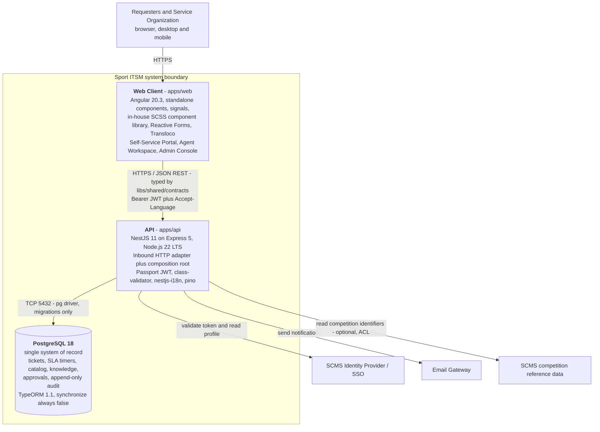

There is deliberately **no message broker, no cache tier and no separate reporting store**: one API process, one database, one client.

#### Layering and the dependency rule

Every bounded context (`incident`, `service-request`, `sla`, `service-catalog`, `knowledge`, `identity-access`, …) is materialized as a set of Nx libraries tagged on three axes — `platform:` / `scope:` / `type:` — and `@nx/enforce-module-boundaries` makes the rule below **mechanical rather than aspirational**.

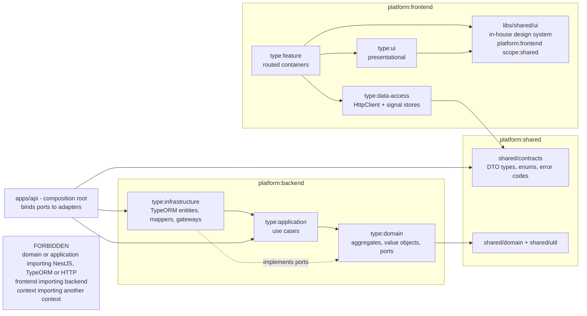

Dependencies point **inward only**: `infrastructure → application → domain`, never the reverse. Domain and application layers contain zero framework, ORM, HTTP or I/O code. Cross-context collaboration (e.g. Incident needing SLA, Approval, Notification or Audit) never becomes an import: the consuming context declares an outbound **port** in its own language and `apps/api` supplies the adapter, so no context-to-context edge ever exists in the Nx graph.

#### Patterns applied and why

| Pattern | Where it applies | Why it was chosen |
| --- | --- | --- |
| **Domain-Driven Design** | One bounded context per ITSM capability | ITSM is a domain with a precise, standardized ubiquitous language (Incident, Problem, Change, SLA, CI, CAB). Modeling it explicitly is what keeps _"a match reschedule is not a ticket"_ enforceable instead of a convention. |
| **Hexagonal (Ports & Adapters)** | Backend, per context | The business rules that matter (Impact × Urgency → Priority, SLA target recalculation, lifecycle transitions) are testable with zero infrastructure, and PostgreSQL/TypeORM/NestJS become replaceable details. |
| **Modular monolith** | Whole system | Fifteen contexts could suggest microservices; delivery is portfolio-scale. One process gives single-transaction consistency and near-zero operational cost, while the Nx boundaries preserve the option to extract a context later. |
| **Nx monorepo + tag boundaries** | Whole system | The architecture is enforced by `pnpm nx lint` in CI, not by review discipline. An illegal dependency fails the build. |
| **Shared typed contracts** | `libs/shared/contracts` | The single permitted coupling between frontend and backend. A breaking API change fails the frontend build immediately — the intended safety property. |
| **Signals-first Angular** | Frontend | Standalone components, `OnPush` everywhere, functional interceptors and signal stores; no NgModules, no external state library. |
| **Event-driven cross-cutting** | Audit, Notification, Reporting | Mutating operations commit first and publish domain events after; a notification outage can never block ticket intake. |

#### Benefits

- **Testability.** Business rules live in framework-free TypeScript. The most valuable tests need no database, no HTTP and no Angular TestBed.
- **Enforced boundaries.** Architectural erosion is caught by the linter, which matters most on a long-lived platform with many capabilities.
- **Evolvability.** Adding `problem`, `change` or `release` in phase 2 is additive: the Incident aggregate already reserves link semantics for them as opaque identifiers.
- **Coherence FE/BE.** One repository, one TypeScript version, one lint/format setup, `nx affected` for changed-only CI, and types that cannot drift between client and server.
- **Replaceable infrastructure.** ORM, identity provider or email gateway are adapters behind ports; swapping one does not touch business logic.

#### Sacrifices and deficits

Honest accounting of what this architecture costs:

- **Ceremony.** A trivial CRUD feature still needs a port, an adapter, a use case, a DTO, a mapper and a contract type. For a small product this is over-engineering; it pays off only because the ITSM domain is genuinely large.
- **Mapping code.** Domain aggregates and TypeORM entities are separate types, so mappers must be written and maintained.
- **A composition root that grows.** Every cross-context collaboration adds one adapter class in `apps/api`. Coupling is not eliminated — it is concentrated in a visible, reviewable place.
- **Single deployable.** Contexts cannot be scaled or released independently; the whole API deploys together, and a defect in one context can affect the process.
- **Eventual consistency in the cross-cutting path.** Audit and notification writes sit outside the ticket transaction. Mitigated with an in-process dispatcher with retry and audit-completeness assertions in acceptance tests, but it is a real trade-off against strict transactional auditing.
- **Learning curve.** DDD + hexagonal + Nx tags is a steep onboarding cost, and the discipline degrades quickly if boundary violations are silenced instead of fixed.

> **Status:** this is the **target architecture**, now partly materialized. The Nx workspace, the pinned toolchain, the ESLint 9 / Prettier 3 layer and the three-axis tag scheme all exist (`T-C10-01` … `T-C10-03`), and `@nx/enforce-module-boundaries` enforces the type matrix, the scope rule and the platform rule — proven to bite by `pnpm verify:boundaries` (10/10). All four applications are scaffolded: `apps/api` (`T-C10-04`), `apps/web` (`T-C10-05`) and the two Cypress + Cucumber acceptance harnesses `apps/api-e2e` and `apps/web-e2e` (`T-C10-06`). The shared kernel exists except for the design system — `libs/shared/util` (`T-C10-07`), `libs/shared/domain` (`T-C10-08`, `T-C10-09`, including `EventPublisherPort` and its `EVENT_PUBLISHER` token) and `libs/shared/contracts` (`T-C10-11`); there is no `libs/shared/ui` — and the first bounded context, `incident`, has its six libraries scaffolded **empty** (`T-C1-01`). `pnpm nx show projects` therefore reports **13** projects, and `pnpm nx lint` passes for all of them. `apps/api` owns the TypeORM data source, the bootstrap migration (`T-C10-16`, `T-C10-17`) and the in-process post-commit event dispatcher (`T-C10-73`). `pnpm nx graph` shows 13 nodes and **exactly two edges**, `api → shared-domain` and `shared-domain → shared-util`; nothing imports `shared-contracts` or any `incident-*` library yet, and each acceptance suite reaches its application through an Nx *task* dependency, which is not a code edge. Still absent: every context domain model, use case and adapter, every product endpoint and the health probes.

### **2.2. Descripción de componentes principales:**

> Describe los componentes más importantes, incluyendo la tecnología utilizada

The system is composed of two deployables — the Angular **Web Client** and the NestJS **API** — plus one PostgreSQL system of record. Everything else is an Nx library: each bounded context contributes a **backend hexagon** (`domain` / `application` / `infrastructure`) and, where it has a UI, a **frontend slice** (`feature` / `ui` / `data-access`). The components below are described by responsibility and technology; their allowed dependencies are the ones already shown in §2.1.

#### 2.2.1 Web Client — `apps/web`

The client is an **Angular 20.3** application: standalone components only, signals for state, `OnPush` everywhere, Reactive Forms, an in-house component library built with plain HTML templates and SCSS design tokens — no third-party component library — and Transloco for i18n. It is a **pure presentation layer**: it holds no authorization decision, derives no Priority and computes no SLA target — it renders what the API decided (NFR-SEC-02).

| Component | Responsibility | Technology |
| --- | --- | --- |
| **Application shell** (`apps/web`) | Bootstrap via `bootstrapApplication` + `provide*` functions, lazy routing, global error handler, theming, cross-context page composition | Angular 20.3, `provideRouter`, `provideHttpClient`, centralized SCSS design tokens as the theming layer |
| **Self-Service Portal** | Requester surface: knowledge search first, log an Incident, request a published catalog offering, track own tickets and SLA status, comment, confirm or reject a resolution, submit CSAT | `knowledge/feature`, `incident/feature`, `service-catalog/feature`, `service-request/feature`, `approval/feature` |
| **Agent Workspace** | Supply-side surface: prioritized work list, triage, categorization, the competition-in-progress flag with mandatory justification, work notes, assignment, resolution | `incident/feature`, `service-request/feature`, `knowledge/feature`, SLA countdown rendered by `incident/ui` |
| **Admin Console** | Configuration-as-data surface: taxonomy, Impact × Urgency matrix, SLA policies, catalog offerings, workflows, notification templates, roles and resolver groups | `service-catalog/feature`, `identity-access/feature` + configuration feature libs |
| **Management dashboards** | Operational and management KPI views (FCR, MTTA, MTTR, SLA compliance, backlog) | `reporting/feature` + `reporting/ui` |
| **`type:feature` libs** | Routed containers: orchestrate the store, drive Reactive Forms, own explicit loading / error / empty states | Angular standalone components, signals, Reactive Forms |
| **`type:ui` libs** | Presentational building blocks with zero injected services (`PriorityBadge`, `SlaCountdown`, `StateChip`, `WorkNoteList`, `CompetitionSubjectPicker`) | Angular `input()` / `output()`, `OnPush`, hand-written HTML + scoped SCSS, native semantics plus ARIA, keyboard handling, focus trap/restore and `aria-live` regions for WCAG 2.1 AA |
| **`libs/shared/ui`** | The in-house **design system**: domain-agnostic presentational primitives every context reuses (button, form field, dialog/overlay, menu, table, tabs, toast, badge, chip), the SCSS design-token layer and the hand-written a11y primitives (focus-trap/restore directive, `aria-live` announcer). State in, events out: no injected service, no store, no I/O. Tagged `platform:frontend scope:shared type:ui` (ADR-010) | Angular `input()` / `output()`, `OnPush`, hand-written HTML + component-scoped SCSS over the shared design tokens; no third-party component library |
| **`type:data-access` libs** | The **only** outbound edge of the client: typed API services plus injectable signal stores exposing `asReadonly()` / `computed()` | `HttpClient` typed exclusively by `libs/shared/contracts`, Angular signals (no NgRx) |
| **Functional interceptors** | `jwtInterceptor` (Bearer token), `localeInterceptor` (`Accept-Language`), `httpErrorInterceptor` (contract error code → Transloco key) | Angular functional interceptors (`withInterceptors`), Transloco |
| **Route guards** | `authGuard` / `roleGuard` — usability only; never the security boundary | Angular functional guards |

#### 2.2.2 API — `apps/api`

`apps/api` is simultaneously the **inbound HTTP adapter** and the **composition root**: it is the only project allowed to see more than one bounded context, because it is where ports are bound to adapters (ADR-002, ADR-003).

| Component | Responsibility | Technology |
| --- | --- | --- |
| **Controllers** | Thin inbound adapter: route, validate, delegate to a use case, map the result to a contract response. No business logic. | NestJS 11 on Express 5, `@nestjs/swagger` decorators |
| **Global `ValidationPipe`** | Reject unvalidated or unexpected payloads (`whitelist`, `forbidNonWhitelisted`, `transform`) | `class-validator` + `class-transformer` |
| **Auth guards & strategy** | Verify the JWT, resolve the actor and their roles for the use-case authorization check | Passport JWT (`passport-jwt`, `@nestjs/jwt`), `bcrypt` for local credentials |
| **License gating** | `@LicenseFeature()` decorator restricting access to gated capabilities | Custom NestJS decorator + guard |
| **Exception filter** | Map domain errors to a stable, contract-declared error-code envelope (codes are contract, text is not) | NestJS exception filter + `nestjs-i18n` |
| **i18n** | Localize API messages and email templates from `Accept-Language` | `nestjs-i18n` 10 |
| **Logging** | Structured logs with request correlation; no `console.log` | `nestjs-pino` |
| **Health probes** | `/health/live`, `/health/ready` — unprefixed, so Sport ITSM outages are detectable independently of user reports (NFR-CFG-03) | `@nestjs/terminus` |
| **API documentation** | OpenAPI at `/api/docs`, **development only** | `@nestjs/swagger` |
| **Composition root modules** | Bind each port token to its adapter (`{ provide: INCIDENT_REPOSITORY, useClass: TypeOrmIncidentRepository }`), and host the **cross-context adapters** (`SlaPolicyAdapter`, `ApprovalAdapter`, `NotificationAdapter`, `AuditAdapter`) | NestJS DI, `Symbol` injection tokens declared beside each port |
| **Scheduled jobs** | Second inbound adapter: SLA warning/breach sweep and auto-close after the confirmation period | NestJS scheduling over the same application use cases |

#### 2.2.3 Bounded-context libraries

Each context owns its hexagon. Phase 1 scaffolds the MVP contexts; `problem`, `change`, `release` and `asset-config` are **phase 2** (PRD §14.4) and are deliberately not generated yet.

| Context | Phase | Core responsibility | Key model elements |
| --- | --- | --- | --- |
| `incident` | 1 | Incident and Major Incident lifecycle, Impact × Urgency prioritization, agent-set competition-impact flag, work notes, escalation | `Incident` (root), `TicketReference`, `Priority`, `CompetitionImpactFlag`, `CompetitionSubject`, `PriorityCalculator` |
| `service-request` | 1 | Fulfillment of entitled catalog offerings, approval routing, fulfillment tasks | `ServiceRequest` (root) with `FulfillmentTask` entities |
| `sla` | 1 | SLA policy resolution, timer state, pause/resume, warnings, breaches, recalculation on Priority change | `SlaPolicy`, `SlaInstance`; no UI of its own — surfaced inside ticket views |
| `service-catalog` | 1 | Services and Service Offerings, request forms, eligibility rules, publication lifecycle | `Service`, `ServiceOffering` |
| `knowledge` | 1 | Knowledge Articles, authoring lifecycle, audience visibility, full-text search | `KnowledgeArticle` |
| `identity-access` | 0/1 | Authentication, RBAC, least privilege, resolver groups and queues | `User`, `Role`, `ResolverGroup`, `IdentityProviderPort` |
| `approval` | 1 | Configurable approval stages, resolvable approvers, immutable decisions | `ApprovalRequest`, `ApprovalDecision` |
| `notification` | 1 | Event-driven dispatch to requesters, agents, approvers and Major Incident stakeholders | `NotificationDispatch` + templates |
| `audit` | 0 | Append-only activity history; no update or delete capability exists at all | `AuditEntry` |
| `reporting` | 1 | Denormalized read models for operational and management dashboards | read models only, no aggregate |
| `problem`, `change`, `release`, `asset-config` | 2 | RCA/KEDB, change authorization and scheduling, release & deployment, CMDB impact analysis | `Problem`/`KnownError`, `Change`, `Release`, `ConfigurationItem`/`CiRelationship` |

Inside every context the three backend libraries have fixed roles, and the technology allowed in each is what the boundary rules enforce:

| Library | Responsibility | Technology allowed |
| --- | --- | --- |
| `<context>/domain` | Aggregates, entities, value objects, domain services, domain events and **outbound port interfaces** | **Pure TypeScript 5.9 only** — no NestJS, no TypeORM, no HTTP, not even `new Date()` (time arrives through `ClockPort`) |
| `<context>/application` | Use cases: orchestration, transaction boundary and the authorization check expressed in domain terms | TypeScript + `libs/shared/contracts` (types only); still no framework |
| `<context>/infrastructure` | Outbound adapters: TypeORM repositories, persistence entities, explicit mappers, external gateways | TypeORM 1.1, `pg`, NestJS DI |

#### 2.2.4 Shared libraries

| Library | Responsibility | Technology |
| --- | --- | --- |
| `libs/shared/contracts` | The **single typed API surface** shared by both platforms: request/response DTO shapes, enums and error codes. Types only — no logic, no framework, no validation decorators (ADR-007) | TypeScript 5.9 |
| `libs/shared/domain` | Shared kernel primitives used by three or more contexts: `Identity`, `TicketReference`, `ImpactLevel`, `UrgencyLevel`, `Priority`, `DomainEvent`, `StateModel`, `ClockPort` | Pure TypeScript |
| `libs/shared/ui` | The in-house design system reused by every context: presentational primitives, the SCSS design-token layer and the accessibility primitives (focus-trap/restore directive, `aria-live` announcer). Angular code with a shared scope, so it is tagged `platform:frontend scope:shared type:ui`, not `platform:shared` (ADR-010) | Angular 20.3 standalone components, `OnPush`, component-scoped SCSS |
| `libs/shared/util` | Pure, dependency-free helpers | Pure TypeScript |

#### 2.2.5 Persistence

**PostgreSQL 18** is the single system of record for every context: tickets, SLA timer timestamps, catalog, knowledge, approvals and the append-only audit trail. Access goes exclusively through **TypeORM 1.1** repositories in `type:infrastructure`, where persistence entities are **separate classes** from domain aggregates with an explicit mapper (ADR-005). `synchronize` is always `false`; the schema evolves only through **migrations** (`pnpm typeorm migration:generate|run|revert -d apps/api/src/data-source.ts`), auto-run only in development. No business rule lives in a trigger or stored procedure. All instants are stored in UTC so SLA timers survive restarts and remain time-zone correct.

#### 2.2.6 Cross-cutting components

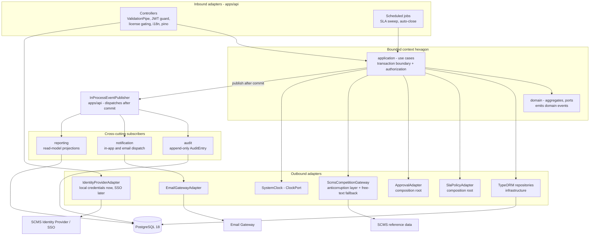

| Component | Responsibility | Technology / placement |
| --- | --- | --- |
| **Domain-event dispatcher** | Single in-process publisher; use cases commit the aggregate first and publish afterwards, so a failing subscriber can never roll back ticket intake (NFR-AVL-03) | `EventPublisherPort` in each context's domain, `InProcessEventPublisher` in `apps/api`; no broker in the MVP |
| **Audit component** | Records an immutable entry for every state transition, field change, assignment, comment, approval, notification and rule execution. Immutability is structural: `AuditRepositoryPort` exposes no update or delete method | `audit` context, TypeORM append-only table |
| **Notification component** | Templated, localizable in-app and email notifications to requesters, agents, approvers and Major Incident stakeholders; every dispatch is recorded against its source record | `notification` context + email gateway adapter, `nestjs-i18n` templates |
| **SLA timer engine** | Attaches a policy at creation, recalculates targets from the original creation time on Priority change, pauses/resumes on configured pending states, raises warnings and breach records, triggers escalation | `sla` context; timer state persisted as UTC timestamps in PostgreSQL, swept by a scheduled job — never in-memory counters |
| **Configuration as data** | Taxonomy, Impact × Urgency matrix, SLA policies, state models, approval chains and notification templates are persisted aggregates edited from the Admin Console, not code | Owning contexts + Admin Console |
| **Observability** | Structured request-correlated logs and liveness/readiness probes | `nestjs-pino`, `@nestjs/terminus` |

#### 2.2.7 External integrations

Every integration is a **port with an adapter**, so none of them is a hard runtime prerequisite for logging a ticket.

| Integration | Purpose | Component |
| --- | --- | --- |
| **SCMS competition reference data** | Read-only lookup of competition identifiers and labels so a ticket can name its affected subject. Sport ITSM consumes no competition calendar and derives no time-based policy from it | `CompetitionSubjectLookupPort` + `ScmsCompetitionGateway` **anticorruption layer**, with a free-text fallback adapter (PRD R10) |
| **SCMS Identity Provider / SSO** | Authentication and profile/entitlement attributes | `IdentityProviderPort` in `identity-access/domain`; local-credential adapter first, SSO adapter later (FR-IAM-04) |
| **Email gateway** | Outbound notification delivery | Adapter behind the `notification` context's outbound port (SMTP/HTTPS) |

> **Status:** as in §2.1, these components describe the **target architecture**. Two of them exist as scaffolding — the **API** (`apps/api`, NestJS 11, `T-C10-04`) and the **Web Client** (`apps/web`, Angular 20 standalone shell, `T-C10-05`), both building and linting green. The Web Client carries none of the responsibilities described above and imports no library. The API carries only composition-root plumbing: the TypeORM data source (`apps/api/src/data-source.ts`, `T-C10-16`), one bootstrap migration (the `iam` schema and the `citext` and `pg_trgm` extensions, `T-C10-17`) and the post-commit event dispatcher (`apps/api/src/event-dispatch/`, `T-C10-73`); it exposes no product endpoint and no health probe. The shared kernel (`shared-util`, `shared-domain`, `shared-contracts`) exists, `libs/shared/ui` does not, and the six `incident-*` libraries are empty. **PostgreSQL 18** is provisioned only as containers — `docker/docker-compose.dev.yml` for development (host port 5452) and an ephemeral instance that `pnpm nx e2e api-e2e` brings up, migrates and tears down; no context table, no TypeORM entity and no external gateway exists. The boundary rule is configured and proven (`T-C10-03`), and now judges two real edges: `api → shared-domain` and `shared-domain → shared-util`.

### **2.3. Descripción de alto nivel del proyecto y estructura de ficheros**

> Representa la estructura del proyecto y explica brevemente el propósito de las carpetas principales, así como si obedece a algún patrón o arquitectura específica.

Sport ITSM is delivered as a **single Nx 21.6 monorepo**, managed with **pnpm** as the only package manager, holding the whole system: the NestJS **API** (`apps/api`), the Angular **Web Client** (`apps/web`), their two Cypress + Cucumber acceptance suites, and every bounded-context library under `libs/`. It is a **modular monolith**: one deployable API process, one deployable web client and one PostgreSQL system of record, with the modularity enforced logically by the workspace structure rather than physically by network hops.

The layout is a direct projection of the architecture described in §2.1 and §2.2. Each ITSM capability is a **bounded context** with its own folder under `libs/`, and inside that folder the **hexagonal layers** are separate Nx libraries: `domain` (pure model and ports), `application` (use cases), `infrastructure` (outbound adapters) on the backend side, and `feature` / `ui` / `data-access` on the frontend side. `libs/shared/` holds the shared kernel, the typed contracts that are the only permitted coupling between the two platforms, and `libs/shared/ui`, the in-house design system reused by every context. In this repository the **folder structure _is_ the architecture**: a file's path determines the tags of the project it belongs to, and those tags determine what it is allowed to import. A standalone version of this section lives in [`docs/product/PROJECT-STRUCTURE.md`](docs/product/PROJECT-STRUCTURE.md).

#### 2.3.1 Directory tree

```text
AI4Devs-finalproject/
├─ nx.json                          # Nx workspace config: plugins, named inputs, target defaults, release
├─ package.json                     # single root manifest - pinned deps for both platforms
├─ pnpm-workspace.yaml              # pnpm workspace definition (pnpm is the only supported package manager)
├─ pnpm-lock.yaml                   # the only lockfile allowed in the repository
├─ tsconfig.base.json               # TypeScript 5.9 strict + path aliases (@sport-itsm/<lib>) for every library
├─ eslint.config.mjs                # ESLint 9 flat config - hosts @nx/enforce-module-boundaries (the boundary matrix)
├─ .prettierrc                      # Prettier 3 - single quotes, semicolons; formatting is never hand-made
├─ jest.preset.js                   # shared Jest 29 preset
├─ .gitignore
│
├─ apps/
│  ├─ api/                          # platform:backend  scope:shared  type:app
│  │  ├─ src/
│  │  │  ├─ main.ts                 # bootstrap: global prefix /api, ValidationPipe, pino, i18n, Swagger (dev only)
│  │  │  ├─ data-source.ts          # TypeORM DataSource used by the migration CLI (synchronize: false)
│  │  │  ├─ event-dispatch/         # single post-commit domain-event dispatcher, bound to EVENT_PUBLISHER
│  │  │  ├─ testing/                # test-only HTTP harness, in the module graph only when NODE_ENV=test
│  │  │  ├─ app/
│  │  │  │  ├─ app.module.ts        # root module: imports every context composition module
│  │  │  │  ├─ incident/            # composition root slice for the incident context
│  │  │  │  │  ├─ incident.module.ts            # binds ports to adapters: { provide: INCIDENT_REPOSITORY, useClass: … }
│  │  │  │  │  ├─ incident.controller.ts        # thin inbound HTTP adapter - no business logic
│  │  │  │  │  ├─ dto/
│  │  │  │  │  │  ├─ log-incident.dto.ts        # class-validator DTO implementing the contract type
│  │  │  │  │  │  └─ set-competition-impact.dto.ts
│  │  │  │  │  └─ adapters/
│  │  │  │  │     ├─ sla-policy.adapter.ts      # cross-context adapter: incident's SlaPolicyPort -> sla/application
│  │  │  │  │     ├─ approval.adapter.ts
│  │  │  │  │     └─ audit.adapter.ts
│  │  │  │  ├─ sla/
│  │  │  │  │  ├─ sla.module.ts
│  │  │  │  │  └─ jobs/sla-sweep.job.ts         # second inbound adapter: warning/breach sweep, auto-close
│  │  │  │  ├─ service-request/  knowledge/  service-catalog/  identity-access/
│  │  │  │  └─ approval/  notification/  audit/  reporting/
│  │  │  ├─ common/
│  │  │  │  ├─ filters/domain-error.filter.ts   # domain error -> contract error-code envelope
│  │  │  │  ├─ guards/jwt-auth.guard.ts
│  │  │  │  ├─ guards/license-feature.guard.ts
│  │  │  │  ├─ decorators/license-feature.decorator.ts
│  │  │  │  └─ auth/jwt.strategy.ts             # Passport JWT
│  │  │  ├─ config/
│  │  │  │  ├─ configuration.ts                 # @nestjs/config factory - no raw process.env in feature code
│  │  │  │  └─ env.validation.ts                # validated environment schema
│  │  │  ├─ health/
│  │  │  │  ├─ health.controller.ts             # /health/live and /health/ready - NOT under /api
│  │  │  │  └─ health.module.ts
│  │  │  ├─ i18n/
│  │  │  │  ├─ en/{errors,notifications}.json
│  │  │  │  └─ es/{errors,notifications}.json
│  │  │  └─ migrations/
│  │  │     ├─ README.md                        # naming, registration and reversibility conventions
│  │  │     ├─ 1790349248155-CreateIamSchemaAndExtensions.ts   # bootstrap: iam schema, citext, pg_trgm
│  │  │     └─ <timestamp>-CreateIncidentTables.ts             # target: one migration per context schema
│  │  ├─ jest.config.ts
│  │  ├─ project.json                           # Nx targets + the three tags
│  │  └─ tsconfig.{json,app.json,spec.json}
│  │
│  ├─ api-e2e/                       # platform:backend  scope:shared  type:e2e
│  │  ├─ src/
│  │  │  ├─ features/                           # Gherkin, traced to PRD acceptance criteria
│  │  │  │  ├─ harness-smoke.feature            # exists (T-C10-06): the API under test answers HTTP
│  │  │  │  ├─ event-dispatch-harness.feature   # exists (T-C10-73): post-commit dispatch via the NODE_ENV=test harness
│  │  │  │  └─ log-incident.feature             # target: first product scenario (C1)
│  │  │  ├─ step-definitions/                   # one *.steps.ts per feature
│  │  │  └─ support/
│  │  ├─ cypress.config.ts
│  │  └─ project.json
│  │
│  ├─ web/                           # platform:frontend scope:shared  type:app
│  │  ├─ src/
│  │  │  ├─ main.ts                             # bootstrapApplication(AppComponent, appConfig)
│  │  │  ├─ index.html
│  │  │  ├─ styles.scss                         # global SCSS design tokens + base theme
│  │  │  └─ app/
│  │  │     ├─ app.component.ts                 # shell
│  │  │     ├─ app.config.ts                    # provideRouter, provideHttpClient(withInterceptors), Transloco, ErrorHandler
│  │  │     ├─ app.routes.ts                    # lazy loadChildren into each context's feature lib
│  │  │     ├─ interceptors/
│  │  │     │  ├─ jwt.interceptor.ts            # Bearer token
│  │  │     │  ├─ locale.interceptor.ts         # Accept-Language
│  │  │     │  └─ http-error.interceptor.ts     # contract error code -> Transloco key
│  │  │     └─ guards/{auth.guard.ts,role.guard.ts}   # usability only, never the security boundary
│  │  ├─ jest.config.ts
│  │  └─ project.json
│  │
│  └─ web-e2e/                       # platform:frontend scope:shared  type:e2e
│     └─ src/{features,step-definitions,support}/
│
├─ libs/
│  ├─ shared/
│  │  ├─ contracts/                  # platform:shared scope:shared type:contracts - types only (ADR-007)
│  │  │  └─ src/
│  │  │     ├─ index.ts                          # public barrel
│  │  │     └─ lib/
│  │  │        ├─ incident/{log-incident.request.ts,incident-detail.response.ts,incident.enums.ts}
│  │  │        ├─ sla/…  service-request/…  knowledge/…
│  │  │        └─ errors/error-code.ts           # stable error codes shared FE+BE
│  │  ├─ domain/                     # platform:shared scope:shared type:domain - shared kernel primitives
│  │  │  └─ src/lib/{identity.ts,ticket-reference.vo.ts,priority.vo.ts,domain-event.ts,state-model.ts,clock.port.ts}
│  │  ├─ ui/                         # platform:frontend scope:shared type:ui - in-house design system (ADR-010)
│  │  │  └─ src/lib/{button/,form-field/,dialog/,menu/,table/,tabs/,toast/,badge/,chip/,a11y/{focus-trap.directive.ts,live-announcer.service.ts},styles/_tokens.scss}
│  │  └─ util/                       # platform:shared scope:shared type:util - pure helpers
│  │
│  ├─ incident/                      # one folder per bounded context
│  │  ├─ domain/                     # platform:backend scope:incident type:domain   (PURE TypeScript)
│  │  │  └─ src/
│  │  │     ├─ index.ts
│  │  │     └─ lib/
│  │  │        ├─ model/
│  │  │        │  ├─ incident.aggregate.ts       # aggregate root
│  │  │        │  ├─ incident.aggregate.spec.ts
│  │  │        │  ├─ work-note.ts                # domain entity (NOT *.entity.ts - see 2.3.3)
│  │  │        │  └─ incident-state.ts
│  │  │        ├─ value-objects/{competition-impact-flag.vo.ts,competition-subject.vo.ts,origin-channel.vo.ts}
│  │  │        ├─ services/priority-calculator.ts        # domain service over the Impact x Urgency matrix
│  │  │        ├─ events/{incident-logged.event.ts,priority-changed.event.ts,incident-resolved.event.ts}
│  │  │        ├─ ports/
│  │  │        │  ├─ incident-repository.port.ts # interface + Symbol injection token
│  │  │        │  ├─ sla-policy.port.ts          # outbound port in incident's OWN language
│  │  │        │  └─ event-publisher.port.ts
│  │  │        └─ errors/incident.errors.ts      # typed domain errors
│  │  ├─ application/                # platform:backend scope:incident type:application
│  │  │  └─ src/lib/
│  │  │     ├─ use-cases/
│  │  │     │  ├─ log-incident.use-case.ts
│  │  │     │  ├─ log-incident.use-case.spec.ts  # unit test with zero infrastructure
│  │  │     │  ├─ triage-incident.use-case.ts
│  │  │     │  └─ set-competition-impact-flag.use-case.ts
│  │  │     ├─ authorization/incident.policies.ts        # authorization expressed in domain terms
│  │  │     └─ mappers/incident-response.mapper.ts       # aggregate -> contract response
│  │  ├─ infrastructure/             # platform:backend scope:incident type:infrastructure
│  │  │  └─ src/lib/
│  │  │     ├─ persistence/
│  │  │     │  ├─ entities/{incident.entity.ts,work-note.entity.ts}   # TypeORM persistence entities
│  │  │     │  ├─ mappers/incident.mapper.ts                          # entity <-> aggregate (ADR-005)
│  │  │     │  └─ typeorm-incident.repository.ts                      # implements IncidentRepositoryPort
│  │  │     └─ gateways/scms-competition.gateway.ts                   # anticorruption layer + free-text fallback
│  │  ├─ feature/                    # platform:frontend scope:incident type:feature
│  │  │  └─ src/lib/
│  │  │     ├─ incident.routes.ts                # lazy route definitions consumed by apps/web
│  │  │     └─ pages/
│  │  │        ├─ incident-list/{incident-list.page.ts,.html,.scss,.spec.ts}
│  │  │        ├─ incident-detail/…
│  │  │        └─ log-incident/…                 # Reactive Form container
│  │  ├─ ui/                         # platform:frontend scope:incident type:ui
│  │  │  └─ src/lib/
│  │  │     ├─ priority-badge/{priority-badge.component.ts,.html,.scss,.spec.ts}
│  │  │     ├─ sla-countdown/…
│  │  │     └─ work-note-list/…                  # OnPush, input()/output(), zero injected services
│  │  └─ data-access/                # platform:frontend scope:incident type:data-access
│  │     └─ src/lib/
│  │        ├─ incident-api.service.ts           # the only place HttpClient is injected
│  │        ├─ incident.store.ts                 # signal store, exposes asReadonly()/computed()
│  │        └─ incident.store.spec.ts
│  │
│  ├─ service-request/               # same six libs
│  ├─ sla/                           # domain, application, infrastructure (no UI of its own)
│  ├─ service-catalog/  knowledge/   # six libs each
│  ├─ identity-access/               # domain, application, infrastructure, feature, data-access
│  ├─ approval/  notification/  audit/  reporting/    # generic supporting contexts (ADR-001)
│  └─ problem/  change/  release/  asset-config/      # PHASE 2 - deliberately not scaffolded yet
│
├─ docs/
│  ├─ product/
│  │  ├─ PRD.md                      # product requirements (behavioral authority for the MVP)
│  │  ├─ ARCHITECTURE.md             # target architecture: C4, context map, hexagon, ADR-001..013 (§10)
│  │  ├─ DATA-MODEL.md               # prescriptive relational schema, per context schema
│  │  ├─ COMPONENTS.md               # main components (companion to §2.2)
│  │  └─ PROJECT-STRUCTURE.md        # companion to this section
│  ├─ backlog/                       # derived from the PRD: epic-map.md, <key>/user-stories.md, <key>/tickets/
│  └─ adr/                           # target, not created yet: ADRs still live in ARCHITECTURE.md §10
│
├─ .claude/
│  ├─ agents/{sport-itsm-product-owner,sport-itsm-architect,business-analyst,architect-tech-lead,
│  │         backend-engineer,frontend-engineer,testing-implementer,ci-cd-expert}.md
│  └─ skills/{sport-itsm-architecture,sport-itsm-backend,sport-itsm-frontend,
│             sport-itsm-engineering-principles,sport-itsm-workflow,service-desk-expert,feature-docs,…}/
│
├─ CLAUDE.md                         # operational context for AI agents working in this repo
├─ readme.md                         # this document
└─ prompts.md
```

#### 2.3.2 Purpose of each main folder

| Path | Purpose |
| --- | --- |
| Root config files | One workspace-wide configuration for both platforms: `nx.json` (task graph, caching), `package.json` + `pnpm-workspace.yaml` + `pnpm-lock.yaml` (single dependency set, pinned majors), `tsconfig.base.json` (strict TypeScript and the `@sport-itsm/*` path aliases that make libraries importable), `eslint.config.mjs` (where the architecture is actually enforced) and `.prettierrc`. |
| `apps/api` | The NestJS deployable: **inbound HTTP adapter** (controllers, DTOs, guards, filters) **and composition root** (binds every port token to a concrete adapter, hosts the cross-context adapters and the in-process event publisher). Also owns the TypeORM data source, migrations, i18n resources and health probes. |
| `apps/api-e2e` | Cypress 15 + Cucumber acceptance tests for the API, written as Gherkin traced to PRD acceptance criteria. |
| `apps/web` | The Angular deployable **shell**: bootstrap and `provide*` configuration, lazy routing into feature libs, functional interceptors, route guards, theming and cross-context page composition. It holds no business logic. |
| `apps/web-e2e` | Cypress 15 + Cucumber acceptance tests for the UI. |
| `libs/<context>/domain` | The pure heart of a bounded context: aggregates, entities, value objects, domain services, domain events and **outbound port interfaces**. No framework, no ORM, no HTTP, not even `new Date()`. |
| `libs/<context>/application` | Use cases: orchestration, transaction boundary and the authorization check expressed in domain terms. May import `shared/contracts` (types only); still framework-free. |
| `libs/<context>/infrastructure` | Outbound adapters: TypeORM repositories, persistence entities, explicit mappers and external gateways. |
| `libs/<context>/feature` | Angular routed containers for the context: orchestrate the store, drive Reactive Forms, own explicit loading / error / empty states. |
| `libs/<context>/ui` | Presentational Angular components with `OnPush` and zero injected services. |
| `libs/<context>/data-access` | The only outbound edge of the client: typed API services and signal stores. |
| `libs/shared/contracts` | The single typed API surface shared by frontend and backend — DTO shapes, enums and error codes. Types only. |
| `libs/shared/domain` | Shared kernel primitives genuinely used by three or more contexts (`Identity`, `TicketReference`, `Priority`, `DomainEvent`, `StateModel` — target, not built yet (`T-C10-10`) — and `ClockPort`). Deliberately kept small. |
| `libs/shared/ui` | The in-house **design system**: domain-agnostic presentational components reusable by any context (button, form field, dialog/overlay, menu, table, tabs, toast, badge, chip), the SCSS design-token layer and the hand-written accessibility primitives (focus-trap/restore directive, `aria-live` announcer). Angular code with a shared scope, therefore tagged `platform:frontend scope:shared type:ui`, not `platform:shared` (ADR-010). It injects no service and performs no I/O. |
| `libs/shared/util` | Pure, dependency-free helpers. |
| `docs/` | `docs/product/`: PRD, architecture, data model, components and project structure. `docs/backlog/`: the backlog derived from the PRD (epic map, user stories, tickets). `docs/adr/` is the intended home of individual Architecture Decision Records; it does not exist yet — the ADRs still live in `ARCHITECTURE.md` §10. |
| `.claude/` | The AI operating model: **agents** (Product Owner, Software Architect, Business Analyst, Architect / Tech Lead, backend engineer, frontend engineer, testing implementer, CI/CD expert) and **skills** (architecture, backend, frontend, engineering principles, workflow, CI/CD, ITSM domain, backlog roles, documentation standard). |

#### 2.3.3 Naming and file conventions

| Convention | Rule |
| --- | --- |
| **File names** | `kebab-case.ts` everywhere, on both platforms — the default produced by the Nx, Nest and Angular generators. Directory names are kebab-case too, and match the context / library name. |
| **Public API** | Every library exposes exactly one barrel, `src/index.ts`. Cross-project imports go through the barrel and the `@sport-itsm/*` path alias; deep-importing past a barrel is a boundary violation. |
| **Project names and tags** | An Nx project is named `<context>-<type>` (`incident-domain`, `incident-data-access`) and lives at `libs/<context>/<type>/`. Its `project.json` carries exactly three tags: `platform:`, `scope:`, `type:`. |
| **Domain model** | Aggregate roots are `*.aggregate.ts`, value objects `*.vo.ts`, domain events `*.event.ts`, ports `*.port.ts`, typed errors `*.errors.ts`. Plain domain entities inside an aggregate use their bare noun (`work-note.ts`). |
| **`*.entity.ts` is reserved for persistence** | Only TypeORM persistence entities in `libs/<context>/infrastructure/**/persistence/entities/` use the `*.entity.ts` suffix. The suffix therefore signals "this class is an ORM artifact, not the domain model" — the visible expression of ADR-005 (aggregates and entities are separate classes joined by an explicit `*.mapper.ts`). |
| **Use cases** | One use case per file, `*.use-case.ts`, named with the domain verb (`log-incident.use-case.ts`, `set-competition-impact-flag.use-case.ts`). |
| **NestJS artifacts** | `*.controller.ts`, `*.module.ts`, `*.dto.ts`, `*.guard.ts`, `*.filter.ts`, `*.strategy.ts`, `*.decorator.ts`, and `*.adapter.ts` for the composition-root adapters that implement a port. |
| **Angular artifacts** | `*.page.ts` for routed containers in `feature`, `*.component.ts` for presentational components in `ui`, `*.service.ts` and `*.store.ts` in `data-access`, `*.interceptor.ts` / `*.guard.ts` in the shell, `*.routes.ts` for route definitions. Templates and styles sit beside the class as `*.html` / `*.scss`. |
| **Tests** | Jest specs live **next to the code they test** as `*.spec.ts`. Acceptance tests are Gherkin `*.feature` files in `apps/*-e2e/src/features/` with `*.steps.ts` step definitions. |
| **Migrations** | Generated into `apps/api/src/migrations/` by the TypeORM CLI as `<timestamp>-<PascalCaseName>.ts`; the name describes the schema change (`1712345679002-CreateIncidentTables.ts`). Migrations are the only mechanism for schema evolution. |
| **Ubiquitous language** | Identifiers use the exact ITSM terms of their bounded context (Incident, Service Request, Resolver Group, SLA, Configuration Item). No abbreviations invented locally. |

#### 2.3.4 The pattern the structure obeys

The tree is not an arbitrary organization: it is the **Nx monorepo + DDD bounded contexts + Hexagonal layering** triple, made mechanical.

1. **The first level under `libs/` is a bounded context.** Each ITSM capability owns a folder and a ubiquitous language. Nothing cross-cutting is allowed to live above it except the deliberately minimal `libs/shared/`.
2. **The second level is a hexagonal layer.** `domain` / `application` / `infrastructure` are the backend hexagon; `feature` / `ui` / `data-access` are the frontend slice. A file's layer is therefore visible from its path, and so is the set of imports it is permitted.
3. **Every project carries three tags** — `platform:` (`backend` / `frontend` / `shared`), `scope:` (`<context>` / `shared`) and `type:` (`domain`, `application`, `infrastructure`, `feature`, `ui`, `data-access`, `contracts`, `util`, plus `app` and `e2e` for the four applications, ADR-002). Libraries are created only with Nx generators and explicit `--tags`, so structure and tags never drift. The one nuance worth memorizing: `libs/shared/ui` is `platform:frontend`, not `platform:shared` — a shared _scope_ never implies a shared _platform_ (ADR-010).
4. **`@nx/enforce-module-boundaries` in `eslint.config.mjs` turns the three axes into build-time rules.** The `type:` matrix implements the inward-only dependency rule (`infrastructure → application → domain`, never the reverse); the `scope:` rule implements context isolation (a context may depend only on itself and `scope:shared`); the `platform:` rule keeps frontend and backend from ever importing each other. An illegal import fails `pnpm nx lint`.
5. **`apps/api` is the only escape hatch, and it is a designed one.** Tagged `scope:shared`, `type:app`, it is the composition root: the single place that sees more than one context, because that is where a context's outbound port is bound to an adapter delegating to another context's application layer (ADR-003). No library may depend on an app, so the privilege cannot spread.

The consequence worth stating plainly: **in this repository the folder structure is the architecture.** Moving a file to a different folder changes what it is allowed to depend on, and the linter — not a reviewer — decides whether that is legal.

#### 2.3.5 Documentation, specification and agent folders

- **`docs/product/PRD.md`** is the single canonical source of **product behavior**, for the life of the project. There is no `openspec/` directory and no spec-delta workflow: a behavior change is made in the PRD by the Product Owner, and the derived backlog under `docs/backlog/` is regenerated from it.
- **`docs/`** also holds the engineering counterpart: the architecture document, the component reference, the project-structure document, and `docs/adr/`, the intended home of the structural decisions currently embedded in `ARCHITECTURE.md` §10 once they are promoted to individual ADR files. That promotion has not happened: `docs/adr/` does not exist today, and `ARCHITECTURE.md` §10 remains the only ADR record.
- **`.claude/`** holds the AI operating model: **agents** (`sport-itsm-product-owner`, `sport-itsm-architect`, `business-analyst`, `architect-tech-lead`, `backend-engineer`, `frontend-engineer`, `testing-implementer`, `ci-cd-expert`) are roles, and **skills** are the layered, reusable guardrails they consume — business (`service-desk-expert`), system (`sport-itsm-architecture`), craft (`sport-itsm-engineering-principles`), stack (`sport-itsm-backend`, `sport-itsm-frontend`) and documentation (`feature-docs`). `CLAUDE.md` at the root is the entry point that ties them together.

#### 2.3.6 Useful commands

Every command runs from the **repository root**, through **pnpm + Nx**. **Node 22 LTS** is required (pinned in `.nvmrc` and in `package.json` → `engines`) and **pnpm is the only supported package manager** — running `npm install` or `yarn` here would produce a second lockfile and is forbidden.

The **Availability** column distinguishes what runs *today* — on a workspace holding the four applications, the shared kernel (`shared-util`, `shared-domain`, `shared-contracts`) and the six empty `incident-*` libraries, 13 projects in all — from what only becomes meaningful once more of `libs/` is generated.

**Workspace and toolchain**

| Command | What it does | Availability |
| --- | --- | --- |
| `pnpm install` | Installs every workspace dependency and writes/refreshes the single `pnpm-lock.yaml`. First command after any clone. | Now |
| `pnpm nx report` | Prints the resolved Node, pnpm, Nx and TypeScript versions plus every installed Nx plugin. Fastest way to confirm the pinned toolchain of §2 of `CLAUDE.md`. | Now |
| `pnpm nx reset` | Clears the local Nx cache (`.nx/cache`) and stops the Nx daemon. Use when the cache or the project graph looks stale. | Now |

**Lint and format**

ESLint 9 uses a **flat config** at `eslint.config.mjs` (there is no `.eslintrc` and no fallback to one), and Prettier 3 owns all formatting — `eslint-config-prettier` switches off every ESLint rule that would compete with it. Neither tool treats `docs/` or `.claude/` as workspace source: `.nxignore`, `.prettierignore` and the ESLint `ignores` block exclude them, so the documentation corpus and the vendored skill assets are never linted, reformatted or inferred as Nx projects.

| Command | What it does | Availability |
| --- | --- | --- |
| `pnpm nx run-many -t lint` | Runs the `lint` target of every project — today all 13, all green. It no longer exits `0` vacuously, but a green lint over legal code still does not prove the boundary rule bites; see the boundary verification below. | Now |
| `pnpm eslint <path>` | Lints files directly, bypassing Nx and its project graph. Useful for exercising the config on a path that belongs to no project. | Now |
| `pnpm eslint --print-config <path>` | Prints the fully resolved config for one file path. Use it to check *which* rules apply where — Angular rules must appear on `apps/web/**` and the frontend library types, and must be absent on `apps/api/**`. | Now |
| `pnpm prettier --check .` | Fails if any non-ignored file deviates from `.prettierrc` (`singleQuote`, `semi`). The CI formatting gate. | Now |
| `pnpm prettier --write .` | Rewrites those files in place. | Now |
| `pnpm nx format:check` / `pnpm nx format:write` | Nx's own wrapper over Prettier, restricted to files changed against `defaultBase`. Cheaper than scanning the whole tree. | Now |

**Structure, boundaries and the dependency graph**

| Command | What it does | Availability |
| --- | --- | --- |
| `pnpm nx show projects` | Lists every Nx project in the workspace. Currently returns exactly 13: `api`, `api-e2e`, `web`, `web-e2e`, `shared-contracts`, `shared-domain`, `shared-util` and the six `incident-*` libraries (`domain`, `application`, `infrastructure`, `feature`, `ui`, `data-access`); anything else means a project was generated outside its ticket. | Now |
| `pnpm nx graph` | Opens the interactive dependency graph in a browser. The visual check that a context depends only on itself and `scope:shared`. | Now |
| `pnpm nx graph --file=tmp/graph.json` | Writes the same graph as JSON without opening a browser — the CI-friendly and scriptable form. | Now |
| `pnpm nx lint <project>` | Runs ESLint on one project, **including `@nx/enforce-module-boundaries`**. This is the command that turns the three-axis tag scheme of §2.3.4 into a build failure. | Now |
| `pnpm verify:boundaries` | Proves the boundary rule still bites, by scaffolding deliberate violations and asserting each is caught. See the boundary verification below. | Now |
| `pnpm nx affected -t lint test build` | Runs lint, test and build only for the projects affected by the current change, against `defaultBase` (`main`). The CI gate. | Now |

**Serve, build and test**

| Command | What it does | Availability |
| --- | --- | --- |
| `pnpm nx serve api` / `pnpm nx serve web` | Runs the NestJS API / the Angular web client in development mode with watch. | Now |
| `pnpm nx build api` / `pnpm nx build web` | Produces the production bundle of each application under `dist/`. | Now |
| `pnpm nx test <project>` | Runs the Jest unit/component suite of one project (`incident-domain`, `api`, `web`…). Real today for `shared-util` (3 suites / 19 tests), `shared-domain` (8 / 86), `shared-contracts` (1 / 2) and `api` (2 / 15 — the event dispatcher and the gating of its test harness). For `web` and the six `incident-*` libraries the suites are still **empty** and pass via `passWithNoTests` — there a green result proves the runner works, nothing more. | Now |
| `pnpm nx e2e api-e2e` / `pnpm nx e2e web-e2e` | Runs the Cypress + Cucumber acceptance suites (Gherkin `*.feature` + `*.steps.ts`). Each target starts the application under test itself and tears it down afterwards; `api-e2e` also brings up its own ephemeral PostgreSQL (host port 5499), applies the migrations to it and tears it down, pass or fail, so it needs a running Docker daemon. `api-e2e` holds two scenarios (the harness smoke test and the event-dispatch harness), `web-e2e` one smoke scenario; the epic's own scenarios arrive with the tickets that own the behavior. From a VS Code integrated terminal, run `unset ELECTRON_RUN_AS_NODE` in the same command first — the inherited variable makes the Cypress binary fail before any test runs. | Now |

**Schema evolution (TypeORM)**

The data source lives at `apps/api/src/data-source.ts`, and the chain in `apps/api/src/migrations/` (conventions in its `README.md`; today one bootstrap migration). `synchronize` is always `false`: migrations are the **only** mechanism for schema change. Every command needs a reachable PostgreSQL — locally `docker/docker-compose.dev.yml`, published on **host port 5452**. The shorthand scripts `pnpm migration:generate <path/Name>`, `pnpm migration:run`, `pnpm migration:revert` and `pnpm migration:show` already carry `-d apps/api/src/data-source.ts` — do not add a second `-d`; `pnpm migration:run:deploy` runs the compiled `dist/apps/api/data-source.js` produced by `pnpm nx run api:build-migrations`.

| Command | What it does | Availability |
| --- | --- | --- |
| `pnpm typeorm migration:generate -d apps/api/src/data-source.ts <path/Name>` | Diffs the entity model against the database and writes a new timestamped migration. | Now (meaningful once entities exist) |
| `pnpm typeorm migration:run -d apps/api/src/data-source.ts` | Applies every pending migration. | Now |
| `pnpm typeorm migration:revert -d apps/api/src/data-source.ts` | Rolls back the last applied migration. | Now |

##### Bootstrap verification

The four checks below are the acceptance criteria of ticket **`T-C10-01` · Bootstrap the Nx workspace with pnpm and strict TypeScript**. They are purely mechanical and they all run **today**, on the empty workspace — re-run them after any clone, any toolchain upgrade or any change to `package.json`, `nx.json` or `tsconfig.base.json`.

**AC1 — `pnpm install` succeeds and leaves exactly one lockfile.** No `package-lock.json` and no `yarn.lock` may be produced anywhere.

```bash
pnpm install
find . -path ./node_modules -prune -o -path ./.git -prune -o \
  \( -name 'pnpm-lock.yaml' -o -name 'package-lock.json' -o -name 'yarn.lock' \) -print
```

```powershell
# PowerShell equivalent of the lockfile scan
Get-ChildItem -Recurse -File -Include pnpm-lock.yaml,package-lock.json,yarn.lock |
  Where-Object { $_.FullName -notmatch '\node_modules\|\\.git\' } |
  Select-Object -ExpandProperty FullName
```

Expected: `pnpm install` exits `0`, and the scan returns `./pnpm-lock.yaml` as the only workspace lockfile. (A pre-existing `package-lock.json` is vendored inside `.claude/skills/nestjs-best-practices/scripts/` — it belongs to a skill asset, not to this workspace, and is not produced by the install.)

**AC2 — the pinned toolchain is the one actually resolved.**

```bash
pnpm nx report
```

Expected — Nx **21.6.x**, TypeScript **5.9.x**, Node **22.x**:

```
Node           : 22.20.0
pnpm           : 10.18.3
nx             : 21.6.11
@nx/js         : 21.6.11
@nx/workspace  : 21.6.11
@nx/devkit     : 21.6.11
typescript     : 5.9.3
```

**AC3 — `tsconfig.base.json` is strict.** Every project tsconfig extends it, so these four flags are inherited workspace-wide.

```bash
node -e "const c=JSON.parse(require('fs').readFileSync('tsconfig.base.json','utf8')).compilerOptions; \
['strict','noImplicitOverride','noUnusedLocals','noFallthroughCasesInSwitch'].forEach(k=>console.log(k.padEnd(30),'=',c[k]))"
```

Expected — all four `true`:

```
strict                         = true
noImplicitOverride             = true
noUnusedLocals                 = true
noFallthroughCasesInSwitch     = true
```

**AC4 — the project graph is operational before any project exists.** Proves the Nx graph engine works, and that the bootstrap ticket did not smuggle in an app or a library.

```bash
pnpm nx graph --file=tmp/graph.json
node -e "const g=JSON.parse(require('fs').readFileSync('tmp/graph.json','utf8')); \
console.log('projects:', Object.keys(g.graph.nodes).length)"
pnpm nx show projects
```

Expected: the command exits `0`, writes `tmp/graph.json` (a gitignored path), prints `projects: 0`, and `pnpm nx show projects` returns nothing.

> This criterion was satisfied **at `T-C10-01`**, when the workspace was empty, and is recorded here as that ticket's evidence. **Re-running it today gives `projects: 13`** — `api` (`T-C10-04`), `web` (`T-C10-05`), `api-e2e` / `web-e2e` (`T-C10-06`), `shared-util` (`T-C10-07`), `shared-domain` (`T-C10-08`, `T-C10-09`), `shared-contracts` (`T-C10-11`) and the six `incident-*` libraries (`T-C1-01`). The re-runnable form of the check is now "exactly the projects the tickets created, and nothing else": `pnpm nx show projects` must return those 13.

##### Lint and format verification

These are the acceptance criteria of ticket **`T-C10-02` · ESLint 9 flat config, Prettier 3 and the three-axis tag scheme**.

**AC1 — `pnpm nx run-many -t lint` exits `0`.** At `T-C10-02` it did so vacuously — read the output before believing it:

```
 NX   No tasks were run
```

**Zero projects meant zero lint tasks, so that exit code proved nothing about the configuration.** Today the same command runs real tasks for all 13 projects and passes — but a green lint over *legal* code still proves only that the config loads, never that an illegal import is caught; that is what `pnpm verify:boundaries` below is for. To exercise the config on a path belonging to no project, drive ESLint directly:

```bash
pnpm eslint --print-config eslint.config.mjs   # resolves 456 rules, 69 enabled
pnpm eslint eslint.config.mjs                  # exits 0 on a real, clean file
```

The path scoping is worth checking the same way, because backend and frontend share the `.ts` extension and Angular rules must not leak onto NestJS code:

| `--print-config` on | Angular rules on | typescript-eslint rules on | Parser |
| --- | --- | --- | --- |
| `apps/api/src/main.ts` | 0 | 25 | `typescript-eslint/parser` |
| `libs/incident/ui/x.component.ts` | 12 | 25 | `typescript-eslint/parser` |
| `apps/web/src/app/a.component.html` | 14 | 0 | `angular-eslint/template-parser` |

**AC2 — `pnpm prettier --check .` reports no difference.**

```
Checking formatting...
All matched files use Prettier code style!
```

Prettier owns the workspace configuration files; the 296 parseable files under `docs/` and `.claude/` are excluded by `.prettierignore` because they are hand-authored artifacts under separate ownership (§2.3.5).

**AC3 — `eslint.config.mjs` is flat config.** Its default export is an array, there is no `.eslintrc` anywhere in the tree and no fallback to one, and the three tag axes are enumerated in exactly one block of the file.

**AC4 — the tag vocabulary is single-sourced.** `eslint.config.mjs` exports `TAG_VOCABULARY` (and the derived `ALLOWED_TAGS`), the frozen declaration that `T-C10-03`'s `depConstraints` matrix will validate against:

| Axis | Values | Source |
| --- | --- | --- |
| `platform:` | 3 — `backend`, `frontend`, `shared` | §5.2 |
| `scope:` | 15 — the 14 contexts of §4.1 plus `shared` | §4.1 / ADR-001 |
| `type:` | 10 — the eight library types plus `app` and `e2e` | §5.2 / ADR-002 |

`@nx/enforce-module-boundaries` is deliberately **absent** from the resolved config: `T-C10-02` declares the vocabulary, `T-C10-03` adds the rule that consumes it.

##### Boundary verification

**A green `pnpm nx lint` over legal code does not prove the boundary rule works.** It proves the current graph is legal — a different claim. Only a deliberate violation shows that an illegal import is actually caught, and that is the claim every one of the nineteen epics is sized against.

That evidence is produced by a committed harness rather than by prose:

```bash
pnpm verify:boundaries          # node tools/boundary-probes/verify.mjs
```

The script scaffolds throwaway projects under `libs/__boundary-probe/`, each carrying **exactly one** illegal edge — the other two axes are legal, so a failure can only come from the rule under test — runs `nx lint` on each, compares the outcome with what §5.3 requires, and removes every trace of the scaffolding (including its `tsconfig.base.json` path entries, restored byte-for-byte) in a `finally` block. It exits non-zero on any surprise.

| Probe | Edge | Must |
| --- | --- | --- |
| `ok` | `type:domain` → `scope:shared` `type:util` | pass — domain may use the shared kernel |
| `appsrc` | `type:app` (`scope:shared`) → `scope:incident` `type:infrastructure` | pass — the composition root is the one type that crosses contexts (ADR-003) |
| `feat2` | `scope:incident` `type:feature` → `scope:shared` `platform:frontend` `type:ui` | pass — a context feature may use the design system (ADR-010) |
| `p1` | `type:domain` → `type:infrastructure` | fail — type matrix |
| `p2` | `platform:frontend` → `platform:backend` | fail — platform rule |
| `p3` | `scope:incident` → `scope:sla` | fail — scope rule |
| `p4` | a project with two tags instead of three | fail — §5.2, "no exceptions" |
| `p5` | `type:infrastructure` → `type:app` | fail — nothing may depend on the composition root |
| `p6` | `type:e2e` → `type:infrastructure` | fail — `e2e` may use only `contracts` and `util` |
| `p7` | `type:util` → `type:contracts` | fail — `util` is the innermost type and may depend only on `util` |

The three `pass` rows matter as much as the seven `fail` rows: a configuration that forbade everything would satisfy the failures and silently block `apps/api` and `libs/shared/ui`.

Run it after **any** change to the tag vocabulary, the type matrix or the `depConstraints` block — adding a context, widening a row, introducing an ADR-driven exception. Real project code cannot replace it: legal code never exercises the prohibition.
> **Status:** the workspace **bootstrap** (`T-C10-01`), the **lint/format toolchain and tag vocabulary** (`T-C10-02`) and the **enforced `depConstraints` matrix** (`T-C10-03`) are done, and every check above passes. All **four applications** are scaffolded on top of them — `apps/api` (`T-C10-04`), `apps/web` (`T-C10-05`) and both Cypress + Cucumber acceptance harnesses, `apps/api-e2e` and `apps/web-e2e` (`T-C10-06`) — together with the shared kernel (`shared-util`, `shared-domain`, `shared-contracts`; `T-C10-07` … `T-C10-11`) and the six empty `incident-*` libraries (`T-C1-01`): **13 projects**, `pnpm nx lint` green for all of them, and `pnpm verify:boundaries` reporting 10/10. The graph now holds two legal code edges (`api → shared-domain`, `shared-domain → shared-util`), so the boundary rule judges real dependencies — but legal edges still cannot show that an illegal one is caught; the standing proof remains `verify:boundaries`. Two rows were additionally probed against real projects and then reverted — `type:e2e` against `apps/api-e2e` while closing `T-C10-06`, and `type:util` against `shared-util` while closing `T-C10-07`, both rejected as required — and the `type:util` row is now the permanent probe `p7`. Unit tests are real for `shared-util` (3 suites / 19 tests), `shared-domain` (8 / 86), `shared-contracts` (1 / 2) and `api` (2 / 15); `web` and the six `incident-*` libraries pass through `passWithNoTests`. `apps/api` owns `data-source.ts`, `migrations/` (conventions README plus the bootstrap migration), `event-dispatch/` and a `NODE_ENV=test`-only `testing/` harness. Every other path under `apps/api`, every path under `apps/web/src/app/` beyond the shell, and everything under `libs/` other than the shared kernel and the empty `incident` libraries remains **target structure**. The acceptance suites are executable: `api-e2e` holds two scenarios (`harness-smoke.feature`, `event-dispatch-harness.feature`) and runs against its own ephemeral PostgreSQL, `web-e2e` one smoke scenario; the epic's own acceptance scenarios belong to the tickets that own the behavior.

### **2.4. Infraestructura y despliegue**

> Detalla la infraestructura del proyecto, incluyendo un diagrama en el formato que creas conveniente, y explica el proceso de despliegue que se sigue

The deployment model is fixed by [ADR-013](docs/product/ARCHITECTURE.md#adr-013--stage-only-deployment-on-render-from-prebuilt-ghcrio-images-configured-in-the-dashboard): the system runs on **Render**, deployed as **prebuilt container images** pulled from **GitHub Container Registry**, in a **single stage environment**. There is **no production environment** and none is planned for this delivery — driver K8 in the architecture document ("academic/portfolio delivery capacity") is the reason. The scope is stated up front because several product non-functional requirements (availability targets, backup and restore drills, load behavior) presuppose a production environment and therefore cannot be demonstrated here.

The infrastructure is deliberately as small as the architecture allows. Sport ITSM is a **modular monolith** (ADR-004): two deployables — the NestJS API and the nginx-served Angular bundle — plus one PostgreSQL 18 system of record. No message broker, no cache tier, no separate reporting store, no orchestrator.

#### 2.4.1 Environments

| Environment | Where it runs | How it is started | Database | Purpose |
|---|---|---|---|---|
| **Local (native)** | Developer machine, Node 22 | `pnpm nx serve api` / `pnpm nx serve web` | Dockerized PostgreSQL 18.6 | Day-to-day development with hot reload |
| **Local (Docker)** | Developer machine, containers | `docker compose -f docker/docker-compose.dev.yml up` | `postgres:18.6` service, named volume | Run the system the way it is packaged, before pushing |
| **E2E** | Developer machine or CI | `docker/docker-compose.e2e.yml` | Disposable `postgres:18.6` | Cypress + Cucumber acceptance runs against a throwaway database |
| **Stage** | **Render** | Deployed by the GitHub Actions pipeline | **Render managed PostgreSQL** | The only hosted environment; the deployed system |
| ~~Production~~ | — | — | — | **Does not exist.** Out of scope for this delivery |

The three local environments are described by the compose files under `docker/`; they are platform-neutral and owned by the CI/CD role. Stage is the only environment whose configuration lives outside this repository — see §2.4.4.

#### 2.4.2 Stage topology

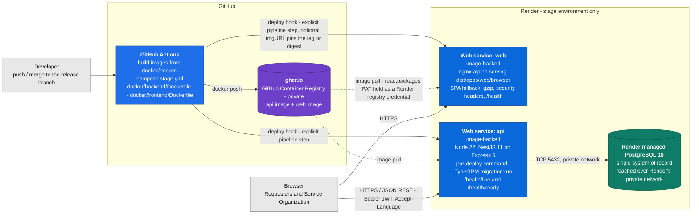

Three Render resources, created by hand in the dashboard: two **web services**, each backed by an image rather than by a platform-side source build, and one **managed PostgreSQL** instance reached over Render's private network at its internal address. The API is the only consumer of the database. The web service serves a static bundle behind nginx and holds no server-side state, no session and no secret — the browser calls the API directly, so nginx is not an API reverse proxy in this topology.

#### 2.4.3 Deployment process, end to end

| # | Step | Executed by | Note |
|---|---|---|---|
| 1 | Build both applications — `pnpm nx build api --configuration=production`, `pnpm nx build web` | GitHub Actions | Both Dockerfiles are **runtime-only**: they expect `dist/apps/api` and `dist/apps/web/browser` to already exist in the build context. The build is a pipeline step, never a stage inside the image |
| 2 | Build the two images from `docker/docker-compose.stage.yml` | GitHub Actions | That compose file's purpose is now the **image build definition**, not a description of how stage runs — Render is |
| 3 | Tag and push both images to `ghcr.io` | GitHub Actions | Private registry; the push credential is a GitHub Actions secret |
| 4 | **Call each service's Render deploy hook** | GitHub Actions | **Mandatory, explicit step** — see the warning below |
| 5 | Pull the image and run the **pre-deploy command** | Render | `migration:run` against the managed database. A failing migration fails the deploy **before** the new version serves traffic |
| 6 | Start the new version and cut traffic over | Render | Health endpoints: `/health/live` and `/health/ready` on the API, `/health` on nginx |

> **The step that cannot be skipped.** An image-backed Render service **does not redeploy automatically when a new image is pushed to its tag**. Pushing to `ghcr.io` deploys nothing. If the pipeline omits the deploy-hook call, the build goes green while Render keeps serving the previous image — a silent failure. The deploy hook is a per-service URL taken from the service's Settings page, callable by `GET` or `POST`, and it accepts an optional `imgURL` query parameter that pins the exact tag or digest to deploy; passing the tag just pushed makes a deploy name its own artifact instead of trusting a moving tag.

**Migrations are a deploy step, never a boot step.** `synchronize` is `false` in every environment, and `docker/backend/docker-entrypoint.sh` deliberately runs no migration — it only hands off to the container's `CMD`. On Render, schema evolution is the service's **pre-deploy command**, which runs before the new version starts serving. This is the rule in `CLAUDE.md` §3 ("no unconditional migration auto-run in staging/prod") given a concrete home.

#### 2.4.4 Configuration and secrets

There is **no `render.yaml` blueprint in this repository, and no infrastructure-as-code of any kind**. The Render services, their environment variables and the database connection settings are created and maintained **by hand in the Render dashboard**.

| Value | Lives in |
|---|---|
| API runtime configuration (`NODE_ENV`, `PORT`, database connection…) | Render dashboard, on the API service |
| Database credentials | Render dashboard — the managed PostgreSQL instance's own connection variables, copied onto the API service |
| `ghcr.io` **pull** credential | Render registry credential: a GitHub username plus a personal access token scoped `read:packages` |
| `ghcr.io` **push** credential and the deploy hook URLs | GitHub Actions secrets. A deploy hook URL is itself a secret — anyone holding it can trigger a deploy |
| The **names** of the variables the API requires | `.env.example`, in this repository — the only in-repo record. The API validates them at boot through `@nestjs/config` and aborts naming any missing key |

The consequence is stated plainly because it is a real property of the system: **the stage environment is not reproducible from this repository.** There is no service definition to diff, review or restore from; if the Render account is lost, the environment is rebuilt from this section. That is an accepted trade for a portfolio-scale delivery — recorded in ADR-013 as a known limitation rather than left to be discovered — and it is reversible: adopting a `render.yaml` blueprint later is additive and touches neither application.

#### 2.4.5 What the platform choice does *not* couple

Both images are plain OCI containers built from Dockerfiles that contain nothing Render-specific, and the API reads every setting from environment variables through its validated configuration schema. Moving to another container host is a pipeline change plus a dashboard exercise: no application code, no library boundary, no Nx tag and no database schema is involved. The dependency on Render is deliberately shallow.

> **Status.** This section records a **decision** and the pipeline that implements it. `.github/workflows/deploy-stage.yml` exists and runs three jobs: `verify` (format, lint, test, build, `api:build-migrations`, `verify:boundaries`) and `acceptance` (both Cypress suites, `api-e2e` against its own ephemeral PostgreSQL) on every push and pull request, and `deploy-stage` — build and push both images to `ghcr.io`, then call the Render deploy hooks — only on a push to `main`. The two deploy-hook steps are skipped until the `RENDER_DEPLOY_HOOK_API` / `RENDER_DEPLOY_HOOK_WEB` repository secrets exist; whether the Render services themselves are configured is dashboard state (ADR-013) and cannot be verified from this repository. Pipeline implementation is owned by the CI/CD role; this section and ADR-013 are the specification it implements.

### **2.5. Seguridad**

> Enumera y describe las prácticas de seguridad principales que se han implementado en el proyecto, añadiendo ejemplos si procede

### **2.6. Tests**

> Describe brevemente algunos de los tests realizados

---

## 3. Modelo de Datos

### **3.1. Diagrama del modelo de datos:**

> Recomendamos usar mermaid para el modelo de datos, y utilizar todos los parámetros que permite la sintaxis para dar el máximo detalle, por ejemplo las claves primarias y foráneas.

This section models the **relational schema persisted in PostgreSQL 18 through TypeORM 1.1** — the persistence entities, not the domain aggregates. The full document, with an attribute-level table for every entity, the constraint catalogue and the modelling decisions taken where the PRD is silent, is [`docs/product/DATA-MODEL.md`](docs/product/DATA-MODEL.md).

#### 3.1.1 What is modelled, and what a table is not

The scope is the **phase-0 and phase-1 contexts that actually persist state** (PRD §14.2/§14.3), one PostgreSQL schema per bounded context:

| Context | Schema | Phase | Persists |
| --- | --- | --- | --- |
| `identity-access` | `iam` | 0 | Users, roles, permissions, resolver groups, competition-scoped visibility grants |
| `audit` | `audit` | 0 | Append-only activity history for every record type |
| `service-catalog` | `catalog` | 1 | Services, Service Offerings, request forms, eligibility rules, categorization taxonomy |
| `incident` | `incident` | 1 | Incident tickets, notes, links, escalations, priority matrix, lifecycle configuration |
| `service-request` | `service_request` | 1 | Service Requests, form answers, fulfillment tasks |
| `sla` | `sla` | 1 | Policies, support schedules, timer instances, warnings, breaches, escalation rules |
| `knowledge` | `knowledge` | 1 | Articles, versions, translations, feedback, ticket links |
| `approval` | `approval` | 1 | Workflows, requests, tasks, immutable decisions |
| `notification` | `notification` | 1 | Templates, rules, dispatch records, stakeholder lists |
| `reporting` | `reporting` | 1 | Denormalized read models only — never a system of record |

`problem`, `change`, `release` and `asset-config` are **phase 2** and are deliberately not modelled (§3.1.13).

**A table is not an aggregate (ADR-005).** `type:domain` holds framework-free aggregates (`Incident`, `Priority`, `CompetitionImpactFlag`) and `type:infrastructure` holds TypeORM `*.entity.ts` classes joined to them by an explicit mapper. Two consequences shape every diagram below:

1. **One aggregate spans several tables.** `incident_ticket` + `incident_work_note` + `incident_attachment` + `incident_assignment_history` + `incident_state_transition` + `incident_link` persist **one** `Incident`, loaded and saved as a unit in a single transaction.
2. **Value objects are stored inline as columns, never as their own table** — they have no identity and no independent lifecycle, so a surrogate key would be a modelling lie:

| Value object | Columns | Table |
| --- | --- | --- |
| `TicketReference` | `reference` + unique index | `incident_ticket`, `sr_request` |
| `Priority` | `priority`, `priority_overridden`, `priority_override_justification`, `priority_matrix_id` | `incident_ticket` |
| `CompetitionImpactFlag` | `competition_affects`, `competition_justification`, `competition_flag_set_by`, `competition_flag_set_at` | `incident_ticket`, `sr_request` |
| `CompetitionSubject` | `competition_subject_type`, `competition_subject_external_id`, `competition_subject_label` | `incident_ticket`, `sr_request` |
| `OriginChannel` / `NoteVisibility` | single PG enum column | tickets / notes |
| `ResolverAssignment` | `assigned_group_id`, `assigned_user_id`, `assigned_at` | tickets |
| `SlaCommitment` | `started_at`, `target_at` | `sla_instance` |

#### 3.1.2 Conventions: keys, time, enums, deletes and schema evolution

| Concern | Decision |
| --- | --- |
| **Primary keys** | `uuid` on every table. **UUID v7** (time-ordered), generated by the **repository port** (`nextIdentity()`, alongside `nextReference()`), so an aggregate is fully constructed and valid in pure domain code before any I/O. `DEFAULT uuidv7()` exists only as a migration/fixture safety net, and is v7 for the same reason the port is (ADR-012, `DATA-MODEL.md` §3.1.1). Composite keys only on pure join tables. Business keys (`reference`, `code`, `email`) are **unique constraints**, never the PK. |
| **Reference numbers** | `INC0000123` / `SRQ0000045`, from a dedicated PostgreSQL `SEQUENCE` per record type read by the repository adapter. Sequences do not roll back with a failed transaction — gaps are acceptable, **reuse is not** (FR-INC-02, NFR-DAT-01). |
| **Auditing columns** | Every table: `created_at`, `updated_at`, `created_by`, `updated_by`; aggregate roots also carry `version` for optimistic locking (two agents must not silently overwrite a triage). `updated_at` is **absent** on append-only tables — the missing column _is_ the immutability statement. These columns are a convenience, not the audit trail; `audit.audit_entry` is the only authority for "who changed what". |
| **Time** | Every instant is `timestamptz` in **UTC** (NFR-I18N-03), obtained from `ClockPort` (ADR-009) — never `now()` in a trigger. `date`/`time` appear only in `sla_schedule_window` and `sla_holiday`, which are intentionally wall-clock values interpreted in the support schedule's own `time_zone`. |
| **Enums vs lookup tables** | **Native PG enum** when the value set is closed and the domain branches on it (`origin_channel`, `note_visibility`, `impact`, `urgency`, `priority`, `link_type`, `sla_instance_state`, `approval_decision`, `actor_type`). **Lookup table** (`id`, `code` UK, `active`, + `*_translation`) when an administrator may change it without a release (NFR-CFG-01) or it must be translatable without changing its stable identifier (NFR-I18N-05): categories, resolution codes, roles, workflow states, notification templates. Records store the lookup **id**, never the label, so renaming a category changes one row and zero historical facts (NFR-DAT-03). |
| **Configurable lifecycles** | `incident_ticket.state_id` points at `incident_workflow_state` (a lookup), because FR-WFL-01 requires a configurable lifecycle. A denormalized, non-configurable `state_category` enum (`open`, `pending`, `resolved`, `closed`, `cancelled`) sits beside it so queries and KPIs never depend on customer configuration. Configuration is **versioned, never edited in place**: a ticket keeps the matrix and workflow version it was created under (NFR-CFG-02). |
| **Soft delete** | **None. No `deleted_at` on any table.** It would create two truths about existence and is incompatible with an append-only audit trail (K4). "Removal" is a lifecycle state: `publication_status = 'retired'`, `status = 'disabled'`, `revoked_at IS NOT NULL`, `active = false`. Retired reference data stays joinable by history forever. |
| **Retention & erasure** | Retention (NFR-DAT-02) is archival; `audit_entry` is **range-partitioned monthly** so it is a `DETACH PARTITION`, not a mass `DELETE`. Lawful erasure (NFR-SEC-07, K9) is **pseudonymization**: PII columns of `iam_user` are overwritten and `pseudonymized_at` set. Everything else references the user by `uuid` only, so the audit trail stays structurally intact while the personal data is gone. |
| **Schema evolution** | **Migrations only.** `synchronize` is `false` in every environment; the schema changes exclusively through reviewed TypeORM migrations against `apps/api/src/data-source.ts`, auto-run only in development. No business rule ever lives in a trigger or stored procedure; `CHECK` constraints encode only structural invariants that must hold regardless of application version. |

#### 3.1.3 Hard foreign keys vs soft references — and how to read the diagrams

| Notation | Meaning |
| --- | --- |
| `A \|\|--o{ B` **solid** | A real `FOREIGN KEY`, always **within one schema / one bounded context**; `ON DELETE CASCADE` only from an aggregate root to a part it exclusively owns |
| `A \|\|..o{ B` **dashed** | A **logical/soft reference**: an indexed `uuid` column with **no** database constraint, crossing a context boundary or polymorphic |

Cross-context references are deliberately **not** foreign keys, for three reasons:

1. **It is the database expression of ADR-003.** `scope:incident` may not import `scope:sla`. A real FK from `incident_ticket` into `sla.sla_instance` would couple the two contexts in the exact place the architecture works hardest to keep them separate, and the "extractable later" property of ADR-004 would be fiction.
2. **Most of them are polymorphic and cannot be constrained at all.** `sla_instance`, `apr_request`, `ntf_dispatch`, `audit_entry` and `kb_article_link` point at _a record of some type_ via `(record_type, record_id)`. One nullable FK column per target type would add a column for every context that ever exists.
3. **The target may not be in this database.** `competition_subject_external_id` points into **SCMS**, a separate system consumed read-only behind an anti-corruption layer with free-text fallback (PRD D2, R10). A FK is impossible by definition — and that is what keeps _"a competition entity is the affected subject of a ticket, never a ticket"_ structurally true.

**The cost, stated honestly:** cross-context referential integrity is not guaranteed by PostgreSQL. Mitigations: nothing is ever hard-deleted, so the dominant cause of dangling references does not occur; every cross-context write happens in the same transaction as its aggregate write; a scheduled integrity job reports orphaned soft references; acceptance tests assert audit and SLA completeness for the MVP flows.

#### 3.1.4 Overview — context-level model

Aggregate-root tables only. Note what it makes visible: **every edge leaving a ticket context is dashed** — the module-boundary rule of §2.1 rendered in the database.

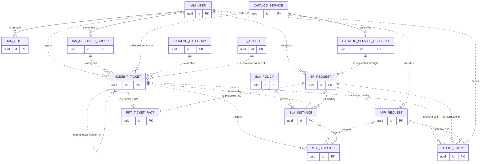

#### 3.1.5 Identity & access — schema `iam`

Phase 0. Owns authentication material, RBAC and the **competition-scoped visibility grants** that make FR-IAM-03 / FR-KNW-09 a server-side predicate rather than a UI filter. Role grants are **temporal rows** (`revoked_at`), never deleted associations, so "who could do what on 3 May" stays answerable (FR-IAM-05, FR-AUD-05).

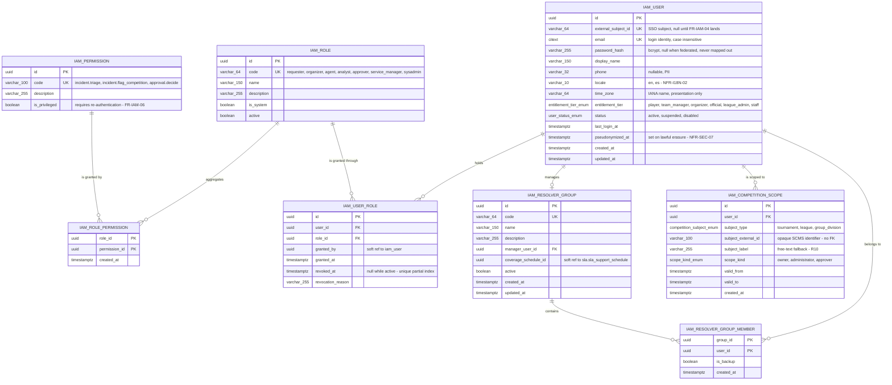

There is deliberately **no session or refresh-token table**: the MVP uses stateless JWT, and inactivity timeout (FR-IAM-06) is a token-lifetime concern. `ck_iam_user_credential` requires `password_hash IS NOT NULL OR external_subject_id IS NOT NULL` — an account must be authenticable somehow.

#### 3.1.6 Service catalog & taxonomy — schema `catalog`

Services, Offerings, dynamic request forms, eligibility rules, and the **categorization taxonomy** shared by both ticket types. The PRD requires the taxonomy (FR-INC-03, FR-CAT-01) but assigns no owner; it is placed here because this is the service-reference-data context and duplicating it per ticket context would break NFR-DAT-03.

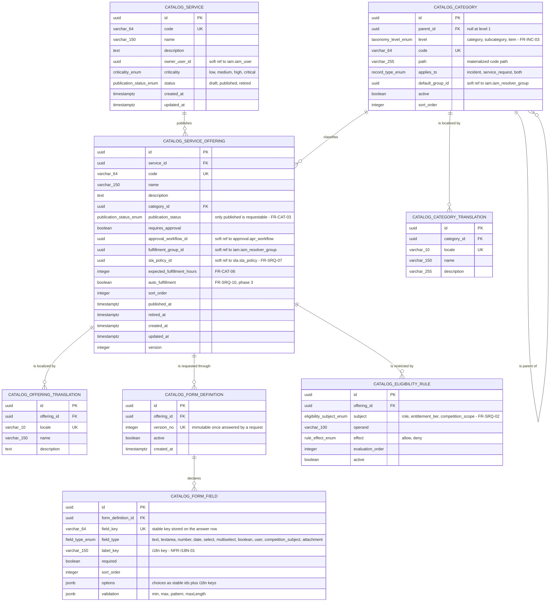

`catalog_form_definition.version_no` is immutable once a request has answered it, and the request stores `form_definition_id`. That is how NFR-CFG-02 holds: editing a form creates a **new** version, and in-flight requests keep validating against the one they were created under.

#### 3.1.7 Incident — schema `incident`

The core context (C1 + C13). `incident_ticket` is the persistence side of the `Incident` aggregate root; notes, attachments, assignment history, transitions, links, escalations and communications are parts of the same aggregate and carry hard FKs with `ON DELETE CASCADE` — the only cascade in the model, legitimate because those rows have no meaning without their ticket.

```mermaid
erDiagram
    INCIDENT_TICKET {
        uuid id PK
        varchar_20 reference UK "INC0000123 - immutable, never reused, FR-INC-02"
        varchar_255 short_description
        text description
        origin_channel_enum origin_channel "portal, agent_logged, email, in_app, phone - FR-OMN-02"
        uuid reporter_user_id "soft ref to iam.iam_user - never anonymous"
        uuid logged_by_user_id "soft ref - agent logging on behalf"
        uuid service_id "soft ref to catalog.catalog_service"
        uuid category_id "soft ref to catalog.catalog_category - required to leave New"
        uuid workflow_id FK
        uuid state_id FK "configurable lifecycle - FR-WFL-01"
        state_category_enum state_category "open, pending, resolved, closed, cancelled"
        pending_reason_enum pending_reason "customer, third_party, change - FR-INC-06"
        uuid priority_matrix_id FK "configuration version in force - NFR-CFG-02"
        impact_enum base_impact "agent assessment before competition uplift"
        impact_enum assessed_impact "after uplift - FR-INC-05"
        urgency_enum urgency
        priority_enum priority "P1 to P4 - derived, never requester chosen, FR-INC-04"
        boolean priority_overridden
        varchar_500 priority_override_justification "mandatory when overridden"
        boolean competition_affects "agent only, never automatic - FR-INC-05"
        varchar_500 competition_justification "mandatory when flag is true"
        uuid competition_flag_set_by "soft ref to iam.iam_user"
        timestamptz competition_flag_set_at
        competition_subject_enum competition_subject_type "tournament, league, fixture, standings, registration, roster, team, player_account, schedule, result"
        varchar_100 competition_subject_external_id "opaque SCMS id - no FK by design"
        varchar_255 competition_subject_label "free-text fallback - R10"
        uuid assigned_group_id "soft ref to iam.iam_resolver_group"
        uuid assigned_user_id "soft ref to iam.iam_user"
        timestamptz assigned_at
        boolean is_major "FR-MIM-01"
        uuid major_declared_by
        timestamptz major_declared_at
        varchar_500 major_justification
        uuid parent_incident_id FK "child of a Major Incident - FR-MIM-03"
        uuid resolution_code_id FK
        text resolution_notes "mandatory to resolve - FR-INC-07"
        uuid resolution_article_id "soft ref to knowledge.kb_article - FR-KNW-05"
        timestamptz first_response_at "MTTA input"
        timestamptz resolved_at
        timestamptz closed_at
        timestamptz confirmation_due_at "auto-close deadline - FR-INC-09"
        boolean first_contact_resolution "FR-INC-18"
        smallint reopen_count
        smallint csat_score "1 to 5, nullable"
        varchar_500 csat_comment
        timestamptz created_at
        timestamptz updated_at
        uuid created_by
        uuid updated_by
        integer version "optimistic lock"
    }
    INCIDENT_WORK_NOTE {
        uuid id PK
        uuid incident_id FK
        note_visibility_enum visibility "public, internal - NFR-SEC-04"
        text body
        uuid author_user_id "soft ref to iam.iam_user"
        author_kind_enum author_kind "user, system_rule"
        timestamptz created_at
    }
    INCIDENT_ATTACHMENT {
        uuid id PK
        uuid incident_id FK
        varchar_255 file_name
        varchar_100 content_type
        integer size_bytes
        varchar_500 storage_key "object storage key, not the blob"
        note_visibility_enum visibility
        uuid uploaded_by
        timestamptz created_at
    }
    INCIDENT_ASSIGNMENT_HISTORY {
        uuid id PK
        uuid incident_id FK
        uuid from_group_id
        uuid from_user_id
        uuid to_group_id
        uuid to_user_id
        varchar_255 reason
        uuid assigned_by
        timestamptz assigned_at "FR-INC-12"
    }
    INCIDENT_STATE_TRANSITION {
        uuid id PK
        uuid incident_id FK
        uuid from_state_id
        uuid to_state_id
        state_category_enum to_state_category
        varchar_255 reason
        actor_type_enum actor_type "user, system_rule"
        uuid actor_user_id
        varchar_100 actor_rule_code
        timestamptz occurred_at "append only - no updated_at"
    }
    INCIDENT_LINK {
        uuid id PK
        uuid incident_id FK
        record_type_enum target_record_type "incident, service_request, problem, change, release, configuration_item"
        uuid target_record_id "opaque - phase 2 contexts already accepted"
        link_type_enum link_type "duplicate_of, related_to, caused_by, child_of, resolved_by"
        uuid created_by
        timestamptz created_at
    }
    INCIDENT_ESCALATION {
        uuid id PK
        uuid incident_id FK
        escalation_type_enum escalation_type "functional, hierarchical - FR-INC-13"
        escalation_trigger_enum trigger "manual, sla_warning, sla_breach"
        uuid from_group_id
        uuid to_group_id
        uuid to_user_id
        varchar_255 reason
        uuid triggered_by
        timestamptz triggered_at
    }
    INCIDENT_MAJOR_COMMUNICATION {
        uuid id PK
        uuid incident_id FK
        varchar_64 audience_code "stakeholder list code - FR-NOT-04"
        varchar_255 subject
        text body
        uuid sent_by
        timestamptz sent_at
    }
    INCIDENT_RESOLUTION_CODE {
        uuid id PK
        varchar_64 code UK
        boolean requires_article
        boolean active
        integer sort_order
    }
    INCIDENT_RESOLUTION_CODE_TRANSLATION {
        uuid id PK
        uuid resolution_code_id FK
        varchar_10 locale UK
        varchar_150 name
    }
    INCIDENT_WORKFLOW {
        uuid id PK
        integer version_no UK
        boolean active
        timestamptz effective_from
    }
    INCIDENT_WORKFLOW_STATE {
        uuid id PK
        uuid workflow_id FK
        varchar_64 code UK
        state_category_enum category
        sla_clock_enum sla_clock "running, paused - FR-INC-08"
        boolean is_initial
        boolean is_final
        integer sort_order
    }
    INCIDENT_WORKFLOW_TRANSITION {
        uuid id PK
        uuid workflow_id FK
        uuid from_state_id FK
        uuid to_state_id FK
        varchar_64 required_permission_code
        jsonb guard "declarative preconditions"
    }
    INCIDENT_PRIORITY_MATRIX {
        uuid id PK
        integer version_no UK
        smallint competition_impact_step "how much the flag raises Impact - FR-INC-05"
        boolean active
        timestamptz effective_from
    }
    INCIDENT_PRIORITY_MATRIX_CELL {
        uuid id PK
        uuid matrix_id FK
        impact_enum impact UK
        urgency_enum urgency UK
        priority_enum priority
    }
    INCIDENT_ROUTING_RULE {
        uuid id PK
        varchar_150 name
        uuid category_id "soft ref to catalog.catalog_category"
        competition_subject_enum competition_subject_type
        origin_channel_enum origin_channel
        uuid target_group_id "soft ref to iam.iam_resolver_group - FR-WFL-03"
        integer evaluation_order
        boolean active
    }
    INCIDENT_BUSINESS_RULE {
        uuid id PK
        varchar_150 name
        rule_event_enum event "on_create, on_update, on_state_change, scheduled"
        jsonb condition
        jsonb actions "set_field, assign, notify, escalate, create_task - FR-WFL-02"
        integer evaluation_order
        boolean active
        integer version_no
    }

    INCIDENT_TICKET ||--o{ INCIDENT_WORK_NOTE : "records"
    INCIDENT_TICKET ||--o{ INCIDENT_ATTACHMENT : "carries"
    INCIDENT_TICKET ||--o{ INCIDENT_ASSIGNMENT_HISTORY : "was routed through"
    INCIDENT_TICKET ||--o{ INCIDENT_STATE_TRANSITION : "moved through"
    INCIDENT_TICKET ||--o{ INCIDENT_LINK : "is linked by"
    INCIDENT_TICKET ||--o{ INCIDENT_ESCALATION : "was escalated by"
    INCIDENT_TICKET ||--o{ INCIDENT_MAJOR_COMMUNICATION : "communicates through"
    INCIDENT_TICKET ||--o| INCIDENT_TICKET : "is parent major incident of"
    INCIDENT_RESOLUTION_CODE ||--o{ INCIDENT_TICKET : "closes"
    INCIDENT_RESOLUTION_CODE ||--o{ INCIDENT_RESOLUTION_CODE_TRANSLATION : "is localized by"
    INCIDENT_WORKFLOW ||--o{ INCIDENT_WORKFLOW_STATE : "declares"
    INCIDENT_WORKFLOW ||--o{ INCIDENT_WORKFLOW_TRANSITION : "allows"
    INCIDENT_WORKFLOW_STATE ||--o{ INCIDENT_TICKET : "is current state of"
    INCIDENT_WORKFLOW ||--o{ INCIDENT_TICKET : "governs"
    INCIDENT_PRIORITY_MATRIX ||--o{ INCIDENT_PRIORITY_MATRIX_CELL : "is composed of"
    INCIDENT_PRIORITY_MATRIX ||--o{ INCIDENT_TICKET : "derived priority of"
```

**Structural invariants** (`CHECK` constraints — safety nets; the _rules_ live in the domain layer):

| Constraint                      | Rule                                                                      | Requirement |
| ------------------------------- | ------------------------------------------------------------------------- | ----------- |
| `ck_incident_resolution`        | resolved/closed ⇒ `resolution_code_id` **and** `resolution_notes` present | FR-INC-07   |
| `ck_incident_competition_flag`  | flag true ⇒ justification, setter and timestamp present                   | FR-INC-05   |
| `ck_incident_priority_override` | overridden ⇒ justification present                                        | FR-INC-04   |
| `ck_incident_subject`           | a subject type ⇒ an external id **or** a free-text label                  | R10         |
| `ck_incident_major`             | major ⇒ declarer, time and justification present                          | FR-MIM-01   |

Two columns deserve emphasis. **`base_impact` and `assessed_impact` are separate** because FR-INC-05 says the flag _raises_ Impact by a configurable amount: storing only the result would make the agent's original assessment unrecoverable and the calibration KPI (R8) unmeasurable. And **the competition subject has no foreign key** — three columns and nothing else — which is the whole of §3.1.3 point 3 made concrete.

#### 3.1.8 Service Request — schema `service_request`

Structurally a sibling of `incident`: the same reference / state / competition-subject shape, a different lifecycle (FR-SRQ-05), plus form answers and fulfillment tasks. It carries **its own** workflow tables, because each context owns its lifecycle — a central workflow engine was explicitly rejected as a god-context risk (ARCHITECTURE §4.1).

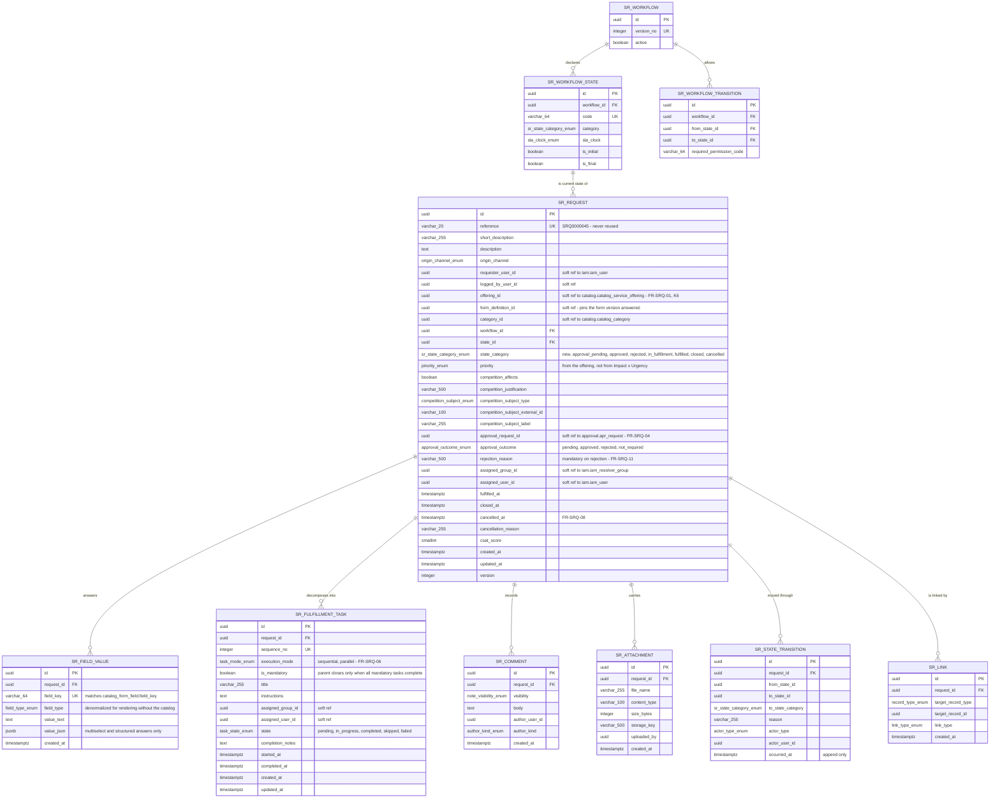

`ck_sr_fulfillment_gate` — `state_category NOT IN ('in_fulfillment','fulfilled') OR approval_outcome IN ('approved','not_required')` — is the structural net under FR-SRQ-04. Form answers are **rows, not a `jsonb` document**, because FR-RPT-05 requires filtering and support needs to answer "every organizer-access request for competition X".

#### 3.1.9 SLA — schema `sla`

The most timing-sensitive schema in the system: NFR-AVL-05 (timers survive restarts), NFR-PRF-04 (warning within one minute) and FR-SLA-04 (recalculation from the **original** creation time, previous targets preserved) all land here.

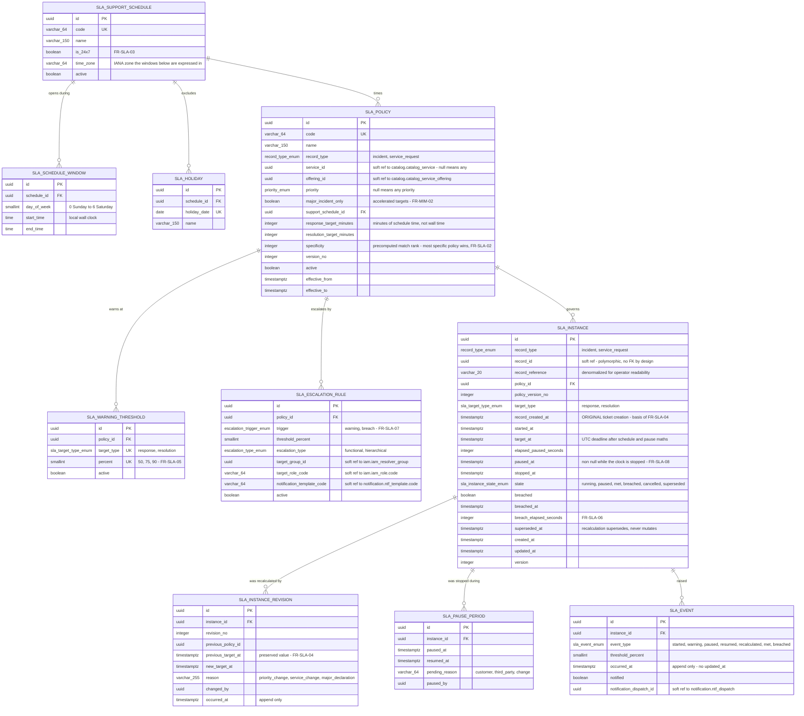

Three decisions carry the requirements:

- **`record_created_at` is copied onto the instance.** FR-SLA-04 recalculates from the original ticket creation instant, not from the moment the priority changed — this column is what makes that survivable across a restart.
- **Remaining time is always derived from stored UTC timestamps** (`started_at`, `target_at`, `paused_at`, `elapsed_paused_seconds`), never from an in-memory counter or from scheduled-job liveness (NFR-AVL-05, ADR-009).
- **Breach fields are written once and there is no update path** on the repository port: FR-SLA-06 ("no retroactive silent modification") becomes structural rather than procedural. A recalculation **supersedes** an instance and records the previous target in `sla_instance_revision`.

`uq_sla_instance_active` — unique `(record_type, record_id, target_type)` partial `WHERE superseded_at IS NULL` — enforces "exactly one applicable commitment" (FR-SLA-02).

#### 3.1.10 Knowledge — schema `knowledge`

Article identity is stable; content is versioned and translated. Full-text search is native PostgreSQL — **no external search engine** in the MVP (constraint K8).

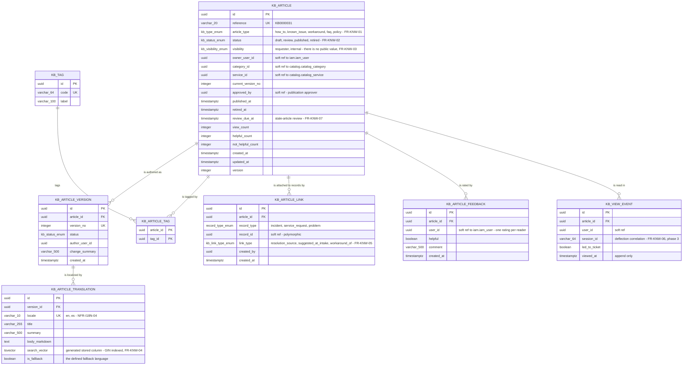

`search_vector` is a **generated stored column** over title + summary + body, with a **GIN** index, plus a `pg_trgm` index on `title` for typo-tolerant intake suggestions (FR-INC-16). Search runs against the current version of `published` articles and is filtered by the reader's visibility entitlement **server-side, as a `WHERE` clause** — never by omission in a template (NFR-SEC-02). Language configuration is selected per row from `locale`, which is why translations are rows and not columns. `visibility` has **no `public` value**: nothing is reachable without authentication (FR-IAM-01).

#### 3.1.11 Approval & Notification — schemas `approval` and `notification`

One generic approval engine serves Service Requests now and Changes/Releases in phase 2. Every notification is recorded against its source record and dispatched **after commit** off the domain-event bus (ADR-008), so a failing gateway can never roll back a ticket (NFR-AVL-03).

```mermaid
erDiagram
    APR_WORKFLOW {
        uuid id PK
        varchar_64 code UK
        varchar_150 name
        record_type_enum record_type "service_request, change, release"
        integer version_no
        boolean active
    }
    APR_STAGE {
        uuid id PK
        uuid workflow_id FK
        integer sequence_no UK
        varchar_150 name
        stage_mode_enum mode "sequential, parallel - FR-APR-01"
        quorum_type_enum quorum_type "all, any, majority - FR-APR-06, phase 4"
        smallint quorum_value
        integer due_in_hours "reminder and escalation basis - FR-APR-05"
    }
    APR_APPROVER_RULE {
        uuid id PK
        uuid stage_id FK
        approver_resolver_enum resolver_type "role, group, named_user, competition_owner - FR-APR-02"
        varchar_100 operand
        integer evaluation_order
    }
    APR_REQUEST {
        uuid id PK
        uuid workflow_id FK
        integer workflow_version_no
        record_type_enum record_type
        uuid record_id "soft ref - polymorphic, no FK by design"
        varchar_20 record_reference
        uuid requested_by "soft ref to iam.iam_user"
        timestamptz requested_at
        apr_state_enum state "pending, approved, rejected, cancelled, expired"
        integer current_stage_seq
        timestamptz decided_at
        timestamptz created_at
        timestamptz updated_at
        integer version
    }
    APR_TASK {
        uuid id PK
        uuid request_id FK
        uuid stage_id FK
        uuid approver_user_id "soft ref - resolved at task creation"
        uuid delegate_user_id "soft ref - FR-APR-04, phase 2"
        apr_task_state_enum state "pending, approved, rejected, delegated, expired"
        timestamptz due_at
        timestamptz reminded_at
        timestamptz created_at
        timestamptz updated_at
    }
    APR_DECISION {
        uuid id PK
        uuid task_id FK UK "one decision per task, forever - FR-APR-07"
        uuid request_id FK
        approval_decision_enum decision "approved, rejected"
        varchar_1000 comment "mandatory on rejection - FR-APR-03"
        uuid decided_by "soft ref - the actual decider"
        uuid on_behalf_of "soft ref - original approver when delegated"
        timestamptz decided_at "append only - no updated_at, no update or delete grant"
    }
    NTF_TEMPLATE {
        uuid id PK
        varchar_64 code UK "incident.acknowledged, sla.warning, approval.requested"
        varchar_64 event_type
        ntf_channel_enum channel "in_app, email, push"
        integer version_no
        boolean active
    }
    NTF_TEMPLATE_TRANSLATION {
        uuid id PK
        uuid template_id FK
        varchar_10 locale UK "NFR-I18N-04"
        varchar_255 subject
        text body "token placeholders, no hardcoded strings"
        boolean is_fallback
    }
    NTF_RULE {
        uuid id PK
        varchar_150 name
        varchar_64 event_type
        record_type_enum record_type
        ntf_audience_enum audience "requester, assignee, assigned_group, approver, stakeholder_list, role"
        varchar_64 audience_operand
        uuid template_id FK
        ntf_channel_enum channel
        boolean is_mandatory "cannot be disabled by a user preference - FR-NOT-07"
        boolean active
        integer evaluation_order
    }
    NTF_STAKEHOLDER_LIST {
        uuid id PK
        varchar_64 code UK "major_incident_stakeholders - FR-NOT-04"
        varchar_150 name
        boolean active
    }
    NTF_STAKEHOLDER_MEMBER {
        uuid id PK
        uuid list_id FK
        uuid user_id "soft ref to iam.iam_user"
        varchar_255 external_address
        timestamptz created_at
    }
    NTF_DISPATCH {
        uuid id PK
        uuid template_id FK
        integer template_version_no
        ntf_channel_enum channel
        uuid recipient_user_id "soft ref to iam.iam_user"
        varchar_255 recipient_address "resolved at send time"
        varchar_10 locale
        record_type_enum record_type
        uuid record_id "soft ref - polymorphic, FR-NOT-08"
        varchar_20 record_reference
        varchar_255 rendered_subject
        text rendered_body "what was actually sent, kept as evidence"
        dispatch_state_enum state "queued, sent, failed, read, cancelled"
        smallint attempt_count
        varchar_500 failure_reason
        uuid correlation_event_id "the domain event that caused it"
        timestamptz queued_at
        timestamptz sent_at
        timestamptz read_at
        timestamptz created_at
        timestamptz updated_at
    }

    APR_WORKFLOW ||--o{ APR_STAGE : "is composed of"
    APR_STAGE ||--o{ APR_APPROVER_RULE : "resolves approvers by"
    APR_WORKFLOW ||--o{ APR_REQUEST : "governs"
    APR_REQUEST ||--o{ APR_TASK : "assigns"
    APR_STAGE ||--o{ APR_TASK : "produces"
    APR_TASK ||--|| APR_DECISION : "is closed by"
    APR_REQUEST ||--o{ APR_DECISION : "aggregates"
    NTF_TEMPLATE ||--o{ NTF_TEMPLATE_TRANSLATION : "is localized by"
    NTF_TEMPLATE ||--o{ NTF_RULE : "is selected by"
    NTF_TEMPLATE ||--o{ NTF_DISPATCH : "renders"
    NTF_STAKEHOLDER_LIST ||--o{ NTF_STAKEHOLDER_MEMBER : "contains"
    APR_REQUEST ||..o{ NTF_DISPATCH : "notifies through"
```

**Approval immutability is enforced on three levels, not one** (FR-APR-07): `apr_decision` has no `updated_at`; the repository port exposes no update or delete method for decisions; and the application database role holds `INSERT, SELECT` only on the table. `ntf_dispatch` stores the **rendered** subject and body because "the requester was told X at time T" is evidence — re-rendering from a later template version would falsify it.

#### 3.1.12 Audit & reporting — schemas `audit` and `reporting`

One append-only journal, and a set of projections that are never a system of record.

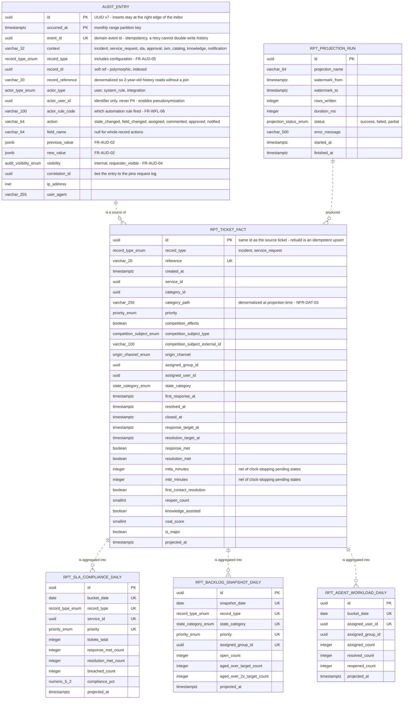

**What is absent from `audit_entry` is the point.** No `updated_at`, no `deleted_at`, no update or delete method on `AuditRepositoryPort`, and no `UPDATE`/`DELETE` grant for the application role:

```sql
GRANT INSERT, SELECT ON audit.audit_entry TO sport_itsm_app;
REVOKE UPDATE, DELETE, TRUNCATE ON audit.audit_entry FROM sport_itsm_app;
```

FR-AUD-03 says no role — including System Administrator — may edit or delete history. That is not a policy anyone can forget to apply: the capability does not exist at the port and the privilege does not exist at the database. Corrections are made by inserting a new entry (NFR-AUD-02). Administrative configuration changes (FR-AUD-05) live in the **same** table with `record_type = 'configuration'`: one journal, one query path, one guarantee. Retention is `DETACH PARTITION`, not a mass `DELETE` (NFR-DAT-02).

`reporting` owns projections only; dashboards read `reporting` and never query `incident` or `sla` directly, so a heavy report cannot degrade ticket intake. `rpt_projection_run` records the watermark, row count and outcome of every pass, which is the operational meaning of "the same filters over the same period return the same values" (FR-RPT-07).

#### 3.1.13 Indexes that carry the NFRs, and phase 2

Indexes are chosen for stated non-functional requirements, not speculatively:

| Index | Table | Definition | Serves |
| --- | --- | --- | --- |
| `ix_incident_worklist` | `incident_ticket` | `(priority, created_at)` partial `WHERE state_category IN ('open','pending')` | **NFR-PRF-02** — agent work list under 2 s at match-day volume (FR-QUE-02) |
| `ix_incident_group_queue` / `ix_incident_mine` | `incident_ticket` | `(assigned_group_id \| assigned_user_id, state_category, priority)` partial on open states | FR-QUE-02/03 |
| `ix_incident_reporter` | `incident_ticket` | `(reporter_user_id, created_at DESC)` | FR-IAM-03 — a requester sees only their own tickets |
| `ix_incident_subject` | `incident_ticket` | `(competition_subject_type, competition_subject_external_id)` | **NFR-AUD-04** — every Incident affecting a competition in a period |
| `ix_incident_competition_flag` | `incident_ticket` | `(created_at DESC)` partial `WHERE competition_affects` | Domain KPIs on the flagged subset (PRD §9.2) |
| `ix_incident_confirmation` | `incident_ticket` | `(confirmation_due_at)` partial `WHERE state_category = 'resolved'` | FR-INC-09 auto-close sweep |
| `ix_sla_sweep` | `sla_instance` | `(target_at)` partial `WHERE state = 'running'` | **NFR-PRF-04** — warning/breach within one minute, independent of total volume |
| `ix_kb_search` | `kb_article_translation` | **GIN** on `search_vector` | **FR-KNW-04** full-text search |
| `ix_apr_task_pending` | `apr_task` | `(approver_user_id, due_at)` partial `WHERE state = 'pending'` | FR-APR-05 approver inbox |
| `ix_ntf_outbox` | `ntf_dispatch` | `(queued_at)` partial `WHERE state = 'queued'` | ADR-008 post-commit dispatch loop |
| `ix_audit_record` | `audit_entry` | `(record_type, record_id, occurred_at DESC)` | FR-AUD-04 activity history — the most frequent read |
| `ix_iam_user_role_active` | `iam_user_role` | `(user_id)` partial `WHERE revoked_at IS NULL` | Read on **every** authorization check (NFR-SEC-02) |

**Phase 2 is deliberately not modelled.** `problem`, `change`, `release` and `asset-config` (PRD §14.4) have their behavior specified but their schema left to the phase-2 design, so it is shaped by real phase-1 experience rather than speculation. What phase 1 already guarantees for them: `incident_link` and `sr_link` already accept `problem`, `change`, `release` and `configuration_item` as target record types, holding opaque `uuid`s with no FK (FR-INC-10), and `apr_workflow.record_type` already accepts `change` and `release`. Adding those contexts is therefore **additive** — new schemas and new tables, with **no phase-1 table restructured**.

> **Status:** as in §2.1, §2.2 and §2.3, this is the **target data model**. `apps/api/src/data-source.ts` exists (`T-C10-16`) and the migration chain holds a single bootstrap migration (`T-C10-17`) that creates only the `iam` schema and the `citext` and `pg_trgm` extensions; **no table and no TypeORM entity exists**. PostgreSQL runs only as the local development container and the ephemeral acceptance database. None of the tables, constraints, partial indexes, partitions or `GRANT`/`REVOKE` statements above has been executed or measured; NFR-PRF-02 and NFR-PRF-04 must be proven with `EXPLAIN (ANALYZE, BUFFERS)` against a seeded volume before either is claimed.

### **3.2. Descripción de entidades principales:**

A **main entity** here is a table that either (a) is the **aggregate root** of a bounded context — the row a transaction is written around, the row that carries `version` for optimistic locking — or (b) is **reference data that every ITSM flow touches**: the taxonomy, the priority matrix, the support schedule, the workflow version. Everything else in the model is a _part_ of one of those aggregates (notes, attachments, transitions, form answers, tasks) or a projection of them.

**A table is not an aggregate (ADR-005).** `type:domain` holds framework-free aggregates (`Incident`, `ServiceRequest`, `SlaInstance`), `type:infrastructure` holds TypeORM `*.entity.ts` classes, and an explicit mapper joins them. One aggregate therefore spans several tables — `incident_ticket` + its six part tables persist **one** `Incident`, loaded and saved as a unit in a single transaction — and value objects are inlined as columns, never given a table of their own (§3.1.1).

This section is the **curated view of the roots**. The exhaustive, column-by-column dictionary of **all ~85 tables** — every attribute with type, nullability, key role, default and description, plus the full constraint catalogue and enum value sets — is **§20 "Entity dictionary — attribute-level reference"** of [`docs/product/DATA-MODEL.md`](docs/product/DATA-MODEL.md). The attribute tables below list the _significant_ columns only; audit columns (`created_at`, `updated_at`, `created_by`, `updated_by`) are omitted here and specified once in §3.2.10.

#### 3.2.1 The main entities at a glance

| Entity (table) | Context / schema | Kind | Identity | Purpose |
| --- | --- | --- | --- | --- |
| `iam_user` | `identity-access` / `iam` | Aggregate root | `id` UUID v7; `email` UK, `external_subject_id` UK (partial) | Authentication material, entitlement tier and the PII columns that lawful erasure rewrites (FR-IAM-01/02, NFR-SEC-07) |
| `iam_role` | `identity-access` / `iam` | Aggregate root + configurable lookup | `id`; `code` UK | Named bundle of permissions; RBAC with least privilege, configurable without a release (FR-IAM-02, NFR-CFG-01) |
| `iam_resolver_group` | `identity-access` / `iam` | Aggregate root | `id`; `code` UK | Assignment target for Incidents, Requests and fulfillment tasks, with an optional coverage schedule (FR-INC-12, FR-QUE-02/03) |
| `catalog_service` | `service-catalog` / `catalog` | Aggregate root | `id`; `code` UK | Business-facing Service whose defects become Incidents; input to SLA policy resolution (FR-CAT-01, FR-SLA-02) |
| `catalog_service_offering` | `service-catalog` / `catalog` | Aggregate root | `id`; `code` UK | The **requestable** unit: form versions, eligibility, approval requirement, fulfillment target (FR-CAT-01/02/03/06) |
| `catalog_category` | `service-catalog` / `catalog` | Configurable lookup (self-referencing taxonomy) | `id`; `code` UK; `path` materialized | Category → Subcategory → Item taxonomy shared by both ticket types (FR-INC-03, FR-CAT-05, M3) |
| `incident_ticket` | `incident` / `incident` | Aggregate root | `id`; `reference` UK (`INC0000123`) | The Incident: intake, triage, competition flag, assignment, resolution, closure (FR-INC-01 → FR-INC-13, FR-INC-18) |
| `incident_priority_matrix` | `incident` / `incident` | Configuration-as-data (versioned) | `id`; `version_no` UK | Impact × Urgency matrix version and the competition uplift step; pinned on every ticket (FR-INC-04/05, NFR-CFG-02) |
| `incident_workflow` | `incident` / `incident` | Configuration-as-data (versioned) | `id`; `version_no` UK | Configurable Incident lifecycle version; in-flight tickets keep the version they were created under (FR-WFL-01, NFR-CFG-02) |
| `sr_request` | `service-request` / `service_request` | Aggregate root | `id`; `reference` UK (`SRQ0000045`) | The Service Request raised against a published Offering, with the approval gate and pinned form version (FR-SRQ-01 → FR-SRQ-11) |
| `sla_policy` | `sla` / `sla` | Aggregate root + configuration-as-data (versioned) | `id`; `(code, version_no)` UK; `(record_type, service_id, offering_id, priority, major_incident_only, version_no)` UK | Versioned response/resolution commitments, with `specificity` making policy selection deterministic (FR-SLA-01/02, M7) |
| `sla_instance` | `sla` / `sla` | Aggregate root | `id`; `(record_type, record_id, target_type)` UK partial `WHERE superseded_at IS NULL` | One live or historical timing commitment for one target of one ticket; the canonical polymorphic soft reference (FR-SLA-02/04/06/08) |
| `sla_support_schedule` | `sla` / `sla` | Configuration-as-data lookup | `id`; `code` UK | Business-hours or 24×7 calendar, and the IANA zone its wall-clock windows are read in (FR-SLA-03, NFR-I18N-03) |
| `kb_article` | `knowledge` / `knowledge` | Aggregate root | `id`; `reference` UK (`KB0000031`) | Stable citable Knowledge Article identity; content lives in versions and translations (FR-KNW-01/02) |
| `apr_request` | `approval` / `approval` | Aggregate root | `id`; `(record_type, record_id)` UK partial `WHERE state = 'pending'` | One authorization in flight over a record of another context (FR-APR-01, FR-SRQ-04) |
| `ntf_dispatch` | `notification` / `notification` | Append-only journal (outbox + evidence) | `id` | What was actually sent, to whom, in which locale, rendered — evidence, not a re-renderable pointer (FR-NOT-08, ADR-008) |
| `audit_entry` | `audit` / `audit` | Append-only journal (monthly RANGE partitions) | `(id, occurred_at)` composite PK; `(event_id, occurred_at)` UK | The single authority for "who changed what, when" across every record type, including configuration (FR-AUD-01 → FR-AUD-06) |
| `rpt_ticket_fact` | `reporting` / `reporting` | Read-model projection (rebuildable) | `id` = source ticket id; `reference` UK | Denormalized ticket fact behind dashboards and KPIs; never a system of record (FR-RPT-01/05/07) |

#### 3.2.2 `incident_ticket` — schema `incident`

Aggregate root of the `Incident` aggregate: one row per Incident, carrying the inlined `TicketReference`, `Priority`, `CompetitionImpactFlag`, `CompetitionSubject`, `OriginChannel` and `ResolverAssignment` value objects as flat columns. It persists **FR-INC-01 → FR-INC-13** and **FR-INC-18**, plus FR-MIM-01/02/03 for Major Incidents, and is the only table in the context carrying `version`.

Significant attributes (the full 50-column list is in **§20.3** of [`docs/product/DATA-MODEL.md`](docs/product/DATA-MODEL.md)):

| Attribute | Type | Constraints | Description |
| --- | --- | --- | --- |
| `id` | `uuid` | PK, NOT NULL | UUID v7 issued by `IncidentRepositoryPort.nextIdentity()` |
| `reference` | `varchar(20)` | UK `uq_incident_reference`, NOT NULL | `INC` + `incident_reference_seq`; immutable, never reused (FR-INC-02, NFR-DAT-01) |
| `short_description` | `varchar(255)` | NOT NULL | Work-list title of the reported Incident |
| `description` | `text` | NOT NULL | Full report, including requester free text about competition context |
| `origin_channel` | `origin_channel_enum` | NOT NULL | Intake channel; `portal` and `agent_logged` in the MVP (FR-OMN-01/02) |
| `reporter_user_id` | `uuid` | NOT NULL, soft → `iam.iam_user.id` | Requester the Incident exists for; anonymous intake is impossible (FR-OMN-04) |
| `service_id` | `uuid` | NULL, soft → `catalog.catalog_service.id` | Affected Service; drives SLA policy resolution (FR-SLA-02) |
| `category_id` | `uuid` | NULL, soft → `catalog.catalog_category.id` | Leaf `item` of the taxonomy; required before the ticket leaves `New` (FR-INC-03) |
| `workflow_id` | `uuid` | NOT NULL, FK → `incident_workflow` (RESTRICT) | Lifecycle configuration version in force for this ticket (FR-WFL-01) |
| `state_id` | `uuid` | NOT NULL, FK → `incident_workflow_state` (RESTRICT) | Current configurable lifecycle state (FR-INC-06) |
| `state_category` | `state_category_enum` | NOT NULL | Denormalized, non-configurable classification so KPIs never depend on configuration |
| `pending_reason` | `pending_reason_enum` | NULL | `customer` / `third_party` / `change`; drives clock-pause semantics (FR-INC-08) |
| `priority_matrix_id` | `uuid` | NOT NULL, FK → `incident_priority_matrix` (RESTRICT) | The matrix **version** that produced `priority` (NFR-CFG-02) |
| `base_impact` / `assessed_impact` | `impact_enum` | NOT NULL | Impact before / after the competition uplift (FR-INC-05, M4) |
| `urgency` | `urgency_enum` | NOT NULL | Agent-assessed Urgency (FR-INC-04) |
| `priority` | `priority_enum` | NOT NULL | Derived from `(assessed_impact, urgency)`; never chosen by a requester (R8) |
| `priority_overridden` / `priority_override_justification` | `boolean` / `varchar(500)` | NOT NULL `false` / NULL, CHECK | Authorized override plus its mandatory justification (FR-INC-04) |
| `competition_affects` | `boolean` | NOT NULL `false`, CHECK | Agent-only "affects a competition in progress" flag; never automatic (FR-INC-05, ADR-006) |
| `competition_justification`, `competition_flag_set_by`, `competition_flag_set_at` | `varchar(500)`, `uuid`, `timestamptz` | NULL, CHECK | Who raised the flag, when and why — mandatory whenever it is true |
| `competition_subject_type` / `_external_id` / `_label` | `competition_subject_enum`, `varchar(100)`, `varchar(255)` | NULL, CHECK | The **affected** competition entity in SCMS; opaque id with free-text fallback (R10) |
| `assigned_group_id` / `assigned_user_id` / `assigned_at` | `uuid`, `uuid`, `timestamptz` | NULL, soft → `iam` | Current `ResolverAssignment`; the history lives in `incident_assignment_history` |
| `is_major`, `major_declared_by/at`, `major_justification` | `boolean`, `uuid`, `timestamptz`, `varchar(500)` | CHECK | Major Incident declaration and its mandatory justification (FR-MIM-01) |
| `parent_incident_id` | `uuid` | NULL, FK → `incident_ticket` (self, RESTRICT) | Parent Major Incident of a child Incident (FR-MIM-03) |
| `resolution_code_id` / `resolution_notes` | `uuid` / `text` | NULL, FK (RESTRICT), CHECK | Mandatory to reach `Resolved` (FR-INC-07) |
| `resolution_article_id` | `uuid` | NULL, soft → `knowledge.kb_article.id` | Article used to resolve; feeds the knowledge-assisted KPI (FR-KNW-05) |
| `first_response_at`, `resolved_at`, `closed_at`, `confirmation_due_at` | `timestamptz` | NULL | MTTA / MTTR inputs and the auto-close deadline (FR-INC-09, PRD §9.1) |
| `first_contact_resolution` / `reopen_count` / `csat_score` | `boolean` / `smallint` / `smallint` | NOT NULL / NOT NULL `0` / NULL, CHECK 1–5 | FCR, Reopen Rate and basic CSAT capture (FR-INC-18, PRD §9.1) |
| `version` | `integer` | NOT NULL `1` | `@VersionColumn` optimistic lock — concurrent triage must not silently overwrite |

**CHECK constraints, verbatim.** These are the invariants that hold regardless of application version:

| Name | Rule |
| --- | --- |
| `ck_incident_resolution` | `state_category NOT IN ('resolved','closed') OR (resolution_code_id IS NOT NULL AND resolution_notes IS NOT NULL)` |
| `ck_incident_competition_flag` | `competition_affects = false OR (competition_justification IS NOT NULL AND competition_flag_set_by IS NOT NULL AND competition_flag_set_at IS NOT NULL)` |
| `ck_incident_priority_override` | `priority_overridden = false OR priority_override_justification IS NOT NULL` |
| `ck_incident_subject` | `competition_subject_type IS NULL OR competition_subject_external_id IS NOT NULL OR competition_subject_label IS NOT NULL` |
| `ck_incident_major` | `is_major = false OR (major_declared_by IS NOT NULL AND major_declared_at IS NOT NULL AND major_justification IS NOT NULL)` |
| `ck_incident_csat` | `csat_score IS NULL OR csat_score BETWEEN 1 AND 5` |

**Relationships.**

| Related entity | Cardinality | Kind | Meaning |
| --- | --- | --- | --- |
| `incident_work_note` | 1:N | hard FK (owning aggregate, CASCADE) | Public comments and internal work notes (FR-INC-11) |
| `incident_attachment` | 1:N | hard FK (owning aggregate, CASCADE) | Evidence files |
| `incident_assignment_history` | 1:N | hard FK (owning aggregate, CASCADE) | Routing history through groups and agents |
| `incident_state_transition` | 1:N | hard FK (owning aggregate, CASCADE) | Append-only lifecycle projection |
| `incident_link` | 1:N | hard FK (owning aggregate, CASCADE) | Links to other records, including phase-2 types (FR-INC-10) |
| `incident_escalation` | 1:N | hard FK (owning aggregate, CASCADE) | Functional and hierarchical escalations (FR-INC-13) |
| `incident_major_communication` | 1:N | hard FK (owning aggregate, CASCADE) | Stakeholder communications of a Major Incident |
| `incident_ticket` (parent) | N:1 | self-referencing hard FK (RESTRICT) | Child Incidents of a parent Major Incident (FR-MIM-03) |
| `incident_workflow` / `incident_workflow_state` | N:1 | hard FK (RESTRICT) | Pinned lifecycle configuration and current state |
| `incident_priority_matrix` | N:1 | hard FK (RESTRICT) | Matrix version that derived the Priority |
| `incident_resolution_code` | N:1 | hard FK (RESTRICT) | Code that closes the Incident |
| `iam.iam_user` / `iam.iam_resolver_group` | N:1 | soft reference (cross-context, ADR-003) | Reporter, logger, assignee, flag setter, declarer; assigned group |
| `catalog.catalog_service` / `catalog.catalog_category` | N:1 | soft reference (cross-context, ADR-003) | Affected Service and taxonomy classification |
| `knowledge.kb_article` | N:1 | soft reference (cross-context, ADR-003) | Article used as the resolution source |
| `sla.sla_instance` | 1:N | polymorphic soft reference | Commitments timing the ticket (`record_type = 'incident'`) |
| `audit.audit_entry` | 1:N | polymorphic soft reference | Immutable activity history |
| `reporting.rpt_ticket_fact` | 1:1 | soft reference (cross-context, ADR-003) | Projection into the read model |
| SCMS competition entity | N:1 | polymorphic soft reference | The affected subject as `(type, external_id, label)`; **never** a FK (PRD D2, R10) |

#### 3.2.3 `sr_request` — schema `service_request`

Aggregate root of the `ServiceRequest` aggregate: a request raised against a **published** Service Offering, carrying the pinned form version, the approval gate and the competition-subject value object. Serves **FR-SRQ-01 → FR-SRQ-11**, FR-OMN-01/02/04 and FR-CAT-04. Full column list in **§20.4** of [`docs/product/DATA-MODEL.md`](docs/product/DATA-MODEL.md).

| Attribute | Type | Constraints | Description |
| --- | --- | --- | --- |
| `id` | `uuid` | PK, NOT NULL | UUID v7 from the repository port |
| `reference` | `varchar(20)` | UK `uq_sr_request_reference`, NOT NULL | `SRQ` + `sr_reference_seq`; immutable, never reused (NFR-DAT-01) |
| `short_description` / `description` | `varchar(255)` / `text` | NOT NULL | Work-list title and the requester's statement of need (FR-SRQ-03) |
| `origin_channel` | `origin_channel_enum` | NOT NULL, default `'portal'` | Intake channel (FR-OMN-01/02) |
| `requester_user_id` | `uuid` | NOT NULL, soft → `iam.iam_user.id` | Requester; anonymous intake is impossible (FR-OMN-04) |
| `logged_by_user_id` | `uuid` | NULL, soft → `iam.iam_user.id` | Agent who logged it on the requester's behalf (FR-OMN-02) |
| `offering_id` | `uuid` | NOT NULL, soft → `catalog.catalog_service_offering.id` | The published Offering requested (FR-SRQ-01, K6) |
| `form_definition_id` | `uuid` | NOT NULL, soft → `catalog.catalog_form_definition.id` | Pins the form **version** answered, so later catalog edits cannot invalidate an in-flight request (NFR-CFG-02) |
| `category_id` | `uuid` | NULL, soft → `catalog.catalog_category.id` | Taxonomy classification for routing and reporting |
| `workflow_id` / `state_id` | `uuid` | NOT NULL, FK → `sr_workflow` / `sr_workflow_state` (RESTRICT) | Pinned lifecycle version and current configurable state (FR-WFL-01) |
| `state_category` | `sr_state_category_enum` | NOT NULL, default `'new'` | Non-configurable classification driving queries and the fulfillment gate (FR-SRQ-05) |
| `priority` | `priority_enum` | NOT NULL | Taken from the Offering, **not** derived from Impact × Urgency (FR-SRQ-07) |
| `competition_affects` / `competition_justification` | `boolean` / `varchar(500)` | NOT NULL `false` / NULL, CHECK | Agent-only competition flag and its mandatory justification (ADR-006) |
| `competition_subject_type` / `_external_id` / `_label` | `competition_subject_enum`, `varchar(100)`, `varchar(255)` | NULL, CHECK | Affected competition entity in SCMS, with free-text fallback (R10) |
| `approval_request_id` | `uuid` | NULL, soft → `approval.apr_request.id` | Authorization instance; fulfillment cannot start before a decision exists (FR-SRQ-04) |
| `approval_outcome` | `approval_outcome_enum` | NOT NULL, default `'not_required'`, CHECK | Denormalized gate value read by the fulfillment guard (FR-SRQ-04) |
| `rejection_reason` | `varchar(500)` | NULL, CHECK | Mandatory when rejected, communicated to the requester (FR-SRQ-11) |
| `assigned_group_id` / `assigned_user_id` / `assigned_at` | `uuid`, `uuid`, `timestamptz` | NULL, soft → `iam` | Fulfillment group and individual fulfiller (FR-SRQ-06) |
| `fulfilled_at` / `closed_at` | `timestamptz` | NULL | Fulfillment-target and closure instants (FR-SRQ-05, FR-SLA-01) |
| `cancelled_at` / `cancellation_reason` | `timestamptz` / `varchar(255)` | NULL, CHECK | Cancellation, allowed only before fulfillment starts (FR-SRQ-08) |
| `csat_score` | `smallint` | NULL, CHECK 1–5 | Basic satisfaction capture (PRD §9.1) |
| `version` | `integer` | NOT NULL `1` | Optimistic lock on the aggregate root |

**CHECK constraints, verbatim:** `ck_sr_rejection` — `state_category <> 'rejected' OR rejection_reason IS NOT NULL`; **`ck_sr_fulfillment_gate`** — `state_category NOT IN ('in_fulfillment','fulfilled') OR approval_outcome IN ('approved','not_required')`, which is FR-SRQ-04 made structurally unbypassable; `ck_sr_cancel` — `state_category <> 'cancelled' OR cancelled_at IS NOT NULL`; `ck_sr_competition_flag` — `competition_affects = false OR competition_justification IS NOT NULL`; `ck_sr_subject` and `ck_sr_csat` as on the Incident.

**Relationships.**

| Related entity | Cardinality | Kind | Meaning |
| --- | --- | --- | --- |
| `sr_field_value` | 1:N | hard FK (owning aggregate, CASCADE) | Answers to the pinned form version, as rows rather than a blob |
| `sr_fulfillment_task` | 1:N | hard FK (owning aggregate, CASCADE) | Fulfillment decomposition (FR-SRQ-06) |
| `sr_comment` / `sr_attachment` | 1:N | hard FK (owning aggregate, CASCADE) | Public and internal conversation; evidence files |
| `sr_state_transition` / `sr_link` | 1:N | hard FK (owning aggregate, CASCADE) | Append-only lifecycle projection; links to other records |
| `sr_workflow` / `sr_workflow_state` | N:1 | hard FK (RESTRICT) | Configured lifecycle governing the request |
| `catalog.catalog_service_offering` | N:1 | soft reference (cross-context, ADR-003) | The Offering requested (FR-SRQ-01) |
| `catalog.catalog_form_definition` | N:1 | soft reference (cross-context, ADR-003) | The form version answered (NFR-CFG-02) |
| `iam.iam_user` / `iam.iam_resolver_group` | N:1 | soft reference (cross-context, ADR-003) | Requester, logger, assignee; fulfillment group |
| `approval.apr_request` | 1:1 | soft reference (cross-context, ADR-003) | Authorization instance gating fulfillment (FR-SRQ-04) |
| `sla.sla_instance` | 1:N | polymorphic soft reference | Response and fulfillment commitments (`record_type = 'service_request'`) |
| SCMS competition entity | N:1 | polymorphic soft reference | Affected subject as `(type, external_id, label)`; never a FK |

#### 3.2.4 `sla_policy` and `sla_instance` — schema `sla`

Two roots, deliberately separated: the **commitment definition** (configuration-as-data, versioned) and the **live timer** (one per target per ticket). Serves **FR-SLA-01 → FR-SLA-08**, FR-MIM-02 and FR-SRQ-07. Full column lists in **§20.5** of [`docs/product/DATA-MODEL.md`](docs/product/DATA-MODEL.md).

**`sla_policy`** — versioned, never edited in place; `specificity` turns "attach exactly one applicable policy" (FR-SLA-02) into a deterministic `ORDER BY` instead of an implicit rule (M7):

| Attribute | Type | Constraints | Description |
| --- | --- | --- | --- |
| `id` | `uuid` | PK, NOT NULL | Surrogate identity of the policy **version** |
| `code` | `varchar(64)` | NOT NULL, UK `(code, version_no)` | Stable identifier shared by every version of the policy |
| `name` | `varchar(150)` | NOT NULL | Administrative label shown to the Service Manager |
| `record_type` | `record_type_enum` | NOT NULL, UK (scope) | `incident` or `service_request` — Incident and fulfillment targets are distinct policies |
| `service_id` | `uuid` | NULL, soft → `catalog.catalog_service.id` | `NULL` means "any service" — how a default policy is expressed |
| `offering_id` | `uuid` | NULL, soft → `catalog.catalog_service_offering.id` | `NULL` means "any offering" (FR-SRQ-07) |
| `priority` | `priority_enum` | NULL | `NULL` means "any priority" |
| `major_incident_only` | `boolean` | NOT NULL `false` | Accelerated targets applied only to declared Major Incidents (FR-MIM-02) |
| `support_schedule_id` | `uuid` | NOT NULL, FK → `sla_support_schedule` (RESTRICT) | Calendar the targets are measured against (FR-SLA-03) |
| `response_target_minutes` | `integer` | NOT NULL, CHECK | Minutes of **schedule time**, not wall time |
| `resolution_target_minutes` | `integer` | NOT NULL, CHECK | Resolution target for Incidents, fulfillment target for Requests |
| `specificity` | `integer` | NOT NULL `0` | Precomputed match rank (offering > service > default) resolving FR-SLA-02 deterministically |
| `version_no` | `integer` | NOT NULL `1`, UK | Policies are versioned; instances pin the version in force (NFR-CFG-02) |
| `active` | `boolean` | NOT NULL `true` | Only active versions participate in policy resolution |
| `effective_from` / `effective_to` | `timestamptz` | NOT NULL / NULL, CHECK | Validity window; `effective_to IS NULL` while current |

CHECK constraints verbatim: `ck_sla_targets_positive` — `response_target_minutes > 0 AND resolution_target_minutes > 0`; `ck_sla_target_order` — `response_target_minutes <= resolution_target_minutes`; `ck_sla_policy_effective_range` — `effective_to IS NULL OR effective_to > effective_from`.

**`sla_instance`** — the **canonical polymorphic soft reference** of the model: `(record_type, record_id)` addresses a ticket of some type with no foreign key, because `sla` must not depend on `incident` or `service-request` (ADR-003). Remaining time is derivable from stored timestamps alone, so timers survive a restart (NFR-AVL-05, ADR-009):

| Attribute | Type | Constraints | Description |
| --- | --- | --- | --- |
| `id` | `uuid` | PK, NOT NULL | Surrogate identity of the commitment |
| `record_type` / `record_id` | `record_type_enum` / `uuid` | NOT NULL, soft (polymorphic), UK partial | The timed ticket; no FK by design (§3.1.3) |
| `record_reference` | `varchar(20)` | NULL | Denormalized `INC…` / `SRQ…` so the row reads without a cross-schema join |
| `policy_id` / `policy_version_no` | `uuid` / `integer` | NOT NULL, FK → `sla_policy` (RESTRICT) | Policy version that produced the targets (NFR-CFG-02) |
| `target_type` | `sla_target_type_enum` | NOT NULL, UK partial | `response` or `resolution`; one instance per target |
| `record_created_at` | `timestamptz` | NOT NULL | The **original** ticket creation instant; recalculation runs from here (FR-SLA-04) |
| `started_at` / `target_at` | `timestamptz` | NOT NULL, CHECK | The `SlaCommitment` value object; `target_at` already accounts for schedule and holidays |
| `elapsed_paused_seconds` | `integer` | NOT NULL `0`, CHECK `>= 0` | Accumulated pause; remaining time never depends on an in-memory counter |
| `paused_at` | `timestamptz` | NULL, CHECK | Non-null exactly while the clock is stopped (FR-INC-08, FR-SLA-08) |
| `stopped_at` | `timestamptz` | NULL | Instant the response was given or the resolution/fulfillment reached |
| `state` | `sla_instance_state_enum` | NOT NULL, default `'running'` | `running`, `paused`, `met`, `breached`, `cancelled`, `superseded`; `ix_sla_sweep` scans `WHERE state = 'running'` |
| `breached` / `breached_at` / `breach_elapsed_seconds` | `boolean` / `timestamptz` / `integer` | NOT NULL `false` / NULL / NULL, CHECK | Written **once**; no update path exists on the repository port (FR-SLA-06) |
| `superseded_at` | `timestamptz` | NULL, CHECK | Non-null when a recalculation replaced this commitment — supersede, never mutate (M6) |
| `version` | `integer` | NOT NULL `1` | Optimistic lock; the sweep job and an agent action must not collide |

CHECK constraints verbatim: `ck_sla_instance_paused` — `(state = 'paused') = (paused_at IS NOT NULL)`; `ck_sla_instance_breach` — `breached = false OR (breached_at IS NOT NULL AND breach_elapsed_seconds IS NOT NULL)`; `ck_sla_instance_superseded` — `state <> 'superseded' OR superseded_at IS NOT NULL`; `ck_sla_instance_target_order` — `target_at > record_created_at`. The unique constraint `uq_sla_instance_active` is **partial** — `UNIQUE (record_type, record_id, target_type) WHERE superseded_at IS NULL` — so exactly one live commitment per target per ticket coexists with a full supersession history.

**Relationships.**

| Related entity | Cardinality | Kind | Meaning |
| --- | --- | --- | --- |
| `sla_policy` → `sla_warning_threshold` | 1:N | hard FK (owning aggregate, CASCADE) | Consumption percentages at which warnings fire (FR-SLA-05) |
| `sla_policy` → `sla_escalation_rule` | 1:N | hard FK (owning aggregate, CASCADE) | Escalations triggered by warning or breach (FR-SLA-07) |
| `sla_policy` → `sla_support_schedule` | N:1 | hard FK (RESTRICT) | Calendar the targets are measured against (FR-SLA-03) |
| `sla_policy` → `sla_instance` | 1:N | hard FK (RESTRICT) | Live and historical commitments governed by this policy version |
| `sla_instance` → `sla_instance_revision` | 1:N | hard FK (owning aggregate, CASCADE) | Append-only record of recalculations (FR-SLA-04) |
| `sla_instance` → `sla_pause_period` | 1:N | hard FK (owning aggregate, CASCADE) | Intervals during which the clock was stopped (FR-SLA-08) |
| `sla_instance` → `sla_event` | 1:N | hard FK (owning aggregate, CASCADE) | Append-only timer events (FR-SLA-05/06) |
| `sla_instance` → `sla_instance` (successor) | 1:1 | soft reference | A recalculated instance supersedes its predecessor rather than mutating it (M6) |
| `incident.incident_ticket` / `service_request.sr_request` | N:1 | polymorphic soft reference | The timed ticket; **no FK**, because `sla` may not depend on the ticket contexts (ADR-003) |
| `catalog.catalog_service` / `catalog_service_offering` | N:1 | soft reference (cross-context, ADR-003) | Scope of the policy; `NULL` means "any" |
| `notification.ntf_dispatch` | 1:N | soft reference (cross-context, ADR-003) | Warning and breach notifications, raised through `sla_event` |

#### 3.2.5 `catalog_service_offering` — schema `catalog`

Aggregate root of the `ServiceOffering` aggregate — the **requestable** unit of the catalog, owning its form versions, eligibility rules, approval requirement, fulfillment target and SLA policy. Serves FR-CAT-01/02/03/06 and FR-SRQ-01/04/07/09. Full column list in **§20.2** of [`docs/product/DATA-MODEL.md`](docs/product/DATA-MODEL.md).

| Attribute | Type | Constraints | Description |
| --- | --- | --- | --- |
| `id` | `uuid` | PK, NOT NULL | UUID v7 from the repository port |
| `service_id` | `uuid` | NOT NULL, FK → `catalog_service` (RESTRICT) | Owning Service — hard FK, same schema, same context |
| `code` | `varchar(64)` | UK `uq_catalog_service_offering_code`, NOT NULL | Stable identifier used by seeds, tests and the six MVP offerings (FR-SRQ-09) |
| `name` / `description` | `varchar(150)` / `text` | NOT NULL / NULL | Default-locale text; translations live in `catalog_offering_translation` (NFR-I18N-05) |
| `category_id` | `uuid` | NULL, FK → `catalog_category` (RESTRICT) | Taxonomy node used for catalog browsing (FR-CAT-05) |
| `publication_status` | `publication_status_enum` | NOT NULL, default `'draft'`, CHECK | Only `published` offerings are visible and requestable (FR-CAT-03) |
| `requires_approval` | `boolean` | NOT NULL `false`, CHECK | Drives FR-SRQ-04 routing into the `approval` context |
| `approval_workflow_id` | `uuid` | NULL, soft → `approval.apr_workflow.id` | Approval chain to instantiate (ADR-003) |
| `fulfillment_group_id` | `uuid` | NULL, soft → `iam.iam_resolver_group.id` | Default assignment target on approval (FR-CAT-02) |
| `sla_policy_id` | `uuid` | NULL, soft → `sla.sla_policy.id` | Fulfillment target policy (FR-SRQ-07) |
| `expected_fulfillment_hours` | `integer` | NULL, CHECK `> 0` | Expected fulfillment time displayed to the requester (FR-CAT-06) |
| `auto_fulfillment` | `boolean` | NOT NULL `false` | Phase-3 automated fulfillment (FR-SRQ-10); `false` throughout the MVP |
| `sort_order` | `integer` | NOT NULL `0` | Presentation order within the category (FR-CAT-05) |
| `published_at` / `retired_at` | `timestamptz` | NULL, CHECK | Publication and retirement instants; retirement is a state, never a delete |
| `version` | `integer` | NOT NULL `1` | Optimistic lock on the aggregate root |

CHECK constraints verbatim: `ck_offering_approval` — `requires_approval = false OR approval_workflow_id IS NOT NULL`; `ck_offering_published` — `publication_status <> 'published' OR published_at IS NOT NULL`; `ck_offering_retired` — `publication_status <> 'retired' OR retired_at IS NOT NULL`; `ck_offering_fulfillment_hours` — `expected_fulfillment_hours IS NULL OR expected_fulfillment_hours > 0`.

**Relationships.**

| Related entity | Cardinality | Kind | Meaning |
| --- | --- | --- | --- |
| `catalog_service` | N:1 | hard FK (RESTRICT) | The Service that publishes the Offering |
| `catalog_category` | N:1 | hard FK (RESTRICT) | Taxonomy node that classifies the Offering |
| `catalog_offering_translation` | 1:N | hard FK (owning aggregate, CASCADE) | Localized name and description (NFR-I18N-05) |
| `catalog_form_definition` | 1:N | hard FK (owning aggregate, CASCADE) | Immutable versions of the request form |
| `catalog_eligibility_rule` | 1:N | hard FK (owning aggregate, CASCADE) | Who may request the Offering (FR-SRQ-02, FR-CAT-04) |
| `service_request.sr_request` | 1:N | soft reference (cross-context, ADR-003) | Requests raised through the Offering (FR-SRQ-01) |
| `approval.apr_workflow` | N:1 | soft reference (cross-context, ADR-003) | Approval chain instantiated when `requires_approval` |
| `iam.iam_resolver_group` | N:1 | soft reference (cross-context, ADR-003) | Default fulfillment group |
| `sla.sla_policy` | N:1 | soft reference (cross-context, ADR-003) | Fulfillment target policy |

#### 3.2.6 `kb_article` — schema `knowledge`

Aggregate root of the Knowledge Article: a **stable, citable identity** whose content lives in versions and translations, carrying the authoring lifecycle, the audience visibility setting and the denormalized usefulness counters that feed the stale-article review queue. Serves FR-KNW-01 → FR-KNW-07 and FR-KNW-09. Full column list in **§20.6** of [`docs/product/DATA-MODEL.md`](docs/product/DATA-MODEL.md).

| Attribute | Type | Constraints | Description |
| --- | --- | --- | --- |
| `id` | `uuid` | PK, NOT NULL | UUID v7 from the repository port |
| `reference` | `varchar(20)` | UK `uq_kb_article_reference`, NOT NULL | Stable citable identifier (`KB0000031`), immutable and never reused (NFR-DAT-01) |
| `article_type` | `kb_type_enum` | NOT NULL | `how_to`, `known_issue`, `workaround`, `faq`, `policy` (FR-KNW-01) |
| `status` | `kb_status_enum` | NOT NULL, default `'draft'`, CHECK | `draft → review → published → retired`; publication requires an approver (FR-KNW-02) |
| `visibility` | `kb_visibility_enum` | NOT NULL, default `'internal'` | `requester` or `internal`; there is **no** `public` value — no article is reachable unauthenticated (FR-KNW-03, FR-IAM-01) |
| `owner_user_id` | `uuid` | NOT NULL, soft → `iam.iam_user.id` | Accountable owner for review and retirement (FR-KNW-07) |
| `category_id` | `uuid` | NULL, soft → `catalog.catalog_category.id` | Taxonomy classification for browsing and intake suggestion (FR-KNW-04, M3) |
| `service_id` | `uuid` | NULL, soft → `catalog.catalog_service.id` | Affected SCMS Service the article documents (FR-KNW-05) |
| `current_version_no` | `integer` | NOT NULL `1`, CHECK `> 0` | Version served to readers; search and rendering resolve through it |
| `approved_by` | `uuid` | NULL, soft → `iam.iam_user.id`, CHECK | Publication approver; mandatory once `status = 'published'` (FR-KNW-02) |
| `published_at` / `retired_at` | `timestamptz` | NULL, CHECK | Publication and retirement instants; retirement is a lifecycle state, never a delete |
| `review_due_at` | `timestamptz` | NULL | Staleness deadline driving the review queue (FR-KNW-07) |
| `view_count` | `integer` | NOT NULL `0`, CHECK `>= 0` | Denormalized read counter maintained from `kb_view_event` (FR-KNW-06) |
| `helpful_count` / `not_helpful_count` | `integer` | NOT NULL `0`, CHECK `>= 0` | Denormalized ratings; low-rated articles surface for review (FR-KNW-07) |
| `version` | `integer` | NOT NULL `1` | Optimistic lock — concurrent authoring must not silently overwrite |

CHECK constraints verbatim: `ck_kb_published` — `status <> 'published' OR (published_at IS NOT NULL AND approved_by IS NOT NULL)`; `ck_kb_retired` — `status <> 'retired' OR retired_at IS NOT NULL`; `ck_kb_counters` — `view_count >= 0 AND helpful_count >= 0 AND not_helpful_count >= 0`; `ck_kb_current_version` — `current_version_no > 0`.

**Relationships.**

| Related entity | Cardinality | Kind | Meaning |
| --- | --- | --- | --- |
| `kb_article_version` | 1:N | hard FK (owning aggregate, CASCADE) | Content history of the article (FR-KNW-02) |
| `kb_article_translation` | 1:N | hard FK (through the version) | Localized title and body, and the GIN-indexed `search_vector` (FR-KNW-04) |
| `kb_article_tag` | N:M via `kb_tag` | hard FK (owning aggregate, CASCADE) | Tag assignments used for browsing and search |
| `kb_article_link` | 1:N | hard FK (owning aggregate, CASCADE) | Attachments to tickets and phase-2 Problems |
| `kb_article_feedback` | 1:N | hard FK (owning aggregate, CASCADE) | Reader ratings feeding the counters |
| `kb_view_event` | 1:N | hard FK (RESTRICT) | Append-only read telemetry, retained independently (FR-KNW-06) |
| `iam.iam_user` | N:1 | soft reference (cross-context, ADR-003) | Owner, publication approver and audit actors |
| `catalog.catalog_category` / `catalog.catalog_service` | N:1 | soft reference (cross-context, ADR-003) | Taxonomy and affected-service classification |
| `incident.incident_ticket` | 1:N | soft reference (cross-context, ADR-003) | `incident_ticket.resolution_article_id` points here (FR-KNW-05) |

#### 3.2.7 `apr_request` — schema `approval`

Aggregate root of **one authorization in flight**: raised against a record of another context and closed by a terminal state. `(record_type, record_id)` is a polymorphic soft reference — the subject is a Service Request today, a Change or Release in phase 2 — held as an opaque `uuid` with no foreign key, because `approval` must not depend on those contexts (ADR-003). Serves FR-APR-01 → FR-APR-07 and FR-SRQ-04. Full column list in **§20.7** of [`docs/product/DATA-MODEL.md`](docs/product/DATA-MODEL.md).

| Attribute | Type | Constraints | Description |
| --- | --- | --- | --- |
| `id` | `uuid` | PK, NOT NULL | UUID v7 from the repository port |
| `workflow_id` | `uuid` | NOT NULL, FK → `apr_workflow` (RESTRICT) | Governing workflow (FR-APR-01) |
| `workflow_version_no` | `integer` | NOT NULL | Workflow version in force when raised; later edits cannot alter an in-flight authorization (NFR-CFG-02) |
| `record_type` | `record_type_enum` | NOT NULL, UK partial | Polymorphic discriminator of the authorized record |
| `record_id` | `uuid` | NOT NULL, soft (polymorphic), UK partial | Opaque identifier of the Service Request / Change / Release; **no FK by design** |
| `record_reference` | `varchar(20)` | NOT NULL | Denormalized `SRQ…` for operator readability without a cross-context read |
| `requested_by` | `uuid` | NOT NULL, soft → `iam.iam_user.id` | Actor who raised the authorization (FR-AUD-01) |
| `requested_at` | `timestamptz` | NOT NULL | Instant raised; basis for stage due dates (FR-APR-05) |
| `state` | `apr_state_enum` | NOT NULL, default `'pending'`, CHECK | `pending → approved / rejected / cancelled / expired` |
| `current_stage_seq` | `integer` | NOT NULL `1`, CHECK `> 0` | Sequence number of the stage currently open (FR-APR-01) |
| `decided_at` | `timestamptz` | NULL, CHECK | Instant of the terminal state; gates fulfillment (FR-SRQ-04) |
| `version` | `integer` | NOT NULL `1` | Optimistic lock — two approvers deciding concurrently must not silently overwrite |

CHECK constraints verbatim: `ck_apr_request_decided` — `state = 'pending' OR decided_at IS NOT NULL`; `ck_apr_request_stage` — `current_stage_seq > 0`. The unique constraint `uq_apr_request_active` is **partial** — `(record_type, record_id) WHERE state = 'pending'` — so exactly one live authorization per record coexists with the full history of previous ones.

**Relationships.**

| Related entity | Cardinality | Kind | Meaning |
| --- | --- | --- | --- |
| `apr_workflow` | N:1 | hard FK (RESTRICT) | The workflow version that governs this authorization |
| `apr_task` | 1:N | hard FK (owning aggregate, CASCADE) | Approver tasks materialized for this request (FR-APR-05) |
| `apr_decision` | 1:N | hard FK (RESTRICT) | Immutable decisions aggregated by this request (FR-APR-07) |
| `service_request.sr_request` (phase 2: `change`, `release`) | 1:1 | polymorphic soft reference | The authorized record; `sr_request.approval_request_id` is the mirror soft reference (FR-SRQ-04) |
| `iam.iam_user` | N:1 | soft reference (cross-context, ADR-003) | Requester, approvers and delegates, by id only |
| `notification.ntf_dispatch` | 1:N | soft reference (cross-context, ADR-003) | Requests, reminders and outcomes dispatched post-commit (ADR-008, FR-NOT-08) |
| `audit.audit_entry` | 1:N | polymorphic soft reference | Authorization history alongside the business decision record |

**Immutability is enforced on three levels, not one** (FR-APR-07): `apr_decision` has no `updated_at`; `ApprovalRepositoryPort` exposes no update or delete method for decisions; and the application database role holds `INSERT, SELECT` only on the table.

#### 3.2.8 `audit_entry` — schema `audit`

Append-only journal entry for **one action on one record** — state transition, field change, assignment, comment, approval, notification or automated rule execution. Administrative configuration changes live in the same table with `record_type = 'configuration'`: one journal, one query path, one guarantee. Serves FR-AUD-01 → FR-AUD-06, FR-WFL-06 and NFR-AUD-01/02/03. Full column list in **§20.9** of [`docs/product/DATA-MODEL.md`](docs/product/DATA-MODEL.md).

| Attribute | Type | Constraints | Description |
| --- | --- | --- | --- |
| `id` | `uuid` | PK part 1 of 2, NOT NULL | UUID v7 — time-ordered, so inserts stay at the right edge of the index |
| `occurred_at` | `timestamptz` | PK part 2 of 2, NOT NULL | Instant of the action from `ClockPort`, **and** the monthly RANGE partition key; it replaces `created_at` |
| `event_id` | `uuid` | NOT NULL, UK `(event_id, occurred_at)` | Domain-event id used as an **idempotency key** — a retry cannot double-write history (NFR-AUD-02) |
| `context` | `varchar(32)` | NOT NULL | Bounded context that produced the entry (`incident`, `sla`, `approval`, `iam`, …) |
| `record_type` | `record_type_enum` | NOT NULL, soft (polymorphic) | Record family acted on, including `configuration` (FR-AUD-05) |
| `record_id` | `uuid` | NOT NULL, soft (polymorphic), indexed | Record identifier. **No FK is possible and none is wanted** — audit must outlive any record |
| `record_reference` | `varchar(20)` | NULL | Denormalized `INC…` / `SRQ…` so a two-year-old entry reads without a join (NFR-DAT-03) |
| `actor_type` | `actor_type_enum` | NOT NULL, CHECK | `user`, `system_rule`, `integration` — an actor is mandatory even when it is an automation |
| `actor_user_id` | `uuid` | NULL, soft → `iam.iam_user.id`, CHECK | Identifier **only** — no name, no email; this is what makes pseudonymization possible without destroying history |
| `actor_rule_code` | `varchar(100)` | NULL, CHECK | Which automation rule fired, with what effect (FR-WFL-06) |
| `action` | `varchar(64)` | NOT NULL | Stable action code (`state_changed`, `field_changed`, `assigned`, `commented`, `approved`, `notified`, `rule_executed`) |
| `field_name` | `varchar(64)` | NULL, CHECK | Null for whole-record actions; set for `field_changed` |
| `previous_value` / `new_value` | `jsonb` | NULL | The before/after pair that **is** FR-AUD-02, as `jsonb` so any field type fits one column pair |
| `visibility` | `audit_visibility_enum` | NOT NULL, default `'internal'` | Separates `requester_visible` from internal entries inside one journal (FR-AUD-04, NFR-SEC-04) |
| `correlation_id` | `uuid` | NULL | Ties the entry to the `nestjs-pino` request or job log (NFR-AUD-01) |
| `ip_address` / `user_agent` | `inet` / `varchar(255)` | NULL | Client context when the action came over HTTP; null for scheduled jobs |

CHECK constraints verbatim: `ck_audit_entry_actor` — `actor_type <> 'user' OR actor_user_id IS NOT NULL`; `ck_audit_entry_rule_actor` — `actor_type <> 'system_rule' OR actor_rule_code IS NOT NULL`; `ck_audit_entry_field_change` — `action <> 'field_changed' OR field_name IS NOT NULL`.

**What is absent is the point.** No `updated_at`, no `updated_by`, no `deleted_at`; no update or delete method on `AuditRepositoryPort`; and `GRANT INSERT, SELECT` / `REVOKE UPDATE, DELETE, TRUNCATE` for the application role. FR-AUD-03 is therefore not a policy anyone can forget to apply — the capability does not exist at the port and the privilege does not exist at the database. Corrections are new entries. Retention is `DETACH PARTITION`, never a mass `DELETE` (NFR-DAT-02).

**Relationships.** Every one of them is a soft reference; the table carries **no foreign key of any kind**:

| Related entity | Cardinality | Kind | Meaning |
| --- | --- | --- | --- |
| `incident.incident_ticket` | N:1 | polymorphic soft reference | `record_type = 'incident'`; the ticket's activity history (FR-AUD-04) |
| `service_request.sr_request` | N:1 | polymorphic soft reference | `record_type = 'service_request'` |
| `approval.apr_request` / `apr_decision` | N:1 | polymorphic soft reference | Authorization history beside the business decision record (FR-APR-07) |
| `sla.sla_instance` | N:1 | polymorphic soft reference | Recalculation, warning and breach events (FR-SLA-04/06) |
| Configuration tables (`catalog`, `sla`, `incident` workflow, `iam` role grants) | N:1 | polymorphic soft reference | `record_type = 'configuration'` (FR-AUD-05) |
| `iam.iam_user` | N:1 | soft reference (cross-context, ADR-003) | The actor, by id only — never PII (NFR-SEC-07) |
| `notification.ntf_dispatch` | N:1 | polymorphic soft reference | Notifications journaled with `action = 'notified'` (FR-NOT-08) |

#### 3.2.9 `iam_user` — schema `iam`

Aggregate root of the `User` aggregate and the **phase-0 anchor of the whole model**: it holds authentication material, the entitlement tier that drives catalog eligibility, and the PII columns that lawful erasure rewrites. Every other context references it by `uuid` only, which is exactly what makes pseudonymization possible without breaking history. Serves FR-IAM-01/02/03 and NFR-SEC-07. Full column list in **§20.1** of [`docs/product/DATA-MODEL.md`](docs/product/DATA-MODEL.md).

| Attribute | Type | Constraints | Description |
| --- | --- | --- | --- |
| `id` | `uuid` | PK, NOT NULL | UUID v7 from the repository port |
| `external_subject_id` | `varchar(64)` | NULL, UK partial `WHERE NOT NULL` | SSO/OIDC subject once FR-IAM-04 lands; null in the MVP local-credential mode |
| `email` | `citext` | NOT NULL, UK `uq_iam_user_email` | Login identity and notification address, case-insensitive by column type (FR-IAM-01). PII |
| `password_hash` | `varchar(255)` | NULL | bcrypt hash; null when federated. Excluded at the mapper, never reachable from the API layer (NFR-SEC-01) |
| `display_name` | `varchar(150)` | NOT NULL | Name shown on tickets and activity history. PII, rewritten on erasure |
| `phone` | `varchar(32)` | NULL | Optional contact for phone-logged intake (FR-OMN-02). PII |
| `locale` | `varchar(10)` | NOT NULL, default `'en'` | Drives `Accept-Language` defaults and notification language (NFR-I18N-02/04) |
| `time_zone` | `varchar(64)` | NOT NULL, default `'UTC'` | IANA zone, **presentation only** — SLA arithmetic never uses it (NFR-I18N-03) |
| `entitlement_tier` | `entitlement_tier_enum` | NOT NULL | `player`, `team_manager`, `organizer`, `official`, `league_admin`, `staff` — drives catalog eligibility (FR-SRQ-02, FR-CAT-04) |
| `status` | `user_status_enum` | NOT NULL, default `'active'` | `active`, `suspended`, `disabled`; deactivation is a state, never a row delete (FR-IAM-05) |
| `last_login_at` | `timestamptz` | NULL | Adoption metric input (PRD §9.3) |
| `pseudonymized_at` | `timestamptz` | NULL | Non-null means the PII columns hold tombstone values after a lawful erasure (NFR-SEC-07, K9) |

CHECK constraint verbatim: `ck_iam_user_credential` — `password_hash IS NOT NULL OR external_subject_id IS NOT NULL`; an account must be authenticable somehow. `ix_iam_user_status` is a partial index `(id) WHERE status = 'active'`.

**Relationships.**

| Related entity | Cardinality | Kind | Meaning |
| --- | --- | --- | --- |
| `iam.iam_user_role` | 1:N | hard FK (RESTRICT) | Temporal role grants — `revoked_at`, never a deleted association, so "who could do what on 3 May" stays answerable (FR-IAM-05) |
| `iam.iam_resolver_group_member` | 1:N | hard FK (RESTRICT) | Resolver Group memberships |
| `iam.iam_resolver_group` | 1:N | hard FK (RESTRICT) | Groups the user manages, via `manager_user_id` (FR-INC-13) |
| `iam.iam_competition_scope` | 1:N | hard FK (RESTRICT) | Competition-scoped visibility grants, making FR-IAM-03 a server-side predicate |
| `iam.iam_role` | N:M through `iam_user_role` | hard FK (RESTRICT) | RBAC grants; permissions attach to the role, never to the user (FR-IAM-02) |
| `incident.incident_ticket` / `service_request.sr_request` | 1:N | soft reference (cross-context, ADR-003) | Reporter/requester, logger, assignee, competition-flag setter |
| `catalog.catalog_service` | 1:N | soft reference (cross-context, ADR-003) | Service owner, via `owner_user_id` |
| `audit.audit_entry` | 1:N | soft reference (cross-context, ADR-003) | Actor of every journaled action, by id only (FR-AUD-02) |

#### 3.2.10 Cross-cutting rules that shape every entity

These hold for every table above and are stated once rather than repeated per entity (§3.1.2):

| Rule | What it means concretely |
| --- | --- |
| **Surrogate PK, business key as UK** | Every table's PK is a `uuid` (**UUID v7**, time-ordered) issued by the repository port through `nextIdentity()`, so an aggregate is fully constructed and valid in pure domain code before any I/O. Business keys — `reference`, `code`, `email` — are **unique constraints, never the PK**. The only composite PK is `audit_entry (id, occurred_at)`, forced by RANGE partitioning. |
| **Time is `timestamptz` in UTC, via `ClockPort`** | Every instant is UTC, obtained from `ClockPort` (ADR-009) — never `now()` in a trigger or a DB default. `date`/`time` appear only in `sla_schedule_window` and `sla_holiday`, which are deliberately wall-clock values read in the schedule's own `time_zone`. |
| **Audit columns everywhere, `version` on roots** | `created_at`, `updated_at`, `created_by`, `updated_by` on every table; `version` (`@VersionColumn`, optimistic lock) on aggregate roots only, so two agents cannot silently overwrite a triage. On **append-only** tables `updated_at` is absent — the missing column _is_ the immutability statement. These columns are a convenience: `audit.audit_entry` is the only authority for "who changed what". |
| **No soft delete** | **No `deleted_at` on any table.** Removal is a lifecycle state: `publication_status = 'retired'`, `status = 'disabled'`, `active = false`, `revoked_at IS NOT NULL`. Retired reference data stays joinable by history forever, and existence has exactly one truth. |
| **Enums vs versioned lookup tables** | A native PG enum when the value set is closed and the domain branches on it (`priority`, `impact`, `origin_channel`, `sla_instance_state`, `actor_type`). A lookup table (`id`, `code` UK, `active`, `*_translation`) when an administrator may change it without a release (NFR-CFG-01) or it must be translatable without changing its identifier (NFR-I18N-05). Records store the lookup **id**, never the label, so a rename changes one row and zero historical facts. Configuration is **versioned, never edited in place**: a ticket keeps the matrix, workflow and policy version it was created under (NFR-CFG-02). |
| **Hard FK only inside a context** | A real `FOREIGN KEY` exists only within one schema / one bounded context, with `ON DELETE CASCADE` only from an aggregate root to a part it exclusively owns and `RESTRICT` everywhere else. Every cross-context or polymorphic reference is an **indexed `uuid` with no constraint** (ADR-003) — the database expression of the module-boundary rule of §2.1. |

> **Status:** as in §3.1, this is the **target entity model**, derived from the PRD. **No TypeORM entity class exists**, and the only migration (`T-C10-17`) creates the `iam` schema and two extensions, not a single table. None of the primary keys, unique constraints, `CHECK` constraints, partial indexes, partitions or `GRANT`/`REVOKE` statements described above has been executed, and no cardinality or constraint here has been validated against a live PostgreSQL instance. The first table-creating migration is the moment any of it becomes fact; until then the correct reading is "designed and reviewed", not "implemented".

---

## 4. Especificación de la API

> Si tu backend se comunica a través de API, describe los endpoints principales (máximo 3) en formato OpenAPI. Opcionalmente puedes añadir un ejemplo de petición y de respuesta para mayor claridad

---

## 5. Historias de Usuario

> Documenta 3 de las historias de usuario principales utilizadas durante el desarrollo, teniendo en cuenta las buenas prácticas de producto al respecto.

**Historia de Usuario 1**

**Historia de Usuario 2**

**Historia de Usuario 3**

---

## 6. Tickets de Trabajo

> Documenta 3 de los tickets de trabajo principales del desarrollo, uno de backend, uno de frontend, y uno de bases de datos. Da todo el detalle requerido para desarrollar la tarea de inicio a fin teniendo en cuenta las buenas prácticas al respecto.

**Ticket 1**

**Ticket 2**

**Ticket 3**

---

## 7. Pull Requests

> Documenta 3 de las Pull Requests realizadas durante la ejecución del proyecto

**Pull Request 1**

**Pull Request 2**

**Pull Request 3**
