## Índice

0. [Ficha del proyecto](#0-ficha-del-proyecto)
1. [Descripción general del producto](#1-descripción-general-del-producto)
2. [Arquitectura del sistema](#2-arquitectura-del-sistema)
3. [Modelo de datos](#3-modelo-de-datos)
4. [Especificación de la API](#4-especificación-de-la-api)
5. [Historias de usuario](#5-historias-de-usuario)
6. [Tickets de trabajo](#6-tickets-de-trabajo)
7. [Pull requests](#7-pull-requests)

---

## 0. Ficha del proyecto

### **0.1. Tu nombre completo:**

Iván Gómez Rodríguez

### **0.2. Nombre del proyecto:**

Sport IT Service Management

### **0.3. Descripción breve del proyecto:**

Sport ITSM is an IT Service Management platform dedicated to supporting the Sports Competition Management System. It provides a centralized environment for managing incidents, service requests, problems, changes, releases, assets, and operational processes related to the competition platform, ensuring service availability, traceability, and continuous improvement throughout the application lifecycle.

```text
Sports Competition Management System (SCMS)
                 │
                 │ Support & Operations
                 ▼
             Sport ITSM
                 │
      ┌──────────┼──────────┐
      │          │          │
      ├── Incident Management
      ├── Service Request Management
      ├── Problem Management
      ├── Change Management
      ├── Release Management
      ├── Knowledge Base
      ├── Asset & Configuration Management
      └── SLA & Reporting
```

### **0.4. URL del proyecto:**

> Puede ser pública o privada, en cuyo caso deberás compartir los accesos de manera segura. Puedes enviarlos a [alvaro@lidr.co](mailto:alvaro@lidr.co) usando algún servicio como [onetimesecret](https://onetimesecret.com/).

The demonstration MVP is deployed publicly on Render (stage environment):

| Service | URL | What it is |
|---|---|---|
| **sport-itsm-web** | **https://sport-itsm-web.onrender.com** | The web application — **open this one to use the demo** (§1.3). |
| **sport-itsm-api** | **https://sport-itsm-api.onrender.com** | The API behind it. Its root answers `{"error":{"code":"NOT_FOUND"}}` — that is expected: it has no page of its own, and the web application calls it for you. |

> [!CAUTION]
> **The services are usually asleep — wake them up first.** Both run on Render's free tier, which suspends a service after a period without traffic. Before using the demo:
>
> 1. Open **both** URLs in the browser: https://sport-itsm-api.onrender.com and https://sport-itsm-web.onrender.com.
> 2. **Wait a few seconds** (typically 20–60 s) until each one answers — the API with the `NOT_FOUND` message above, the web application with its home page.
> 3. Then use the web application normally. If an action fails with a connection error right after waking up, simply try again.
>
> Data in the demo is kept in memory only: it is **lost every time the services go to sleep or restart**, and the numbering starts again at `INC0000001` (§1.3.5).

### 0.5. URL o archivo comprimido del repositorio

> Puedes tenerlo alojado en público o en privado, en cuyo caso deberás compartir los accesos de manera segura. Puedes enviarlos a [alvaro@lidr.co](mailto:alvaro@lidr.co) usando algún servicio como [onetimesecret](https://onetimesecret.com/). También puedes compartir por correo un archivo zip con el contenido

> My public URL Github Repository - AI4Devs-finalproject - IGR: https://github.com/igomez-ai4devs-projects/AI4Devs-finalproject

---

## 1. Descripción general del producto

> Describe en detalle los siguientes aspectos del producto:

### **1.1. Objetivo:**

> Propósito del producto. Qué valor aporta, qué soluciona, y para quién.

**Product purpose**

The product is **Sport ITSM**, a full **IT Service Management (ITSM) platform** dedicated to supporting the **Sports Competition Management System (SCMS)** — an application for managing competitions (tournaments, leagues, and group/division formats). It provides a centralized environment to manage **Incidents, Service Requests, Problems, Changes, Releases, Assets, and operational processes** related to the SCMS platform, ensuring **service availability, traceability, and continuous improvement** across the application lifecycle. The Service Desk acts as the **Single Point of Contact (SPOC)** for the platform's users — players, team managers, tournament organizers, and match officials — while the engineering and operations organization uses the platform to govern platform Changes, Releases, and Assets, all under Service Level Agreements (SLAs).

> **Scope:** Sport ITSM supports the _SCMS platform_, not the sporting operation itself. In-application sport decisions (reschedules, roster changes, result disputes) are made by organizers and officials **inside** SCMS and are out of scope; they reach Sport ITSM only when they surface as a platform defect or an entitled service request. Competition entities (Tournament, Match, Standings…) are therefore the **affected subject** of a ticket, never tickets in their own right. Conversely, **Changes and Releases of the SCMS platform itself** (new versions, features, configuration, hotfixes) are fully **in scope** and governed by the platform.

**Problem it solves**

Competition platforms concentrate user demand into critical live windows — registration deadlines, match days, and finals — when any application failure (standings not updating, brackets not rendering, scores not saving, payments not processed) directly disrupts an event in progress, and when uncontrolled platform changes can trigger those very failures. Without a structured service management function, issues arrive through fragmented channels with no consistent ticket lifecycle, no prioritization of competition-impacting failures, no controlled path for platform changes and releases, and no measurable SLA accountability. Sport ITSM replaces this with a **standardized, auditable, and metric-driven service operation** — spanning support (Incident, Request, Problem) and platform evolution (Change, Release, Asset & Configuration) — that protects service availability when it matters most, aligned with ITIL-based practices.

**Value delivered**

- **Operational consistency:** every interaction follows a controlled lifecycle (logging → categorization → prioritization → assignment → resolution → closure).
- **Event protection:** Major Incident handling and tiered escalation prioritize failures during live competition windows (match days / finals) to minimize time-to-restore.
- **Controlled platform evolution:** Change Management and Release & Deployment Management deliver SCMS changes with risk assessment, approval, and CMDB impact analysis, reducing change-induced Incidents.
- **Accountability:** SLA timers, escalation rules, and audit trails make response and resolution commitments measurable and enforceable.
- **Efficiency:** automated categorization, assignment, and Knowledge-Base self-service deflection reduce manual effort and Mean Time to Resolution (MTTR).
- **Experience:** a Self-Service Portal gives players, organizers, and officials transparency over their tickets and status.
- **Traceability & decision support:** an end-to-end audit trail plus real-time KPIs and dashboards (FCR, MTTR, SLA Compliance, Change Success Rate, CSAT, backlog) drive continual service improvement.

**Target audience (personas)**

- **Player / Competitor:** end user reporting application issues or requesting account services.
- **Team Manager / Captain:** raises team-level support for a team's participation.
- **Tournament Organizer / Admin:** power user configuring competitions; higher entitlement tier.
- **Referee / Match Official:** reports scoring and result-entry issues.
- **League Administrator:** oversees multiple competitions; acts as escalation contact.
- **Service Desk Agent (L1):** first-line operator who logs, triages, and resolves or routes tickets.
- **Application Support Analyst (L2/L3):** platform specialists / engineering resolver group handling escalated work.
- **Change / Release Manager:** governs platform Changes and coordinates SCMS Releases and deployments.
- **Service Owner / Service Manager:** accountable for SCMS service quality, SLAs, and continuous improvement.
- **System Administrator:** configures catalog, workflows, SLAs, CMDB, and access control.

### **1.2. Características y funcionalidades principales:**

> Enumera y describe las características y funcionalidades específicas que tiene el producto para satisfacer las necesidades identificadas.

Sport ITSM delivers the following core capabilities, spanning end-user support and platform operations for the SCMS platform:

**1. Ticket Management (Incident & Service Request)** End-to-end ticket lifecycle management with categorization, prioritization (Impact × Urgency → Priority matrix), status tracking, work notes, and closure codes. Handles **Incidents** (platform defects — e.g., standings not updating, bracket not rendering, scores not saving) and **Service Request** fulfillment as distinct but unified workflows. Each ticket records the **affected competition subject** (Tournament, League, Group, Bracket, Fixture, Standings, Registration, Roster, Team, Player Account) without treating it as the ticket itself.

**2. Omnichannel Intake** Capture of tickets from multiple channels — Self-Service Portal, email-to-ticket, in-app help, and phone-logged entries — normalized into a single ticket model with a unique reference number.

**3. Self-Service Portal & Knowledge Base** End-user portal for players, organizers, and officials to submit tickets, track status, and search Knowledge Articles (how-tos, known issues, workarounds). Knowledge-centered deflection reduces ticket volume and improves First Contact Resolution (FCR).

**4. Service Catalog Management** A structured catalog of platform-support Service Offerings with request forms, eligibility rules, and predefined fulfillment workflows — e.g., account creation, role/entitlement and organizer-access provisioning, password reset / account recovery, data export (fixtures, standings, rosters, results), and billing/registration-payment support.

**5. Workflow & Automation Engine** Configurable business rules for automated categorization, routing, and assignment to the correct Resolver Group or Assignment Queue, including skill-based and round-robin assignment and task orchestration.

**6. SLA Management & Escalation** Definition of SLA/OLA targets (response and resolution) per service and priority, with **event-aware policies** that tighten targets during live competition windows (match days / finals). Automated SLA timers, breach warnings, and tiered (functional and hierarchical) escalation enforce service commitments.

**7. Major Incident Management** Dedicated handling for high-impact failures that disrupt an event in progress (e.g., a scoring outage on finals day), with accelerated escalation, coordinated resolver engagement, and stakeholder communication to minimize time-to-restore.

**8. Assignment & Queue Management** Support groups, queues, and workload distribution that route tickets to the appropriate team and provide agents with prioritized work lists.

**9. Problem Management** Linking of recurring Incidents to a Problem record, Root Cause Analysis (RCA), Known Error (KEDB) tracking, and Workaround publication to reduce repeat platform Incidents.

**10. Change Management** Controlled lifecycle for modifications to the SCMS platform (standard, normal, and emergency changes) with risk and impact assessment, CAB-style approval via the Approval Engine, scheduling around competition windows, and change calendars to avoid conflicts with live events.

**11. Release & Deployment Management** Planning, packaging, and coordinated deployment of SCMS versions, with release calendars, rollout/rollback plans, and linkage of releases to the Changes and Configuration Items they deliver.

**12. Asset & Configuration Management (CMDB)** A Configuration Management Database tracking the SCMS platform's Configuration Items (services, environments, components) and their relationships, enabling impact analysis for Incidents, Problems, Changes, and Releases.

**13. Notification Framework** Event-driven notifications (email, push, in-app) to requesters and agents on status changes, assignments, approvals, and SLA breaches, integrated with the platform's participant notification channels.

**14. Approval Engine** Configurable multi-level approval workflows for entitled Service Requests and for Changes/Releases (e.g., organizer-access provisioning, change authorization), with delegation and audit trails.

**15. Reporting, Dashboards & Analytics** Operational and management dashboards exposing key KPIs — FCR, MTTR, MTTA, SLA Compliance Rate, Reopen Rate, Backlog Volume, CSAT, Agent Productivity — plus domain metrics such as time-to-restore for competition-impacting Incidents, Major Incident rate during live windows, Change Success Rate, and release lead time.

**16. Identity & Access Management (RBAC)** Role-based access control aligned with platform personas (Player, Team Manager, Organizer, Official, Agent, Analyst, Change/Release Manager, Service Manager, Administrator), integrated with the platform's identity provider / SSO and enforcing least-privilege access.

**17. Audit Trail & Activity History** Immutable history of all ticket, change, and release transitions, field changes, and user actions to guarantee traceability and compliance across the SCMS application lifecycle.

### **1.3. Diseño y experiencia de usuario:**

> Proporciona imágenes y/o videotutorial mostrando la experiencia del usuario desde que aterriza en la aplicación, pasando por todas las funcionalidades principales.

The demonstration MVP covers the first step of every Incident's life, seen from the **Requester** — a player, team manager, organizer or match official who hits a defect in the SCMS platform. In three screens the Requester lands on Sport ITSM, **reports the problem** through the Self-Service Portal's intake form and **checks what the Service Desk has recorded**:

**Home page** (`/`) → **Report a problem** (`/incidents/new`) → **Incident record** (`/incidents/INC0000001`)

The demo's user interface is **in Spanish** and written in **plain language**: ITSM vocabulary is deliberately kept off the requester-facing screens (NFR-USE-01). The Requester reads about an _aviso_ (a report), never about an "incident", a "ticket", a "priority" or an "SLA". Where this section quotes on-screen text, the Spanish original comes first, followed by its English translation in parentheses.

#### 1.3.1 Home page — `/`

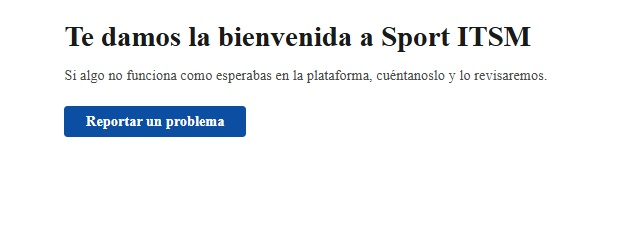

The landing page is the entry point of the Self-Service Portal. It welcomes the visitor — _"Te damos la bienvenida a Sport ITSM"_ ("Welcome to Sport ITSM") — and states the promise in one sentence: _"Si algo no funciona como esperabas en la plataforma, cuéntanoslo y lo revisaremos."_ ("If something on the platform isn't working as you expected, tell us and we'll look into it.").

There is exactly one action on the page, **_"Reportar un problema"_ ("Report a problem")**, which opens the intake form. This page is the first fragment of the full Self-Service Portal (FR-KNW-08), which will later add knowledge search, catalog requests and the Requester's own ticket list.

#### 1.3.2 Report a problem — `/incidents/new`

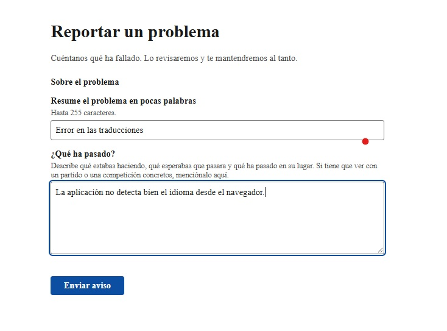

This screen **logs an Incident** from the Self-Service Portal (FR-INC-01). Under the heading _"Reportar un problema"_ ("Report a problem") and the reassurance _"Cuéntanos qué ha fallado. Lo revisaremos y te mantendremos al tanto."_ ("Tell us what went wrong. We'll look into it and keep you posted."), the form asks for exactly **two mandatory fields**, grouped as _"Sobre el problema"_ ("About the problem"):

| Field on screen | What the Requester provides | ITSM meaning |
|---|---|---|
| _"Resume el problema en pocas palabras"_ ("Summarize the problem in a few words") — hint _"Hasta 255 caracteres."_ ("Up to 255 characters.") | A one-line summary. The field does not accept more than **255 characters**. | The Incident's **short description** |
| _"¿Qué ha pasado?"_ ("What happened?") | Free text. The hint asks what the Requester was doing, what they expected and what happened instead, and invites them to mention the specific match or competition involved. | The Incident's **detailed description**, including any competition context in the Requester's own words |

What the form deliberately does **not** ask: the Requester never chooses Impact, Urgency, Priority, a category or whether a competition in progress is affected. Those are assessed later by the Service Desk (FR-INC-01, FR-INC-05), so no Requester can inflate the urgency of their own report.

**Validation and error messages.** Both fields are checked when the Requester presses **_"Enviar aviso"_ ("Send report")**; a field containing only spaces counts as empty. If anything is missing, the form does not submit and instead:

- shows a summary at the top — _"No hemos podido enviar tu aviso"_ ("We couldn't send your report") and _"Corrige lo siguiente e inténtalo de nuevo:"_ ("Fix the following and try again:") — with one link per problem that jumps straight to the field concerned, and moves the keyboard focus onto that summary;
- marks each faulty field and shows its message beneath it: _"Resume el problema en pocas palabras."_ ("Summarize the problem in a few words.") for the summary, _"Describe qué ha pasado."_ ("Describe what happened.") for the description, and _"Acórtalo a 255 caracteres o menos."_ ("Shorten it to 255 characters or fewer.") should an over-long summary ever reach the Service Desk.

Every failure says what happened and what to do next; none is silent (NFR-USE-05). If the connection drops, the Requester reads _"No hemos podido conectar con el servidor. Comprueba tu conexión e inténtalo de nuevo."_ ("We couldn't reach the server. Check your connection and try again."); if the service itself fails, _"Algo ha fallado por nuestra parte. Inténtalo de nuevo en unos minutos."_ ("Something went wrong on our side. Try again in a few minutes."), together with a _"Código para soporte:"_ ("Support code:") that the Service Desk can use to trace the exact failed attempt. While the report is being sent, the button reads _"Enviando aviso…"_ ("Sending report…") and cannot be pressed twice.

**On success**, the Incident is logged and immediately receives its **reference number**: `INC` followed by seven digits (for example `INC0000001`), unique and never reused (FR-INC-02). The Requester is taken straight to the Incident record for that reference.

#### 1.3.3 Incident record — `/incidents/INC0000001`


The record is headed _"Aviso INC0000001"_ ("Report INC0000001") and lists, under _"Lo que tenemos registrado"_ ("What we have on record"), exactly what the system recorded. It is read-only: the Requester consults it, and can come back to it at any time through its address, `/incidents/<reference>`.

**What the system recorded at logging**

| Label on screen | English | What it is |
|---|---|---|
| _Referencia_ | Reference | The Incident's unique reference number (FR-INC-02). |
| _Registrado el_ | Logged on | The date and time the Incident was logged, written out in Spanish (for example _"29 de septiembre de 2026 a las 19:04"_) and shown in the viewer's own time zone. |
| _Cómo nos llegó el aviso_ | How the report reached us | The **origin channel**, set by the system and never by the Requester (FR-OMN-02). A report sent from this form always shows _"Formulario web"_ ("Web form") — the Self-Service Portal channel. |
| _Resumen_ | Summary | The short description, exactly as submitted. |
| _Descripción completa_ | Full description | The detailed description, exactly as submitted. |

**What the Service Desk will complete at triage.** The remaining fields belong to **triage** — the Service Desk's assessment of a newly logged Incident — and are therefore still open on a new record. The screen says so explicitly instead of hiding the fields or filling them with a default:

| Label on screen | English | ITSM field and what it means for the customer | Shown on a new record |
|---|---|---|---|
| _A qué afecta_ | What it affects | **Affected service** — which SCMS service is failing. Optional when reporting, because the Requester may not know; the Service Desk records it before the Incident moves forward (FR-INC-19). | _"No indicado"_ ("Not specified") |
| _Tipo de problema_ | Type of problem | **Category** — the classification that routes the Incident to the right Resolver Group (FR-INC-03). | _"Todavía sin clasificar"_ ("Not classified yet") |
| _Cuánto está afectando esto_ | How much this is affecting things | **Impact** — how widely the failure disrupts users or competitions. | _"Todavía sin evaluar"_ ("Not assessed yet") |
| _Con qué rapidez hay que atenderlo_ | How quickly it needs attention | **Urgency** — how quickly the business needs it restored. | _"Todavía sin evaluar"_ ("Not assessed yet") |
| _Cuándo lo atenderemos_ | When we'll deal with it | **Priority** — derived from Impact × Urgency, never chosen by the Requester. Until both are assessed the Incident has no Priority, and the screen says so rather than showing a default one (FR-INC-04). | _"Todavía sin decidir"_ ("Not decided yet") |
| _Afecta a una competición que está en marcha_ | Affects a competition in progress | **Competition-in-progress flag** — set only by the Service Desk, with a justification, when the failure disrupts a live event; it raises the Impact and therefore the Priority (FR-INC-05). | _"No, de momento no"_ ("No, not for now") |

If the record cannot be shown, the screen says why and what to do: _"Cargando tu aviso…"_ ("Loading your report…") while it loads; _"No hemos encontrado este aviso"_ ("We couldn't find this report") for a well-formed reference that does not exist; _"Esta referencia no parece válida"_ ("This reference doesn't look valid") for an address that is not shaped like a reference, with advice to check the link; and the same connection and service-failure messages as the form.

#### 1.3.4 Accessibility

What the demo screens do today (towards NFR-USE-03 and NFR-USE-04):

- **One main heading per screen**, and the page is declared as Spanish so screen readers pronounce it correctly.
- **Full keyboard operation**: every action is a native link, field or button, reachable with Tab and activated with Enter, with a clearly visible focus outline.
- **Focus is placed where it matters**: on the error summary when a submission fails, and on the record's heading when the record opens.
- **Fields are properly labelled**: each field is tied to its label, its hint and — when there is one — its error message, and faulty fields are announced as invalid; the error summary is announced as an alert.
- **Mobile-ready**: the three screens fit a 360-pixel-wide phone screen without horizontal scrolling.

#### 1.3.5 Current scope and limitations of the demo

The demo shows the Requester's first interaction end to end — report a problem, see it recorded — and nothing beyond it. For an honest reading:

- **No sign-in.** The demo does not ask who you are. Anyone who knows a reference can open its record. In the product, every user is authenticated (FR-IAM-01), every report carries the Requester's identity (FR-OMN-04) and a Requester sees only their own tickets.
- **Demonstration data only.** Reports are held temporarily and are **lost whenever the service restarts**; numbering then starts again at `INC0000001`, and a link to an earlier record answers _"No hemos encontrado este aviso"_. Please do not enter real personal data.
- **The first visit may be slow.** After a period without traffic the demo service goes to sleep, and the first request can take a little while as it wakes up; subsequent requests respond normally.
- **Consultation only.** There is no list of "my reports", no way to add comments or attachments, no editing, no status notifications, and no Service Desk screens yet.

**What comes next** (PRD §14, no dates committed): the foundations — authenticated users with roles, the categorization taxonomy and the audit trail — then the **MVP**: the complete Incident lifecycle with Service Desk triage (category, Impact × Urgency → Priority, affected service, competition-in-progress flag), SLA targets and escalation, notifications, Service Requests from the Service Catalog, the Knowledge Base and the full Self-Service Portal, and the guard that redirects in-application sport decisions to the right path before submission (FR-INC-15). Governance of SCMS Changes, Releases, Problems and the CMDB follows in the next phase.

### **1.4. Instrucciones de instalación:**

> Documenta de manera precisa las instrucciones para instalar y poner en marcha el proyecto en local (librerías, backend, frontend, servidor, base de datos, migraciones y semillas de datos, etc.)

This section gets a fresh clone running locally, verified step by step. Commands are given in **bash** (Git Bash / macOS / Linux); where the syntax changes — inline environment variables, copying a file — the **PowerShell** equivalent follows. §2.3.6 ["Useful commands"](#236-useful-commands) is the full command surface (lint, boundary verification, bootstrap acceptance criteria); this section only points to it rather than repeating it.

#### 1.4.1 Prerequisites

| Tool | Required version | Where it is pinned | Check |
|---|---|---|---|
| **Node.js** | 22 LTS | `.nvmrc` (`22`), `package.json` → `engines.node` (`>=22.0.0 <23.0.0`) | `node --version` |
| **pnpm** | 10.18.3, via **Corepack** — pnpm is the *only* supported package manager; `npm install`/`yarn` here produces a second lockfile | `package.json` → `packageManager` | `corepack enable` (once per machine), then `pnpm --version` |
| **Docker** | any recent version with Compose v2 (`docker compose`, not `docker-compose`) — needed for the local PostgreSQL and for the Cypress E2E suites; **not** needed for the quick-start path (A) below | — | `docker --version` |
| **Git** | any recent version | — | `git --version` |

These steps were last verified with `node v22.20.0`, `pnpm 10.18.3` and `Docker 27.3.1`.

#### 1.4.2 Clone and install

```bash
git clone https://github.com/igomez-ai4devs-projects/AI4Devs-finalproject.git
cd AI4Devs-finalproject
corepack enable
pnpm install
```

`pnpm install` is the only install command — it writes a single `pnpm-lock.yaml` at the repository root. Nothing else (`npm`, `yarn`) is supported.

#### 1.4.3 Configure the environment

```bash
cp .env.example .env
```

```powershell
# PowerShell equivalent
Copy-Item .env.example .env
```

`.env` is gitignored; `.env.example` is the committed template and the only in-repo record of which keys the API needs. The API validates this environment at boot (`apps/api/src/config/env.validation.ts`) and **refuses to start**, naming every offending key, rather than falling back to a plausible default.

| Key | Mandatory when | Meaning |
|---|---|---|
| `NODE_ENV` | always | `development \| test \| staging \| production` |
| `PORT` | always | TCP port the API binds to (1–65535); `3300` in every local path below |
| `PERSISTENCE_MODE` | **always, with no default** (ADR-015) | `postgres \| memory` — choosing the non-durable `memory` store must be an explicit act, never an inferred one |
| `POSTGRES_HOST` / `POSTGRES_PORT` / `POSTGRES_DB` / `POSTGRES_USER` / `POSTGRES_PASSWORD` | **only when `PERSISTENCE_MODE=postgres`** | The connection to the local PostgreSQL (Path B below). Ignored, and never read by any code path, in `memory` mode |

One combination is rejected outright: **`PERSISTENCE_MODE=memory` together with `NODE_ENV=production` aborts the boot** — a non-durable store must never be selected in production (there is no production environment for this delivery, ADR-013, but the guard is unconditional).

#### 1.4.4 Run it — three paths

Pick one. All three use the same ports (API `3300`, web `4200`), so **run only one path at a time**.

**A. Quick start, no database** (`PERSISTENCE_MODE=memory`) — this is what the deployed demo runs (ADR-015).

```bash
# terminal 1
PERSISTENCE_MODE=memory pnpm nx serve api

# terminal 2
pnpm nx serve web
```

```powershell
# PowerShell — terminal 1
$env:PERSISTENCE_MODE = "memory"; pnpm nx serve api

# PowerShell — terminal 2
pnpm nx serve web
```

(If `.env` already sets `PERSISTENCE_MODE=memory`, the inline variable above is redundant but harmless.) Open **`http://localhost:4200/`** — `apps/web/proxy.conf.json` forwards `/api` to `http://localhost:3300`, so the browser never talks to the API port directly. You should see the Sport ITSM home page in Spanish, with one button, *"Reportar un problema"*.

**B. With PostgreSQL** (`PERSISTENCE_MODE=postgres`) — start **only** the `postgres` service of the development compose file, never a bare `up` (see Troubleshooting):

```bash
docker compose -f docker/docker-compose.dev.yml up -d postgres
pnpm migration:run
pnpm migration:show
```

```powershell
# PowerShell — identical, docker compose and pnpm read the same way
docker compose -f docker/docker-compose.dev.yml up -d postgres
pnpm migration:run
pnpm migration:show
```

`pnpm migration:show` must list every migration with `[X]` (applied) — 4 today:

```
[X] 5 CreateIamSchemaAndExtensions1790349248155
[X] 6 CreateIncidentSchema1790366187635
[X] 7 CreateIncidentTicketTable1790380866140
[X] 8 CreateIncidentReferenceSequenceAndImmutabilityTrigger1790383684993
```

Then start the API and the web client as in Path A, with `PERSISTENCE_MODE=postgres` instead:

```bash
PERSISTENCE_MODE=postgres pnpm nx serve api
pnpm nx serve web
```

```powershell
$env:PERSISTENCE_MODE = "postgres"; pnpm nx serve api
pnpm nx serve web
```

Open `http://localhost:4200/` as in Path A. Data now survives an API restart — Path A's counter resets to `INC0000001` on every restart, Path B's does not.

**C. Production-like (stage topology)** — builds both applications and runs the same images the pipeline pushes to `ghcr.io` (ADR-013/ADR-015): nginx on `4200` serving the built Angular bundle and reverse-proxying `/api/` to the API, which runs `PERSISTENCE_MODE=memory` (the stage prototype has no database, ADR-015).

```bash
pnpm nx build api
pnpm nx run api:build-migrations
pnpm nx build web
docker compose -f docker/docker-compose.stage.yml up -d --build
```

```powershell
pnpm nx build api
pnpm nx run api:build-migrations
pnpm nx build web
docker compose -f docker/docker-compose.stage.yml up -d --build
```

Open `http://localhost:4200/` — the browser only ever talks to this one origin, same as on Render. Tear it down with `docker compose -f docker/docker-compose.stage.yml down` once you are done (§1.4.8).

#### 1.4.5 Database, migrations and seed data

The schema changes **only** through TypeORM migrations — `synchronize` is always `false` (`CLAUDE.md` §3). The chain lives in `apps/api/src/migrations/` (conventions in its own `README.md`), applied against the data source at `apps/api/src/data-source.ts`:

```bash
pnpm migration:run       # apply every pending migration
pnpm migration:revert    # roll back the last applied migration
pnpm migration:show      # list migrations and their applied state
```

These shorthands already carry `-d apps/api/src/data-source.ts` — do not append a second `-d`. They need a reachable PostgreSQL, i.e. Path B's `postgres` service on host port **5452** (not 5432 — see Troubleshooting).

**There is no seed data, and none is needed.** The demo registers every Incident under a single fixed Requester actor set at boot (`T-C10-74`) — there is no sign-in yet (§1.3.5) — so no user, role or reference data has to be seeded for the flow in §1.4.6 to work. The only "data" a fresh environment needs is the schema itself, produced by the migrations above.

#### 1.4.6 Verify it works

**Through the browser** (any of the three paths): open `http://localhost:4200/`, click *"Reportar un problema"*, fill in the summary and description, submit, and confirm you land on the Incident record (`/incidents/INC000000N`) showing what you just typed, with every triage field marked as not yet assessed (§1.3.3).

**From the command line**, the same flow plus the 404 case, always through `http://localhost:4200` — the dev-server proxy in Paths A and B, nginx in Path C:

```bash
curl -i -X POST http://localhost:4200/api/incidents \
  -H "Content-Type: application/json" \
  -d '{"shortDescription":"Smoke test","description":"Verifying the install steps in readme.md section 1.4."}'
# -> 201, body: {"reference":"INC000000N"}

curl -i http://localhost:4200/api/incidents/INC000000N
# -> 200, the full record

curl -i http://localhost:4200/api/incidents/INC9999999
# -> 404, body: {"error":{"code":"NOT_FOUND"}}
```

```powershell
Invoke-WebRequest -Method Post -Uri http://localhost:4200/api/incidents `
  -ContentType "application/json" `
  -Body '{"shortDescription":"Smoke test","description":"Verifying the install steps in readme.md section 1.4."}'

Invoke-WebRequest -Uri http://localhost:4200/api/incidents/INC9999999
# throws / reports 404 — Invoke-WebRequest raises on a non-2xx status; read $_.Exception.Response.StatusCode
```

Expected result, verified end to end on all three paths: `201` on the `POST`, `200` on the matching `GET`, `404` with `{"error":{"code":"NOT_FOUND"}}` on `INC9999999`.

#### 1.4.7 Run the tests

| Suite | Command | Notes |
|---|---|---|
| Unit tests, lint, build | `pnpm nx run-many -t lint test build` | Every project of the workspace (13 today); no database or Docker needed |
| API E2E (Cypress + Cucumber) | `pnpm nx e2e api-e2e` | Brings up its own ephemeral PostgreSQL (host port **5499**), migrates it, serves the built API, runs, and tears the stack down — pass or fail. Needs Docker running |
| Web E2E (Cypress + Cucumber) | `pnpm nx e2e web-e2e` | Starts the web dev server on `4200` itself (keep that port free); no database involved |

From a VS Code integrated terminal, `ELECTRON_RUN_AS_NODE` is inherited and breaks the Cypress binary — unset it in the **same** command (see Troubleshooting). The full command surface — boundary verification, the bootstrap/lint acceptance criteria, formatting, the dependency graph — is §2.3.6 ["Useful commands"](#236-useful-commands); this table only orients a first run.

#### 1.4.8 Stop and clean up

```bash
# Stop nx serve api / nx serve web: Ctrl+C in each terminal. If a process
# outlived its terminal, find the PID actually holding the port and kill that:
netstat -ano | grep -E ':3300|:4200'      # note the PID in the last column
taskkill //PID <pid> //F                  # Git Bash on Windows
kill -9 <pid>                             # macOS / Linux

# Path C containers
docker compose -f docker/docker-compose.stage.yml down

# Path B's PostgreSQL is meant to stay up between sessions — stop it only when
# you are done with local development entirely:
docker compose -f docker/docker-compose.dev.yml down       # keeps postgres-data
docker compose -f docker/docker-compose.dev.yml down -v    # also deletes it (destructive)
```

```powershell
Get-NetTCPConnection -LocalPort 3300,4200 -ErrorAction SilentlyContinue |
  Select-Object LocalPort, OwningProcess
Stop-Process -Id <pid> -Force

docker compose -f docker/docker-compose.stage.yml down
docker compose -f docker/docker-compose.dev.yml down        # keeps postgres-data
docker compose -f docker/docker-compose.dev.yml down -v     # also deletes it (destructive)
```

#### 1.4.9 Troubleshooting

**The API listens on the wrong port, or won't connect to the database, even though `.env` looks right.** A variable **already set in your shell or system environment always wins over `.env`** — neither `@nestjs/config`'s loader nor `node --env-file-if-exists` overwrites a variable that is already there. If your machine happens to export `PORT`, or `POSTGRES_HOST`/`POSTGRES_USER`/etc. — commonly left behind by another local project — the API silently binds to that port, or authenticates against that other database, instead of the values in `.env`.

- Check in bash: `echo "PORT=$PORT POSTGRES_HOST=$POSTGRES_HOST POSTGRES_USER=$POSTGRES_USER"`
- Check in PowerShell: `"PORT=$env:PORT POSTGRES_HOST=$env:POSTGRES_HOST POSTGRES_USER=$env:POSTGRES_USER"`
- Fix without touching your global environment: pass the value on the **same command line** as the one that starts the process (`PORT=3300 pnpm nx serve api` / `$env:PORT = "3300"; pnpm nx serve api`) — an inline assignment does take precedence. Or clear it for the current session (`unset PORT` / `Remove-Item Env:PORT`); on Windows, a persistent user-level variable is removed with `[Environment]::SetEnvironmentVariable('PORT', $null, 'User')`, after which every terminal (and VS Code) must be reopened.

**The development compose file's `api` and `web` services do not work — start `postgres` only.** `docker/docker-compose.dev.yml` is reported (`T-C10-76`) to have a broken `api` service (it declares no `POSTGRES_*` variables, so it fails environment validation on its own) and both `docker/backend/Dockerfile.dev` / `docker/frontend/Dockerfile.dev` still comment "there is no `libs/` directory yet", which is no longer true and means neither copies `libs/` into the image. This section deliberately documents `docker compose -f docker/docker-compose.dev.yml up -d postgres` — the service name is required — and never a bare `up`. These are pre-existing findings, reported here and to the CI/CD owner, not fixed as a side effect of this section.

**Port 5452, not 5432.** The development PostgreSQL container still listens on `5432` internally, but the compose file publishes it on host port **5452** (5432 is commonly already taken by another local PostgreSQL). Every local `POSTGRES_PORT` in this section is `5452`; never propose `5432`.

**Cypress fails with `bad option --smoke-test` from a VS Code integrated terminal.** The inherited `ELECTRON_RUN_AS_NODE=1` breaks the Cypress binary before any test runs. Unset it in the same command: `unset ELECTRON_RUN_AS_NODE; pnpm nx e2e api-e2e` (bash) or `Remove-Item Env:ELECTRON_RUN_AS_NODE; pnpm nx e2e api-e2e` (PowerShell).

**`api-e2e` and the `incident-infrastructure` integration suite cannot run at the same time.** Both use the same ephemeral PostgreSQL on host port 5499; run one, let it tear down, then the other.

**Ports already in use.** Paths B and C, and a plain `pnpm nx serve web`, all use `3300`/`4200`. Stop whichever path is running (§1.4.8) before starting another.

---

## 2. Arquitectura del Sistema

### **2.1. Diagrama de arquitectura:**

> Usa el formato que consideres más adecuado para representar los componentes principales de la aplicación y las tecnologías utilizadas. Explica si sigue algún patrón predefinido, justifica por qué se ha elegido esta arquitectura, y destaca los beneficios principales que aportan al proyecto y justifican su uso, así como sacrificios o déficits que implica.

Sport ITSM is a **modular monolith** built as a single **Nx monorepo** that applies **Domain-Driven Design** (strategic and tactical) and **Hexagonal Architecture (Ports & Adapters)** across both platforms. The diagrams below go from the general to the concrete. The full architecture document — C4 context, context map, tactical model, end-to-end sequences and ADRs — lives in [`docs/product/ARCHITECTURE.md`](docs/product/ARCHITECTURE.md).

#### Containers and technologies

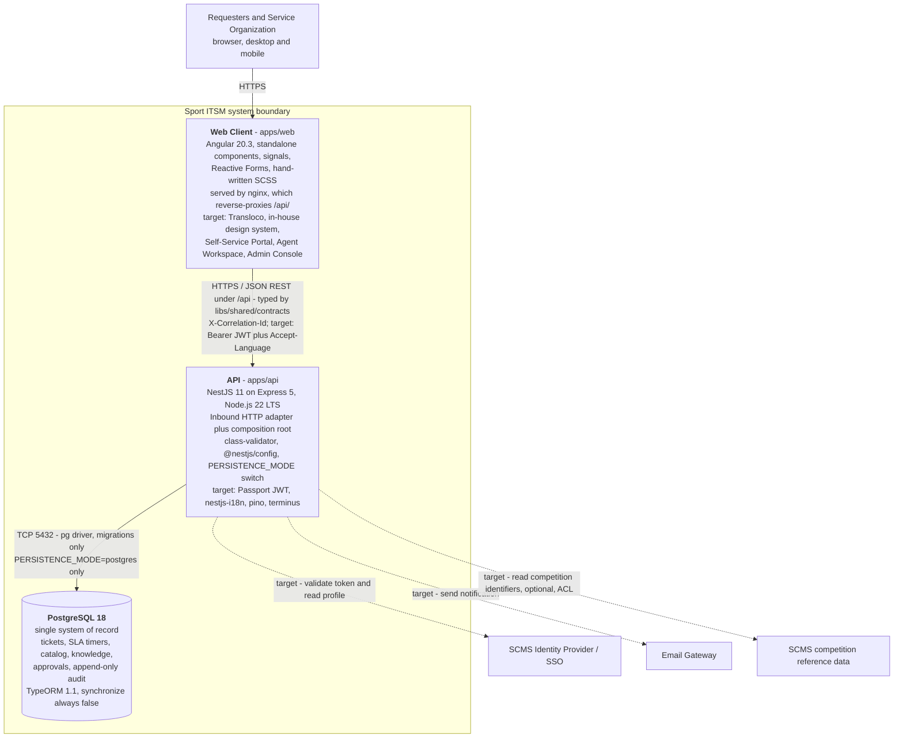
```mermaid
flowchart TB
    USER["Requesters and Service Organization<br/>browser, desktop and mobile"]

    subgraph boundary["Sport ITSM system boundary"]
        WEB["<b>Web Client</b> - apps/web<br/>Angular 20.3, standalone components, signals,<br/>Reactive Forms, hand-written SCSS<br/>served by nginx, which reverse-proxies /api/<br/>target: Transloco, in-house design system,<br/>Self-Service Portal, Agent Workspace, Admin Console"]
        API["<b>API</b> - apps/api<br/>NestJS 11 on Express 5, Node.js 22 LTS<br/>Inbound HTTP adapter plus composition root<br/>class-validator, @nestjs/config, PERSISTENCE_MODE switch<br/>target: Passport JWT, nestjs-i18n, pino, terminus"]
        DB[("<b>PostgreSQL 18</b><br/>single system of record<br/>tickets, SLA timers, catalog, knowledge,<br/>approvals, append-only audit<br/>TypeORM 1.1, synchronize always false")]
    end

    IDP["SCMS Identity Provider / SSO"]
    MAIL["Email Gateway"]
    SCMS["SCMS competition reference data"]

    USER -->|"HTTPS"| WEB
    WEB -->|"HTTPS / JSON REST under /api - typed by libs/shared/contracts<br/>X-Correlation-Id; target: Bearer JWT plus Accept-Language"| API
    API -->|"TCP 5432 - pg driver, migrations only<br/>PERSISTENCE_MODE=postgres only"| DB
    API -.->|"target - validate token and read profile"| IDP
    API -.->|"target - send notification"| MAIL
    API -.->|"target - read competition identifiers, optional, ACL"| SCMS
```

Solid arrows exist today; dashed arrows are target integrations with no adapter yet (see the Status note below). There is deliberately **no message broker, no cache tier and no separate reporting store**: one API process, one database, one client.

#### Layering and the dependency rule

Every bounded context (`incident`, `service-request`, `sla`, `service-catalog`, `knowledge`, `identity-access`, …) is materialized as a set of Nx libraries tagged on three axes — `platform:` / `scope:` / `type:` — and `@nx/enforce-module-boundaries` makes the rule below **mechanical rather than aspirational**.

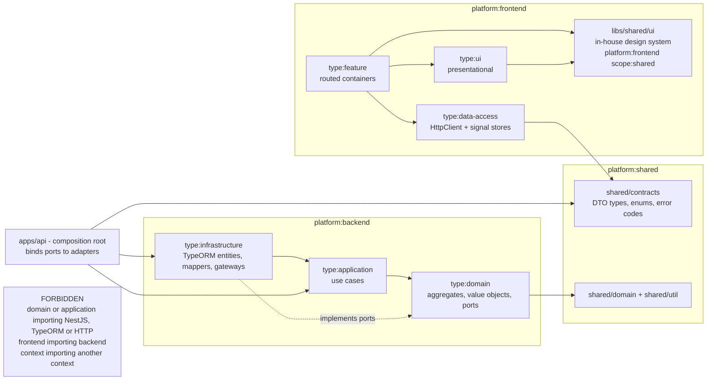
```mermaid
flowchart LR
    subgraph FE["platform:frontend"]
        F_FEAT["type:feature<br/>routed containers"]
        F_UI["type:ui<br/>presentational"]
        F_DA["type:data-access<br/>HttpClient + signal stores"]
        SH_UI["libs/shared/ui<br/>in-house design system<br/>platform:frontend scope:shared"]
    end

    subgraph SH["platform:shared"]
        CONTRACTS["shared/contracts<br/>DTO types, enums, error codes"]
        SDOM["shared/domain + shared/util"]
    end

    subgraph BE["platform:backend"]
        B_INFRA["type:infrastructure<br/>TypeORM entities, mappers, gateways"]
        B_APP["type:application<br/>use cases"]
        B_DOM["type:domain<br/>aggregates, value objects, ports"]
    end

    APP_API["apps/api - composition root<br/>binds ports to adapters"]

    F_FEAT --> F_UI
    F_FEAT --> F_DA
    F_FEAT --> SH_UI
    F_UI --> SH_UI
    F_DA --> CONTRACTS
    B_INFRA --> B_APP
    B_APP --> B_DOM
    B_DOM --> SDOM
    B_INFRA -.->|"implements ports"| B_DOM
    APP_API --> B_INFRA
    APP_API --> B_APP
    APP_API --> CONTRACTS

    FORBIDDEN["FORBIDDEN<br/>domain or application importing NestJS, TypeORM or HTTP<br/>frontend importing backend<br/>context importing another context"]
```

Dependencies point **inward only**: `infrastructure → application → domain`, never the reverse. Domain and application layers contain zero framework, ORM, HTTP or I/O code. Cross-context collaboration (e.g. Incident needing SLA, Approval, Notification or Audit) never becomes an import: the consuming context declares an outbound **port** in its own language and `apps/api` supplies the adapter, so no context-to-context edge ever exists in the Nx graph.

#### Patterns applied and why

| Pattern | Where it applies | Why it was chosen |
| --- | --- | --- |
| **Domain-Driven Design** | One bounded context per ITSM capability | ITSM is a domain with a precise, standardized ubiquitous language (Incident, Problem, Change, SLA, CI, CAB). Modeling it explicitly is what keeps _"a match reschedule is not a ticket"_ enforceable instead of a convention. |
| **Hexagonal (Ports & Adapters)** | Backend, per context | The business rules that matter (Impact × Urgency → Priority, SLA target recalculation, lifecycle transitions) are testable with zero infrastructure, and PostgreSQL/TypeORM/NestJS become replaceable details. |
| **Modular monolith** | Whole system | Fifteen contexts could suggest microservices; delivery is portfolio-scale. One process gives single-transaction consistency and near-zero operational cost, while the Nx boundaries preserve the option to extract a context later. |
| **Nx monorepo + tag boundaries** | Whole system | The architecture is enforced by `pnpm nx lint` in CI, not by review discipline. An illegal dependency fails the build. |
| **Shared typed contracts** | `libs/shared/contracts` | The single permitted coupling between frontend and backend. A breaking API change fails the frontend build immediately — the intended safety property. |
| **Signals-first Angular** | Frontend | Standalone components, `OnPush` everywhere, functional interceptors and signal stores; no NgModules, no external state library. |
| **Event-driven cross-cutting** | Audit, Notification, Reporting | Mutating operations commit first and publish domain events after; a notification outage can never block ticket intake. |

#### Benefits

- **Testability.** Business rules live in framework-free TypeScript. The most valuable tests need no database, no HTTP and no Angular TestBed.
- **Enforced boundaries.** Architectural erosion is caught by the linter, which matters most on a long-lived platform with many capabilities.
- **Evolvability.** Adding `problem`, `change` or `release` in phase 2 is additive: the Incident aggregate already reserves link semantics for them as opaque identifiers.
- **Coherence FE/BE.** One repository, one TypeScript version, one lint/format setup, `nx affected` for changed-only CI, and types that cannot drift between client and server.
- **Replaceable infrastructure.** ORM, identity provider or email gateway are adapters behind ports; swapping one does not touch business logic.

#### Sacrifices and deficits

Honest accounting of what this architecture costs:

- **Ceremony.** A trivial CRUD feature still needs a port, an adapter, a use case, a DTO, a mapper and a contract type. For a small product this is over-engineering; it pays off only because the ITSM domain is genuinely large.
- **Mapping code.** Domain aggregates and TypeORM entities are separate types, so mappers must be written and maintained.
- **A composition root that grows.** Every cross-context collaboration adds one adapter class in `apps/api`. Coupling is not eliminated — it is concentrated in a visible, reviewable place.
- **Single deployable.** Contexts cannot be scaled or released independently; the whole API deploys together, and a defect in one context can affect the process.
- **Eventual consistency in the cross-cutting path.** Audit and notification writes sit outside the ticket transaction. Mitigated with an in-process dispatcher with retry and audit-completeness assertions in acceptance tests, but it is a real trade-off against strict transactional auditing.
- **Learning curve.** DDD + hexagonal + Nx tags is a steep onboarding cost, and the discipline degrades quickly if boundary violations are silenced instead of fixed.

> **Status:** this is the **target architecture**, materialized today as **one vertical slice of the `incident` context**. The Nx workspace, the pinned toolchain, the ESLint 9 / Prettier 3 layer and the three-axis tag scheme all exist (`T-C10-01` … `T-C10-03`), and `@nx/enforce-module-boundaries` enforces the type matrix, the scope rule and the platform rule — proven to bite by `pnpm verify:boundaries` (10/10). The workspace holds **13 projects**: the four applications (`api`, `web`, `api-e2e`, `web-e2e`), the shared kernel (`shared-util`, `shared-domain`, `shared-contracts`; there is no `libs/shared/ui` yet) and the six `incident-*` libraries; `pnpm nx run-many -t lint` is green for all 13. The slice is real end to end: a requester **logs an Incident** (`POST /api/incidents`) and **reads it back by reference** (`GET /api/incidents/:reference`, e.g. `INC0000001`) through the web intake form (`/incidents/new`) and detail page (`/incidents/:reference`) in `incident-feature`, the signal store and `HttpClient` service in `incident-data-access`, the thin `IncidentController` in `apps/api`, the `LogIncident` / `GetIncidentByReference` use cases in `incident-application`, the `Incident` aggregate and its ports in `incident-domain`, and two interchangeable repository adapters in `incident-infrastructure` — TypeORM over PostgreSQL and an in-memory one — selected once at boot by `PERSISTENCE_MODE=postgres|memory` (ADR-015). `pnpm nx graph` shows 13 nodes and **20 code edges**, every one of them legal: the backend chain `incident-infrastructure → incident-domain`, `incident-application → incident-domain`, all three plus `incident-domain` onto the shared kernel; the frontend chain `web ⇢ incident-feature` (lazy, dynamic import) `→ incident-data-access → shared-contracts`; `api → incident-{domain,application,infrastructure}` and the shared kernel as composition root; and `web-e2e → shared-contracts`. No context-to-context and no frontend-to-backend edge exists. `incident-ui` is still empty (no edge, no test). Still absent: every other bounded context, authentication and authorization (a fixed requester actor stands in), the real SLA adapter (a provisional no-op binds `SlaPolicyPort`), every event subscriber (audit, notification, reporting), the external integrations (dashed arrows above) and the API health probes. In the container images the Web Client is served by **nginx**, which also reverse-proxies `/api/` to the API service (`T-C10-79`); deployment is covered in [§2.4](#24-infraestructura-y-despliegue).

### **2.2. Descripción de componentes principales:**

> Describe los componentes más importantes, incluyendo la tecnología utilizada

The system is composed of two deployables — the Angular **Web Client** and the NestJS **API** — plus one PostgreSQL system of record. Everything else is an Nx library: each bounded context contributes a **backend hexagon** (`domain` / `application` / `infrastructure`) and, where it has a UI, a **frontend slice** (`feature` / `ui` / `data-access`). The components below are described by responsibility and technology; their allowed dependencies are the ones already shown in §2.1.

The tables describe the **target design**. Each one carries a **Today** column so that no component reads as built when it is not: **Built** means the code exists and is exercised by tests, **Partial** means a narrower form exists (the column says which), and **Target** means nothing of it exists yet — in particular, none of `@nestjs/swagger`, `nestjs-pino`, `@nestjs/terminus`, `nestjs-i18n`, `passport-jwt` / `@nestjs/jwt`, `bcrypt` or Transloco is installed (`package.json`).

#### 2.2.1 Web Client — `apps/web`

The client is an **Angular 20.3** application: standalone components only, signals for state, `OnPush` everywhere, Reactive Forms, an in-house component library built with plain HTML templates and SCSS design tokens — no third-party component library — and Transloco for i18n. It is a **pure presentation layer**: it holds no authorization decision, derives no Priority and computes no SLA target — it renders what the API decided (NFR-SEC-02).

| Component | Responsibility | Technology | Today |
| --- | --- | --- | --- |
| **Application shell** (`apps/web`) | Bootstrap via `bootstrapApplication` + `provide*` functions, lazy routing, global error handler, theming, cross-context page composition | Angular 20.3, `provideRouter`, `provideHttpClient`, centralized SCSS design tokens as the theming layer | **Partial** — `bootstrapApplication`, `provideBrowserGlobalErrorListeners`, `provideRouter` (lazy `/incidents` + a home page at `/`), `provideHttpClient(withInterceptors([]))`; no design-token layer yet (`styles.scss` only reserves its import) |
| **Self-Service Portal** | Requester surface: knowledge search first, log an Incident, request a published catalog offering, track own tickets and SLA status, comment, confirm or reject a resolution, submit CSAT | `knowledge/feature`, `incident/feature`, `service-catalog/feature`, `service-request/feature`, `approval/feature` | **Partial** — only *log an Incident* (`/incidents/new`) and *view it by reference* (`/incidents/:reference`), from `incident-feature` |
| **Agent Workspace** | Supply-side surface: prioritized work list, triage, categorization, the competition-in-progress flag with mandatory justification, work notes, assignment, resolution | `incident/feature`, `service-request/feature`, `knowledge/feature`, SLA countdown rendered by `incident/ui` | Target |
| **Admin Console** | Configuration-as-data surface: taxonomy, Impact × Urgency matrix, SLA policies, catalog offerings, workflows, notification templates, roles and resolver groups | `service-catalog/feature`, `identity-access/feature` + configuration feature libs | Target |
| **Management dashboards** | Operational and management KPI views (FCR, MTTA, MTTR, SLA compliance, backlog) | `reporting/feature` + `reporting/ui` | Target |
| **`type:feature` libs** | Routed containers: orchestrate the store, drive Reactive Forms, own explicit loading / error / empty states | Angular standalone components, signals, Reactive Forms | **Built** for `incident-feature`: `HomePageComponent`, `IncidentIntakeFormComponent`, `IncidentDetailComponent` |
| **`type:ui` libs** | Presentational building blocks with zero injected services (`PriorityBadge`, `SlaCountdown`, `StateChip`, `WorkNoteList`, `CompetitionSubjectPicker`) | Angular `input()` / `output()`, `OnPush`, hand-written HTML + scoped SCSS, native semantics plus ARIA, keyboard handling, focus trap/restore and `aria-live` regions for WCAG 2.1 AA | Target — `incident-ui` is scaffolded but empty |
| **`libs/shared/ui`** | The in-house **design system**: domain-agnostic presentational primitives every context reuses (button, form field, dialog/overlay, menu, table, tabs, toast, badge, chip), the SCSS design-token layer and the hand-written a11y primitives (focus-trap/restore directive, `aria-live` announcer). State in, events out: no injected service, no store, no I/O. Tagged `platform:frontend scope:shared type:ui` (ADR-010) | Angular `input()` / `output()`, `OnPush`, hand-written HTML + component-scoped SCSS over the shared design tokens; no third-party component library | Target — the library does not exist |
| **`type:data-access` libs** | The **only** outbound edge of the client: typed API services plus injectable signal stores exposing `asReadonly()` / `computed()` | `HttpClient` typed exclusively by `libs/shared/contracts`, Angular signals (no NgRx) | **Built** for `incident-data-access`: `IncidentApiService`, `IncidentStore`, `IncidentApiError`, `INCIDENT_API_BASE_URL` |
| **Functional interceptors** | `jwtInterceptor` (Bearer token), `localeInterceptor` (`Accept-Language`), `httpErrorInterceptor` (contract error code → Transloco key) | Angular functional interceptors (`withInterceptors`), Transloco | Target — the chain is registered and empty |
| **Route guards** | `authGuard` / `roleGuard` — usability only; never the security boundary | Angular functional guards | Target |
| **UI strings (i18n)** | Every user-facing string translatable, `Accept-Language` driven | Transloco | **Partial** — Transloco is not installed; every string of the incident screens lives in one file, `incident-feature/src/lib/incident-messages.ts` (Spanish copy), and dates are formatted with `Intl.DateTimeFormat('es-ES')` in the viewer's time zone. Migrating that file to Transloco keys is the accepted, isolated debt |

#### 2.2.2 API — `apps/api`

`apps/api` is simultaneously the **inbound HTTP adapter** and the **composition root**: it is the only project allowed to see more than one bounded context, because it is where ports are bound to adapters (ADR-002, ADR-003).

| Component | Responsibility | Technology | Today |
| --- | --- | --- | --- |
| **Controllers** | Thin inbound adapter: route, validate, delegate to a use case, map the result to a contract response. No business logic. | NestJS 11 on Express 5, `@nestjs/swagger` decorators | **Built** — `IncidentController`: `POST /api/incidents` (201) and `GET /api/incidents/:reference`; no Swagger decorators (not installed) |
| **Global `ValidationPipe`** | Reject unvalidated or unexpected payloads (`whitelist`, `forbidNonWhitelisted`, `transform`) | `class-validator` + `class-transformer` | **Built** — plus `stopAtFirstError` and an `exceptionFactory` that turns violations into contract `{ field, rule }` details |
| **Auth guards & strategy** | Verify the JWT, resolve the actor and their roles for the use-case authorization check | Passport JWT (`passport-jwt`, `@nestjs/jwt`), `bcrypt` for local credentials | Target — no authentication exists; a disposable `FixedRequesterActorResolver` bound to `INCIDENT_ACTOR_RESOLVER` supplies one static requester actor |
| **License gating** | `@LicenseFeature()` decorator restricting access to gated capabilities | Custom NestJS decorator + guard | Target |
| **Exception filter** | Map domain errors to a stable, contract-declared error-code envelope (codes are contract, text is not) | NestJS exception filter + `nestjs-i18n` | **Partial** — `GlobalExceptionFilter` + `incident-domain-error.mapper.ts` map validation, not-found and domain errors to the `ErrorEnvelope` / `ErrorCode` of `shared-contracts` and never leak internals ([§2.5.3](#253-error-handling-that-does-not-leak-internals)); no `nestjs-i18n` |
| **Correlation id** | One id per request, echoed in the response and carried into the use case context | `X-Correlation-Id` (`CORRELATION_ID_HEADER` in `shared-contracts`) | **Built** — `resolveCorrelationId()` accepts a UUID-shaped inbound header or mints one |
| **Configuration** | Validated environment, no raw `process.env` in feature code | `@nestjs/config` + `class-validator` schema | **Built** — `env.validation.ts` aborts boot on a missing or malformed key and forbids `PERSISTENCE_MODE=memory` with `NODE_ENV=production` |
| **Persistence mode switch** | Choose, once at boot, which repository adapter backs each port (ADR-015) | `PersistenceModule.forMode(PERSISTENCE_MODE)` | **Built** — `postgres` imports `DatabaseModule` and binds `TypeOrmIncidentRepository`; `memory` binds `InMemoryIncidentRepository` and opens no connection |
| **i18n** | Localize API messages and email templates from `Accept-Language` | `nestjs-i18n` 10 | Target — not installed; the API returns stable error codes, and the client owns the wording |
| **Logging** | Structured logs with request correlation; no `console.log` | `nestjs-pino` | **Partial** — NestJS's built-in `Logger` (plain text), no `console.log`; `nestjs-pino` is not installed |
| **Health probes** | `/health/live`, `/health/ready` — unprefixed, so Sport ITSM outages are detectable independently of user reports (NFR-CFG-03) | `@nestjs/terminus` | Target — only the prefix exclusion for both paths is reserved (`global-prefix.ts`); the container health checks are TCP-only for the API, and nginx answers its own static `/health` |
| **API documentation** | OpenAPI at `/api/docs`, **development only** | `@nestjs/swagger` | Target — not installed |
| **Composition root modules** | Bind each port token to its adapter (`{ provide: INCIDENT_REPOSITORY, useClass: TypeOrmIncidentRepository }`), and host the **cross-context adapters** (`SlaPolicyAdapter`, `ApprovalAdapter`, `NotificationAdapter`, `AuditAdapter`) | NestJS DI, `Symbol` injection tokens declared beside each port | **Partial** — `PersistenceModule` binds `INCIDENT_REPOSITORY` / `INCIDENT_READ_REPOSITORY` from `incident-persistence.bindings.ts`; `IncidentModule` binds `CLOCK` (`SystemClock`), `INCIDENT_ACTOR_RESOLVER`, the two use cases and `SLA_POLICY` — the latter to `ProvisionalNoopSlaPolicyAdapter`; no real cross-context adapter exists |
| **Scheduled jobs** | Second inbound adapter: SLA warning/breach sweep and auto-close after the confirmation period | NestJS scheduling over the same application use cases | Target |

#### 2.2.3 Bounded-context libraries

Each context owns its hexagon. Phase 1 scaffolds the MVP contexts; `problem`, `change`, `release` and `asset-config` are **phase 2** (PRD §14.4) and are deliberately not generated yet.

| Context | Phase | Core responsibility | Key model elements |
| --- | --- | --- | --- |
| `incident` | 1 | Incident and Major Incident lifecycle, Impact × Urgency prioritization, agent-set competition-impact flag, work notes, escalation | `Incident` (root), `TicketReference`, `Priority`, `CompetitionImpactFlag`, `CompetitionSubject`, `PriorityCalculator` |
| `service-request` | 1 | Fulfillment of entitled catalog offerings, approval routing, fulfillment tasks | `ServiceRequest` (root) with `FulfillmentTask` entities |
| `sla` | 1 | SLA policy resolution, timer state, pause/resume, warnings, breaches, recalculation on Priority change | `SlaPolicy`, `SlaInstance`; no UI of its own — surfaced inside ticket views |
| `service-catalog` | 1 | Services and Service Offerings, request forms, eligibility rules, publication lifecycle | `Service`, `ServiceOffering` |
| `knowledge` | 1 | Knowledge Articles, authoring lifecycle, audience visibility, full-text search | `KnowledgeArticle` |
| `identity-access` | 0/1 | Authentication, RBAC, least privilege, resolver groups and queues | `User`, `Role`, `ResolverGroup`, `IdentityProviderPort` |
| `approval` | 1 | Configurable approval stages, resolvable approvers, immutable decisions | `ApprovalRequest`, `ApprovalDecision` |
| `notification` | 1 | Event-driven dispatch to requesters, agents, approvers and Major Incident stakeholders | `NotificationDispatch` + templates |
| `audit` | 0 | Append-only activity history; no update or delete capability exists at all | `AuditEntry` |
| `reporting` | 1 | Denormalized read models for operational and management dashboards | read models only, no aggregate |
| `problem`, `change`, `release`, `asset-config` | 2 | RCA/KEDB, change authorization and scheduling, release & deployment, CMDB impact analysis | `Problem`/`KnownError`, `Change`, `Release`, `ConfigurationItem`/`CiRelationship` |

**Today only `incident` exists**, and only its intake slice. `incident-domain` holds the `Incident` aggregate (`Incident.log()`, raising `IncidentLogged`), the `OriginChannel` value object, `IncidentReferencePolicy` (the `INC0000001` format) and three ports — `IncidentRepositoryPort`, `IncidentReadRepositoryPort` and the outbound `SlaPolicyPort`; `Priority`, `ImpactLevel`, `UrgencyLevel` and `TicketReference` come from `shared-domain`. `incident-application` holds `LogIncidentUseCase` (with the authorization check against an `IncidentActor`) and `GetIncidentByReferenceUseCase`. `incident-infrastructure` holds `IncidentEntity`, `IncidentMapper` and the two repository adapters, `TypeOrmIncidentRepository` and `InMemoryIncidentRepository`. `CompetitionImpactFlag`, `CompetitionSubject`, `PriorityCalculator`, work notes, triage and every other context in the table are **target**.

Inside every context the three backend libraries have fixed roles, and the technology allowed in each is what the boundary rules enforce:

| Library | Responsibility | Technology allowed |
| --- | --- | --- |
| `<context>/domain` | Aggregates, entities, value objects, domain services, domain events and **outbound port interfaces** | **Pure TypeScript 5.9 only** — no NestJS, no TypeORM, no HTTP, not even `new Date()` (time arrives through `ClockPort`) |
| `<context>/application` | Use cases: orchestration, transaction boundary and the authorization check expressed in domain terms | TypeScript + `libs/shared/contracts` (types only); still no framework |
| `<context>/infrastructure` | Outbound adapters: TypeORM repositories, persistence entities, explicit mappers, external gateways | TypeORM 1.1, `pg`, NestJS DI |

#### 2.2.4 Shared libraries

| Library | Responsibility | Technology |
| --- | --- | --- |
| `libs/shared/contracts` | The **single typed API surface** shared by both platforms: request/response DTO shapes, enums and error codes. Types only — no logic, no framework, no validation decorators (ADR-007) | TypeScript 5.9 |
| `libs/shared/domain` | Shared kernel primitives used by three or more contexts: `Identity`, `TicketReference`, `ImpactLevel`, `UrgencyLevel`, `Priority`, `DomainEvent`, `StateModel`, `ClockPort` | Pure TypeScript |
| `libs/shared/ui` | The in-house design system reused by every context: presentational primitives, the SCSS design-token layer and the accessibility primitives (focus-trap/restore directive, `aria-live` announcer). Angular code with a shared scope, so it is tagged `platform:frontend scope:shared type:ui`, not `platform:shared` (ADR-010) | Angular 20.3 standalone components, `OnPush`, component-scoped SCSS |
| `libs/shared/util` | Pure, dependency-free helpers | Pure TypeScript |

Today `shared-contracts` holds the incident intake and detail contracts, `ErrorCode`, `ErrorEnvelope`, `CORRELATION_ID_HEADER` and a pagination shape; `shared-domain` holds `Identity`, `TicketReference`, `ImpactLevel`, `UrgencyLevel`, `Priority`, `DateTimeRange`, `DomainError`, `DomainEvent`, `EventPublisherPort`, `ClockPort` and `FixedClock` (`StateModel` is still target); `shared-util` holds `Result` (`ok` / `err`), `isNonEmptyString` and `assertNever`. `libs/shared/ui` does **not** exist yet.

#### 2.2.5 Persistence

**PostgreSQL 18** is the single system of record for every context: tickets, SLA timer timestamps, catalog, knowledge, approvals and the append-only audit trail. Access goes exclusively through **TypeORM 1.1** repositories in `type:infrastructure`, where persistence entities are **separate classes** from domain aggregates with an explicit mapper (ADR-005). `synchronize` is always `false`; the schema evolves only through **migrations** (`pnpm typeorm migration:generate|run|revert -d apps/api/src/data-source.ts`), never auto-run at startup in any environment. No business rule lives in a trigger or stored procedure. All instants are stored in UTC so SLA timers survive restarts and remain time-zone correct.

**Today** the migration chain has four migrations: the bootstrap (`iam` schema, `citext`, `pg_trgm`), the `incident` schema, the `incident_ticket` table, and the Incident reference sequence plus the one guard trigger that makes `reference` immutable once assigned. `migrationsRun` is `false` everywhere, so migrations are never auto-run by the API process: they are applied explicitly (`pnpm migration:run`), by the `api-e2e` and `incident-infrastructure:integration` targets against their own ephemeral PostgreSQL, and by the deploy pre-command (`pnpm migration:run:deploy`). The API can also run with **no database at all**: `PERSISTENCE_MODE=memory` (ADR-015) binds the in-memory repository adapter and never constructs a `DataSource`; boot validation forbids that mode with `NODE_ENV=production`, and the stage environment runs it by design (§2.4).

#### 2.2.6 Cross-cutting components

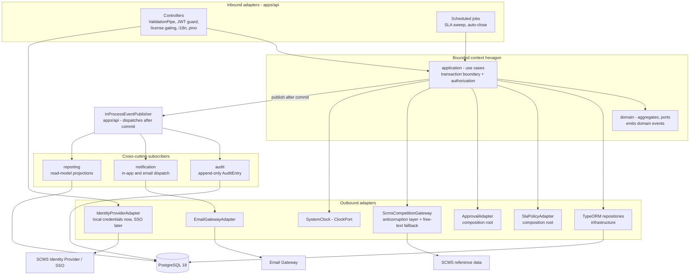
```mermaid
flowchart TB
    subgraph inbound["Inbound adapters - apps/api"]
        CTL["Controllers<br/>ValidationPipe, JWT guard,<br/>license gating, i18n, pino"]
        JOB["Scheduled jobs<br/>SLA sweep, auto-close"]
    end

    subgraph core["Bounded context hexagon"]
        UC["application - use cases<br/>transaction boundary + authorization"]
        DOM["domain - aggregates, ports<br/>emits domain events"]
    end

    BUS["InProcessEventPublisher<br/>apps/api - dispatches after commit"]

    subgraph xcut["Cross-cutting subscribers"]
        AUD["audit<br/>append-only AuditEntry"]
        NOT["notification<br/>in-app and email dispatch"]
        RPT["reporting<br/>read-model projections"]
    end

    subgraph outbound["Outbound adapters"]
        REPO["TypeORM repositories<br/>infrastructure"]
        SLAAD["SlaPolicyAdapter<br/>composition root"]
        APRAD["ApprovalAdapter<br/>composition root"]
        ACL["ScmsCompetitionGateway<br/>anticorruption layer + free-text fallback"]
        IDPAD["IdentityProviderAdapter<br/>local credentials now, SSO later"]
        MAILAD["EmailGatewayAdapter"]
        CLK["SystemClock - ClockPort"]
    end

    DB[("PostgreSQL 18")]
    SCMS["SCMS reference data"]
    IDP["SCMS Identity Provider / SSO"]
    MAIL["Email Gateway"]

    CTL --> UC
    JOB --> UC
    UC --> DOM
    UC --> REPO
    UC --> SLAAD
    UC --> APRAD
    UC --> ACL
    UC --> CLK
    UC -->|"publish after commit"| BUS
    BUS --> AUD
    BUS --> NOT
    BUS --> RPT
    REPO --> DB
    AUD --> DB
    RPT --> DB
    NOT --> MAILAD
    MAILAD --> MAIL
    ACL --> SCMS
    IDPAD --> IDP
    CTL --> IDPAD
```

| Component | Responsibility | Technology / placement | Today |
| --- | --- | --- | --- |
| **Domain-event dispatcher** | Single in-process publisher; use cases commit the aggregate first and publish afterwards, so a failing subscriber can never roll back ticket intake (NFR-AVL-03) | `EventPublisherPort` in `shared-domain`, `InProcessEventDispatcher` in `apps/api/src/event-dispatch/`; no broker in the MVP | **Built** — `LogIncidentUseCase` publishes `IncidentLogged` after the save; **no product subscriber is registered yet** (only the `NODE_ENV=test` harness subscribes), so the event currently reaches nobody in development or stage |
| **Audit component** | Records an immutable entry for every state transition, field change, assignment, comment, approval, notification and rule execution. Immutability is structural: `AuditRepositoryPort` exposes no update or delete method | `audit` context, TypeORM append-only table | Target |
| **Notification component** | Templated, localizable in-app and email notifications to requesters, agents, approvers and Major Incident stakeholders; every dispatch is recorded against its source record | `notification` context + email gateway adapter, `nestjs-i18n` templates | Target |
| **SLA timer engine** | Attaches a policy at creation, recalculates targets from the original creation time on Priority change, pauses/resumes on configured pending states, raises warnings and breach records, triggers escalation | `sla` context; timer state persisted as UTC timestamps in PostgreSQL, swept by a scheduled job — never in-memory counters | Target — `SlaPolicyPort.attachFor()` is called by `LogIncidentUseCase` but bound to a no-op |
| **Configuration as data** | Taxonomy, Impact × Urgency matrix, SLA policies, state models, approval chains and notification templates are persisted aggregates edited from the Admin Console, not code | Owning contexts + Admin Console | Target |
| **Observability** | Structured request-correlated logs and liveness/readiness probes | `nestjs-pino`, `@nestjs/terminus` | **Partial** — `X-Correlation-Id` response header on every incident response and every error response, NestJS built-in `Logger`; neither `nestjs-pino` nor `@nestjs/terminus` is installed and there is no `/health/*` endpoint on the API |

#### 2.2.7 External integrations

Every integration is a **port with an adapter**, so none of them is a hard runtime prerequisite for logging a ticket.

| Integration | Purpose | Component |
| --- | --- | --- |
| **SCMS competition reference data** | Read-only lookup of competition identifiers and labels so a ticket can name its affected subject. Sport ITSM consumes no competition calendar and derives no time-based policy from it | `CompetitionSubjectLookupPort` + `ScmsCompetitionGateway` **anticorruption layer**, with a free-text fallback adapter (PRD R10) |
| **SCMS Identity Provider / SSO** | Authentication and profile/entitlement attributes | `IdentityProviderPort` in `identity-access/domain`; local-credential adapter first, SSO adapter later (FR-IAM-04) |
| **Email gateway** | Outbound notification delivery | Adapter behind the `notification` context's outbound port (SMTP/HTTPS) |

> **Status:** as in §2.1, these components describe the **target architecture**; the **Today** columns above say exactly which parts exist. What runs today is the **Incident intake slice**: the **Web Client** (`apps/web`) lazily loads `incident-feature`, whose home page, intake form and detail page call the API through `incident-data-access`; the **API** (`apps/api`) exposes `POST /api/incidents` and `GET /api/incidents/:reference` behind the global `ValidationPipe`, `GlobalExceptionFilter` and correlation id, and binds the `incident` ports to adapters, choosing TypeORM or in-memory persistence from `PERSISTENCE_MODE` (ADR-015). **PostgreSQL 18** holds the `incident.incident_ticket` table and its reference sequence, created by four migrations; it runs as containers only — `docker/docker-compose.dev.yml` for development (host port 5452) and ephemeral instances for `api-e2e` (host port 5499) and the `incident-infrastructure` integration suite. In the container images the Web Client is served by **nginx**, which reverse-proxies `/api/` to the API service (`T-C10-79`); in development the Angular dev server proxies `/api` to `localhost:3300` (`apps/web/proxy.conf.json`). Not implemented: authentication/authorization (a fixed requester actor stands in), license gating, API health probes, OpenAPI, structured logging, i18n infrastructure on either platform (the Web Client's Spanish copy lives in one messages file), every event subscriber, scheduled job and cross-context adapter (SLA is a no-op), `libs/shared/ui`, and every external integration. Current test evidence is in [§2.6.6](#266-coverage-as-run-today); security controls actually in place are in [§2.5](#25-seguridad).

### **2.3. Descripción de alto nivel del proyecto y estructura de ficheros**

> Representa la estructura del proyecto y explica brevemente el propósito de las carpetas principales, así como si obedece a algún patrón o arquitectura específica.

Sport ITSM is delivered as a **single Nx 21.6 monorepo**, managed with **pnpm** as the only package manager, holding the whole system: the NestJS **API** (`apps/api`), the Angular **Web Client** (`apps/web`), their two Cypress + Cucumber acceptance suites, and every bounded-context library under `libs/`. It is a **modular monolith**: one deployable API process, one deployable web client and one PostgreSQL system of record, with the modularity enforced logically by the workspace structure rather than physically by network hops.

The layout is a direct projection of the architecture described in §2.1 and §2.2. Each ITSM capability is a **bounded context** with its own folder under `libs/`, and inside that folder the **hexagonal layers** are separate Nx libraries: `domain` (pure model and ports), `application` (use cases), `infrastructure` (outbound adapters) on the backend side, and `feature` / `ui` / `data-access` on the frontend side. `libs/shared/` holds the shared kernel, the typed contracts that are the only permitted coupling between the two platforms, and `libs/shared/ui`, the in-house design system reused by every context. In this repository the **folder structure _is_ the architecture**: a file's path determines the tags of the project it belongs to, and those tags determine what it is allowed to import. A standalone version of this section lives in [`docs/product/PROJECT-STRUCTURE.md`](docs/product/PROJECT-STRUCTURE.md).

#### 2.3.1 Directory tree

The tree shows the **target shape** of the repository. What exists today is a subset of it — the four applications, the shared kernel and the `incident` context — and the Status note at the end of §2.3.6 lists which paths are still target.

```text
AI4Devs-finalproject/
├─ nx.json                          # Nx workspace config: plugins, named inputs, target defaults, release
├─ package.json                     # single root manifest - pinned deps for both platforms
├─ pnpm-workspace.yaml              # pnpm workspace definition (pnpm is the only supported package manager)
├─ pnpm-lock.yaml                   # the only lockfile allowed in the repository
├─ tsconfig.base.json               # TypeScript 5.9 strict + path aliases (@sport-itsm/<lib>) for every library
├─ eslint.config.mjs                # ESLint 9 flat config - hosts @nx/enforce-module-boundaries (the boundary matrix)
├─ .prettierrc                      # Prettier 3 - single quotes, semicolons; formatting is never hand-made
├─ jest.preset.js                   # shared Jest 29 preset
├─ .gitignore
│
├─ apps/
│  ├─ api/                          # platform:backend  scope:shared  type:app
│  │  ├─ src/
│  │  │  ├─ main.ts                 # bootstrap: global prefix /api, ValidationPipe, pino, i18n, Swagger (dev only)
│  │  │  ├─ data-source.ts          # TypeORM DataSource used by the migration CLI (synchronize: false)
│  │  │  ├─ event-dispatch/         # single post-commit domain-event dispatcher, bound to EVENT_PUBLISHER
│  │  │  ├─ testing/                # test-only HTTP harness, in the module graph only when NODE_ENV=test
│  │  │  ├─ app/
│  │  │  │  ├─ app.module.ts        # root module: imports every context composition module
│  │  │  │  ├─ incident/            # composition root slice for the incident context
│  │  │  │  │  ├─ incident.module.ts            # binds ports to adapters: { provide: INCIDENT_REPOSITORY, useClass: … }
│  │  │  │  │  ├─ incident.controller.ts        # thin inbound HTTP adapter - no business logic
│  │  │  │  │  ├─ dto/
│  │  │  │  │  │  ├─ log-incident.dto.ts        # class-validator DTO implementing the contract type
│  │  │  │  │  │  └─ set-competition-impact.dto.ts
│  │  │  │  │  └─ adapters/
│  │  │  │  │     ├─ sla-policy.adapter.ts      # cross-context adapter: incident's SlaPolicyPort -> sla/application
│  │  │  │  │     ├─ approval.adapter.ts
│  │  │  │  │     └─ audit.adapter.ts
│  │  │  │  ├─ sla/
│  │  │  │  │  ├─ sla.module.ts
│  │  │  │  │  └─ jobs/sla-sweep.job.ts         # second inbound adapter: warning/breach sweep, auto-close
│  │  │  │  ├─ service-request/  knowledge/  service-catalog/  identity-access/
│  │  │  │  └─ approval/  notification/  audit/  reporting/
│  │  │  ├─ common/
│  │  │  │  ├─ filters/domain-error.filter.ts   # domain error -> contract error-code envelope
│  │  │  │  ├─ guards/jwt-auth.guard.ts
│  │  │  │  ├─ guards/license-feature.guard.ts
│  │  │  │  ├─ decorators/license-feature.decorator.ts
│  │  │  │  └─ auth/jwt.strategy.ts             # Passport JWT
│  │  │  ├─ config/
│  │  │  │  ├─ configuration.ts                 # @nestjs/config factory - no raw process.env in feature code
│  │  │  │  └─ env.validation.ts                # validated environment schema
│  │  │  ├─ health/
│  │  │  │  ├─ health.controller.ts             # /health/live and /health/ready - NOT under /api
│  │  │  │  └─ health.module.ts
│  │  │  ├─ i18n/
│  │  │  │  ├─ en/{errors,notifications}.json
│  │  │  │  └─ es/{errors,notifications}.json
│  │  │  └─ migrations/
│  │  │     ├─ README.md                        # naming, registration and reversibility conventions
│  │  │     ├─ 1790349248155-CreateIamSchemaAndExtensions.ts   # bootstrap: iam schema, citext, pg_trgm
│  │  │     └─ <timestamp>-CreateIncidentTables.ts             # target: one migration per context schema
│  │  ├─ jest.config.ts
│  │  ├─ project.json                           # Nx targets + the three tags
│  │  └─ tsconfig.{json,app.json,spec.json}
│  │
│  ├─ api-e2e/                       # platform:backend  scope:shared  type:e2e
│  │  ├─ src/
│  │  │  ├─ features/                           # Gherkin, traced to PRD acceptance criteria
│  │  │  │  ├─ harness-smoke.feature            # exists (T-C10-06): the API under test answers HTTP
│  │  │  │  ├─ event-dispatch-harness.feature   # exists (T-C10-73): post-commit dispatch via the NODE_ENV=test harness
│  │  │  │  ├─ incident-intake.feature          # exists (C1): log an Incident - POST /api/incidents
│  │  │  │  └─ incident-detail.feature          # exists (C1): read an Incident by reference
│  │  │  ├─ step-definitions/                   # one *.steps.ts per feature
│  │  │  └─ support/
│  │  ├─ cypress.config.ts
│  │  └─ project.json
│  │
│  ├─ web/                           # platform:frontend scope:shared  type:app
│  │  ├─ src/
│  │  │  ├─ main.ts                             # bootstrapApplication(AppComponent, appConfig)
│  │  │  ├─ index.html
│  │  │  ├─ styles.scss                         # global SCSS design tokens + base theme
│  │  │  └─ app/
│  │  │     ├─ app.component.ts                 # shell
│  │  │     ├─ app.config.ts                    # provideRouter, provideHttpClient(withInterceptors), Transloco, ErrorHandler
│  │  │     ├─ app.routes.ts                    # lazy loadChildren into each context's feature lib
│  │  │     ├─ interceptors/
│  │  │     │  ├─ jwt.interceptor.ts            # Bearer token
│  │  │     │  ├─ locale.interceptor.ts         # Accept-Language
│  │  │     │  └─ http-error.interceptor.ts     # contract error code -> Transloco key
│  │  │     └─ guards/{auth.guard.ts,role.guard.ts}   # usability only, never the security boundary
│  │  ├─ jest.config.ts
│  │  └─ project.json
│  │
│  └─ web-e2e/                       # platform:frontend scope:shared  type:e2e
│     └─ src/{features,step-definitions,support}/
│
├─ libs/
│  ├─ shared/
│  │  ├─ contracts/                  # platform:shared scope:shared type:contracts - types only (ADR-007)
│  │  │  └─ src/
│  │  │     ├─ index.ts                          # public barrel
│  │  │     └─ lib/
│  │  │        ├─ incident/{log-incident.request.ts,incident-detail.response.ts,incident.enums.ts}
│  │  │        ├─ sla/…  service-request/…  knowledge/…
│  │  │        └─ errors/error-code.ts           # stable error codes shared FE+BE
│  │  ├─ domain/                     # platform:shared scope:shared type:domain - shared kernel primitives
│  │  │  └─ src/lib/{identity.ts,ticket-reference.vo.ts,priority.vo.ts,domain-event.ts,state-model.ts,clock.port.ts}
│  │  ├─ ui/                         # platform:frontend scope:shared type:ui - in-house design system (ADR-010)
│  │  │  └─ src/lib/{button/,form-field/,dialog/,menu/,table/,tabs/,toast/,badge/,chip/,a11y/{focus-trap.directive.ts,live-announcer.service.ts},styles/_tokens.scss}
│  │  └─ util/                       # platform:shared scope:shared type:util - pure helpers
│  │
│  ├─ incident/                      # one folder per bounded context
│  │  ├─ domain/                     # platform:backend scope:incident type:domain   (PURE TypeScript)
│  │  │  └─ src/
│  │  │     ├─ index.ts
│  │  │     └─ lib/
│  │  │        ├─ model/
│  │  │        │  ├─ incident.aggregate.ts       # aggregate root
│  │  │        │  ├─ incident.aggregate.spec.ts
│  │  │        │  ├─ work-note.ts                # domain entity (NOT *.entity.ts - see 2.3.3)
│  │  │        │  └─ incident-state.ts
│  │  │        ├─ value-objects/{competition-impact-flag.vo.ts,competition-subject.vo.ts,origin-channel.vo.ts}
│  │  │        ├─ services/priority-calculator.ts        # domain service over the Impact x Urgency matrix
│  │  │        ├─ events/{incident-logged.event.ts,priority-changed.event.ts,incident-resolved.event.ts}
│  │  │        ├─ ports/
│  │  │        │  ├─ incident-repository.port.ts # interface + Symbol injection token
│  │  │        │  ├─ sla-policy.port.ts          # outbound port in incident's OWN language
│  │  │        │  └─ event-publisher.port.ts
│  │  │        └─ errors/incident.errors.ts      # typed domain errors
│  │  ├─ application/                # platform:backend scope:incident type:application
│  │  │  └─ src/lib/
│  │  │     ├─ use-cases/
│  │  │     │  ├─ log-incident.use-case.ts
│  │  │     │  ├─ log-incident.use-case.spec.ts  # unit test with zero infrastructure
│  │  │     │  ├─ triage-incident.use-case.ts
│  │  │     │  └─ set-competition-impact-flag.use-case.ts
│  │  │     ├─ authorization/incident.policies.ts        # authorization expressed in domain terms
│  │  │     └─ mappers/incident-response.mapper.ts       # aggregate -> contract response
│  │  ├─ infrastructure/             # platform:backend scope:incident type:infrastructure
│  │  │  └─ src/lib/
│  │  │     ├─ persistence/
│  │  │     │  ├─ entities/{incident.entity.ts,work-note.entity.ts}   # TypeORM persistence entities
│  │  │     │  ├─ mappers/incident.mapper.ts                          # entity <-> aggregate (ADR-005)
│  │  │     │  └─ typeorm-incident.repository.ts                      # implements IncidentRepositoryPort
│  │  │     └─ gateways/scms-competition.gateway.ts                   # anticorruption layer + free-text fallback
│  │  ├─ feature/                    # platform:frontend scope:incident type:feature
│  │  │  └─ src/lib/
│  │  │     ├─ incident.routes.ts                # lazy route definitions consumed by apps/web
│  │  │     └─ pages/
│  │  │        ├─ incident-list/{incident-list.page.ts,.html,.scss,.spec.ts}
│  │  │        ├─ incident-detail/…
│  │  │        └─ log-incident/…                 # Reactive Form container
│  │  ├─ ui/                         # platform:frontend scope:incident type:ui
│  │  │  └─ src/lib/
│  │  │     ├─ priority-badge/{priority-badge.component.ts,.html,.scss,.spec.ts}
│  │  │     ├─ sla-countdown/…
│  │  │     └─ work-note-list/…                  # OnPush, input()/output(), zero injected services
│  │  └─ data-access/                # platform:frontend scope:incident type:data-access
│  │     └─ src/lib/
│  │        ├─ incident-api.service.ts           # the only place HttpClient is injected
│  │        ├─ incident.store.ts                 # signal store, exposes asReadonly()/computed()
│  │        └─ incident.store.spec.ts
│  │
│  ├─ service-request/               # same six libs
│  ├─ sla/                           # domain, application, infrastructure (no UI of its own)
│  ├─ service-catalog/  knowledge/   # six libs each
│  ├─ identity-access/               # domain, application, infrastructure, feature, data-access
│  ├─ approval/  notification/  audit/  reporting/    # generic supporting contexts (ADR-001)
│  └─ problem/  change/  release/  asset-config/      # PHASE 2 - deliberately not scaffolded yet
│
├─ docs/
│  ├─ product/
│  │  ├─ PRD.md                      # product requirements (behavioral authority for the MVP)
│  │  ├─ ARCHITECTURE.md             # target architecture: C4, context map, hexagon, ADR-001..013 (§10)
│  │  ├─ DATA-MODEL.md               # prescriptive relational schema, per context schema
│  │  ├─ COMPONENTS.md               # main components (companion to §2.2)
│  │  └─ PROJECT-STRUCTURE.md        # companion to this section
│  ├─ backlog/                       # derived from the PRD: epic-map.md, <key>/user-stories.md, <key>/tickets/
│  └─ adr/                           # target, not created yet: ADRs still live in ARCHITECTURE.md §10
│
├─ .claude/
│  ├─ agents/{sport-itsm-product-owner,sport-itsm-architect,business-analyst,architect-tech-lead,
│  │         backend-engineer,frontend-engineer,testing-implementer,ci-cd-expert}.md
│  └─ skills/{sport-itsm-architecture,sport-itsm-backend,sport-itsm-frontend,
│             sport-itsm-engineering-principles,sport-itsm-workflow,service-desk-expert,feature-docs,…}/
│
├─ CLAUDE.md                         # operational context for AI agents working in this repo
├─ readme.md                         # this document
└─ prompts.md
```

#### 2.3.2 Purpose of each main folder

| Path | Purpose |
| --- | --- |
| Root config files | One workspace-wide configuration for both platforms: `nx.json` (task graph, caching), `package.json` + `pnpm-workspace.yaml` + `pnpm-lock.yaml` (single dependency set, pinned majors), `tsconfig.base.json` (strict TypeScript and the `@sport-itsm/*` path aliases that make libraries importable), `eslint.config.mjs` (where the architecture is actually enforced) and `.prettierrc`. |
| `apps/api` | The NestJS deployable: **inbound HTTP adapter** (controllers, DTOs, guards, filters) **and composition root** (binds every port token to a concrete adapter, hosts the cross-context adapters and the in-process event publisher). Also owns the TypeORM data source, migrations, i18n resources and health probes. |
| `apps/api-e2e` | Cypress 15 + Cucumber acceptance tests for the API, written as Gherkin traced to PRD acceptance criteria. |
| `apps/web` | The Angular deployable **shell**: bootstrap and `provide*` configuration, lazy routing into feature libs, functional interceptors, route guards, theming and cross-context page composition. It holds no business logic. |
| `apps/web-e2e` | Cypress 15 + Cucumber acceptance tests for the UI. |
| `libs/<context>/domain` | The pure heart of a bounded context: aggregates, entities, value objects, domain services, domain events and **outbound port interfaces**. No framework, no ORM, no HTTP, not even `new Date()`. |
| `libs/<context>/application` | Use cases: orchestration, transaction boundary and the authorization check expressed in domain terms. May import `shared/contracts` (types only); still framework-free. |
| `libs/<context>/infrastructure` | Outbound adapters: TypeORM repositories, persistence entities, explicit mappers and external gateways. |
| `libs/<context>/feature` | Angular routed containers for the context: orchestrate the store, drive Reactive Forms, own explicit loading / error / empty states. |
| `libs/<context>/ui` | Presentational Angular components with `OnPush` and zero injected services. |
| `libs/<context>/data-access` | The only outbound edge of the client: typed API services and signal stores. |
| `libs/shared/contracts` | The single typed API surface shared by frontend and backend — DTO shapes, enums and error codes. Types only. |
| `libs/shared/domain` | Shared kernel primitives genuinely used by three or more contexts (`Identity`, `TicketReference`, `Priority`, `DomainEvent`, `StateModel` — target, not built yet (`T-C10-10`) — and `ClockPort`). Deliberately kept small. |
| `libs/shared/ui` | The in-house **design system**: domain-agnostic presentational components reusable by any context (button, form field, dialog/overlay, menu, table, tabs, toast, badge, chip), the SCSS design-token layer and the hand-written accessibility primitives (focus-trap/restore directive, `aria-live` announcer). Angular code with a shared scope, therefore tagged `platform:frontend scope:shared type:ui`, not `platform:shared` (ADR-010). It injects no service and performs no I/O. |
| `libs/shared/util` | Pure, dependency-free helpers. |
| `docs/` | `docs/product/`: PRD, architecture, data model, components and project structure. `docs/backlog/`: the backlog derived from the PRD (epic map, user stories, tickets). `docs/adr/` is the intended home of individual Architecture Decision Records; it does not exist yet — the ADRs still live in `ARCHITECTURE.md` §10. |
| `.claude/` | The AI operating model: **agents** (Product Owner, Software Architect, Business Analyst, Architect / Tech Lead, backend engineer, frontend engineer, testing implementer, CI/CD expert) and **skills** (architecture, backend, frontend, engineering principles, workflow, CI/CD, ITSM domain, backlog roles, documentation standard). |

#### 2.3.3 Naming and file conventions

| Convention | Rule |
| --- | --- |
| **File names** | `kebab-case.ts` everywhere, on both platforms — the default produced by the Nx, Nest and Angular generators. Directory names are kebab-case too, and match the context / library name. |
| **Public API** | Every library exposes exactly one barrel, `src/index.ts`. Cross-project imports go through the barrel and the `@sport-itsm/*` path alias; deep-importing past a barrel is a boundary violation. |
| **Project names and tags** | An Nx project is named `<context>-<type>` (`incident-domain`, `incident-data-access`) and lives at `libs/<context>/<type>/`. Its `project.json` carries exactly three tags: `platform:`, `scope:`, `type:`. |
| **Domain model** | Aggregate roots are `*.aggregate.ts`, value objects `*.vo.ts`, domain events `*.event.ts`, ports `*.port.ts`, typed errors `*.errors.ts`. Plain domain entities inside an aggregate use their bare noun (`work-note.ts`). |
| **`*.entity.ts` is reserved for persistence** | Only TypeORM persistence entities in `libs/<context>/infrastructure/**/persistence/entities/` use the `*.entity.ts` suffix. The suffix therefore signals "this class is an ORM artifact, not the domain model" — the visible expression of ADR-005 (aggregates and entities are separate classes joined by an explicit `*.mapper.ts`). |
| **Use cases** | One use case per file, `*.use-case.ts`, named with the domain verb (`log-incident.use-case.ts`, `set-competition-impact-flag.use-case.ts`). |
| **NestJS artifacts** | `*.controller.ts`, `*.module.ts`, `*.dto.ts`, `*.guard.ts`, `*.filter.ts`, `*.strategy.ts`, `*.decorator.ts`, and `*.adapter.ts` for the composition-root adapters that implement a port. |
| **Angular artifacts** | `*.page.ts` for routed containers in `feature`, `*.component.ts` for presentational components in `ui`, `*.service.ts` and `*.store.ts` in `data-access`, `*.interceptor.ts` / `*.guard.ts` in the shell, `*.routes.ts` for route definitions. Templates and styles sit beside the class as `*.html` / `*.scss`. |
| **Tests** | Jest specs live **next to the code they test** as `*.spec.ts`. Acceptance tests are Gherkin `*.feature` files in `apps/*-e2e/src/features/` with `*.steps.ts` step definitions. |
| **Migrations** | Generated into `apps/api/src/migrations/` by the TypeORM CLI as `<timestamp>-<PascalCaseName>.ts`; the name describes the schema change (`1712345679002-CreateIncidentTables.ts`). Migrations are the only mechanism for schema evolution. |
| **Ubiquitous language** | Identifiers use the exact ITSM terms of their bounded context (Incident, Service Request, Resolver Group, SLA, Configuration Item). No abbreviations invented locally. |

#### 2.3.4 The pattern the structure obeys

The tree is not an arbitrary organization: it is the **Nx monorepo + DDD bounded contexts + Hexagonal layering** triple, made mechanical.

1. **The first level under `libs/` is a bounded context.** Each ITSM capability owns a folder and a ubiquitous language. Nothing cross-cutting is allowed to live above it except the deliberately minimal `libs/shared/`.
2. **The second level is a hexagonal layer.** `domain` / `application` / `infrastructure` are the backend hexagon; `feature` / `ui` / `data-access` are the frontend slice. A file's layer is therefore visible from its path, and so is the set of imports it is permitted.
3. **Every project carries three tags** — `platform:` (`backend` / `frontend` / `shared`), `scope:` (`<context>` / `shared`) and `type:` (`domain`, `application`, `infrastructure`, `feature`, `ui`, `data-access`, `contracts`, `util`, plus `app` and `e2e` for the four applications, ADR-002). Libraries are created only with Nx generators and explicit `--tags`, so structure and tags never drift. The one nuance worth memorizing: `libs/shared/ui` is `platform:frontend`, not `platform:shared` — a shared _scope_ never implies a shared _platform_ (ADR-010).
4. **`@nx/enforce-module-boundaries` in `eslint.config.mjs` turns the three axes into build-time rules.** The `type:` matrix implements the inward-only dependency rule (`infrastructure → application → domain`, never the reverse); the `scope:` rule implements context isolation (a context may depend only on itself and `scope:shared`); the `platform:` rule keeps frontend and backend from ever importing each other. An illegal import fails `pnpm nx lint`.
5. **`apps/api` is the only escape hatch, and it is a designed one.** Tagged `scope:shared`, `type:app`, it is the composition root: the single place that sees more than one context, because that is where a context's outbound port is bound to an adapter delegating to another context's application layer (ADR-003). No library may depend on an app, so the privilege cannot spread.

The consequence worth stating plainly: **in this repository the folder structure is the architecture.** Moving a file to a different folder changes what it is allowed to depend on, and the linter — not a reviewer — decides whether that is legal.

#### 2.3.5 Documentation, specification and agent folders

- **`docs/product/PRD.md`** is the single canonical source of **product behavior**, for the life of the project. There is no `openspec/` directory and no spec-delta workflow: a behavior change is made in the PRD by the Product Owner, and the derived backlog under `docs/backlog/` is regenerated from it.
- **`docs/`** also holds the engineering counterpart: the architecture document, the component reference, the project-structure document, and `docs/adr/`, the intended home of the structural decisions currently embedded in `ARCHITECTURE.md` §10 once they are promoted to individual ADR files. That promotion has not happened: `docs/adr/` does not exist today, and `ARCHITECTURE.md` §10 remains the only ADR record.
- **`.claude/`** holds the AI operating model: **agents** (`sport-itsm-product-owner`, `sport-itsm-architect`, `business-analyst`, `architect-tech-lead`, `backend-engineer`, `frontend-engineer`, `testing-implementer`, `ci-cd-expert`) are roles, and **skills** are the layered, reusable guardrails they consume — business (`service-desk-expert`), system (`sport-itsm-architecture`), craft (`sport-itsm-engineering-principles`), stack (`sport-itsm-backend`, `sport-itsm-frontend`) and documentation (`feature-docs`). `CLAUDE.md` at the root is the entry point that ties them together.

#### 2.3.6 Useful commands

Every command runs from the **repository root**, through **pnpm + Nx**. **Node 22 LTS** is required (pinned in `.nvmrc` and in `package.json` → `engines`) and **pnpm is the only supported package manager** — running `npm install` or `yarn` here would produce a second lockfile and is forbidden.

The **Availability** column distinguishes what runs *today* — on a workspace holding the four applications, the shared kernel (`shared-util`, `shared-domain`, `shared-contracts`) and the six `incident-*` libraries that carry the Incident intake slice (`incident-ui` is still empty), 13 projects in all — from what only becomes meaningful once more of `libs/` is generated.

**Workspace and toolchain**

| Command | What it does | Availability |
| --- | --- | --- |
| `pnpm install` | Installs every workspace dependency and writes/refreshes the single `pnpm-lock.yaml`. First command after any clone. | Now |
| `pnpm nx report` | Prints the resolved Node, pnpm, Nx and TypeScript versions plus every installed Nx plugin. Fastest way to confirm the pinned toolchain of §2 of `CLAUDE.md`. | Now |
| `pnpm nx reset` | Clears the local Nx cache (`.nx/cache`) and stops the Nx daemon. Use when the cache or the project graph looks stale. | Now |

**Lint and format**

ESLint 9 uses a **flat config** at `eslint.config.mjs` (there is no `.eslintrc` and no fallback to one), and Prettier 3 owns all formatting — `eslint-config-prettier` switches off every ESLint rule that would compete with it. Neither tool treats `docs/` or `.claude/` as workspace source: `.nxignore`, `.prettierignore` and the ESLint `ignores` block exclude them, so the documentation corpus and the vendored skill assets are never linted, reformatted or inferred as Nx projects.

| Command | What it does | Availability |
| --- | --- | --- |
| `pnpm nx run-many -t lint` | Runs the `lint` target of every project — today all 13, all green. It no longer exits `0` vacuously, but a green lint over legal code still does not prove the boundary rule bites; see the boundary verification below. | Now |
| `pnpm eslint <path>` | Lints files directly, bypassing Nx and its project graph. Useful for exercising the config on a path that belongs to no project. | Now |
| `pnpm eslint --print-config <path>` | Prints the fully resolved config for one file path. Use it to check *which* rules apply where — Angular rules must appear on `apps/web/**` and the frontend library types, and must be absent on `apps/api/**`. | Now |
| `pnpm prettier --check .` | Fails if any non-ignored file deviates from `.prettierrc` (`singleQuote`, `semi`). The CI formatting gate. | Now |
| `pnpm prettier --write .` | Rewrites those files in place. | Now |
| `pnpm nx format:check` / `pnpm nx format:write` | Nx's own wrapper over Prettier, restricted to files changed against `defaultBase`. Cheaper than scanning the whole tree. | Now |

**Structure, boundaries and the dependency graph**

| Command | What it does | Availability |
| --- | --- | --- |
| `pnpm nx show projects` | Lists every Nx project in the workspace. Currently returns exactly 13: `api`, `api-e2e`, `web`, `web-e2e`, `shared-contracts`, `shared-domain`, `shared-util` and the six `incident-*` libraries (`domain`, `application`, `infrastructure`, `feature`, `ui`, `data-access`); anything else means a project was generated outside its ticket. | Now |
| `pnpm nx graph` | Opens the interactive dependency graph in a browser. The visual check that a context depends only on itself and `scope:shared`. Today: 13 nodes and 20 code edges, all legal — see the §2.1 Status note. | Now |
| `pnpm nx graph --file=tmp/graph.json` | Writes the same graph as JSON without opening a browser — the CI-friendly and scriptable form. | Now |
| `pnpm nx lint <project>` | Runs ESLint on one project, **including `@nx/enforce-module-boundaries`**. This is the command that turns the three-axis tag scheme of §2.3.4 into a build failure. | Now |
| `pnpm verify:boundaries` | Proves the boundary rule still bites, by scaffolding deliberate violations and asserting each is caught. See the boundary verification below. | Now |
| `pnpm nx affected -t lint test build` | Runs lint, test and build only for the projects affected by the current change, against `defaultBase` (`main`). The CI gate. | Now |

**Serve, build and test**

| Command | What it does | Availability |
| --- | --- | --- |
| `pnpm nx serve api` / `pnpm nx serve web` | Runs the NestJS API / the Angular web client in development mode with watch. | Now |
| `pnpm nx build api` / `pnpm nx build web` | Produces the production bundle of each application under `dist/`. | Now |
| `pnpm nx test <project>` | Runs the Jest unit/component suite of one project (`incident-domain`, `api`, `web`…). `pnpm nx run-many -t test` runs all of them: **48 suites / 399 tests** across 11 projects today. `incident-ui` and `web` have no spec yet and pass via `passWithNoTests` — there a green result proves the runner works, nothing more. Per-project counts: [§2.6.6](#266-coverage-as-run-today). | Now |
| `pnpm nx run incident-infrastructure:integration` | Runs the TypeORM repository and reference-sequence integration specs (**2 suites / 13 tests**) against a real, ephemeral PostgreSQL that the target brings up and migrates itself; needs a running Docker daemon. | Now |
| `pnpm nx e2e api-e2e` / `pnpm nx e2e web-e2e` | Runs the Cypress + Cucumber acceptance suites (Gherkin `*.feature` + `*.steps.ts`). Each target starts the application under test itself and tears it down afterwards; `api-e2e` also brings up its own ephemeral PostgreSQL (host port 5499), applies the migrations to it and tears it down, pass or fail, so it needs a running Docker daemon. `api-e2e` holds **4 features / 19 scenarios** (harness smoke, event-dispatch harness, Incident intake, Incident detail), `web-e2e` **3 features / 11 scenarios** (harness smoke, home page, Incident intake). From a VS Code integrated terminal, run `unset ELECTRON_RUN_AS_NODE` in the same command first — the inherited variable makes the Cypress binary fail before any test runs. | Now |

**Schema evolution (TypeORM)**

The data source lives at `apps/api/src/data-source.ts`, and the chain in `apps/api/src/migrations/` (conventions in its `README.md`; today four migrations — the `iam` bootstrap, the `incident` schema, the `incident_ticket` table, and the reference sequence with its immutability trigger). `synchronize` is always `false`: migrations are the **only** mechanism for schema change. Every command needs a reachable PostgreSQL — locally `docker/docker-compose.dev.yml`, published on **host port 5452**. The shorthand scripts `pnpm migration:generate <path/Name>`, `pnpm migration:run`, `pnpm migration:revert` and `pnpm migration:show` already carry `-d apps/api/src/data-source.ts` — do not add a second `-d`; `pnpm migration:run:deploy` runs the compiled `dist/apps/api/data-source.js` produced by `pnpm nx run api:build-migrations`.

| Command | What it does | Availability |
| --- | --- | --- |
| `pnpm typeorm migration:generate -d apps/api/src/data-source.ts <path/Name>` | Diffs the entity model against the database and writes a new timestamped migration. | Now (one entity exists: `IncidentEntity`) |
| `pnpm typeorm migration:run -d apps/api/src/data-source.ts` | Applies every pending migration. | Now |
| `pnpm typeorm migration:revert -d apps/api/src/data-source.ts` | Rolls back the last applied migration. | Now |

##### Bootstrap verification

The four checks below are the acceptance criteria of ticket **`T-C10-01` · Bootstrap the Nx workspace with pnpm and strict TypeScript**. They are purely mechanical, were first satisfied on the empty workspace, and all still run **today** — re-run them after any clone, any toolchain upgrade or any change to `package.json`, `nx.json` or `tsconfig.base.json`.

**AC1 — `pnpm install` succeeds and leaves exactly one lockfile.** No `package-lock.json` and no `yarn.lock` may be produced anywhere.

```bash
pnpm install
find . -path ./node_modules -prune -o -path ./.git -prune -o \
  \( -name 'pnpm-lock.yaml' -o -name 'package-lock.json' -o -name 'yarn.lock' \) -print
```

```powershell
# PowerShell equivalent of the lockfile scan
Get-ChildItem -Recurse -File -Include pnpm-lock.yaml,package-lock.json,yarn.lock |
  Where-Object { $_.FullName -notmatch '\node_modules\|\\.git\' } |
  Select-Object -ExpandProperty FullName
```

Expected: `pnpm install` exits `0`, and the scan returns `./pnpm-lock.yaml` as the only workspace lockfile. (A pre-existing `package-lock.json` is vendored inside `.claude/skills/nestjs-best-practices/scripts/` — it belongs to a skill asset, not to this workspace, and is not produced by the install.)

**AC2 — the pinned toolchain is the one actually resolved.**

```bash
pnpm nx report
```

Expected — Nx **21.6.x**, TypeScript **5.9.x**, Node **22.x**:

```
Node           : 22.20.0
pnpm           : 10.18.3
nx             : 21.6.11
@nx/js         : 21.6.11
@nx/workspace  : 21.6.11
@nx/devkit     : 21.6.11
typescript     : 5.9.3
```

**AC3 — `tsconfig.base.json` is strict.** Every project tsconfig extends it, so these four flags are inherited workspace-wide.

```bash
node -e "const c=JSON.parse(require('fs').readFileSync('tsconfig.base.json','utf8')).compilerOptions; \
['strict','noImplicitOverride','noUnusedLocals','noFallthroughCasesInSwitch'].forEach(k=>console.log(k.padEnd(30),'=',c[k]))"
```

Expected — all four `true`:

```
strict                         = true
noImplicitOverride             = true
noUnusedLocals                 = true
noFallthroughCasesInSwitch     = true
```

**AC4 — the project graph is operational before any project exists.** Proves the Nx graph engine works, and that the bootstrap ticket did not smuggle in an app or a library.

```bash
pnpm nx graph --file=tmp/graph.json
node -e "const g=JSON.parse(require('fs').readFileSync('tmp/graph.json','utf8')); \
console.log('projects:', Object.keys(g.graph.nodes).length)"
pnpm nx show projects
```

Expected: the command exits `0`, writes `tmp/graph.json` (a gitignored path), prints `projects: 0`, and `pnpm nx show projects` returns nothing.

> This criterion was satisfied **at `T-C10-01`**, when the workspace was empty, and is recorded here as that ticket's evidence. **Re-running it today gives `projects: 13`** — `api` (`T-C10-04`), `web` (`T-C10-05`), `api-e2e` / `web-e2e` (`T-C10-06`), `shared-util` (`T-C10-07`), `shared-domain` (`T-C10-08`, `T-C10-09`), `shared-contracts` (`T-C10-11`) and the six `incident-*` libraries (`T-C1-01`). The re-runnable form of the check is now "exactly the projects the tickets created, and nothing else": `pnpm nx show projects` must return those 13.

##### Lint and format verification

These are the acceptance criteria of ticket **`T-C10-02` · ESLint 9 flat config, Prettier 3 and the three-axis tag scheme**.

**AC1 — `pnpm nx run-many -t lint` exits `0`.** At `T-C10-02` it did so vacuously — read the output before believing it:

```
 NX   No tasks were run
```

**Zero projects meant zero lint tasks, so that exit code proved nothing about the configuration.** Today the same command runs real tasks for all 13 projects and passes — but a green lint over *legal* code still proves only that the config loads, never that an illegal import is caught; that is what `pnpm verify:boundaries` below is for. To exercise the config on a path belonging to no project, drive ESLint directly:

```bash
pnpm eslint --print-config eslint.config.mjs   # resolves 456 rules, 69 enabled
pnpm eslint eslint.config.mjs                  # exits 0 on a real, clean file
```

The path scoping is worth checking the same way, because backend and frontend share the `.ts` extension and Angular rules must not leak onto NestJS code:

| `--print-config` on | Angular rules on | typescript-eslint rules on | Parser |
| --- | --- | --- | --- |
| `apps/api/src/main.ts` | 0 | 25 | `typescript-eslint/parser` |
| `libs/incident/ui/x.component.ts` | 12 | 25 | `typescript-eslint/parser` |
| `apps/web/src/app/a.component.html` | 14 | 0 | `angular-eslint/template-parser` |

**AC2 — `pnpm prettier --check .` reports no difference.**

```
Checking formatting...
All matched files use Prettier code style!
```

Prettier owns the workspace configuration files; the 296 parseable files under `docs/` and `.claude/` are excluded by `.prettierignore` because they are hand-authored artifacts under separate ownership (§2.3.5).

**AC3 — `eslint.config.mjs` is flat config.** Its default export is an array, there is no `.eslintrc` anywhere in the tree and no fallback to one, and the three tag axes are enumerated in exactly one block of the file.

**AC4 — the tag vocabulary is single-sourced.** `eslint.config.mjs` exports `TAG_VOCABULARY` (and the derived `ALLOWED_TAGS`), the frozen declaration that `T-C10-03`'s `depConstraints` matrix will validate against:

| Axis | Values | Source |
| --- | --- | --- |
| `platform:` | 3 — `backend`, `frontend`, `shared` | §5.2 |
| `scope:` | 15 — the 14 contexts of §4.1 plus `shared` | §4.1 / ADR-001 |
| `type:` | 10 — the eight library types plus `app` and `e2e` | §5.2 / ADR-002 |

`@nx/enforce-module-boundaries` is deliberately **absent** from the resolved config: `T-C10-02` declares the vocabulary, `T-C10-03` adds the rule that consumes it.

##### Boundary verification

**A green `pnpm nx lint` over legal code does not prove the boundary rule works.** It proves the current graph is legal — a different claim. Only a deliberate violation shows that an illegal import is actually caught, and that is the claim every one of the nineteen epics is sized against.

That evidence is produced by a committed harness rather than by prose:

```bash
pnpm verify:boundaries          # node tools/boundary-probes/verify.mjs
```

The script scaffolds throwaway projects under `libs/__boundary-probe/`, each carrying **exactly one** illegal edge — the other two axes are legal, so a failure can only come from the rule under test — runs `nx lint` on each, compares the outcome with what §5.3 requires, and removes every trace of the scaffolding (including its `tsconfig.base.json` path entries, restored byte-for-byte) in a `finally` block. It exits non-zero on any surprise.

| Probe | Edge | Must |
| --- | --- | --- |
| `ok` | `type:domain` → `scope:shared` `type:util` | pass — domain may use the shared kernel |
| `appsrc` | `type:app` (`scope:shared`) → `scope:incident` `type:infrastructure` | pass — the composition root is the one type that crosses contexts (ADR-003) |
| `feat2` | `scope:incident` `type:feature` → `scope:shared` `platform:frontend` `type:ui` | pass — a context feature may use the design system (ADR-010) |
| `p1` | `type:domain` → `type:infrastructure` | fail — type matrix |
| `p2` | `platform:frontend` → `platform:backend` | fail — platform rule |
| `p3` | `scope:incident` → `scope:sla` | fail — scope rule |
| `p4` | a project with two tags instead of three | fail — §5.2, "no exceptions" |
| `p5` | `type:infrastructure` → `type:app` | fail — nothing may depend on the composition root |
| `p6` | `type:e2e` → `type:infrastructure` | fail — `e2e` may use only `contracts` and `util` |
| `p7` | `type:util` → `type:contracts` | fail — `util` is the innermost type and may depend only on `util` |

The three `pass` rows matter as much as the seven `fail` rows: a configuration that forbade everything would satisfy the failures and silently block `apps/api` and `libs/shared/ui`.

Run it after **any** change to the tag vocabulary, the type matrix or the `depConstraints` block — adding a context, widening a row, introducing an ADR-driven exception. Real project code cannot replace it: legal code never exercises the prohibition.
> **Status:** the workspace **bootstrap** (`T-C10-01`), the **lint/format toolchain and tag vocabulary** (`T-C10-02`) and the **enforced `depConstraints` matrix** (`T-C10-03`) are done, and every check above passes. All **four applications** are scaffolded on top of them — `apps/api` (`T-C10-04`), `apps/web` (`T-C10-05`) and both Cypress + Cucumber acceptance harnesses, `apps/api-e2e` and `apps/web-e2e` (`T-C10-06`) — together with the shared kernel (`shared-util`, `shared-domain`, `shared-contracts`; `T-C10-07` … `T-C10-11`) and the six `incident-*` libraries (`T-C1-01`), five of which now carry the Incident intake slice (`incident-ui` is still empty): **13 projects**, `pnpm nx lint` green for all of them, and `pnpm verify:boundaries` reporting 10/10. The graph holds **20 legal code edges** (listed in the §2.1 Status note) — none context-to-context, none frontend-to-backend — so the boundary rule judges real dependencies; but legal edges still cannot show that an illegal one is caught, and the standing proof remains `verify:boundaries`. Two rows were additionally probed against real projects and then reverted — `type:e2e` against `apps/api-e2e` while closing `T-C10-06`, and `type:util` against `shared-util` while closing `T-C10-07`, both rejected as required — and the `type:util` row is now the permanent probe `p7`. Tests today: **48 unit suites / 399 tests** across 11 projects (`incident-ui` and `web` pass through `passWithNoTests`), **2 integration suites / 13 tests** in `incident-infrastructure` against real PostgreSQL, **`api-e2e` 4 features / 19 scenarios** and **`web-e2e` 3 features / 11 scenarios**, all green — per-project breakdown in [§2.6.6](#266-coverage-as-run-today). `apps/api` owns `main.ts`, `app/` (the root module, `GlobalExceptionFilter`, correlation id, the `incident/` composition slice with its controller, DTOs and bindings), `bootstrap/` (the disposable fixed requester actor), `config/`, `database/`, `persistence/` (the `PERSISTENCE_MODE` switch), `data-source.ts`, `migrations/` (conventions README plus four migrations), `event-dispatch/` and a `NODE_ENV=test`-only `testing/` harness. `apps/web/src/app/` is still only the shell (`app.config.ts`, `app.routes.ts`, `app.component.ts`); its screens live in `incident-feature`. **Consequently the §2.3.1 tree is the target shape, not a listing**: paths it shows that do not exist today include `apps/api/src/{common,health,i18n}/`, every context folder other than `incident` under `apps/api/src/app/` and `libs/`, `apps/web/src/app/{interceptors,guards}/`, `libs/shared/ui/`, and the finer `model/` / `use-cases/` / `persistence/` sub-folders inside the backend incident libraries, whose files sit flat under `src/lib/` today (`incident-feature` groups by screen: `home-page/`, `intake-form/`, `incident-detail/`).

### **2.4. Infraestructura y despliegue**

> Detalla la infraestructura del proyecto, incluyendo un diagrama en el formato que creas conveniente, y explica el proceso de despliegue que se sigue

The deployment model is fixed by [ADR-013](docs/product/ARCHITECTURE.md#adr-013--stage-only-deployment-on-render-from-prebuilt-ghcrio-images-configured-in-the-dashboard): the system runs on **Render**, deployed as **prebuilt container images** pulled from **GitHub Container Registry**, in a **single stage environment**. There is **no production environment** and none is planned for this delivery — driver K8 in the architecture document ("academic/portfolio delivery capacity") is the reason. The scope is stated up front because several product non-functional requirements (availability targets, backup and restore drills, load behavior) presuppose a production environment and therefore cannot be demonstrated here.

[ADR-015](docs/product/ARCHITECTURE.md#adr-015--stage-prototype-on-render-two-services-no-database-a-configuration-selected-in-memory-persistence-adapter) amends ADR-013 for stage only, and is what the rest of this section describes as running **today**: a temporary, Product-Owner-approved prototype with no database on Render and no CORS, reversed once specific triggers occur (§2.4.2, §2.4.3). It changes no product behavior, no target schema and no boundary rule — it changes only what is deployed to Render right now.

The infrastructure is deliberately as small as the architecture allows. Sport ITSM is a **modular monolith** (ADR-004): two deployables — the NestJS API and the nginx-served Angular bundle — plus one PostgreSQL 18 system of record. No message broker, no cache tier, no separate reporting store, no orchestrator.

#### 2.4.1 Environments

| Environment | Where it runs | How it is started | Database | Purpose |
|---|---|---|---|---|
| **Local (native)** | Developer machine, Node 22 | `pnpm nx serve api` / `pnpm nx serve web` | Dockerized PostgreSQL 18.6 | Day-to-day development with hot reload |
| **Local (Docker)** | Developer machine, containers | `docker compose -f docker/docker-compose.dev.yml up` | `postgres:18.6` service, named volume | Run the system the way it is packaged, before pushing |
| **E2E** | Developer machine or CI | `docker/docker-compose.e2e.yml` | Disposable `postgres:18.6` | Cypress + Cucumber acceptance runs against a throwaway database |
| **Stage** | **Render** | Deployed by the GitHub Actions pipeline | **None today** — `PERSISTENCE_MODE=memory` (ADR-015, prototype); no `POSTGRES_*` set | The only hosted environment; the deployed system, volatile by design while ADR-015 is in force |
| ~~Production~~ | — | — | — | **Does not exist.** Out of scope for this delivery |

The three local environments are described by the compose files under `docker/`; they are platform-neutral and owned by the CI/CD role. Stage is the only environment whose configuration lives outside this repository — see §2.4.4.

PostgreSQL therefore still backs every environment that actually runs one today **except** stage: Local (native and Docker) provisions `postgres:18.6` for day-to-day development and migrations, and the `api-e2e` acceptance suite brings up its own disposable PostgreSQL for every run (`docker/docker-compose.e2e.yml`, host port 5499) and tears it down afterward. `postgres` remains the mode the data source, the migration chain and the acceptance suite are built against; stage is the one place it is currently switched off, and switching it back on is the first of ADR-015's reversal triggers (§2.4.3).

#### 2.4.2 Stage topology

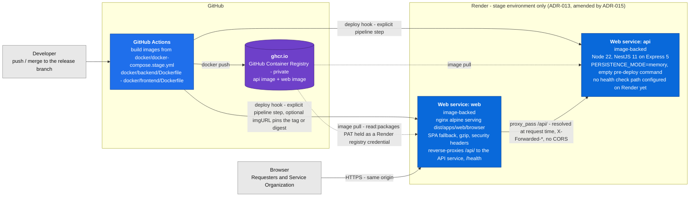
```mermaid
flowchart LR
    DEV["Developer<br/>push / merge to the release branch"]

    subgraph GH["GitHub"]
        GHA["<b>GitHub Actions</b><br/>build images from docker/docker-compose.stage.yml<br/>docker/backend/Dockerfile - docker/frontend/Dockerfile"]
        GHCR[("<b>ghcr.io</b><br/>GitHub Container Registry - private<br/>api image + web image")]
    end

    subgraph RND["Render - stage environment only (ADR-013, amended by ADR-015)"]
        WEBSVC["<b>Web service: web</b><br/>image-backed<br/>nginx alpine serving dist/apps/web/browser<br/>SPA fallback, gzip, security headers<br/>reverse-proxies /api/ to the API service, /health"]
        APISVC["<b>Web service: api</b><br/>image-backed<br/>Node 22, NestJS 11 on Express 5<br/>PERSISTENCE_MODE=memory, empty pre-deploy command<br/>no health check path configured on Render yet"]
    end

    USER["Browser<br/>Requesters and Service Organization"]

    DEV --> GHA
    GHA -->|"docker push"| GHCR
    GHA -->|"deploy hook - explicit pipeline step, optional imgURL pins the tag or digest"| WEBSVC
    GHA -->|"deploy hook - explicit pipeline step"| APISVC
    GHCR -.->|"image pull - read:packages PAT held as a Render registry credential"| WEBSVC
    GHCR -.->|"image pull"| APISVC

    USER -->|"HTTPS - same origin"| WEBSVC
    WEBSVC -->|"proxy_pass /api/ - resolved at request time, X-Forwarded-*, no CORS"| APISVC

    classDef ci fill:#1f6feb,stroke:#0b3d91,color:#ffffff
    classDef reg fill:#6e40c9,stroke:#3f1f75,color:#ffffff
    classDef svc fill:#0969da,stroke:#0b3d91,color:#ffffff
    classDef extn fill:#e8e8e8,stroke:#8b8b8b,color:#111111
    class GHA ci
    class GHCR reg
    class WEBSVC,APISVC svc
    class DEV,USER extn
```

Two Render resources, created by hand in the dashboard: two **web services**, each backed by an image rather than by a platform-side source build. **There is no Render PostgreSQL and no third resource** — ADR-015 excludes a database from the stage prototype, and the API runs with `PERSISTENCE_MODE=memory`, holding Incidents in process only; data is lost on every redeploy, restart, crash or Render's own idle spin-down (free-tier instances).

The web service serves a static bundle behind nginx and holds no server-side state, no session and no secret, but it **is** an API reverse proxy in this topology, not merely a static server: since [T-C10-79](docs/backlog/C10/tickets/T-C10-79.md) (commit `2df53a3`, ADR-015 decision 4), `docker/frontend/nginx.conf.template` adds a `location /api/` that proxies every matching request to the API service at `API_UPSTREAM_URL` — resolved at request time (not cached at nginx startup), with `Host`/`X-Forwarded-*` headers set and a 60s timeout to absorb Render's free-tier cold start. `docker/frontend/docker-entrypoint.d/10-check-api-upstream-url.sh` refuses to start the container if `API_UPSTREAM_URL` is unset or malformed. The browser therefore only ever talks to **one origin** — the web service — and the API enables no CORS.

#### 2.4.3 Deployment process, end to end

| # | Step | Executed by | Note |
|---|---|---|---|
| 1 | Build both applications — `pnpm nx build api --configuration=production`, `pnpm nx build web` | GitHub Actions | Both Dockerfiles are **runtime-only**: they expect `dist/apps/api` and `dist/apps/web/browser` to already exist in the build context. The build is a pipeline step, never a stage inside the image |
| 2 | Build the two images from `docker/docker-compose.stage.yml` | GitHub Actions | That compose file's purpose is now the **image build definition**, not a description of how stage runs — Render is |
| 3 | Tag and push both images to `ghcr.io` | GitHub Actions | Private registry; the push credential is a GitHub Actions secret |
| 4 | **Call each service's Render deploy hook** | GitHub Actions | **Mandatory, explicit step** — see the warning below |
| 5 | Pull the image and run the **pre-deploy command** | Render | **Empty on the API service today.** ADR-015 removes the database from stage, so there is nothing to migrate; `apps/api/src/data-source.ts` itself refuses to load unless `PERSISTENCE_MODE=postgres`, so `migration:run` would fail loudly if configured against `memory` mode. `migration:run` is the target value of this cell, restored once ADR-015's first reversal trigger occurs (a database is provisioned for stage) |
| 6 | Start the new version and cut traffic over | Render | `/health` on nginx (served by nginx itself). The API has **no health check path configured on Render yet** — `/health/live` and `/health/ready` are reserved in `apps/api/src/main.ts`'s prefix-exclusion list but not implemented, so Render falls back to port detection for the API service |

> **The step that cannot be skipped.** An image-backed Render service **does not redeploy automatically when a new image is pushed to its tag**. Pushing to `ghcr.io` deploys nothing. If the pipeline omits the deploy-hook call, the build goes green while Render keeps serving the previous image — a silent failure. The deploy hook is a per-service URL taken from the service's Settings page, callable by `GET` or `POST`, and it accepts an optional `imgURL` query parameter that pins the exact tag or digest to deploy; passing the tag just pushed makes a deploy name its own artifact instead of trusting a moving tag.

**Migrations are a deploy step, never a boot step.** `synchronize` is `false` in every environment, and `docker/backend/docker-entrypoint.sh` deliberately runs no migration — it only hands off to the container's `CMD`. On Render, schema evolution is *designed* as the service's **pre-deploy command**, but that command is **empty today**, because ADR-015's stage prototype has no database to evolve. Where the Postgres path is exercised today: Local (native and Docker) runs `pnpm migration:run` by hand against its own `postgres:18.6` container, and `pnpm nx e2e api-e2e` runs it automatically against its ephemeral database on every acceptance run. Restoring the pre-deploy command on stage is the mechanical part of reversing ADR-015 (§2.4.1) — no code change, only provisioning a database and flipping `PERSISTENCE_MODE` back to `postgres`. This is the rule in `CLAUDE.md` §3 ("no unconditional migration auto-run in staging/prod") given a concrete home: migrations are never a boot step, in any mode, on any environment.

#### 2.4.4 Configuration and secrets

There is **no `render.yaml` blueprint in this repository, and no infrastructure-as-code of any kind**. The Render services, their environment variables and the database connection settings are created and maintained **by hand in the Render dashboard**.

| Value | Lives in |
|---|---|
| API runtime configuration (`NODE_ENV`, `PORT`, `PERSISTENCE_MODE`) | Render dashboard, on the API service — today `PERSISTENCE_MODE=memory` and no `POSTGRES_*` (ADR-015) |
| Web → API routing (`API_UPSTREAM_URL`) | Render dashboard, on the web service — the API service's public Render URL, origin only, no path or trailing slash (ADR-015 decision 4) |
| Database credentials | **Not applicable today** — no Render PostgreSQL exists while ADR-015 is in force. Once reversed, the managed instance's own connection variables are copied onto the API service here |
| `ghcr.io` **pull** credential | Render registry credential: a GitHub username plus a personal access token scoped `read:packages` |
| `ghcr.io` **push** credential and the deploy hook URLs | GitHub Actions secrets. A deploy hook URL is itself a secret — anyone holding it can trigger a deploy |
| The **names** of the variables the API requires | `.env.example`, in this repository — the only in-repo record. The API validates them at boot through `@nestjs/config` and aborts naming any missing key |

The consequence is stated plainly because it is a real property of the system: **the stage environment is not reproducible from this repository.** There is no service definition to diff, review or restore from; if the Render account is lost, the environment is rebuilt from this section. That is an accepted trade for a portfolio-scale delivery — recorded in ADR-013 as a known limitation rather than left to be discovered — and it is reversible: adopting a `render.yaml` blueprint later is additive and touches neither application.

#### 2.4.5 What the platform choice does *not* couple

Both images are plain OCI containers built from Dockerfiles that contain nothing Render-specific, and the API reads every setting from environment variables through its validated configuration schema. Moving to another container host is a pipeline change plus a dashboard exercise: no application code, no library boundary, no Nx tag and no database schema is involved. The dependency on Render is deliberately shallow.

> **Status.** This section records a **decision** (ADR-013), a **temporary amendment** (ADR-015) and the pipeline that implements both. `.github/workflows/deploy-stage.yml` exists and runs three jobs on every push and pull request unless noted: `verify` (`pnpm prettier --check .`, `pnpm nx run-many -t lint test build`, `pnpm nx run api:build-migrations`, `pnpm verify:boundaries`); `acceptance`, gated on `verify` (`pnpm nx e2e api-e2e` against its own ephemeral PostgreSQL, then `pnpm nx e2e web-e2e`); and `deploy-stage`, gated on both — build and push both images to `ghcr.io`, then call the Render deploy hooks — **only** on a push to `main`, never a branch or a pull request. The two deploy-hook steps are themselves skipped until the `RENDER_DEPLOY_HOOK_API` / `RENDER_DEPLOY_HOOK_WEB` repository secrets exist; whether the Render services are configured, and with which environment variables, is dashboard state (ADR-013/ADR-015) and cannot be verified from this repository. **Not run anywhere in the pipeline today:** `libs/incident/infrastructure`'s `integration` target (`pnpm nx run incident-infrastructure:integration`), which round-trips `TypeOrmIncidentRepository` against a real PostgreSQL — it needs a live database `verify`'s job does not provision and is a distinct Nx target from the plain `test` that `run-many -t lint test build` executes, so `verify` never runs it and `acceptance` runs Cypress suites, not this target. It is runnable locally against the same ephemeral stack `api-e2e` uses. Pipeline implementation is owned by the CI/CD role; this section and ADR-013/ADR-015 are the specification it implements.

### **2.5. Seguridad**

> Enumera y describe las prácticas de seguridad principales que se han implementado en el proyecto, añadiendo ejemplos si procede

This section covers only the security practices that exist in the repository **today**, and each one was checked against the code, configuration or pipeline that implements it. The product's security requirements (`NFR-SEC-01` … `NFR-SEC-07` in [`docs/product/PRD.md`](docs/product/PRD.md) §8) and the target design ([`docs/product/ARCHITECTURE.md`](docs/product/ARCHITECTURE.md) §9) go much further: authentication, RBAC, requester-scoped visibility and an append-only audit trail. Those parts are **not built yet**. They are listed separately in §2.5.10 so that nobody takes them for implemented controls.

The current build is the first vertical slice: log an Incident, then read it back by reference. Its security is concentrated at the edges it actually has. That means strict input validation, error responses that reveal nothing internal, fail-fast configuration, safe persistence, a hardened static edge and a locked-down supply chain.

#### 2.5.1 At a glance

| # | Practice | Where it lives | Enforced by |
| --- | --- | --- | --- |
| 1 | Allow-list input validation; unknown fields rejected, not ignored | [`apps/api/src/main.ts`](apps/api/src/main.ts), request DTOs | Global `ValidationPipe` + `class-validator` |
| 2 | Server-side authority over Priority: the client cannot submit Impact, Urgency or Priority | [`log-incident-requester.dto.ts`](apps/api/src/app/incident/dto/log-incident-requester.dto.ts) | `forbidNonWhitelisted` + API acceptance scenario |
| 3 | Error responses that never leak messages or stack traces | [`global-exception.filter.ts`](apps/api/src/app/global-exception.filter.ts) | Global exception filter + unit spec |
| 4 | Responses expose only what the caller needs; no internal identifiers | [`incident.controller.ts`](apps/api/src/app/incident/incident.controller.ts), [`incident-detail-response.mapper.ts`](apps/api/src/app/incident/incident-detail-response.mapper.ts) | Contract types + acceptance scenario |
| 5 | Validated, fail-fast configuration; no raw `process.env` outside `config/` | [`apps/api/src/config/env.validation.ts`](apps/api/src/config/env.validation.ts) | `@nestjs/config` `validate` hook |
| 6 | Secrets kept out of Git and out of images | [`.gitignore`](.gitignore), [`.env.example`](.env.example), both Dockerfiles | Git ignore rules, runtime-only images |
| 7 | Parameterized data access, migrations-only schema, database-level invariants | `libs/incident/infrastructure`, `apps/api/src/migrations/` | TypeORM repository API, `synchronize: false`, PostgreSQL trigger |
| 8 | Use case authorizes before touching any port (deny-by-default seam) | [`log-incident.use-case.ts`](libs/incident/application/src/lib/log-incident.use-case.ts) | Unit spec |
| 9 | No HTML injection surface in the client; no CORS opened | `libs/incident/feature`, [`nginx.conf.template`](docker/frontend/nginx.conf.template) | Angular template escaping, same-origin reverse proxy |
| 10 | nginx security headers, hidden files denied, upstream validated at startup | [`docker/frontend/`](docker/frontend/) | nginx config + entrypoint check |
| 11 | Supply chain: frozen lockfile, build-script allow-list, SHA-pinned Actions, least-privilege tokens | [`pnpm-workspace.yaml`](pnpm-workspace.yaml), [`.github/workflows/deploy-stage.yml`](.github/workflows/deploy-stage.yml) | CI |
| 12 | Architecture boundaries as a security control: no backend code can reach the browser bundle | [`eslint.config.mjs`](eslint.config.mjs), [`tools/boundary-probes/verify.mjs`](tools/boundary-probes/verify.mjs) | `@nx/enforce-module-boundaries` + `pnpm verify:boundaries` |

#### 2.5.2 Input validation at the API boundary

Every request body and route parameter passes through one global `ValidationPipe` before any controller code runs. The pipe works as an **allow-list**. A property that the DTO does not declare is not silently dropped: the whole request is rejected with `400 VALIDATION_FAILED`, so an unexpected field can never leak into a use case.

```ts
// apps/api/src/main.ts
app.useGlobalPipes(
  new ValidationPipe({
    whitelist: true,
    forbidNonWhitelisted: true,
    transform: true,
    stopAtFirstError: true,
    exceptionFactory: (errors) =>
      new RequestValidationException(flattenValidationErrors(errors)),
  }),
);
```

- **Typed, bounded DTOs.** [`LogIncidentRequesterDto`](apps/api/src/app/incident/dto/log-incident-requester.dto.ts) requires `shortDescription` (string, not blank, at most 255 characters, matching the `varchar(255)` column) and `description` (string, not blank). `affectedServiceId` is optional and must be a UUID. A custom `@IsNotBlank()` validator rejects whitespace-only values that `IsNotEmpty` would let through.
- **Route parameters are validated too.** `GET /api/incidents/:reference` accepts only `^[A-Z]{3}[0-9]{7}$` ([`get-incident-by-reference-params.dto.ts`](apps/api/src/app/incident/dto/get-incident-by-reference-params.dto.ts)). A malformed reference is rejected before it reaches the use case or the database.
- **Server-side authority over business-critical fields (NFR-SEC-02).** The requester intake DTO does not declare `impact`, `urgency`, `priority` or `competitionAffectsInProgress`. The API therefore **rejects** a request that tries to set any of them, and creates nothing. The API acceptance suite proves this over real HTTP for all four fields. After each rejected request it checks that the reference sequence did not advance:

  ```gherkin
  # apps/api-e2e/src/features/incident-intake.feature
  Scenario Outline: The server rejects a priority-bearing field the client is never offered, and creates nothing
    ...
    Then the response is a validation failure naming "<field>"
    And no Incident was created since the baseline
  ```

- **Untrusted headers are shape-checked.** The inbound `X-Correlation-Id` header is echoed back and written into logs only if it is a well-formed UUID. Any other value is replaced with a freshly generated `randomUUID()` ([`correlation-id.util.ts`](apps/api/src/app/correlation-id.util.ts)). A caller therefore cannot inject arbitrary text into logs or responses through that header.
- **The client validates too, but only for usability.** The Reactive Form in `libs/incident/feature` applies the same required, not-blank and max-length rules. It is not the security boundary: the server re-validates everything.

#### 2.5.3 Error handling that does not leak internals

A single global `@Catch()` filter ([`global-exception.filter.ts`](apps/api/src/app/global-exception.filter.ts)) turns **every** exception into the contract's `ErrorEnvelope`: a machine-readable code from a closed set, plus `{ field, rule }` details for validation failures. Nothing else is returned. For anything unexpected, the message and the stack go only to the server log, keyed by the correlation id. The caller receives a generic code:

```ts
// apps/api/src/app/global-exception.filter.ts
// Anything else is unexpected: never reflect the underlying error back
// to the caller (no `message`, no `stack`) — only `Logger` and the
// correlation id see it.
this.logger.error(
  `Unhandled error (correlationId: ${correlationId})`,
  exception instanceof Error ? exception.stack : String(exception),
);
return {
  status: HttpStatus.INTERNAL_SERVER_ERROR,
  body: { error: { code: ErrorCode.INTERNAL_ERROR } },
};
```

- The error vocabulary is fixed in [`libs/shared/contracts/src/lib/error-code.ts`](libs/shared/contracts/src/lib/error-code.ts) (`UNAUTHENTICATED`, `FORBIDDEN`, `VALIDATION_FAILED`, `NOT_FOUND`, `INTERNAL_ERROR`). The `rule` in a validation detail is the constraint key (`maxLength`, `isUuid`, `whitelistValidation`), never a free-text message.
- Database errors, including constraint violations and the reference-immutability trigger, fall into the generic `500 INTERNAL_ERROR` branch. SQL text, table names and driver messages never reach the client.
- A unit spec asserts this. Its test is named *"maps any other error to 500 INTERNAL_ERROR without leaking a stack or the internal message"*, and it checks that the serialized response does not contain `stack`.
- On the client side, [`incident-api-error.ts`](libs/incident/data-access/src/lib/incident-api-error.ts) accepts only codes that belong to the contract enum. Each code maps to a fixed, human-written message; a server-supplied string is never rendered. The correlation id is shown to the user as a support code, which enables tracing without exposing internals.

#### 2.5.4 Minimal data exposure

- `POST /api/incidents` returns **only** the human-facing reference (`{ reference: "INC0000001" }`). The internal UUID primary key is never exposed.
- `GET /api/incidents/:reference` builds its response field by field from the aggregate snapshot through an explicit mapper ([`incident-detail-response.mapper.ts`](apps/api/src/app/incident/incident-detail-response.mapper.ts)). It is never a serialized entity, so a column added to the table cannot leak by accident. An acceptance scenario asserts that the response has no `id`, no `reporterId` and no `loggedBy`.
- A reference with the right shape but a foreign record-type prefix (e.g. `SRQ0000001`) returns the same `404 NOT_FOUND` as any other unknown reference, so the response does not reveal which record types exist.

#### 2.5.5 Configuration and secrets

- **Fail-fast, validated configuration.** [`env.validation.ts`](apps/api/src/config/env.validation.ts) is the *only* declaration of what the API reads from its environment. Every key is mandatory and has **no in-code default**, so a missing or malformed value aborts the boot and the error names the variable. A default would let the process start with a plausible but wrong value. `NODE_ENV` and `PERSISTENCE_MODE` are enums, so a typo cannot silently select a "non-production" branch. Reading `process.env` is limited to `apps/api/src/config/`; everything else receives typed values through `ConfigService`.
- **A mechanical safety rail.** `PERSISTENCE_MODE=memory` combined with `NODE_ENV=production` fails validation. A volatile store can never run as production, and this is enforced by the validator rather than by convention. The TypeORM CLI entry point ([`data-source.ts`](apps/api/src/data-source.ts)) also refuses to run unless `PERSISTENCE_MODE=postgres`.
- **Secrets never enter Git.** `.env` and `.env.*` are git-ignored (except `.env.example`). The committed [`.env.example`](.env.example) contains only the variable *names* and the local development values that match the throwaway Docker PostgreSQL.
- **Secrets never enter images.** Both Dockerfiles are runtime-only. They copy the built output (`dist/apps/api`, `dist/apps/web/browser`) and their own configuration, never the source tree or a `.env` file. Stage configuration lives in the Render dashboard, and the CI credentials live in GitHub Actions secrets (§2.4.4).

#### 2.5.6 Persistence safety

- **Parameterized access only.** The TypeORM repository reads through the repository API (`findOne({ where: { reference: reference.value } })`), which binds values as parameters. It contains only two raw queries, and both are constant strings with no interpolated input: `SELECT uuidv7() AS id` and `SELECT nextval('incident.incident_reference_seq')`. No SQL is ever built from request data.
- **Schema changes only through migrations.** `synchronize: false` and `migrationsRun: false` are hard-coded once in [`database-connection.ts`](apps/api/src/config/database-connection.ts), not left for each caller to get right. Migrations are reversible and run as a separate deploy step, never at boot ([`docker/backend/docker-entrypoint.sh`](docker/backend/docker-entrypoint.sh) runs none).
- **Invariants enforced by the database as well as the domain.** The ticket reference is `UNIQUE`. Once assigned it cannot be changed: a `BEFORE UPDATE` trigger raises an exception ([`…-CreateIncidentReferenceSequenceAndImmutabilityTrigger.ts`](apps/api/src/migrations/1790383684993-CreateIncidentReferenceSequenceAndImmutabilityTrigger.ts)). Even code that bypasses the aggregate cannot rewrite a record's identity.
- **Server-generated identifiers.** Primary keys are UUID v7, generated by PostgreSQL `uuidv7()` or, in memory mode, from `node:crypto` `randomBytes`. Clients never supply identifiers.
- **A bound on the unauthenticated in-memory store.** The stage prototype runs with `PERSISTENCE_MODE=memory` and no authentication (ADR-015). The in-memory repository therefore enforces a **10 000-Incident capacity ceiling** and returns a typed error beyond it, so an anonymous caller cannot exhaust the process memory ([`in-memory-incident.repository.ts`](libs/incident/infrastructure/src/lib/in-memory/in-memory-incident.repository.ts)).

#### 2.5.7 Authorization seam and test-only surfaces

- **The use case authorizes first.** `LogIncidentUseCase` calls `actor.canLogIncidentAsRequester()` *before* touching any port. A denial throws `IncidentLogAuthorizationError`, which the filter maps to `403 FORBIDDEN`, and nothing else happens: no reference is used up, nothing is persisted, no event is published. A unit spec covers this (*"Authorization — deny-by-default"*). The check lives in the application layer, not in a controller decorator, so no other inbound adapter can skip it.
- **But the actor is fixed today.** Authentication does not exist yet. `FixedRequesterActorResolver` always returns the same bootstrap Requester, so every caller is that Requester in practice. The seam is real and tested, but it protects nothing until the per-request resolver described in §2.5.10 replaces this class. The rebinding is a single line in `IncidentModule`.
- **Test-only routes are not in production builds.** The event-dispatch test controller used by the API acceptance suite is imported into `AppModule` only when `NODE_ENV=test`. In any other environment its route returns `404`, and a Jest spec checks this gating.

#### 2.5.8 Web client and edge

- **No HTML injection surface.** The web client renders all data through Angular template interpolation, which escapes it automatically. There is no `[innerHTML]`, no `bypassSecurityTrust*` and no direct DOM write anywhere in `apps/web` or `libs/`. The client holds no secret and no authorization decision.
- **Same origin, no CORS.** The API never calls `enableCors()`. In stage, nginx reverse-proxies `/api/` to the API service (ADR-015), so the browser talks to a single origin. In development, `apps/web/proxy.conf.json` does the same job.
- **nginx hardening** ([`nginx.conf.template`](docker/frontend/nginx.conf.template), [`security-headers.conf`](docker/frontend/security-headers.conf)):

  ```nginx
  # security-headers.conf — a location whose own `add_header` REPLACES
  # (does not merge with) what it inherits from `server`, so this file
  # is `include`d both at `server` level and again inside every
  # location that declares its own `add_header`, keeping the headers
  # on every response route instead of only the ones with none of
  # their own.
  add_header X-Frame-Options "SAMEORIGIN" always;
  add_header X-Content-Type-Options "nosniff" always;
  add_header X-XSS-Protection "1; mode=block" always;

  location ~ /\. { deny all; access_log off; log_not_found off; }
  ```

  In addition, `index.html` is served with `Cache-Control: no-store`, and envsubst may substitute **only** `API_UPSTREAM_URL` and `NGINX_LOCAL_RESOLVERS`. A startup script ([`10-check-api-upstream-url.sh`](docker/frontend/docker-entrypoint.d/10-check-api-upstream-url.sh)) stops the container before nginx starts if the upstream URL is missing, is not `http(s)://`, or carries a path. Such a URL would otherwise send every proxied request to the wrong route without any error.

#### 2.5.9 Supply chain, CI/CD and architecture enforcement

- **One package manager, reproducible installs.** pnpm only, pinned through `packageManager: pnpm@10.18.3`. CI runs `pnpm install --frozen-lockfile` against the committed `pnpm-lock.yaml`. Following pnpm 10's default, dependency install scripts are **blocked** unless the package appears in the `onlyBuiltDependencies` allow-list, which contains only `cypress` and `esbuild`.
- **Hardened workflow** ([`deploy-stage.yml`](.github/workflows/deploy-stage.yml)). Every third-party Action is pinned to a **full commit SHA**, not to a movable tag. The default token permission is `contents: read`, and only the deploy job adds `packages: write`. Images are pushed with the built-in `GITHUB_TOKEN` instead of a long-lived personal token. Render deploy-hook URLs are stored as repository secrets. Deployment runs **only** on a push to `main`, after the `verify` and `acceptance` jobs pass. Images are tagged with the commit SHA, and the deploy hook is called with that exact image.
- **Lean runtime images.** The API image installs only the production dependencies of the generated `package.json` (`pnpm install --prod`), with no devDependencies and no frontend packages. The PostgreSQL image is pinned to a patch release (`postgres:18.6`).
- **Architecture as a security control.** `@nx/enforce-module-boundaries` makes it a lint error for any `platform:frontend` project to import `platform:backend` code. Server-side logic, configuration or adapters therefore cannot end up in the browser bundle. It is also a lint error for `type:domain` or `type:application` code to depend on infrastructure. `pnpm verify:boundaries` runs in CI and injects deliberate violations to prove the rule still fails the build (§2.1).
- **Known gaps in what exists.** These are listed so that the practices above are not over-read:

  | Gap | Detail |
  | --- | --- |
  | No HTTP security middleware on the API | No `helmet`, no CSP, no HSTS and no rate limiting in `apps/api`. TLS is terminated by Render's edge. |
  | No CSP header on nginx responses | `X-Frame-Options`, `X-Content-Type-Options` and `X-XSS-Protection` are applied on every route via a shared [`security-headers.conf`](docker/frontend/security-headers.conf) include (`server` level and every location that also sets its own `add_header`), so a location no longer drops the inherited headers. No `Content-Security-Policy` header is set. |
  | Containers run as root | Neither Dockerfile declares a non-root `USER`. The base images `node:22-alpine` and `nginx:alpine` are floating tags, not digests. |
  | Reads are unscoped | `GET /api/incidents/:reference` has no authorization context, and references are sequential (`INC0000001`, `INC0000002`, …), so any caller can enumerate every Incident. NFR-SEC-03 is **not** met yet. This was a documented decision of the slice, not an oversight. |
  | `description` has no explicit length limit | Its size is bounded only by the JSON body parser's default limit. |

#### 2.5.10 Designed, not yet implemented

These controls are specified in the PRD and in `ARCHITECTURE.md` §2.2/§9, but **no code for them exists** in the repository. The corresponding packages (`@nestjs/passport`, `passport-jwt`, `@nestjs/jwt`, `bcrypt`, `@nestjs/swagger`, `nestjs-pino`, `@nestjs/terminus`, `nestjs-i18n`) are not installed.

| Control | Design | Requirement |
| --- | --- | --- |
| Authentication | Passport JWT strategy and guards in `apps/api`; `IdentityProviderPort` with a local-credential adapter (bcrypt) first and SSO later; no anonymous submission | NFR-SEC-01, FR-IAM-04, FR-OMN-04 |
| Per-request authorization / RBAC | A real `Actor` built on every request, with permissions resolved on the server (never trusted from token claims). It replaces `FixedRequesterActorResolver` (`T-C10-39`), and each use case checks it as a domain predicate | NFR-SEC-02, FR-IAM-03 |
| Requester-scoped visibility and internal work notes | Requesters see only their own tickets; work notes never reach requesters through any channel | NFR-SEC-03, NFR-SEC-04 |
| Session protection | Inactivity timeout, bounded session lifetime, re-authentication before privileged admin actions, sign-out | FR-IAM-06, FR-IAM-08 |
| Privileged operations and audit | Admin operations restricted to System Administrator; append-only `audit` context fed by domain events, whose port has no update or delete method at all | NFR-SEC-06, FR-AUD-01…06 |
| Personal-data minimization and lawful erasure | Pseudonymization that keeps the audit trail intact | NFR-SEC-07, FR-IAM-09 |
| License gating | `@LicenseFeature()` decorator + guard | — |
| Client-side auth plumbing | `jwtInterceptor`, `authGuard` / `roleGuard` (for usability only, not the security boundary); `provideHttpClient(withInterceptors([]))` is still empty | — |
| Operational hardening | Swagger at `/api/docs` in development only, structured `nestjs-pino` logs with correlation, `/health/live` and `/health/ready` probes | NFR-CFG-03 |

> **Status:** the practices in §2.5.1–§2.5.9 are implemented and, where the text says so, covered by unit, integration or Cypress + Cucumber acceptance tests that run in the `verify` and `acceptance` CI jobs. The stage prototype is **deliberately unauthenticated** under ADR-015: a fixed Requester actor, volatile in-memory storage and a public URL. It must not hold real or personal data until at least the authentication and per-request authorization rows above are delivered. The `Unhandled error` log line in the exception filter goes through Nest's built-in `Logger`, not yet through `nestjs-pino`.

### **2.6. Tests**

> Describe brevemente algunos de los tests realizados

#### 2.6.1 Test pyramid and tooling

The suite has four tiers, each exercising a different boundary, plus one architecture-level check that is a test in its own right. Commands are already listed in [§1.4.7 "Run the tests"](#147-run-the-tests) and [§2.3.6 "Useful commands"](#236-useful-commands) — this section does not repeat them, only the tests themselves.

| Tier | Tool | What it proves | Real database? |
|---|---|---|---|
| **Unit** | Jest 29.7 + `ts-jest` / `jest-preset-angular`, co-located `*.spec.ts` per project | One class/function/component in isolation — ports and collaborators are hand-written fakes or mocks | No |
| **Integration** | Jest, `*.integration-spec.ts`, only under `incident-infrastructure`'s `integration` Nx target | A repository against **real PostgreSQL 18** — that a guarantee actually lives in the schema (sequence, trigger, constraint), not in application code | Yes — ephemeral, `docker/docker-compose.e2e.yml`, host port 5499 |
| **Acceptance / API-E2E** | Cypress 15.20 + `@badeball/cypress-cucumber-preprocessor`, `apps/api-e2e/src/features/*.feature` | A real HTTP request against the built API, no mocked repository or use case anywhere in the run | Yes — its own ephemeral instance, also port 5499 |
| **Acceptance / E2E** | Cypress + Cucumber, `apps/web-e2e/src/features/*.feature` | The Angular shell in a real browser (Electron, headless); the API is stubbed with `cy.intercept` | No |
| **Architecture** | `pnpm verify:boundaries` (`tools/boundary-probes/verify.mjs`) | That `@nx/enforce-module-boundaries` still rejects an illegal cross-layer/cross-context import — not only that legal code lints clean | No |

Integration and both acceptance targets share the same ephemeral PostgreSQL container and host port, so they cannot run concurrently — documented in [§1.4.9 Troubleshooting](#149-troubleshooting). CI (`.github/workflows/deploy-stage.yml`) wires `lint`/`test`/`build` and `verify:boundaries` into the `verify` job and both Cypress suites into `acceptance`; the `integration` target is not yet part of either job, so today it is a developer-run check, not a CI gate — a gap reported here rather than fixed as a side effect of this section.

#### 2.6.2 Unit tests — a representative selection

**Domain** — [`libs/incident/domain/src/lib/incident-reference.policy.spec.ts`](libs/incident/domain/src/lib/incident-reference.policy.spec.ts) pins the shape of an Incident reference without touching the database that will eventually allocate one:

```ts
it('matches the documented shape exactly: three letters, seven digits, no separator', () => {
  const reference = IncidentReferencePolicy.format(42);
  expect(reference.value).toMatch(/^[A-Z]{3}[0-9]{7}$/);
  expect(reference.value).toHaveLength(10);
});
```

**Application** — [`libs/incident/application/src/lib/log-incident.use-case.spec.ts`](libs/incident/application/src/lib/log-incident.use-case.spec.ts) drives `LogIncidentUseCase` against fakes for every port (`IncidentRepositoryPort`, `EventPublisherPort`, `ClockPort`, a `StubActor`) and a `CallLog` helper that records call order, so the sequencing between "check authorization", "allocate identity/reference" and "publish the domain event" is asserted directly rather than inferred from the outcome.

**Contracts** — [`libs/shared/contracts/src/lib/error-code.spec.ts`](libs/shared/contracts/src/lib/error-code.spec.ts) guards the shared error vocabulary both applications compile against:

```
ErrorCode
  ✓ is seeded with exactly the four codes T-C10-11 names plus T-C1-08's INTERNAL_ERROR, no more
  ✓ is a value, not only a type — every key maps to its own name
```

**API** — [`apps/api/src/app/incident/incident.controller.spec.ts`](apps/api/src/app/incident/incident.controller.spec.ts) is a thin-controller test in the literal sense: it asserts `IncidentController` does no business logic, only wiring — `hardcodes originChannel to "portal" regardless of the DTO`, `mints a correlationId when the header is absent, and echoes it on the response header`, `maps the use-case result to only the reference the requester may see (AC3) — no internal id`.

**Web** — [`libs/incident/feature/src/lib/home-page/home-page.component.spec.ts`](libs/incident/feature/src/lib/home-page/home-page.component.spec.ts) renders `HomePageComponent` through Angular's `TestBed` and checks accessibility-relevant structure, not implementation detail:

```ts
it('renders a single page heading with the exact heading text', () => {
  const h1s = headings();
  expect(h1s.length).toBe(1);
  expect(h1s[0].textContent?.trim()).toBe(INCIDENT_MESSAGES.home.heading);
});
```

#### 2.6.3 Integration tests against real PostgreSQL

[`libs/incident/infrastructure/src/lib/incident-reference-sequence.integration-spec.ts`](libs/incident/infrastructure/src/lib/incident-reference-sequence.integration-spec.ts) is the clearest example of what this tier is for: it proves a guarantee that has **no equivalent application code to test** — there is no uniqueness check to mock, because uniqueness is enforced entirely by `incident.incident_reference_seq`, `uq_incident_reference` and the `tg_incident_ticket_reference_immutable` trigger the migration creates. Its own header states the point directly:

> "There is no application-level uniqueness check in this codebase to 'remove' — every test below already runs with nothing but the database standing between two concurrent allocations and a collision, so a passing suite here **is** the proof the guarantee is the database's, not the application's."

Its `AC1 — concurrency` scenario fires 20 `save()` calls through `Promise.all` over separate pool connections and asserts no two Incidents ever received the same reference; `AC2` opens a raw SQL `UPDATE` against the `postgres` role and confirms the immutability trigger rejects it; `AC3` deletes a row and rolls back a transaction to confirm a once-allocated `nextval()` is never reissued. [`incident-typeorm.integration-spec.ts`](libs/incident/infrastructure/src/lib/incident-typeorm.integration-spec.ts) complements it with a plain round-trip: `AC1 — every field round-trips unchanged through save() then findById()`, and a check that `nextIdentity()` reads a real, never-repeating UUID v7 from PostgreSQL 18's core `uuidv7()` function rather than an application-side v4 generator.

#### 2.6.4 Acceptance tests (Cypress + Cucumber)

**API-E2E** — [`apps/api-e2e/src/features/incident-intake.feature`](apps/api-e2e/src/features/incident-intake.feature) drives the built API over real HTTP, against its own ephemeral, migrated PostgreSQL, with nothing mocked:

```gherkin
Feature: Requester intake of an Incident (T-C1-08, US-C1-01, FR-INC-01)

  Scenario: A valid request creates the Incident and returns only its reference
    Given a fresh Incident intake request body
    When the requester posts the Incident intake request
    Then the response is 201 with a reference shaped like "INC" plus 7 digits
    And the response body carries no field the requester may not see
```

Its `Scenario Outline` for rejected fields (`impact`, `urgency`, `priority`, `competitionAffectsInProgress`) proves something subtler than a 400 response: because there is deliberately no read-by-reference route inside this ticket's scope at the time it was written, "no Incident was created" is proven by logging a baseline Incident, attempting the rejected request, then logging another valid one and asserting its reference is exactly the baseline's next value — the reference sequence only advances on a real `nextReference()` call, so a gap would mean something silently got through. [`incident-detail.feature`](apps/api-e2e/src/features/incident-detail.feature) covers the read side the same way: a malformed reference is rejected as `400`, a well-formed but unknown one as `404`, never conflated.

**Web E2E** — [`apps/web-e2e/src/features/incident-intake.feature`](apps/web-e2e/src/features/incident-intake.feature) runs the Angular shell in a real (headless) browser on a 360px, keyboard-only viewport, with the API responses supplied by `cy.intercept`:

```gherkin
Scenario: A keyboard-only requester completes and submits the form, then sees the persisted report
  Given the Incident intake API accepts the next submission and assigns reference "INC0000001"
  And the Incident detail API returns a persisted report for reference "INC0000001"
  When the requester fills in the form using only the keyboard and submits it by pressing Enter
  Then the Incident intake request is sent with the completed data
  And the browser lands on the detail page for reference "INC0000001"
  And the detail page shows the persisted report, not the values just typed
```

Two of its scenarios guard regressions that have nothing to do with the happy path: one asserts a server validation failure is exposed as an accessible `alert` linked to the offending field, another that navigating in-app from one Incident's detail page directly to another's never flashes the first report — Angular's router reuses the component instance across a same-route-config navigation, so a naive implementation would leak stale state. [`home.feature`](apps/web-e2e/src/features/home.feature) covers the landing page the same slice targets: exactly one heading, exactly one link to the intake form, reachable and activatable by keyboard alone.

#### 2.6.5 Architecture test

`pnpm verify:boundaries` is a test, not a lint pass: it scaffolds ten throwaway Nx projects under `libs/__boundary-probe/`, each carrying exactly one dependency edge, and asserts the outcome `nx lint` gives each one against `ARCHITECTURE.md` §5.3 — three edges that must be legal (domain → shared kernel, the composition root crossing contexts, a feature using the shared design system) and seven that must be rejected (domain → infrastructure, frontend → backend, context → context, a project with the wrong tag count, infrastructure → the composition root, `type:e2e` reaching past contracts/util, `util` reaching past itself). A green `nx lint` over the real codebase only proves the current graph is legal; this is the only check in the repository that proves an illegal one is still caught.

#### 2.6.6 Coverage as run today

All counts below are from an actual local run (`pnpm nx run-many -t test`, `pnpm nx e2e api-e2e`, `pnpm nx e2e web-e2e`, `pnpm nx run incident-infrastructure:integration`, `pnpm verify:boundaries`) against Node 22.20.0 / Nx 21.6 / Docker, on 2026-09-29 — not carried over from an earlier section. Every suite passed.

| Project / suite | Suites | Tests | Result |
|---|---|---|---|
| `shared-util` | 3 | 19 | ✅ pass |
| `shared-domain` | 8 | 86 | ✅ pass |
| `shared-contracts` | 1 | 2 | ✅ pass |
| `incident-domain` | 6 | 71 | ✅ pass |
| `incident-application` | 2 | 16 | ✅ pass |
| `incident-infrastructure` (unit) | 5 | 47 | ✅ pass |
| `incident-data-access` | 2 | 21 | ✅ pass |
| `incident-feature` | 4 | 38 | ✅ pass |
| `incident-ui` | 0 | 0 | ✅ pass (no tests yet — empty `type:ui` lib) |
| `api` | 17 | 99 | ✅ pass |
| `web` | 0 | 0 | ✅ pass (no tests yet — application shell only) |
| **Unit total** | **48** | **399** | ✅ **all pass** |
| `incident-infrastructure` (integration, real PostgreSQL) | 2 | 13 | ✅ pass |
| `api-e2e` (Cypress + Cucumber, 4 features) | — | 19 scenarios | ✅ pass |
| `web-e2e` (Cypress + Cucumber, 3 features) | — | 11 scenarios | ✅ pass |
| `verify:boundaries` (10 probes) | — | 10 | ✅ pass |

`incident-ui` and `web` pass through Jest's `passWithNoTests` / "No tests found" — a green result there proves the runner is wired correctly, nothing about coverage; both are still target structure ([§2.3.6](#236-useful-commands)). Every other row is a real, currently-passing suite.

---

## 3. Modelo de Datos

### **3.1. Diagrama del modelo de datos:**

> Recomendamos usar mermaid para el modelo de datos, y utilizar todos los parámetros que permite la sintaxis para dar el máximo detalle, por ejemplo las claves primarias y foráneas.

This section models the **relational schema persisted in PostgreSQL 18 through TypeORM 1.1** — the persistence entities, not the domain aggregates. The full document, with an attribute-level table for every entity, the constraint catalogue and the modelling decisions taken where the PRD is silent, is [`docs/product/DATA-MODEL.md`](docs/product/DATA-MODEL.md).

#### 3.1.1 What is modelled, and what a table is not

The scope is the **phase-0 and phase-1 contexts that actually persist state** (PRD §14.2/§14.3), one PostgreSQL schema per bounded context:

| Context | Schema | Phase | Persists |
| --- | --- | --- | --- |
| `identity-access` | `iam` | 0 | Users, roles, permissions, resolver groups, competition-scoped visibility grants |
| `audit` | `audit` | 0 | Append-only activity history for every record type |
| `service-catalog` | `catalog` | 1 | Services, Service Offerings, request forms, eligibility rules, categorization taxonomy |
| `incident` | `incident` | 1 | Incident tickets, notes, links, escalations, priority matrix, lifecycle configuration |
| `service-request` | `service_request` | 1 | Service Requests, form answers, fulfillment tasks |
| `sla` | `sla` | 1 | Policies, support schedules, timer instances, warnings, breaches, escalation rules |
| `knowledge` | `knowledge` | 1 | Articles, versions, translations, feedback, ticket links |
| `approval` | `approval` | 1 | Workflows, requests, tasks, immutable decisions |
| `notification` | `notification` | 1 | Templates, rules, dispatch records, stakeholder lists |
| `reporting` | `reporting` | 1 | Denormalized read models only — never a system of record |

`problem`, `change`, `release` and `asset-config` are **phase 2** and are deliberately not modelled (§3.1.13).

**A table is not an aggregate (ADR-005).** `type:domain` holds framework-free aggregates (`Incident`, `Priority`, `CompetitionImpactFlag`) and `type:infrastructure` holds TypeORM `*.entity.ts` classes joined to them by an explicit mapper. Two consequences shape every diagram below:

1. **One aggregate spans several tables.** `incident_ticket` + `incident_work_note` + `incident_attachment` + `incident_assignment_history` + `incident_state_transition` + `incident_link` persist **one** `Incident`, loaded and saved as a unit in a single transaction.
2. **Value objects are stored inline as columns, never as their own table** — they have no identity and no independent lifecycle, so a surrogate key would be a modelling lie:

| Value object | Columns | Table |
| --- | --- | --- |
| `TicketReference` | `reference` + unique index | `incident_ticket`, `sr_request` |
| `Priority` | `priority`, `priority_overridden`, `priority_override_justification`, `priority_matrix_id` | `incident_ticket` |
| `CompetitionImpactFlag` | `competition_affects`, `competition_justification`, `competition_flag_set_by`, `competition_flag_set_at` | `incident_ticket`, `sr_request` |
| `CompetitionSubject` | `competition_subject_type`, `competition_subject_external_id`, `competition_subject_label` | `incident_ticket`, `sr_request` |
| `OriginChannel` / `NoteVisibility` | single PG enum column | tickets / notes |
| `ResolverAssignment` | `assigned_group_id`, `assigned_user_id`, `assigned_at` | tickets |
| `SlaCommitment` | `started_at`, `target_at` | `sla_instance` |

#### 3.1.2 Conventions: keys, time, enums, deletes and schema evolution

| Concern | Decision |
| --- | --- |
| **Primary keys** | `uuid` on every table. **UUID v7** (time-ordered), generated by the **repository port** (`nextIdentity()`, alongside `nextReference()`), so an aggregate is fully constructed and valid in pure domain code before any I/O. `DEFAULT uuidv7()` exists only as a migration/fixture safety net, and is v7 for the same reason the port is (ADR-012, `DATA-MODEL.md` §3.1.1). Composite keys only on pure join tables. Business keys (`reference`, `code`, `email`) are **unique constraints**, never the PK. |
| **Reference numbers** | `INC0000123` / `SRQ0000045`, from a dedicated PostgreSQL `SEQUENCE` per record type read by the repository adapter. Sequences do not roll back with a failed transaction — gaps are acceptable, **reuse is not** (FR-INC-02, NFR-DAT-01). |
| **Auditing columns** | Every table: `created_at`, `updated_at`, `created_by`, `updated_by`; aggregate roots also carry `version` for optimistic locking (two agents must not silently overwrite a triage). `updated_at` is **absent** on append-only tables — the missing column _is_ the immutability statement. These columns are a convenience, not the audit trail; `audit.audit_entry` is the only authority for "who changed what". |
| **Time** | Every instant is `timestamptz` in **UTC** (NFR-I18N-03), obtained from `ClockPort` (ADR-009) — never `now()` in a trigger. `date`/`time` appear only in `sla_schedule_window` and `sla_holiday`, which are intentionally wall-clock values interpreted in the support schedule's own `time_zone`. |
| **Enums vs lookup tables** | **Native PG enum** when the value set is closed and the domain branches on it (`origin_channel`, `note_visibility`, `impact`, `urgency`, `priority`, `link_type`, `sla_instance_state`, `approval_decision`, `actor_type`). **Lookup table** (`id`, `code` UK, `active`, + `*_translation`) when an administrator may change it without a release (NFR-CFG-01) or it must be translatable without changing its stable identifier (NFR-I18N-05): categories, resolution codes, roles, workflow states, notification templates. Records store the lookup **id**, never the label, so renaming a category changes one row and zero historical facts (NFR-DAT-03). |
| **Configurable lifecycles** | `incident_ticket.state_id` points at `incident_workflow_state` (a lookup), because FR-WFL-01 requires a configurable lifecycle. A denormalized, non-configurable `state_category` enum (`open`, `pending`, `resolved`, `closed`, `cancelled`) sits beside it so queries and KPIs never depend on customer configuration. Configuration is **versioned, never edited in place**: a ticket keeps the matrix and workflow version it was created under (NFR-CFG-02). |
| **Soft delete** | **None. No `deleted_at` on any table.** It would create two truths about existence and is incompatible with an append-only audit trail (K4). "Removal" is a lifecycle state: `publication_status = 'retired'`, `status = 'disabled'`, `revoked_at IS NOT NULL`, `active = false`. Retired reference data stays joinable by history forever. |
| **Retention & erasure** | Retention (NFR-DAT-02) is archival; `audit_entry` is **range-partitioned monthly** so it is a `DETACH PARTITION`, not a mass `DELETE`. Lawful erasure (NFR-SEC-07, K9) is **pseudonymization**: PII columns of `iam_user` are overwritten and `pseudonymized_at` set. Everything else references the user by `uuid` only, so the audit trail stays structurally intact while the personal data is gone. |
| **Schema evolution** | **Migrations only.** `synchronize` is `false` in every environment; the schema changes exclusively through reviewed TypeORM migrations against `apps/api/src/data-source.ts`, never auto-run at startup in any environment. No business rule ever lives in a trigger or stored procedure; `CHECK` constraints encode only structural invariants that must hold regardless of application version. |

#### 3.1.3 Hard foreign keys vs soft references — and how to read the diagrams

| Notation | Meaning |
| --- | --- |
| `A \|\|--o{ B` **solid** | A real `FOREIGN KEY`, always **within one schema / one bounded context**; `ON DELETE CASCADE` only from an aggregate root to a part it exclusively owns |
| `A \|\|..o{ B` **dashed** | A **logical/soft reference**: an indexed `uuid` column with **no** database constraint, crossing a context boundary or polymorphic |

Cross-context references are deliberately **not** foreign keys, for three reasons:

1. **It is the database expression of ADR-003.** `scope:incident` may not import `scope:sla`. A real FK from `incident_ticket` into `sla.sla_instance` would couple the two contexts in the exact place the architecture works hardest to keep them separate, and the "extractable later" property of ADR-004 would be fiction.
2. **Most of them are polymorphic and cannot be constrained at all.** `sla_instance`, `apr_request`, `ntf_dispatch`, `audit_entry` and `kb_article_link` point at _a record of some type_ via `(record_type, record_id)`. One nullable FK column per target type would add a column for every context that ever exists.
3. **The target may not be in this database.** `competition_subject_external_id` points into **SCMS**, a separate system consumed read-only behind an anti-corruption layer with free-text fallback (PRD D2, R10). A FK is impossible by definition — and that is what keeps _"a competition entity is the affected subject of a ticket, never a ticket"_ structurally true.

**The cost, stated honestly:** cross-context referential integrity is not guaranteed by PostgreSQL. Mitigations: nothing is ever hard-deleted, so the dominant cause of dangling references does not occur; every cross-context write happens in the same transaction as its aggregate write; a scheduled integrity job reports orphaned soft references; acceptance tests assert audit and SLA completeness for the MVP flows.

#### 3.1.4 Overview — context-level model

Aggregate-root tables only. Note what it makes visible: **every edge leaving a ticket context is dashed** — the module-boundary rule of §2.1 rendered in the database.

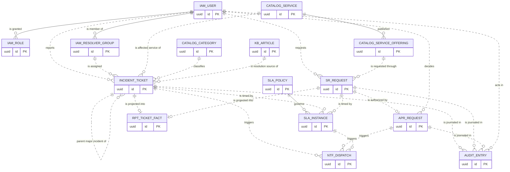
```mermaid
erDiagram
    IAM_USER {
        uuid id PK
    }
    IAM_ROLE {
        uuid id PK
    }
    IAM_RESOLVER_GROUP {
        uuid id PK
    }
    CATALOG_SERVICE {
        uuid id PK
    }
    CATALOG_SERVICE_OFFERING {
        uuid id PK
    }
    CATALOG_CATEGORY {
        uuid id PK
    }
    INCIDENT_TICKET {
        uuid id PK
    }
    SR_REQUEST {
        uuid id PK
    }
    SLA_POLICY {
        uuid id PK
    }
    SLA_INSTANCE {
        uuid id PK
    }
    KB_ARTICLE {
        uuid id PK
    }
    APR_REQUEST {
        uuid id PK
    }
    NTF_DISPATCH {
        uuid id PK
    }
    AUDIT_ENTRY {
        uuid id PK
    }
    RPT_TICKET_FACT {
        uuid id PK
    }

    IAM_USER ||--o{ IAM_ROLE : "is granted"
    IAM_USER ||--o{ IAM_RESOLVER_GROUP : "is member of"
    CATALOG_SERVICE ||--o{ CATALOG_SERVICE_OFFERING : "publishes"

    IAM_USER ||..o{ INCIDENT_TICKET : "reports"
    IAM_RESOLVER_GROUP ||..o{ INCIDENT_TICKET : "is assigned"
    CATALOG_SERVICE ||..o{ INCIDENT_TICKET : "is affected service of"
    CATALOG_CATEGORY ||..o{ INCIDENT_TICKET : "classifies"
    INCIDENT_TICKET ||..o{ INCIDENT_TICKET : "parent major incident of"

    IAM_USER ||..o{ SR_REQUEST : "requests"
    CATALOG_SERVICE_OFFERING ||..o{ SR_REQUEST : "is requested through"
    SR_REQUEST ||..o| APR_REQUEST : "is authorized by"

    SLA_POLICY ||--o{ SLA_INSTANCE : "governs"
    INCIDENT_TICKET ||..o{ SLA_INSTANCE : "is timed by"
    SR_REQUEST ||..o{ SLA_INSTANCE : "is timed by"

    KB_ARTICLE ||..o{ INCIDENT_TICKET : "is resolution source of"
    IAM_USER ||..o{ APR_REQUEST : "decides"

    INCIDENT_TICKET ||..o{ NTF_DISPATCH : "triggers"
    APR_REQUEST ||..o{ NTF_DISPATCH : "triggers"
    SLA_INSTANCE ||..o{ NTF_DISPATCH : "triggers"

    INCIDENT_TICKET ||..o{ AUDIT_ENTRY : "is journaled in"
    SR_REQUEST ||..o{ AUDIT_ENTRY : "is journaled in"
    APR_REQUEST ||..o{ AUDIT_ENTRY : "is journaled in"
    IAM_USER ||..o{ AUDIT_ENTRY : "acts in"

    INCIDENT_TICKET ||..o| RPT_TICKET_FACT : "is projected into"
    SR_REQUEST ||..o| RPT_TICKET_FACT : "is projected into"
```

#### 3.1.5 Identity & access — schema `iam`

Phase 0. Owns authentication material, RBAC and the **competition-scoped visibility grants** that make FR-IAM-03 / FR-KNW-09 a server-side predicate rather than a UI filter. Role grants are **temporal rows** (`revoked_at`), never deleted associations, so "who could do what on 3 May" stays answerable (FR-IAM-05, FR-AUD-05).

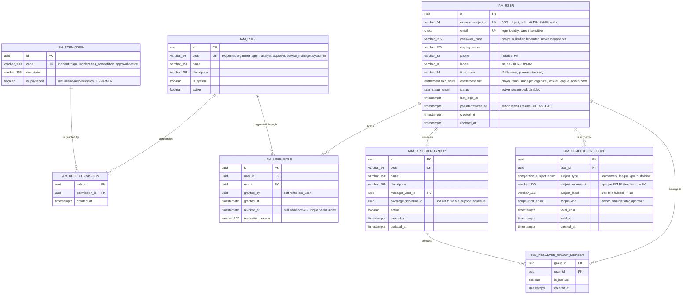
```mermaid
erDiagram
    IAM_USER {
        uuid id PK
        varchar_64 external_subject_id UK "SSO subject, null until FR-IAM-04 lands"
        citext email UK "login identity, case insensitive"
        varchar_255 password_hash "bcrypt, null when federated, never mapped out"
        varchar_150 display_name
        varchar_32 phone "nullable, PII"
        varchar_10 locale "en, es - NFR-I18N-02"
        varchar_64 time_zone "IANA name, presentation only"
        entitlement_tier_enum entitlement_tier "player, team_manager, organizer, official, league_admin, staff"
        user_status_enum status "active, suspended, disabled"
        timestamptz last_login_at
        timestamptz pseudonymized_at "set on lawful erasure - NFR-SEC-07"
        timestamptz created_at
        timestamptz updated_at
    }
    IAM_ROLE {
        uuid id PK
        varchar_64 code UK "requester, organizer, agent, analyst, approver, service_manager, sysadmin"
        varchar_150 name
        varchar_255 description
        boolean is_system
        boolean active
    }
    IAM_PERMISSION {
        uuid id PK
        varchar_100 code UK "incident.triage, incident.flag_competition, approval.decide"
        varchar_255 description
        boolean is_privileged "requires re-authentication - FR-IAM-06"
    }
    IAM_ROLE_PERMISSION {
        uuid role_id PK
        uuid permission_id PK
        timestamptz created_at
    }
    IAM_USER_ROLE {
        uuid id PK
        uuid user_id FK
        uuid role_id FK
        uuid granted_by "soft ref to iam_user"
        timestamptz granted_at
        timestamptz revoked_at "null while active - unique partial index"
        varchar_255 revocation_reason
    }
    IAM_RESOLVER_GROUP {
        uuid id PK
        varchar_64 code UK
        varchar_150 name
        varchar_255 description
        uuid manager_user_id FK
        uuid coverage_schedule_id "soft ref to sla.sla_support_schedule"
        boolean active
        timestamptz created_at
        timestamptz updated_at
    }
    IAM_RESOLVER_GROUP_MEMBER {
        uuid group_id PK
        uuid user_id PK
        boolean is_backup
        timestamptz created_at
    }
    IAM_COMPETITION_SCOPE {
        uuid id PK
        uuid user_id FK
        competition_subject_enum subject_type "tournament, league, group_division"
        varchar_100 subject_external_id "opaque SCMS identifier - no FK"
        varchar_255 subject_label "free-text fallback - R10"
        scope_kind_enum scope_kind "owner, administrator, approver"
        timestamptz valid_from
        timestamptz valid_to
        timestamptz created_at
    }

    IAM_USER ||--o{ IAM_USER_ROLE : "holds"
    IAM_ROLE ||--o{ IAM_USER_ROLE : "is granted through"
    IAM_ROLE ||--o{ IAM_ROLE_PERMISSION : "aggregates"
    IAM_PERMISSION ||--o{ IAM_ROLE_PERMISSION : "is granted by"
    IAM_USER ||--o{ IAM_RESOLVER_GROUP_MEMBER : "belongs to"
    IAM_RESOLVER_GROUP ||--o{ IAM_RESOLVER_GROUP_MEMBER : "contains"
    IAM_USER ||--o| IAM_RESOLVER_GROUP : "manages"
    IAM_USER ||--o{ IAM_COMPETITION_SCOPE : "is scoped to"
```

There is deliberately **no session or refresh-token table**: the MVP uses stateless JWT, and inactivity timeout (FR-IAM-06) is a token-lifetime concern. `ck_iam_user_credential` requires `password_hash IS NOT NULL OR external_subject_id IS NOT NULL` — an account must be authenticable somehow.

#### 3.1.6 Service catalog & taxonomy — schema `catalog`

Services, Offerings, dynamic request forms, eligibility rules, and the **categorization taxonomy** shared by both ticket types. The PRD requires the taxonomy (FR-INC-03, FR-CAT-01) but assigns no owner; it is placed here because this is the service-reference-data context and duplicating it per ticket context would break NFR-DAT-03.

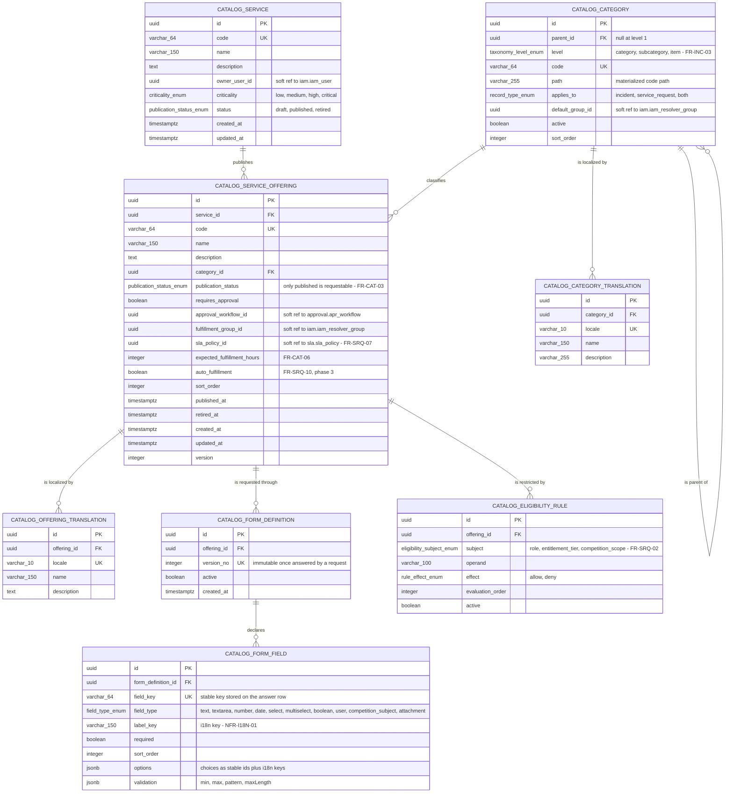
```mermaid
erDiagram
    CATALOG_SERVICE {
        uuid id PK
        varchar_64 code UK
        varchar_150 name
        text description
        uuid owner_user_id "soft ref to iam.iam_user"
        criticality_enum criticality "low, medium, high, critical"
        publication_status_enum status "draft, published, retired"
        timestamptz created_at
        timestamptz updated_at
    }
    CATALOG_SERVICE_OFFERING {
        uuid id PK
        uuid service_id FK
        varchar_64 code UK
        varchar_150 name
        text description
        uuid category_id FK
        publication_status_enum publication_status "only published is requestable - FR-CAT-03"
        boolean requires_approval
        uuid approval_workflow_id "soft ref to approval.apr_workflow"
        uuid fulfillment_group_id "soft ref to iam.iam_resolver_group"
        uuid sla_policy_id "soft ref to sla.sla_policy - FR-SRQ-07"
        integer expected_fulfillment_hours "FR-CAT-06"
        boolean auto_fulfillment "FR-SRQ-10, phase 3"
        integer sort_order
        timestamptz published_at
        timestamptz retired_at
        timestamptz created_at
        timestamptz updated_at
        integer version
    }
    CATALOG_OFFERING_TRANSLATION {
        uuid id PK
        uuid offering_id FK
        varchar_10 locale UK
        varchar_150 name
        text description
    }
    CATALOG_FORM_DEFINITION {
        uuid id PK
        uuid offering_id FK
        integer version_no UK "immutable once answered by a request"
        boolean active
        timestamptz created_at
    }
    CATALOG_FORM_FIELD {
        uuid id PK
        uuid form_definition_id FK
        varchar_64 field_key UK "stable key stored on the answer row"
        field_type_enum field_type "text, textarea, number, date, select, multiselect, boolean, user, competition_subject, attachment"
        varchar_150 label_key "i18n key - NFR-I18N-01"
        boolean required
        integer sort_order
        jsonb options "choices as stable ids plus i18n keys"
        jsonb validation "min, max, pattern, maxLength"
    }
    CATALOG_ELIGIBILITY_RULE {
        uuid id PK
        uuid offering_id FK
        eligibility_subject_enum subject "role, entitlement_tier, competition_scope - FR-SRQ-02"
        varchar_100 operand
        rule_effect_enum effect "allow, deny"
        integer evaluation_order
        boolean active
    }
    CATALOG_CATEGORY {
        uuid id PK
        uuid parent_id FK "null at level 1"
        taxonomy_level_enum level "category, subcategory, item - FR-INC-03"
        varchar_64 code UK
        varchar_255 path "materialized code path"
        record_type_enum applies_to "incident, service_request, both"
        uuid default_group_id "soft ref to iam.iam_resolver_group"
        boolean active
        integer sort_order
    }
    CATALOG_CATEGORY_TRANSLATION {
        uuid id PK
        uuid category_id FK
        varchar_10 locale UK
        varchar_150 name
        varchar_255 description
    }

    CATALOG_SERVICE ||--o{ CATALOG_SERVICE_OFFERING : "publishes"
    CATALOG_SERVICE_OFFERING ||--o{ CATALOG_OFFERING_TRANSLATION : "is localized by"
    CATALOG_SERVICE_OFFERING ||--o{ CATALOG_FORM_DEFINITION : "is requested through"
    CATALOG_FORM_DEFINITION ||--o{ CATALOG_FORM_FIELD : "declares"
    CATALOG_SERVICE_OFFERING ||--o{ CATALOG_ELIGIBILITY_RULE : "is restricted by"
    CATALOG_CATEGORY ||--o{ CATALOG_CATEGORY : "is parent of"
    CATALOG_CATEGORY ||--o{ CATALOG_CATEGORY_TRANSLATION : "is localized by"
    CATALOG_CATEGORY ||--o{ CATALOG_SERVICE_OFFERING : "classifies"
```

`catalog_form_definition.version_no` is immutable once a request has answered it, and the request stores `form_definition_id`. That is how NFR-CFG-02 holds: editing a form creates a **new** version, and in-flight requests keep validating against the one they were created under.

#### 3.1.7 Incident — schema `incident`

The core context (C1 + C13). `incident_ticket` is the persistence side of the `Incident` aggregate root; notes, attachments, assignment history, transitions, links, escalations and communications are parts of the same aggregate and carry hard FKs with `ON DELETE CASCADE` — the only cascade in the model, legitimate because those rows have no meaning without their ticket.


```mermaid
erDiagram
    INCIDENT_TICKET {
        uuid id PK
        varchar_20 reference UK "INC0000123 - immutable, never reused, FR-INC-02"
        varchar_255 short_description
        text description
        origin_channel_enum origin_channel "portal, agent_logged, email, in_app, phone - FR-OMN-02"
        uuid reporter_user_id "soft ref to iam.iam_user - never anonymous"
        uuid logged_by_user_id "soft ref - agent logging on behalf"
        uuid service_id "soft ref to catalog.catalog_service"
        uuid category_id "soft ref to catalog.catalog_category - required to leave New"
        uuid workflow_id FK
        uuid state_id FK "configurable lifecycle - FR-WFL-01"
        state_category_enum state_category "open, pending, resolved, closed, cancelled"
        pending_reason_enum pending_reason "customer, third_party, change - FR-INC-06"
        uuid priority_matrix_id FK "configuration version in force - NFR-CFG-02"
        impact_enum base_impact "agent assessment before competition uplift"
        impact_enum assessed_impact "after uplift - FR-INC-05"
        urgency_enum urgency
        priority_enum priority "P1 to P4 - derived, never requester chosen, FR-INC-04"
        boolean priority_overridden
        varchar_500 priority_override_justification "mandatory when overridden"
        boolean competition_affects "agent only, never automatic - FR-INC-05"
        varchar_500 competition_justification "mandatory when flag is true"
        uuid competition_flag_set_by "soft ref to iam.iam_user"
        timestamptz competition_flag_set_at
        competition_subject_enum competition_subject_type "tournament, league, fixture, standings, registration, roster, team, player_account, schedule, result"
        varchar_100 competition_subject_external_id "opaque SCMS id - no FK by design"
        varchar_255 competition_subject_label "free-text fallback - R10"
        uuid assigned_group_id "soft ref to iam.iam_resolver_group"
        uuid assigned_user_id "soft ref to iam.iam_user"
        timestamptz assigned_at
        boolean is_major "FR-MIM-01"
        uuid major_declared_by
        timestamptz major_declared_at
        varchar_500 major_justification
        uuid parent_incident_id FK "child of a Major Incident - FR-MIM-03"
        uuid resolution_code_id FK
        text resolution_notes "mandatory to resolve - FR-INC-07"
        uuid resolution_article_id "soft ref to knowledge.kb_article - FR-KNW-05"
        timestamptz first_response_at "MTTA input"
        timestamptz resolved_at
        timestamptz closed_at
        timestamptz confirmation_due_at "auto-close deadline - FR-INC-09"
        boolean first_contact_resolution "FR-INC-18"
        smallint reopen_count
        smallint csat_score "1 to 5, nullable"
        varchar_500 csat_comment
        timestamptz created_at
        timestamptz updated_at
        uuid created_by
        uuid updated_by
        integer version "optimistic lock"
    }
    INCIDENT_WORK_NOTE {
        uuid id PK
        uuid incident_id FK
        note_visibility_enum visibility "public, internal - NFR-SEC-04"
        text body
        uuid author_user_id "soft ref to iam.iam_user"
        author_kind_enum author_kind "user, system_rule"
        timestamptz created_at
    }
    INCIDENT_ATTACHMENT {
        uuid id PK
        uuid incident_id FK
        varchar_255 file_name
        varchar_100 content_type
        integer size_bytes
        varchar_500 storage_key "object storage key, not the blob"
        note_visibility_enum visibility
        uuid uploaded_by
        timestamptz created_at
    }
    INCIDENT_ASSIGNMENT_HISTORY {
        uuid id PK
        uuid incident_id FK
        uuid from_group_id
        uuid from_user_id
        uuid to_group_id
        uuid to_user_id
        varchar_255 reason
        uuid assigned_by
        timestamptz assigned_at "FR-INC-12"
    }
    INCIDENT_STATE_TRANSITION {
        uuid id PK
        uuid incident_id FK
        uuid from_state_id
        uuid to_state_id
        state_category_enum to_state_category
        varchar_255 reason
        actor_type_enum actor_type "user, system_rule"
        uuid actor_user_id
        varchar_100 actor_rule_code
        timestamptz occurred_at "append only - no updated_at"
    }
    INCIDENT_LINK {
        uuid id PK
        uuid incident_id FK
        record_type_enum target_record_type "incident, service_request, problem, change, release, configuration_item"
        uuid target_record_id "opaque - phase 2 contexts already accepted"
        link_type_enum link_type "duplicate_of, related_to, caused_by, child_of, resolved_by"
        uuid created_by
        timestamptz created_at
    }
    INCIDENT_ESCALATION {
        uuid id PK
        uuid incident_id FK
        escalation_type_enum escalation_type "functional, hierarchical - FR-INC-13"
        escalation_trigger_enum trigger "manual, sla_warning, sla_breach"
        uuid from_group_id
        uuid to_group_id
        uuid to_user_id
        varchar_255 reason
        uuid triggered_by
        timestamptz triggered_at
    }
    INCIDENT_MAJOR_COMMUNICATION {
        uuid id PK
        uuid incident_id FK
        varchar_64 audience_code "stakeholder list code - FR-NOT-04"
        varchar_255 subject
        text body
        uuid sent_by
        timestamptz sent_at
    }
    INCIDENT_RESOLUTION_CODE {
        uuid id PK
        varchar_64 code UK
        boolean requires_article
        boolean active
        integer sort_order
    }
    INCIDENT_RESOLUTION_CODE_TRANSLATION {
        uuid id PK
        uuid resolution_code_id FK
        varchar_10 locale UK
        varchar_150 name
    }
    INCIDENT_WORKFLOW {
        uuid id PK
        integer version_no UK
        boolean active
        timestamptz effective_from
    }
    INCIDENT_WORKFLOW_STATE {
        uuid id PK
        uuid workflow_id FK
        varchar_64 code UK
        state_category_enum category
        sla_clock_enum sla_clock "running, paused - FR-INC-08"
        boolean is_initial
        boolean is_final
        integer sort_order
    }
    INCIDENT_WORKFLOW_TRANSITION {
        uuid id PK
        uuid workflow_id FK
        uuid from_state_id FK
        uuid to_state_id FK
        varchar_64 required_permission_code
        jsonb guard "declarative preconditions"
    }
    INCIDENT_PRIORITY_MATRIX {
        uuid id PK
        integer version_no UK
        smallint competition_impact_step "how much the flag raises Impact - FR-INC-05"
        boolean active
        timestamptz effective_from
    }
    INCIDENT_PRIORITY_MATRIX_CELL {
        uuid id PK
        uuid matrix_id FK
        impact_enum impact UK
        urgency_enum urgency UK
        priority_enum priority
    }
    INCIDENT_ROUTING_RULE {
        uuid id PK
        varchar_150 name
        uuid category_id "soft ref to catalog.catalog_category"
        competition_subject_enum competition_subject_type
        origin_channel_enum origin_channel
        uuid target_group_id "soft ref to iam.iam_resolver_group - FR-WFL-03"
        integer evaluation_order
        boolean active
    }
    INCIDENT_BUSINESS_RULE {
        uuid id PK
        varchar_150 name
        rule_event_enum event "on_create, on_update, on_state_change, scheduled"
        jsonb condition
        jsonb actions "set_field, assign, notify, escalate, create_task - FR-WFL-02"
        integer evaluation_order
        boolean active
        integer version_no
    }

    INCIDENT_TICKET ||--o{ INCIDENT_WORK_NOTE : "records"
    INCIDENT_TICKET ||--o{ INCIDENT_ATTACHMENT : "carries"
    INCIDENT_TICKET ||--o{ INCIDENT_ASSIGNMENT_HISTORY : "was routed through"
    INCIDENT_TICKET ||--o{ INCIDENT_STATE_TRANSITION : "moved through"
    INCIDENT_TICKET ||--o{ INCIDENT_LINK : "is linked by"
    INCIDENT_TICKET ||--o{ INCIDENT_ESCALATION : "was escalated by"
    INCIDENT_TICKET ||--o{ INCIDENT_MAJOR_COMMUNICATION : "communicates through"
    INCIDENT_TICKET ||--o| INCIDENT_TICKET : "is parent major incident of"
    INCIDENT_RESOLUTION_CODE ||--o{ INCIDENT_TICKET : "closes"
    INCIDENT_RESOLUTION_CODE ||--o{ INCIDENT_RESOLUTION_CODE_TRANSLATION : "is localized by"
    INCIDENT_WORKFLOW ||--o{ INCIDENT_WORKFLOW_STATE : "declares"
    INCIDENT_WORKFLOW ||--o{ INCIDENT_WORKFLOW_TRANSITION : "allows"
    INCIDENT_WORKFLOW_STATE ||--o{ INCIDENT_TICKET : "is current state of"
    INCIDENT_WORKFLOW ||--o{ INCIDENT_TICKET : "governs"
    INCIDENT_PRIORITY_MATRIX ||--o{ INCIDENT_PRIORITY_MATRIX_CELL : "is composed of"
    INCIDENT_PRIORITY_MATRIX ||--o{ INCIDENT_TICKET : "derived priority of"
```

**Structural invariants** (`CHECK` constraints — safety nets; the _rules_ live in the domain layer):

| Constraint                      | Rule                                                                      | Requirement |
| ------------------------------- | ------------------------------------------------------------------------- | ----------- |
| `ck_incident_resolution`        | resolved/closed ⇒ `resolution_code_id` **and** `resolution_notes` present | FR-INC-07   |
| `ck_incident_competition_flag`  | flag true ⇒ justification, setter and timestamp present                   | FR-INC-05   |
| `ck_incident_priority_override` | overridden ⇒ justification present                                        | FR-INC-04   |
| `ck_incident_subject`           | a subject type ⇒ an external id **or** a free-text label                  | R10         |
| `ck_incident_major`             | major ⇒ declarer, time and justification present                          | FR-MIM-01   |

Two columns deserve emphasis. **`base_impact` and `assessed_impact` are separate** because FR-INC-05 says the flag _raises_ Impact by a configurable amount: storing only the result would make the agent's original assessment unrecoverable and the calibration KPI (R8) unmeasurable. And **the competition subject has no foreign key** — three columns and nothing else — which is the whole of §3.1.3 point 3 made concrete.

#### 3.1.8 Service Request — schema `service_request`

Structurally a sibling of `incident`: the same reference / state / competition-subject shape, a different lifecycle (FR-SRQ-05), plus form answers and fulfillment tasks. It carries **its own** workflow tables, because each context owns its lifecycle — a central workflow engine was explicitly rejected as a god-context risk (ARCHITECTURE §4.1).

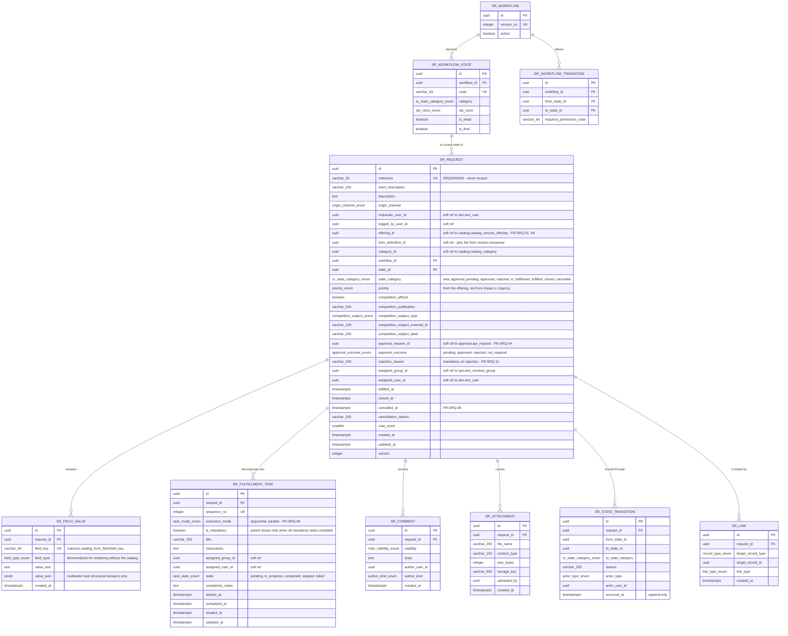
```mermaid
erDiagram
    SR_REQUEST {
        uuid id PK
        varchar_20 reference UK "SRQ0000045 - never reused"
        varchar_255 short_description
        text description
        origin_channel_enum origin_channel
        uuid requester_user_id "soft ref to iam.iam_user"
        uuid logged_by_user_id "soft ref"
        uuid offering_id "soft ref to catalog.catalog_service_offering - FR-SRQ-01, K6"
        uuid form_definition_id "soft ref - pins the form version answered"
        uuid category_id "soft ref to catalog.catalog_category"
        uuid workflow_id FK
        uuid state_id FK
        sr_state_category_enum state_category "new, approval_pending, approved, rejected, in_fulfillment, fulfilled, closed, cancelled"
        priority_enum priority "from the offering, not from Impact x Urgency"
        boolean competition_affects
        varchar_500 competition_justification
        competition_subject_enum competition_subject_type
        varchar_100 competition_subject_external_id
        varchar_255 competition_subject_label
        uuid approval_request_id "soft ref to approval.apr_request - FR-SRQ-04"
        approval_outcome_enum approval_outcome "pending, approved, rejected, not_required"
        varchar_500 rejection_reason "mandatory on rejection - FR-SRQ-11"
        uuid assigned_group_id "soft ref to iam.iam_resolver_group"
        uuid assigned_user_id "soft ref to iam.iam_user"
        timestamptz fulfilled_at
        timestamptz closed_at
        timestamptz cancelled_at "FR-SRQ-08"
        varchar_255 cancellation_reason
        smallint csat_score
        timestamptz created_at
        timestamptz updated_at
        integer version
    }
    SR_FIELD_VALUE {
        uuid id PK
        uuid request_id FK
        varchar_64 field_key UK "matches catalog_form_field.field_key"
        field_type_enum field_type "denormalized for rendering without the catalog"
        text value_text
        jsonb value_json "multiselect and structured answers only"
        timestamptz created_at
    }
    SR_FULFILLMENT_TASK {
        uuid id PK
        uuid request_id FK
        integer sequence_no UK
        task_mode_enum execution_mode "sequential, parallel - FR-SRQ-06"
        boolean is_mandatory "parent closes only when all mandatory tasks complete"
        varchar_255 title
        text instructions
        uuid assigned_group_id "soft ref"
        uuid assigned_user_id "soft ref"
        task_state_enum state "pending, in_progress, completed, skipped, failed"
        text completion_notes
        timestamptz started_at
        timestamptz completed_at
        timestamptz created_at
        timestamptz updated_at
    }
    SR_COMMENT {
        uuid id PK
        uuid request_id FK
        note_visibility_enum visibility
        text body
        uuid author_user_id
        author_kind_enum author_kind
        timestamptz created_at
    }
    SR_ATTACHMENT {
        uuid id PK
        uuid request_id FK
        varchar_255 file_name
        varchar_100 content_type
        integer size_bytes
        varchar_500 storage_key
        uuid uploaded_by
        timestamptz created_at
    }
    SR_STATE_TRANSITION {
        uuid id PK
        uuid request_id FK
        uuid from_state_id
        uuid to_state_id
        sr_state_category_enum to_state_category
        varchar_255 reason
        actor_type_enum actor_type
        uuid actor_user_id
        timestamptz occurred_at "append only"
    }
    SR_LINK {
        uuid id PK
        uuid request_id FK
        record_type_enum target_record_type
        uuid target_record_id
        link_type_enum link_type
        timestamptz created_at
    }
    SR_WORKFLOW {
        uuid id PK
        integer version_no UK
        boolean active
    }
    SR_WORKFLOW_STATE {
        uuid id PK
        uuid workflow_id FK
        varchar_64 code UK
        sr_state_category_enum category
        sla_clock_enum sla_clock
        boolean is_initial
        boolean is_final
    }
    SR_WORKFLOW_TRANSITION {
        uuid id PK
        uuid workflow_id FK
        uuid from_state_id FK
        uuid to_state_id FK
        varchar_64 required_permission_code
    }

    SR_REQUEST ||--o{ SR_FIELD_VALUE : "answers"
    SR_REQUEST ||--o{ SR_FULFILLMENT_TASK : "decomposes into"
    SR_REQUEST ||--o{ SR_COMMENT : "records"
    SR_REQUEST ||--o{ SR_ATTACHMENT : "carries"
    SR_REQUEST ||--o{ SR_STATE_TRANSITION : "moved through"
    SR_REQUEST ||--o{ SR_LINK : "is linked by"
    SR_WORKFLOW ||--o{ SR_WORKFLOW_STATE : "declares"
    SR_WORKFLOW ||--o{ SR_WORKFLOW_TRANSITION : "allows"
    SR_WORKFLOW_STATE ||--o{ SR_REQUEST : "is current state of"
```

`ck_sr_fulfillment_gate` — `state_category NOT IN ('in_fulfillment','fulfilled') OR approval_outcome IN ('approved','not_required')` — is the structural net under FR-SRQ-04. Form answers are **rows, not a `jsonb` document**, because FR-RPT-05 requires filtering and support needs to answer "every organizer-access request for competition X".

#### 3.1.9 SLA — schema `sla`

The most timing-sensitive schema in the system: NFR-AVL-05 (timers survive restarts), NFR-PRF-04 (warning within one minute) and FR-SLA-04 (recalculation from the **original** creation time, previous targets preserved) all land here.

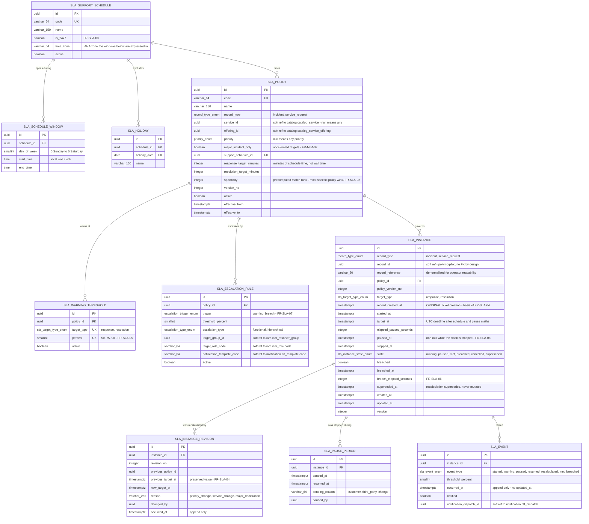
```mermaid
erDiagram
    SLA_SUPPORT_SCHEDULE {
        uuid id PK
        varchar_64 code UK
        varchar_150 name
        boolean is_24x7 "FR-SLA-03"
        varchar_64 time_zone "IANA zone the windows below are expressed in"
        boolean active
    }
    SLA_SCHEDULE_WINDOW {
        uuid id PK
        uuid schedule_id FK
        smallint day_of_week "0 Sunday to 6 Saturday"
        time start_time "local wall clock"
        time end_time
    }
    SLA_HOLIDAY {
        uuid id PK
        uuid schedule_id FK
        date holiday_date UK
        varchar_150 name
    }
    SLA_POLICY {
        uuid id PK
        varchar_64 code UK
        varchar_150 name
        record_type_enum record_type "incident, service_request"
        uuid service_id "soft ref to catalog.catalog_service - null means any"
        uuid offering_id "soft ref to catalog.catalog_service_offering"
        priority_enum priority "null means any priority"
        boolean major_incident_only "accelerated targets - FR-MIM-02"
        uuid support_schedule_id FK
        integer response_target_minutes "minutes of schedule time, not wall time"
        integer resolution_target_minutes
        integer specificity "precomputed match rank - most specific policy wins, FR-SLA-02"
        integer version_no
        boolean active
        timestamptz effective_from
        timestamptz effective_to
    }
    SLA_WARNING_THRESHOLD {
        uuid id PK
        uuid policy_id FK
        sla_target_type_enum target_type UK "response, resolution"
        smallint percent UK "50, 75, 90 - FR-SLA-05"
        boolean active
    }
    SLA_ESCALATION_RULE {
        uuid id PK
        uuid policy_id FK
        escalation_trigger_enum trigger "warning, breach - FR-SLA-07"
        smallint threshold_percent
        escalation_type_enum escalation_type "functional, hierarchical"
        uuid target_group_id "soft ref to iam.iam_resolver_group"
        varchar_64 target_role_code "soft ref to iam.iam_role.code"
        varchar_64 notification_template_code "soft ref to notification.ntf_template.code"
        boolean active
    }
    SLA_INSTANCE {
        uuid id PK
        record_type_enum record_type "incident, service_request"
        uuid record_id "soft ref - polymorphic, no FK by design"
        varchar_20 record_reference "denormalized for operator readability"
        uuid policy_id FK
        integer policy_version_no
        sla_target_type_enum target_type "response, resolution"
        timestamptz record_created_at "ORIGINAL ticket creation - basis of FR-SLA-04"
        timestamptz started_at
        timestamptz target_at "UTC deadline after schedule and pause maths"
        integer elapsed_paused_seconds
        timestamptz paused_at "non null while the clock is stopped - FR-SLA-08"
        timestamptz stopped_at
        sla_instance_state_enum state "running, paused, met, breached, cancelled, superseded"
        boolean breached
        timestamptz breached_at
        integer breach_elapsed_seconds "FR-SLA-06"
        timestamptz superseded_at "recalculation supersedes, never mutates"
        timestamptz created_at
        timestamptz updated_at
        integer version
    }
    SLA_INSTANCE_REVISION {
        uuid id PK
        uuid instance_id FK
        integer revision_no
        uuid previous_policy_id
        timestamptz previous_target_at "preserved value - FR-SLA-04"
        timestamptz new_target_at
        varchar_255 reason "priority_change, service_change, major_declaration"
        uuid changed_by
        timestamptz occurred_at "append only"
    }
    SLA_PAUSE_PERIOD {
        uuid id PK
        uuid instance_id FK
        timestamptz paused_at
        timestamptz resumed_at
        varchar_64 pending_reason "customer, third_party, change"
        uuid paused_by
    }
    SLA_EVENT {
        uuid id PK
        uuid instance_id FK
        sla_event_enum event_type "started, warning, paused, resumed, recalculated, met, breached"
        smallint threshold_percent
        timestamptz occurred_at "append only - no updated_at"
        boolean notified
        uuid notification_dispatch_id "soft ref to notification.ntf_dispatch"
    }

    SLA_SUPPORT_SCHEDULE ||--o{ SLA_SCHEDULE_WINDOW : "opens during"
    SLA_SUPPORT_SCHEDULE ||--o{ SLA_HOLIDAY : "excludes"
    SLA_SUPPORT_SCHEDULE ||--o{ SLA_POLICY : "times"
    SLA_POLICY ||--o{ SLA_WARNING_THRESHOLD : "warns at"
    SLA_POLICY ||--o{ SLA_ESCALATION_RULE : "escalates by"
    SLA_POLICY ||--o{ SLA_INSTANCE : "governs"
    SLA_INSTANCE ||--o{ SLA_INSTANCE_REVISION : "was recalculated by"
    SLA_INSTANCE ||--o{ SLA_PAUSE_PERIOD : "was stopped during"
    SLA_INSTANCE ||--o{ SLA_EVENT : "raised"
```

Three decisions carry the requirements:

- **`record_created_at` is copied onto the instance.** FR-SLA-04 recalculates from the original ticket creation instant, not from the moment the priority changed — this column is what makes that survivable across a restart.
- **Remaining time is always derived from stored UTC timestamps** (`started_at`, `target_at`, `paused_at`, `elapsed_paused_seconds`), never from an in-memory counter or from scheduled-job liveness (NFR-AVL-05, ADR-009).
- **Breach fields are written once and there is no update path** on the repository port: FR-SLA-06 ("no retroactive silent modification") becomes structural rather than procedural. A recalculation **supersedes** an instance and records the previous target in `sla_instance_revision`.

`uq_sla_instance_active` — unique `(record_type, record_id, target_type)` partial `WHERE superseded_at IS NULL` — enforces "exactly one applicable commitment" (FR-SLA-02).

#### 3.1.10 Knowledge — schema `knowledge`

Article identity is stable; content is versioned and translated. Full-text search is native PostgreSQL — **no external search engine** in the MVP (constraint K8).

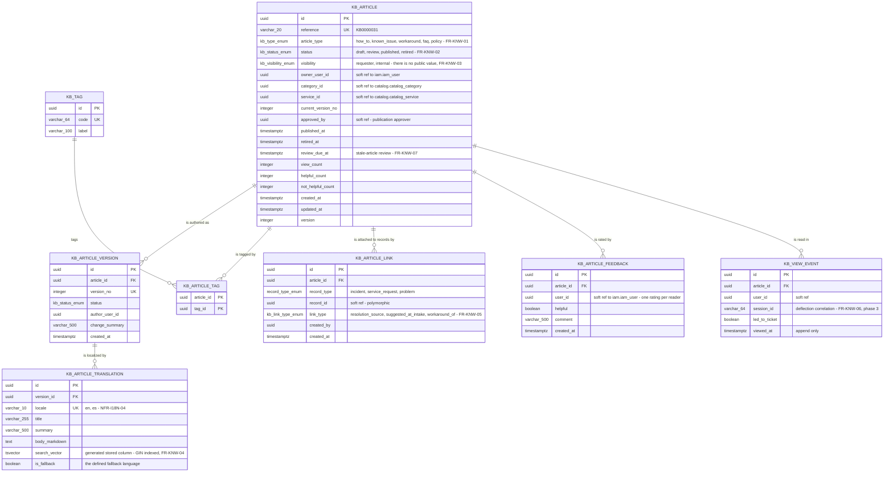
```mermaid
erDiagram
    KB_ARTICLE {
        uuid id PK
        varchar_20 reference UK "KB0000031"
        kb_type_enum article_type "how_to, known_issue, workaround, faq, policy - FR-KNW-01"
        kb_status_enum status "draft, review, published, retired - FR-KNW-02"
        kb_visibility_enum visibility "requester, internal - there is no public value, FR-KNW-03"
        uuid owner_user_id "soft ref to iam.iam_user"
        uuid category_id "soft ref to catalog.catalog_category"
        uuid service_id "soft ref to catalog.catalog_service"
        integer current_version_no
        uuid approved_by "soft ref - publication approver"
        timestamptz published_at
        timestamptz retired_at
        timestamptz review_due_at "stale-article review - FR-KNW-07"
        integer view_count
        integer helpful_count
        integer not_helpful_count
        timestamptz created_at
        timestamptz updated_at
        integer version
    }
    KB_ARTICLE_VERSION {
        uuid id PK
        uuid article_id FK
        integer version_no UK
        kb_status_enum status
        uuid author_user_id
        varchar_500 change_summary
        timestamptz created_at
    }
    KB_ARTICLE_TRANSLATION {
        uuid id PK
        uuid version_id FK
        varchar_10 locale UK "en, es - NFR-I18N-04"
        varchar_255 title
        varchar_500 summary
        text body_markdown
        tsvector search_vector "generated stored column - GIN indexed, FR-KNW-04"
        boolean is_fallback "the defined fallback language"
    }
    KB_TAG {
        uuid id PK
        varchar_64 code UK
        varchar_100 label
    }
    KB_ARTICLE_TAG {
        uuid article_id PK
        uuid tag_id PK
    }
    KB_ARTICLE_LINK {
        uuid id PK
        uuid article_id FK
        record_type_enum record_type "incident, service_request, problem"
        uuid record_id "soft ref - polymorphic"
        kb_link_type_enum link_type "resolution_source, suggested_at_intake, workaround_of - FR-KNW-05"
        uuid created_by
        timestamptz created_at
    }
    KB_ARTICLE_FEEDBACK {
        uuid id PK
        uuid article_id FK
        uuid user_id "soft ref to iam.iam_user - one rating per reader"
        boolean helpful
        varchar_500 comment
        timestamptz created_at
    }
    KB_VIEW_EVENT {
        uuid id PK
        uuid article_id FK
        uuid user_id "soft ref"
        varchar_64 session_id "deflection correlation - FR-KNW-06, phase 3"
        boolean led_to_ticket
        timestamptz viewed_at "append only"
    }

    KB_ARTICLE ||--o{ KB_ARTICLE_VERSION : "is authored as"
    KB_ARTICLE_VERSION ||--o{ KB_ARTICLE_TRANSLATION : "is localized by"
    KB_ARTICLE ||--o{ KB_ARTICLE_TAG : "is tagged by"
    KB_TAG ||--o{ KB_ARTICLE_TAG : "tags"
    KB_ARTICLE ||--o{ KB_ARTICLE_LINK : "is attached to records by"
    KB_ARTICLE ||--o{ KB_ARTICLE_FEEDBACK : "is rated by"
    KB_ARTICLE ||--o{ KB_VIEW_EVENT : "is read in"
```

`search_vector` is a **generated stored column** over title + summary + body, with a **GIN** index, plus a `pg_trgm` index on `title` for typo-tolerant intake suggestions (FR-INC-16). Search runs against the current version of `published` articles and is filtered by the reader's visibility entitlement **server-side, as a `WHERE` clause** — never by omission in a template (NFR-SEC-02). Language configuration is selected per row from `locale`, which is why translations are rows and not columns. `visibility` has **no `public` value**: nothing is reachable without authentication (FR-IAM-01).

#### 3.1.11 Approval & Notification — schemas `approval` and `notification`

One generic approval engine serves Service Requests now and Changes/Releases in phase 2. Every notification is recorded against its source record and dispatched **after commit** off the domain-event bus (ADR-008), so a failing gateway can never roll back a ticket (NFR-AVL-03).

```mermaid
erDiagram
    APR_WORKFLOW {
        uuid id PK
        varchar_64 code UK
        varchar_150 name
        record_type_enum record_type "service_request, change, release"
        integer version_no
        boolean active
    }
    APR_STAGE {
        uuid id PK
        uuid workflow_id FK
        integer sequence_no UK
        varchar_150 name
        stage_mode_enum mode "sequential, parallel - FR-APR-01"
        quorum_type_enum quorum_type "all, any, majority - FR-APR-06, phase 4"
        smallint quorum_value
        integer due_in_hours "reminder and escalation basis - FR-APR-05"
    }
    APR_APPROVER_RULE {
        uuid id PK
        uuid stage_id FK
        approver_resolver_enum resolver_type "role, group, named_user, competition_owner - FR-APR-02"
        varchar_100 operand
        integer evaluation_order
    }
    APR_REQUEST {
        uuid id PK
        uuid workflow_id FK
        integer workflow_version_no
        record_type_enum record_type
        uuid record_id "soft ref - polymorphic, no FK by design"
        varchar_20 record_reference
        uuid requested_by "soft ref to iam.iam_user"
        timestamptz requested_at
        apr_state_enum state "pending, approved, rejected, cancelled, expired"
        integer current_stage_seq
        timestamptz decided_at
        timestamptz created_at
        timestamptz updated_at
        integer version
    }
    APR_TASK {
        uuid id PK
        uuid request_id FK
        uuid stage_id FK
        uuid approver_user_id "soft ref - resolved at task creation"
        uuid delegate_user_id "soft ref - FR-APR-04, phase 2"
        apr_task_state_enum state "pending, approved, rejected, delegated, expired"
        timestamptz due_at
        timestamptz reminded_at
        timestamptz created_at
        timestamptz updated_at
    }
    APR_DECISION {
        uuid id PK
        uuid task_id FK UK "one decision per task, forever - FR-APR-07"
        uuid request_id FK
        approval_decision_enum decision "approved, rejected"
        varchar_1000 comment "mandatory on rejection - FR-APR-03"
        uuid decided_by "soft ref - the actual decider"
        uuid on_behalf_of "soft ref - original approver when delegated"
        timestamptz decided_at "append only - no updated_at, no update or delete grant"
    }
    NTF_TEMPLATE {
        uuid id PK
        varchar_64 code UK "incident.acknowledged, sla.warning, approval.requested"
        varchar_64 event_type
        ntf_channel_enum channel "in_app, email, push"
        integer version_no
        boolean active
    }
    NTF_TEMPLATE_TRANSLATION {
        uuid id PK
        uuid template_id FK
        varchar_10 locale UK "NFR-I18N-04"
        varchar_255 subject
        text body "token placeholders, no hardcoded strings"
        boolean is_fallback
    }
    NTF_RULE {
        uuid id PK
        varchar_150 name
        varchar_64 event_type
        record_type_enum record_type
        ntf_audience_enum audience "requester, assignee, assigned_group, approver, stakeholder_list, role"
        varchar_64 audience_operand
        uuid template_id FK
        ntf_channel_enum channel
        boolean is_mandatory "cannot be disabled by a user preference - FR-NOT-07"
        boolean active
        integer evaluation_order
    }
    NTF_STAKEHOLDER_LIST {
        uuid id PK
        varchar_64 code UK "major_incident_stakeholders - FR-NOT-04"
        varchar_150 name
        boolean active
    }
    NTF_STAKEHOLDER_MEMBER {
        uuid id PK
        uuid list_id FK
        uuid user_id "soft ref to iam.iam_user"
        varchar_255 external_address
        timestamptz created_at
    }
    NTF_DISPATCH {
        uuid id PK
        uuid template_id FK
        integer template_version_no
        ntf_channel_enum channel
        uuid recipient_user_id "soft ref to iam.iam_user"
        varchar_255 recipient_address "resolved at send time"
        varchar_10 locale
        record_type_enum record_type
        uuid record_id "soft ref - polymorphic, FR-NOT-08"
        varchar_20 record_reference
        varchar_255 rendered_subject
        text rendered_body "what was actually sent, kept as evidence"
        dispatch_state_enum state "queued, sent, failed, read, cancelled"
        smallint attempt_count
        varchar_500 failure_reason
        uuid correlation_event_id "the domain event that caused it"
        timestamptz queued_at
        timestamptz sent_at
        timestamptz read_at
        timestamptz created_at
        timestamptz updated_at
    }

    APR_WORKFLOW ||--o{ APR_STAGE : "is composed of"
    APR_STAGE ||--o{ APR_APPROVER_RULE : "resolves approvers by"
    APR_WORKFLOW ||--o{ APR_REQUEST : "governs"
    APR_REQUEST ||--o{ APR_TASK : "assigns"
    APR_STAGE ||--o{ APR_TASK : "produces"
    APR_TASK ||--|| APR_DECISION : "is closed by"
    APR_REQUEST ||--o{ APR_DECISION : "aggregates"
    NTF_TEMPLATE ||--o{ NTF_TEMPLATE_TRANSLATION : "is localized by"
    NTF_TEMPLATE ||--o{ NTF_RULE : "is selected by"
    NTF_TEMPLATE ||--o{ NTF_DISPATCH : "renders"
    NTF_STAKEHOLDER_LIST ||--o{ NTF_STAKEHOLDER_MEMBER : "contains"
    APR_REQUEST ||..o{ NTF_DISPATCH : "notifies through"
```

**Approval immutability is enforced on three levels, not one** (FR-APR-07): `apr_decision` has no `updated_at`; the repository port exposes no update or delete method for decisions; and the application database role holds `INSERT, SELECT` only on the table. `ntf_dispatch` stores the **rendered** subject and body because "the requester was told X at time T" is evidence — re-rendering from a later template version would falsify it.

#### 3.1.12 Audit & reporting — schemas `audit` and `reporting`

One append-only journal, and a set of projections that are never a system of record.

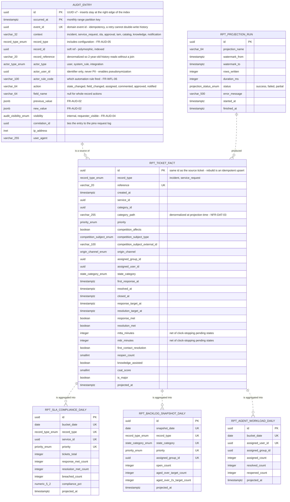
```mermaid
erDiagram
    AUDIT_ENTRY {
        uuid id PK "UUID v7 - inserts stay at the right edge of the index"
        timestamptz occurred_at PK "monthly range partition key"
        uuid event_id UK "domain event id - idempotency, a retry cannot double-write history"
        varchar_32 context "incident, service_request, sla, approval, iam, catalog, knowledge, notification"
        record_type_enum record_type "includes configuration - FR-AUD-05"
        uuid record_id "soft ref - polymorphic, indexed"
        varchar_20 record_reference "denormalized so 2-year-old history reads without a join"
        actor_type_enum actor_type "user, system_rule, integration"
        uuid actor_user_id "identifier only, never PII - enables pseudonymization"
        varchar_100 actor_rule_code "which automation rule fired - FR-WFL-06"
        varchar_64 action "state_changed, field_changed, assigned, commented, approved, notified"
        varchar_64 field_name "null for whole-record actions"
        jsonb previous_value "FR-AUD-02"
        jsonb new_value "FR-AUD-02"
        audit_visibility_enum visibility "internal, requester_visible - FR-AUD-04"
        uuid correlation_id "ties the entry to the pino request log"
        inet ip_address
        varchar_255 user_agent
    }
    RPT_TICKET_FACT {
        uuid id PK "same id as the source ticket - rebuild is an idempotent upsert"
        record_type_enum record_type "incident, service_request"
        varchar_20 reference UK
        timestamptz created_at
        uuid service_id
        uuid category_id
        varchar_255 category_path "denormalized at projection time - NFR-DAT-03"
        priority_enum priority
        boolean competition_affects
        competition_subject_enum competition_subject_type
        varchar_100 competition_subject_external_id
        origin_channel_enum origin_channel
        uuid assigned_group_id
        uuid assigned_user_id
        state_category_enum state_category
        timestamptz first_response_at
        timestamptz resolved_at
        timestamptz closed_at
        timestamptz response_target_at
        timestamptz resolution_target_at
        boolean response_met
        boolean resolution_met
        integer mtta_minutes "net of clock-stopping pending states"
        integer mttr_minutes "net of clock-stopping pending states"
        boolean first_contact_resolution
        smallint reopen_count
        boolean knowledge_assisted
        smallint csat_score
        boolean is_major
        timestamptz projected_at
    }
    RPT_SLA_COMPLIANCE_DAILY {
        uuid id PK
        date bucket_date UK
        record_type_enum record_type UK
        uuid service_id UK
        priority_enum priority UK
        integer tickets_total
        integer response_met_count
        integer resolution_met_count
        integer breached_count
        numeric_5_2 compliance_pct
        timestamptz projected_at
    }
    RPT_BACKLOG_SNAPSHOT_DAILY {
        uuid id PK
        date snapshot_date UK
        record_type_enum record_type UK
        state_category_enum state_category UK
        priority_enum priority UK
        uuid assigned_group_id UK
        integer open_count
        integer aged_over_target_count
        integer aged_over_2x_target_count
        timestamptz projected_at
    }
    RPT_AGENT_WORKLOAD_DAILY {
        uuid id PK
        date bucket_date UK
        uuid assigned_user_id UK
        uuid assigned_group_id
        integer assigned_count
        integer resolved_count
        integer reopened_count
        timestamptz projected_at
    }
    RPT_PROJECTION_RUN {
        uuid id PK
        varchar_64 projection_name
        timestamptz watermark_from
        timestamptz watermark_to
        integer rows_written
        integer duration_ms
        projection_status_enum status "success, failed, partial"
        varchar_500 error_message
        timestamptz started_at
        timestamptz finished_at
    }

    AUDIT_ENTRY ||..o{ RPT_TICKET_FACT : "is a source of"
    RPT_TICKET_FACT ||..o{ RPT_SLA_COMPLIANCE_DAILY : "is aggregated into"
    RPT_TICKET_FACT ||..o{ RPT_BACKLOG_SNAPSHOT_DAILY : "is aggregated into"
    RPT_TICKET_FACT ||..o{ RPT_AGENT_WORKLOAD_DAILY : "is aggregated into"
    RPT_PROJECTION_RUN ||..o{ RPT_TICKET_FACT : "produced"
```

**What is absent from `audit_entry` is the point.** No `updated_at`, no `deleted_at`, no update or delete method on `AuditRepositoryPort`, and no `UPDATE`/`DELETE` grant for the application role:

```sql
GRANT INSERT, SELECT ON audit.audit_entry TO sport_itsm_app;
REVOKE UPDATE, DELETE, TRUNCATE ON audit.audit_entry FROM sport_itsm_app;
```

FR-AUD-03 says no role — including System Administrator — may edit or delete history. That is not a policy anyone can forget to apply: the capability does not exist at the port and the privilege does not exist at the database. Corrections are made by inserting a new entry (NFR-AUD-02). Administrative configuration changes (FR-AUD-05) live in the **same** table with `record_type = 'configuration'`: one journal, one query path, one guarantee. Retention is `DETACH PARTITION`, not a mass `DELETE` (NFR-DAT-02).

`reporting` owns projections only; dashboards read `reporting` and never query `incident` or `sla` directly, so a heavy report cannot degrade ticket intake. `rpt_projection_run` records the watermark, row count and outcome of every pass, which is the operational meaning of "the same filters over the same period return the same values" (FR-RPT-07).

#### 3.1.13 Indexes that carry the NFRs, and phase 2

Indexes are chosen for stated non-functional requirements, not speculatively:

| Index | Table | Definition | Serves |
| --- | --- | --- | --- |
| `ix_incident_worklist` | `incident_ticket` | `(priority, created_at)` partial `WHERE state_category IN ('open','pending')` | **NFR-PRF-02** — agent work list under 2 s at match-day volume (FR-QUE-02) |
| `ix_incident_group_queue` / `ix_incident_mine` | `incident_ticket` | `(assigned_group_id \| assigned_user_id, state_category, priority)` partial on open states | FR-QUE-02/03 |
| `ix_incident_reporter` | `incident_ticket` | `(reporter_user_id, created_at DESC)` | FR-IAM-03 — a requester sees only their own tickets |
| `ix_incident_subject` | `incident_ticket` | `(competition_subject_type, competition_subject_external_id)` | **NFR-AUD-04** — every Incident affecting a competition in a period |
| `ix_incident_competition_flag` | `incident_ticket` | `(created_at DESC)` partial `WHERE competition_affects` | Domain KPIs on the flagged subset (PRD §9.2) |
| `ix_incident_confirmation` | `incident_ticket` | `(confirmation_due_at)` partial `WHERE state_category = 'resolved'` | FR-INC-09 auto-close sweep |
| `ix_sla_sweep` | `sla_instance` | `(target_at)` partial `WHERE state = 'running'` | **NFR-PRF-04** — warning/breach within one minute, independent of total volume |
| `ix_kb_search` | `kb_article_translation` | **GIN** on `search_vector` | **FR-KNW-04** full-text search |
| `ix_apr_task_pending` | `apr_task` | `(approver_user_id, due_at)` partial `WHERE state = 'pending'` | FR-APR-05 approver inbox |
| `ix_ntf_outbox` | `ntf_dispatch` | `(queued_at)` partial `WHERE state = 'queued'` | ADR-008 post-commit dispatch loop |
| `ix_audit_record` | `audit_entry` | `(record_type, record_id, occurred_at DESC)` | FR-AUD-04 activity history — the most frequent read |
| `ix_iam_user_role_active` | `iam_user_role` | `(user_id)` partial `WHERE revoked_at IS NULL` | Read on **every** authorization check (NFR-SEC-02) |

**Phase 2 is deliberately not modelled.** `problem`, `change`, `release` and `asset-config` (PRD §14.4) have their behavior specified but their schema left to the phase-2 design, so it is shaped by real phase-1 experience rather than speculation. What phase 1 already guarantees for them: `incident_link` and `sr_link` already accept `problem`, `change`, `release` and `configuration_item` as target record types, holding opaque `uuid`s with no FK (FR-INC-10), and `apr_workflow.record_type` already accepts `change` and `release`. Adding those contexts is therefore **additive** — new schemas and new tables, with **no phase-1 table restructured**.

> **Status:** as in §2.1, §2.2 and §2.3, this is the **target data model**. `apps/api/src/data-source.ts` exists (`T-C10-16`) and the migration chain holds a single bootstrap migration (`T-C10-17`) that creates only the `iam` schema and the `citext` and `pg_trgm` extensions; **no table and no TypeORM entity exists**. PostgreSQL runs only as the local development container and the ephemeral acceptance database. None of the tables, constraints, partial indexes, partitions or `GRANT`/`REVOKE` statements above has been executed or measured; NFR-PRF-02 and NFR-PRF-04 must be proven with `EXPLAIN (ANALYZE, BUFFERS)` against a seeded volume before either is claimed.

### **3.2. Descripción de entidades principales:**

A **main entity** here is a table that either (a) is the **aggregate root** of a bounded context — the row a transaction is written around, the row that carries `version` for optimistic locking — or (b) is **reference data that every ITSM flow touches**: the taxonomy, the priority matrix, the support schedule, the workflow version. Everything else in the model is a _part_ of one of those aggregates (notes, attachments, transitions, form answers, tasks) or a projection of them.

**A table is not an aggregate (ADR-005).** `type:domain` holds framework-free aggregates (`Incident`, `ServiceRequest`, `SlaInstance`), `type:infrastructure` holds TypeORM `*.entity.ts` classes, and an explicit mapper joins them. One aggregate therefore spans several tables — `incident_ticket` + its six part tables persist **one** `Incident`, loaded and saved as a unit in a single transaction — and value objects are inlined as columns, never given a table of their own (§3.1.1).

This section is the **curated view of the roots**. The exhaustive, column-by-column dictionary of **all ~85 tables** — every attribute with type, nullability, key role, default and description, plus the full constraint catalogue and enum value sets — is **§20 "Entity dictionary — attribute-level reference"** of [`docs/product/DATA-MODEL.md`](docs/product/DATA-MODEL.md). The attribute tables below list the _significant_ columns only; audit columns (`created_at`, `updated_at`, `created_by`, `updated_by`) are omitted here and specified once in §3.2.10.

#### 3.2.1 The main entities at a glance

| Entity (table) | Context / schema | Kind | Identity | Purpose |
| --- | --- | --- | --- | --- |
| `iam_user` | `identity-access` / `iam` | Aggregate root | `id` UUID v7; `email` UK, `external_subject_id` UK (partial) | Authentication material, entitlement tier and the PII columns that lawful erasure rewrites (FR-IAM-01/02, NFR-SEC-07) |
| `iam_role` | `identity-access` / `iam` | Aggregate root + configurable lookup | `id`; `code` UK | Named bundle of permissions; RBAC with least privilege, configurable without a release (FR-IAM-02, NFR-CFG-01) |
| `iam_resolver_group` | `identity-access` / `iam` | Aggregate root | `id`; `code` UK | Assignment target for Incidents, Requests and fulfillment tasks, with an optional coverage schedule (FR-INC-12, FR-QUE-02/03) |
| `catalog_service` | `service-catalog` / `catalog` | Aggregate root | `id`; `code` UK | Business-facing Service whose defects become Incidents; input to SLA policy resolution (FR-CAT-01, FR-SLA-02) |
| `catalog_service_offering` | `service-catalog` / `catalog` | Aggregate root | `id`; `code` UK | The **requestable** unit: form versions, eligibility, approval requirement, fulfillment target (FR-CAT-01/02/03/06) |
| `catalog_category` | `service-catalog` / `catalog` | Configurable lookup (self-referencing taxonomy) | `id`; `code` UK; `path` materialized | Category → Subcategory → Item taxonomy shared by both ticket types (FR-INC-03, FR-CAT-05, M3) |
| `incident_ticket` | `incident` / `incident` | Aggregate root | `id`; `reference` UK (`INC0000123`) | The Incident: intake, triage, competition flag, assignment, resolution, closure (FR-INC-01 → FR-INC-13, FR-INC-18) |
| `incident_priority_matrix` | `incident` / `incident` | Configuration-as-data (versioned) | `id`; `version_no` UK | Impact × Urgency matrix version and the competition uplift step; pinned on every ticket (FR-INC-04/05, NFR-CFG-02) |
| `incident_workflow` | `incident` / `incident` | Configuration-as-data (versioned) | `id`; `version_no` UK | Configurable Incident lifecycle version; in-flight tickets keep the version they were created under (FR-WFL-01, NFR-CFG-02) |
| `sr_request` | `service-request` / `service_request` | Aggregate root | `id`; `reference` UK (`SRQ0000045`) | The Service Request raised against a published Offering, with the approval gate and pinned form version (FR-SRQ-01 → FR-SRQ-11) |
| `sla_policy` | `sla` / `sla` | Aggregate root + configuration-as-data (versioned) | `id`; `(code, version_no)` UK; `(record_type, service_id, offering_id, priority, major_incident_only, version_no)` UK | Versioned response/resolution commitments, with `specificity` making policy selection deterministic (FR-SLA-01/02, M7) |
| `sla_instance` | `sla` / `sla` | Aggregate root | `id`; `(record_type, record_id, target_type)` UK partial `WHERE superseded_at IS NULL` | One live or historical timing commitment for one target of one ticket; the canonical polymorphic soft reference (FR-SLA-02/04/06/08) |
| `sla_support_schedule` | `sla` / `sla` | Configuration-as-data lookup | `id`; `code` UK | Business-hours or 24×7 calendar, and the IANA zone its wall-clock windows are read in (FR-SLA-03, NFR-I18N-03) |
| `kb_article` | `knowledge` / `knowledge` | Aggregate root | `id`; `reference` UK (`KB0000031`) | Stable citable Knowledge Article identity; content lives in versions and translations (FR-KNW-01/02) |
| `apr_request` | `approval` / `approval` | Aggregate root | `id`; `(record_type, record_id)` UK partial `WHERE state = 'pending'` | One authorization in flight over a record of another context (FR-APR-01, FR-SRQ-04) |
| `ntf_dispatch` | `notification` / `notification` | Append-only journal (outbox + evidence) | `id` | What was actually sent, to whom, in which locale, rendered — evidence, not a re-renderable pointer (FR-NOT-08, ADR-008) |
| `audit_entry` | `audit` / `audit` | Append-only journal (monthly RANGE partitions) | `(id, occurred_at)` composite PK; `(event_id, occurred_at)` UK | The single authority for "who changed what, when" across every record type, including configuration (FR-AUD-01 → FR-AUD-06) |
| `rpt_ticket_fact` | `reporting` / `reporting` | Read-model projection (rebuildable) | `id` = source ticket id; `reference` UK | Denormalized ticket fact behind dashboards and KPIs; never a system of record (FR-RPT-01/05/07) |

#### 3.2.2 `incident_ticket` — schema `incident`

Aggregate root of the `Incident` aggregate: one row per Incident, carrying the inlined `TicketReference`, `Priority`, `CompetitionImpactFlag`, `CompetitionSubject`, `OriginChannel` and `ResolverAssignment` value objects as flat columns. It persists **FR-INC-01 → FR-INC-13** and **FR-INC-18**, plus FR-MIM-01/02/03 for Major Incidents, and is the only table in the context carrying `version`.

Significant attributes (the full 50-column list is in **§20.3** of [`docs/product/DATA-MODEL.md`](docs/product/DATA-MODEL.md)):

| Attribute | Type | Constraints | Description |
| --- | --- | --- | --- |
| `id` | `uuid` | PK, NOT NULL | UUID v7 issued by `IncidentRepositoryPort.nextIdentity()` |
| `reference` | `varchar(20)` | UK `uq_incident_reference`, NOT NULL | `INC` + `incident_reference_seq`; immutable, never reused (FR-INC-02, NFR-DAT-01) |
| `short_description` | `varchar(255)` | NOT NULL | Work-list title of the reported Incident |
| `description` | `text` | NOT NULL | Full report, including requester free text about competition context |
| `origin_channel` | `origin_channel_enum` | NOT NULL | Intake channel; `portal` and `agent_logged` in the MVP (FR-OMN-01/02) |
| `reporter_user_id` | `uuid` | NOT NULL, soft → `iam.iam_user.id` | Requester the Incident exists for; anonymous intake is impossible (FR-OMN-04) |
| `service_id` | `uuid` | NULL, soft → `catalog.catalog_service.id` | Affected Service; drives SLA policy resolution (FR-SLA-02) |
| `category_id` | `uuid` | NULL, soft → `catalog.catalog_category.id` | Leaf `item` of the taxonomy; required before the ticket leaves `New` (FR-INC-03) |
| `workflow_id` | `uuid` | NOT NULL, FK → `incident_workflow` (RESTRICT) | Lifecycle configuration version in force for this ticket (FR-WFL-01) |
| `state_id` | `uuid` | NOT NULL, FK → `incident_workflow_state` (RESTRICT) | Current configurable lifecycle state (FR-INC-06) |
| `state_category` | `state_category_enum` | NOT NULL | Denormalized, non-configurable classification so KPIs never depend on configuration |
| `pending_reason` | `pending_reason_enum` | NULL | `customer` / `third_party` / `change`; drives clock-pause semantics (FR-INC-08) |
| `priority_matrix_id` | `uuid` | NOT NULL, FK → `incident_priority_matrix` (RESTRICT) | The matrix **version** that produced `priority` (NFR-CFG-02) |
| `base_impact` / `assessed_impact` | `impact_enum` | NOT NULL | Impact before / after the competition uplift (FR-INC-05, M4) |
| `urgency` | `urgency_enum` | NOT NULL | Agent-assessed Urgency (FR-INC-04) |
| `priority` | `priority_enum` | NOT NULL | Derived from `(assessed_impact, urgency)`; never chosen by a requester (R8) |
| `priority_overridden` / `priority_override_justification` | `boolean` / `varchar(500)` | NOT NULL `false` / NULL, CHECK | Authorized override plus its mandatory justification (FR-INC-04) |
| `competition_affects` | `boolean` | NOT NULL `false`, CHECK | Agent-only "affects a competition in progress" flag; never automatic (FR-INC-05, ADR-006) |
| `competition_justification`, `competition_flag_set_by`, `competition_flag_set_at` | `varchar(500)`, `uuid`, `timestamptz` | NULL, CHECK | Who raised the flag, when and why — mandatory whenever it is true |
| `competition_subject_type` / `_external_id` / `_label` | `competition_subject_enum`, `varchar(100)`, `varchar(255)` | NULL, CHECK | The **affected** competition entity in SCMS; opaque id with free-text fallback (R10) |
| `assigned_group_id` / `assigned_user_id` / `assigned_at` | `uuid`, `uuid`, `timestamptz` | NULL, soft → `iam` | Current `ResolverAssignment`; the history lives in `incident_assignment_history` |
| `is_major`, `major_declared_by/at`, `major_justification` | `boolean`, `uuid`, `timestamptz`, `varchar(500)` | CHECK | Major Incident declaration and its mandatory justification (FR-MIM-01) |
| `parent_incident_id` | `uuid` | NULL, FK → `incident_ticket` (self, RESTRICT) | Parent Major Incident of a child Incident (FR-MIM-03) |
| `resolution_code_id` / `resolution_notes` | `uuid` / `text` | NULL, FK (RESTRICT), CHECK | Mandatory to reach `Resolved` (FR-INC-07) |
| `resolution_article_id` | `uuid` | NULL, soft → `knowledge.kb_article.id` | Article used to resolve; feeds the knowledge-assisted KPI (FR-KNW-05) |
| `first_response_at`, `resolved_at`, `closed_at`, `confirmation_due_at` | `timestamptz` | NULL | MTTA / MTTR inputs and the auto-close deadline (FR-INC-09, PRD §9.1) |
| `first_contact_resolution` / `reopen_count` / `csat_score` | `boolean` / `smallint` / `smallint` | NOT NULL / NOT NULL `0` / NULL, CHECK 1–5 | FCR, Reopen Rate and basic CSAT capture (FR-INC-18, PRD §9.1) |
| `version` | `integer` | NOT NULL `1` | `@VersionColumn` optimistic lock — concurrent triage must not silently overwrite |

**CHECK constraints, verbatim.** These are the invariants that hold regardless of application version:

| Name | Rule |
| --- | --- |
| `ck_incident_resolution` | `state_category NOT IN ('resolved','closed') OR (resolution_code_id IS NOT NULL AND resolution_notes IS NOT NULL)` |
| `ck_incident_competition_flag` | `competition_affects = false OR (competition_justification IS NOT NULL AND competition_flag_set_by IS NOT NULL AND competition_flag_set_at IS NOT NULL)` |
| `ck_incident_priority_override` | `priority_overridden = false OR priority_override_justification IS NOT NULL` |
| `ck_incident_subject` | `competition_subject_type IS NULL OR competition_subject_external_id IS NOT NULL OR competition_subject_label IS NOT NULL` |
| `ck_incident_major` | `is_major = false OR (major_declared_by IS NOT NULL AND major_declared_at IS NOT NULL AND major_justification IS NOT NULL)` |
| `ck_incident_csat` | `csat_score IS NULL OR csat_score BETWEEN 1 AND 5` |

**Relationships.**

| Related entity | Cardinality | Kind | Meaning |
| --- | --- | --- | --- |
| `incident_work_note` | 1:N | hard FK (owning aggregate, CASCADE) | Public comments and internal work notes (FR-INC-11) |
| `incident_attachment` | 1:N | hard FK (owning aggregate, CASCADE) | Evidence files |
| `incident_assignment_history` | 1:N | hard FK (owning aggregate, CASCADE) | Routing history through groups and agents |
| `incident_state_transition` | 1:N | hard FK (owning aggregate, CASCADE) | Append-only lifecycle projection |
| `incident_link` | 1:N | hard FK (owning aggregate, CASCADE) | Links to other records, including phase-2 types (FR-INC-10) |
| `incident_escalation` | 1:N | hard FK (owning aggregate, CASCADE) | Functional and hierarchical escalations (FR-INC-13) |
| `incident_major_communication` | 1:N | hard FK (owning aggregate, CASCADE) | Stakeholder communications of a Major Incident |
| `incident_ticket` (parent) | N:1 | self-referencing hard FK (RESTRICT) | Child Incidents of a parent Major Incident (FR-MIM-03) |
| `incident_workflow` / `incident_workflow_state` | N:1 | hard FK (RESTRICT) | Pinned lifecycle configuration and current state |
| `incident_priority_matrix` | N:1 | hard FK (RESTRICT) | Matrix version that derived the Priority |
| `incident_resolution_code` | N:1 | hard FK (RESTRICT) | Code that closes the Incident |
| `iam.iam_user` / `iam.iam_resolver_group` | N:1 | soft reference (cross-context, ADR-003) | Reporter, logger, assignee, flag setter, declarer; assigned group |
| `catalog.catalog_service` / `catalog.catalog_category` | N:1 | soft reference (cross-context, ADR-003) | Affected Service and taxonomy classification |
| `knowledge.kb_article` | N:1 | soft reference (cross-context, ADR-003) | Article used as the resolution source |
| `sla.sla_instance` | 1:N | polymorphic soft reference | Commitments timing the ticket (`record_type = 'incident'`) |
| `audit.audit_entry` | 1:N | polymorphic soft reference | Immutable activity history |
| `reporting.rpt_ticket_fact` | 1:1 | soft reference (cross-context, ADR-003) | Projection into the read model |
| SCMS competition entity | N:1 | polymorphic soft reference | The affected subject as `(type, external_id, label)`; **never** a FK (PRD D2, R10) |

#### 3.2.3 `sr_request` — schema `service_request`

Aggregate root of the `ServiceRequest` aggregate: a request raised against a **published** Service Offering, carrying the pinned form version, the approval gate and the competition-subject value object. Serves **FR-SRQ-01 → FR-SRQ-11**, FR-OMN-01/02/04 and FR-CAT-04. Full column list in **§20.4** of [`docs/product/DATA-MODEL.md`](docs/product/DATA-MODEL.md).

| Attribute | Type | Constraints | Description |
| --- | --- | --- | --- |
| `id` | `uuid` | PK, NOT NULL | UUID v7 from the repository port |
| `reference` | `varchar(20)` | UK `uq_sr_request_reference`, NOT NULL | `SRQ` + `sr_reference_seq`; immutable, never reused (NFR-DAT-01) |
| `short_description` / `description` | `varchar(255)` / `text` | NOT NULL | Work-list title and the requester's statement of need (FR-SRQ-03) |
| `origin_channel` | `origin_channel_enum` | NOT NULL, default `'portal'` | Intake channel (FR-OMN-01/02) |
| `requester_user_id` | `uuid` | NOT NULL, soft → `iam.iam_user.id` | Requester; anonymous intake is impossible (FR-OMN-04) |
| `logged_by_user_id` | `uuid` | NULL, soft → `iam.iam_user.id` | Agent who logged it on the requester's behalf (FR-OMN-02) |
| `offering_id` | `uuid` | NOT NULL, soft → `catalog.catalog_service_offering.id` | The published Offering requested (FR-SRQ-01, K6) |
| `form_definition_id` | `uuid` | NOT NULL, soft → `catalog.catalog_form_definition.id` | Pins the form **version** answered, so later catalog edits cannot invalidate an in-flight request (NFR-CFG-02) |
| `category_id` | `uuid` | NULL, soft → `catalog.catalog_category.id` | Taxonomy classification for routing and reporting |
| `workflow_id` / `state_id` | `uuid` | NOT NULL, FK → `sr_workflow` / `sr_workflow_state` (RESTRICT) | Pinned lifecycle version and current configurable state (FR-WFL-01) |
| `state_category` | `sr_state_category_enum` | NOT NULL, default `'new'` | Non-configurable classification driving queries and the fulfillment gate (FR-SRQ-05) |
| `priority` | `priority_enum` | NOT NULL | Taken from the Offering, **not** derived from Impact × Urgency (FR-SRQ-07) |
| `competition_affects` / `competition_justification` | `boolean` / `varchar(500)` | NOT NULL `false` / NULL, CHECK | Agent-only competition flag and its mandatory justification (ADR-006) |
| `competition_subject_type` / `_external_id` / `_label` | `competition_subject_enum`, `varchar(100)`, `varchar(255)` | NULL, CHECK | Affected competition entity in SCMS, with free-text fallback (R10) |
| `approval_request_id` | `uuid` | NULL, soft → `approval.apr_request.id` | Authorization instance; fulfillment cannot start before a decision exists (FR-SRQ-04) |
| `approval_outcome` | `approval_outcome_enum` | NOT NULL, default `'not_required'`, CHECK | Denormalized gate value read by the fulfillment guard (FR-SRQ-04) |
| `rejection_reason` | `varchar(500)` | NULL, CHECK | Mandatory when rejected, communicated to the requester (FR-SRQ-11) |
| `assigned_group_id` / `assigned_user_id` / `assigned_at` | `uuid`, `uuid`, `timestamptz` | NULL, soft → `iam` | Fulfillment group and individual fulfiller (FR-SRQ-06) |
| `fulfilled_at` / `closed_at` | `timestamptz` | NULL | Fulfillment-target and closure instants (FR-SRQ-05, FR-SLA-01) |
| `cancelled_at` / `cancellation_reason` | `timestamptz` / `varchar(255)` | NULL, CHECK | Cancellation, allowed only before fulfillment starts (FR-SRQ-08) |
| `csat_score` | `smallint` | NULL, CHECK 1–5 | Basic satisfaction capture (PRD §9.1) |
| `version` | `integer` | NOT NULL `1` | Optimistic lock on the aggregate root |

**CHECK constraints, verbatim:** `ck_sr_rejection` — `state_category <> 'rejected' OR rejection_reason IS NOT NULL`; **`ck_sr_fulfillment_gate`** — `state_category NOT IN ('in_fulfillment','fulfilled') OR approval_outcome IN ('approved','not_required')`, which is FR-SRQ-04 made structurally unbypassable; `ck_sr_cancel` — `state_category <> 'cancelled' OR cancelled_at IS NOT NULL`; `ck_sr_competition_flag` — `competition_affects = false OR competition_justification IS NOT NULL`; `ck_sr_subject` and `ck_sr_csat` as on the Incident.

**Relationships.**

| Related entity | Cardinality | Kind | Meaning |
| --- | --- | --- | --- |
| `sr_field_value` | 1:N | hard FK (owning aggregate, CASCADE) | Answers to the pinned form version, as rows rather than a blob |
| `sr_fulfillment_task` | 1:N | hard FK (owning aggregate, CASCADE) | Fulfillment decomposition (FR-SRQ-06) |
| `sr_comment` / `sr_attachment` | 1:N | hard FK (owning aggregate, CASCADE) | Public and internal conversation; evidence files |
| `sr_state_transition` / `sr_link` | 1:N | hard FK (owning aggregate, CASCADE) | Append-only lifecycle projection; links to other records |
| `sr_workflow` / `sr_workflow_state` | N:1 | hard FK (RESTRICT) | Configured lifecycle governing the request |
| `catalog.catalog_service_offering` | N:1 | soft reference (cross-context, ADR-003) | The Offering requested (FR-SRQ-01) |
| `catalog.catalog_form_definition` | N:1 | soft reference (cross-context, ADR-003) | The form version answered (NFR-CFG-02) |
| `iam.iam_user` / `iam.iam_resolver_group` | N:1 | soft reference (cross-context, ADR-003) | Requester, logger, assignee; fulfillment group |
| `approval.apr_request` | 1:1 | soft reference (cross-context, ADR-003) | Authorization instance gating fulfillment (FR-SRQ-04) |
| `sla.sla_instance` | 1:N | polymorphic soft reference | Response and fulfillment commitments (`record_type = 'service_request'`) |
| SCMS competition entity | N:1 | polymorphic soft reference | Affected subject as `(type, external_id, label)`; never a FK |

#### 3.2.4 `sla_policy` and `sla_instance` — schema `sla`

Two roots, deliberately separated: the **commitment definition** (configuration-as-data, versioned) and the **live timer** (one per target per ticket). Serves **FR-SLA-01 → FR-SLA-08**, FR-MIM-02 and FR-SRQ-07. Full column lists in **§20.5** of [`docs/product/DATA-MODEL.md`](docs/product/DATA-MODEL.md).

**`sla_policy`** — versioned, never edited in place; `specificity` turns "attach exactly one applicable policy" (FR-SLA-02) into a deterministic `ORDER BY` instead of an implicit rule (M7):

| Attribute | Type | Constraints | Description |
| --- | --- | --- | --- |
| `id` | `uuid` | PK, NOT NULL | Surrogate identity of the policy **version** |
| `code` | `varchar(64)` | NOT NULL, UK `(code, version_no)` | Stable identifier shared by every version of the policy |
| `name` | `varchar(150)` | NOT NULL | Administrative label shown to the Service Manager |
| `record_type` | `record_type_enum` | NOT NULL, UK (scope) | `incident` or `service_request` — Incident and fulfillment targets are distinct policies |
| `service_id` | `uuid` | NULL, soft → `catalog.catalog_service.id` | `NULL` means "any service" — how a default policy is expressed |
| `offering_id` | `uuid` | NULL, soft → `catalog.catalog_service_offering.id` | `NULL` means "any offering" (FR-SRQ-07) |
| `priority` | `priority_enum` | NULL | `NULL` means "any priority" |
| `major_incident_only` | `boolean` | NOT NULL `false` | Accelerated targets applied only to declared Major Incidents (FR-MIM-02) |
| `support_schedule_id` | `uuid` | NOT NULL, FK → `sla_support_schedule` (RESTRICT) | Calendar the targets are measured against (FR-SLA-03) |
| `response_target_minutes` | `integer` | NOT NULL, CHECK | Minutes of **schedule time**, not wall time |
| `resolution_target_minutes` | `integer` | NOT NULL, CHECK | Resolution target for Incidents, fulfillment target for Requests |
| `specificity` | `integer` | NOT NULL `0` | Precomputed match rank (offering > service > default) resolving FR-SLA-02 deterministically |
| `version_no` | `integer` | NOT NULL `1`, UK | Policies are versioned; instances pin the version in force (NFR-CFG-02) |
| `active` | `boolean` | NOT NULL `true` | Only active versions participate in policy resolution |
| `effective_from` / `effective_to` | `timestamptz` | NOT NULL / NULL, CHECK | Validity window; `effective_to IS NULL` while current |

CHECK constraints verbatim: `ck_sla_targets_positive` — `response_target_minutes > 0 AND resolution_target_minutes > 0`; `ck_sla_target_order` — `response_target_minutes <= resolution_target_minutes`; `ck_sla_policy_effective_range` — `effective_to IS NULL OR effective_to > effective_from`.

**`sla_instance`** — the **canonical polymorphic soft reference** of the model: `(record_type, record_id)` addresses a ticket of some type with no foreign key, because `sla` must not depend on `incident` or `service-request` (ADR-003). Remaining time is derivable from stored timestamps alone, so timers survive a restart (NFR-AVL-05, ADR-009):

| Attribute | Type | Constraints | Description |
| --- | --- | --- | --- |
| `id` | `uuid` | PK, NOT NULL | Surrogate identity of the commitment |
| `record_type` / `record_id` | `record_type_enum` / `uuid` | NOT NULL, soft (polymorphic), UK partial | The timed ticket; no FK by design (§3.1.3) |
| `record_reference` | `varchar(20)` | NULL | Denormalized `INC…` / `SRQ…` so the row reads without a cross-schema join |
| `policy_id` / `policy_version_no` | `uuid` / `integer` | NOT NULL, FK → `sla_policy` (RESTRICT) | Policy version that produced the targets (NFR-CFG-02) |
| `target_type` | `sla_target_type_enum` | NOT NULL, UK partial | `response` or `resolution`; one instance per target |
| `record_created_at` | `timestamptz` | NOT NULL | The **original** ticket creation instant; recalculation runs from here (FR-SLA-04) |
| `started_at` / `target_at` | `timestamptz` | NOT NULL, CHECK | The `SlaCommitment` value object; `target_at` already accounts for schedule and holidays |
| `elapsed_paused_seconds` | `integer` | NOT NULL `0`, CHECK `>= 0` | Accumulated pause; remaining time never depends on an in-memory counter |
| `paused_at` | `timestamptz` | NULL, CHECK | Non-null exactly while the clock is stopped (FR-INC-08, FR-SLA-08) |
| `stopped_at` | `timestamptz` | NULL | Instant the response was given or the resolution/fulfillment reached |
| `state` | `sla_instance_state_enum` | NOT NULL, default `'running'` | `running`, `paused`, `met`, `breached`, `cancelled`, `superseded`; `ix_sla_sweep` scans `WHERE state = 'running'` |
| `breached` / `breached_at` / `breach_elapsed_seconds` | `boolean` / `timestamptz` / `integer` | NOT NULL `false` / NULL / NULL, CHECK | Written **once**; no update path exists on the repository port (FR-SLA-06) |
| `superseded_at` | `timestamptz` | NULL, CHECK | Non-null when a recalculation replaced this commitment — supersede, never mutate (M6) |
| `version` | `integer` | NOT NULL `1` | Optimistic lock; the sweep job and an agent action must not collide |

CHECK constraints verbatim: `ck_sla_instance_paused` — `(state = 'paused') = (paused_at IS NOT NULL)`; `ck_sla_instance_breach` — `breached = false OR (breached_at IS NOT NULL AND breach_elapsed_seconds IS NOT NULL)`; `ck_sla_instance_superseded` — `state <> 'superseded' OR superseded_at IS NOT NULL`; `ck_sla_instance_target_order` — `target_at > record_created_at`. The unique constraint `uq_sla_instance_active` is **partial** — `UNIQUE (record_type, record_id, target_type) WHERE superseded_at IS NULL` — so exactly one live commitment per target per ticket coexists with a full supersession history.

**Relationships.**

| Related entity | Cardinality | Kind | Meaning |
| --- | --- | --- | --- |
| `sla_policy` → `sla_warning_threshold` | 1:N | hard FK (owning aggregate, CASCADE) | Consumption percentages at which warnings fire (FR-SLA-05) |
| `sla_policy` → `sla_escalation_rule` | 1:N | hard FK (owning aggregate, CASCADE) | Escalations triggered by warning or breach (FR-SLA-07) |
| `sla_policy` → `sla_support_schedule` | N:1 | hard FK (RESTRICT) | Calendar the targets are measured against (FR-SLA-03) |
| `sla_policy` → `sla_instance` | 1:N | hard FK (RESTRICT) | Live and historical commitments governed by this policy version |
| `sla_instance` → `sla_instance_revision` | 1:N | hard FK (owning aggregate, CASCADE) | Append-only record of recalculations (FR-SLA-04) |
| `sla_instance` → `sla_pause_period` | 1:N | hard FK (owning aggregate, CASCADE) | Intervals during which the clock was stopped (FR-SLA-08) |
| `sla_instance` → `sla_event` | 1:N | hard FK (owning aggregate, CASCADE) | Append-only timer events (FR-SLA-05/06) |
| `sla_instance` → `sla_instance` (successor) | 1:1 | soft reference | A recalculated instance supersedes its predecessor rather than mutating it (M6) |
| `incident.incident_ticket` / `service_request.sr_request` | N:1 | polymorphic soft reference | The timed ticket; **no FK**, because `sla` may not depend on the ticket contexts (ADR-003) |
| `catalog.catalog_service` / `catalog_service_offering` | N:1 | soft reference (cross-context, ADR-003) | Scope of the policy; `NULL` means "any" |
| `notification.ntf_dispatch` | 1:N | soft reference (cross-context, ADR-003) | Warning and breach notifications, raised through `sla_event` |

#### 3.2.5 `catalog_service_offering` — schema `catalog`

Aggregate root of the `ServiceOffering` aggregate — the **requestable** unit of the catalog, owning its form versions, eligibility rules, approval requirement, fulfillment target and SLA policy. Serves FR-CAT-01/02/03/06 and FR-SRQ-01/04/07/09. Full column list in **§20.2** of [`docs/product/DATA-MODEL.md`](docs/product/DATA-MODEL.md).

| Attribute | Type | Constraints | Description |
| --- | --- | --- | --- |
| `id` | `uuid` | PK, NOT NULL | UUID v7 from the repository port |
| `service_id` | `uuid` | NOT NULL, FK → `catalog_service` (RESTRICT) | Owning Service — hard FK, same schema, same context |
| `code` | `varchar(64)` | UK `uq_catalog_service_offering_code`, NOT NULL | Stable identifier used by seeds, tests and the six MVP offerings (FR-SRQ-09) |
| `name` / `description` | `varchar(150)` / `text` | NOT NULL / NULL | Default-locale text; translations live in `catalog_offering_translation` (NFR-I18N-05) |
| `category_id` | `uuid` | NULL, FK → `catalog_category` (RESTRICT) | Taxonomy node used for catalog browsing (FR-CAT-05) |
| `publication_status` | `publication_status_enum` | NOT NULL, default `'draft'`, CHECK | Only `published` offerings are visible and requestable (FR-CAT-03) |
| `requires_approval` | `boolean` | NOT NULL `false`, CHECK | Drives FR-SRQ-04 routing into the `approval` context |
| `approval_workflow_id` | `uuid` | NULL, soft → `approval.apr_workflow.id` | Approval chain to instantiate (ADR-003) |
| `fulfillment_group_id` | `uuid` | NULL, soft → `iam.iam_resolver_group.id` | Default assignment target on approval (FR-CAT-02) |
| `sla_policy_id` | `uuid` | NULL, soft → `sla.sla_policy.id` | Fulfillment target policy (FR-SRQ-07) |
| `expected_fulfillment_hours` | `integer` | NULL, CHECK `> 0` | Expected fulfillment time displayed to the requester (FR-CAT-06) |
| `auto_fulfillment` | `boolean` | NOT NULL `false` | Phase-3 automated fulfillment (FR-SRQ-10); `false` throughout the MVP |
| `sort_order` | `integer` | NOT NULL `0` | Presentation order within the category (FR-CAT-05) |
| `published_at` / `retired_at` | `timestamptz` | NULL, CHECK | Publication and retirement instants; retirement is a state, never a delete |
| `version` | `integer` | NOT NULL `1` | Optimistic lock on the aggregate root |

CHECK constraints verbatim: `ck_offering_approval` — `requires_approval = false OR approval_workflow_id IS NOT NULL`; `ck_offering_published` — `publication_status <> 'published' OR published_at IS NOT NULL`; `ck_offering_retired` — `publication_status <> 'retired' OR retired_at IS NOT NULL`; `ck_offering_fulfillment_hours` — `expected_fulfillment_hours IS NULL OR expected_fulfillment_hours > 0`.

**Relationships.**

| Related entity | Cardinality | Kind | Meaning |
| --- | --- | --- | --- |
| `catalog_service` | N:1 | hard FK (RESTRICT) | The Service that publishes the Offering |
| `catalog_category` | N:1 | hard FK (RESTRICT) | Taxonomy node that classifies the Offering |
| `catalog_offering_translation` | 1:N | hard FK (owning aggregate, CASCADE) | Localized name and description (NFR-I18N-05) |
| `catalog_form_definition` | 1:N | hard FK (owning aggregate, CASCADE) | Immutable versions of the request form |
| `catalog_eligibility_rule` | 1:N | hard FK (owning aggregate, CASCADE) | Who may request the Offering (FR-SRQ-02, FR-CAT-04) |
| `service_request.sr_request` | 1:N | soft reference (cross-context, ADR-003) | Requests raised through the Offering (FR-SRQ-01) |
| `approval.apr_workflow` | N:1 | soft reference (cross-context, ADR-003) | Approval chain instantiated when `requires_approval` |
| `iam.iam_resolver_group` | N:1 | soft reference (cross-context, ADR-003) | Default fulfillment group |
| `sla.sla_policy` | N:1 | soft reference (cross-context, ADR-003) | Fulfillment target policy |

#### 3.2.6 `kb_article` — schema `knowledge`

Aggregate root of the Knowledge Article: a **stable, citable identity** whose content lives in versions and translations, carrying the authoring lifecycle, the audience visibility setting and the denormalized usefulness counters that feed the stale-article review queue. Serves FR-KNW-01 → FR-KNW-07 and FR-KNW-09. Full column list in **§20.6** of [`docs/product/DATA-MODEL.md`](docs/product/DATA-MODEL.md).

| Attribute | Type | Constraints | Description |
| --- | --- | --- | --- |
| `id` | `uuid` | PK, NOT NULL | UUID v7 from the repository port |
| `reference` | `varchar(20)` | UK `uq_kb_article_reference`, NOT NULL | Stable citable identifier (`KB0000031`), immutable and never reused (NFR-DAT-01) |
| `article_type` | `kb_type_enum` | NOT NULL | `how_to`, `known_issue`, `workaround`, `faq`, `policy` (FR-KNW-01) |
| `status` | `kb_status_enum` | NOT NULL, default `'draft'`, CHECK | `draft → review → published → retired`; publication requires an approver (FR-KNW-02) |
| `visibility` | `kb_visibility_enum` | NOT NULL, default `'internal'` | `requester` or `internal`; there is **no** `public` value — no article is reachable unauthenticated (FR-KNW-03, FR-IAM-01) |
| `owner_user_id` | `uuid` | NOT NULL, soft → `iam.iam_user.id` | Accountable owner for review and retirement (FR-KNW-07) |
| `category_id` | `uuid` | NULL, soft → `catalog.catalog_category.id` | Taxonomy classification for browsing and intake suggestion (FR-KNW-04, M3) |
| `service_id` | `uuid` | NULL, soft → `catalog.catalog_service.id` | Affected SCMS Service the article documents (FR-KNW-05) |
| `current_version_no` | `integer` | NOT NULL `1`, CHECK `> 0` | Version served to readers; search and rendering resolve through it |
| `approved_by` | `uuid` | NULL, soft → `iam.iam_user.id`, CHECK | Publication approver; mandatory once `status = 'published'` (FR-KNW-02) |
| `published_at` / `retired_at` | `timestamptz` | NULL, CHECK | Publication and retirement instants; retirement is a lifecycle state, never a delete |
| `review_due_at` | `timestamptz` | NULL | Staleness deadline driving the review queue (FR-KNW-07) |
| `view_count` | `integer` | NOT NULL `0`, CHECK `>= 0` | Denormalized read counter maintained from `kb_view_event` (FR-KNW-06) |
| `helpful_count` / `not_helpful_count` | `integer` | NOT NULL `0`, CHECK `>= 0` | Denormalized ratings; low-rated articles surface for review (FR-KNW-07) |
| `version` | `integer` | NOT NULL `1` | Optimistic lock — concurrent authoring must not silently overwrite |

CHECK constraints verbatim: `ck_kb_published` — `status <> 'published' OR (published_at IS NOT NULL AND approved_by IS NOT NULL)`; `ck_kb_retired` — `status <> 'retired' OR retired_at IS NOT NULL`; `ck_kb_counters` — `view_count >= 0 AND helpful_count >= 0 AND not_helpful_count >= 0`; `ck_kb_current_version` — `current_version_no > 0`.

**Relationships.**

| Related entity | Cardinality | Kind | Meaning |
| --- | --- | --- | --- |
| `kb_article_version` | 1:N | hard FK (owning aggregate, CASCADE) | Content history of the article (FR-KNW-02) |
| `kb_article_translation` | 1:N | hard FK (through the version) | Localized title and body, and the GIN-indexed `search_vector` (FR-KNW-04) |
| `kb_article_tag` | N:M via `kb_tag` | hard FK (owning aggregate, CASCADE) | Tag assignments used for browsing and search |
| `kb_article_link` | 1:N | hard FK (owning aggregate, CASCADE) | Attachments to tickets and phase-2 Problems |
| `kb_article_feedback` | 1:N | hard FK (owning aggregate, CASCADE) | Reader ratings feeding the counters |
| `kb_view_event` | 1:N | hard FK (RESTRICT) | Append-only read telemetry, retained independently (FR-KNW-06) |
| `iam.iam_user` | N:1 | soft reference (cross-context, ADR-003) | Owner, publication approver and audit actors |
| `catalog.catalog_category` / `catalog.catalog_service` | N:1 | soft reference (cross-context, ADR-003) | Taxonomy and affected-service classification |
| `incident.incident_ticket` | 1:N | soft reference (cross-context, ADR-003) | `incident_ticket.resolution_article_id` points here (FR-KNW-05) |

#### 3.2.7 `apr_request` — schema `approval`

Aggregate root of **one authorization in flight**: raised against a record of another context and closed by a terminal state. `(record_type, record_id)` is a polymorphic soft reference — the subject is a Service Request today, a Change or Release in phase 2 — held as an opaque `uuid` with no foreign key, because `approval` must not depend on those contexts (ADR-003). Serves FR-APR-01 → FR-APR-07 and FR-SRQ-04. Full column list in **§20.7** of [`docs/product/DATA-MODEL.md`](docs/product/DATA-MODEL.md).

| Attribute | Type | Constraints | Description |
| --- | --- | --- | --- |
| `id` | `uuid` | PK, NOT NULL | UUID v7 from the repository port |
| `workflow_id` | `uuid` | NOT NULL, FK → `apr_workflow` (RESTRICT) | Governing workflow (FR-APR-01) |
| `workflow_version_no` | `integer` | NOT NULL | Workflow version in force when raised; later edits cannot alter an in-flight authorization (NFR-CFG-02) |
| `record_type` | `record_type_enum` | NOT NULL, UK partial | Polymorphic discriminator of the authorized record |
| `record_id` | `uuid` | NOT NULL, soft (polymorphic), UK partial | Opaque identifier of the Service Request / Change / Release; **no FK by design** |
| `record_reference` | `varchar(20)` | NOT NULL | Denormalized `SRQ…` for operator readability without a cross-context read |
| `requested_by` | `uuid` | NOT NULL, soft → `iam.iam_user.id` | Actor who raised the authorization (FR-AUD-01) |
| `requested_at` | `timestamptz` | NOT NULL | Instant raised; basis for stage due dates (FR-APR-05) |
| `state` | `apr_state_enum` | NOT NULL, default `'pending'`, CHECK | `pending → approved / rejected / cancelled / expired` |
| `current_stage_seq` | `integer` | NOT NULL `1`, CHECK `> 0` | Sequence number of the stage currently open (FR-APR-01) |
| `decided_at` | `timestamptz` | NULL, CHECK | Instant of the terminal state; gates fulfillment (FR-SRQ-04) |
| `version` | `integer` | NOT NULL `1` | Optimistic lock — two approvers deciding concurrently must not silently overwrite |

CHECK constraints verbatim: `ck_apr_request_decided` — `state = 'pending' OR decided_at IS NOT NULL`; `ck_apr_request_stage` — `current_stage_seq > 0`. The unique constraint `uq_apr_request_active` is **partial** — `(record_type, record_id) WHERE state = 'pending'` — so exactly one live authorization per record coexists with the full history of previous ones.

**Relationships.**

| Related entity | Cardinality | Kind | Meaning |
| --- | --- | --- | --- |
| `apr_workflow` | N:1 | hard FK (RESTRICT) | The workflow version that governs this authorization |
| `apr_task` | 1:N | hard FK (owning aggregate, CASCADE) | Approver tasks materialized for this request (FR-APR-05) |
| `apr_decision` | 1:N | hard FK (RESTRICT) | Immutable decisions aggregated by this request (FR-APR-07) |
| `service_request.sr_request` (phase 2: `change`, `release`) | 1:1 | polymorphic soft reference | The authorized record; `sr_request.approval_request_id` is the mirror soft reference (FR-SRQ-04) |
| `iam.iam_user` | N:1 | soft reference (cross-context, ADR-003) | Requester, approvers and delegates, by id only |
| `notification.ntf_dispatch` | 1:N | soft reference (cross-context, ADR-003) | Requests, reminders and outcomes dispatched post-commit (ADR-008, FR-NOT-08) |
| `audit.audit_entry` | 1:N | polymorphic soft reference | Authorization history alongside the business decision record |

**Immutability is enforced on three levels, not one** (FR-APR-07): `apr_decision` has no `updated_at`; `ApprovalRepositoryPort` exposes no update or delete method for decisions; and the application database role holds `INSERT, SELECT` only on the table.

#### 3.2.8 `audit_entry` — schema `audit`

Append-only journal entry for **one action on one record** — state transition, field change, assignment, comment, approval, notification or automated rule execution. Administrative configuration changes live in the same table with `record_type = 'configuration'`: one journal, one query path, one guarantee. Serves FR-AUD-01 → FR-AUD-06, FR-WFL-06 and NFR-AUD-01/02/03. Full column list in **§20.9** of [`docs/product/DATA-MODEL.md`](docs/product/DATA-MODEL.md).

| Attribute | Type | Constraints | Description |
| --- | --- | --- | --- |
| `id` | `uuid` | PK part 1 of 2, NOT NULL | UUID v7 — time-ordered, so inserts stay at the right edge of the index |
| `occurred_at` | `timestamptz` | PK part 2 of 2, NOT NULL | Instant of the action from `ClockPort`, **and** the monthly RANGE partition key; it replaces `created_at` |
| `event_id` | `uuid` | NOT NULL, UK `(event_id, occurred_at)` | Domain-event id used as an **idempotency key** — a retry cannot double-write history (NFR-AUD-02) |
| `context` | `varchar(32)` | NOT NULL | Bounded context that produced the entry (`incident`, `sla`, `approval`, `iam`, …) |
| `record_type` | `record_type_enum` | NOT NULL, soft (polymorphic) | Record family acted on, including `configuration` (FR-AUD-05) |
| `record_id` | `uuid` | NOT NULL, soft (polymorphic), indexed | Record identifier. **No FK is possible and none is wanted** — audit must outlive any record |
| `record_reference` | `varchar(20)` | NULL | Denormalized `INC…` / `SRQ…` so a two-year-old entry reads without a join (NFR-DAT-03) |
| `actor_type` | `actor_type_enum` | NOT NULL, CHECK | `user`, `system_rule`, `integration` — an actor is mandatory even when it is an automation |
| `actor_user_id` | `uuid` | NULL, soft → `iam.iam_user.id`, CHECK | Identifier **only** — no name, no email; this is what makes pseudonymization possible without destroying history |
| `actor_rule_code` | `varchar(100)` | NULL, CHECK | Which automation rule fired, with what effect (FR-WFL-06) |
| `action` | `varchar(64)` | NOT NULL | Stable action code (`state_changed`, `field_changed`, `assigned`, `commented`, `approved`, `notified`, `rule_executed`) |
| `field_name` | `varchar(64)` | NULL, CHECK | Null for whole-record actions; set for `field_changed` |
| `previous_value` / `new_value` | `jsonb` | NULL | The before/after pair that **is** FR-AUD-02, as `jsonb` so any field type fits one column pair |
| `visibility` | `audit_visibility_enum` | NOT NULL, default `'internal'` | Separates `requester_visible` from internal entries inside one journal (FR-AUD-04, NFR-SEC-04) |
| `correlation_id` | `uuid` | NULL | Ties the entry to the `nestjs-pino` request or job log (NFR-AUD-01) |
| `ip_address` / `user_agent` | `inet` / `varchar(255)` | NULL | Client context when the action came over HTTP; null for scheduled jobs |

CHECK constraints verbatim: `ck_audit_entry_actor` — `actor_type <> 'user' OR actor_user_id IS NOT NULL`; `ck_audit_entry_rule_actor` — `actor_type <> 'system_rule' OR actor_rule_code IS NOT NULL`; `ck_audit_entry_field_change` — `action <> 'field_changed' OR field_name IS NOT NULL`.

**What is absent is the point.** No `updated_at`, no `updated_by`, no `deleted_at`; no update or delete method on `AuditRepositoryPort`; and `GRANT INSERT, SELECT` / `REVOKE UPDATE, DELETE, TRUNCATE` for the application role. FR-AUD-03 is therefore not a policy anyone can forget to apply — the capability does not exist at the port and the privilege does not exist at the database. Corrections are new entries. Retention is `DETACH PARTITION`, never a mass `DELETE` (NFR-DAT-02).

**Relationships.** Every one of them is a soft reference; the table carries **no foreign key of any kind**:

| Related entity | Cardinality | Kind | Meaning |
| --- | --- | --- | --- |
| `incident.incident_ticket` | N:1 | polymorphic soft reference | `record_type = 'incident'`; the ticket's activity history (FR-AUD-04) |
| `service_request.sr_request` | N:1 | polymorphic soft reference | `record_type = 'service_request'` |
| `approval.apr_request` / `apr_decision` | N:1 | polymorphic soft reference | Authorization history beside the business decision record (FR-APR-07) |
| `sla.sla_instance` | N:1 | polymorphic soft reference | Recalculation, warning and breach events (FR-SLA-04/06) |
| Configuration tables (`catalog`, `sla`, `incident` workflow, `iam` role grants) | N:1 | polymorphic soft reference | `record_type = 'configuration'` (FR-AUD-05) |
| `iam.iam_user` | N:1 | soft reference (cross-context, ADR-003) | The actor, by id only — never PII (NFR-SEC-07) |
| `notification.ntf_dispatch` | N:1 | polymorphic soft reference | Notifications journaled with `action = 'notified'` (FR-NOT-08) |

#### 3.2.9 `iam_user` — schema `iam`

Aggregate root of the `User` aggregate and the **phase-0 anchor of the whole model**: it holds authentication material, the entitlement tier that drives catalog eligibility, and the PII columns that lawful erasure rewrites. Every other context references it by `uuid` only, which is exactly what makes pseudonymization possible without breaking history. Serves FR-IAM-01/02/03 and NFR-SEC-07. Full column list in **§20.1** of [`docs/product/DATA-MODEL.md`](docs/product/DATA-MODEL.md).

| Attribute | Type | Constraints | Description |
| --- | --- | --- | --- |
| `id` | `uuid` | PK, NOT NULL | UUID v7 from the repository port |
| `external_subject_id` | `varchar(64)` | NULL, UK partial `WHERE NOT NULL` | SSO/OIDC subject once FR-IAM-04 lands; null in the MVP local-credential mode |
| `email` | `citext` | NOT NULL, UK `uq_iam_user_email` | Login identity and notification address, case-insensitive by column type (FR-IAM-01). PII |
| `password_hash` | `varchar(255)` | NULL | bcrypt hash; null when federated. Excluded at the mapper, never reachable from the API layer (NFR-SEC-01) |
| `display_name` | `varchar(150)` | NOT NULL | Name shown on tickets and activity history. PII, rewritten on erasure |
| `phone` | `varchar(32)` | NULL | Optional contact for phone-logged intake (FR-OMN-02). PII |
| `locale` | `varchar(10)` | NOT NULL, default `'en'` | Drives `Accept-Language` defaults and notification language (NFR-I18N-02/04) |
| `time_zone` | `varchar(64)` | NOT NULL, default `'UTC'` | IANA zone, **presentation only** — SLA arithmetic never uses it (NFR-I18N-03) |
| `entitlement_tier` | `entitlement_tier_enum` | NOT NULL | `player`, `team_manager`, `organizer`, `official`, `league_admin`, `staff` — drives catalog eligibility (FR-SRQ-02, FR-CAT-04) |
| `status` | `user_status_enum` | NOT NULL, default `'active'` | `active`, `suspended`, `disabled`; deactivation is a state, never a row delete (FR-IAM-05) |
| `last_login_at` | `timestamptz` | NULL | Adoption metric input (PRD §9.3) |
| `pseudonymized_at` | `timestamptz` | NULL | Non-null means the PII columns hold tombstone values after a lawful erasure (NFR-SEC-07, K9) |

CHECK constraint verbatim: `ck_iam_user_credential` — `password_hash IS NOT NULL OR external_subject_id IS NOT NULL`; an account must be authenticable somehow. `ix_iam_user_status` is a partial index `(id) WHERE status = 'active'`.

**Relationships.**

| Related entity | Cardinality | Kind | Meaning |
| --- | --- | --- | --- |
| `iam.iam_user_role` | 1:N | hard FK (RESTRICT) | Temporal role grants — `revoked_at`, never a deleted association, so "who could do what on 3 May" stays answerable (FR-IAM-05) |
| `iam.iam_resolver_group_member` | 1:N | hard FK (RESTRICT) | Resolver Group memberships |
| `iam.iam_resolver_group` | 1:N | hard FK (RESTRICT) | Groups the user manages, via `manager_user_id` (FR-INC-13) |
| `iam.iam_competition_scope` | 1:N | hard FK (RESTRICT) | Competition-scoped visibility grants, making FR-IAM-03 a server-side predicate |
| `iam.iam_role` | N:M through `iam_user_role` | hard FK (RESTRICT) | RBAC grants; permissions attach to the role, never to the user (FR-IAM-02) |
| `incident.incident_ticket` / `service_request.sr_request` | 1:N | soft reference (cross-context, ADR-003) | Reporter/requester, logger, assignee, competition-flag setter |
| `catalog.catalog_service` | 1:N | soft reference (cross-context, ADR-003) | Service owner, via `owner_user_id` |
| `audit.audit_entry` | 1:N | soft reference (cross-context, ADR-003) | Actor of every journaled action, by id only (FR-AUD-02) |

#### 3.2.10 Cross-cutting rules that shape every entity

These hold for every table above and are stated once rather than repeated per entity (§3.1.2):

| Rule | What it means concretely |
| --- | --- |
| **Surrogate PK, business key as UK** | Every table's PK is a `uuid` (**UUID v7**, time-ordered) issued by the repository port through `nextIdentity()`, so an aggregate is fully constructed and valid in pure domain code before any I/O. Business keys — `reference`, `code`, `email` — are **unique constraints, never the PK**. The only composite PK is `audit_entry (id, occurred_at)`, forced by RANGE partitioning. |
| **Time is `timestamptz` in UTC, via `ClockPort`** | Every instant is UTC, obtained from `ClockPort` (ADR-009) — never `now()` in a trigger or a DB default. `date`/`time` appear only in `sla_schedule_window` and `sla_holiday`, which are deliberately wall-clock values read in the schedule's own `time_zone`. |
| **Audit columns everywhere, `version` on roots** | `created_at`, `updated_at`, `created_by`, `updated_by` on every table; `version` (`@VersionColumn`, optimistic lock) on aggregate roots only, so two agents cannot silently overwrite a triage. On **append-only** tables `updated_at` is absent — the missing column _is_ the immutability statement. These columns are a convenience: `audit.audit_entry` is the only authority for "who changed what". |
| **No soft delete** | **No `deleted_at` on any table.** Removal is a lifecycle state: `publication_status = 'retired'`, `status = 'disabled'`, `active = false`, `revoked_at IS NOT NULL`. Retired reference data stays joinable by history forever, and existence has exactly one truth. |
| **Enums vs versioned lookup tables** | A native PG enum when the value set is closed and the domain branches on it (`priority`, `impact`, `origin_channel`, `sla_instance_state`, `actor_type`). A lookup table (`id`, `code` UK, `active`, `*_translation`) when an administrator may change it without a release (NFR-CFG-01) or it must be translatable without changing its identifier (NFR-I18N-05). Records store the lookup **id**, never the label, so a rename changes one row and zero historical facts. Configuration is **versioned, never edited in place**: a ticket keeps the matrix, workflow and policy version it was created under (NFR-CFG-02). |
| **Hard FK only inside a context** | A real `FOREIGN KEY` exists only within one schema / one bounded context, with `ON DELETE CASCADE` only from an aggregate root to a part it exclusively owns and `RESTRICT` everywhere else. Every cross-context or polymorphic reference is an **indexed `uuid` with no constraint** (ADR-003) — the database expression of the module-boundary rule of §2.1. |

> **Status:** as in §3.1, this is the **target entity model**, derived from the PRD. **No TypeORM entity class exists**, and the only migration (`T-C10-17`) creates the `iam` schema and two extensions, not a single table. None of the primary keys, unique constraints, `CHECK` constraints, partial indexes, partitions or `GRANT`/`REVOKE` statements described above has been executed, and no cardinality or constraint here has been validated against a live PostgreSQL instance. The first table-creating migration is the moment any of it becomes fact; until then the correct reading is "designed and reviewed", not "implemented".

---

## 4. Especificación de la API

> Si tu backend se comunica a través de API, describe los endpoints principales (máximo 3) en formato OpenAPI. Opcionalmente puedes añadir un ejemplo de petición y de respuesta para mayor claridad

This section documents only the routes that exist in the code today, checked against `apps/api` (`grep -r "@Controller"` over `apps/api/src` and every `libs/**` project returns exactly two files). It does not restate PRD-defined endpoints that are not implemented yet.

#### 4.1 Implemented and working

Two routes are reachable and usable by an end user against the running system, both served by [`IncidentController`](apps/api/src/app/incident/incident.controller.ts) under the global `/api` prefix ([`global-prefix.ts`](apps/api/src/app/global-prefix.ts)):

- `POST /api/incidents` — requester intake of an Incident (`T-C1-08`, `US-C1-01`, `FR-INC-01`). Request: [`LogIncidentRequesterDto`](apps/api/src/app/incident/dto/log-incident-requester.dto.ts), which structurally implements the contract's [`LogIncidentRequesterRequest`](libs/shared/contracts/src/lib/incident-intake.contract.ts). Response: [`IncidentCreatedResponse`](libs/shared/contracts/src/lib/incident-intake.contract.ts).
- `GET /api/incidents/{reference}` — read an Incident back by its reference (`T-C1-100`, `US-C1-01`, `FR-INC-01`). Route parameter: [`GetIncidentByReferenceParamsDto`](apps/api/src/app/incident/dto/get-incident-by-reference-params.dto.ts). Response: [`IncidentDetailResponse`](libs/shared/contracts/src/lib/incident-detail.contract.ts), built field-by-field by [`incident-detail-response.mapper.ts`](apps/api/src/app/incident/incident-detail-response.mapper.ts).

`@nestjs/swagger` is not installed in this repository (listed under "not yet implemented" in [§2.5.10](#2510-designed-not-yet-implemented)), so the OpenAPI document below is hand-written directly from the controller, the two DTOs and `libs/shared/contracts` — nothing here is generated. Validation rules, the error envelope and the correlation-id header are already described in [§2.5.2](#252-input-validation-at-the-api-boundary) / [§2.5.3](#253-error-handling-that-does-not-leak-internals) and exercised by the acceptance suite in [§2.6.4](#264-acceptance-tests-cypress--cucumber); this section only restates the wire shape an OpenAPI document needs, not the reasoning behind it.

```yaml
openapi: 3.0.3
info:
  title: Sport ITSM API — Incident intake and read-back
  description: >
    Hand-written from the code (no @nestjs/swagger installed). Covers the two
    Incident routes that exist and are reachable outside NODE_ENV=test.
  version: "0.1.0"
servers:
  - url: /api
paths:
  /incidents:
    post:
      summary: Log an Incident as the requester (T-C1-08, FR-INC-01)
      operationId: logIncidentAsRequester
      parameters:
        - $ref: '#/components/parameters/CorrelationIdHeader'
      requestBody:
        required: true
        content:
          application/json:
            schema:
              $ref: '#/components/schemas/LogIncidentRequesterRequest'
      responses:
        '201':
          description: Incident created; only the reference the requester may see.
          headers:
            X-Correlation-Id:
              $ref: '#/components/headers/CorrelationIdResponse'
          content:
            application/json:
              schema:
                $ref: '#/components/schemas/IncidentCreatedResponse'
        '400':
          description: >
            Validation failed — a required field is missing/blank, over
            length, the wrong type, or the request carries a field the
            requester may not set (priority, impact, urgency,
            competitionAffectsInProgress), rejected by forbidNonWhitelisted.
          content:
            application/json:
              schema:
                $ref: '#/components/schemas/ErrorEnvelope'
        '500':
          $ref: '#/components/responses/InternalError'
  /incidents/{reference}:
    get:
      summary: Read a single Incident by its reference (T-C1-100, FR-INC-01)
      operationId: getIncidentByReference
      parameters:
        - name: reference
          in: path
          required: true
          schema:
            type: string
            pattern: '^[A-Z]{3}[0-9]{7}$'
            example: INC0000001
        - $ref: '#/components/parameters/CorrelationIdHeader'
      responses:
        '200':
          description: The Incident's full persisted state, keyed on reference.
          headers:
            X-Correlation-Id:
              $ref: '#/components/headers/CorrelationIdResponse'
          content:
            application/json:
              schema:
                $ref: '#/components/schemas/IncidentDetailResponse'
        '400':
          description: The reference does not match ^[A-Z]{3}[0-9]{7}$.
          content:
            application/json:
              schema:
                $ref: '#/components/schemas/ErrorEnvelope'
        '404':
          description: >
            Well-formed reference, no matching Incident — including a
            foreign, non-INC prefix (e.g. SRQ0000001).
          content:
            application/json:
              schema:
                $ref: '#/components/schemas/ErrorEnvelope'
        '500':
          $ref: '#/components/responses/InternalError'
components:
  parameters:
    CorrelationIdHeader:
      name: X-Correlation-Id
      in: header
      required: false
      description: >
        Echoed back only if it is a well-formed UUID; otherwise the server
        mints a fresh one (correlation-id.util.ts).
      schema:
        type: string
        format: uuid
  headers:
    CorrelationIdResponse:
      description: The correlation id this request was handled under; always set.
      schema:
        type: string
        format: uuid
  responses:
    InternalError:
      description: >
        Unexpected server-side failure; never carries `details`, never
        reflects the underlying error or a stack trace back to the caller.
      content:
        application/json:
          schema:
            $ref: '#/components/schemas/ErrorEnvelope'
  schemas:
    LogIncidentRequesterRequest:
      type: object
      additionalProperties: false
      required: [shortDescription, description]
      description: >
        No originChannel, reporterId, impact, urgency, priority or
        competition-in-progress flag — a requester cannot set any of them
        (FR-OMN-02); the global ValidationPipe's forbidNonWhitelisted rejects
        the whole request if one is sent anyway.
      properties:
        shortDescription:
          type: string
          minLength: 1
          maxLength: 255
          description: Must not be blank (whitespace-only is rejected, not just empty).
        description:
          type: string
          minLength: 1
          description: Must not be blank; no explicit maxLength today (known gap, §2.5.9).
        affectedServiceId:
          type: string
          format: uuid
          description: UUID of the affected Service (service-catalog); optional.
    IncidentCreatedResponse:
      type: object
      required: [reference]
      properties:
        reference:
          type: string
          pattern: '^[A-Z]{3}[0-9]{7}$'
          example: INC0000001
    IncidentDetailResponse:
      type: object
      required:
        - reference
        - loggedAt
        - originChannel
        - shortDescription
        - description
        - affectedServiceId
        - categoryId
        - impact
        - urgency
        - priority
        - competitionAffectsInProgress
      properties:
        reference:
          type: string
          pattern: '^[A-Z]{3}[0-9]{7}$'
        loggedAt:
          type: string
          format: date-time
          description: ISO 8601 UTC, never epoch milliseconds (NFR-I18N-03).
        originChannel:
          type: string
          enum: [portal, agent_logged, email, in_app]
        shortDescription:
          type: string
        description:
          type: string
        affectedServiceId:
          type: string
          format: uuid
          nullable: true
        categoryId:
          type: string
          format: uuid
          nullable: true
          description: Null before US-C1-07's categorization gate runs.
        impact:
          type: integer
          minimum: 1
          maximum: 5
          nullable: true
        urgency:
          type: integer
          minimum: 1
          maximum: 5
          nullable: true
        priority:
          type: string
          enum: [P1, P2, P3, P4]
          nullable: true
          description: Null until Priority is derived from Impact x Urgency (FR-INC-04).
        competitionAffectsInProgress:
          type: boolean
          description: False until T-C1-14 derives it.
    ErrorEnvelope:
      type: object
      required: [error]
      properties:
        error:
          type: object
          required: [code]
          properties:
            code:
              type: string
              enum:
                - UNAUTHENTICATED
                - FORBIDDEN
                - VALIDATION_FAILED
                - NOT_FOUND
                - INTERNAL_ERROR
            details:
              type: array
              description: Present only for VALIDATION_FAILED.
              items:
                type: object
                required: [field, rule]
                properties:
                  field:
                    type: string
                  rule:
                    type: string
                    description: >
                      Machine-readable constraint key, e.g. isDefined,
                      isNotBlank, maxLength, isUuid, matches,
                      whitelistValidation — never free text.
```

**`POST /api/incidents` — example.** Captured by actually running the API locally (`NODE_ENV=development PERSISTENCE_MODE=memory PORT=3300 pnpm nx serve api`, host Postgres port 5452 not needed in `memory` mode):

```bash
curl -i -X POST http://localhost:3300/api/incidents \
  -H "Content-Type: application/json" \
  -H "X-Correlation-Id: 8f14e45f-ceea-467e-b7c1-00000000000a" \
  -d '{
        "shortDescription": "Standings not updating after match result",
        "description": "The League Stage standings table for the U19 Regional Cup still shows yesterday'\''s results after two matches were confirmed this morning."
      }'
```

```http
HTTP/1.1 201 Created
X-Correlation-Id: 8f14e45f-ceea-467e-b7c1-00000000000a
Content-Type: application/json; charset=utf-8

{"reference":"INC0000001"}
```

The same run, with `shortDescription` omitted, returns `400`:

```json
{"error":{"code":"VALIDATION_FAILED","details":[{"field":"shortDescription","rule":"isDefined"}]}}
```

…and a request that tries to set `priority` (a field the requester may not declare) also returns `400`, creating nothing:

```json
{"error":{"code":"VALIDATION_FAILED","details":[{"field":"priority","rule":"whitelistValidation"}]}}
```

**`GET /api/incidents/{reference}` — example.** Same run, reading the Incident just created:

```bash
curl -i http://localhost:3300/api/incidents/INC0000001 \
  -H "X-Correlation-Id: 8f14e45f-ceea-467e-b7c1-00000000000a"
```

```http
HTTP/1.1 200 OK
X-Correlation-Id: 8f14e45f-ceea-467e-b7c1-00000000000a
Content-Type: application/json; charset=utf-8

{"reference":"INC0000001","loggedAt":"2026-09-29T18:08:32.004Z","originChannel":"portal","shortDescription":"Standings not updating after match result","description":"The League Stage standings table for the U19 Regional Cup still shows yesterday's results after two matches were confirmed this morning.","affectedServiceId":null,"categoryId":null,"impact":null,"urgency":null,"priority":null,"competitionAffectsInProgress":false}
```

A well-formed but unknown reference returns `404`; a malformed one returns `400` — same run:

```json
// GET /api/incidents/INC9999999 → 404
{"error":{"code":"NOT_FOUND"}}

// GET /api/incidents/not-a-reference → 400
{"error":{"code":"VALIDATION_FAILED","details":[{"field":"reference","rule":"matches"}]}}
```

#### 4.2 Implemented but not user-testable

Besides the two routes above, exactly one more `@Controller` exists in the repository — [`TestEventDispatchController`](apps/api/src/testing/test-event-dispatch.controller.ts) — and it is never reachable by an end user against any environment a person actually runs the product in:

| Route | Where | Why it is not user-testable |
| --- | --- | --- |
| `POST /api/test-harness/events/dispatch-with-failing-subscriber` | [`test-event-dispatch.controller.ts`](apps/api/src/testing/test-event-dispatch.controller.ts), wired only by [`TestEventDispatchModule`](apps/api/src/testing/test-event-dispatch.module.ts) | [`AppModule`](apps/api/src/app/app.module.ts) imports `TestEventDispatchModule` only when `NODE_ENV=test` ([§2.5.7](#257-authorization-seam-and-test-only-surfaces)). Verified live above: the same API process, run under `NODE_ENV=development`, answers `404 NOT_FOUND` for this path — indistinguishable from any unmapped route. It exists only so `apps/api-e2e`'s own acceptance suite can drive the real, DI-wired in-process event dispatcher end to end (`T-C10-73`); it carries no product behavior, no bounded context and no persistence. |

`grep -r "@Controller" apps/api/src libs` finds no other controller, so this table is complete, not a sample. The API does not expose a `/health` route of its own: `/health/live` and `/health/ready` are reserved as exclusions from the `/api` prefix ([`global-prefix.ts`](apps/api/src/app/global-prefix.ts)) but no handler for either exists yet ([§2.5.10](#2510-designed-not-yet-implemented)). The `/health` nginx answers in front of the web client ([§2.4](#24-infraestructura-y-despliegue)) is a static reverse-proxy response, not a route of this API, so it is out of scope here.

---

## 5. Historias de Usuario

> Documenta 3 de las historias de usuario principales utilizadas durante el desarrollo, teniendo en cuenta las buenas prácticas de producto al respecto.

The three stories below are reproduced, unmodified, from [`docs/backlog/C1/user-stories.md`](docs/backlog/C1/user-stories.md) — the Business Analyst's artifact for epic **C1 · Incident Management**, itself derived from [`docs/product/PRD.md`](docs/product/PRD.md) §7.1 per the pipeline in `CLAUDE.md` §4.3 (epic map → user stories → tickets). They are the epic's own **Block B · Base record and intake** trio — `US-C1-05` is built before `US-C1-01` in that block precisely because a reference must exist in the same transaction as the record it names — and together they are the most central stories to *adding* (logging) an Incident: a requester submitting a report from the Self-Service Portal (`US-C1-01`), an agent logging one on a caller's behalf (`US-C1-02`), and every Incident receiving a unique, immutable reference number the instant it is created (`US-C1-05`). Each is written to **INVEST**: independently valuable and demoable, negotiable in its own acceptance criteria, sized to fit a handful of ≤3h tickets, and testable — every acceptance criterion is a **Given/When/Then** clause that seeds a Cypress/Cucumber `.feature` file directly. Each also carries explicit **traceability** to a stable PRD requirement ID (`FR-INC-01`, `FR-INC-02`) and persona, never inventing or renumbering one (`CLAUDE.md` §4.3). Two of the three (`US-C1-01`, `US-C1-05`) are shaped as **gap** stories rather than greenfield: at the time they were written, real domain-layer code already existed for part of the requirement, so each carries a **"Today"** note naming exactly what was already built, to stop an implementer from re-deriving working code. The *Implementation* line under each story is this readme's own addition, not part of the source file, and reports the code's current state as verified in this repository.

**Historia de Usuario 1**

## US-C1-01 · A requester logs an Incident from the portal

- **Shape:** gap · **Traces to:** `FR-INC-01` · Player / Competitor · epic `C1`
- **Phase:** disputed 0/1 — PRD §14.2 places `FR-INC-01/02/03` in Phase 0, §14.3 places `FR-INC-01→13` in the Phase 1 MVP; the cut is not stated (finding **F6**)
- **Today (as written in the source):** `Incident.log()` in `libs/incident/domain` already enforced the record's creation invariants as pure, unit-tested domain logic — reporter, origin channel, short description (≤255 chars) and detailed description mandatory, each with its own typed error; the affected service already accepted as optional, matching decision D5. What was missing at that time: the `class-validator` DTOs and `ValidationPipe` wiring, the `IncidentController` route, the TypeORM repository adapter, the requester-facing UI, attachments and the structured competition subject.

**As a** Player / Competitor **I want** to report a problem with SCMS in plain language **so that** I get help without needing to know how a service desk works.

Acceptance criteria (condensed from the source's five Given/When/Then clauses):
- **Given** an authenticated requester on the intake form, **when** they submit a report, **then** an Incident is created capturing reporter (from the session, never a typed field), origin channel, short description, detailed description and, if known, affected service.
- **Given** a requester who does not know the affected service, **when** they submit without selecting one, **then** creation succeeds with it left unset (decision D5) — it becomes mandatory only when the Incident later tries to leave `New` (`US-C1-33`, `FR-INC-19`).
- **Given** the requester-facing form, **when** it is rendered, **then** it exposes no priority-bearing field (Impact, Urgency, Priority, competition-in-progress flag), and the server rejects those fields server-side regardless of what the client sent (`NFR-SEC-02`).
- **Given** the intake form, **when** used by a requester with no ITSM knowledge, **then** it uses plain language with no untranslated ITSM vocabulary (`NFR-USE-01`), works on mobile (`NFR-USE-04`), meets WCAG 2.1 AA, and every validation error states what happened and what to do next (`NFR-USE-05`).
- **Given** a submission missing a mandatory field, **when** it is posted, **then** it is rejected by a `class-validator` DTO in `libs/shared/contracts`, with field-level messages resolved through i18n.

**Implementation (verified in this repository, not part of the source file):** built. Domain: [`incident.aggregate.ts`](libs/incident/domain/src/lib/incident.aggregate.ts). Application: [`log-incident.use-case.ts`](libs/incident/application/src/lib/log-incident.use-case.ts). API: `POST /api/incidents` in [`incident.controller.ts`](apps/api/src/app/incident/incident.controller.ts), validated by [`log-incident-requester.dto.ts`](apps/api/src/app/incident/dto/log-incident-requester.dto.ts). Web: `/incidents/new` in [`incident-intake-form.component.ts`](libs/incident/feature/src/lib/intake-form/incident-intake-form.component.ts). Tickets: [`T-C1-05`](docs/backlog/C1/tickets/T-C1-05.md) (aggregate), [`T-C1-06`](docs/backlog/C1/tickets/T-C1-06.md) (persistence + migration), [`T-C1-07`](docs/backlog/C1/tickets/T-C1-07.md) (use case), [`T-C1-08`](docs/backlog/C1/tickets/T-C1-08.md) (contracts/DTO), [`T-C1-09`](docs/backlog/C1/tickets/T-C1-09.md)/[`T-C1-10`](docs/backlog/C1/tickets/T-C1-10.md) (web). Also see: §1.3.2–1.3.3 of this readme and §1.4.6's smoke test.

---

**Historia de Usuario 2**

## US-C1-02 · An agent logs a phone- or chat-reported Incident in one flow

- **Shape:** gap · **Traces to:** `FR-INC-01` · Service Desk Agent (L1) · epic `C1`
- **Phase:** disputed 0/1 (**F6**)
- **Today (as written in the source):** the domain distinction this story depends on already existed — `Incident.log()`'s `LogIncidentCommand` keeps `reporterId` (who the Incident is *about*) and `actor`/`loggedBy` (who performed the logging) as two separate identities, tested to stay distinct even when a caller passes the same value for both. There is no separate `phone` origin channel: decision D1 confirms `agent_logged` is correct for a phone or chat contact, and `OriginChannel`'s closed set already omitted `phone`. What was entirely missing: the agent-facing UI, reporter lookup/creation, the agent intake contract and controller, and the persistence adapter.

**As a** Service Desk Agent (L1) **I want** to log an Incident on behalf of a caller in a single uninterrupted flow **so that** I can keep talking to a referee mid-match instead of navigating between screens.

Acceptance criteria (condensed):
- **Given** an agent logging on behalf of a caller reached by phone or chat, **when** they create the Incident, **then** the reporter is the caller (not the agent), the origin channel is `agent_logged`, and the acting agent is recorded separately (`loggedBy`).
- **Given** the agent intake surface, **when** it is used, **then** reporter lookup, description, affected service, category, competition subject and the assessment fields are reachable in one continuous flow with no forced navigation and no loss of typed data (`NFR-USE-02`).
- **Given** an agent filling the assessment fields, **when** they set Impact, Urgency and the competition-in-progress flag, **then** it succeeds — an agent, unlike a requester, holds the permission for priority-bearing fields.
- **Given** a caller who is not yet a registered user, **when** the agent searches for the reporter, **then** the flow states a reporter must exist and offers the correct path, rather than silently creating an anonymous ticket (`NFR-SEC-01`).

**Implementation (verified in this repository, not part of the source file):** not built. Only the domain-layer distinction the story's "Today" note describes exists — [`origin-channel.vo.ts`](libs/incident/domain/src/lib/origin-channel.vo.ts) and the `reporterId`/`actor` separation in [`incident.aggregate.ts`](libs/incident/domain/src/lib/incident.aggregate.ts). No agent controller route, no agent intake contract and no agent-facing UI exist in this codebase; the corresponding tickets ([`T-C1-11`](docs/backlog/C1/tickets/T-C1-11.md), [`T-C1-12`](docs/backlog/C1/tickets/T-C1-12.md), [`T-C1-13`](docs/backlog/C1/tickets/T-C1-13.md)) are outside the delivered "slice 1" (`docs/backlog/C1/tickets/README.md`, *Delivery slices*).

---

**Historia de Usuario 3**

## US-C1-05 · A unique, human-readable reference number

- **Shape:** gap · **Traces to:** `FR-INC-02` · Service Desk Agent (L1) · epic `C1`
- **Phase:** disputed 0/1 (**F6**)
- **Today (as written in the source):** `IncidentReferencePolicy` in `libs/incident/domain` already rendered and parsed the documented shape — `INC` + seven zero-padded digits, round-trip unit tested, no I/O — and `IncidentRepositoryPort.nextReference()` was already declared as the port `Incident.log()` expects a reference from. What was missing: the `incident.incident_reference_seq` sequence and its migration, the TypeORM adapter implementing `nextReference()`, the database-level uniqueness guarantee, and the same-transaction assignment `NFR-DAT-01` depends on.

**As a** Service Desk Agent (L1) **I want** every Incident to carry a readable reference number from the moment it is created **so that** I can quote it to a caller on the phone and find it again later.

Acceptance criteria (condensed):
- **Given** a new Incident, **when** it is created, **then** it is assigned a reference number in the same transaction, so no Incident can ever exist without one.
- **Given** two Incidents created concurrently, **when** both commit, **then** their reference numbers differ, guaranteed by a database constraint rather than an application-level check a race could defeat.
- **Given** an existing reference number, **when** any operation attempts to change it, or the Incident is cancelled or deleted, **then** the number is never modified and never re-issued to another Incident (`NFR-DAT-01`).
- **Given** a reference number, **when** it is displayed, **then** it is readable aloud without ambiguity and its format is stable across environments.

**Implementation (verified in this repository, not part of the source file):** built. Domain: [`incident-reference.policy.ts`](libs/incident/domain/src/lib/incident-reference.policy.ts). Infrastructure: [`typeorm-incident.repository.ts`](libs/incident/infrastructure/src/lib/typeorm-incident.repository.ts) and the sequence/immutability-trigger migration [`1790383684993-CreateIncidentReferenceSequenceAndImmutabilityTrigger.ts`](apps/api/src/migrations/1790383684993-CreateIncidentReferenceSequenceAndImmutabilityTrigger.ts); the in-memory equivalent used by the deployed demo (`PERSISTENCE_MODE=memory`, ADR-015) is [`in-memory-incident.repository.ts`](libs/incident/infrastructure/src/lib/in-memory/in-memory-incident.repository.ts). API surface: `GET /api/incidents/:reference` in [`incident.controller.ts`](apps/api/src/app/incident/incident.controller.ts); web: `/incidents/:reference` in [`incident-detail.component.ts`](libs/incident/feature/src/lib/incident-detail/incident-detail.component.ts). Tickets: [`T-C1-03`](docs/backlog/C1/tickets/T-C1-03.md) (policy/port) and [`T-C1-04`](docs/backlog/C1/tickets/T-C1-04.md) (sequence, trigger, adapter, concurrency proof).

---

## 6. Tickets de Trabajo

> Documenta 3 de los tickets de trabajo principales del desarrollo, uno de backend, uno de frontend, y uno de bases de datos. Da todo el detalle requerido para desarrollar la tarea de inicio a fin teniendo en cuenta las buenas prácticas al respecto.

The three tickets below are reproduced, unmodified in substance, from [`docs/backlog/C1/tickets/`](docs/backlog/C1/tickets/) (the Architect / Tech Lead's artifact for epic **C1 · Incident Management**, derived from [`docs/backlog/C1/user-stories.md`](docs/backlog/C1/user-stories.md) per `CLAUDE.md` §4.3) and its companion [`docs/backlog/C1/test-plan.md`](docs/backlog/C1/test-plan.md). They are the same **Block B · Base record and intake** work that backs `US-C1-01` and `US-C1-05` in §5 above — one ticket per requested layer, exactly one backend, one frontend and one database task, all three from the intake ("adding/logging an Incident") flow: `T-C1-07` (the `LogIncidentUseCase`, backend/application), `T-C1-10` (the requester intake form, frontend/feature+ui) and `T-C1-04` (the reference sequence, immutability trigger and adapter, database/infrastructure). All three are **implemented** in this repository, verified below against the actual code and tests, not only planned.

They follow the good practices `CLAUDE.md` and the `architect-tech-lead` skill require of every ticket in this backlog: sized to a **≤3h reviewable unit** (`T-C1-07` 3h, `T-C1-10` 2.5h, `T-C1-04` 2h); **single responsibility per DDD layer** (`T-C1-07` is the application use case only, with the HTTP adapter explicitly out of scope and left to `T-C1-08`; `T-C1-10` is the Angular feature/UI only, bound to contracts owned elsewhere; `T-C1-04` is the infrastructure migration/adapter only, with the aggregate and the `reference` column explicitly left to other tickets); **acceptance criteria written as Given/When/Then**, seeding the `.feature` files directly; a **named test plan** per scenario with an explicit test type and P0/P1/P2 priority and rationale; explicit **traceability** to a stable PRD requirement (`FR-INC-01`/`FR-INC-02`), a `US-C1-nn` story and, for `T-C1-04`, a `DATA-MODEL.md`/ADR decision (M18); and a stated **Definition of Done** covering code, tests, lint/boundaries and review — not just "it compiles."

**Ticket 1 — Backend: `T-C1-07` · `LogIncidentUseCase` for a requester, reporter taken from the session**

- **Epic/Story/Trace:** `C1` · `US-C1-01` · `FR-INC-01` · shape: gap · phase: disputed 0/1 (**F6**)
- **Platform/Layer/Agent/Estimate:** backend · application · `backend-engineer` · **3h**
- **Dependencies:** consumes the `Actor` resolved per request by `C10`'s composition root (`T-C10-39`/`T-C10-74` in this slice's no-auth cut); declares `SlaPolicyPort`, whose `apps/api` adapter is `T-C1-58` (not built in this slice — `incident` never imports `sla`); publishes through `EventPublisherPort` (dispatcher: `C10`'s `T-C10-73`).

**Goal / Context.** `US-C1-01` requires the reporter to be taken from the authenticated session and **never** from a field the requester can type. `ARCHITECTURE.md` §9 places authorization in `type:application` use cases, expressed in domain terms and testable without HTTP. Two ADR-014 notes bound this slice: (1) the use case sets no lifecycle state — `Incident.log()` has no `workflow_id`/`state_id` slot yet, because the state model does not exist until `T-C1-49`/`T-C1-50`; (2) `SlaPolicyPort.attachFor()` receives an Incident with `priority: null` — Priority is not derived until `T-C1-30` — so its policy-resolution behavior for a not-yet-prioritized ticket is `C7`'s own open question, not answered here.

**Scope — in.** `LogIncidentUseCase` in `libs/incident/application`: authorize the actor, allocate the reference, call `Incident.log()`, save in a single transaction, publish events **after commit**. Reporter resolved from the `Actor`; any reporter identifier present in the command is ignored rather than trusted. `SlaPolicyPort` declared in `libs/incident/domain` with `attachFor()`; the use case calls it and tolerates an unbound adapter in tests through a stub. Post-commit publication through `EventPublisherPort`, so a failing audit or notification subscriber cannot roll back a logged Incident (ADR-008, `NFR-AVL-03`).

**Scope — out.** The HTTP adapter and DTOs (`T-C1-08`); the agent-on-behalf path (`T-C1-11`); the SLA adapter (`T-C1-58`); the scope-rule evaluation at intake (`T-C1-87`).

**Acceptance criteria (BDD).**
1. **Given** an authenticated requester and a valid command **When** the use case executes **Then** the Incident is persisted with its reference, the reporter equals the session actor, and `IncidentLogged` is published exactly once after the transaction commits.
2. **Given** a command carrying a reporter identifier different from the session actor **When** the use case executes **Then** the persisted reporter is the session actor and the supplied value is discarded.
3. **Given** a subscriber that throws when handling `IncidentLogged` **When** the use case executes **Then** the Incident remains persisted and the failure is isolated to the subscriber.
4. **Given** the use case **When** it is unit-tested **Then** it runs against stubbed ports with no HTTP and no database.

**Test plan** (from `docs/backlog/C1/test-plan.md`):

| Scenario | Priority | Type | Impl owner | Summary |
|---|---|---|---|---|
| `AT-C1-01` | P0 | API-E2E (`apps/api-e2e`) | `testing-implementer` | Requester posts a report carrying a `reporter` field naming a different user → `201`, persisted reporter is the session actor, supplied value discarded, reference and contact channel present. |
| `AT-C1-02` | P0 | API-E2E (`apps/api-e2e`) | `testing-implementer` | Impact/Urgency/Priority/competition-flag are each rejected at requester intake, no Incident created, no field silently stripped (`NFR-SEC-02`). |
| AC4 (unit) | P0 | Unit (`*.spec.ts`) | `backend-engineer` | The use case runs fully against stubbed ports — no HTTP, no DB. |

**Definition of Done.** All four acceptance criteria pass; `log-incident.use-case.spec.ts` green under `pnpm nx test incident-application`; `AT-C1-01`/`AT-C1-02` green under `pnpm nx e2e api-e2e`; `pnpm nx lint incident-application` passes (module boundaries: no framework/HTTP/ORM import into `application`); reporter/actor separation and post-commit event publication code-reviewed against `ARCHITECTURE.md` §8–§9; no `console.log`, ports injected via DI tokens.

**Implementation (verified in this repository):** [`log-incident.use-case.ts`](libs/incident/application/src/lib/log-incident.use-case.ts) · unit tests: [`log-incident.use-case.spec.ts`](libs/incident/application/src/lib/log-incident.use-case.spec.ts) · wired at `POST /api/incidents` in [`incident.controller.ts`](apps/api/src/app/incident/incident.controller.ts) (`T-C1-08`) · API-E2E: [`incident-intake.feature`](apps/api-e2e/src/features/incident-intake.feature) / [`incident-intake.steps.ts`](apps/api-e2e/src/step-definitions/incident-intake.steps.ts).

---

**Ticket 2 — Frontend: `T-C1-10` · Requester intake form — plain language, mobile, WCAG 2.1 AA**

- **Epic/Story/Trace:** `C1` · `US-C1-01` · `FR-INC-01` · shape: greenfield · phase: disputed 0/1 (**F6**) · `blocked_by: F29`
- **Platform/Layer/Agent/Estimate:** frontend · feature + ui · `frontend-engineer` · **2.5h**
- **Dependencies:** Reactive Form bound to the requester DTO of `T-C1-08`; routed on top of `incident/data-access` (`T-C1-09`); one component-level `aria-live` criterion is left pending on `libs/shared/ui`'s overlay/announcer primitive (`T-C10-12`–`14`, not part of this slice).

**Goal / Context.** `US-C1-01` requires the requester-facing intake form to use plain language with no untranslated ITSM vocabulary (`NFR-USE-01`), to be operable on a mobile device (`NFR-USE-04`), to meet WCAG 2.1 AA, and to state for every validation error what happened and what to do next (`NFR-USE-05`). **Blocked by finding F29** (not resolved by this ticket): `FR-INC-01` is ambiguous about whether a requester may set the *structured* competition subject; this backlog reads it as *requesters supply free text, agents set the structured reference*, so the form ships with a free-text competition description and no structured subject picker — if the Product Owner confirms the opposite reading, this form and `T-C1-14`/`T-C1-16`'s permissions change. Three explicitly accepted deviations for delivery slice 1: (1) the design system is deferred (−0.5h) but accessibility is not — hand-written semantic HTML (`<label for>`, `<fieldset>`/`<legend>`, `aria-describedby`, `role="alert"`) meets the same WCAG 2.1 AA bar a design-system component would; (2) i18n is deferred to one exported constants file per feature, never inline and never through Transloco yet (accepted debt against `CLAUDE.md` §3); (3) "see it" is a **redirect** to the detail route at the returned reference, not an echo of what was typed.

**Scope — in.** Routed intake page in `libs/incident/feature`; hand-built semantic HTML and component-scoped SCSS, no third-party component library. Reactive Form bound to the requester DTO; `OnPush`; built-in control flow (`@if`/`@for`). Every user-facing string sourced from the one exported constants file. Free-text field for competition context; **no** Impact, Urgency, Priority or competition-flag control anywhere in the form. Error summary and per-field messages stating the remedy, `role="alert"` + `aria-describedby`. On success, navigate to the detail route at the returned reference — no reference display on the form itself.

**Scope — out.** Knowledge suggestions (`T-C1-90`); the scope-rule redirect surface (`T-C1-88`); the structured subject picker (`T-C1-16`); any `libs/shared/ui`/`libs/incident/ui` primitive.

**Acceptance criteria (BDD).**
1. **Given** a requester on the intake form **When** it is rendered **Then** it presents no Impact, Urgency, Priority or competition-in-progress control, at any breakpoint.
2. **Given** a keyboard-only user on a 360px viewport **When** they complete and submit the form **Then** every control is reachable and operable without a pointer, no horizontal scrolling is required, and focus is managed across the submission.
3. **Given** a submission that fails validation **When** the response returns **Then** each message states what happened and what to do next in the active language, exposed via `role="alert"` — and announced through the `aria-live` region from `T-C10-14`, **left pending on purpose** until `T-C10-12`–`14` land (not silently unmet).
4. **Given** a successful submission **When** it returns **Then** the shell navigates to the detail route at the returned reference (`T-C1-101`) — the form itself never displays the reference or the persisted state.

**Test plan** (from `docs/backlog/C1/test-plan.md`):

| Scenario | Priority | Type | Impl owner | Summary |
|---|---|---|---|---|
| `AT-C1-03` | P1 | E2E (`apps/web-e2e`) | `testing-implementer` | On a 360px keyboard-only viewport, no priority-bearing control exists anywhere in the page, no horizontal scroll, every control reachable without a pointer, validation failure states what happened / what to do next in the active language. |
| Component spec | P1 | Unit (`*.spec.ts`) | `frontend-engineer` | Form validity, string sourcing from the constants file, navigation on success — ticket-level, not repeated in the epic acceptance scenarios. |

**Definition of Done.** All four acceptance criteria pass (AC3's live-region assertion tracked as explicitly pending, not silently skipped); `incident-intake-form.component.spec.ts` green under `pnpm nx test incident-feature`; `AT-C1-03` green under `pnpm nx e2e web-e2e`; `pnpm nx lint incident-feature` passes (no `NgModule`, `OnPush` present, no class-based interceptors); manual WCAG 2.1 AA pass (keyboard-only traversal, screen-reader label/error announcement where implemented); no hardcoded string outside the constants file.

**Implementation (verified in this repository):** [`incident-intake-form.component.ts`](libs/incident/feature/src/lib/intake-form/incident-intake-form.component.ts) / [`.html`](libs/incident/feature/src/lib/intake-form/incident-intake-form.component.html) / [`.scss`](libs/incident/feature/src/lib/intake-form/incident-intake-form.component.scss) · validation: [`incident-intake-form-validation.ts`](libs/incident/feature/src/lib/intake-form/incident-intake-form-validation.ts) · routed at `/incidents/new` via [`incident-routes.ts`](libs/incident/feature/src/lib/incident-routes.ts) · unit tests: [`incident-intake-form.component.spec.ts`](libs/incident/feature/src/lib/intake-form/incident-intake-form.component.spec.ts) · E2E: [`incident-intake.feature`](apps/web-e2e/src/features/incident-intake.feature) / [`incident-intake.steps.ts`](apps/web-e2e/src/step-definitions/incident-intake.steps.ts).

---

**Ticket 3 — Database: `T-C1-04` · Reference-number sequence, immutability trigger, adapter and concurrency proof**

- **Epic/Story/Trace:** `C1` · `US-C1-05` · `FR-INC-02` · shape: greenfield · phase: disputed 0/1 (**F6**)
- **Platform/Layer/Agent/Estimate:** backend · infrastructure · `backend-engineer` · **2h**
- **Dependencies:** runs after `T-C1-06`'s table-creating migration (which owns `reference varchar(20) NOT NULL` and `uq_incident_reference`); inside the `incident` schema namespace from `T-C1-02`; must precede the first production-reachable write path, `T-C1-07`'s `LogIncidentUseCase` (build order `03 → 05 → 06 → 04 → 07`, finding H2).

**Goal / Context.** `US-C1-05` requires that two Incidents created concurrently never share a reference, guaranteed **by a database constraint, not by an application-level check a race can defeat**, and that a reference is never modified and never re-issued, including when an Incident is cancelled or deleted (`NFR-DAT-01`). The immutability mechanism is a decided architecture call (`DATA-MODEL.md` §3.2/§3.7, decision **M18**): a **column-immutability guard trigger**, not a `REVOKE UPDATE (reference)` — rejected because every current environment (`docker-compose.dev.yml`, `docker-compose.e2e.yml`) connects as `postgres`, which no column-level `REVOKE` binds while the role still holds table-level `UPDATE`.

**Scope — in.** A migration, run after `T-C1-06`, adding inside the `incident` schema: `incident.incident_reference_seq`, declared `NO CYCLE` explicitly (never reused); `incident.fn_reject_reference_update()`, a `plpgsql` function raising on any attempted change; `tg_incident_ticket_reference_immutable`, a `BEFORE UPDATE OF reference ON incident.incident_ticket … WHEN (OLD.reference IS DISTINCT FROM NEW.reference)` trigger calling that function — fires for every role, the owner and a superuser included. Adapter implementation of `nextReference()` allocating from that sequence within the caller transaction. A reversible `down` migration dropping the trigger, then the function, then the sequence — no residual object survives a revert.

**Scope — out.** The aggregate (`T-C1-05`); the `reference` column itself and `uq_incident_reference` (both `T-C1-06`); the mapper's `update: false` defence-in-depth mapping for `reference` (also `T-C1-06`).

**Acceptance criteria (BDD).**
1. **Given** two Incidents created concurrently in separate transactions **When** both commit **Then** their references differ, and the guarantee still holds with the application-level check removed, proving the constraint and not the code enforces it.
2. **Given** an existing, persisted Incident **When** a direct SQL `UPDATE` changes its `reference`, run **as the `postgres` role** **Then** the write is rejected by the trigger, not by an application-level guard.
3. **Given** an Incident that is cancelled and one that is deleted **When** the next reference is allocated **Then** it is a new value; neither released number is ever re-issued.
4. **Given** the migration **When** it is run, reverted and run again **Then** the outcome is identical each time and no residual object remains after the revert.

**Test plan** (from `docs/backlog/C1/test-plan.md`):

| Scenario | Priority | Type | Impl owner | Summary |
|---|---|---|---|---|
| `AT-C1-12` | P0 | Integration (real PostgreSQL) | `backend-engineer` | Two concurrent creations never collide, with and without the application-level check — proves the constraint, not the code. |
| `AT-C1-13` | P0 | Integration (real PostgreSQL) | `backend-engineer` | A reference is never modified and never re-issued after cancellation/deletion (`NFR-DAT-01`). |
| `AT-C1-92` | P0 | Integration (real PostgreSQL) | `backend-engineer` | A direct `UPDATE` connected **as `postgres`** is rejected by `tg_incident_ticket_reference_immutable`, even though `postgres` is table owner and superuser. |
| `AT-C1-14` | P0 | API-E2E (`apps/api-e2e`) | `testing-implementer` | Every Incident created through either intake route carries a reference in the documented, unambiguous-when-spoken format. |

**Definition of Done.** All four acceptance criteria pass; `incident-reference-sequence.integration-spec.ts` green under `pnpm nx test incident-infrastructure --configuration=integration` against real PostgreSQL; `AT-C1-92` (rejection as `postgres`) and `AT-C1-12`/`13` verified against a live DB, not mocked; `pnpm typeorm migration:run` then `migration:revert` then `migration:run` again leaves an identical, residue-free schema; migration reviewed against `DATA-MODEL.md` §3.2/§3.7 (M18) and ADR guidance on trigger usage; no business rule encoded in the trigger itself (it only compares old/new `reference`).

**Implementation (verified in this repository):** [`1790383684993-CreateIncidentReferenceSequenceAndImmutabilityTrigger.ts`](apps/api/src/migrations/1790383684993-CreateIncidentReferenceSequenceAndImmutabilityTrigger.ts) · adapter: `nextReference()` in [`typeorm-incident.repository.ts`](libs/incident/infrastructure/src/lib/typeorm-incident.repository.ts) · integration test: [`incident-reference-sequence.integration-spec.ts`](libs/incident/infrastructure/src/lib/incident-reference-sequence.integration-spec.ts) · policy consumed: [`incident-reference.policy.ts`](libs/incident/domain/src/lib/incident-reference.policy.ts) · in-memory equivalent used by the deployed demo (`PERSISTENCE_MODE=memory`, ADR-015): [`in-memory-incident.repository.ts`](libs/incident/infrastructure/src/lib/in-memory/in-memory-incident.repository.ts).

---

## 7. Pull Requests

> Documenta 3 de las Pull Requests realizadas durante la ejecución del proyecto

**Pull Request 1 — [#266 `feature-entrega1-IGR`](https://github.com/LIDR-academy/AI4Devs-finalproject/pull/266)**

- **Source → target:** `igomez-ai4devs-projects:main` → `LIDR-academy:main` (course submission for delivery 1; the branch `feature-entrega1-IGR` was merged into the fork's `main` in `1274597`). **State:** open.
- Product discovery with AI: `service-desk-expert` skill, product purpose and the core ITSM capabilities of Sport ITSM.
- `sport-itsm-product-owner` agent and the first product docs: `PRD.md`, `ARCHITECTURE.md`, `DATA-MODEL.md`, `COMPONENTS.md`, `PROJECT-STRUCTURE.md`.
- `CLAUDE.md` with the pinned technology stack, conventions and folder structure.
- Engineering skills: `sport-itsm-architecture` (+ architect agent), `sport-itsm-backend`, `sport-itsm-frontend`, `sport-itsm-engineering-principles`, `feature-docs`, plus the external `nestjs-best-practices` / `angular-developer` references.
- `readme.md` §0–§3 filled in and `prompts.md` updated (112 files, documentation and AI tooling only — no application code yet).

**Pull Request 2 — [#1 "Merge branch 'feature-entrega2-IGR'"](https://github.com/igomez-ai4devs-projects/AI4Devs-finalproject/pull/1)** (also submitted upstream as [#313](https://github.com/LIDR-academy/AI4Devs-finalproject/pull/313))

- **Source → target:** `feature-entrega2-IGR` → `main` of the fork. **State:** merged (2026-09-07, merge commit `a51cf94`). Upstream #313 (`feature-entrega2-IGR` → `LIDR-academy:main`) is open.
- Backlog pipeline: `business-analyst` agent and Mode 2 of the Product Owner; epic map, user stories and tickets for **C1 · Incident Management** and **C10 · Identity & Access Management** (plus Audit Trail stories).
- UI decision: Angular Material replaced by an in-house SCSS component layer.
- Monorepo scaffolding: Nx workspace with pnpm (`T-C10-01`), ESLint 9 flat config + Prettier 3 (`T-C10-02`), module-boundary type/scope matrix (`T-C10-03`).
- Application shells: `apps/api` on NestJS 11 (`T-C10-04`), `apps/web` Angular 20 standalone shell (`T-C10-05`), `apps/api-e2e` / `apps/web-e2e` with Cypress + Cucumber (`T-C10-06`).
- DevOps: Dockerfiles, `docker-compose`, GitHub Actions pipeline, PostgreSQL 18; API on port 3300; new `testing-implementer` and `ci-cd-expert` agents.

**Pull Request 3 — `finalproject-IGR` → `main`**

- **Source → target:** `finalproject-IGR` → `main` (compare range `main..finalproject-IGR`, 65 commits on top of `a51cf94`). **State:** no pull request found on GitHub yet — PR link: _to be added_.
- Shared foundations: `libs/shared/util` (`T-C10-07`), `libs/shared/domain` kernel primitives + `EventPublisherPort` (`T-C10-08`, `T-C10-09`), `libs/shared/contracts` (`T-C10-11`).
- Persistence: TypeORM data source (`T-C10-16`), base migration chain (`T-C10-17`), post-commit event dispatcher (`T-C10-73`), `PERSISTENCE_MODE` switch with an in-memory repository and `PersistenceModule.forMode()` (`T-C10-75` … `T-C10-78`).
- MVP vertical slice "log an Incident and see it": six `incident` libraries (`T-C1-01`), `Incident` aggregate and `TicketReference` policy (`T-C1-03`, `T-C1-05`), TypeORM adapter and reference sequence with immutability trigger (`T-C1-04`, `T-C1-06`).
- Use cases and API: `LogIncidentUseCase` (`T-C1-07`), intake contracts rejecting requester-set priority (`T-C1-08`), `GetIncidentByReference` + `GET /incidents/{reference}` (`T-C1-99`, `T-C1-100`).
- Frontend: Incident data-access (`T-C1-09`), plain-language intake form (`T-C1-10`), Incident detail (`T-C1-101`), home page (`T-C1-103`), Spanish translation (`T-C1-104`); nginx reverse proxy for `/api/` (`T-C10-79`).
- Backlog/docs: C10 stories and tickets regenerated against the decided PRD, MVP re-cut, and `readme.md` §1.3–§6 completed.
